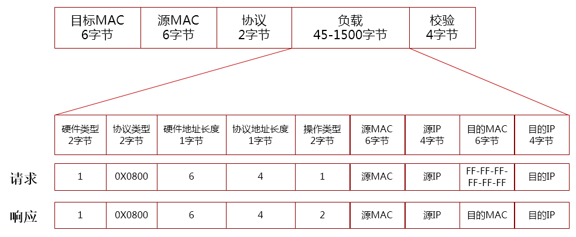

# ARP

以太网使用48bit以太网地址（硬件地址）来确定接收方，ARP协议将32bit IP地址映射到48bit以太网地址。


## ARP报文格式



ARP操作类型：

* 1，ARP请求
* 2，ARP响应
* 3，RARP请求
* 4，RARP响应


## ARP代理

当接收到ARP请求时，代替真实的接收端响应ARP请求，常见的ARP代理包括：

* Linux网络设备开启ARP代理
  * 以接收到ARP请求的设备的MAC来响应ARP请求: ```echo 1 > /proc/sys/net/ipv4/conf/eth0/proxy_arp```
* Linux VXLAN设备开启ARP代理
  * VXLAN设备接收到ARP请求后，以本地Neighbor表项来响应ARP请求: ```ip link add vtep0 type vxlan id 1001 dev eth0 proxy```
* OVS ARP代答
  * ``` 
	move:NXM_OF_ETH_SRC[]->NXM_OF_ETH_DST[],set_field:fe:ff:ff:ff:ff:ff->eth_src,set_field:2->arp_op,\
	move:NXM_NX_ARP_SHA[]->NXM_NX_ARP_THA[],set_field:fe:ff:ff:ff:ff:ff->arp_sha,\
	move:NXM_OF_ARP_TPA[]->NXM_NX_REG15[],move:NXM_OF_ARP_SPA[]->NXM_OF_ARP_TPA[],move:NXM_NX_REG15[]->NXM_OF_ARP_SPA[],IN_PORT
    ```  


## 免费ARP

免费ARP(gratuitous ARP)，目的MAC地址为FF-FF-FF-FF-FF(广播地址)，源IP地址等于目的IP地址，源MAC地址为发送主机的MAC地址，通常有几个用途：
* 系统启动时，发送免费ARP告知
* 大二层网络方案中，虚拟机热迁移后，通过免费ARP告知位置变化