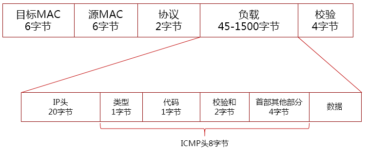

# ICMP

Internet Control Message Protocol,Internet控制报文协议,控制消息是指网络通不通、主机是否可达、路由是否可用等网络本身的消息。

## ICMP报文格式

### ICMP类型

| 类型 | 类型说明 |
|:----:|:-----|
|0 |ICMP回答|
|3 |目的站不可达|
|4 |源站抑制|
|5 |改变路由|
|8 |ICMP请求|
|9 |路由器通告|
|10|路由器询问|
|11|数据报的时间超时|
|12|数据报的参数有问题|
|13|时间戳请求|
|14|时间戳回答|
|17|地址掩码请求|
|18|地址掩码回答|

### ICMP类型和代码

| 类型 | 代码 | 类型说明 |
|:----:|:-----:|:-----|
|0 | 	0 	|Echo Reply--回显应答(Ping应答)|  
|3 | 	0 	|Network Unreachable--网络不可达|
|3 | 	1 	|Host Unreachable--主机不可达|
|3 | 	2 	|Protocol Unreachable--协议不可达|
|3 | 	3 	|Port Unreachable--端口不可达|
|3 | 	4 	|Fragmentation needed but no frag. bit set--需要进行分片但设置不分片比特|
|3 | 	5 	|Source routing failed--源站选路失败|
|3 | 	6 	|Destination network unknown--目的网络未知|
|3 | 	7 	|Destination host unknown--目的主机未知|
|3 | 	8 	|Source host isolated (obsolete)--源主机被隔离(作废不用)|
|3 | 	9 	|Destination network administratively prohibited--目的网络被强制禁止|
|3 | 	10 	|Destination host administratively prohibited--目的主机被强制禁止|
|4 | 	0 	|Source quench--源端被关闭(基本流控制)|
|5 | 	0 	|Redirect for network--对网络重定向| 
|5 | 	1 	|Redirect for host--对主机重定向|
|5 | 	2 	|Redirect for TOS and network--对服务类型和网络重定向|
|5 | 	3 	|Redirect for TOS and host--对服务类型和主机重定向| 
|8 | 	0 	|Echo request--回显请求(Ping请求)| 
|9 | 	0 	|Router advertisement--路由器通告|
|10| 	0 	|Route solicitation--路由器请求|
|11| 	0 	|TTL equals 0 during transit--传输期间生存时间为0|
|11| 	1 	|TTL equals 0 during reassembly--在数据报组装期间生存时间为0|
|12| 	0 	|IP header bad (catchall error)--坏的IP首部(包括各种差错)|
|12| 	1 	|Required options missing--缺少必需的选项| 
|13| 	0 	|Timestamp request (obsolete)--时间戳请求(作废不用)| 
|14|  		|Timestamp reply (obsolete)--时间戳应答(作废不用)|
|15| 	0 	|Information request (obsolete)--信息请求(作废不用)| 
|16| 	0 	|Information reply (obsolete)--信息应答(作废不用)| 
|17| 	0 	|Address mask request--地址掩码请求| 
|18| 	0 	|Address mask reply--地址掩码应答|

## ICMP洪水攻击

* 直接洪水攻击
   * 这样做需要本地主机的带宽和目的主机的带宽之间进行比拼，比如我的主机网络带宽是30M的，而你的主机网络带宽仅为3M，那我发起洪水攻击淹没你的主机成功率就很大了。这种攻击方式要求攻击主机处理能力和带宽要大于被攻击主机，否则自身被DoS了。
* 伪IP攻击
   * 在直接洪水攻击的基础上，将发送方的IP地址伪装成其他IP，如果是伪装成一个随机的IP，那就可以很好地隐藏自己的位置
   * 如果将自己的IP伪装成其他受害者的IP，受害主机1的icmp回复包也如洪水般发送给受害主机2
* 反射攻击
   * 反射攻击不再直接对目标主机，而是让其他一群主机误以为目标主机在向他们发送ICMP请求包，然后一群主机向目的主机发送ICMP应答包，造成来自四面八方的洪水淹没目的主机的现象。
* 放大网络
   * 发送ping广播地址到当前网络，并且把源IP地址改成攻击目标的IP地址，网络中的所有主机均会响应该ping request。

### ICMP攻击防范

* 限制ICMP数据包的带宽
* 拒绝所有的ICMP数据包

## traceroute

ping程序提供一个记录路由选项，但并不是所有的路由机都支持这个选项，而且IP首部选项字段最多也只能存储9个IP地址，因此开发traceroute是必要的。 traceroute利用了ICMP报文和IP首部的TTL字段。TTL是一个8bit的字段，为路由器的跳站计数器，也表示数据报的生存周期。每个处理数据报的路由器都需要将TTL减一。如果TTL为0或者1，则路由器不转发该数据报，如果TTL为1，路由器丢弃该包并给源地址发送一个ICMP超时报文（如果是主机接收到TTL为1的数据报可以交给上层应用程序）。

traceroute程序开始时发送一个TTL字段为1的UDP数据报（选择一个不可能的值作为UDP端口号），然后将TTL每次加1，以确定路径中每个路由器。每个路由器在丢弃UDP数据报的时候都返回一个ICMP超时报文（如：ICMP time exceeded in-transit, length 36），而最终主机则产生一个ICMP端口不可达报文（如： ICMP 74.125.128.103 udp port 33492 unreachable, length ）。

对每个TTL，发送3份数据报，并且计算打印出往返时间。如果5秒内未收到任意一份回应，则打印一个星号。

需要注意的是：

* 并不能保证现在的路由就是将来所采用的路由；
* 不能保证ICMP报文的路由与traceroute程序发出的UDP数据报采用同一路由；
* 返回的ICMP报文中信源的IP地址是UDP数据报到达的路由器接口的IP地址。
