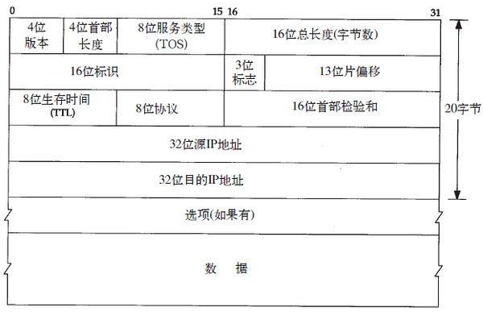
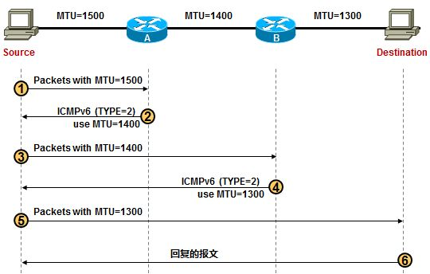

# IP协议

IP(Internet Protocol)网际协议，它在源地址和目的地址之间传送一种称之为数据包的东西，它还提供对数据大小的重新组装功能，以适应不同网络对包大小的要求。IP是TCP/IP中最为核心的协议，所有的TCP、UDP、ICMP等协议均以IP数据报的格式传输。IP协议提供不可靠、无连接的服务，它不保证数据报一定可以送达目的，也不保证数据报的先后次序。

> 以太网协议中以48位MAC地址来标识设备，该地址很不友好，所以开发了IP协议，用IP地址来标识设备

## IP报文格式

### IP包头字段

* 版本：指IP协议的版本号，0100为IPv4，0110为IPv6
* 首部长度：指IP头的长度，单位为4字节，所以IP头最长为60字节，可选字段最多为40字节
* 服务类型（ToS）：用来获得更好的服务。其中的前3位表示报文的优先级，后面的几位分别表示要求更低时延、更高的吞吐量、更高的可靠性、更低的路由代价等。对应位为1即有相应要求，为0则不要求。 
* 总长度：指首部和数据之和的长度,单位为字节，因此数据报的最大长度为65535字节。
* 标识：它是一个计数器，用来产生数据报的标识，该字段和Flags和Fragment Offest字段联合使用，对大的上层数据包进行分段（fragment）操作。
* 标志(flag)：目前只有前两位有意义，MF (More Fragment)置1表示后续还有分片报文，DF (Don't Fragment)置1表示不允许分片
* 片偏移：指较长的分组在分片后某片在原分组中的相对位置，片偏移以8个字节为偏移单位
* 生存时间：TTL(Time To Live)数据报在网络中可通过的路由器数的最大值
* 协议：该字段指出在上层（网络7层结构或TCP/IP的传输层）使用的协议，可能的协议有UDP、TCP、ICMP、IGMP、IGP等
* 首部检验和：只检验数据报的首部不检验数据部分，这里不采用 CRC 检验码而采用简单的计算方法
* 源地址：发送方IP地址
* 目的地址：接收方IP地址	
* 可选字段
* 填充

### 服务类型

* Bits 0-2:  Precedence.                                     （优先权）
* Bit    3:  0 = Normal Delay,      1 = Low Delay.           （延迟）
* Bits   4:  0 = Normal Throughput, 1 = High Throughput.     （吞吐量）
* Bits   5:  0 = Normal Relibility, 1 = High Relibility.     （可靠性）
* Bit  6-7:  Reserved for Future Use.                        （6：开销；7：保留）    

### 服务优先级

* 000 普通 (Routine)
* 001 优先的 (Priority)
* 010 立即的发送 (Immediate)
* 011 闪电式的 (Flash)
* 100 比闪电还闪电式的 (Flash Override)
* 101 CRITIC/ECP
* 110 网间控制 (Internetwork Control)
* 111 网络控制 (Network Control)

### 协议类型

* 1	 ICMP（Internet Control Message Protocol）
* 2	 IGMP（Internet Group Management Protocol）
* 4	 IP in IP（encapsulation）
* 6	 TCP（Transmission Control Protocol）
* 17 UDP（User Datagram Protocol）
* 45 IDRP（Inter-Domain Routing Protocol）
* 46 RSVP（Resource Reservation Protocol）
* 47 GRE（Generic Routing Encapsulation）
* 54 NHRP（NBMA Next Hop Resolustion Protocol）
* 88 IGRP（Cisco Internet Gateway Routing Protocol）
* 89 OSPF（Open Shortest Path First）

### 可选字段
* Loose Source Routing(松散源路由选择)：可以指定数据包传递的路径；可以跨越中间多台路由器；
* Strict Soutce Routing(严格源路由选择)：可以指定数据包传递的路径；不同于loose的是，数据包必须严格按照路由转发，如果下一跳不在路由表中，将会产生错误。
* Record Route(记录路由)：记录数据包离开每台路由的出接口，区别于traceroute的是，record可以记录来 回的路径，而traceroute只可以记录单方向的；
* Timestamp（时间戳）：记录数据包到达设备的时间；
* Verbose（详细内容）：查看数据包传送的详细内容；一般用于查看延迟；
* Padding（填充）：通过在可选字段后面添加0来补足32位，为了确保报头长度是32的倍数

## IP地址

### A类地址 
* IP地址范围：1.0.0.0--127.255.255.255
* 私有IP范围：10.0.0.0--10.255.255.255

### B类地址
* IP地址范围：128.0.0.0--191.255.255.255
* 私有IP范围：172.16.0.0--172.31.255.255

### C类地址
* IP地址范围：192.0.0.0--223.255.255.255
* 私有IP范围：192.168.0.0--192.168.255.255

### D类地址（组播地址）
* IP地址范围：224.0.0.0--239.255.255.255
* 本地组播地址：224.0.0.X

### E类地址（保留地址）
* IP地址范围：240.0.0.0--255.255.255.255

### 其他特殊IP地址
* 回送地址：127.0.0.1
* 广播地址：网络地址+主机地址全为1
* 本地广播地址：255.255.255.255

## MTU

最大传输单元（Maximum Transmission Unit，MTU）是指一种通信协议的某一层上面所能通过的最大数据包大小（以字节为单位）。最大传输单元这个参数通常与通信接口有关（网络接口卡、串口等）。

因为协议数据单元的包头和包尾的长度是固定的，MTU大小各有利弊：

* MTU越大通信效率越高
* MTU越大传送数据包的延迟越大
* MTU越大数据包中 bit位发生错误的概率也越大

总结来说，MTU越大，通信效率越高而传输延迟增大，所以要权衡通信效率和传输延迟选择合适的MTU。 以太网的MTU值是1500 bytes。

## PMTU

PMTU（Path Maximum Transmission Unit Discovery），用途是动态的确定从发送端到接收端整个路径上的最小 MTU，从而避免分包。注意，PMTU 只支持 TCP，对其他协议比如 UDP 无效。而且，如果发送方已经开启了 PMTU，那么它发送的所有 TCP/IP 包的 DF 标志都被设置为 1 即不再允许分包。当网络路径上某个路由器发现发送者的包因为超过前面转发路径的 MTU 而无法发送时，它向发送者返回一个 ICMP "Destination Unreachable" 消息，其中包含了那个 MTU，然后发送者就会在它的路由表中将该mtu值保存下来，再使用较小的 MTU 重新发出新的较小的包。

## IP切片

以太网的MTU值是1500 bytes，发送者的协议高层向IP层发送了长度为3008 bytes的数据报文，则该报文在添加20 bytes的IP包头后IP包的总长度是 3028 bytes，因为3028 > 1500，所以该数据报文将被分片。
注意：分片时仅仅对上层的数据进行分片，不需要对原来的IP首部分片，所以要分片的数据长度只有3008，而不是3028，因为每个分片报文都包含IP头。
分片过程如下：
1. 首先计算最大的IP包中IP净荷的长度 =MTU-IP包头长度=1500-20= 1480 bytes。
2. 然后把3008 bytes按照1480 bytes的长度分片，将要分为3片，3008= 1480+1480+48。
3. 最后发送者将为3个分片分别添加IP包头，组成3个IP包后再发送，3个IP包的长度分别为1500 bytes、1500 bytes和 68 bytes。

### 分片带来的问题

* 分片带来的性能消耗
   * 分片和重组会消耗发送方、接收方一定的CPU等资源，如果存在大量的分片报文的话，可能会造成较为严重的资源消耗
   * 分片对接收方内存资源的消耗较多，因为接收方要为接收到的每个分片报文分配内存空间，以便于最后一个分片报文到达后完成重组
* 分片丢包导致的重传问题
   * 如果某个分片报文在网络传输过程中丢失，那么接收方将无法完成重组，如果应用进程要求重传的话，发送方必须重传所有分片报文而不是仅重传被丢弃的那个分片报文，这种效率低下的重传行为会给端系统和网络资源带来额外的消耗。
* 分片攻击
   * 黑客构造的分片报文，但是不向接收方发送最后一个分片报文，导致接收方要为所有的分片报文分配内存空间，可由于最后一个分片报文永远不会达到，接收方的内存得不到及时的释放（接收方会启动一个分片重组的定时器，在一定时间内如果无法完成重组，将向发送方发送ICMP重组超时差错报文，关于ICMP重组超时差错，只要这种攻击的分片报文发送的足够多、足够快，很容易占满接收方内存，让接收方无内存资源处理正常的业务，从而达到DOS的攻击效果。
* 安全隐患
   * 由于分片只有第一个分片报文具有四层信息而其他分片没有，这给路由器、防火墙等中间设备在做访问控制策略匹配的时候带来了麻烦
   * 如果路由器、防火墙等中间设备不对分片报文进行安全策略的匹配检测而直接放行IP分片报文，则有可能给接收方带来安全隐患和威胁，因为黑客可以利用这个特性，绕过路由器、防火墙的安全策略检查对接收方实施攻击
   * 如果路由器、防火墙等中间设备对这些分片报文进行重组后在匹配其安全策略，那么又会对这些中间设备的资源带来极大的消耗，特别是在遇到分片攻击的时候，这些中间设备会在第一时间内消耗完其所有内存资源，从而导致全网中断的严重后果

综上，需要尽量避免发生分片和重组，因为分片重组对网络影响很大。

## 云场景下的MTU问题

云场景下，由于Overlay成为主流虚拟化网络方案，虚拟机的MTU值有如下几种典型配置：

* 虚拟机的MTU为1450，即1500减去50个字节的外层VXLAN包长度
* 虚拟机的MTU为1500，在网络数据面的设备上增大MTU值，例如设置为1600
* 虚拟机的MTU为9000，可以显著增加虚拟机的TCP带宽（报文聚合更多）

## IP路由

IP路由选择是逐跳进行的。IP并不知道到达任何目的的完整路径（当然，除了那些与主机直接相连的）。所有的IP路由选择只为数据报传输提供下一站路由器的I P地址。它假定下一站路由器比发送数据报的主机更接近目的，而且下一站路由器与该主机是直接相连的。

IP路由选择主要完成以下这些功能：

1. 搜索路由表，寻找能与目的IP地址完全匹配的表目（网络号和主机号都要匹配）。如果找到，则把报文发送给该表目指定的下一站路由器或直接连接的网络接口（取决于标志字段的值）。
2. 搜索路由表，寻找能与目的网络号相匹配的表目。如果找到，则把报文发送给该表目指定的下一站路由器或直接连接的网络接口（取决于标志字段的值）。目的网络上的所有主机都可以通过这个表目来处置。例如，一个以太网上的所有主机都是通过这种表目进行寻径的。这种搜索网络的匹配方法必须考虑可能的子网掩码。关于这一点我们在下一节中进行讨论。
3. 搜索路由表，寻找标为“默认”的表目。如果找到，则把报文发送给该表目指定的下一站路由器。

如果上面这些步骤都没有成功，那么该数据报就不能被传送。如果不能传送的数据报来自本机，那么一般会向生成数据报的应用程序返回一个“主机不可达”或“网络不可达”的错误。
