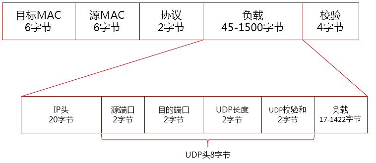

# UDP

UDP 是User Datagram Protocol的简称，中文名是用户数据报协议，是OSI（Open System Interconnection，开放式系统互联） 参考模型中一种无连接的传输层协议，提供面向事务的简单不可靠信息传送服务。

## UDP报文格式

### UDP报头字段
* 源端口：发送方的端口号
* 目的端口：接收方的端口号
* UDP长度：UDP用户数据报的长度（包含UDP头长度），其最小值是8（仅有首部）
* UDP校验和：检测UDP用户数据报在传输中是否有错，有错就丢弃

## UDP校验和

UDP的校验和通过三个部分计算得到：
* 伪首头：源IP地址（4字节）、目的IP地址（4字节）、0X00（1字节）、协议类型（0x11，1字节）、UDP数据长度（2字节），构成12个字节
* UDP头：8字节
* UDP负载

### UDP检验和计算方法

1. 按每16位求和得出一个32位的数
2. 如果这个32位的数，高16位不为0，则高16位加低16位再得到一个32位的数
3. 重复第2步直到高16位为0，将低16位取反，得到校验和

### UDP校验和更新
* SNAT和DNAT
* VXLAN报文GSO分段

