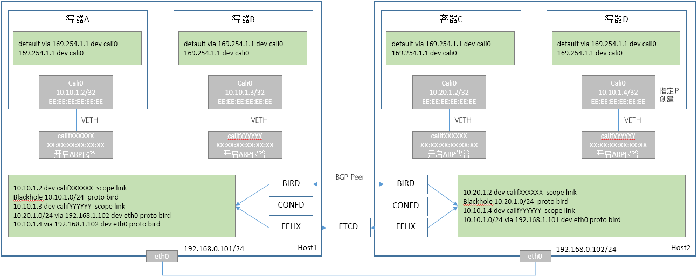
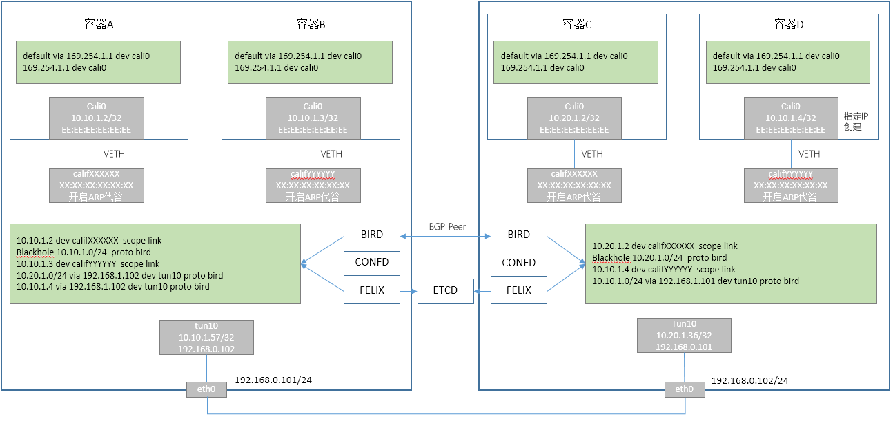

# Calico容器网络方案

Calico共有两个容器网络方案：Calico BGP和Calico IPIP。

## Calico BGP方案

Calico BGP数据面如下：

### 同节点容器通信

容器A访问容器B，数据面流程如下：

1. 容器A内的calic0设备的掩码长度为32，即与容器B属于不同网络，需要通过网关进行通信
2. 容器A查找路由表，存在default路由，下一跳为169.254.1.1，且169.254.1.1可通过cali0直达
3. 容器A发送ARP请求给169.254.1.1，ARP请求报文到达veth设备的另一端califXXX接收
4. 由于califXXX设备使能了ARP proxy，Linux内核会以califXXX的MAC地址来响应ARP请求，并从califXXX发出；
5. 容器A收到ARP响应后，得到169.254.1.1的MAC地址，封装二层报文，发送报文给169.254.1.1，报文从cali0设备发出
6. 报文通过veth设备进入Host内核协议栈；
7. 由于目的IP不在本节点，Host内核会进行报文转发（ip_forward已开启）
8. Host内核超找路由表，发现路由条目，通过califYYYYYY设备可以直达
9. Host内核发送ARP请求给容器B，通过califYYYYYY设备发出
10. ARP请求报文通过veth设备到达容器B，容器B响应ARP请求，ARP响应通过veth设备到达Host内核
11. Host内核更新报文的二层头，从califYYYYYY设备发出
12. 报文通过veth设备到达容器B

> Host的本地路由在创建容器的时候就能够建立，不依赖BGP

### 跨节点容器通信

容器A访问容器D，数据面流程如下：

1. 容器A内的calic0设备的掩码长度为32，即与容器B属于不同网络，需要通过网关进行通信
2. 容器A查找路由表，存在default路由，下一跳为169.254.1.1，且169.254.1.1可通过cali0直达
3. 容器A发送ARP请求给169.254.1.1，ARP请求报文到达veth设备的另一端califXXX接收
4. 由于califXXX设备使能了ARP proxy，Linux内核会以califXXX的MAC地址来响应ARP请求，并从califXXX发出；
5. 容器A收到ARP响应后，得到169.254.1.1的MAC地址，封装二层报文，发送报文给169.254.1.1，报文从cali0设备发出
6. 报文通过veth设备进入Host1内核协议栈；
7. 由于目的IP不在本节点，Host1内核会进行报文转发（ip_forward已开启）
8. Host1内核查找路由表，发现路由条目，通过下一跳192.168.0.102（Host2）可以到达，而192.168.0.102可以直达
9. Host1内核发送ARP请求给Host2，通过eth0设备发出
10. ARP请求报文通过底层网络到达Host2，Host2响应ARP请求，通过底层网络到达Host1
11. Host1内核修改报文二层头，发送报文给Host2
12. Host2收包报文，由于目的IP不在本节点，Host2内核会进行报文转发（ip_forward已开启）
13. Host2查找路由表，发现路由条目，通过califYYYYY设备可以直达
14. Host2内核发送ARP请求给容器D，通过califYYYYY设备发出
15. ARP请求报文通过veth设备到达容器D，容器B响应ARP请求，ARP响应通过veth设备到达Host2内核
16. Host2内核更新报文的二层头，从califYYYYY设备发出
17. 报文通过veth设备到达容器D

> Host1中关于容器D的路由信息是如何获取的？ 这就是Calico BGP方案的核心，答案是通过BIRD在节点间同步得到

### Calico BGP数据面总结

* 方案基本原理
  * 容器IP的掩码是32位，强制走三层转发
  * 同步各节点的路由信息，使所有节点掌握全局的网络转发规则
* 方案优势
  * 方案不依赖底层网络，只要求底层三层能通即可
  * 支持按节点分配IP网段，同时还可以自定义容器IP（路由通过网络长度优先匹配）
* 方案劣势
  * 本节点也需要通过路由转发，性能较差 
  * 路由通过BIRD同步，属于异步同步方式，容器创建后立即通信可能存在路由未同步的风险
  * 在底层网络中暴露了容器网络地址
  * 当节点之间二层不可达时，需要在路由器上发布路由，否则容器之间无法通信
* 改进想法
  * 避免169.254.1.1的ARP请求
    * 可以固定califXX设备的MAC地址
	* 容器内固化ARP表项
  * 使用etcd同步路由信息，去除对BGP的依赖
  
  
## Calico IPIP方案

由于Calico BGP方案把容器网络暴露到了底层网络中， 而Calico IPIP方案把容器网络信息通过IP隧道屏蔽了，而且通过IPIP方案可以提供加密传输的功能，防止报文被窃听

Calicao IPIP数据面如下：

### 同节点容器通信

容器A访问容器B，数据面流程如下（同Calico BGP）：

1. 容器A内的calic0设备的掩码长度为32，即与容器B属于不同网络，需要通过网关进行通信
2. 容器A查找路由表，存在default路由，下一跳为169.254.1.1，且169.254.1.1可通过cali0直达
3. 容器A发送ARP请求给169.254.1.1，ARP请求报文到达veth设备的另一端califXXX接收
4. 由于califXXX设备使能了ARP proxy，Linux内核会以califXXX的MAC地址来响应ARP请求，并从califXXX发出；
5. 容器A收到ARP响应后，得到169.254.1.1的MAC地址，封装二层报文，发送报文给169.254.1.1，报文从cali0设备发出
6. 报文通过veth设备进入Host内核协议栈；
7. 由于目的IP不在本节点，Host内核会进行报文转发（ip_forward已开启）
8. Host内核超找路由表，发现路由条目，通过califYYYYYY设备可以直达
9. Host内核发送ARP请求给容器B，通过califYYYYYY设备发出
10. ARP请求报文通过veth设备到达容器B，容器B响应ARP请求，ARP响应通过veth设备到达Host内核
11. Host内核更新报文的二层头，从califYYYYYY设备发出
12. 报文通过veth设备到达容器B

> Host的本地路由在创建容器的时候就能够建立，不依赖BGP

### 跨节点容器通信

容器A访问容器D，数据面流程如下：

1. 容器A内的calic0设备的掩码长度为32，即与容器B属于不同网络，需要通过网关进行通信
2. 容器A查找路由表，存在default路由，下一跳为169.254.1.1，且169.254.1.1可通过cali0直达
3. 容器A发送ARP请求给169.254.1.1，ARP请求报文到达veth设备的另一端califXXX接收
4. 由于califXXX设备使能了ARP proxy，Linux内核会以califXXX的MAC地址来响应ARP请求，并从califXXX发出；
5. 容器A收到ARP响应后，得到169.254.1.1的MAC地址，封装二层报文，发送报文给169.254.1.1，报文从cali0设备发出
6. 报文通过veth设备进入Host1内核协议栈；
7. 由于目的IP不在本节点，Host1内核会进行报文转发（ip_forward已开启）
8. Host1内核查找路由表，发现路由条目，通过下一跳192.168.0.102（Host2）可以到达，而192.168.0.102可以直达
9. Host内核发送ARP请求给Host2，通过eth0设备发出
10. ARP请求报文通过底层网络到达Host2，Host2响应ARP请求，通过底层网络到达Host1
11. Host1内核发送报文给TUN10设备（因为IPIP是三层设备，不需要二层头，所以不会向192.168.0.102发送ARP请求）
12. IPIP设备封装外层IP头（IPIP设备是端到端设备，创建时指定了对端）
13. IPIP设备封装外层MAC头，并从eth0发出报文
14. Host2接收到IPIP报文，交给ipip协议进行收包处理
15. ipip协议处理完成后，最终进行ip_forward处理
16. Host2查找路由表，发现路由条目，通过califYYYYY设备可以直达
17. Host2内核发送ARP请求给容器D，通过califYYYYY设备发出
18. ARP请求报文通过veth设备到达容器D，容器B响应ARP请求，ARP响应通过veth设备到达Host2内核
19. Host2内核更新报文的二层头，从califYYYYY设备发出
20. 报文通过veth设备到达容器D

### Calico IPIP数据面总结

* 由于IPIP为管道设备，当节点数量增加时，IPIP设备也同步增加
  * 可以使用VXLAN设备来代替IPIP设备，但是性能有损失
* 对节点外的设备，屏蔽了容器网络信息，对底层网络无依赖

