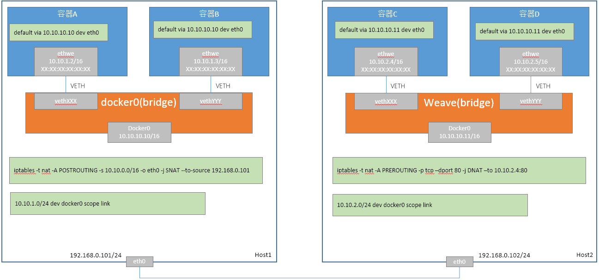
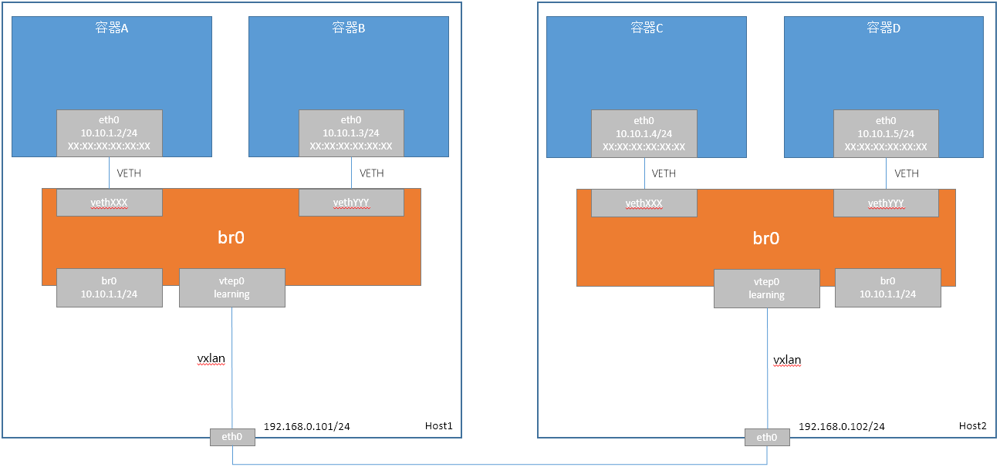

# Docker原生容器网络方案

Docker原生共有两个容器网络方案：Docker NAT和Docker Overlay。

## Docker NAT方案

Docker NAT数据面如下：

### 同节点容器通信

容器A访问容器B，数据面流程如下：

1. 容器A和容器B在相同网络，直接发送
2. 容器A向容器B发送ARP请求，docker0交换机flood该ARP请求
   1. 容器B收到ARP请求后，会响应ARP请求
   2. docker0接口收到ARP请求后，无响应
3. docker0交换机转发ARP响应给容器A
4. 容器A接收到ARP响应，封装二层报文并发出
5. docker0交换机直接转发报文到容器B
6. 容器B接收到报文

### 跨节点容器通信

容器A访问容器D，Docker NAT模式不支持容器之间之间通信，需要通过把地址转化为节点IP地址：

1. 假设容器A访问容器D:80（创建容器D时映射该端口到节点，假设映射到节点上的也是80端口）
2. 实际容器A向192.168.0.102:80发送报文
3. 由于192.168.0.102与容器A在不同网络，查找路路由，匹配到路由通过10.10.10.10可达
4. 容器A向10.10.10.10发送ARP请求
5. docker0交换机把报文转发给docker0接口，并上送至协议栈，协议栈响应ARP请求
6. docker0交换机转发ARP响应给容器A
7. 容器A收到ARP响应，封装二层报文并发出，docker0交换机转发报文到docker0接口，并上送至协议栈
8. Host1内核判断报文需要转发，并且通过eth0可以直接到达
9. Host1内核IP层发送报文时，会经过在POSTROUTING hook点，报文的源IP地址会被转化为192.168.0.101
10. 报文发送到Host2节点
11. Host2收到报文，并上送ip层处理，会经过PREROUTING hook点，目的IP会被修改为容器D的IP地址，目的端口会被修改为容器的端口
12. Host2内核判断该报文需要转发，查找到路由表，通过docker0接口可以直达
13. Host2内核发送ARP请求到docker0接口（提前配置ARP表项可避免此次ARP请求）
14. docker0交换机flood ARP请求
15. 容器D收到ARP请求并响应
16. docker0交换机转发ARP到docker0接口，并上送至协议栈
17. 协议栈更新报文的二层头，并发送到docker0接口，docker0交换机转发报文给容器D
18. 容器D收到报文，并响应（响应报文的目的IP为192.168.0.101）
19. docker0转发报文到docker0接口，并上送至协议栈
20. Host2协议栈会在POSTROUTING hook点，把源IP和源端口修改为节点IP和节点端口（TC实现）
21. Host1收到报文，Host1内核IP层发送报文时，会经过在PREROUTING hook点，并把目的IP修改为容器A的IP地址，端口修改为容器A的端口
22. Host1查询本地路由，找到通过docker0直接可以到达
23. Host1修改二层报文头，并发送报文到docker0接口
24. docker0交换机转发报文到容器A
25. 容器A接收到响应报文

### Docker NAT方案总结

* 不依赖etcd等分布式组件
* 依赖iptables框架，对性能影响比较大

## Docker Overlay方案

Docker Overlay数据面如下：

### 同节点容器通信

容器A访问容器B，数据面流程如下（同Flannel UDP）：

1. 容器A和容器B在相同网络，直接发送
2. 容器A向容器B发送ARP请求，br0交换机flood该ARP请求
   1. 容器B收到ARP请求后，会响应ARP请求
   2. 其他接口收到ARP请求后，不会有ARP响应
3. br0交换机转发ARP响应给容器A
4. 容器A接收到ARP响应，封装二层报文并发出
5. weave交换机直接转发报文到容器B
6. 容器B接收到报文

### 跨节点容器通信

容器A访问容器D，数据面流程如下（类似Flannel VXLAN旧版）：

1. 容器A和容器D在相同同网络，直接发送
2. 容器A向容器D发送ARP请求
3. br0广播该ARP请求
4. vtep0收到ARP请求
5. vtep0设备封装外层vxlan、UDP、IP和MAC头，有两种方案
   1. vtep0配置arp proxy，查找内核ARP表项，并响应应答
   2. vtep0发送ARP请求到所有的对端vtep0（假设是此种）
6. Host2 接收到ARP请求报文，通过UDP Socket，并进入到VXLAN解包处理，最终作为vxlan设备收包处理，vxlan设备挂载到br0交换机
7. br0交换机flood该ARP请求
8. 容器D接收到ARP请求，并响应，br0交换机转发ARP响应报文到vtep0设备
9. 由于vtep0设备开启了learning，此时vtep0知道对端vtep0是在192.168.0.101
10. vtep0封装vxlan报文并发送至Host1
11. Host1接收到ARP响应报文，通过UDP Socket，并进入到VXLAN解包处理，最终作为vxlan设备收包处理，vxlan设备挂载到br0交换机
12. br0交换机转发ARP响应报文给容器A
13. 容器A封装二层报文头，并发送
14. br0交换机转发报文到vtep0设备
15. vtep0设备开启了learning，此时vtep0知道对端vtep0是在192.168.0.102
16. vtep0封装vxlan报文并发送至Host2
17. Host2接收到报文，通过UDP Socket，并进入到VXLAN解包处理，进入br0交换机
18. br0交换机转发报文给容器D
19. 容器D接收到报文

### Docker Overlay方案总结
* 不依赖etcd等分布式组件
* 不依赖同步组件，不需要预设信息
* 采用vxlan学习的方式，首包延时会较大

## 相关阅读

