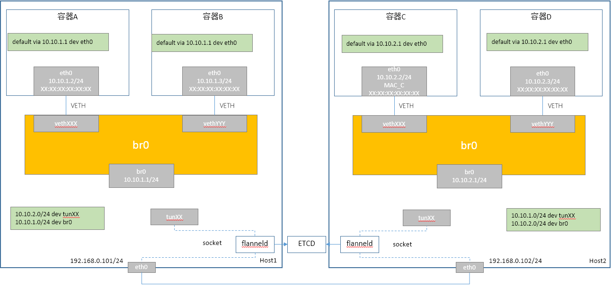
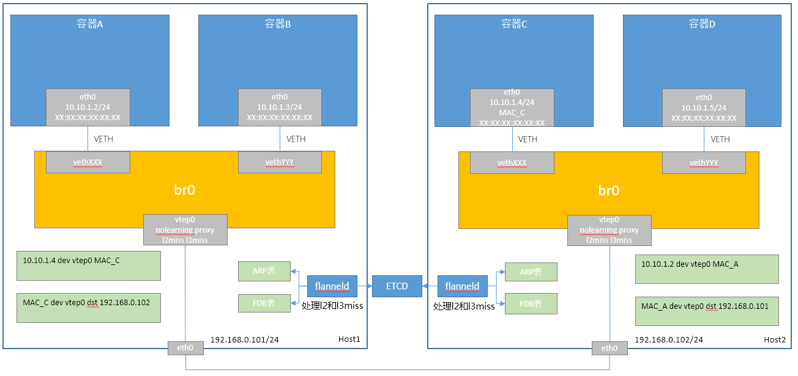
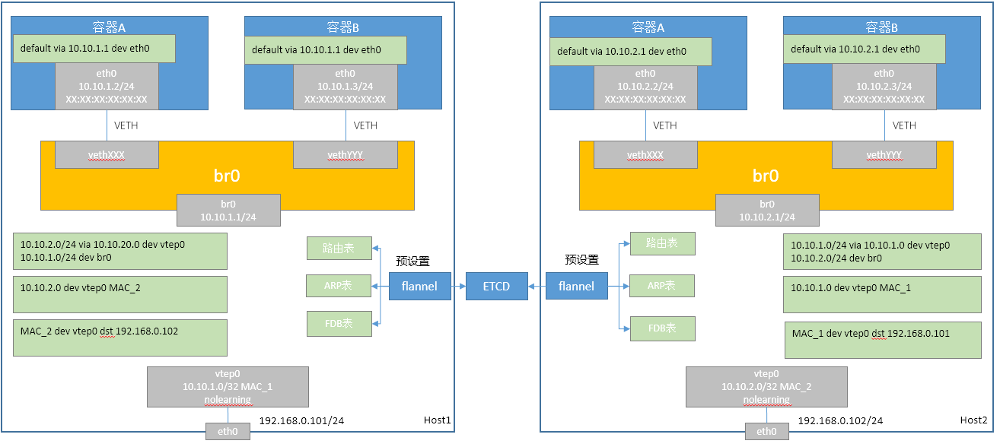

# Flannel容器网络方案

Flannel共有三个容器网络方案：Flannel UDP、Flannel VXLAN旧和Flannel VXLAN新。

## Flannel UDP方案

Flannel UDP数据面如下：



### 同节点容器通信

容器A访问容器B，数据面流程如下：

1. 容器A和容器B在相同网络，直接发送
2. 容器A向容器B发送ARP请求，br0交换机flood该ARP请求
3. 容器B接收到ARP请求，并响应
4. br0交换机flood该ARP响应
4. 容器A接收到ARP响应，封装二层报文并发出
5. br0交换机直接转发报文到容器B
6. 容器B接收到报文


### 跨节点容器通信

容器A访问容器D，数据面流程如下：

1. 容器A和容器D在不同网络，通过网关转发
2. 容器A发送ARP请求给网关（10.10.1.1）
3. 节点1内核响应ARP请求，并发送到br0口
4. br0交换机转发ARP响应给容器A
5. 容器A收到ARP请求，封装二层报文（目的MAC为网关的MAC），并发出报文
6. 报文通过veth设备到达br0，并通过br0接口上送至节点内核
7. Host1内核根据报文目的IP地址，判断需要路由转发，查找路由表并匹配，通过tunX设备直接送达
8. Host1内核发送ARP请求给容器D，并发送到tunX设备上
9. flanneld创建了tunX设备的socket，flanned收到ARP请求报文
10. flanneld响应ARP请求，并通过tunX socket发送ARP响应，该响应报文会被tunX设备接收并进入协议栈
11. Host1内核收到ARP响应后，修改报文二层头，并发送给tunXX设备
12. flanneld收到该报文，并根据拓扑信息，把该报文封装在UDP中，flanneld发送UDP报文给Host2
13. Host2接收到UDP报文，经过协议栈上送给flanneld进程
14. flanneld解封外层报文，并把内层报文通过tunXX设备发送给内核
15. Host2内核根据报文的目的IP地址，查找路由，发现通过br0可以直达
16. Host2内核发送ARP请求给容器D，并发送给br0接口
17. br0交换机转发ARP请求给容器D，容器D响应ARP请求，ARP响应通过br0接口上送到协议栈
18. Host2内核更新报文的二层头，并发送报文到br0接口
19. br0交换机转发报文给容器D
20. 容器D接收到报文

flanneld接收到ARP请求后如何响应，有两种做法：

* 以对端tunXX设备的MAC地址响应
* 固定tunXX设备的MAC地址，并且以该地址来响应


### Flannel UDP方案总结

* 网络性能差
  * 使用socket机制报文转发过程中，会从内核态切换到用户态；
  * 对数据进行了外层封装，内核对UDP封装没有优化；
* 可以支持数据加密
  * flanneld可以做很多定制化的工作，容易扩展


## Flannel VXLAN旧版方案

Flannel VXLAN旧版数据面如下：




### 同节点容器通信

容器A访问容器B，数据面流程如下（同Flannel UDP）：

1. 容器A和容器B在相同网络，直接发送
2. 容器A向容器B发送ARP请求，br0交换机flood该ARP请求
3. 容器B接收到ARP请求，并响应
4. br0交换机flood该ARP响应
4. 容器A接收到ARP响应，封装二层报文并发出
5. br0交换机直接转发报文到容器B
6. 容器B接收到报文


### 跨节点容器通信

容器A访问容器D，数据面流程如下：

1. 容器A和容器D在同一个网络
2. 容器A直接发送ARP请求
3. br0交换机flood ARP请求
4. vxlan设备接收到ARP请求
5. 由于vxlan设备配置了arp proxy，查找内核ARP表项，如果未找到，则上报L3MISS
6. flanneld接收到L3MISS，根据拓扑信息向内核中添加ARP表项
7. 容器A由于未收到ARP响应，将会再次发送ARP请求，此时vxlan设备能够响应该ARP请求（内核已添加该ARP表项）
8. 容器A收到ARP响应，封装二层报文，并发送
9. br0转发该报文到vxlan端口
10. vxlan封装外层vxlan头，udp头，IP头，mac头，其中目的IP需要根据内层报文目的MAC来获取
11. vxlan设备在内核FDB转发表查找目的MAC的转发项，未找到，则上报L2MISS
12. flanneld接收到L2MISS信息，根据拓扑信息，向内核中添加FDB表项
13. 此报文未成功发送，容器A重发报文
14. vxlan设备此时能够正确地封装外层报文，并发送报文
15. Host2接收到报文，通过UDP Socket，并进入到VXLAN解包处理，最终作为vxlan设备收包处理，vxlan设备挂载到br0交换机
16. br0交换机转发报文给容器D


由于L3MISS和L2MISS何时上报与网上的文档刚好相反，代码是最有说服力的，如下是VXLAN设备处理ARP请求的代码片段：

```    
	n = neigh_lookup(&arp_tbl, &tip, dev);	//查找本地ARP表项

	if (n) {
		struct vxlan_fdb *f;
		struct sk_buff	*reply;

		......

		if (netif_rx_ni(reply) == NET_RX_DROP)	
			dev->stats.rx_dropped++;
	} else if (vxlan->flags & VXLAN_F_L3MISS) {
		union vxlan_addr ipa = {
			.sin.sin_addr.s_addr = tip,
			.sin.sin_family = AF_INET,
		};

		vxlan_ip_miss(dev, &ipa);
	}
```    

如下代码是VXLAN设备封装外层IP头时，获取目的IP的代码片段：

```    
	f = vxlan_find_mac(vxlan, eth->h_dest);  //以目的mac查找FDB表
	did_rsc = false;

	if (f && (f->flags & NTF_ROUTER) && (vxlan->flags & VXLAN_F_RSC) &&
	    (ntohs(eth->h_proto) == ETH_P_IP ||
	     ntohs(eth->h_proto) == ETH_P_IPV6)) {
		did_rsc = route_shortcircuit(dev, skb);
		if (did_rsc)
			f = vxlan_find_mac(vxlan, eth->h_dest);
	}

	if (f == NULL) {
		f = vxlan_find_mac(vxlan, all_zeros_mac);  //以全零mac查找FDB表
		if (f == NULL) {
			if ((vxlan->flags & VXLAN_F_L2MISS) &&
			    !is_multicast_ether_addr(eth->h_dest))
				vxlan_fdb_miss(vxlan, eth->h_dest);	    //上报L2MISS

			dev->stats.tx_dropped++;
			kfree_skb(skb);
			return NETDEV_TX_OK;
		}
	}
```    

### Flannel VXLAN旧版方案总结

* 采用L2MISS和L3MISS机制，首包将会被丢弃，严重影响首包的延时
* L2MISS和L3MISS采用network link机制，性能低
* 容器为大二层网络，不支持多个网络
* 对节点网络无依赖（已经被封装到节点网络）
* 仅需要一个vtep设备，通过FDB表确定目标vtep设备
* 每个容器有一条ARP记录，大规模时节点上的ARP表项过多
* FDB记录数与容器数量成正比，大规模时节点上的FDB表项过多


## Flannel VXLAN新版方案

Flannel VXLAN新版数据面如下：



### 同节点容器通信

容器A访问容器B，数据面流程如下（同Flannel UDP）：

1. 容器A和容器B在相同网络，直接发送
2. 容器A向容器B发送ARP请求，br0交换机flood该ARP请求
3. 容器B接收到ARP请求，并响应
4. br0交换机flood该ARP响应
4. 容器A接收到ARP响应，封装二层报文并发出
5. br0交换机直接转发报文到容器B
6. 容器B接收到报文


### 跨节点容器通信

容器A访问容器D，数据面流程如下：

1. 容器A和容器D在不同网络，通过网关转发
2. 容器A发送ARP请求给网关（10.10.1.1）
3. 节点1内核响应ARP请求，并发送到br0接口
4. br0交换机转发ARP响应给容器A
5. 容器A收到ARP请求，封装二层报文（目的MAC为网关的MAC），并发出报文
6. br0交换机转发报文给br0接口，并进入到协议栈
7. Host1内核查找路由表，需要10.10.2.0转发，并且是通过vtep0设备
8. Host1内核查找ARP表项，发现了10.10.2.0的MAC表项，直接封装二层报文，并发送到vtep0设备
9. vtep0设备查找FDB表，发现10.10.2.0MAC的表项
10. vtep0封装外层vxlan头，udp头，ip头，mac头（由于节点在同一个网络，mac可以通过ARP请求获取）
11. vtep0发送报文
12. Host2接收到报文，通过UDP Socket，并进入到VXLAN解包处理，最终以vtep0收包并进入到协议栈
13. Host2内核查找路由表，发现通过br0可以直接到达
14. Host2内核发送ARP请求给容器D，并发送给br0接口
15. br0交换机转发ARP请求给容器D，容器D响应ARP请求，ARP响应通过br0接口上送到协议栈
16. Host2收到ARP响应，修改报文的二层头，并发送到br0接口
17. br0交换机转发报文给容器D
18. 容器D接收到报文

> 其中目的vtep设备的MAC地址，FDB表项都需要flanneld来预置

### Flannel VXLAN新版方案总结

* 每个节点分配一个网络CIDR
* 不支持创建容器时指定IP地址
* 节点的路由表数量较少，和节点数成正比
* 对节点网络无依赖（已经被封装到节点网络）
* 每个节点仅需要一个vtep设备，通过FDB表确定目标vtep设备

