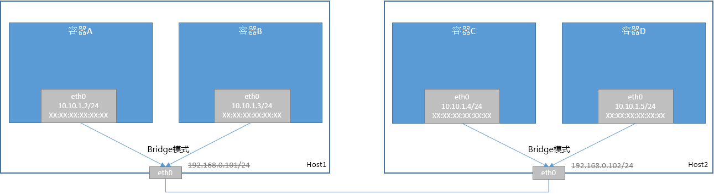

# macvlan容器网络方案

macvlan是Linux自带的虚拟网卡，基于同一个底层网卡的macvlan设备会形成一个逻辑的交换机，提供交换能力，性能优化linux bridge。

## macvlan方案

macvlan数据面如下：

### 同节点容器通信

容器A访问容器B，数据面流程如下：

1. 容器A和容器B在相同网络，直接发送
2. 容器A向容器B发送ARP请求
3. macvlan交换机flood ARP请求
   1. 容器B收到ARP请求后，会响应ARP请求
   2. eth0接口收到ARP请求后，向节点网络发送ARP请求，但是并没有节点响应
4. macvlan交换机转发ARP响应给容器A
5. 容器A接收到ARP响应，封装二层报文并发出
6. macvlan交换机直接转发报文到容器B
7. 容器B接收到报文

### 跨节点容器通信

容器A访问容器D，数据面流程如下：

1. 容器A和容器D在相同网络，直接发送
2. 容器A向容器D发送ARP请求
3. macvlan交换机flood ARP请求
   1. 容器B收到ARP请求后，不会响应ARP请求
   2. eth0接口收到ARP请求后，向节点网络发送ARP请求
4. Host2接收到ARP请求
5. macvlan交换机flood该ARP请求
6. 容器D接收到ARP请求，并响应
7. macvlan交换机转发ARP响应到eth0
8. Host1接收到ARP响应
9. macvlan交换机转发ARP请求给容器A
10. 容器A接收到ARP响应，封装二层报文并发出
11. 容器A封装报文二层头，并发送
12. macvlan交换机转发报文到eth0口
13. Host2接收此报文，macvlan交换机转发报文给容器D
14. 容器D接收到报文

### macvlan方案总结

* 典型的大二层网络方案，依赖节点网络支持广播功能
* 纯二层容器网络方案，性能几乎与host网络持平

