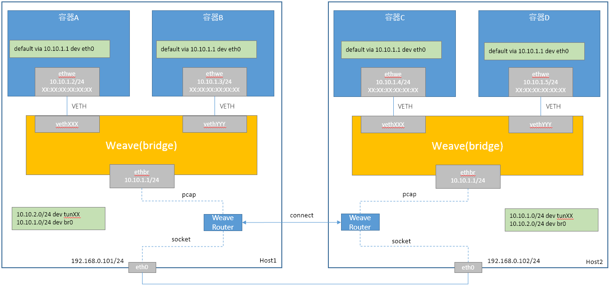
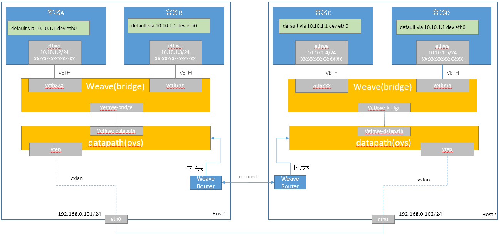

# Weave容器网络方案

Weave共有两个容器网络方案：Weave Sleeve和Weave Fast Datapath。

## Weave Sleeve方案

Weave Sleeve数据面如下：

### 同节点容器通信

容器A访问容器B，数据面流程如下：

1. 容器A和容器B在相同网络，直接发送
2. 容器A向容器B发送ARP请求，weave交换机flood该ARP请求
   1. 容器B收到ARP请求后，会响应ARP请求
   2. ethbr接口收到ARP请求后
      1. 内核收到该ARP请求后，检查目标IP不是本节点，丢弃ARP请求
	  2. Weave Router由于监听着ethbr接口，收到该ARP请求后，发现是本节点的则不响应ARP请求，直接丢弃
3. weave交换机转发ARP响应给容器A
4. 容器A接收到ARP响应，封装二层报文并发出
5. weave交换机直接转发报文到容器B
6. 容器B接收到报文

### 跨节点容器通信

容器A访问容器D，数据面流程如下：

1. 容器A和容器B在相同网络，直接发送
2. 容器A向容器B发送ARP请求，weave交换机flood该ARP请求
   1. 容器B收到ARP请求后，不会响应ARP请求
   2. ethbr接口收到ARP请求后
      1. 内核收到该ARP请求后，检查目标IP不是本节点，丢弃ARP请求
	  2. Weave Router由于监听着ethbr接口，收到该ARP请求后，发现是其他节点的，根据信息封装ARP响应报文，并发送到ethbr接口
3. weave交换机转发ARP响应给容器A
4. 容器A接收到ARP响应，封装二层报文并发出
5. weave交换机直接转发报文到ethbr接口
   1. 内核收到该报文后，将丢弃该报文（报文的目的MAC非ethbr接口的MAC地址）
   2. Weave Router由于监听着ethbr接口，收到该报文后，发现是其他节点的，则将该报文封装到UDP报文中，并发送到对端Weave Router
6. 节点2接收到UDP报文，并上送给Weave Router进程
7. Weave Router将报文发送到ethbr接口
8. weave交换机直接转发报文到容器D
9. 容器D接收到报文

### Weave Sleeve方案总结

* 不依赖etcd等分布式组件
* 使用pcap接收网络报文存在报文拷问问题，性能差
* 数据转发过程存在一次内核态和用户态之间的切换，性能差
* weave router之间支持加密，适用于internet

## Weave Fast Datapath方案

Weave Fast Datapath数据面如下：

### 同节点容器通信

容器A访问容器B，数据面流程如下（同Flannel UDP）：

1. 容器A和容器B在相同网络，直接发送
2. 容器A向容器B发送ARP请求，weave交换机flood该ARP请求
   1. 容器B收到ARP请求后，会响应ARP请求
   2. ethbr接口收到ARP请求后，并转发出去后，不会有ARP响应
3. weave交换机转发ARP响应给容器A
4. 容器A接收到ARP响应，封装二层报文并发出
5. weave交换机直接转发报文到容器B
6. 容器B接收到报文

### 跨节点容器通信

容器A访问容器D，数据面流程如下：

1. 容器A和容器B在相同网络，直接发送
2. 容器A向容器B发送ARP请求，weave交换机flood该ARP请求
   1. 容器B收到ARP请求后，不会响应ARP请求
   2. ethbr接口收到ARP请求后，发送到datapath交换机
      * 猜测1： datapath交换机上配置ARP请求的流表，收到此类请求后，上送至controller，即Weave Router，Weave Router下发流表
	  * 猜测2： datapath交换可以响应一个假的MAC地址，该MAC地址到对端的datapath交换机上修改成正确的
	  * 猜测3： datapath直接转发该ARP请求，通过vtep设备到达对端
3. 容器A未收到ARP响应，继续发送ARP请求，此次能够收到ARP响应（本数据流按照猜测1来讲述，如果是猜测3可以参考第6步的处理）
4. 容器A接收到ARP响应，封装二层报文并发出
5. weave交换机直接转发到ethbr，进入到datapath交换机，交换机flood报文
6. vtep接口收到报文，需要封装外层VXLAN、UDP、IP和MAC头
   * 核心问题是找到对端vtep的IP地址，vtep设备开启了learning，所以猜测有三种做法:
     1. 使用组播，创建vtep设备时指定组播地址，当不确定目的vtep时，通过组播发送报文
	 2. 使用单播，创建vtep设备时指定其他的vtep
	 3. 使用单播，创建vtep设备时不指定其他vtep，通过FDB表项中添加全零MAC地址的表项，效果同2
7. Host2收到报文，上送到vtep设备，并进入datapath交换机，并flood该报文
8. 报文经过Vethwe-datapath进入weave交换机，并转发给容器D
9. 容器D接收到报文

### Weave Fast Datapath方案总结

* 不依赖etcd等分布式组件
* vxlan采用learning机制，不适用于大规模场景

