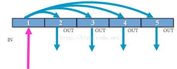
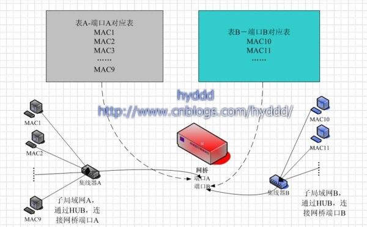
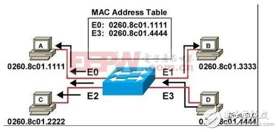
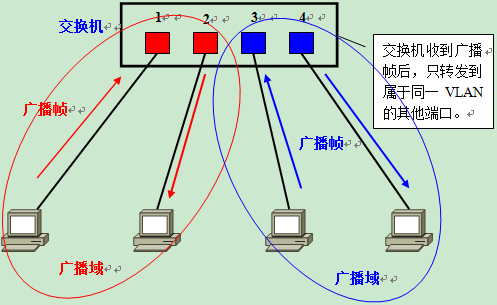
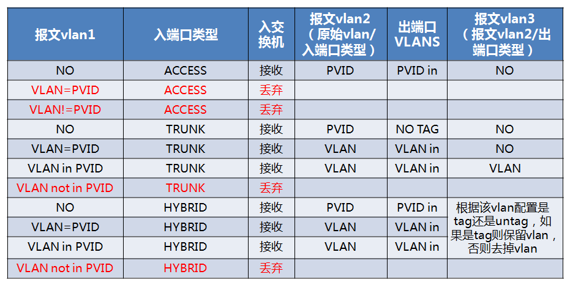
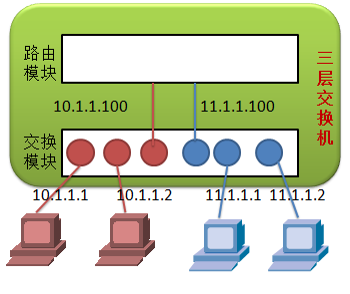

# 交换机

交换机是当今以太网的最为主流以太网设备，本章将以时间顺序介绍以太网交换设备。

## HUB

HUB是以太网早期设备，实现设备之间的网络互连，工作在物理层。

### HUB工作原理

设备接收到报文后，复制报文到其他端口发出，hub设备连接的所有节点都在同一个冲突域，显然性能无法满足以太网的发展需要。

## 网桥

网桥也是以太网早期设备，将HUB连接的冲突域一分为二，工作在数据链路层，一定程度上改善了性能。

### 网桥工作原理

设备从端口接收到报文后，把SMAC添加到端口所在的网络：

1. 判断报文所属的网络：
2. 属于对端网络，复制报文到对端端口发出；
3. 属于当前网络，丢弃报文；
4. 报文不确定属于哪个网络，同2；
5. 报文是广播报文，同2；

网桥设备仅支持两个接口，所以性能改善优先，但是MAC学习+广播的机制为二层交换提供了思路，其实当网桥设备把端口数增大后，其实就是一个二层交换机了。

## 二层交换机

二层交换机解决了通过HUB和网桥连接节点的冲突域问题，最优情况下一个端口即一个冲突域。

### 二层交换机工作原理

设备接收到报文后，把SMAC、端口号添加到MAC表项中，读取报文的目的MAC地址，根据目的MAC地址查找MAC表项：

1. 找到MAC表项
   1. 如果源MAC的MAC表项等于该端口，丢弃报文
   2. 其他，复制报文到该端口发出
2. 未找到MAC表项，复制报文到所有其他端口发出
3. 报文是广播报文，复制报文到所有其他端口发出

> 为什么交换机从源端口接收后不允许从源端口发出，猜测交换机认为端口连接的是一个冲突域（和网桥处理一致），除非开启VEPA特性，才允许从源端口发出

## 二层VLAN交换机

随着交换机支持的端口数增加，广播冲突变得越发严重，通过支持VLAN，可以把广播域按照VLAN分成多个。

### 二层VLAN交换机工作原理

设备接收到报文后，把SMAC、VLAN ID、端口号添加到MAC表项中，读取报文的目的MAC地址，根据目的MAC地址和VLAN ID查找MAC表项：

1. 找到MAC表项，复制报文到该端口发出；
   1. 如果源MAC的MAC表项等于该端口，丢弃报文；（VEPA）
   2. 其他，复制报文到该端口发出；
2. 未找到MAC表项：
   1. 复制报文到所有其他支持该VLAN ID的端口发出；
   2. 报文是广播报文，复制报文到所有其他支持该VLAN ID的端口发出；

### 二层VLAN交换机端口

交换机端口有三种工作模式，分别是Access，Hybrid，Trunk：

* Access类型的端口只能属于1个VLAN，一般用于连接计算机的端口
* Trunk类型的端口可以允许多个VLAN通过，可以接收和发送多个VLAN的报文，一般用于交换机之间连接的端口
* Hybrid类型的端口可以允许多个VLAN通过，可以接收和发送多个VLAN的报文，可以用于交换机之间连接，也可以用于连接用户的计算机

不同模式交换机端口，处理报文差异如下：

## 三层交换机

三层交换机解决了二层VLAN交换机跨VLAN访问时需要依赖路由器的问题。

### 三层交换机工作原理

#### 二层工作原理

设备接收到报文后，把SMAC、VLAN ID、端口号添加到MAC表项中，读取报文的目的MAC地址，根据目的MAC地址和VLAN ID查找MAC表项：

1. 找到MAC表项，复制报文到该端口发出；
   1. 如果源MAC的MAC表项等于该端口，丢弃报文；（VEPA）
   2. 其他，复制报文到该端口发出；
2. 未找到MAC表项：
   1. 复制报文到所有其他支持该VLAN ID的端口发出；
   2. 报文是广播报文，复制报文到所有其他支持该VLAN ID的端口发出；

二层工作原理和二层vlan交换机一样。
   
#### 三层工作原理

二层转发找到的目的端口为本地端口，根据目的IP地址，查找三层转发信息（IP、MAC、VLAN ID、端口）：

1. 找到表项，则封装报文（包括VLAN），从该端口发出
2. 未找到，则封装报文（包括VLAN）
   1. 从所有其他支持该VLAN ID的端口发出

## 白牌交换机

随着软件定义网络（SDN）的全面兴起，白盒交换机开始走入人们的视野。与传统交换机不同，白盒交换机将交换机的硬件和软件解耦，用户可以只购买交换机的硬件，然后按需搭配第三方操作系统软件，这使得用户可以灵活地设计和配置网络。

白牌交换机和传统交换机的主要差异：

* 价格便宜
  * 传统的交换机之所以昂贵是因为其价格里包含了硬件、软件以及品牌成本，而白盒交换机的硬件和软件是分离的，用户可以在不同供应商的硬件上安装任何第三方系统软件，从而极具价格优势
* 可以编程
  * 白牌交换机可以通过使用SDN控制器来编程，而传统的交换机的功能十分有限
* 标准控制面接口
  * 白牌交换机一般采用标准的控制面板接口，例如Openflow。 而传统交换机控制面板接口各个厂商各不相同，对设备管理带来了复杂性
* 端口密度高
* 数据面和控制面板分离
  * 白牌交换机不受传统的L2/L3协议的限制，从而具有更多的扩展可能性，并且它支持任何基于SDN的网络

## SDN交换机

SDN，即Software-Defined Network（软件定义网络），由于传统的网络设备（交换机、路由器）的固件是由设备制造商锁定和控制，所以SDN希望将网络控制与物理网络拓扑分离，从而摆脱硬件对网络架构的限制。这样企业便可以像升级、安装软件一样对网络架构进行修改，满足企业对整个网站架构进行调整、扩容或升级。而底层的交换机、路由器等硬件则无需替换，节省大量的成本的同时，网络架构迭代周期将大大缩短。

### SDN交换机和传统交换机的差别

* 数据面转发
  * SDN交换机根据流表（Openflow）规则转发，转发规则是可配置的
  * 传统交换机（无论3层还是2层）都是收到数据包之后自己决定怎么转发，转发规则是固化的
* 控制面板接口
  * SDN交换机提供标准的Openflow接口，进行流表配置，来决定交换机如何转发数据
  * 传统交换机各个厂商的控制面接口各不相同
  
