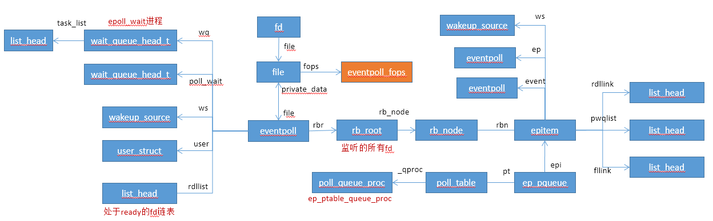

# epoll

epoll是一种I/O事件通知机制。

epoll工作模式:

* LT模式（Level Triggered，水平触发）
  * 该模式是epoll的缺省工作模式，其同时支持阻塞和非阻塞socket。内核会告诉开发者一个文件描述符是否就绪，如果开发者不采取任何操作，内核仍会一直通知。
* ET模式（Edge Triggered，边缘触发）
  * 该模式是一种高速处理模式，当且仅当状态发生变化时才会获得通知。在该模式下，其假定开发者在接收到一次通知后，会完整地处理该事件，因此内核将不再通知这一事件。注意，缓冲区中还有未处理的数据不能说是状态变化，因此，在ET模式下，开发者如果只读取了一部分数据，其将再也得不到通知了。正确的做法是，开发者自己确认读完了所有的字节（一直调用read/write直到出错EAGAGIN为止）。

  
## select/poll/epoll对比

* select
  * 支持多个socket
  * 使用bit位置来表示fd
  * 支持立即返回/超时/无限等待
  * 进程唤醒时，按数组顺序逐个fd遍历确认
* poll
  * 支持多个socket
  * 直接使用fd
  * 支持立即返回/超时/无限等待
  * 进程唤醒时，按数组顺序逐个fd遍历确认
* epoll
  * 支持多个socket
  * 直接使用fd
  * 支持立即返回/超时/无限等待
  * 进程唤醒时，知道是哪个fd，当fd数量多时性能比较好


## 数据结构



```c
static const struct file_operations eventpoll_fops = {
#ifdef CONFIG_PROC_FS
	.show_fdinfo	= ep_show_fdinfo,
#endif
	.release	= ep_eventpoll_release,
	.poll		= ep_eventpoll_poll,
	.llseek		= noop_llseek,
};
``` 


## 模块初始化

```c
static int __init eventpoll_init(void)
{
	struct sysinfo si;

	si_meminfo(&si);
	/*
	 * Allows top 4% of lomem to be allocated for epoll watches (per user).
	 */
	max_user_watches = (((si.totalram - si.totalhigh) / 25) << PAGE_SHIFT) /
		EP_ITEM_COST;
	BUG_ON(max_user_watches < 0);

	/*
	 * Initialize the structure used to perform epoll file descriptor
	 * inclusion loops checks.
	 */
	ep_nested_calls_init(&poll_loop_ncalls);

	/* Initialize the structure used to perform safe poll wait head wake ups */
	ep_nested_calls_init(&poll_safewake_ncalls);

	/* Initialize the structure used to perform file's f_op->poll() calls */
	ep_nested_calls_init(&poll_readywalk_ncalls);

	/*
	 * We can have many thousands of epitems, so prevent this from
	 * using an extra cache line on 64-bit (and smaller) CPUs
	 */
	BUILD_BUG_ON(sizeof(void *) <= 8 && sizeof(struct epitem) > 128);

	/* Allocates slab cache used to allocate "struct epitem" items */
	epi_cache = kmem_cache_create("eventpoll_epi", sizeof(struct epitem),
			0, SLAB_HWCACHE_ALIGN | SLAB_PANIC, NULL);

	/* Allocates slab cache used to allocate "struct eppoll_entry" */
	pwq_cache = kmem_cache_create("eventpoll_pwq",
			sizeof(struct eppoll_entry), 0, SLAB_PANIC, NULL);

	return 0;
}
```


## epoll_create

```c
SYSCALL_DEFINE1(epoll_create, int, size)
{
	if (size <= 0)
		return -EINVAL;

	return sys_epoll_create1(0);
}

SYSCALL_DEFINE1(epoll_create1, int, flags)
{
	int error, fd;
	struct eventpoll *ep = NULL;
	struct file *file;

	/* Check the EPOLL_* constant for consistency.  */
	BUILD_BUG_ON(EPOLL_CLOEXEC != O_CLOEXEC);

	if (flags & ~EPOLL_CLOEXEC)
		return -EINVAL;
	/*
	 * Create the internal data structure ("struct eventpoll").
	 */
	error = ep_alloc(&ep);   //创建epoll对象
	if (error < 0)
		return error;
	/*
	 * Creates all the items needed to setup an eventpoll file. That is,
	 * a file structure and a free file descriptor.
	 */
	fd = get_unused_fd_flags(O_RDWR | (flags & O_CLOEXEC));   //获取未使用的fd
	if (fd < 0) {
		error = fd;
		goto out_free_ep;
	}
	file = anon_inode_getfile("[eventpoll]", &eventpoll_fops, ep,  //构造file对象
				 O_RDWR | (flags & O_CLOEXEC));
	if (IS_ERR(file)) {
		error = PTR_ERR(file);
		goto out_free_fd;
	}
	ep->file = file;         // file的private_data指向ep
	fd_install(fd, file);    // fd与file建立对应关系
	return fd;

out_free_fd:
	put_unused_fd(fd);
out_free_ep:
	ep_free(ep);
	return error;
}
```


## epoll_ctl

epoll的事件注册函数，它不同于select是在监听事件时告诉内核要监听什么类型的事件，而是通过epoll_ctl注册要监听的事件类型。

```c
/*
* 第一个参数epfd：epoll_create函数的返回值。
* 第二个参数op：表示动作类型。有三个宏来表示： 
  * EPOLL_CTL_ADD：注册新的fd到epfd中； 
  * EPOLL_CTL_MOD：修改已经注册的fd的监听事件； 
  * EPOLL_CTL_DEL：从epfd中删除一个fd。
* 第三个参数fd：需要监听的fd。
* 第四个参数event：告诉内核需要监听什么事件。
*/
SYSCALL_DEFINE4(epoll_ctl, int, epfd, int, op, int, fd,
		struct epoll_event __user *, event)
{
	int error;
	int full_check = 0;
	struct fd f, tf;
	struct eventpoll *ep;
	struct epitem *epi;
	struct epoll_event epds;
	struct eventpoll *tep = NULL;

	error = -EFAULT;
	if (ep_op_has_event(op) &&
	    copy_from_user(&epds, event, sizeof(struct epoll_event)))
		goto error_return;

	error = -EBADF;
	f = fdget(epfd);
	if (!f.file)
		goto error_return;

	/* Get the "struct file *" for the target file */
	tf = fdget(fd);
	if (!tf.file)
		goto error_fput;

	/* The target file descriptor must support poll */
	error = -EPERM;
	if (!tf.file->f_op->poll)
		goto error_tgt_fput;

	/* Check if EPOLLWAKEUP is allowed */
	if (ep_op_has_event(op))
		ep_take_care_of_epollwakeup(&epds);

	/*
	 * We have to check that the file structure underneath the file descriptor
	 * the user passed to us _is_ an eventpoll file. And also we do not permit
	 * adding an epoll file descriptor inside itself.
	 */
	error = -EINVAL;
	if (f.file == tf.file || !is_file_epoll(f.file))
		goto error_tgt_fput;

	/*
	 * At this point it is safe to assume that the "private_data" contains
	 * our own data structure.
	 */
	ep = f.file->private_data;   //得到epoll对象

	/*
	 * When we insert an epoll file descriptor, inside another epoll file
	 * descriptor, there is the change of creating closed loops, which are
	 * better be handled here, than in more critical paths. While we are
	 * checking for loops we also determine the list of files reachable
	 * and hang them on the tfile_check_list, so we can check that we
	 * haven't created too many possible wakeup paths.
	 *
	 * We do not need to take the global 'epumutex' on EPOLL_CTL_ADD when
	 * the epoll file descriptor is attaching directly to a wakeup source,
	 * unless the epoll file descriptor is nested. The purpose of taking the
	 * 'epmutex' on add is to prevent complex toplogies such as loops and
	 * deep wakeup paths from forming in parallel through multiple
	 * EPOLL_CTL_ADD operations.
	 */
	mutex_lock_nested(&ep->mtx, 0);
	if (op == EPOLL_CTL_ADD) {
		if (!list_empty(&f.file->f_ep_links) ||
						is_file_epoll(tf.file)) {
			full_check = 1;
			mutex_unlock(&ep->mtx);
			mutex_lock(&epmutex);
			if (is_file_epoll(tf.file)) {
				error = -ELOOP;
				if (ep_loop_check(ep, tf.file) != 0) {
					clear_tfile_check_list();
					goto error_tgt_fput;
				}
			} else
				list_add(&tf.file->f_tfile_llink,
							&tfile_check_list);
			mutex_lock_nested(&ep->mtx, 0);
			if (is_file_epoll(tf.file)) {
				tep = tf.file->private_data;
				mutex_lock_nested(&tep->mtx, 1);
			}
		}
	}

	/*
	 * Try to lookup the file inside our RB tree, Since we grabbed "mtx"
	 * above, we can be sure to be able to use the item looked up by
	 * ep_find() till we release the mutex.
	 */
	epi = ep_find(ep, tf.file, fd);

	error = -EINVAL;
	switch (op) {
	case EPOLL_CTL_ADD:
		if (!epi) {
			epds.events |= POLLERR | POLLHUP;
			error = ep_insert(ep, &epds, tf.file, fd, full_check);
		} else
			error = -EEXIST;
		if (full_check)
			clear_tfile_check_list();
		break;
	case EPOLL_CTL_DEL:
		if (epi)
			error = ep_remove(ep, epi);
		else
			error = -ENOENT;
		break;
	case EPOLL_CTL_MOD:
		if (epi) {
			epds.events |= POLLERR | POLLHUP;
			error = ep_modify(ep, epi, &epds);
		} else
			error = -ENOENT;
		break;
	}
	if (tep != NULL)
		mutex_unlock(&tep->mtx);
	mutex_unlock(&ep->mtx);

error_tgt_fput:
	if (full_check)
		mutex_unlock(&epmutex);

	fdput(tf);
error_fput:
	fdput(f);
error_return:

	return error;
}
```


### ep_find

```c
static struct epitem *ep_find(struct eventpoll *ep, struct file *file, int fd)
{
	int kcmp;
	struct rb_node *rbp;
	struct epitem *epi, *epir = NULL;
	struct epoll_filefd ffd;

	ep_set_ffd(&ffd, file, fd);
	for (rbp = ep->rbr.rb_node; rbp; ) {
		epi = rb_entry(rbp, struct epitem, rbn);
		kcmp = ep_cmp_ffd(&ffd, &epi->ffd);  //用红黑树保存目标fd和file
		if (kcmp > 0)
			rbp = rbp->rb_right;
		else if (kcmp < 0)
			rbp = rbp->rb_left;
		else {
			epir = epi;
			break;
		}
	}

	return epir;
}
```


### ep_insert

```c
static int ep_insert(struct eventpoll *ep, struct epoll_event *event,
		     struct file *tfile, int fd, int full_check)
{
	int error, revents, pwake = 0;
	unsigned long flags;
	long user_watches;
	struct epitem *epi;   //epoll红黑树上的对象
	struct ep_pqueue epq;

	user_watches = atomic_long_read(&ep->user->epoll_watches);
	if (unlikely(user_watches >= max_user_watches))
		return -ENOSPC;
	if (!(epi = kmem_cache_alloc(epi_cache, GFP_KERNEL)))
		return -ENOMEM;

	/* Item initialization follow here ... */
	INIT_LIST_HEAD(&epi->rdllink);
	INIT_LIST_HEAD(&epi->fllink);
	INIT_LIST_HEAD(&epi->pwqlist);
	epi->ep = ep;
	ep_set_ffd(&epi->ffd, tfile, fd);
	epi->event = *event;
	epi->nwait = 0;
	epi->next = EP_UNACTIVE_PTR;
	if (epi->event.events & EPOLLWAKEUP) {
		error = ep_create_wakeup_source(epi);   //构建epollevent的ws对象，epi的ws对象
		if (error)
			goto error_create_wakeup_source;
	} else {
		RCU_INIT_POINTER(epi->ws, NULL);
	}

	/* Initialize the poll table using the queue callback */
	epq.epi = epi;
	init_poll_funcptr(&epq.pt, ep_ptable_queue_proc);  //初始化poll_table

	/*
	 * Attach the item to the poll hooks and get current event bits.
	 * We can safely use the file* here because its usage count has
	 * been increased by the caller of this function. Note that after
	 * this operation completes, the poll callback can start hitting
	 * the new item.
	 */
	// 调用目标file的poll函数,socket file ops最终会调用ep_ptable_queue_proc函数
	// epoll回调函数会添加到fd的等待队列中
	revents = ep_item_poll(epi, &epq.pt);   

	/*
	 * We have to check if something went wrong during the poll wait queue
	 * install process. Namely an allocation for a wait queue failed due
	 * high memory pressure.
	 */
	error = -ENOMEM;
	if (epi->nwait < 0)
		goto error_unregister;

	/* Add the current item to the list of active epoll hook for this file */
	spin_lock(&tfile->f_lock);
	list_add_tail_rcu(&epi->fllink, &tfile->f_ep_links);
	spin_unlock(&tfile->f_lock);

	/*
	 * Add the current item to the RB tree. All RB tree operations are
	 * protected by "mtx", and ep_insert() is called with "mtx" held.
	 */
	ep_rbtree_insert(ep, epi);    //epi插入到红黑树中

	/* now check if we've created too many backpaths */
	error = -EINVAL;
	if (full_check && reverse_path_check())
		goto error_remove_epi;

	/* We have to drop the new item inside our item list to keep track of it */
	spin_lock_irqsave(&ep->lock, flags);

	/* If the file is already "ready" we drop it inside the ready list */
	if ((revents & event->events) && !ep_is_linked(&epi->rdllink)) {
		list_add_tail(&epi->rdllink, &ep->rdllist);    //如果当前已经ready，添加到ep的ready链表中
		ep_pm_stay_awake(epi);

		/* Notify waiting tasks that events are available */
		if (waitqueue_active(&ep->wq))
			wake_up_locked(&ep->wq);
		if (waitqueue_active(&ep->poll_wait))
			pwake++;
	}

	spin_unlock_irqrestore(&ep->lock, flags);

	atomic_long_inc(&ep->user->epoll_watches);

	/* We have to call this outside the lock */
	if (pwake)
		ep_poll_safewake(&ep->poll_wait);

	return 0;

error_remove_epi:
	spin_lock(&tfile->f_lock);
	list_del_rcu(&epi->fllink);
	spin_unlock(&tfile->f_lock);

	rb_erase(&epi->rbn, &ep->rbr);

error_unregister:
	ep_unregister_pollwait(ep, epi);

	/*
	 * We need to do this because an event could have been arrived on some
	 * allocated wait queue. Note that we don't care about the ep->ovflist
	 * list, since that is used/cleaned only inside a section bound by "mtx".
	 * And ep_insert() is called with "mtx" held.
	 */
	spin_lock_irqsave(&ep->lock, flags);
	if (ep_is_linked(&epi->rdllink))
		list_del_init(&epi->rdllink);
	spin_unlock_irqrestore(&ep->lock, flags);

	wakeup_source_unregister(ep_wakeup_source(epi));

error_create_wakeup_source:
	kmem_cache_free(epi_cache, epi);

	return error;
}
```

### ep_ptable_queue_proc

```c
static void ep_ptable_queue_proc(struct file *file, wait_queue_head_t *whead,
				 poll_table *pt)
{
	struct epitem *epi = ep_item_from_epqueue(pt);
	struct eppoll_entry *pwq;

	if (epi->nwait >= 0 && (pwq = kmem_cache_alloc(pwq_cache, GFP_KERNEL))) {
		init_waitqueue_func_entry(&pwq->wait, ep_poll_callback);
		pwq->whead = whead;
		pwq->base = epi;
		add_wait_queue(whead, &pwq->wait);          //添加到等待队列中
		list_add_tail(&pwq->llink, &epi->pwqlist);
		epi->nwait++;
	} else {
		/* We have to signal that an error occurred */
		epi->nwait = -1;
	}
}
```

### ep_poll_callback

fd唤醒等待队列时，会调用此函数，该函数是在调用epoll_ctl函数时注册的。

```c
static int ep_poll_callback(wait_queue_t *wait, unsigned mode, int sync, void *key)
{
	int pwake = 0;
	unsigned long flags;
	struct epitem *epi = ep_item_from_wait(wait);
	struct eventpoll *ep = epi->ep;   //得到epoll对象

	if ((unsigned long)key & POLLFREE) {
		ep_pwq_from_wait(wait)->whead = NULL;
		/*
		 * whead = NULL above can race with ep_remove_wait_queue()
		 * which can do another remove_wait_queue() after us, so we
		 * can't use __remove_wait_queue(). whead->lock is held by
		 * the caller.
		 */
		list_del_init(&wait->task_list);
	}

	spin_lock_irqsave(&ep->lock, flags);

	/*
	 * If the event mask does not contain any poll(2) event, we consider the
	 * descriptor to be disabled. This condition is likely the effect of the
	 * EPOLLONESHOT bit that disables the descriptor when an event is received,
	 * until the next EPOLL_CTL_MOD will be issued.
	 */
	if (!(epi->event.events & ~EP_PRIVATE_BITS))
		goto out_unlock;

	/*
	 * Check the events coming with the callback. At this stage, not
	 * every device reports the events in the "key" parameter of the
	 * callback. We need to be able to handle both cases here, hence the
	 * test for "key" != NULL before the event match test.
	 */
	if (key && !((unsigned long) key & epi->event.events))
		goto out_unlock;

	/*
	 * If we are transferring events to userspace, we can hold no locks
	 * (because we're accessing user memory, and because of linux f_op->poll()
	 * semantics). All the events that happen during that period of time are
	 * chained in ep->ovflist and requeued later on.
	 */
	if (unlikely(ep->ovflist != EP_UNACTIVE_PTR)) {
		if (epi->next == EP_UNACTIVE_PTR) {
			epi->next = ep->ovflist;
			ep->ovflist = epi;
			if (epi->ws) {
				/*
				 * Activate ep->ws since epi->ws may get
				 * deactivated at any time.
				 */
				__pm_stay_awake(ep->ws);
			}

		}
		goto out_unlock;
	}

	/* If this file is already in the ready list we exit soon */
	if (!ep_is_linked(&epi->rdllink)) {
		list_add_tail(&epi->rdllink, &ep->rdllist);   //添加到等待队列中
		ep_pm_stay_awake_rcu(epi);
	}

	/*
	 * Wake up ( if active ) both the eventpoll wait list and the ->poll()
	 * wait list.
	 */
	if (waitqueue_active(&ep->wq))
		wake_up_locked(&ep->wq);    //唤醒等待ep的队列，即调用epoll_wait的进程
	if (waitqueue_active(&ep->poll_wait))  //调用epoll的fops的poll函数时会添加该等待队列
		pwake++;

out_unlock:
	spin_unlock_irqrestore(&ep->lock, flags);

	/* We have to call this outside the lock */
	if (pwake)
		ep_poll_safewake(&ep->poll_wait);

	return 1;
}
```


## epoll_wait

```c
SYSCALL_DEFINE4(epoll_wait, int, epfd, struct epoll_event __user *, events,
		int, maxevents, int, timeout)
{
	int error;
	struct fd f;
	struct eventpoll *ep;

	/* The maximum number of event must be greater than zero */
	if (maxevents <= 0 || maxevents > EP_MAX_EVENTS)
		return -EINVAL;

	/* Verify that the area passed by the user is writeable */
	if (!access_ok(VERIFY_WRITE, events, maxevents * sizeof(struct epoll_event)))
		return -EFAULT;

	/* Get the "struct file *" for the eventpoll file */
	f = fdget(epfd);
	if (!f.file)
		return -EBADF;

	/*
	 * We have to check that the file structure underneath the fd
	 * the user passed to us _is_ an eventpoll file.
	 */
	error = -EINVAL;
	if (!is_file_epoll(f.file)) 
		goto error_fput;

	/*
	 * At this point it is safe to assume that the "private_data" contains
	 * our own data structure.
	 */
	ep = f.file->private_data;    //得到eventpoll对象

	/* Time to fish for events ... */
	error = ep_poll(ep, events, maxevents, timeout);

error_fput:
	fdput(f);
	return error;
}

static int ep_poll(struct eventpoll *ep, struct epoll_event __user *events,
		   int maxevents, long timeout)
{
	int res = 0, eavail, timed_out = 0;
	unsigned long flags;
	long slack = 0;
	wait_queue_t wait;
	ktime_t expires, *to = NULL;

	if (timeout > 0) {
		struct timespec end_time = ep_set_mstimeout(timeout);

		slack = select_estimate_accuracy(&end_time);
		to = &expires;
		*to = timespec_to_ktime(end_time);
	} else if (timeout == 0) {
		/*
		 * Avoid the unnecessary trip to the wait queue loop, if the
		 * caller specified a non blocking operation.
		 */
		timed_out = 1;
		spin_lock_irqsave(&ep->lock, flags);
		goto check_events;
	}

fetch_events:
	spin_lock_irqsave(&ep->lock, flags);

	if (!ep_events_available(ep)) {     //ready链表为空，直接返回
		/*
		 * We don't have any available event to return to the caller.
		 * We need to sleep here, and we will be wake up by
		 * ep_poll_callback() when events will become available.
		 */
		init_waitqueue_entry(&wait, current);        //初始化waitqueue对象
		__add_wait_queue_exclusive(&ep->wq, &wait);  //添加到ep的wq链表中

		for (;;) {
			/*
			 * We don't want to sleep if the ep_poll_callback() sends us
			 * a wakeup in between. That's why we set the task state
			 * to TASK_INTERRUPTIBLE before doing the checks.
			 */
			set_current_state(TASK_INTERRUPTIBLE);     //当前进程设置为可中断
			if (ep_events_available(ep) || timed_out)  //如果ready链表不为空，或者超时，跳出死循环
				break;
			if (signal_pending(current)) {
				res = -EINTR;
				break;
			}

			spin_unlock_irqrestore(&ep->lock, flags);
			//休眠直到超时，如果未制定超时时间，则该函数返回为非0
			if (!schedule_hrtimeout_range(to, slack, HRTIMER_MODE_ABS))  
				timed_out = 1;

			spin_lock_irqsave(&ep->lock, flags);
		}

		__remove_wait_queue(&ep->wq, &wait);  //返回时从当前等待队列中删除当前进程
		__set_current_state(TASK_RUNNING);
	}
check_events:
	/* Is it worth to try to dig for events ? */
	eavail = ep_events_available(ep);

	spin_unlock_irqrestore(&ep->lock, flags);

	/*
	 * Try to transfer events to user space. In case we get 0 events and
	 * there's still timeout left over, we go trying again in search of
	 * more luck.
	 */
	if (!res && eavail &&
	    !(res = ep_send_events(ep, events, maxevents)) && !timed_out)   //处理ready list
		goto fetch_events;

	return res;
}
```


### ep_send_events

```c
static int ep_send_events(struct eventpoll *ep,
			  struct epoll_event __user *events, int maxevents)
{
	struct ep_send_events_data esed;

	esed.maxevents = maxevents;
	esed.events = events;

	return ep_scan_ready_list(ep, ep_send_events_proc, &esed, 0, false);
}


static int ep_scan_ready_list(struct eventpoll *ep,
			      int (*sproc)(struct eventpoll *,
					   struct list_head *, void *),
			      void *priv, int depth, bool ep_locked)
{
	int error, pwake = 0;
	unsigned long flags;
	struct epitem *epi, *nepi;
	LIST_HEAD(txlist);

	/*
	 * We need to lock this because we could be hit by
	 * eventpoll_release_file() and epoll_ctl().
	 */

	if (!ep_locked)
		mutex_lock_nested(&ep->mtx, depth);

	/*
	 * Steal the ready list, and re-init the original one to the
	 * empty list. Also, set ep->ovflist to NULL so that events
	 * happening while looping w/out locks, are not lost. We cannot
	 * have the poll callback to queue directly on ep->rdllist,
	 * because we want the "sproc" callback to be able to do it
	 * in a lockless way.
	 */
	spin_lock_irqsave(&ep->lock, flags);
	list_splice_init(&ep->rdllist, &txlist);    //重新初始化rdllist
	ep->ovflist = NULL;
	spin_unlock_irqrestore(&ep->lock, flags);

	/*
	 * Now call the callback function.
	 */
	error = (*sproc)(ep, &txlist, priv);     //执行回调函数，即ep_send_events_proc

	spin_lock_irqsave(&ep->lock, flags);
	/*
	 * During the time we spent inside the "sproc" callback, some
	 * other events might have been queued by the poll callback.
	 * We re-insert them inside the main ready-list here.
	 */
	for (nepi = ep->ovflist; (epi = nepi) != NULL;
	     nepi = epi->next, epi->next = EP_UNACTIVE_PTR) {
		/*
		 * We need to check if the item is already in the list.
		 * During the "sproc" callback execution time, items are
		 * queued into ->ovflist but the "txlist" might already
		 * contain them, and the list_splice() below takes care of them.
		 */
		if (!ep_is_linked(&epi->rdllink)) {
			list_add_tail(&epi->rdllink, &ep->rdllist);    //把当前epi添加到ep的链表中
			ep_pm_stay_awake(epi);
		}
	}
	/*
	 * We need to set back ep->ovflist to EP_UNACTIVE_PTR, so that after
	 * releasing the lock, events will be queued in the normal way inside
	 * ep->rdllist.
	 */
	ep->ovflist = EP_UNACTIVE_PTR;

	/*
	 * Quickly re-inject items left on "txlist".
	 */
	list_splice(&txlist, &ep->rdllist);
	__pm_relax(ep->ws);

	if (!list_empty(&ep->rdllist)) {
		/*
		 * Wake up (if active) both the eventpoll wait list and
		 * the ->poll() wait list (delayed after we release the lock).
		 */
		if (waitqueue_active(&ep->wq))
			wake_up_locked(&ep->wq);     //唤醒进程
		if (waitqueue_active(&ep->poll_wait))
			pwake++;
	}
	spin_unlock_irqrestore(&ep->lock, flags);

	if (!ep_locked)
		mutex_unlock(&ep->mtx);

	/* We have to call this outside the lock */
	if (pwake)
		ep_poll_safewake(&ep->poll_wait);   //唤醒pll_wait等待队列

	return error;
}
```


### ep_send_events_proc

```c
static int ep_send_events_proc(struct eventpoll *ep, struct list_head *head,
			       void *priv)
{
	struct ep_send_events_data *esed = priv;
	int eventcnt;
	unsigned int revents;
	struct epitem *epi;
	struct epoll_event __user *uevent;
	struct wakeup_source *ws;
	poll_table pt;

	init_poll_funcptr(&pt, NULL);

	/*
	 * We can loop without lock because we are passed a task private list.
	 * Items cannot vanish during the loop because ep_scan_ready_list() is
	 * holding "mtx" during this call.
	 */
	for (eventcnt = 0, uevent = esed->events;
	     !list_empty(head) && eventcnt < esed->maxevents;) {
		epi = list_first_entry(head, struct epitem, rdllink);

		/*
		 * Activate ep->ws before deactivating epi->ws to prevent
		 * triggering auto-suspend here (in case we reactive epi->ws
		 * below).
		 *
		 * This could be rearranged to delay the deactivation of epi->ws
		 * instead, but then epi->ws would temporarily be out of sync
		 * with ep_is_linked().
		 */
		ws = ep_wakeup_source(epi);
		if (ws) {
			if (ws->active)
				__pm_stay_awake(ep->ws);
			__pm_relax(ws);
		}

		list_del_init(&epi->rdllink);

		revents = ep_item_poll(epi, &pt);

		/*
		 * If the event mask intersect the caller-requested one,
		 * deliver the event to userspace. Again, ep_scan_ready_list()
		 * is holding "mtx", so no operations coming from userspace
		 * can change the item.
		 */
		if (revents) {
			if (__put_user(revents, &uevent->events) ||
			    __put_user(epi->event.data, &uevent->data)) {
				list_add(&epi->rdllink, head);
				ep_pm_stay_awake(epi);
				return eventcnt ? eventcnt : -EFAULT;
			}
			eventcnt++;
			uevent++;
			if (epi->event.events & EPOLLONESHOT)
				epi->event.events &= EP_PRIVATE_BITS;
			else if (!(epi->event.events & EPOLLET)) {
				/*
				 * If this file has been added with Level
				 * Trigger mode, we need to insert back inside
				 * the ready list, so that the next call to
				 * epoll_wait() will check again the events
				 * availability. At this point, no one can insert
				 * into ep->rdllist besides us. The epoll_ctl()
				 * callers are locked out by
				 * ep_scan_ready_list() holding "mtx" and the
				 * poll callback will queue them in ep->ovflist.
				 */
				list_add_tail(&epi->rdllink, &ep->rdllist);
				ep_pm_stay_awake(epi);
			}
		}
	}

	return eventcnt;
}
```


