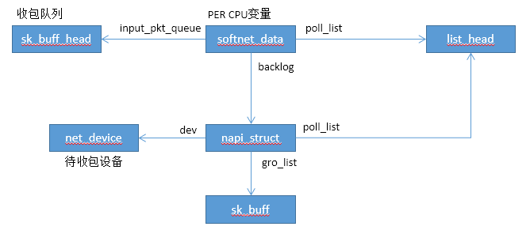

# NAPI

NAPI 是 Linux 上采用的一种提高网络处理效率的技术，它的核心概念就是不采用中断的方式读取数据，而代之以首先采用中断唤醒数据接收的服务程序，然后 POLL 的方法来轮询数据。


## 主要数据结构




## 核心数据初始化

softnet_data全局变量是NAPI的核心数据， 该变量实际为一个数据，数组的数量和CPU数相同，每个CPU都有私有的softnet_data，该全局变量的初始化如下：

```c
static int __init net_dev_init(void)
{
	int i, rc = -ENOMEM;

	BUG_ON(!dev_boot_phase);

	if (dev_proc_init())
		goto out;

	if (netdev_kobject_init())
		goto out;

	INIT_LIST_HEAD(&ptype_all);
	for (i = 0; i < PTYPE_HASH_SIZE; i++)
		INIT_LIST_HEAD(&ptype_base[i]);

	INIT_LIST_HEAD(&offload_base);

	if (register_pernet_subsys(&netdev_net_ops))
		goto out;

	/*
	 *	Initialise the packet receive queues.
	 */

	for_each_possible_cpu(i) {
		struct softnet_data *sd = &per_cpu(softnet_data, i); //初始化全局变量

		skb_queue_head_init(&sd->input_pkt_queue);  //初始化收包队列
		skb_queue_head_init(&sd->process_queue);
		INIT_LIST_HEAD(&sd->poll_list);
		sd->output_queue_tailp = &sd->output_queue;
#ifdef CONFIG_RPS
		sd->csd.func = rps_trigger_softirq;
		sd->csd.info = sd;
		sd->cpu = i;
#endif

		sd->backlog.poll = process_backlog;    //napi_struct的poll函数定义
		sd->backlog.weight = weight_p;
	}

	dev_boot_phase = 0;

	/* The loopback device is special if any other network devices
	 * is present in a network namespace the loopback device must
	 * be present. Since we now dynamically allocate and free the
	 * loopback device ensure this invariant is maintained by
	 * keeping the loopback device as the first device on the
	 * list of network devices.  Ensuring the loopback devices
	 * is the first device that appears and the last network device
	 * that disappears.
	 */
	if (register_pernet_device(&loopback_net_ops))
		goto out;

	if (register_pernet_device(&default_device_ops))
		goto out;

	open_softirq(NET_TX_SOFTIRQ, net_tx_action);
	open_softirq(NET_RX_SOFTIRQ, net_rx_action);   //注册收包软中断处理函数

	hotcpu_notifier(dev_cpu_callback, 0);
	dst_init();
	rc = 0;
out:
	return rc;
}
```

## 内核NAPI收包处理

```c
static int enqueue_to_backlog(struct sk_buff *skb, int cpu,
			      unsigned int *qtail)
{
	struct softnet_data *sd;
	unsigned long flags;
	unsigned int qlen;

	sd = &per_cpu(softnet_data, cpu);

	local_irq_save(flags);

	rps_lock(sd);
	if (!netif_running(skb->dev))
		goto drop;
	qlen = skb_queue_len(&sd->input_pkt_queue);   
	if (qlen <= netdev_max_backlog && !skb_flow_limit(skb, qlen)) {
		if (qlen) {		//队列不为空，说明backlog处于调度状态或者未处于调度状态且已经触发了软中断
enqueue:
			__skb_queue_tail(&sd->input_pkt_queue, skb);	//skb保存到收包队列中
			input_queue_tail_incr_save(sd, qtail);
			rps_unlock(sd);
			local_irq_restore(flags);
			return NET_RX_SUCCESS;
		}

		/* Schedule NAPI for backlog device
		 * We can use non atomic operation since we own the queue lock
		 */
		if (!__test_and_set_bit(NAPI_STATE_SCHED, &sd->backlog.state)) {	//未处于调度状态
			if (!rps_ipi_queued(sd))
				____napi_schedule(sd, &sd->backlog);	//backlog添加到sd中，并触发软中断
		}
		goto enqueue;
	}

drop:
	sd->dropped++;
	rps_unlock(sd);

	local_irq_restore(flags);

	atomic_long_inc(&skb->dev->rx_dropped);
	kfree_skb(skb);
	return NET_RX_DROP;
}

static inline void ____napi_schedule(struct softnet_data *sd,
				     struct napi_struct *napi)
{
	list_add_tail(&napi->poll_list, &sd->poll_list);	//将napi_struct添加到softnet_data 链表中
	__raise_softirq_irqoff(NET_RX_SOFTIRQ);
}
```

## 网卡NAPI收包处理

网卡NAPI收包，一般在网卡中断处理函数中，把网卡的napi_struct对象，添加到softnet_data中：
```c
void __napi_schedule(struct napi_struct *n)
{
	unsigned long flags;

	local_irq_save(flags);
	____napi_schedule(this_cpu_ptr(&softnet_data), n);   //将napi_struct添加到softnet_data 链表中
	local_irq_restore(flags);
}

void __napi_schedule_irqoff(struct napi_struct *n)
{
	____napi_schedule(this_cpu_ptr(&softnet_data), n);  //将napi_struct添加到softnet_data 链表中
}
```


## 收包软中断处理

```c
static void net_rx_action(struct softirq_action *h)
{
	struct softnet_data *sd = this_cpu_ptr(&softnet_data);
	unsigned long time_limit = jiffies + 2;	 //定义了处理skb的时间不能超过2个时钟中断时间，即2/HZ 秒
	int budget = netdev_budget;	  //定义了一次处理skb的数目，系统默认为300
	LIST_HEAD(list);
	LIST_HEAD(repoll);

	local_irq_disable();
	list_splice_init(&sd->poll_list, &list); //poll链表合并到list，并初始化poll_list，poll_list的第一个item不是napi_struct对象
	local_irq_enable();

	for (;;) {
		struct napi_struct *n;

		if (list_empty(&list)) {
			if (!sd_has_rps_ipi_waiting(sd) && list_empty(&repoll))	 
				return;
			break;
		}

		n = list_first_entry(&list, struct napi_struct, poll_list);	//得到第一个napi_struct对象
		budget -= napi_poll(n, &repoll);	//开始poll收包

		/* If softirq window is exhausted then punt.
		 * Allow this to run for 2 jiffies since which will allow
		 * an average latency of 1.5/HZ.
		 */
		if (unlikely(budget <= 0 ||		
			     time_after_eq(jiffies, time_limit))) {	//超过时间或收取的报文数则退出
			sd->time_squeeze++;
			break;
		}
	}

	local_irq_disable();	

	list_splice_tail_init(&sd->poll_list, &list);
	list_splice_tail(&repoll, &list);
	list_splice(&list, &sd->poll_list);
	if (!list_empty(&sd->poll_list))	//如果poll list非空，说明报文未接收完成，继续触发软中断
		__raise_softirq_irqoff(NET_RX_SOFTIRQ);

	net_rps_action_and_irq_enable(sd);	//本地中断开启，根据条件发送IPI给其他CPU
}

static int napi_poll(struct napi_struct *n, struct list_head *repoll)
{
	void *have;
	int work, weight;

	list_del_init(&n->poll_list);	//把当前的napi_struct，从poll list中删除，当前处理完成后，net_rx_action的poll list中将没有当前的napi_struct

	have = netpoll_poll_lock(n);	//如果n为dev的napi_struct，那么设置当前CPU为该dev的poll owner

	weight = n->weight;

	/* This NAPI_STATE_SCHED test is for avoiding a race
	 * with netpoll's poll_napi().  Only the entity which
	 * obtains the lock and sees NAPI_STATE_SCHED set will
	 * actually make the ->poll() call.  Therefore we avoid
	 * accidentally calling ->poll() when NAPI is not scheduled.
	 */
	work = 0;
	if (test_bit(NAPI_STATE_SCHED, &n->state)) {	//napi_struct处于调用状态
		work = n->poll(n, weight);	 //softnet_data对象中的backlog的poll函数为process_backlog
		trace_napi_poll(n);
	}

	WARN_ON_ONCE(work > weight);

	if (likely(work < weight))	//接收的报文数小于weight，说明当前没有报文了，退出
		goto out_unlock;

	/* Drivers must not modify the NAPI state if they
	 * consume the entire weight.  In such cases this code
	 * still "owns" the NAPI instance and therefore can
	 * move the instance around on the list at-will.
	 */
	if (unlikely(napi_disable_pending(n))) {  //如果NAPI被禁止了，则napi结束
		napi_complete(n);
		goto out_unlock;
	}

	if (n->gro_list) {                //gro报文上送到协议栈
		/* flush too old packets
		 * If HZ < 1000, flush all packets.
		 */
		napi_gro_flush(n, HZ >= 1000);	//把gro中的报文刷到协议栈
	}

	/* Some drivers may have called napi_schedule
	 * prior to exhausting their budget.
	 */
	if (unlikely(!list_empty(&n->poll_list))) {     //处理过程中可能收到新包
		pr_warn_once("%s: Budget exhausted after napi rescheduled\n",
			     n->dev ? n->dev->name : "backlog");
		goto out_unlock;
	}

	list_add_tail(&n->poll_list, repoll);   //把当前的napi_struct添加到再次poll队列中

out_unlock:
	netpoll_poll_unlock(have);

	return work;
}
```

## 内核poll函数

```c
static int process_backlog(struct napi_struct *napi, int quota)
{
	int work = 0;
	struct softnet_data *sd = container_of(napi, struct softnet_data, backlog);   //得到softnet_data对象

	/* Check if we have pending ipi, its better to send them now,
	 * not waiting net_rx_action() end.
	 */
	if (sd_has_rps_ipi_waiting(sd)) {	//是否有rps ipi等待，如果是需要发送ipi中断给其他CPU
		local_irq_disable();
		net_rps_action_and_irq_enable(sd);
	}

	napi->weight = weight_p;	//每次处理的最大数据包数，默认为64
	local_irq_disable();		//关闭中断
	while (1) {
		struct sk_buff *skb;

		while ((skb = __skb_dequeue(&sd->process_queue))) {	//从缓冲队列中获取报文
			rcu_read_lock();
			local_irq_enable();		     //开启中断
			__netif_receive_skb(skb);	 //上送报文到协议栈
			rcu_read_unlock();
			local_irq_disable();
			input_queue_head_incr(sd);
			if (++work >= quota) {		//如果处理报文数超过配额，则退出
				local_irq_enable();
				return work;
			}
		}

		rps_lock(sd);
		if (skb_queue_empty(&sd->input_pkt_queue)) {	//如果input队列也为空，则退出
			/*
			 * Inline a custom version of __napi_complete().
			 * only current cpu owns and manipulates this napi,
			 * and NAPI_STATE_SCHED is the only possible flag set
			 * on backlog.
			 * We can use a plain write instead of clear_bit(),
			 * and we dont need an smp_mb() memory barrier.
			 */
			napi->state = 0;
			rps_unlock(sd);

			break;
		}

		skb_queue_splice_tail_init(&sd->input_pkt_queue,	//把input队列合并到process队列中，继续处理
					   &sd->process_queue);
		rps_unlock(sd);
	}
	local_irq_enable();

	return work;
}
```

## 网卡poll函数

ixgbe网卡驱动的poll函数，

```c
int ixgbe_poll(struct napi_struct *napi, int budget)
{
	struct ixgbe_q_vector *q_vector =
				container_of(napi, struct ixgbe_q_vector, napi);
	struct ixgbe_adapter *adapter = q_vector->adapter;
	struct ixgbe_ring *ring;
	int per_ring_budget;
	bool clean_complete = true;

#ifdef CONFIG_IXGBE_DCA
	if (adapter->flags & IXGBE_FLAG_DCA_ENABLED)
		ixgbe_update_dca(q_vector);
#endif

	ixgbe_for_each_ring(ring, q_vector->tx)
		clean_complete &= !!ixgbe_clean_tx_irq(q_vector, ring);

	if (!ixgbe_qv_lock_napi(q_vector))
		return budget;

	/* attempt to distribute budget to each queue fairly, but don't allow
	 * the budget to go below 1 because we'll exit polling */
	if (q_vector->rx.count > 1)
		per_ring_budget = max(budget/q_vector->rx.count, 1);
	else
		per_ring_budget = budget;

	ixgbe_for_each_ring(ring, q_vector->rx)
		clean_complete &= (ixgbe_clean_rx_irq(q_vector, ring,
				   per_ring_budget) < per_ring_budget);

	ixgbe_qv_unlock_napi(q_vector);
	/* If all work not completed, return budget and keep polling */
	if (!clean_complete)
		return budget;

	/* all work done, exit the polling mode */
	napi_complete(napi);
	if (adapter->rx_itr_setting & 1)
		ixgbe_set_itr(q_vector);
	if (!test_bit(__IXGBE_DOWN, &adapter->state))
		ixgbe_irq_enable_queues(adapter, ((u64)1 << q_vector->v_idx));

	return 0;
}

static inline void ixgbe_qv_unlock_napi(struct ixgbe_q_vector *q_vector)
{
	WARN_ON(atomic_read(&q_vector->state) != IXGBE_QV_STATE_NAPI);

	/* flush any outstanding Rx frames */
	if (q_vector->napi.gro_list)
		napi_gro_flush(&q_vector->napi, false);    //刷新gro列表

	/* reset state to idle */
	atomic_set(&q_vector->state, IXGBE_QV_STATE_IDLE);
}
```

