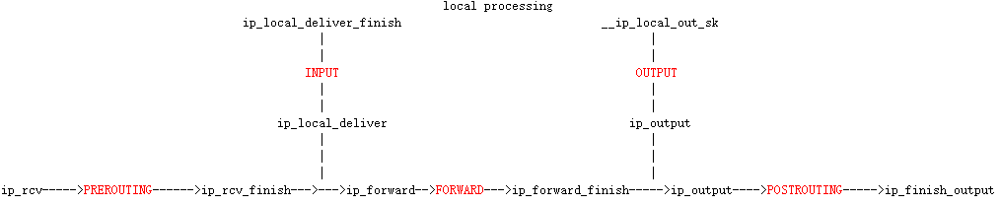

# Netfilter总体框架

Netfilter是Linux防火墙的内核实现

## Netfilter Hook点定义

Netfilter 共定义了5个Hook点：

```
enum nf_inet_hooks {
	NF_INET_PRE_ROUTING,
	NF_INET_LOCAL_IN,
	NF_INET_FORWARD,
	NF_INET_LOCAL_OUT,
	NF_INET_POST_ROUTING,
	NF_INET_NUMHOOKS
};
```

### Hook点内核入口




## Netfilter CT相关的Hook点

CT相关的Hook点，在NF_INET_PRE_ROUTING、NF_INET_LOCAL_IN、NF_INET_LOCAL_OUT和NF_INET_POST_ROUTING这四个点。

以下列出的各个hook点，按照hook函数的优先级排序，数字越小代表优先级越高：

```bash
NF_INET_PRE_ROUTING
ipv4_conntrack_defrag（NF_IP_PRI_CONNTRACK_DEFRAG：-400）
NF_IP_PRI_RAW：-300   //用户可添加规则
ipv4_conntrack_in（NF_IP_PRI_CONNTRACK：-200）
NF_IP_PRI_MANGLE：-150  //用户可添加规则
iptable_nat_ipv4_in（NF_IP_PRI_NAT_DST：-100）
NF_IP_PRI_NAT_DST：-100  //用户可添加规则
NF_IP_PRI_FILTER：0  //用户可添加规则

NF_INET_LOCAL_IN
NF_IP_PRI_RAW：-300  //用户可添加规则
NF_IP_PRI_MANGLE：-150  //用户可添加规则
NF_IP_PRI_FILTER：0  //用户可添加规则
NF_IP_PRI_NAT_SRC：100  //用户可添加规则
iptable_nat_ipv4_fn（NF_IP_PRI_NAT_SRC：100）
ipv4_helper（NF_IP_PRI_CONNTRACK_HELPER：300）
ipv4_confirm（NF_IP_PRI_CONNTRACK_CONFIRM：MAX）

NF_INET_LOCAL_OUT
ipv4_conntrack_defrag（NF_IP_PRI_CONNTRACK_DEFRAG：-400）
NF_IP_PRI_RAW：-300
ipv4_conntrack_local（NF_IP_PRI_CONNTRACK：-200）
NF_IP_PRI_MANGLE：-150
iptable_nat_ipv4_local_fn（NF_IP_PRI_NAT_DST：-100）
NF_IP_PRI_NAT_DST：-100
NF_IP_PRI_FILTER：0

NF_INET_POST_ROUTING
NF_IP_PRI_RAW：-300
NF_IP_PRI_MANGLE：-150
NF_IP_PRI_FILTER：0
NF_IP_PRI_NAT_SRC：100
iptable_nat_ipv4_out（NF_IP_PRI_NAT_SRC：100）
ipv4_helper（NF_IP_PRI_CONNTRACK_HELPER:300）
ipv4_confirm（NF_IP_PRI_CONNTRACK_CONFIRM：MAX）

```