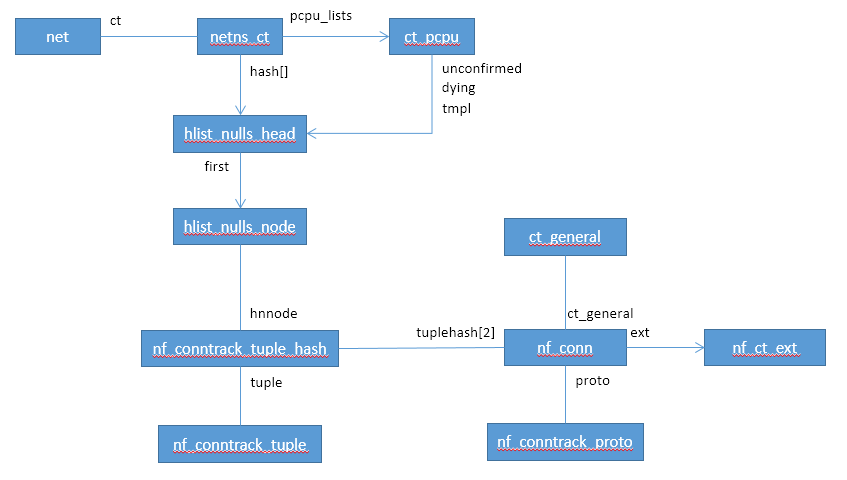

# CT

CT（Conntrack）是Linux实现状态防火墙和NAT的基础，本篇介绍将介绍CT的整体实现。


## CT模块hook点

CT模块在netfilter的5个hook点中的4个挂载了hook处理：

* NF_INET_PRE_ROUTING和NF_INET_LOCAL_OUT的CT处理优先级高于NAT
  * 对于初始报文，那么ct的orign tuple是原始报文（未经过NAT）
* NF_INET_LOCAL_IN和NF_INET_POST_ROUTING的CT处理优先级低于NAT
  * 对于初始报文，那么ct的reply tuple是经过NAT的报文

```c
static struct nf_hook_ops ipv4_conntrack_ops[] __read_mostly = {
	{
		.hook		= ipv4_conntrack_in,
		.owner		= THIS_MODULE,
		.pf		= NFPROTO_IPV4,
		.hooknum	= NF_INET_PRE_ROUTING,
		.priority	= NF_IP_PRI_CONNTRACK,
	},
	{
		.hook		= ipv4_conntrack_local,
		.owner		= THIS_MODULE,
		.pf		= NFPROTO_IPV4,
		.hooknum	= NF_INET_LOCAL_OUT,
		.priority	= NF_IP_PRI_CONNTRACK,
	},
	{
		.hook		= ipv4_helper,
		.owner		= THIS_MODULE,
		.pf		= NFPROTO_IPV4,
		.hooknum	= NF_INET_POST_ROUTING,
		.priority	= NF_IP_PRI_CONNTRACK_HELPER,
	},
	{
		.hook		= ipv4_confirm,
		.owner		= THIS_MODULE,
		.pf		= NFPROTO_IPV4,
		.hooknum	= NF_INET_POST_ROUTING,
		.priority	= NF_IP_PRI_CONNTRACK_CONFIRM,
	},
	{
		.hook		= ipv4_helper,
		.owner		= THIS_MODULE,
		.pf		= NFPROTO_IPV4,
		.hooknum	= NF_INET_LOCAL_IN,
		.priority	= NF_IP_PRI_CONNTRACK_HELPER,
	},
	{
		.hook		= ipv4_confirm,
		.owner		= THIS_MODULE,
		.pf		= NFPROTO_IPV4,
		.hooknum	= NF_INET_LOCAL_IN,
		.priority	= NF_IP_PRI_CONNTRACK_CONFIRM,
	},
};
```


## CT处理流程

### CT状态

```c
enum ip_conntrack_info {
	/* Part of an established connection (either direction). */
	IP_CT_ESTABLISHED,

	/* Like NEW, but related to an existing connection, or ICMP error
	   (in either direction). */
	IP_CT_RELATED,

	/* Started a new connection to track (only
           IP_CT_DIR_ORIGINAL); may be a retransmission. */
	IP_CT_NEW,

	/* >= this indicates reply direction */
	IP_CT_IS_REPLY,

	IP_CT_ESTABLISHED_REPLY = IP_CT_ESTABLISHED + IP_CT_IS_REPLY,
	IP_CT_RELATED_REPLY = IP_CT_RELATED + IP_CT_IS_REPLY,
	IP_CT_NEW_REPLY = IP_CT_NEW + IP_CT_IS_REPLY,	
	/* Number of distinct IP_CT types (no NEW in reply dirn). */
	IP_CT_NUMBER = IP_CT_IS_REPLY * 2 - 1
};

```

### 数据结构



### CT IN流程

NF_INET_PRE_ROUTING和NF_INET_LOCAL_OUT对CT来说都是IN流程，两者最后都会调用到nf_conntrack_in函数

```c
static unsigned int ipv4_conntrack_in(const struct nf_hook_ops *ops,
				      struct sk_buff *skb,
				      const struct nf_hook_state *state)
{
	return nf_conntrack_in(dev_net(state->in), PF_INET, ops->hooknum, skb);
}

static unsigned int ipv4_conntrack_local(const struct nf_hook_ops *ops,
					 struct sk_buff *skb,
					 const struct nf_hook_state *state)
{
	/* root is playing with raw sockets. */
	if (skb->len < sizeof(struct iphdr) ||
	    ip_hdrlen(skb) < sizeof(struct iphdr))
		return NF_ACCEPT;
	return nf_conntrack_in(dev_net(state->out), PF_INET, ops->hooknum, skb);
}

unsigned int
nf_conntrack_in(struct net *net, u_int8_t pf, unsigned int hooknum,
		struct sk_buff *skb)
{
	struct nf_conn *ct, *tmpl = NULL;
	enum ip_conntrack_info ctinfo;
	struct nf_conntrack_l3proto *l3proto;
	struct nf_conntrack_l4proto *l4proto;
	unsigned int *timeouts;
	unsigned int dataoff;
	u_int8_t protonum;
	int set_reply = 0;
	int ret;

	if (skb->nfct) {  //如果skb已指向一个连接，一般情况是NULL
		/* Previously seen (loopback or untracked)?  Ignore. */
		tmpl = (struct nf_conn *)skb->nfct;
		if (!nf_ct_is_template(tmpl)) {
			NF_CT_STAT_INC_ATOMIC(net, ignore);
			return NF_ACCEPT;
		}
		skb->nfct = NULL;
	}

	/* rcu_read_lock()ed by nf_hook_slow */
	l3proto = __nf_ct_l3proto_find(pf);		//找到三层协议，例如IPV4
	ret = l3proto->get_l4proto(skb, skb_network_offset(skb),
				   &dataoff, &protonum);
	if (ret <= 0) {
		pr_debug("not prepared to track yet or error occurred\n");
		NF_CT_STAT_INC_ATOMIC(net, error);
		NF_CT_STAT_INC_ATOMIC(net, invalid);
		ret = -ret;
		goto out;
	}

	l4proto = __nf_ct_l4proto_find(pf, protonum);	//找到四层协议，TCP、UDP

	/* It may be an special packet, error, unclean...
	 * inverse of the return code tells to the netfilter
	 * core what to do with the packet. */
	if (l4proto->error != NULL) {
		ret = l4proto->error(net, tmpl, skb, dataoff, &ctinfo,	//检查是否为错误报文
				     pf, hooknum);
		if (ret <= 0) {
			NF_CT_STAT_INC_ATOMIC(net, error);
			NF_CT_STAT_INC_ATOMIC(net, invalid);
			ret = -ret;
			goto out;
		}
		/* ICMP[v6] protocol trackers may assign one conntrack. */
		if (skb->nfct)
			goto out;
	}

	ct = resolve_normal_ct(net, tmpl, skb, dataoff, pf, protonum,   //创建nf_conn对象
			       l3proto, l4proto, &set_reply, &ctinfo);
	if (!ct) {
		/* Not valid part of a connection */
		NF_CT_STAT_INC_ATOMIC(net, invalid);
		ret = NF_ACCEPT;
		goto out;
	}

	if (IS_ERR(ct)) {
		/* Too stressed to deal. */
		NF_CT_STAT_INC_ATOMIC(net, drop);
		ret = NF_DROP;
		goto out;
	}

	NF_CT_ASSERT(skb->nfct);

	/* Decide what timeout policy we want to apply to this flow. */
	timeouts = nf_ct_timeout_lookup(net, ct, l4proto);		//获取CT超时时间

	ret = l4proto->packet(ct, skb, dataoff, ctinfo, pf, hooknum, timeouts);  //设置CT超时时长
	if (ret <= 0) {
		/* Invalid: inverse of the return code tells
		 * the netfilter core what to do */
		pr_debug("nf_conntrack_in: Can't track with proto module\n");
		nf_conntrack_put(skb->nfct);
		skb->nfct = NULL;
		NF_CT_STAT_INC_ATOMIC(net, invalid);
		if (ret == -NF_DROP)
			NF_CT_STAT_INC_ATOMIC(net, drop);
		ret = -ret;
		goto out;
	}

	if (set_reply && !test_and_set_bit(IPS_SEEN_REPLY_BIT, &ct->status))	
		nf_conntrack_event_cache(IPCT_REPLY, ct);
out:
	if (tmpl) {
		/* Special case: we have to repeat this hook, assign the
		 * template again to this packet. We assume that this packet
		 * has no conntrack assigned. This is used by nf_ct_tcp. */
		if (ret == NF_REPEAT)
			skb->nfct = (struct nf_conntrack *)tmpl;
		else
			nf_ct_put(tmpl);
	}

	return ret;
}

static inline struct nf_conn *
resolve_normal_ct(struct net *net, struct nf_conn *tmpl,
		  struct sk_buff *skb,
		  unsigned int dataoff,
		  u_int16_t l3num,
		  u_int8_t protonum,
		  struct nf_conntrack_l3proto *l3proto,
		  struct nf_conntrack_l4proto *l4proto,
		  int *set_reply,
		  enum ip_conntrack_info *ctinfo)
{
	struct nf_conntrack_tuple tuple;
	struct nf_conntrack_tuple_hash *h;
	struct nf_conn *ct;
	u16 zone = tmpl ? nf_ct_zone(tmpl) : NF_CT_DEFAULT_ZONE;
	u32 hash;

	if (!nf_ct_get_tuple(skb, skb_network_offset(skb),			//根据skb生成tuple
			     dataoff, l3num, protonum, &tuple, l3proto,
			     l4proto)) {
		pr_debug("resolve_normal_ct: Can't get tuple\n");
		return NULL;
	}

	/* look for tuple match */
	hash = hash_conntrack_raw(&tuple, zone);    //根据tuple计算hash值
	h = __nf_conntrack_find_get(net, zone, &tuple, hash);  //根据tuple的hash值，找到内核中tuple对象
	if (!h) {
		h = init_conntrack(net, tmpl, &tuple, l3proto, l4proto,
				   skb, dataoff, hash);
		if (!h)
			return NULL;
		if (IS_ERR(h))
			return (void *)h;
	}
	ct = nf_ct_tuplehash_to_ctrack(h);		//找到nf_conn对象

	/* It exists; we have (non-exclusive) reference. */
	if (NF_CT_DIRECTION(h) == IP_CT_DIR_REPLY) {
		*ctinfo = IP_CT_ESTABLISHED_REPLY;
		/* Please set reply bit if this packet OK */
		*set_reply = 1;
	} else {
		/* Once we've had two way comms, always ESTABLISHED. */
		if (test_bit(IPS_SEEN_REPLY_BIT, &ct->status)) {
			pr_debug("nf_conntrack_in: normal packet for %p\n", ct);
			*ctinfo = IP_CT_ESTABLISHED;
		} else if (test_bit(IPS_EXPECTED_BIT, &ct->status)) {
			pr_debug("nf_conntrack_in: related packet for %p\n",
				 ct);
			*ctinfo = IP_CT_RELATED;
		} else {
			pr_debug("nf_conntrack_in: new packet for %p\n", ct);
			*ctinfo = IP_CT_NEW;
		}
		*set_reply = 0;
	}
	skb->nfct = &ct->ct_general;			//skb设置nf_conn对象
	skb->nfctinfo = *ctinfo;
	return ct;
}
```

#### 查找CT流程

```
static struct nf_conntrack_tuple_hash *
__nf_conntrack_find_get(struct net *net, u16 zone,
			const struct nf_conntrack_tuple *tuple, u32 hash)
{
	struct nf_conntrack_tuple_hash *h;
	struct nf_conn *ct;

	rcu_read_lock();
begin:
	h = ____nf_conntrack_find(net, zone, tuple, hash);	//根据tuple查找tuple_hash，
	if (h) {
		ct = nf_ct_tuplehash_to_ctrack(h);			//根据nf_conntrack_tuple_hash找到nf_conn对象
		if (unlikely(nf_ct_is_dying(ct) ||
			     !atomic_inc_not_zero(&ct->ct_general.use)))
			h = NULL;
		else {
			if (unlikely(!nf_ct_key_equal(h, tuple, zone))) {
				nf_ct_put(ct);
				goto begin;
			}
		}
	}
	rcu_read_unlock();

	return h;
}

static struct nf_conntrack_tuple_hash *
____nf_conntrack_find(struct net *net, u16 zone,
		      const struct nf_conntrack_tuple *tuple, u32 hash)
{
	struct nf_conntrack_tuple_hash *h;
	struct hlist_nulls_node *n;
	unsigned int bucket = hash_bucket(hash, net);		//根据hash计算出bucket位置

	/* Disable BHs the entire time since we normally need to disable them
	 * at least once for the stats anyway.
	 */
	local_bh_disable();
begin:
	hlist_nulls_for_each_entry_rcu(h, n, &net->ct.hash[bucket], hnnode) {  //遍历桶中的所有tuple_hash
		if (nf_ct_key_equal(h, tuple, zone)) {	//tuple内容相同，ct处于confirmed状态，zone一致
			NF_CT_STAT_INC(net, found);
			local_bh_enable();
			return h;
		}
		NF_CT_STAT_INC(net, searched);
	}
	/*
	 * if the nulls value we got at the end of this lookup is
	 * not the expected one, we must restart lookup.
	 * We probably met an item that was moved to another chain.
	 */
	if (get_nulls_value(n) != bucket) {
		NF_CT_STAT_INC(net, search_restart);
		goto begin;
	}
	local_bh_enable();

	return NULL;
}
```

#### 创建CT流程

```c
static struct nf_conntrack_tuple_hash *
init_conntrack(struct net *net, struct nf_conn *tmpl,
	       const struct nf_conntrack_tuple *tuple,
	       struct nf_conntrack_l3proto *l3proto,
	       struct nf_conntrack_l4proto *l4proto,
	       struct sk_buff *skb,
	       unsigned int dataoff, u32 hash)
{
	struct nf_conn *ct;
	struct nf_conn_help *help;
	struct nf_conntrack_tuple repl_tuple;
	struct nf_conntrack_ecache *ecache;
	struct nf_conntrack_expect *exp = NULL;
	u16 zone = tmpl ? nf_ct_zone(tmpl) : NF_CT_DEFAULT_ZONE;
	struct nf_conn_timeout *timeout_ext;
	unsigned int *timeouts;

	if (!nf_ct_invert_tuple(&repl_tuple, tuple, l3proto, l4proto)) {	//生成reply tuple
		pr_debug("Can't invert tuple.\n");
		return NULL;
	}

	ct = __nf_conntrack_alloc(net, zone, tuple, &repl_tuple, GFP_ATOMIC,	//创建conntrack对象
				  hash);
	if (IS_ERR(ct))
		return (struct nf_conntrack_tuple_hash *)ct;

	if (tmpl && nfct_synproxy(tmpl)) {
		nfct_seqadj_ext_add(ct);
		nfct_synproxy_ext_add(ct);
	}

	timeout_ext = tmpl ? nf_ct_timeout_find(tmpl) : NULL;
	if (timeout_ext)
		timeouts = NF_CT_TIMEOUT_EXT_DATA(timeout_ext);
	else
		timeouts = l4proto->get_timeouts(net);

	if (!l4proto->new(ct, skb, dataoff, timeouts)) {		//初始化nf_conn对象的proto信息
		nf_conntrack_free(ct);
		pr_debug("init conntrack: can't track with proto module\n");
		return NULL;
	}

	if (timeout_ext)
		nf_ct_timeout_ext_add(ct, timeout_ext->timeout, GFP_ATOMIC);

	nf_ct_acct_ext_add(ct, GFP_ATOMIC);
	nf_ct_tstamp_ext_add(ct, GFP_ATOMIC);
	nf_ct_labels_ext_add(ct);

	ecache = tmpl ? nf_ct_ecache_find(tmpl) : NULL;
	nf_ct_ecache_ext_add(ct, ecache ? ecache->ctmask : 0,
				 ecache ? ecache->expmask : 0,
			     GFP_ATOMIC);

	local_bh_disable();
	if (net->ct.expect_count) {
		spin_lock(&nf_conntrack_expect_lock);
		exp = nf_ct_find_expectation(net, zone, tuple);
		if (exp) {
			pr_debug("conntrack: expectation arrives ct=%p exp=%p\n",
				 ct, exp);
			/* Welcome, Mr. Bond.  We've been expecting you... */
			__set_bit(IPS_EXPECTED_BIT, &ct->status);
			/* exp->master safe, refcnt bumped in nf_ct_find_expectation */
			ct->master = exp->master;
			if (exp->helper) {
				help = nf_ct_helper_ext_add(ct, exp->helper,
							    GFP_ATOMIC);
				if (help)
					rcu_assign_pointer(help->helper, exp->helper);
			}

#ifdef CONFIG_NF_CONNTRACK_MARK
			ct->mark = exp->master->mark;
#endif
#ifdef CONFIG_NF_CONNTRACK_SECMARK
			ct->secmark = exp->master->secmark;
#endif
			NF_CT_STAT_INC(net, expect_new);
		}
		spin_unlock(&nf_conntrack_expect_lock);
	}
	if (!exp) {
		__nf_ct_try_assign_helper(ct, tmpl, GFP_ATOMIC);
		NF_CT_STAT_INC(net, new);
	}

	/* Now it is inserted into the unconfirmed list, bump refcount */
	nf_conntrack_get(&ct->ct_general);
	nf_ct_add_to_unconfirmed_list(ct);		//添加到unconfirm队列中

	local_bh_enable();

	if (exp) {
		if (exp->expectfn)
			exp->expectfn(ct, exp);
		nf_ct_expect_put(exp);
	}

	return &ct->tuplehash[IP_CT_DIR_ORIGINAL];
}

static void nf_ct_add_to_unconfirmed_list(struct nf_conn *ct)
{
	struct ct_pcpu *pcpu;

	/* add this conntrack to the (per cpu) unconfirmed list */
	ct->cpu = smp_processor_id();
	pcpu = per_cpu_ptr(nf_ct_net(ct)->ct.pcpu_lists, ct->cpu);

	spin_lock(&pcpu->lock);
	hlist_nulls_add_head(&ct->tuplehash[IP_CT_DIR_ORIGINAL].hnnode,
			     &pcpu->unconfirmed);
	spin_unlock(&pcpu->lock);
}
```

### CT OUT流程

NF_INET_LOCAL_IN和NF_INET_POST_ROUTING会调用ipv4_helper和ipv4_confirm进行CT OUT相关的处理，本文关心ipv4_confirm处理流程，ipv4_help和CT expect相关待以后有机会在分析

经过ipv4_confirm后下次可以查到该CT对象

```c
static unsigned int ipv4_confirm(const struct nf_hook_ops *ops,
				 struct sk_buff *skb,
				 const struct nf_hook_state *state)
{
	struct nf_conn *ct;
	enum ip_conntrack_info ctinfo;

	ct = nf_ct_get(skb, &ctinfo);	
	if (!ct || ctinfo == IP_CT_RELATED_REPLY)
		goto out;

	/* adjust seqs for loopback traffic only in outgoing direction */
	if (test_bit(IPS_SEQ_ADJUST_BIT, &ct->status) &&
	    !nf_is_loopback_packet(skb)) {
		if (!nf_ct_seq_adjust(skb, ct, ctinfo, ip_hdrlen(skb))) {
			NF_CT_STAT_INC_ATOMIC(nf_ct_net(ct), drop);
			return NF_DROP;
		}
	}
out:
	/* We've seen it coming out the other side: confirm it */
	return nf_conntrack_confirm(skb);
}

static inline int nf_conntrack_confirm(struct sk_buff *skb)
{
	struct nf_conn *ct = (struct nf_conn *)skb->nfct;
	int ret = NF_ACCEPT;

	if (ct && !nf_ct_is_untracked(ct)) {
		if (!nf_ct_is_confirmed(ct))
			ret = __nf_conntrack_confirm(skb);   //对于未confirmed的CT进行确认
		if (likely(ret == NF_ACCEPT))
			nf_ct_deliver_cached_events(ct);
	}
	return ret;
}

int
__nf_conntrack_confirm(struct sk_buff *skb)
{
	unsigned int hash, reply_hash;
	struct nf_conntrack_tuple_hash *h;
	struct nf_conn *ct;
	struct nf_conn_help *help;
	struct nf_conn_tstamp *tstamp;
	struct hlist_nulls_node *n;
	enum ip_conntrack_info ctinfo;
	struct net *net;
	u16 zone;
	unsigned int sequence;

	ct = nf_ct_get(skb, &ctinfo);
	net = nf_ct_net(ct);

	/* ipt_REJECT uses nf_conntrack_attach to attach related
	   ICMP/TCP RST packets in other direction.  Actual packet
	   which created connection will be IP_CT_NEW or for an
	   expected connection, IP_CT_RELATED. */
	if (CTINFO2DIR(ctinfo) != IP_CT_DIR_ORIGINAL)
		return NF_ACCEPT;

	zone = nf_ct_zone(ct);
	local_bh_disable();

	do {
		sequence = read_seqcount_begin(&net->ct.generation);
		/* reuse the hash saved before */
		hash = *(unsigned long *)&ct->tuplehash[IP_CT_DIR_REPLY].hnnode.pprev;   //__nf_conntrack_alloc函数中保存，为orign tuple的hash值
		hash = hash_bucket(hash, net);
		reply_hash = hash_conntrack(net, zone,
					   &ct->tuplehash[IP_CT_DIR_REPLY].tuple);   //得到reply的hash bucket

	} while (nf_conntrack_double_lock(net, hash, reply_hash, sequence));

	/* We're not in hash table, and we refuse to set up related
	 * connections for unconfirmed conns.  But packet copies and
	 * REJECT will give spurious warnings here.
	 */
	/* NF_CT_ASSERT(atomic_read(&ct->ct_general.use) == 1); */

	/* No external references means no one else could have
	 * confirmed us.
	 */
	NF_CT_ASSERT(!nf_ct_is_confirmed(ct));
	pr_debug("Confirming conntrack %p\n", ct);
	/* We have to check the DYING flag after unlink to prevent
	 * a race against nf_ct_get_next_corpse() possibly called from
	 * user context, else we insert an already 'dead' hash, blocking
	 * further use of that particular connection -JM.
	 */
	nf_ct_del_from_dying_or_unconfirmed_list(ct);

	if (unlikely(nf_ct_is_dying(ct)))
		goto out;

	/* See if there's one in the list already, including reverse:
	   NAT could have grabbed it without realizing, since we're
	   not in the hash.  If there is, we lost race. */
	hlist_nulls_for_each_entry(h, n, &net->ct.hash[hash], hnnode)			//判断origin tuple是否在list表中了，如果是则退出
		if (nf_ct_tuple_equal(&ct->tuplehash[IP_CT_DIR_ORIGINAL].tuple,
				      &h->tuple) &&
		    zone == nf_ct_zone(nf_ct_tuplehash_to_ctrack(h)))
			goto out;
	hlist_nulls_for_each_entry(h, n, &net->ct.hash[reply_hash], hnnode)		//判断reply tuple是否在list表中了，如果是则退出
		if (nf_ct_tuple_equal(&ct->tuplehash[IP_CT_DIR_REPLY].tuple,
				      &h->tuple) &&
		    zone == nf_ct_zone(nf_ct_tuplehash_to_ctrack(h)))
			goto out;

	/* Timer relative to confirmation time, not original
	   setting time, otherwise we'd get timer wrap in
	   weird delay cases. */
	ct->timeout.expires += jiffies;
	add_timer(&ct->timeout);				//启动定时器
	atomic_inc(&ct->ct_general.use);
	ct->status |= IPS_CONFIRMED;			//添加confirmed标记

	/* set conntrack timestamp, if enabled. */
	tstamp = nf_conn_tstamp_find(ct);
	if (tstamp) {
		if (skb->tstamp.tv64 == 0)
			__net_timestamp(skb);

		tstamp->start = ktime_to_ns(skb->tstamp);
	}
	/* Since the lookup is lockless, hash insertion must be done after
	 * starting the timer and setting the CONFIRMED bit. The RCU barriers
	 * guarantee that no other CPU can find the conntrack before the above
	 * stores are visible.
	 */
	__nf_conntrack_hash_insert(ct, hash, reply_hash);		//把origin 和reply tuple插入到list中，下次报文进来可以查到
	nf_conntrack_double_unlock(hash, reply_hash);
	NF_CT_STAT_INC(net, insert);
	local_bh_enable();

	help = nfct_help(ct);
	if (help && help->helper)
		nf_conntrack_event_cache(IPCT_HELPER, ct);

	nf_conntrack_event_cache(master_ct(ct) ?
				 IPCT_RELATED : IPCT_NEW, ct);
	return NF_ACCEPT;

out:
	nf_ct_add_to_dying_list(ct);
	nf_conntrack_double_unlock(hash, reply_hash);
	NF_CT_STAT_INC(net, insert_failed);
	local_bh_enable();
	return NF_DROP;
}

/* must be called with local_bh_disable */
static void nf_ct_del_from_dying_or_unconfirmed_list(struct nf_conn *ct)
{
	struct ct_pcpu *pcpu;

	/* We overload first tuple to link into unconfirmed or dying list.*/
	pcpu = per_cpu_ptr(nf_ct_net(ct)->ct.pcpu_lists, ct->cpu);

	spin_lock(&pcpu->lock);
	BUG_ON(hlist_nulls_unhashed(&ct->tuplehash[IP_CT_DIR_ORIGINAL].hnnode));
	hlist_nulls_del_rcu(&ct->tuplehash[IP_CT_DIR_ORIGINAL].hnnode);		//从现有链表中删除，后续可以查询到
	spin_unlock(&pcpu->lock);
}


static void __nf_conntrack_hash_insert(struct nf_conn *ct,
				       unsigned int hash,
				       unsigned int reply_hash)
{
	struct net *net = nf_ct_net(ct);

	hlist_nulls_add_head_rcu(&ct->tuplehash[IP_CT_DIR_ORIGINAL].hnnode,
			   &net->ct.hash[hash]);
	hlist_nulls_add_head_rcu(&ct->tuplehash[IP_CT_DIR_REPLY].hnnode,
			   &net->ct.hash[reply_hash]);
}
```

### CT超时处理

CT超时处理分两种：
* confirm后的定时器超时处理
* 未confirm随着skb被释放而清理


#### 定时器超时处理

定时器初始化在nf_conn初始化阶段进行，代码如下：

```
static struct nf_conn *
__nf_conntrack_alloc(struct net *net, u16 zone,
		     const struct nf_conntrack_tuple *orig,
		     const struct nf_conntrack_tuple *repl,
		     gfp_t gfp, u32 hash)
{
	struct nf_conn *ct;

	if (unlikely(!nf_conntrack_hash_rnd)) {
		init_nf_conntrack_hash_rnd();
		/* recompute the hash as nf_conntrack_hash_rnd is initialized */
		hash = hash_conntrack_raw(orig, zone);
	}

	/* We don't want any race condition at early drop stage */
	atomic_inc(&net->ct.count);

	if (nf_conntrack_max &&
	    unlikely(atomic_read(&net->ct.count) > nf_conntrack_max)) {
		if (!early_drop(net, hash)) {
			atomic_dec(&net->ct.count);
			net_warn_ratelimited("nf_conntrack: table full, dropping packet\n");
			return ERR_PTR(-ENOMEM);
		}
	}

	/*
	 * Do not use kmem_cache_zalloc(), as this cache uses
	 * SLAB_DESTROY_BY_RCU.
	 */
	ct = kmem_cache_alloc(net->ct.nf_conntrack_cachep, gfp);
	if (ct == NULL) {
		atomic_dec(&net->ct.count);
		return ERR_PTR(-ENOMEM);
	}
	spin_lock_init(&ct->lock);
	ct->tuplehash[IP_CT_DIR_ORIGINAL].tuple = *orig;			
	ct->tuplehash[IP_CT_DIR_ORIGINAL].hnnode.pprev = NULL;
	ct->tuplehash[IP_CT_DIR_REPLY].tuple = *repl;
	/* save hash for reusing when confirming */
	*(unsigned long *)(&ct->tuplehash[IP_CT_DIR_REPLY].hnnode.pprev) = hash;
	ct->status = 0;
	/* Don't set timer yet: wait for confirmation */
	setup_timer(&ct->timeout, death_by_timeout, (unsigned long)ct);			//定时器初始化
	write_pnet(&ct->ct_net, net);
	memset(&ct->__nfct_init_offset[0], 0,
	       offsetof(struct nf_conn, proto) -
	       offsetof(struct nf_conn, __nfct_init_offset[0]));
#ifdef CONFIG_NF_CONNTRACK_ZONES
	if (zone) {
		struct nf_conntrack_zone *nf_ct_zone;

		nf_ct_zone = nf_ct_ext_add(ct, NF_CT_EXT_ZONE, GFP_ATOMIC);
		if (!nf_ct_zone)
			goto out_free;
		nf_ct_zone->id = zone;
	}
#endif
	/* Because we use RCU lookups, we set ct_general.use to zero before
	 * this is inserted in any list.
	 */
	atomic_set(&ct->ct_general.use, 0);
	return ct;

#ifdef CONFIG_NF_CONNTRACK_ZONES
out_free:
	atomic_dec(&net->ct.count);
	kmem_cache_free(net->ct.nf_conntrack_cachep, ct);
	return ERR_PTR(-ENOMEM);
#endif
}
```

定时器会在nf_conntrack_in和__nf_conntrack_confirm函数中启动，超时处理函数为：

```c
static void death_by_timeout(unsigned long ul_conntrack)
{
	nf_ct_delete((struct nf_conn *)ul_conntrack, 0, 0);
}

bool nf_ct_delete(struct nf_conn *ct, u32 portid, int report)
{
	struct nf_conn_tstamp *tstamp;

	tstamp = nf_conn_tstamp_find(ct);
	if (tstamp && tstamp->stop == 0)
		tstamp->stop = ktime_get_real_ns();

	if (nf_ct_is_dying(ct))
		goto delete;

	if (nf_conntrack_event_report(IPCT_DESTROY, ct,
				    portid, report) < 0) {
		/* destroy event was not delivered */
		nf_ct_delete_from_lists(ct);
		nf_conntrack_ecache_delayed_work(nf_ct_net(ct));
		return false;
	}

	nf_conntrack_ecache_work(nf_ct_net(ct));
	set_bit(IPS_DYING_BIT, &ct->status);
 delete:
	nf_ct_delete_from_lists(ct);		//从链表中删除
	nf_ct_put(ct);
	return true;
}
```

#### 随skb释放清理

此种场景发生在报文在netfilter处理过程中，被drop掉， 否则报文一定会被confirm，从而通过定时器超时来回收

skb释放流程如下：
```
void kfree_skb(struct sk_buff *skb)
{
	if (unlikely(!skb))
		return;
	if (likely(atomic_read(&skb->users) == 1))
		smp_rmb();
	else if (likely(!atomic_dec_and_test(&skb->users)))
		return;
	trace_kfree_skb(skb, __builtin_return_address(0));
	__kfree_skb(skb);
}

void __kfree_skb(struct sk_buff *skb)
{
	skb_release_all(skb);
	kfree_skbmem(skb);
}

static void skb_release_all(struct sk_buff *skb)
{
	skb_release_head_state(skb);
	if (likely(skb->head))
		skb_release_data(skb);
}

static void skb_release_head_state(struct sk_buff *skb)
{
	skb_dst_drop(skb);
#ifdef CONFIG_XFRM
	secpath_put(skb->sp);
#endif
	if (skb->destructor) {
		WARN_ON(in_irq());
		skb->destructor(skb);
	}
#if IS_ENABLED(CONFIG_NF_CONNTRACK)
	nf_conntrack_put(skb->nfct);
#endif
#if IS_ENABLED(CONFIG_BRIDGE_NETFILTER)
	nf_bridge_put(skb->nf_bridge);
#endif
}

void nf_conntrack_destroy(struct nf_conntrack *nfct);
static inline void nf_conntrack_put(struct nf_conntrack *nfct)
{
	if (nfct && atomic_dec_and_test(&nfct->use))
		nf_conntrack_destroy(nfct);
}

void nf_conntrack_destroy(struct nf_conntrack *nfct)
{
	void (*destroy)(struct nf_conntrack *);

	rcu_read_lock();
	destroy = rcu_dereference(nf_ct_destroy);    //实际为destroy_conntrack函数
	BUG_ON(destroy == NULL);
	destroy(nfct);
	rcu_read_unlock();
}

static void
destroy_conntrack(struct nf_conntrack *nfct)
{
	struct nf_conn *ct = (struct nf_conn *)nfct;
	struct net *net = nf_ct_net(ct);
	struct nf_conntrack_l4proto *l4proto;

	pr_debug("destroy_conntrack(%p)\n", ct);
	NF_CT_ASSERT(atomic_read(&nfct->use) == 0);
	NF_CT_ASSERT(!timer_pending(&ct->timeout));

	rcu_read_lock();
	l4proto = __nf_ct_l4proto_find(nf_ct_l3num(ct), nf_ct_protonum(ct));
	if (l4proto && l4proto->destroy)
		l4proto->destroy(ct);

	rcu_read_unlock();

	local_bh_disable();
	/* Expectations will have been removed in clean_from_lists,
	 * except TFTP can create an expectation on the first packet,
	 * before connection is in the list, so we need to clean here,
	 * too.
	 */
	nf_ct_remove_expectations(ct);

	nf_ct_del_from_dying_or_unconfirmed_list(ct);		//此时一定在unconfirmed或dying链表中

	NF_CT_STAT_INC(net, delete);
	local_bh_enable();

	if (ct->master)
		nf_ct_put(ct->master);

	pr_debug("destroy_conntrack: returning ct=%p to slab\n", ct);
	nf_conntrack_free(ct);
}
```


