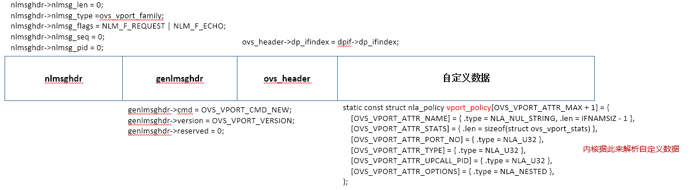

# Generic Netlink 

Generic Netlink是通用的用户态和内核态进行通信的机制，可以被多个应用使用，例如OVS就使用了Generic Netlink用于用户态和内核态通信

关于Netlink相关的实现已经在[Netlink](code-netlink.md)中介绍，本文仅介绍Generic Netlink相关的内容


## 内核Generic Netlink Socket初始化
```c
static int __net_init genl_pernet_init(struct net *net)
{
	struct netlink_kernel_cfg cfg = {
		.input		= genl_rcv,               //generic netlink socket处理函数
		.flags		= NL_CFG_F_NONROOT_RECV,
		.bind		= genl_bind,
		.unbind		= genl_unbind,
	};

	/* we'll bump the group number right afterwards */
	net->genl_sock = netlink_kernel_create(net, NETLINK_GENERIC, &cfg);  //创建内核socket

	if (!net->genl_sock && net_eq(net, &init_net))
		panic("GENL: Cannot initialize generic netlink\n");

	if (!net->genl_sock)
		return -ENOMEM;

	return 0;
}

static inline struct sock *
netlink_kernel_create(struct net *net, int unit, struct netlink_kernel_cfg *cfg)
{
	return __netlink_kernel_create(net, unit, THIS_MODULE, cfg);
}

struct sock *
__netlink_kernel_create(struct net *net, int unit, struct module *module,
			struct netlink_kernel_cfg *cfg)
{
	struct socket *sock;
	struct sock *sk;
	struct netlink_sock *nlk;
	struct listeners *listeners = NULL;
	struct mutex *cb_mutex = cfg ? cfg->cb_mutex : NULL;
	unsigned int groups;

	BUG_ON(!nl_table);

	if (unit < 0 || unit >= MAX_LINKS)
		return NULL;

	if (sock_create_lite(PF_NETLINK, SOCK_DGRAM, unit, &sock))	//创建socket对象
		return NULL;

	/*
	 * We have to just have a reference on the net from sk, but don't
	 * get_net it. Besides, we cannot get and then put the net here.
	 * So we create one inside init_net and the move it to net.
	 */

	if (__netlink_create(&init_net, sock, cb_mutex, unit) < 0)
		goto out_sock_release_nosk;

	sk = sock->sk;
	sk_change_net(sk, net);

	if (!cfg || cfg->groups < 32)
		groups = 32;
	else
		groups = cfg->groups;

	listeners = kzalloc(sizeof(*listeners) + NLGRPSZ(groups), GFP_KERNEL);
	if (!listeners)
		goto out_sock_release;

	sk->sk_data_ready = netlink_data_ready;
	if (cfg && cfg->input)
		nlk_sk(sk)->netlink_rcv = cfg->input;		//设置为genl_rcv

	if (netlink_insert(sk, 0))           //socket的portid为0
		goto out_sock_release;

	nlk = nlk_sk(sk);
	nlk->flags |= NETLINK_KERNEL_SOCKET;

	netlink_table_grab();
	if (!nl_table[unit].registered) {
		nl_table[unit].groups = groups;
		rcu_assign_pointer(nl_table[unit].listeners, listeners);
		nl_table[unit].cb_mutex = cb_mutex;
		nl_table[unit].module = module;
		if (cfg) {
			nl_table[unit].bind = cfg->bind;
			nl_table[unit].unbind = cfg->unbind;
			nl_table[unit].flags = cfg->flags;
			if (cfg->compare)
				nl_table[unit].compare = cfg->compare;
		}
		nl_table[unit].registered = 1;
	} else {
		kfree(listeners);
		nl_table[unit].registered++;
	}
	netlink_table_ungrab();
	return sk;

out_sock_release:
	kfree(listeners);
	netlink_kernel_release(sk);
	return NULL;

out_sock_release_nosk:
	sock_release(sock);
	return NULL;
}
```

## 内核发消息给用户态/内核态

消息发送给哪个socket由portid参数决定，0为内核态

```c
void genl_notify(struct genl_family *family,
		 struct sk_buff *skb, struct net *net, u32 portid, u32 group,
		 struct nlmsghdr *nlh, gfp_t flags)
{
	struct sock *sk = net->genl_sock;		//以内核的genl sock为源sock
	int report = 0;

	if (nlh)
		report = nlmsg_report(nlh);

	if (WARN_ON_ONCE(group >= family->n_mcgrps))
		return;
	group = family->mcgrp_offset + group;
	nlmsg_notify(sk, skb, portid, group, report, flags);   //发送消息
}

int nlmsg_notify(struct sock *sk, struct sk_buff *skb, u32 portid,
		 unsigned int group, int report, gfp_t flags)
{
	int err = 0;

	if (group) {
		int exclude_portid = 0;

		if (report) {
			atomic_inc(&skb->users);
			exclude_portid = portid;
		}

		/* errors reported via destination sk->sk_err, but propagate
		 * delivery errors if NETLINK_BROADCAST_ERROR flag is set */
		err = nlmsg_multicast(sk, skb, exclude_portid, group, flags);
	}

	if (report) {
		int err2;

		err2 = nlmsg_unicast(sk, skb, portid);    //发送消息
		if (!err || err == -ESRCH)
			err = err2;
	}

	return err;
}

static inline int nlmsg_unicast(struct sock *sk, struct sk_buff *skb, u32 portid)
{
	int err;

	err = netlink_unicast(sk, skb, portid, MSG_DONTWAIT);
	if (err > 0)
		err = 0;

	return err;
}

int netlink_unicast(struct sock *ssk, struct sk_buff *skb,
		    u32 portid, int nonblock)
{
	struct sock *sk;
	int err;
	long timeo;

	skb = netlink_trim(skb, gfp_any());

	timeo = sock_sndtimeo(ssk, nonblock);
retry:
	sk = netlink_getsockbyportid(ssk, portid);		//根据portid找到netlink_sock对象
	if (IS_ERR(sk)) {
		kfree_skb(skb);
		return PTR_ERR(sk);
	}
	if (netlink_is_kernel(sk))
		return netlink_unicast_kernel(sk, skb, ssk);

	if (sk_filter(sk, skb)) {
		err = skb->len;
		kfree_skb(skb);
		sock_put(sk);
		return err;
	}

	err = netlink_attachskb(sk, skb, &timeo, ssk);
	if (err == 1)
		goto retry;
	if (err)
		return err;

	return netlink_sendskb(sk, skb);    //发送消息，最终会发送到用户态socket的接收队列，并唤醒wait进程
}

```

## 用户态发消息给内核态

用户态发送消息，从sys_sendmsg，最终会调用到genl_rcv函数，通过该函数进一步会调用到用户在内核中注册的函数

```c
static void genl_rcv(struct sk_buff *skb)
{
	down_read(&cb_lock);
	netlink_rcv_skb(skb, &genl_rcv_msg);
	up_read(&cb_lock);
}

static int genl_rcv_msg(struct sk_buff *skb, struct nlmsghdr *nlh)
{
	struct genl_family *family;
	int err;

	family = genl_family_find_byid(nlh->nlmsg_type);	   //通过id找到family
	if (family == NULL)
		return -ENOENT;

	if (!family->parallel_ops)
		genl_lock();

	err = genl_family_rcv_msg(family, skb, nlh);

	if (!family->parallel_ops)
		genl_unlock();

	return err;
}

static int genl_family_rcv_msg(struct genl_family *family,
			       struct sk_buff *skb,
			       struct nlmsghdr *nlh)
{
	const struct genl_ops *ops;
	struct net *net = sock_net(skb->sk);
	struct genl_info info;
	struct genlmsghdr *hdr = nlmsg_data(nlh);	//直接根据skb->data+nlmsghdr头（对齐的大小）的指针 
	struct nlattr **attrbuf;
	int hdrlen, err;

	/* this family doesn't exist in this netns */
	if (!family->netnsok && !net_eq(net, &init_net))
		return -ENOENT;

	hdrlen = GENL_HDRLEN + family->hdrsize;
	if (nlh->nlmsg_len < nlmsg_msg_size(hdrlen))
		return -EINVAL;

	ops = genl_get_cmd(hdr->cmd, family);		//根据family和cmd得到方法
	if (ops == NULL)
		return -EOPNOTSUPP;

	if ((ops->flags & GENL_ADMIN_PERM) &&
	    !netlink_capable(skb, CAP_NET_ADMIN))
		return -EPERM;

	if ((nlh->nlmsg_flags & NLM_F_DUMP) == NLM_F_DUMP) {
		int rc;

		if (ops->dumpit == NULL)
			return -EOPNOTSUPP;

		if (!family->parallel_ops) {
			struct netlink_dump_control c = {
				.module = family->module,
				/* we have const, but the netlink API doesn't */
				.data = (void *)ops,
				.dump = genl_lock_dumpit,
				.done = genl_lock_done,
			};

			genl_unlock();
			rc = __netlink_dump_start(net->genl_sock, skb, nlh, &c);
			genl_lock();

		} else {
			struct netlink_dump_control c = {
				.module = family->module,
				.dump = ops->dumpit,
				.done = ops->done,
			};

			rc = __netlink_dump_start(net->genl_sock, skb, nlh, &c);
		}

		return rc;
	}

	if (ops->doit == NULL)
		return -EOPNOTSUPP;

	if (family->maxattr && family->parallel_ops) {
		attrbuf = kmalloc((family->maxattr+1) *
					sizeof(struct nlattr *), GFP_KERNEL);
		if (attrbuf == NULL)
			return -ENOMEM;
	} else
		attrbuf = family->attrbuf;

	if (attrbuf) {
		err = nlmsg_parse(nlh, hdrlen, attrbuf, family->maxattr,	//解析参数内容
				  ops->policy);
		if (err < 0)
			goto out;
	}

	info.snd_seq = nlh->nlmsg_seq;
	info.snd_portid = NETLINK_CB(skb).portid;
	info.nlhdr = nlh;				  //netlink头
	info.genlhdr = nlmsg_data(nlh);			  //通用头
	info.userhdr = nlmsg_data(nlh) + GENL_HDRLEN;  //用户自定义的头
	info.attrs = attrbuf;
	info.dst_sk = skb->sk;
	genl_info_net_set(&info, net);
	memset(&info.user_ptr, 0, sizeof(info.user_ptr));

	if (family->pre_doit) {
		err = family->pre_doit(ops, skb, &info);
		if (err)
			goto out;
	}

	err = ops->doit(skb, &info);	//调用用户定义的方法，此时用户定义的参数均已经解析

	if (family->post_doit)
		family->post_doit(ops, skb, &info);

out:
	if (family->parallel_ops)
		kfree(attrbuf);

	return err;
}
```

## 内核注册处理函数

以OVS使用Generic Netlink为例，说明如何在内核中注册Generic Netlink Socket的处理函数

```c
//genl_family定义了一类操作的，用id来唯一标识
static struct genl_family dp_flow_genl_family = {
	.id = GENL_ID_GENERATE,
	.hdrsize = sizeof(struct ovs_header),
	.name = OVS_FLOW_FAMILY,
	.version = OVS_FLOW_VERSION,
	.maxattr = OVS_FLOW_ATTR_MAX,
	.netnsok = true,
	.parallel_ops = true,
	.ops = dp_flow_genl_ops,   //处理函数
	.n_ops = ARRAY_SIZE(dp_flow_genl_ops),
	.mcgrps = &ovs_dp_flow_multicast_group,
	.n_mcgrps = 1,
};

//定义了操作函数，根据cmd来标识
static struct genl_ops dp_flow_genl_ops[] = {
	{ .cmd = OVS_FLOW_CMD_NEW,
	  .flags = GENL_ADMIN_PERM, /* Requires CAP_NET_ADMIN privilege. */
	  .policy = flow_policy,
	  .doit = ovs_flow_cmd_new
	},
	{ .cmd = OVS_FLOW_CMD_DEL,
	  .flags = GENL_ADMIN_PERM, /* Requires CAP_NET_ADMIN privilege. */
	  .policy = flow_policy,
	  .doit = ovs_flow_cmd_del
	},
	{ .cmd = OVS_FLOW_CMD_GET,
	  .flags = 0,		    /* OK for unprivileged users. */
	  .policy = flow_policy,
	  .doit = ovs_flow_cmd_get,
	  .dumpit = ovs_flow_cmd_dump
	},
	{ .cmd = OVS_FLOW_CMD_SET,
	  .flags = GENL_ADMIN_PERM, /* Requires CAP_NET_ADMIN privilege. */
	  .policy = flow_policy,
	  .doit = ovs_flow_cmd_set,
	},
};

//用来解析自定义参数，即nlmsg_parse函数
static const struct nla_policy flow_policy[OVS_FLOW_ATTR_MAX + 1] = {
	[OVS_FLOW_ATTR_KEY] = { .type = NLA_NESTED },
	[OVS_FLOW_ATTR_MASK] = { .type = NLA_NESTED },
	[OVS_FLOW_ATTR_ACTIONS] = { .type = NLA_NESTED },
	[OVS_FLOW_ATTR_CLEAR] = { .type = NLA_FLAG },
	[OVS_FLOW_ATTR_PROBE] = { .type = NLA_FLAG },
	[OVS_FLOW_ATTR_UFID] = { .type = NLA_UNSPEC, .len = 1 },
	[OVS_FLOW_ATTR_UFID_FLAGS] = { .type = NLA_U32 },
};

//ovs实际处理函数实例
static int ovs_flow_cmd_new(struct sk_buff *skb, struct genl_info *info)
{
	struct net *net = sock_net(skb->sk);
	struct nlattr **a = info->attrs;				//已经被解析完成
	struct ovs_header *ovs_header = info->userhdr;
	struct sw_flow *flow = NULL, *new_flow;
	struct sw_flow_mask mask;
	struct sk_buff *reply;
	struct datapath *dp;
	struct sw_flow_key key;
	struct sw_flow_actions *acts;
	struct sw_flow_match match;
	u32 ufid_flags = ovs_nla_get_ufid_flags(a[OVS_FLOW_ATTR_UFID_FLAGS]);   //可以直接使用自定义参数
	int error;
	bool log = !a[OVS_FLOW_ATTR_PROBE];

	/* Must have key and actions. */
	error = -EINVAL;
	if (!a[OVS_FLOW_ATTR_KEY]) {
		OVS_NLERR(log, "Flow key attr not present in new flow.");
		goto error;
	}
	if (!a[OVS_FLOW_ATTR_ACTIONS]) {
		OVS_NLERR(log, "Flow actions attr not present in new flow.");
		goto error;
	}

	/* Most of the time we need to allocate a new flow, do it before
	 * locking.
	 */
	new_flow = ovs_flow_alloc();
	if (IS_ERR(new_flow)) {
		error = PTR_ERR(new_flow);
		goto error;
	}

	/* Extract key. */
	ovs_match_init(&match, &key, &mask);
	error = ovs_nla_get_match(net, &match, a[OVS_FLOW_ATTR_KEY],
				  a[OVS_FLOW_ATTR_MASK], log);
	if (error)
		goto err_kfree_flow;

	ovs_flow_mask_key(&new_flow->key, &key, true, &mask);

	/* Extract flow identifier. */
	error = ovs_nla_get_identifier(&new_flow->id, a[OVS_FLOW_ATTR_UFID],
				       &key, log);
	if (error)
		goto err_kfree_flow;

	/* Validate actions. */
	error = ovs_nla_copy_actions(net, a[OVS_FLOW_ATTR_ACTIONS],
				     &new_flow->key, &acts, log);
	if (error) {
		OVS_NLERR(log, "Flow actions may not be safe on all matching packets.");
		goto err_kfree_flow;
	}

	reply = ovs_flow_cmd_alloc_info(acts, &new_flow->id, info, false,
					ufid_flags);
	if (IS_ERR(reply)) {
		error = PTR_ERR(reply);
		goto err_kfree_acts;
	}

	ovs_lock();
	dp = get_dp(net, ovs_header->dp_ifindex);
	if (unlikely(!dp)) {
		error = -ENODEV;
		goto err_unlock_ovs;
	}

	/* Check if this is a duplicate flow */
	if (ovs_identifier_is_ufid(&new_flow->id))
		flow = ovs_flow_tbl_lookup_ufid(&dp->table, &new_flow->id);
	if (!flow)
		flow = ovs_flow_tbl_lookup(&dp->table, &key);
	if (likely(!flow)) {
		rcu_assign_pointer(new_flow->sf_acts, acts);

		/* Put flow in bucket. */
		error = ovs_flow_tbl_insert(&dp->table, new_flow, &mask);
		if (unlikely(error)) {
			acts = NULL;
			goto err_unlock_ovs;
		}

		if (unlikely(reply)) {
			error = ovs_flow_cmd_fill_info(new_flow,
						       ovs_header->dp_ifindex,
						       reply, info->snd_portid,
						       info->snd_seq, 0,
						       OVS_FLOW_CMD_NEW,
						       ufid_flags);
			BUG_ON(error < 0);
		}
		ovs_unlock();
	} else {
		struct sw_flow_actions *old_acts;

		/* Bail out if we're not allowed to modify an existing flow.
		 * We accept NLM_F_CREATE in place of the intended NLM_F_EXCL
		 * because Generic Netlink treats the latter as a dump
		 * request.  We also accept NLM_F_EXCL in case that bug ever
		 * gets fixed.
		 */
		if (unlikely(info->nlhdr->nlmsg_flags & (NLM_F_CREATE
							 | NLM_F_EXCL))) {
			error = -EEXIST;
			goto err_unlock_ovs;
		}
		/* The flow identifier has to be the same for flow updates.
		 * Look for any overlapping flow.
		 */
		if (unlikely(!ovs_flow_cmp(flow, &match))) {
			if (ovs_identifier_is_key(&flow->id))
				flow = ovs_flow_tbl_lookup_exact(&dp->table,
								 &match);
			else /* UFID matches but key is different */
				flow = NULL;
			if (!flow) {
				error = -ENOENT;
				goto err_unlock_ovs;
			}
		}
		/* Update actions. */
		old_acts = ovsl_dereference(flow->sf_acts);
		rcu_assign_pointer(flow->sf_acts, acts);

		if (unlikely(reply)) {
			error = ovs_flow_cmd_fill_info(flow,
						       ovs_header->dp_ifindex,
						       reply, info->snd_portid,
						       info->snd_seq, 0,
						       OVS_FLOW_CMD_NEW,
						       ufid_flags);
			BUG_ON(error < 0);
		}
		ovs_unlock();

		ovs_nla_free_flow_actions_rcu(old_acts);
		ovs_flow_free(new_flow, false);
	}

	if (reply)
		ovs_notify(&dp_flow_genl_family, &ovs_dp_flow_multicast_group, reply, info);
	return 0;

err_unlock_ovs:
	ovs_unlock();
	kfree_skb(reply);
err_kfree_acts:
	ovs_nla_free_flow_actions(acts);
err_kfree_flow:
	ovs_flow_free(new_flow, false);
error:
	return error;
}


## 用户态Generic Netlink socket应用

1. 创建socket（PF_NETLINK，SOCK_DGRAM，NETLINK_GENERIC）
2. socket connect操作
```c
memset(&remote, 0, sizeof remote);
remote.nl_family = AF_NETLINK;
remote.nl_pid = 0;
connect(fd, (struct sockaddr *) &remote, sizeof remote)
```
3. socket发送消息


### Generic Netlink Socket消息头定义

发送Generic Netlink Socket消息需要符合标准定义，其中nlmsghdr和genlmsghdr是必须的消息头，之后可以自定义消息内容


