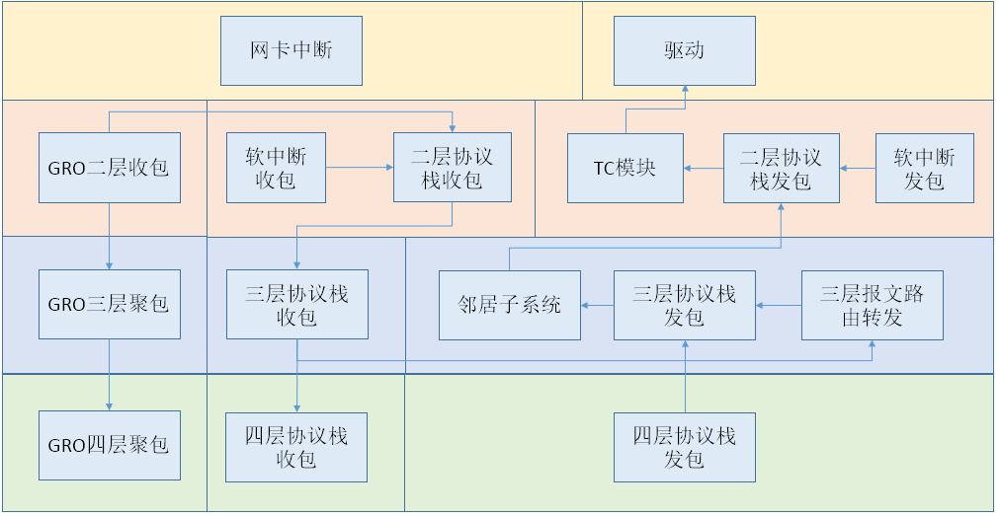
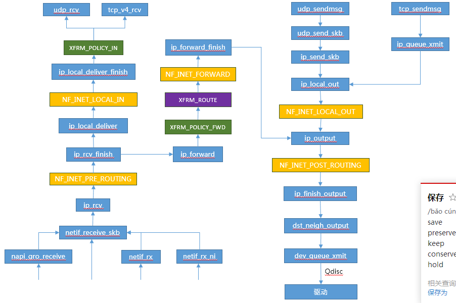

# 内核收包框架

本文将介绍内核链路层和IP层的收包处理流程，传输层将单独介绍，另外本文重点讲解整体框架，GRO、NAPI等细节将单独分析。


## 整体流程图




## 整体收发包流程




## 链路层收包

链路层收包是以太报文进入Linux内核的通道。

链路层收包函数包括：

* netif_rx
  * 报文放入backlog，等待下次软中断时接收
* netif_rx_ni
  * 报文放入backlog，如果软中断标志已打开，则直接进入软中断处理
* dev_forward_skb
  * 发送报文给本地虚拟设备，然后作为该设备收包处理
* napi_gro_receive
  * 报文聚合后再上送至协议栈
* netif_receive_skb
  * 报文上报协议栈，支持RPS处理
* __netif_receive_skb
  * 报文直接上送至协议栈，由当前CPU处理
  
```c
int netif_rx(struct sk_buff *skb)
{
	trace_netif_rx_entry(skb);

	return netif_rx_internal(skb);	//数据放入缓冲区
}

int netif_rx_ni(struct sk_buff *skb)
{
	int err;

	trace_netif_rx_ni_entry(skb);

	preempt_disable();
	err = netif_rx_internal(skb);  //数据放入缓冲区
	if (local_softirq_pending())   //如果软中断标志已打开，则直接进入软中断处理
		do_softirq();		       //处理软中断
	preempt_enable();

	return err;
}

int dev_forward_skb(struct net_device *dev, struct sk_buff *skb)
{
	return __dev_forward_skb(dev, skb) ?: netif_rx_internal(skb);  //数据放入缓冲区
}

gro_result_t napi_gro_receive(struct napi_struct *napi, struct sk_buff *skb)
{
	trace_napi_gro_receive_entry(skb);

	skb_gro_reset_offset(skb);	//初始化NAPI_GRO_CB结构体

	return napi_skb_finish(dev_gro_receive(napi, skb), skb);	//gro收包并提交给协议栈处理
}

static inline int netif_receive_skb(struct sk_buff *skb)
{
	return netif_receive_skb_sk(skb->sk, skb);
}

int netif_receive_skb_sk(struct sock *sk, struct sk_buff *skb)
{
	trace_netif_receive_skb_entry(skb);

	return netif_receive_skb_internal(skb);
}

static int netif_receive_skb_internal(struct sk_buff *skb)
{
	int ret;

	net_timestamp_check(netdev_tstamp_prequeue, skb);

	if (skb_defer_rx_timestamp(skb))
		return NET_RX_SUCCESS;

	rcu_read_lock();

#ifdef CONFIG_RPS
	if (static_key_false(&rps_needed)) {
		struct rps_dev_flow voidflow, *rflow = &voidflow;
		int cpu = get_rps_cpu(skb->dev, skb, &rflow);		//支持rps，选择报文处理的CPU

		if (cpu >= 0) {
			ret = enqueue_to_backlog(skb, cpu, &rflow->last_qtail);	//放到相应CPU的缓冲区
			rcu_read_unlock();
			return ret;
		}
	}
#endif
	ret = __netif_receive_skb(skb);
	rcu_read_unlock();
	return ret;
}

static int __netif_receive_skb(struct sk_buff *skb)
{
	int ret;

	if (sk_memalloc_socks() && skb_pfmemalloc(skb)) {
		unsigned long pflags = current->flags;

		/*
		 * PFMEMALLOC skbs are special, they should
		 * - be delivered to SOCK_MEMALLOC sockets only
		 * - stay away from userspace
		 * - have bounded memory usage
		 *
		 * Use PF_MEMALLOC as this saves us from propagating the allocation
		 * context down to all allocation sites.
		 */
		current->flags |= PF_MEMALLOC;
		ret = __netif_receive_skb_core(skb, true);
		tsk_restore_flags(current, pflags, PF_MEMALLOC);
	} else
		ret = __netif_receive_skb_core(skb, false);

	return ret;
}

static int __netif_receive_skb_core(struct sk_buff *skb, bool pfmemalloc)
{
	struct packet_type *ptype, *pt_prev;
	rx_handler_func_t *rx_handler;
	struct net_device *orig_dev;
	bool deliver_exact = false;
	int ret = NET_RX_DROP;
	__be16 type;

	net_timestamp_check(!netdev_tstamp_prequeue, skb);

	trace_netif_receive_skb(skb);

	orig_dev = skb->dev;

	skb_reset_network_header(skb);		//重置network header，此时skb已经指向IP头（或vlan报文的内层协议字段）
	if (!skb_transport_header_was_set(skb))
		skb_reset_transport_header(skb);
	skb_reset_mac_len(skb);		//重置mac len

	pt_prev = NULL;

another_round:
	skb->skb_iif = skb->dev->ifindex;	//设置报文的iif值

	__this_cpu_inc(softnet_data.processed);

	if (skb->protocol == cpu_to_be16(ETH_P_8021Q) ||	//普通vlan报文第二次进入时，protocol为非vlan的协议
	    skb->protocol == cpu_to_be16(ETH_P_8021AD)) {	//qinq场景，需要外层的vlan设备存在，skb->protocol在skb_vlan_untag函数中，会更新成内层报文协议
		skb = skb_vlan_untag(skb);	//剥除vlan头，并更新skb->protocol为内层报文协议，并设置skb->vlan_tci，该标记使得skb_vlan_tag_present成立
		if (unlikely(!skb))
			goto out;
	}

#ifdef CONFIG_NET_CLS_ACT
	if (skb->tc_verd & TC_NCLS) {
		skb->tc_verd = CLR_TC_NCLS(skb->tc_verd);
		goto ncls;
	}
#endif

	if (pfmemalloc)	 //此类报文不允许ptype_all处理，即tcpdump也抓不到
		goto skip_taps;

	list_for_each_entry_rcu(ptype, &ptype_all, list) {  //遍历ptype_all全局数组，如果有则做相应处理，例如packet socket和tcpdump实现
		if (pt_prev)
			ret = deliver_skb(skb, pt_prev, orig_dev);  //执行处理函数
		pt_prev = ptype;
	}

	list_for_each_entry_rcu(ptype, &skb->dev->ptype_all, list) {  //遍历dev->ptype_all数组，做相应的处理，更加精细的控制，tcpdump -i 用此方法？
		if (pt_prev)
			ret = deliver_skb(skb, pt_prev, orig_dev);
		pt_prev = ptype;
	}

skip_taps:
#ifdef CONFIG_NET_CLS_ACT
	if (static_key_false(&ingress_needed)) {
		skb = handle_ing(skb, &pt_prev, &ret, orig_dev);
		if (!skb)
			goto out;
	}

	skb->tc_verd = 0;
ncls:
#endif
	if (pfmemalloc && !skb_pfmemalloc_protocol(skb))
		goto drop;

	if (skb_vlan_tag_present(skb)) {	//skb的vlan_tci值是否已经设置， 调用skb_vlan_untag时，会把skb->vlan_tci打上VLAN_TAG_PRESENT标记
		if (pt_prev) {
			ret = deliver_skb(skb, pt_prev, orig_dev);
			pt_prev = NULL;
		}
		if (vlan_do_receive(&skb))	//根据vlan头，找vlan设备，如果找到则交由vlan设备处理
			goto another_round;	    //如果vlan设备存在，继续下一轮处理，处理完成后会把skb->vlan_tci置0， qinq场景，外层vlan设备需要存在
		else if (unlikely(!skb))
			goto out;
	}

	rx_handler = rcu_dereference(skb->dev->rx_handler);	//设备rx_handler，加入OVS时会注册为OVS的入口函数
	if (rx_handler) {
		if (pt_prev) {
			ret = deliver_skb(skb, pt_prev, orig_dev);
			pt_prev = NULL;
		}
		switch (rx_handler(&skb)) {		//执行rx_handler处理，此时报文的vlan头已经被全部清除，除非vlan设备设置为保留vlan头
		case RX_HANDLER_CONSUMED:
			ret = NET_RX_SUCCESS;
			goto out;
		case RX_HANDLER_ANOTHER:
			goto another_round;
		case RX_HANDLER_EXACT:
			deliver_exact = true;
		case RX_HANDLER_PASS:
			break;
		default:
			BUG();
		}
	}
	
	if (unlikely(skb_vlan_tag_present(skb))) {		//到此处，vlan头应该已经处理完成
		if (skb_vlan_tag_get_id(skb))
			skb->pkt_type = PACKET_OTHERHOST;
		/* Note: we might in the future use prio bits
		 * and set skb->priority like in vlan_do_receive()
		 * For the time being, just ignore Priority Code Point
		 */
		skb->vlan_tci = 0;
	}

	type = skb->protocol;

	/* deliver only exact match when indicated */
	if (likely(!deliver_exact)) {
		deliver_ptype_list_skb(skb, &pt_prev, orig_dev, type,	//根据全局定义的协议处理报文
				       &ptype_base[ntohs(type) &
						   PTYPE_HASH_MASK]);
	}

	deliver_ptype_list_skb(skb, &pt_prev, orig_dev, type,	 //根据设备上注册的协议进行处理
			       &orig_dev->ptype_specific);

	if (unlikely(skb->dev != orig_dev)) {
		deliver_ptype_list_skb(skb, &pt_prev, orig_dev, type,
				       &skb->dev->ptype_specific);   //如果设备发生变化，那么还需要针对新设备的注册协议进行处理
	}

	if (pt_prev) {
		if (unlikely(skb_orphan_frags(skb, GFP_ATOMIC)))
			goto drop;
		else
			ret = pt_prev->func(skb, skb->dev, pt_prev, orig_dev);	//调用协议处理
	} else {
drop:
		atomic_long_inc(&skb->dev->rx_dropped);
		kfree_skb(skb);
		/* Jamal, now you will not able to escape explaining
		 * me how you were going to use this. :-)
		 */
		ret = NET_RX_DROP;
	}

out:
	return ret;
}
```

### 内核注册以太网协议

```c
//全局变量
extern struct list_head ptype_all __read_mostly;
extern struct list_head ptype_base[PTYPE_HASH_SIZE] __read_mostly;

//注册协议
void dev_add_pack(struct packet_type *pt)
{
	struct list_head *head = ptype_head(pt);  //根据pt定义的协议类型，决定放在哪个全局链表

	spin_lock(&ptype_lock);
	list_add_rcu(&pt->list, head);
	spin_unlock(&ptype_lock);
}

static inline struct list_head *ptype_head(const struct packet_type *pt)
{
	if (pt->type == htons(ETH_P_ALL))
		return pt->dev ? &pt->dev->ptype_all : &ptype_all;
	else
		return pt->dev ? &pt->dev->ptype_specific :
				 &ptype_base[ntohs(pt->type) & PTYPE_HASH_MASK];
}

//内核注册的部分协议
dev_add_pack(&ip_packet_type);   //IPV4协议
dev_add_pack(&rarp_packet_type);
dev_add_pack(&arp_packet_type);
```

## IP层收包

```c
static struct packet_type ip_packet_type __read_mostly = {
	.type = cpu_to_be16(ETH_P_IP),
	.func = ip_rcv,
};

int ip_rcv(struct sk_buff *skb, struct net_device *dev, struct packet_type *pt, struct net_device *orig_dev)
{
	const struct iphdr *iph;
	u32 len;

	/* When the interface is in promisc. mode, drop all the crap
	 * that it receives, do not try to analyse it.
	 */
	//网卡收包时会根据mac地址进行匹配，如果匹配该值为PACKET_HOST，所以报文的DMAC地址必须为接收节点的MAC地址
	if (skb->pkt_type == PACKET_OTHERHOST)   
		goto drop;


	IP_UPD_PO_STATS_BH(dev_net(dev), IPSTATS_MIB_IN, skb->len);

	skb = skb_share_check(skb, GFP_ATOMIC);
	if (!skb) {
		IP_INC_STATS_BH(dev_net(dev), IPSTATS_MIB_INDISCARDS);
		goto out;
	}

	if (!pskb_may_pull(skb, sizeof(struct iphdr)))   //报文大小check
		goto inhdr_error;

	iph = ip_hdr(skb);

	/*
	 *	RFC1122: 3.2.1.2 MUST silently discard any IP frame that fails the checksum.
	 *
	 *	Is the datagram acceptable?
	 *
	 *	1.	Length at least the size of an ip header
	 *	2.	Version of 4
	 *	3.	Checksums correctly. [Speed optimisation for later, skip loopback checksums]
	 *	4.	Doesn't have a bogus length
	 */

	if (iph->ihl < 5 || iph->version != 4)		//ip协议版本check
		goto inhdr_error;

	BUILD_BUG_ON(IPSTATS_MIB_ECT1PKTS != IPSTATS_MIB_NOECTPKTS + INET_ECN_ECT_1);
	BUILD_BUG_ON(IPSTATS_MIB_ECT0PKTS != IPSTATS_MIB_NOECTPKTS + INET_ECN_ECT_0);
	BUILD_BUG_ON(IPSTATS_MIB_CEPKTS != IPSTATS_MIB_NOECTPKTS + INET_ECN_CE);
	IP_ADD_STATS_BH(dev_net(dev),
			IPSTATS_MIB_NOECTPKTS + (iph->tos & INET_ECN_MASK),
			max_t(unsigned short, 1, skb_shinfo(skb)->gso_segs));

	if (!pskb_may_pull(skb, iph->ihl*4))   //check报文总大小
		goto inhdr_error;

	iph = ip_hdr(skb);

	if (unlikely(ip_fast_csum((u8 *)iph, iph->ihl)))	//ip头校验
		goto csum_error;

	len = ntohs(iph->tot_len);    //得到报文总长度
	if (skb->len < len) {
		IP_INC_STATS_BH(dev_net(dev), IPSTATS_MIB_INTRUNCATEDPKTS);
		goto drop;
	} else if (len < (iph->ihl*4))
		goto inhdr_error;

	/* Our transport medium may have padded the buffer out. Now we know it
	 * is IP we can trim to the true length of the frame.
	 * Note this now means skb->len holds ntohs(iph->tot_len).
	 */
	if (pskb_trim_rcsum(skb, len)) {
		IP_INC_STATS_BH(dev_net(dev), IPSTATS_MIB_INDISCARDS);
		goto drop;
	}

	skb->transport_header = skb->network_header + iph->ihl*4;	 //设置transport header

	/* Remove any debris in the socket control block */
	memset(IPCB(skb), 0, sizeof(struct inet_skb_parm));

	/* Must drop socket now because of tproxy. */
	skb_orphan(skb);

	return NF_HOOK(NFPROTO_IPV4, NF_INET_PRE_ROUTING, NULL, skb,	//进入Netfilter hook点处理
		       dev, NULL,
		       ip_rcv_finish);

csum_error:
	IP_INC_STATS_BH(dev_net(dev), IPSTATS_MIB_CSUMERRORS);
inhdr_error:
	IP_INC_STATS_BH(dev_net(dev), IPSTATS_MIB_INHDRERRORS);
drop:
	kfree_skb(skb);
out:
	return NET_RX_DROP;
}

static int ip_rcv_finish(struct sock *sk, struct sk_buff *skb)
{
	const struct iphdr *iph = ip_hdr(skb);
	struct rtable *rt;

	if (sysctl_ip_early_demux && !skb_dst(skb) && !skb->sk) {
		const struct net_protocol *ipprot;
		int protocol = iph->protocol;

		ipprot = rcu_dereference(inet_protos[protocol]);	//根据协议号找到L4传输层协议	
		if (ipprot && ipprot->early_demux) {
			ipprot->early_demux(skb);
			/* must reload iph, skb->head might have changed */
			iph = ip_hdr(skb);
		}
	}

	/*
	 *	Initialise the virtual path cache for the packet. It describes
	 *	how the packet travels inside Linux networking.
	 */
	if (!skb_dst(skb)) {								//这个参数skb_dst_set函数中设置
		int err = ip_route_input_noref(skb, iph->daddr, iph->saddr,   //查找路由表，决定了报文下一步怎么走
					       iph->tos, skb->dev);
		if (unlikely(err)) {
			if (err == -EXDEV)
				NET_INC_STATS_BH(dev_net(skb->dev),
						 LINUX_MIB_IPRPFILTER);
			goto drop;
		}
	}

#ifdef CONFIG_IP_ROUTE_CLASSID
	if (unlikely(skb_dst(skb)->tclassid)) {
		struct ip_rt_acct *st = this_cpu_ptr(ip_rt_acct);
		u32 idx = skb_dst(skb)->tclassid;
		st[idx&0xFF].o_packets++;
		st[idx&0xFF].o_bytes += skb->len;
		st[(idx>>16)&0xFF].i_packets++;
		st[(idx>>16)&0xFF].i_bytes += skb->len;
	}
#endif

	if (iph->ihl > 5 && ip_rcv_options(skb))   //IP头包含Option信息，处理Options
		goto drop;

	rt = skb_rtable(skb);
	if (rt->rt_type == RTN_MULTICAST) {
		IP_UPD_PO_STATS_BH(dev_net(rt->dst.dev), IPSTATS_MIB_INMCAST,
				skb->len);
	} else if (rt->rt_type == RTN_BROADCAST)
		IP_UPD_PO_STATS_BH(dev_net(rt->dst.dev), IPSTATS_MIB_INBCAST,
				skb->len);

	return dst_input(skb);    //继续下一步收包处理
drop:
	kfree_skb(skb);
	return NET_RX_DROP;
}

static inline int dst_input(struct sk_buff *skb)
{
	return skb_dst(skb)->input(skb);  //ip_local_deliver（本地收包） 或 ip_forward（转发）
}
```

### IP报文转发

```c
int ip_forward(struct sk_buff *skb)
{
	u32 mtu;
	struct iphdr *iph;	/* Our header */
	struct rtable *rt;	/* Route we use */
	struct ip_options *opt	= &(IPCB(skb)->opt);

	/* that should never happen */
	if (skb->pkt_type != PACKET_HOST)	//不允许处理非本host的报文，即报文目的mac是本机
		goto drop;

	if (unlikely(skb->sk))	
		goto drop;

	if (skb_warn_if_lro(skb))	//报文为非线性，gso_size不为零，但是gso_type为零，丢弃此类报文
		goto drop;

	if (!xfrm4_policy_check(NULL, XFRM_POLICY_FWD, skb))	//ipset安全规则检测
		goto drop;

	if (IPCB(skb)->opt.router_alert && ip_call_ra_chain(skb))
		return NET_RX_SUCCESS;

	skb_forward_csum(skb);

	/*
	 *	According to the RFC, we must first decrease the TTL field. If
	 *	that reaches zero, we must reply an ICMP control message telling
	 *	that the packet's lifetime expired.
	 */
	if (ip_hdr(skb)->ttl <= 1)	//ttl减到0 ，丢弃报文
		goto too_many_hops;

	if (!xfrm4_route_forward(skb))	//ipsec路由安全规则检测，如果配置，先进行xfrm处理
		goto drop;

	rt = skb_rtable(skb);	//得到路由表项

	if (opt->is_strictroute && rt->rt_uses_gateway)
		goto sr_failed;

	IPCB(skb)->flags |= IPSKB_FORWARDED;	          //flag中添加forward标记
	mtu = ip_dst_mtu_maybe_forward(&rt->dst, true);
	if (!ip_may_fragment(skb) && ip_exceeds_mtu(skb, mtu)) {
		IP_INC_STATS(dev_net(rt->dst.dev), IPSTATS_MIB_FRAGFAILS);
		icmp_send(skb, ICMP_DEST_UNREACH, ICMP_FRAG_NEEDED,	//报文长度超过mtu且不允许ip分片，发送icmp消息给发送者
			  htonl(mtu));
		goto drop;
	}

	/* We are about to mangle packet. Copy it! */
	if (skb_cow(skb, LL_RESERVED_SPACE(rt->dst.dev)+rt->dst.header_len))	//扩展报文，以填充mac头
		goto drop;
	iph = ip_hdr(skb);

	/* Decrease ttl after skb cow done */
	ip_decrease_ttl(iph);	//ip头的ttl减一

	/*
	 *	We now generate an ICMP HOST REDIRECT giving the route
	 *	we calculated.
	 */
	if (IPCB(skb)->flags & IPSKB_DOREDIRECT && !opt->srr &&
	    !skb_sec_path(skb))
		ip_rt_send_redirect(skb);	//通知发送端，路由重定向

	skb->priority = rt_tos2priority(iph->tos);	//根据tos值计算priority值

	return NF_HOOK(NFPROTO_IPV4, NF_INET_FORWARD, NULL, skb,
		       skb->dev, rt->dst.dev, ip_forward_finish);  //调用netfilter，实现iptables功能，通过后调用ip_forward_finish

sr_failed:
	/*
	 *	Strict routing permits no gatewaying
	 */
	 icmp_send(skb, ICMP_DEST_UNREACH, ICMP_SR_FAILED, 0);
	 goto drop;

too_many_hops:
	/* Tell the sender its packet died... */
	IP_INC_STATS_BH(dev_net(skb_dst(skb)->dev), IPSTATS_MIB_INHDRERRORS);
	icmp_send(skb, ICMP_TIME_EXCEEDED, ICMP_EXC_TTL, 0);
drop:
	kfree_skb(skb);
	return NET_RX_DROP;
}

static int ip_forward_finish(struct sock *sk, struct sk_buff *skb)
{
	struct ip_options *opt	= &(IPCB(skb)->opt);

	IP_INC_STATS_BH(dev_net(skb_dst(skb)->dev), IPSTATS_MIB_OUTFORWDATAGRAMS);	//报文统计
	IP_ADD_STATS_BH(dev_net(skb_dst(skb)->dev), IPSTATS_MIB_OUTOCTETS, skb->len);

	if (unlikely(opt->optlen))
		ip_forward_options(skb);

	skb_sender_cpu_clear(skb);
	return dst_output_sk(sk, skb);	//此时会进入xfrm4_output处理，最终会调用ip_output，报文发送待到协议栈发包中介绍
}
```

### IP报文本地收包

```c
int ip_local_deliver(struct sk_buff *skb)
{
	/*
	 *	Reassemble IP fragments.
	 */

	if (ip_is_fragment(ip_hdr(skb))) {
		if (ip_defrag(skb, IP_DEFRAG_LOCAL_DELIVER)) //如果是ip分片报文，则需要报文组装完整后才能提交给上层
			return 0;
	}

	return NF_HOOK(NFPROTO_IPV4, NF_INET_LOCAL_IN, NULL, skb,
		       skb->dev, NULL,
		       ip_local_deliver_finish);	//调用netfilter，实现iptables功能，通过后调用ip_local_deliver_finish
}

static int ip_local_deliver_finish(struct sock *sk, struct sk_buff *skb)
{
	struct net *net = dev_net(skb->dev);

	__skb_pull(skb, skb_network_header_len(skb));	//报文移动到传输头

	rcu_read_lock();
	{
		int protocol = ip_hdr(skb)->protocol;	//得到IP头中的协议类型，即4层协议
		const struct net_protocol *ipprot;
		int raw;

	resubmit:
		raw = raw_local_deliver(skb, protocol);	 //AF_INET的raw sock处理入口，上送raw socket收包处理

		ipprot = rcu_dereference(inet_protos[protocol]);	//获取四层协议收包处理函数
		if (ipprot) {
			int ret;

			if (!ipprot->no_policy) {	//4.1.12内核中，所有协议的no_policy都为1，条件不成立
				if (!xfrm4_policy_check(NULL, XFRM_POLICY_IN, skb)) {	 //ipsec策略检测
					kfree_skb(skb);
					goto out;
				}
				nf_reset(skb);
			}
			ret = ipprot->handler(skb);	 //交给上层处理报文，UDP/TCP/ICMP等等
			if (ret < 0) {
				protocol = -ret;
				goto resubmit;
			}
			IP_INC_STATS_BH(net, IPSTATS_MIB_INDELIVERS);
		} else {		//协议未定义
			if (!raw) {	//如果不是raw，则检测ipse策略，如果检测通过则发送ICMP消息
				if (xfrm4_policy_check(NULL, XFRM_POLICY_IN, skb)) {
					IP_INC_STATS_BH(net, IPSTATS_MIB_INUNKNOWNPROTOS);
					icmp_send(skb, ICMP_DEST_UNREACH,
						  ICMP_PROT_UNREACH, 0);
				}
				kfree_skb(skb);
			} else {
				IP_INC_STATS_BH(net, IPSTATS_MIB_INDELIVERS);
				consume_skb(skb);
			}
		}
	}
 out:
	rcu_read_unlock();

	return 0;
}
```

### 内核注册传输层协议

```c
//全局变量
extern const struct net_protocol __rcu *inet_protos[MAX_INET_PROTOS];

//注册协议
int inet_add_protocol(const struct net_protocol *prot, unsigned char protocol)
{
	if (!prot->netns_ok) {
		pr_err("Protocol %u is not namespace aware, cannot register.\n",
			protocol);
		return -EINVAL;
	}

	return !cmpxchg((const struct net_protocol **)&inet_protos[protocol],
			NULL, prot) ? 0 : -1;
}

//内核注册的部分协议
inet_add_protocol(&icmp_protocol, IPPROTO_ICMP)    
inet_add_protocol(&udp_protocol, IPPROTO_UDP)     //UDP
inet_add_protocol(&tcp_protocol, IPPROTO_TCP)     //TCP
inet_add_protocol(&igmp_protocol, IPPROTO_IGMP)
```