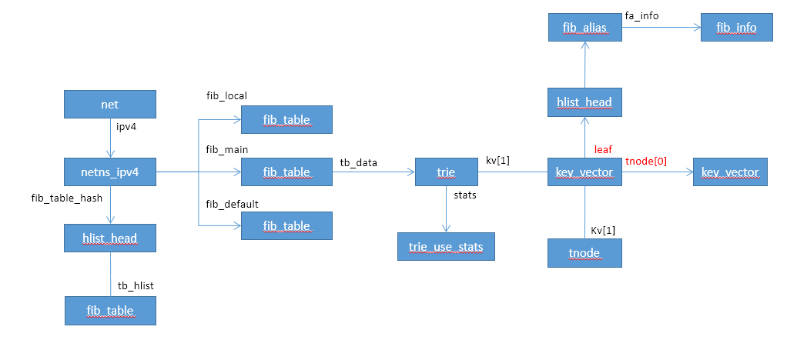
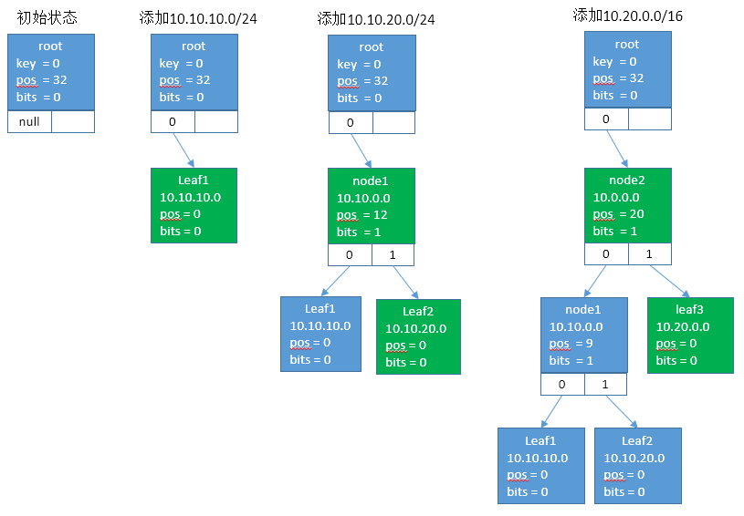
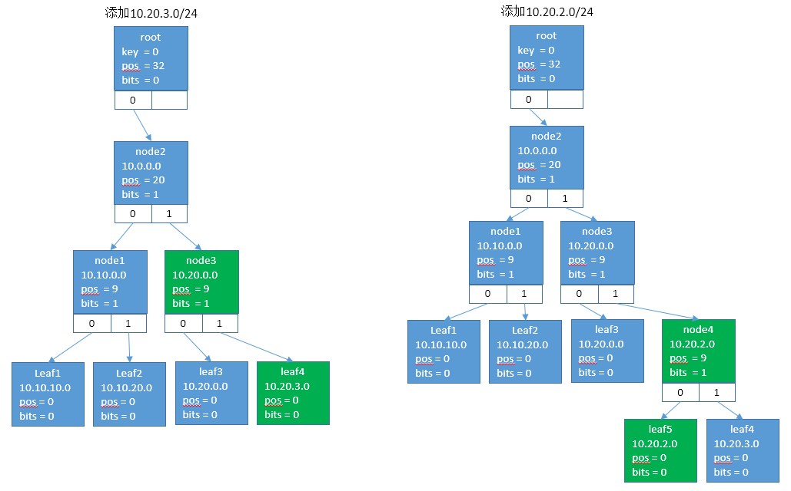
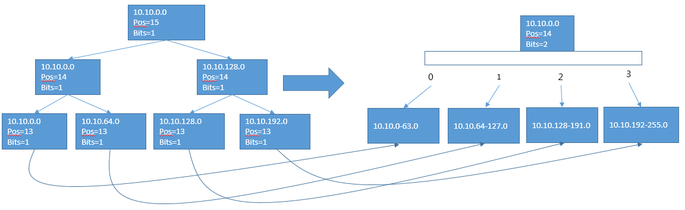

# trie算法

Trie，又称字典树、单词查找树或键树，是一种树形结构，是一种哈希树的变种。典型应用是用于统计，排序和保存大量的字符串（但不仅限于字符串），所以经常被搜索引擎系统用于文本词频统计。它的优点是：利用字符串的公共前缀来减少查询时间，最大限度地减少无谓的字符串比较，查询效率比哈希树高。

Linux Route使用trie进行路由的管理，但是针对trie又进行了优化，以防止检索树过深。


## Linux Route trie算法原理


### 整体数据结构



### trie数据结构

key_vector为trie树的节点定义

```c
struct key_vector {
	t_key key;
	unsigned char pos;		/* 2log(KEYLENGTH) bits needed */
	unsigned char bits;		/* 2log(KEYLENGTH) bits needed */
	unsigned char slen;
	union {
		/* This list pointer if valid if (pos | bits) == 0 (LEAF) */
		struct hlist_head leaf;
		/* This array is valid if (pos | bits) > 0 (TNODE) */
		struct key_vector __rcu *tnode[0];
	};
};

struct tnode {
	struct rcu_head rcu;
	t_key empty_children;		/* KEYLENGTH bits needed */
	t_key full_children;		/* KEYLENGTH bits needed */
	struct key_vector __rcu *parent;
	struct key_vector kv[1];
#define tn_bits kv[0].bits
};
```

key_vector中的参数说明原文如下，翻译成中文：

* key字段只有在key_vector为leaf节点时才全部有意义，用于IP匹配
* pos和bits均为0时，表示key_vector为leaf节点
* key字段的pos到(pos + bits - 1)的内容为child的index
* key字段的31到(pos + 1)位之间的是匹配的内容
* pos越小，匹配的位数越多
* slen代表掩码长度，slen大于pos时，说明可以匹配
* parent的slen不小于child的slen

```c
/* To understand this stuff, an understanding of keys and all their bits is
 * necessary. Every node in the trie has a key associated with it, but not
 * all of the bits in that key are significant.
 *
 * Consider a node 'n' and its parent 'tp'.
 *
 * If n is a leaf, every bit in its key is significant. Its presence is
 * necessitated by path compression, since during a tree traversal (when
 * searching for a leaf - unless we are doing an insertion) we will completely
 * ignore all skipped bits we encounter. Thus we need to verify, at the end of
 * a potentially successful search, that we have indeed been walking the
 * correct key path.
 *
 * Note that we can never "miss" the correct key in the tree if present by
 * following the wrong path. Path compression ensures that segments of the key
 * that are the same for all keys with a given prefix are skipped, but the
 * skipped part *is* identical for each node in the subtrie below the skipped
 * bit! trie_insert() in this implementation takes care of that.
 *
 * if n is an internal node - a 'tnode' here, the various parts of its key
 * have many different meanings.
 *
 * Example:
 * _________________________________________________________________
 * | i | i | i | i | i | i | i | N | N | N | S | S | S | S | S | C |
 * -----------------------------------------------------------------
 *  31  30  29  28  27  26  25  24  23  22  21  20  19  18  17  16
 *
 * _________________________________________________________________
 * | C | C | C | u | u | u | u | u | u | u | u | u | u | u | u | u |
 * -----------------------------------------------------------------
 *  15  14  13  12  11  10   9   8   7   6   5   4   3   2   1   0
 *
 * tp->pos = 22
 * tp->bits = 3
 * n->pos = 13
 * n->bits = 4
 *
 * First, let's just ignore the bits that come before the parent tp, that is
 * the bits from (tp->pos + tp->bits) to 31. They are *known* but at this
 * point we do not use them for anything.
 *
 * The bits from (tp->pos) to (tp->pos + tp->bits - 1) - "N", above - are the
 * index into the parent's child array. That is, they will be used to find
 * 'n' among tp's children.
 *
 * The bits from (n->pos + n->bits) to (tn->pos - 1) - "S" - are skipped bits
 * for the node n.
 *
 * All the bits we have seen so far are significant to the node n. The rest
 * of the bits are really not needed or indeed known in n->key.
 *
 * The bits from (n->pos) to (n->pos + n->bits - 1) - "C" - are the index into
 * n's child array, and will of course be different for each child.
 *
 * The rest of the bits, from 0 to (n->pos + n->bits), are completely unknown
 * at this point.
 */
```


### trie关键函数


#### 创建叶子节点

```c
static struct key_vector *leaf_new(t_key key, struct fib_alias *fa)
{
	struct tnode *kv = kmem_cache_alloc(trie_leaf_kmem, GFP_KERNEL);
	struct key_vector *l = kv->kv;

	if (!kv)
		return NULL;

	/* initialize key vector */
	l->key = key;
	l->pos = 0;
	l->bits = 0;
	l->slen = fa->fa_slen;

	/* link leaf to fib alias */
	INIT_HLIST_HEAD(&l->leaf);
	hlist_add_head(&fa->fa_list, &l->leaf);

	return l;
}
```

#### 创建inner节点

```c
static struct key_vector *tnode_new(t_key key, int pos, int bits)
{
	struct tnode *tnode = tnode_alloc(bits);
	unsigned int shift = pos + bits;
	struct key_vector *tn = tnode->kv;

	/* verify bits and pos their msb bits clear and values are valid */
	BUG_ON(!bits || (shift > KEYLENGTH));

	pr_debug("AT %p s=%zu %zu\n", tnode, TNODE_SIZE(0),
		 sizeof(struct key_vector *) << bits);

	if (!tnode)
		return NULL;

	if (bits == KEYLENGTH)
		tnode->full_children = 1;
	else
		tnode->empty_children = 1ul << bits;
	
	//cidex和unkown的位全部清零，即不匹配的数据全部清零（bits等于1时）
	//当bits大于1时，会多清除bit位，即该bit也作为child的index值，linux的bits默认取1
	tn->key = (shift < KEYLENGTH) ? (key >> shift) << shift : 0;
	tn->pos = pos;
	tn->bits = bits;
	tn->slen = pos;

	return tn;
}
```

#### 获取child的index

由于inner节点的key从0到 (pos + bits - 1) 都置0了，所以((key) ^ (kv)->key)的值如果匹配的话只有0到 (pos + bits - 1)有值

```c
#define get_cindex(key, kv) (((key) ^ (kv)->key) >> (kv)->pos)
```

#### pos计算方法

当前节点的pos通过parent的key和当前的key异或来计算，即第一个差异的位置。
__fls函数计算最高的非零位，即32bits的数字，从左往右数的第一个非零位，第一个为31，最后一个为0。

```c
__fls(key ^ n->key)
```


#### 检索节点

```c
static struct key_vector *fib_find_node(struct trie *t,
					struct key_vector **tp, u32 key)
{
	struct key_vector *pn, *n = t->kv;   //根节点
	unsigned long index = 0;             //根节点只有一个child

	do {
		pn = n;                        //pn为parent节点，设置为n
		n = get_child_rcu(n, index);   //根据index，找到n的child节点（第index个）

		if (!n)      //如果孩子不存在则退出循环（叶子节点，或者根节点未初始化时）
			break;

		index = get_cindex(key, n);    //根据key，计算出key的节点属于n节点的哪个孩子

		/* This bit of code is a bit tricky but it combines multiple
		 * checks into a single check.  The prefix consists of the
		 * prefix plus zeros for the bits in the cindex. The index
		 * is the difference between the key and this value.  From
		 * this we can actually derive several pieces of data.
		 *   if (index >= (1ul << bits))
		 *     we have a mismatch in skip bits and failed
		 *   else
		 *     we know the value is cindex
		 *
		 * This check is safe even if bits == KEYLENGTH due to the
		 * fact that we can only allocate a node with 32 bits if a
		 * long is greater than 32 bits.
		 */
		if (index >= (1ul << n->bits)) {    //此时说明key与child不匹配，
			n = NULL;
			break;
		}

		/* keep searching until we find a perfect match leaf or NULL */
	} while (IS_TNODE(n));

	*tp = pn;     //得到所属的parent节点

	return n;
}
```


## 添加路由（路由表新建）

通过路由操作来分析trie树的实现机制和原理。

```c
static int inet_rtm_newroute(struct sk_buff *skb, struct nlmsghdr *nlh)
{
	struct net *net = sock_net(skb->sk);
	struct fib_config cfg;
	struct fib_table *tb;
	int err;

	err = rtm_to_fib_config(net, skb, nlh, &cfg);
	if (err < 0)
		goto errout;

	tb = fib_new_table(net, cfg.fc_table);  //创建路由表，如果不存在的话
	if (!tb) {
		err = -ENOBUFS;
		goto errout;
	}

	err = fib_table_insert(tb, &cfg);   //添加路由
errout:
	return err;
}

struct fib_table *fib_new_table(struct net *net, u32 id)
{
	struct fib_table *tb, *alias = NULL;
	unsigned int h;

	if (id == 0)
		id = RT_TABLE_MAIN;
	tb = fib_get_table(net, id);    //查询路由表
	if (tb)
		return tb;

	if (id == RT_TABLE_LOCAL)
		alias = fib_new_table(net, RT_TABLE_MAIN);     

	tb = fib_trie_table(id, alias);   //创建路由表
	if (!tb)
		return NULL;

	switch (id) {
	case RT_TABLE_LOCAL:
		rcu_assign_pointer(net->ipv4.fib_local, tb);
		break;
	case RT_TABLE_MAIN:
		rcu_assign_pointer(net->ipv4.fib_main, tb);
		break;
	case RT_TABLE_DEFAULT:
		rcu_assign_pointer(net->ipv4.fib_default, tb);
		break;
	default:
		break;
	}

	h = id & (FIB_TABLE_HASHSZ - 1);
	hlist_add_head_rcu(&tb->tb_hlist, &net->ipv4.fib_table_hash[h]);   //插入到链表中
	return tb;
}

struct fib_table *fib_trie_table(u32 id, struct fib_table *alias)
{
	struct fib_table *tb;
	struct trie *t;
	size_t sz = sizeof(*tb);

	if (!alias)
		sz += sizeof(struct trie);		//路由表对象之后为trie对象

	tb = kzalloc(sz, GFP_KERNEL);		//申请路由表+trie对象空间
	if (!tb)
		return NULL;

	tb->tb_id = id;
	tb->tb_default = -1;
	tb->tb_num_default = 0;
	tb->tb_data = (alias ? alias->__data : tb->__data);   //初始化指针

	if (alias)
		return tb;

	t = (struct trie *) tb->tb_data;       //初始化trie树的根节点
	t->kv[0].pos = KEYLENGTH;              //32
	t->kv[0].slen = KEYLENGTH;             //32
#ifdef CONFIG_IP_FIB_TRIE_STATS
	t->stats = alloc_percpu(struct trie_use_stats);
	if (!t->stats) {
		kfree(tb);
		tb = NULL;
	}
#endif

	return tb;
}
```	


```c
int fib_table_insert(struct fib_table *tb, struct fib_config *cfg)
{
	struct trie *t = (struct trie *)tb->tb_data;
	struct fib_alias *fa, *new_fa;
	struct key_vector *l, *tp;
	struct fib_info *fi;
	u8 plen = cfg->fc_dst_len;		//目的IP网络长度
	u8 slen = KEYLENGTH - plen;     //目标IP主机长度
	u8 tos = cfg->fc_tos;
	u32 key;
	int err;

	if (plen > KEYLENGTH)   //检查IP网络长度
		return -EINVAL;

	key = ntohl(cfg->fc_dst);    //得到目的IP地址（网络地址或主机地址）

	pr_debug("Insert table=%u %08x/%d\n", tb->tb_id, key, plen);

	if ((plen < KEYLENGTH) && (key << plen))  //IP长度非32的情况下，不支持主机IP地址（只能使用网络地址，即主机位置0）
		return -EINVAL;

	fi = fib_create_info(cfg);    //创建路由项
	if (IS_ERR(fi)) {
		err = PTR_ERR(fi);
		goto err;
	}

	l = fib_find_node(t, &tp, key);    //返回所属的节点，当前返回null
	fa = l ? fib_find_alias(&l->leaf, slen, tos, fi->fib_priority,
				tb->tb_id) : NULL;

	/* Now fa, if non-NULL, points to the first fib alias
	 * with the same keys [prefix,tos,priority], if such key already
	 * exists or to the node before which we will insert new one.
	 *
	 * If fa is NULL, we will need to allocate a new one and
	 * insert to the tail of the section matching the suffix length
	 * of the new alias.
	 */

	if (fa && fa->fa_tos == tos &&
	    fa->fa_info->fib_priority == fi->fib_priority) {
		struct fib_alias *fa_first, *fa_match;

		err = -EEXIST;
		if (cfg->fc_nlflags & NLM_F_EXCL)
			goto out;

		/* We have 2 goals:
		 * 1. Find exact match for type, scope, fib_info to avoid
		 * duplicate routes
		 * 2. Find next 'fa' (or head), NLM_F_APPEND inserts before it
		 */
		fa_match = NULL;
		fa_first = fa;
		hlist_for_each_entry_from(fa, fa_list) {
			if ((fa->fa_slen != slen) ||
			    (fa->tb_id != tb->tb_id) ||
			    (fa->fa_tos != tos))
				break;
			if (fa->fa_info->fib_priority != fi->fib_priority)
				break;
			if (fa->fa_type == cfg->fc_type &&
			    fa->fa_info == fi) {
				fa_match = fa;
				break;
			}
		}

		if (cfg->fc_nlflags & NLM_F_REPLACE) {
			struct fib_info *fi_drop;
			u8 state;

			fa = fa_first;
			if (fa_match) {
				if (fa == fa_match)
					err = 0;
				goto out;
			}
			err = -ENOBUFS;
			new_fa = kmem_cache_alloc(fn_alias_kmem, GFP_KERNEL);
			if (!new_fa)
				goto out;

			fi_drop = fa->fa_info;
			new_fa->fa_tos = fa->fa_tos;
			new_fa->fa_info = fi;
			new_fa->fa_type = cfg->fc_type;
			state = fa->fa_state;
			new_fa->fa_state = state & ~FA_S_ACCESSED;
			new_fa->fa_slen = fa->fa_slen;
			new_fa->tb_id = tb->tb_id;

			err = netdev_switch_fib_ipv4_add(key, plen, fi,
							 new_fa->fa_tos,
							 cfg->fc_type,
							 cfg->fc_nlflags,
							 tb->tb_id);
			if (err) {
				netdev_switch_fib_ipv4_abort(fi);
				kmem_cache_free(fn_alias_kmem, new_fa);
				goto out;
			}

			hlist_replace_rcu(&fa->fa_list, &new_fa->fa_list);

			alias_free_mem_rcu(fa);

			fib_release_info(fi_drop);
			if (state & FA_S_ACCESSED)
				rt_cache_flush(cfg->fc_nlinfo.nl_net);
			rtmsg_fib(RTM_NEWROUTE, htonl(key), new_fa, plen,
				tb->tb_id, &cfg->fc_nlinfo, NLM_F_REPLACE);

			goto succeeded;
		}
		/* Error if we find a perfect match which
		 * uses the same scope, type, and nexthop
		 * information.
		 */
		if (fa_match)
			goto out;

		if (!(cfg->fc_nlflags & NLM_F_APPEND))
			fa = fa_first;
	}
	err = -ENOENT;
	if (!(cfg->fc_nlflags & NLM_F_CREATE))
		goto out;

	err = -ENOBUFS;
	new_fa = kmem_cache_alloc(fn_alias_kmem, GFP_KERNEL);   //创建fib_alias对象
	if (!new_fa)
		goto out;

	new_fa->fa_info = fi;
	new_fa->fa_tos = tos;
	new_fa->fa_type = cfg->fc_type;
	new_fa->fa_state = 0;
	new_fa->fa_slen = slen;
	new_fa->tb_id = tb->tb_id;

	/* (Optionally) offload fib entry to switch hardware. */
	err = netdev_switch_fib_ipv4_add(key, plen, fi, tos,    //添加路由到switch
					 cfg->fc_type,
					 cfg->fc_nlflags,
					 tb->tb_id);
	if (err) {
		netdev_switch_fib_ipv4_abort(fi);
		goto out_free_new_fa;
	}

	/* Insert new entry to the list. */
	err = fib_insert_alias(t, tp, l, new_fa, fa, key);   //插入新建路由表项
	if (err)
		goto out_sw_fib_del;

	if (!plen)
		tb->tb_num_default++;

	rt_cache_flush(cfg->fc_nlinfo.nl_net);
	rtmsg_fib(RTM_NEWROUTE, htonl(key), new_fa, plen, new_fa->tb_id,   //消息通知
		  &cfg->fc_nlinfo, 0);
succeeded:
	return 0;

out_sw_fib_del:
	netdev_switch_fib_ipv4_del(key, plen, fi, tos, cfg->fc_type, tb->tb_id);
out_free_new_fa:
	kmem_cache_free(fn_alias_kmem, new_fa);
out:
	fib_release_info(fi);
err:
	return err;
}

static int fib_insert_alias(struct trie *t, struct key_vector *tp,
			    struct key_vector *l, struct fib_alias *new,
			    struct fib_alias *fa, t_key key)
{
	if (!l)   //l为空表示没匹配的节点，如果不为空意味着匹配到了叶子节点
		return fib_insert_node(t, tp, new, key);    //走此分支

	if (fa) {
		hlist_add_before_rcu(&new->fa_list, &fa->fa_list);   //插到leaf节点中
	} else {
		struct fib_alias *last;

		hlist_for_each_entry(last, &l->leaf, fa_list) {
			if (new->fa_slen < last->fa_slen)
				break;
			if ((new->fa_slen == last->fa_slen) &&
			    (new->tb_id > last->tb_id))
				break;
			fa = last;
		}

		if (fa)
			hlist_add_behind_rcu(&new->fa_list, &fa->fa_list);
		else
			hlist_add_head_rcu(&new->fa_list, &l->leaf);
	}

	/* if we added to the tail node then we need to update slen */
	if (l->slen < new->fa_slen) {
		l->slen = new->fa_slen;
		leaf_push_suffix(tp, l);
	}

	return 0;
}

static int fib_insert_node(struct trie *t, struct key_vector *tp,
			   struct fib_alias *new, t_key key)
{
	struct key_vector *n, *l;

	l = leaf_new(key, new);    //新建一个leaf类型的key_vector
	if (!l)
		goto noleaf;

	/* retrieve child from parent node */
	//计算出parent中的child节点，如果n为空则可以直接插到这个位置
	//如果不为空需要调整
	n = get_child(tp, get_index(key, tp));  

	/* Case 2: n is a LEAF or a TNODE and the key doesn't match.
	 *
	 *  Add a new tnode here
	 *  first tnode need some special handling
	 *  leaves us in position for handling as case 3
	 */
	if (n) {
		struct key_vector *tn;

		tn = tnode_new(key, __fls(key ^ n->key), 1);   //生成inner节点
		if (!tn)
			goto notnode;

		/* initialize routes out of node */
		NODE_INIT_PARENT(tn, tp);                    //inner节点的parent为tp
		put_child(tn, get_index(key, tn) ^ 1, n);    //把n节点放到tn的child位上

		/* start adding routes into the node */
		put_child_root(tp, key, tn);    //tn放到tp上，此时tp为根kv，tn直接放到0号位的child上
		node_set_parent(n, tn);         //设置n的parent为tn

		/* parent now has a NULL spot where the leaf can go */
		tp = tn;                       //当前的parent为tn， 作为l的parent
	}

	/* Case 3: n is NULL, and will just insert a new leaf */
	NODE_INIT_PARENT(l, tp);
	put_child_root(tp, key, l);  //l设置为tp的孩子，把l放置到tp的合适child位置
	trie_rebalance(t, tp);    //调整树

	return 0;
notnode:
	node_free(l);
noleaf:
	return -ENOMEM;
}
```	

## 路由表查找

路由添加比较简单，在trie树组层往下找，最终会找到parent的插入点，该插入点只有两种结果：

1. 插入点有leaf节点，插入node节点，把原leaf和现leaf插入到该node；
2. 插入点无leaf节点，直接插入到parent空的位置上；

路由查找过程和插入类似，两种情况：

1. 找到叶子节点；
2. 未匹配到叶子节点；
   使用遍历过程中记录的pn节点（该节点可能有匹配的叶子节点）

能够匹配到的叶子节点只有：

1. 直接匹配到的叶子节点；
2. pn节点的弟弟节点（包括弟弟节点的左子孙）；
3. pn祖先的弟弟节点（包括弟弟节点的左子孙）；


   
```c
int fib_table_lookup(struct fib_table *tb, const struct flowi4 *flp,
		     struct fib_result *res, int fib_flags)
{
	struct trie *t = (struct trie *) tb->tb_data;
#ifdef CONFIG_IP_FIB_TRIE_STATS
	struct trie_use_stats __percpu *stats = t->stats;
#endif
	const t_key key = ntohl(flp->daddr);    //目标IP地址转化为key
	struct key_vector *n, *pn;
	struct fib_alias *fa;
	unsigned long index;
	t_key cindex;

	pn = t->kv;    //根节点
	cindex = 0;

	n = get_child_rcu(pn, cindex);   //第一个树节点
	if (!n)
		return -EAGAIN;

#ifdef CONFIG_IP_FIB_TRIE_STATS
	this_cpu_inc(stats->gets);
#endif

	/* Step 1: Travel to the longest prefix match in the trie */
	for (;;) {
		index = get_cindex(key, n);

		/* This bit of code is a bit tricky but it combines multiple
		 * checks into a single check.  The prefix consists of the
		 * prefix plus zeros for the "bits" in the prefix. The index
		 * is the difference between the key and this value.  From
		 * this we can actually derive several pieces of data.
		 *   if (index >= (1ul << bits))
		 *     we have a mismatch in skip bits and failed
		 *   else
		 *     we know the value is cindex
		 *
		 * This check is safe even if bits == KEYLENGTH due to the
		 * fact that we can only allocate a node with 32 bits if a
		 * long is greater than 32 bits.
		 */
		if (index >= (1ul << n->bits))    //未匹配到，或者index==0找到叶子节点
			break;

		/* we have found a leaf. Prefixes have already been compared */
		if (IS_LEAF(n))   //找到叶子节点
			goto found;

		/* only record pn and cindex if we are going to be chopping
		 * bits later.  Otherwise we are just wasting cycles.
		 */
		if (n->slen > n->pos) {     //可以匹配
			pn = n;
			cindex = index;
		}

		n = get_child_rcu(n, index);
		if (unlikely(!n))                //未找到，需要往回寻找
			goto backtrace;
	}

	/* Step 2: Sort out leaves and begin backtracing for longest prefix */
	for (;;) {
		/* record the pointer where our next node pointer is stored */
		//哥哥（右边）和弟弟的所有右孩子都是不能匹配的
		//哥哥和某些弟弟是可以匹配的（bits>1,bits等于1时，哥哥肯定能够和弟弟匹配）
		struct key_vector __rcu **cptr = n->tnode; 

		/* This test verifies that none of the bits that differ
		 * between the key and the prefix exist in the region of
		 * the lsb and higher in the prefix.
		 */
		if (unlikely(prefix_mismatch(key, n)) || (n->slen == n->pos))
			goto backtrace;

		/* exit out and process leaf */
		if (unlikely(IS_LEAF(n)))	
			break;

		/* Don't bother recording parent info.  Since we are in
		 * prefix match mode we will have to come back to wherever
		 * we started this traversal anyway
		 */

		while ((n = rcu_dereference(*cptr)) == NULL) {
backtrace:
#ifdef CONFIG_IP_FIB_TRIE_STATS
			if (!n)
				this_cpu_inc(stats->null_node_hit);
#endif
			/* If we are at cindex 0 there are no more bits for
			 * us to strip at this level so we must ascend back
			 * up one level to see if there are any more bits to
			 * be stripped there.
			 */
			while (!cindex) {        
				t_key pkey = pn->key;

				/* If we don't have a parent then there is
				 * nothing for us to do as we do not have any
				 * further nodes to parse.
				 */
				if (IS_TRIE(pn))
					return -EAGAIN;
#ifdef CONFIG_IP_FIB_TRIE_STATS
				this_cpu_inc(stats->backtrack);
#endif
				/* Get Child's index */
				pn = node_parent_rcu(pn);   		//再往上一层查找 
				cindex = get_index(pkey, pn);       //还在在父节点的index
			}

			/* strip the least significant bit from the cindex */
			cindex &= cindex - 1;		//往左边查找，找弟弟

			/* grab pointer for next child node */
			cptr = &pn->tnode[cindex];  //找下一个节点
		}
	}

found:
	/* this line carries forward the xor from earlier in the function */
	index = key ^ n->key;

	/* Step 3: Process the leaf, if that fails fall back to backtracing */
	hlist_for_each_entry_rcu(fa, &n->leaf, fa_list) {      //遍历路由表项，进行匹配
		struct fib_info *fi = fa->fa_info;
		int nhsel, err;

		if ((index >= (1ul << fa->fa_slen)) &&
		    ((BITS_PER_LONG > KEYLENGTH) || (fa->fa_slen != KEYLENGTH)))
			continue;
		if (fa->fa_tos && fa->fa_tos != flp->flowi4_tos)
			continue;
		if (fi->fib_dead)
			continue;
		if (fa->fa_info->fib_scope < flp->flowi4_scope)
			continue;
		fib_alias_accessed(fa);
		err = fib_props[fa->fa_type].error;
		if (unlikely(err < 0)) {
#ifdef CONFIG_IP_FIB_TRIE_STATS
			this_cpu_inc(stats->semantic_match_passed);
#endif
			return err;
		}
		if (fi->fib_flags & RTNH_F_DEAD)
			continue;
		for (nhsel = 0; nhsel < fi->fib_nhs; nhsel++) {
			const struct fib_nh *nh = &fi->fib_nh[nhsel];

			if (nh->nh_flags & RTNH_F_DEAD)
				continue;
			if (flp->flowi4_oif && flp->flowi4_oif != nh->nh_oif)
				continue;

			if (!(fib_flags & FIB_LOOKUP_NOREF))
				atomic_inc(&fi->fib_clntref);

			res->prefixlen = KEYLENGTH - fa->fa_slen;
			res->nh_sel = nhsel;
			res->type = fa->fa_type;
			res->scope = fi->fib_scope;
			res->fi = fi;
			res->table = tb;
			res->fa_head = &n->leaf;
#ifdef CONFIG_IP_FIB_TRIE_STATS
			this_cpu_inc(stats->semantic_match_passed);
#endif
			return err;
		}
	}
#ifdef CONFIG_IP_FIB_TRIE_STATS
	this_cpu_inc(stats->semantic_match_miss);
#endif
	goto backtrace;
}
```

## 路由添加过程总结





由上图可以看到，初始时trie为一颗二叉树，当树的深度增加而满足压平条件时，Linux会把树压平。

压平后，检索速度增加，如下图，未压平前每次仅能前进一层，而亚平后（有图），一次检索可以前进两层，越平检索速度越快，但是存储空间越大（2的bits次幂）



