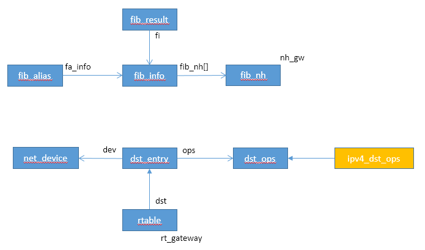

# Route

Route子系统决定了IP报文如何转发。

## 基本数据结构


### 数据结构





### 操作入口注册

```c
rtnl_register(PF_INET, RTM_NEWROUTE, inet_rtm_newroute, NULL, NULL);
rtnl_register(PF_INET, RTM_DELROUTE, inet_rtm_delroute, NULL, NULL);
rtnl_register(PF_INET, RTM_GETROUTE, NULL, inet_dump_fib, NULL);

rtnl_register(PF_UNSPEC, RTM_NEWRULE, fib_nl_newrule, NULL, NULL);
rtnl_register(PF_UNSPEC, RTM_DELRULE, fib_nl_delrule, NULL, NULL);
rtnl_register(PF_UNSPEC, RTM_GETRULE, NULL, fib_nl_dumprule, NULL);
```

### fib_rules_ops定义

```c
static const struct fib_rules_ops __net_initconst fib4_rules_ops_template = {
	.family		= AF_INET,
	.rule_size	= sizeof(struct fib4_rule),
	.addr_size	= sizeof(u32),
	.action		= fib4_rule_action,
	.suppress	= fib4_rule_suppress,
	.match		= fib4_rule_match,
	.configure	= fib4_rule_configure,
	.delete		= fib4_rule_delete,
	.compare	= fib4_rule_compare,
	.fill		= fib4_rule_fill,
	.default_pref	= fib_default_rule_pref,
	.nlmsg_payload	= fib4_rule_nlmsg_payload,
	.flush_cache	= fib4_rule_flush_cache,
	.nlgroup	= RTNLGRP_IPV4_RULE,
	.policy		= fib4_rule_policy,
	.owner		= THIS_MODULE,
};
```


#### rule action执行函数

仅处理跳转到route talbe操作，跳转到table将执行路由表查询

```c
static int fib4_rule_action(struct fib_rule *rule, struct flowi *flp,
			    int flags, struct fib_lookup_arg *arg)
{
	int err = -EAGAIN;
	struct fib_table *tbl;

	switch (rule->action) {
	case FR_ACT_TO_TBL:
		break;

	case FR_ACT_UNREACHABLE:
		return -ENETUNREACH;

	case FR_ACT_PROHIBIT:
		return -EACCES;

	case FR_ACT_BLACKHOLE:
	default:
		return -EINVAL;
	}

	rcu_read_lock();

	tbl = fib_get_table(rule->fr_net, rule->table);   //得到路由表
	if (tbl)
		err = fib_table_lookup(tbl, &flp->u.ip4,      // trie树路由查找
				       (struct fib_result *)arg->result,
				       arg->flags);

	rcu_read_unlock();
	return err;
}
```


## 路由查询对外接口

### 对外input路由查找接口

```c
int ip_route_input_noref(struct sk_buff *skb, __be32 daddr, __be32 saddr,
			 u8 tos, struct net_device *dev)
{
	int res;

	rcu_read_lock();

	/* Multicast recognition logic is moved from route cache to here.
	   The problem was that too many Ethernet cards have broken/missing
	   hardware multicast filters :-( As result the host on multicasting
	   network acquires a lot of useless route cache entries, sort of
	   SDR messages from all the world. Now we try to get rid of them.
	   Really, provided software IP multicast filter is organized
	   reasonably (at least, hashed), it does not result in a slowdown
	   comparing with route cache reject entries.
	   Note, that multicast routers are not affected, because
	   route cache entry is created eventually.
	 */
	if (ipv4_is_multicast(daddr)) {					//判断目的地是否为组播地址
		struct in_device *in_dev = __in_dev_get_rcu(dev);

		if (in_dev) {
			int our = ip_check_mc_rcu(in_dev, daddr, saddr,  //检查目的mac地址是否在in_dev的ip_mc_list中
						  ip_hdr(skb)->protocol);
			if (our
#ifdef CONFIG_IP_MROUTE
				||
			    (!ipv4_is_local_multicast(daddr) &&			//是否为本地组播地址：224.0.0.X
			     IN_DEV_MFORWARD(in_dev))
#endif
			   ) {
				int res = ip_route_input_mc(skb, daddr, saddr,
							    tos, dev, our);
				rcu_read_unlock();
				return res;
			}
		}
		rcu_read_unlock();
		return -EINVAL;
	}
	res = ip_route_input_slow(skb, daddr, saddr, tos, dev);		//非组播地址
	rcu_read_unlock();
	return res;
}

static int ip_route_input_slow(struct sk_buff *skb, __be32 daddr, __be32 saddr,
			       u8 tos, struct net_device *dev)
{
	struct fib_result res;
	struct in_device *in_dev = __in_dev_get_rcu(dev);
	struct flowi4	fl4;
	unsigned int	flags = 0;
	u32		itag = 0;
	struct rtable	*rth;
	int		err = -EINVAL;
	struct net    *net = dev_net(dev);
	bool do_cache;

	/* IP on this device is disabled. */

	if (!in_dev)
		goto out;		//设备被disable，直接返回，未设置

	/* Check for the most weird martians, which can be not detected
	   by fib_lookup.
	 */

	if (ipv4_is_multicast(saddr) || ipv4_is_lbcast(saddr))		//源IP是组播或本地广播，则返回；
		goto martian_source;

	res.fi = NULL;
	if (ipv4_is_lbcast(daddr) || (saddr == 0 && daddr == 0))	//目的地本地广播，或者源和目的IP都是零，跳到brd_input
		goto brd_input;

	/* Accept zero addresses only to limited broadcast;
	 * I even do not know to fix it or not. Waiting for complains :-)
	 */
	if (ipv4_is_zeronet(saddr))			//如果源IP无网络地址：0.XX.XX.XX，则返回；
		goto martian_source;

	if (ipv4_is_zeronet(daddr))			//如果目的IP无网络地址：0.XX.XX.XX，则返回；
		goto martian_destination;

	/* Following code try to avoid calling IN_DEV_NET_ROUTE_LOCALNET(),
	 * and call it once if daddr or/and saddr are loopback addresses
	 */
	if (ipv4_is_loopback(daddr)) {				//如果目的IP是本地IP地址
		if (!IN_DEV_NET_ROUTE_LOCALNET(in_dev, net))	//如果非本地网络，则返回
			goto martian_destination;
	} else if (ipv4_is_loopback(saddr)) {			//如果源IP是本地IP地址
		if (!IN_DEV_NET_ROUTE_LOCALNET(in_dev, net))	//如果非本地网络，则返回
			goto martian_source;
	}

	/*
	 *	Now we are ready to route packet.
	 */
	fl4.flowi4_oif = 0;
	fl4.flowi4_iif = dev->ifindex;		//设备id		
	fl4.flowi4_mark = skb->mark;
	fl4.flowi4_tos = tos;
	fl4.flowi4_scope = RT_SCOPE_UNIVERSE;
	fl4.daddr = daddr;
	fl4.saddr = saddr;
	err = fib_lookup(net, &fl4, &res);	//查找路由
	if (err != 0) {
		if (!IN_DEV_FORWARD(in_dev))
			err = -EHOSTUNREACH;
		goto no_route;			//未找到路由，跳转到no_route，会进入内核协议栈
	}

	if (res.type == RTN_BROADCAST)
		goto brd_input;			//广播类型，跳转到brd_input

	if (res.type == RTN_LOCAL) {		//本地类型，待验证源
		err = fib_validate_source(skb, saddr, daddr, tos,
					  0, dev, in_dev, &itag);
		if (err < 0)
			goto martian_source_keep_err;
		goto local_input;
	}

	if (!IN_DEV_FORWARD(in_dev)) {		//非FORWARD，则跳转到no_route，会进入内核协议栈
		err = -EHOSTUNREACH;
		goto no_route;
	}
	if (res.type != RTN_UNICAST)		//非单播，返回
		goto martian_destination;

	err = ip_mkroute_input(skb, &res, &fl4, in_dev, daddr, saddr, tos);	//需要转发的包，创建路由项
out:	return err;

brd_input:						//广播场景
	if (skb->protocol != htons(ETH_P_IP))		//非IP协议，返回错误
		goto e_inval;

	if (!ipv4_is_zeronet(saddr)) {			//源IP地址是非零网络地址
		err = fib_validate_source(skb, saddr, 0, tos, 0, dev,		//校验源地址
					  in_dev, &itag);
		if (err < 0)
			goto martian_source_keep_err;
	}
	flags |= RTCF_BROADCAST;
	res.type = RTN_BROADCAST;		
	RT_CACHE_STAT_INC(in_brd);

local_input:						//本地接收场景
	do_cache = false;
	if (res.fi) {
		if (!itag) {
			rth = rcu_dereference(FIB_RES_NH(res).nh_rth_input);
			if (rt_cache_valid(rth)) {
				skb_dst_set_noref(skb, &rth->dst);
				err = 0;
				goto out;
			}
			do_cache = true;
		}
	}

	rth = rt_dst_alloc(net->loopback_dev,     //创建dst对象，
			   IN_DEV_CONF_GET(in_dev, NOPOLICY), false, do_cache);
	if (!rth)
		goto e_nobufs;

	rth->dst.input= ip_local_deliver;    //本地收包函数
	rth->dst.output= ip_rt_bug;
#ifdef CONFIG_IP_ROUTE_CLASSID
	rth->dst.tclassid = itag;
#endif

	rth->rt_genid = rt_genid_ipv4(net);
	rth->rt_flags 	= flags|RTCF_LOCAL;
	rth->rt_type	= res.type;
	rth->rt_is_input = 1;
	rth->rt_iif	= 0;
	rth->rt_pmtu	= 0;
	rth->rt_gateway	= 0;
	rth->rt_uses_gateway = 0;
	INIT_LIST_HEAD(&rth->rt_uncached);
	RT_CACHE_STAT_INC(in_slow_tot);
	if (res.type == RTN_UNREACHABLE) {	//如果路由表项为不可达，
		rth->dst.input= ip_error;
		rth->dst.error= -err;
		rth->rt_flags 	&= ~RTCF_LOCAL;
	}
	if (do_cache) {
		if (unlikely(!rt_cache_route(&FIB_RES_NH(res), rth))) {
			rth->dst.flags |= DST_NOCACHE;
			rt_add_uncached_list(rth);
		}
	}
	skb_dst_set(skb, &rth->dst);  //设置dst，ip_rcv_finish后续要使用到该数据结构，来完成下一步的处理
	err = 0;
	goto out;

no_route:
	RT_CACHE_STAT_INC(in_no_route);
	res.type = RTN_UNREACHABLE;
	res.fi = NULL;
	goto local_input;

	/*
	 *	Do not cache martian addresses: they should be logged (RFC1812)
	 */
martian_destination:
	RT_CACHE_STAT_INC(in_martian_dst);
#ifdef CONFIG_IP_ROUTE_VERBOSE
	if (IN_DEV_LOG_MARTIANS(in_dev))
		net_warn_ratelimited("martian destination %pI4 from %pI4, dev %s\n",
				     &daddr, &saddr, dev->name);
#endif

e_inval:
	err = -EINVAL;
	goto out;

e_nobufs:
	err = -ENOBUFS;
	goto out;

martian_source:
	err = -EINVAL;
martian_source_keep_err:
	ip_handle_martian_source(dev, in_dev, skb, daddr, saddr);
	goto out;
}

static int ip_mkroute_input(struct sk_buff *skb,
			    struct fib_result *res,
			    const struct flowi4 *fl4,
			    struct in_device *in_dev,
			    __be32 daddr, __be32 saddr, u32 tos)
{
#ifdef CONFIG_IP_ROUTE_MULTIPATH
	if (res->fi && res->fi->fib_nhs > 1)
		fib_select_multipath(res);
#endif

	/* create a routing cache entry */
	return __mkroute_input(skb, res, in_dev, daddr, saddr, tos);
}

static int __mkroute_input(struct sk_buff *skb,
			   const struct fib_result *res,
			   struct in_device *in_dev,
			   __be32 daddr, __be32 saddr, u32 tos)
{
	struct fib_nh_exception *fnhe;
	struct rtable *rth;
	int err;
	struct in_device *out_dev;
	unsigned int flags = 0;
	bool do_cache;
	u32 itag = 0;

	/* get a working reference to the output device */
	out_dev = __in_dev_get_rcu(FIB_RES_DEV(*res));
	if (!out_dev) {
		net_crit_ratelimited("Bug in ip_route_input_slow(). Please report.\n");
		return -EINVAL;
	}

	err = fib_validate_source(skb, saddr, daddr, tos, FIB_RES_OIF(*res),
				  in_dev->dev, in_dev, &itag);
	if (err < 0) {
		ip_handle_martian_source(in_dev->dev, in_dev, skb, daddr,
					 saddr);

		goto cleanup;
	}

	do_cache = res->fi && !itag;
	if (out_dev == in_dev && err && IN_DEV_TX_REDIRECTS(out_dev) &&
	    skb->protocol == htons(ETH_P_IP) &&
	    (IN_DEV_SHARED_MEDIA(out_dev) ||
	     inet_addr_onlink(out_dev, saddr, FIB_RES_GW(*res))))
		IPCB(skb)->flags |= IPSKB_DOREDIRECT;

	if (skb->protocol != htons(ETH_P_IP)) {
		/* Not IP (i.e. ARP). Do not create route, if it is
		 * invalid for proxy arp. DNAT routes are always valid.
		 *
		 * Proxy arp feature have been extended to allow, ARP
		 * replies back to the same interface, to support
		 * Private VLAN switch technologies. See arp.c.
		 */
		if (out_dev == in_dev &&
		    IN_DEV_PROXY_ARP_PVLAN(in_dev) == 0) {
			err = -EINVAL;
			goto cleanup;
		}
	}

	fnhe = find_exception(&FIB_RES_NH(*res), daddr);
	if (do_cache) {
		if (fnhe)
			rth = rcu_dereference(fnhe->fnhe_rth_input);
		else
			rth = rcu_dereference(FIB_RES_NH(*res).nh_rth_input);

		if (rt_cache_valid(rth)) {
			skb_dst_set_noref(skb, &rth->dst);
			goto out;
		}
	}

	rth = rt_dst_alloc(out_dev->dev,
			   IN_DEV_CONF_GET(in_dev, NOPOLICY),
			   IN_DEV_CONF_GET(out_dev, NOXFRM), do_cache);
	if (!rth) {
		err = -ENOBUFS;
		goto cleanup;
	}

	rth->rt_genid = rt_genid_ipv4(dev_net(rth->dst.dev));
	rth->rt_flags = flags;
	rth->rt_type = res->type;
	rth->rt_is_input = 1;
	rth->rt_iif 	= 0;
	rth->rt_pmtu	= 0;
	rth->rt_gateway	= 0;
	rth->rt_uses_gateway = 0;
	INIT_LIST_HEAD(&rth->rt_uncached);
	RT_CACHE_STAT_INC(in_slow_tot);

	rth->dst.input = ip_forward;    //转发
	rth->dst.output = ip_output;	//本地发包

	//设置下一跳
	rt_set_nexthop(rth, daddr, res, fnhe, res->fi, res->type, itag);
	skb_dst_set(skb, &rth->dst);
out:
	err = 0;
 cleanup:
	return err;
}

static struct rtable *rt_dst_alloc(struct net_device *dev,
				   bool nopolicy, bool noxfrm, bool will_cache)
{
	return dst_alloc(&ipv4_dst_ops, dev, 1, DST_OBSOLETE_FORCE_CHK,
			 (will_cache ? 0 : (DST_HOST | DST_NOCACHE)) |
			 (nopolicy ? DST_NOPOLICY : 0) |
			 (noxfrm ? DST_NOXFRM : 0));
}

void *dst_alloc(struct dst_ops *ops, struct net_device *dev,
		int initial_ref, int initial_obsolete, unsigned short flags)
{
	struct dst_entry *dst;

	if (ops->gc && dst_entries_get_fast(ops) > ops->gc_thresh) {
		if (ops->gc(ops))
			return NULL;
	}
	dst = kmem_cache_alloc(ops->kmem_cachep, GFP_ATOMIC);    //实际大小为rtable
	if (!dst)
		return NULL;
	dst->child = NULL;
	dst->dev = dev;
	if (dev)
		dev_hold(dev);
	dst->ops = ops;
	dst_init_metrics(dst, dst_default_metrics, true);
	dst->expires = 0UL;
	dst->path = dst;
	dst->from = NULL;
#ifdef CONFIG_XFRM
	dst->xfrm = NULL;
#endif
	dst->input = dst_discard;
	dst->output = dst_discard_sk;
	dst->error = 0;
	dst->obsolete = initial_obsolete;
	dst->header_len = 0;
	dst->trailer_len = 0;
#ifdef CONFIG_IP_ROUTE_CLASSID
	dst->tclassid = 0;
#endif
	atomic_set(&dst->__refcnt, initial_ref);
	dst->__use = 0;
	dst->lastuse = jiffies;
	dst->flags = flags;
	dst->pending_confirm = 0;
	dst->next = NULL;
	if (!(flags & DST_NOCOUNT))
		dst_entries_add(ops, 1);
	return dst;
}
```


### 对外output路由查找接口

```c
static inline struct rtable *ip_route_output(struct net *net, __be32 daddr,
					     __be32 saddr, u8 tos, int oif)
{
	struct flowi4 fl4 = {
		.flowi4_oif = oif,
		.flowi4_tos = tos,
		.daddr = daddr,
		.saddr = saddr,
	};
	return ip_route_output_key(net, &fl4);
}

static inline struct rtable *ip_route_output_key(struct net *net, struct flowi4 *flp)
{
	return ip_route_output_flow(net, flp, NULL);
}

struct rtable *ip_route_output_flow(struct net *net, struct flowi4 *flp4,
				    struct sock *sk)
{
	struct rtable *rt = __ip_route_output_key(net, flp4);

	if (IS_ERR(rt))
		return rt;

	if (flp4->flowi4_proto)
		rt = (struct rtable *)xfrm_lookup_route(net, &rt->dst,
							flowi4_to_flowi(flp4),
							sk, 0);

	return rt;
}

struct rtable *__ip_route_output_key(struct net *net, struct flowi4 *fl4)
{
	struct net_device *dev_out = NULL;
	__u8 tos = RT_FL_TOS(fl4);
	unsigned int flags = 0;
	struct fib_result res;
	struct rtable *rth;
	int orig_oif;

	res.tclassid	= 0;
	res.fi		= NULL;
	res.table	= NULL;

	orig_oif = fl4->flowi4_oif;

	fl4->flowi4_iif = LOOPBACK_IFINDEX;
	fl4->flowi4_tos = tos & IPTOS_RT_MASK;
	fl4->flowi4_scope = ((tos & RTO_ONLINK) ?
			 RT_SCOPE_LINK : RT_SCOPE_UNIVERSE);

	rcu_read_lock();
	if (fl4->saddr) {
		rth = ERR_PTR(-EINVAL);
		if (ipv4_is_multicast(fl4->saddr) ||
		    ipv4_is_lbcast(fl4->saddr) ||
		    ipv4_is_zeronet(fl4->saddr))
			goto out;

		/* I removed check for oif == dev_out->oif here.
		   It was wrong for two reasons:
		   1. ip_dev_find(net, saddr) can return wrong iface, if saddr
		      is assigned to multiple interfaces.
		   2. Moreover, we are allowed to send packets with saddr
		      of another iface. --ANK
		 */

		if (fl4->flowi4_oif == 0 &&
		    (ipv4_is_multicast(fl4->daddr) ||
		     ipv4_is_lbcast(fl4->daddr))) {
			/* It is equivalent to inet_addr_type(saddr) == RTN_LOCAL */
			dev_out = __ip_dev_find(net, fl4->saddr, false);
			if (!dev_out)
				goto out;

			/* Special hack: user can direct multicasts
			   and limited broadcast via necessary interface
			   without fiddling with IP_MULTICAST_IF or IP_PKTINFO.
			   This hack is not just for fun, it allows
			   vic,vat and friends to work.
			   They bind socket to loopback, set ttl to zero
			   and expect that it will work.
			   From the viewpoint of routing cache they are broken,
			   because we are not allowed to build multicast path
			   with loopback source addr (look, routing cache
			   cannot know, that ttl is zero, so that packet
			   will not leave this host and route is valid).
			   Luckily, this hack is good workaround.
			 */

			fl4->flowi4_oif = dev_out->ifindex;
			goto make_route;
		}

		if (!(fl4->flowi4_flags & FLOWI_FLAG_ANYSRC)) {
			/* It is equivalent to inet_addr_type(saddr) == RTN_LOCAL */
			if (!__ip_dev_find(net, fl4->saddr, false))
				goto out;
		}
	}


	if (fl4->flowi4_oif) {
		dev_out = dev_get_by_index_rcu(net, fl4->flowi4_oif);
		rth = ERR_PTR(-ENODEV);
		if (!dev_out)
			goto out;

		/* RACE: Check return value of inet_select_addr instead. */
		if (!(dev_out->flags & IFF_UP) || !__in_dev_get_rcu(dev_out)) {
			rth = ERR_PTR(-ENETUNREACH);
			goto out;
		}
		if (ipv4_is_local_multicast(fl4->daddr) ||
		    ipv4_is_lbcast(fl4->daddr)) {
			if (!fl4->saddr)
				fl4->saddr = inet_select_addr(dev_out, 0,
							      RT_SCOPE_LINK);
			goto make_route;
		}
		if (!fl4->saddr) {
			if (ipv4_is_multicast(fl4->daddr))
				fl4->saddr = inet_select_addr(dev_out, 0,
							      fl4->flowi4_scope);
			else if (!fl4->daddr)
				fl4->saddr = inet_select_addr(dev_out, 0,
							      RT_SCOPE_HOST);
		}
	}

	if (!fl4->daddr) {
		fl4->daddr = fl4->saddr;
		if (!fl4->daddr)
			fl4->daddr = fl4->saddr = htonl(INADDR_LOOPBACK);
		dev_out = net->loopback_dev;
		fl4->flowi4_oif = LOOPBACK_IFINDEX;
		res.type = RTN_LOCAL;
		flags |= RTCF_LOCAL;
		goto make_route;
	}

	if (fib_lookup(net, fl4, &res)) {
		res.fi = NULL;
		res.table = NULL;
		if (fl4->flowi4_oif) {
			/* Apparently, routing tables are wrong. Assume,
			   that the destination is on link.

			   WHY? DW.
			   Because we are allowed to send to iface
			   even if it has NO routes and NO assigned
			   addresses. When oif is specified, routing
			   tables are looked up with only one purpose:
			   to catch if destination is gatewayed, rather than
			   direct. Moreover, if MSG_DONTROUTE is set,
			   we send packet, ignoring both routing tables
			   and ifaddr state. --ANK


			   We could make it even if oif is unknown,
			   likely IPv6, but we do not.
			 */

			if (fl4->saddr == 0)
				fl4->saddr = inet_select_addr(dev_out, 0,
							      RT_SCOPE_LINK);
			res.type = RTN_UNICAST;
			goto make_route;
		}
		rth = ERR_PTR(-ENETUNREACH);
		goto out;
	}

	if (res.type == RTN_LOCAL) {
		if (!fl4->saddr) {
			if (res.fi->fib_prefsrc)
				fl4->saddr = res.fi->fib_prefsrc;
			else
				fl4->saddr = fl4->daddr;
		}
		dev_out = net->loopback_dev;
		fl4->flowi4_oif = dev_out->ifindex;
		flags |= RTCF_LOCAL;
		goto make_route;
	}

#ifdef CONFIG_IP_ROUTE_MULTIPATH
	if (res.fi->fib_nhs > 1 && fl4->flowi4_oif == 0)
		fib_select_multipath(&res);
	else
#endif
	if (!res.prefixlen &&
	    res.table->tb_num_default > 1 &&
	    res.type == RTN_UNICAST && !fl4->flowi4_oif)
		fib_select_default(&res);

	if (!fl4->saddr)
		fl4->saddr = FIB_RES_PREFSRC(net, res);

	dev_out = FIB_RES_DEV(res);
	fl4->flowi4_oif = dev_out->ifindex;


make_route:
	rth = __mkroute_output(&res, fl4, orig_oif, dev_out, flags);

out:
	rcu_read_unlock();
	return rth;
}


static struct rtable *__mkroute_output(const struct fib_result *res,
				       const struct flowi4 *fl4, int orig_oif,
				       struct net_device *dev_out,
				       unsigned int flags)
{
	struct fib_info *fi = res->fi;
	struct fib_nh_exception *fnhe;
	struct in_device *in_dev;
	u16 type = res->type;
	struct rtable *rth;
	bool do_cache;

	in_dev = __in_dev_get_rcu(dev_out);
	if (!in_dev)
		return ERR_PTR(-EINVAL);

	if (likely(!IN_DEV_ROUTE_LOCALNET(in_dev)))
		if (ipv4_is_loopback(fl4->saddr) && !(dev_out->flags & IFF_LOOPBACK))
			return ERR_PTR(-EINVAL);

	if (ipv4_is_lbcast(fl4->daddr))
		type = RTN_BROADCAST;
	else if (ipv4_is_multicast(fl4->daddr))
		type = RTN_MULTICAST;
	else if (ipv4_is_zeronet(fl4->daddr))
		return ERR_PTR(-EINVAL);

	if (dev_out->flags & IFF_LOOPBACK)
		flags |= RTCF_LOCAL;

	do_cache = true;
	if (type == RTN_BROADCAST) {
		flags |= RTCF_BROADCAST | RTCF_LOCAL;
		fi = NULL;
	} else if (type == RTN_MULTICAST) {
		flags |= RTCF_MULTICAST | RTCF_LOCAL;
		if (!ip_check_mc_rcu(in_dev, fl4->daddr, fl4->saddr,
				     fl4->flowi4_proto))
			flags &= ~RTCF_LOCAL;
		else
			do_cache = false;
		/* If multicast route do not exist use
		 * default one, but do not gateway in this case.
		 * Yes, it is hack.
		 */
		if (fi && res->prefixlen < 4)
			fi = NULL;
	}

	fnhe = NULL;
	do_cache &= fi != NULL;
	if (do_cache) {
		struct rtable __rcu **prth;
		struct fib_nh *nh = &FIB_RES_NH(*res);

		fnhe = find_exception(nh, fl4->daddr);
		if (fnhe)
			prth = &fnhe->fnhe_rth_output;
		else {
			if (unlikely(fl4->flowi4_flags &
				     FLOWI_FLAG_KNOWN_NH &&
				     !(nh->nh_gw &&
				       nh->nh_scope == RT_SCOPE_LINK))) {
				do_cache = false;
				goto add;
			}
			prth = raw_cpu_ptr(nh->nh_pcpu_rth_output);
		}
		rth = rcu_dereference(*prth);
		if (rt_cache_valid(rth)) {
			dst_hold(&rth->dst);
			return rth;
		}
	}

add:
	rth = rt_dst_alloc(dev_out,     //创建rth对象
			   IN_DEV_CONF_GET(in_dev, NOPOLICY),
			   IN_DEV_CONF_GET(in_dev, NOXFRM),
			   do_cache);
	if (!rth)
		return ERR_PTR(-ENOBUFS);

	rth->dst.output = ip_output;

	rth->rt_genid = rt_genid_ipv4(dev_net(dev_out));
	rth->rt_flags	= flags;
	rth->rt_type	= type;
	rth->rt_is_input = 0;
	rth->rt_iif	= orig_oif ? : 0;
	rth->rt_pmtu	= 0;
	rth->rt_gateway = 0;
	rth->rt_uses_gateway = 0;
	INIT_LIST_HEAD(&rth->rt_uncached);

	RT_CACHE_STAT_INC(out_slow_tot);

	if (flags & RTCF_LOCAL)
		rth->dst.input = ip_local_deliver;
	if (flags & (RTCF_BROADCAST | RTCF_MULTICAST)) {
		if (flags & RTCF_LOCAL &&
		    !(dev_out->flags & IFF_LOOPBACK)) {
			rth->dst.output = ip_mc_output;
			RT_CACHE_STAT_INC(out_slow_mc);
		}
#ifdef CONFIG_IP_MROUTE
		if (type == RTN_MULTICAST) {
			if (IN_DEV_MFORWARD(in_dev) &&
			    !ipv4_is_local_multicast(fl4->daddr)) {
				rth->dst.input = ip_mr_input;
				rth->dst.output = ip_mc_output;
			}
		}
#endif
	}

	rt_set_nexthop(rth, fl4->daddr, res, fnhe, fi, type, 0);   //设置下一跳

	return rth;
}
```


### 路由查找内部接口

```c
static inline int fib_lookup(struct net *net, struct flowi4 *flp,
			     struct fib_result *res)
{
	struct fib_table *tb;
	int err;

	if (net->ipv4.fib_has_custom_rules)    //有用户自定义规则
		return __fib_lookup(net, flp, res);

	rcu_read_lock();

	res->tclassid = 0;

	for (err = 0; !err; err = -ENETUNREACH) {
		tb = rcu_dereference_rtnl(net->ipv4.fib_main);
		if (tb && !fib_table_lookup(tb, flp, res, FIB_LOOKUP_NOREF))
			break;

		tb = rcu_dereference_rtnl(net->ipv4.fib_default);
		if (tb && !fib_table_lookup(tb, flp, res, FIB_LOOKUP_NOREF))
			break;
	}

	rcu_read_unlock();

	return err;
}

int __fib_lookup(struct net *net, struct flowi4 *flp, struct fib_result *res)
{
	struct fib_lookup_arg arg = {
		.result = res,
		.flags = FIB_LOOKUP_NOREF,
	};
	int err;

	err = fib_rules_lookup(net->ipv4.rules_ops, flowi4_to_flowi(flp), 0, &arg);
#ifdef CONFIG_IP_ROUTE_CLASSID
	if (arg.rule)
		res->tclassid = ((struct fib4_rule *)arg.rule)->tclassid;
	else
		res->tclassid = 0;
#endif

	if (err == -ESRCH)
		err = -ENETUNREACH;

	return err;
}
```


### 路由规则查找

```c
int fib_rules_lookup(struct fib_rules_ops *ops, struct flowi *fl,
		     int flags, struct fib_lookup_arg *arg)
{
	struct fib_rule *rule;
	int err;

	rcu_read_lock();

	list_for_each_entry_rcu(rule, &ops->rules_list, list) {
jumped:
		if (!fib_rule_match(rule, ops, fl, flags))
			continue;

		if (rule->action == FR_ACT_GOTO) {
			struct fib_rule *target;

			target = rcu_dereference(rule->ctarget);
			if (target == NULL) {
				continue;
			} else {
				rule = target;
				goto jumped;
			}
		} else if (rule->action == FR_ACT_NOP)
			continue;
		else
			err = ops->action(rule, fl, flags, arg);   //执行rule action操作

		if (!err && ops->suppress && ops->suppress(rule, arg))
			continue;

		if (err != -EAGAIN) {
			if ((arg->flags & FIB_LOOKUP_NOREF) ||
			    likely(atomic_inc_not_zero(&rule->refcnt))) {
				arg->rule = rule;
				goto out;
			}
			break;
		}
	}

	err = -ESRCH;
out:
	rcu_read_unlock();

	return err;
}

static int fib_rule_match(struct fib_rule *rule, struct fib_rules_ops *ops,
			  struct flowi *fl, int flags)
{
	int ret = 0;

	if (rule->iifindex && (rule->iifindex != fl->flowi_iif))
		goto out;

	if (rule->oifindex && (rule->oifindex != fl->flowi_oif))
		goto out;

	if ((rule->mark ^ fl->flowi_mark) & rule->mark_mask)
		goto out;

	ret = ops->match(rule, fl, flags);    //实际调用fib4_rule_action函数
out:
	return (rule->flags & FIB_RULE_INVERT) ? !ret : ret;
}
```

### 路由表查找

```c
struct fib_table *fib_get_table(struct net *net, u32 id)  //得到路由表
{
	struct fib_table *tb;
	struct hlist_head *head;
	unsigned int h;

	if (id == 0)
		id = RT_TABLE_MAIN;
	h = id & (FIB_TABLE_HASHSZ - 1);

	head = &net->ipv4.fib_table_hash[h];
	hlist_for_each_entry_rcu(tb, head, tb_hlist) {
		if (tb->tb_id == id)
			return tb;
	}
	return NULL;
}
```
	