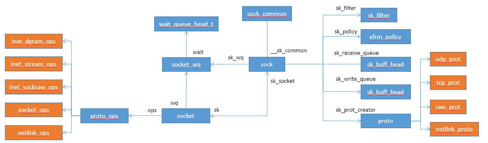
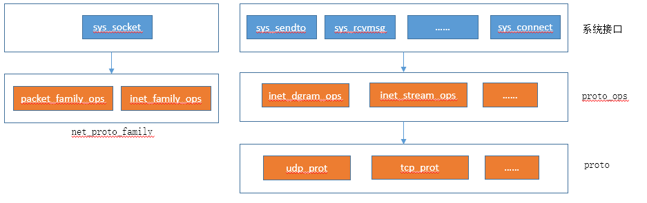

# Linux Socket

Socket是应用层与TCP/IP协议族通信的中间软件抽象层，本文介绍socket的系统入口以及相关数据结构

## Socket数据结构




## 创建 Socket

```c
SYSCALL_DEFINE3(socket, int, family, int, type, int, protocol)
{
	int retval;
	struct socket *sock;
	int flags;

	/* Check the SOCK_* constants for consistency.  */
	BUILD_BUG_ON(SOCK_CLOEXEC != O_CLOEXEC);
	BUILD_BUG_ON((SOCK_MAX | SOCK_TYPE_MASK) != SOCK_TYPE_MASK);
	BUILD_BUG_ON(SOCK_CLOEXEC & SOCK_TYPE_MASK);
	BUILD_BUG_ON(SOCK_NONBLOCK & SOCK_TYPE_MASK);

	flags = type & ~SOCK_TYPE_MASK;
	if (flags & ~(SOCK_CLOEXEC | SOCK_NONBLOCK))
		return -EINVAL;
	type &= SOCK_TYPE_MASK;

	if (SOCK_NONBLOCK != O_NONBLOCK && (flags & SOCK_NONBLOCK))
		flags = (flags & ~SOCK_NONBLOCK) | O_NONBLOCK;

	retval = sock_create(family, type, protocol, &sock);    //创建socket
	if (retval < 0)
		goto out;

	retval = sock_map_fd(sock, flags & (O_CLOEXEC | O_NONBLOCK));
	if (retval < 0)
		goto out_release;

out:
	/* It may be already another descriptor 8) Not kernel problem. */
	return retval;

out_release:
	sock_release(sock);
	return retval;
}

int sock_create(int family, int type, int protocol, struct socket **res)
{
	return __sock_create(current->nsproxy->net_ns, family, type, protocol, res, 0);
}

int __sock_create(struct net *net, int family, int type, int protocol,
			 struct socket **res, int kern)
{
	int err;
	struct socket *sock;
	const struct net_proto_family *pf;

	/*
	 *      Check protocol is in range
	 */
	if (family < 0 || family >= NPROTO)
		return -EAFNOSUPPORT;
	if (type < 0 || type >= SOCK_MAX)
		return -EINVAL;

	/* Compatibility.

	   This uglymoron is moved from INET layer to here to avoid
	   deadlock in module load.
	 */
	if (family == PF_INET && type == SOCK_PACKET) {
		static int warned;
		if (!warned) {
			warned = 1;
			pr_info("%s uses obsolete (PF_INET,SOCK_PACKET)\n",
				current->comm);
		}
		family = PF_PACKET;
	}

	err = security_socket_create(family, type, protocol, kern);
	if (err)
		return err;

	/*
	 *	Allocate the socket and allow the family to set things up. if
	 *	the protocol is 0, the family is instructed to select an appropriate
	 *	default.
	 */
	sock = sock_alloc();		//分配socket对象
	if (!sock) {
		net_warn_ratelimited("socket: no more sockets\n");
		return -ENFILE;	/* Not exactly a match, but its the
				   closest posix thing */
	}

	sock->type = type;

#ifdef CONFIG_MODULES
	/* Attempt to load a protocol module if the find failed.
	 *
	 * 12/09/1996 Marcin: But! this makes REALLY only sense, if the user
	 * requested real, full-featured networking support upon configuration.
	 * Otherwise module support will break!
	 */
	if (rcu_access_pointer(net_families[family]) == NULL)
		request_module("net-pf-%d", family);
#endif

	rcu_read_lock();
	pf = rcu_dereference(net_families[family]);		//根据family参数获取proto_family
	err = -EAFNOSUPPORT;
	if (!pf)
		goto out_release;

	/*
	 * We will call the ->create function, that possibly is in a loadable
	 * module, so we have to bump that loadable module refcnt first.
	 */
	if (!try_module_get(pf->owner))
		goto out_release;

	/* Now protected by module ref count */
	rcu_read_unlock();

	err = pf->create(net, sock, protocol, kern);		//调用family对应的create方法
	if (err < 0)
		goto out_module_put;

	/*
	 * Now to bump the refcnt of the [loadable] module that owns this
	 * socket at sock_release time we decrement its refcnt.
	 */
	if (!try_module_get(sock->ops->owner))
		goto out_module_busy;

	/*
	 * Now that we're done with the ->create function, the [loadable]
	 * module can have its refcnt decremented
	 */
	module_put(pf->owner);
	err = security_socket_post_create(sock, family, type, protocol, kern);
	if (err)
		goto out_sock_release;
	*res = sock;

	return 0;

out_module_busy:
	err = -EAFNOSUPPORT;
out_module_put:
	sock->ops = NULL;
	module_put(pf->owner);
out_sock_release:
	sock_release(sock);
	return err;

out_release:
	rcu_read_unlock();
	goto out_sock_release;
}
```

创建socket主要需要family、socket type、protocol三个参数

### 协议族（family）

```c
#define PF_UNSPEC	AF_UNSPEC
#define PF_UNIX		AF_UNIX     
#define PF_LOCAL	AF_LOCAL
#define PF_INET		AF_INET     //ipv4协议
#define PF_AX25		AF_AX25
#define PF_IPX		AF_IPX
#define PF_NETLINK	AF_NETLINK  //Netlink
#define PF_ROUTE	AF_ROUTE
#define PF_PACKET	AF_PACKET   //
```

### Socket类型

```c
enum sock_type {
	SOCK_STREAM	= 1,
	SOCK_DGRAM	= 2,
	SOCK_RAW	= 3,
	SOCK_RDM	= 4,
	SOCK_SEQPACKET	= 5,
	SOCK_DCCP	= 6,
	SOCK_PACKET	= 10,
};
```

### 典型Socket创建

|Family|Socket Type|Protocol|收包流程|
|:-----|:-----|:-----|:-----|
|PF-INET  |SOCK_STREAM|IPPROTO_TCP|ip_rcv->ip_rcv_finish->ip_local_deliver->tcp_v4_rcv|
|PF-INET  |SOCK_DGRAM |IPPROTO_UDP|ip_rcv->ip_rcv_finish->ip_local_deliver->udp_rcv|
|PF-INET  |SOCK_RAW   |IPPROTO_IP |ip_rcv->ip_rcv_finish->ip_local_deliver->raw_local_deliver->raw_v4_input->raw_rcv|
|PF-INET  |SOCK_PACKET|ANY        |相当于PF_PACKET+SOCK_PACKET|
|PF_PACKET|SOCK_DGRAM |ETH_P_ALL  |__netif_receive_skb_core->ptype_all->packet_rcv|
|PF_PACKET|SOCK_DGRAM |其他       |__netif_receive_skb_core->ptype_base->packet_rcv|
|PF_PACKET|SOCK_RAW   |ETH_P_ALL  |__netif_receive_skb_core->ptype_all->packet_rcv|
|PF_PACKET|SOCK_RAW   |其他       |__netif_receive_skb_core->ptype_base->packet_rcv|
|PF_PACKET|SOCK_PACKET|ETH_P_ALL  |__netif_receive_skb_core->ptype_all->packet_rcv_spkt|
|PF_PACKET|SOCK_PACKET|其他       |__netif_receive_skb_core->ptype_base->packet_rcv_spkt|


## Socket发送消息
```c
SYSCALL_DEFINE6(sendto, int, fd, void __user *, buff, size_t, len,
		unsigned int, flags, struct sockaddr __user *, addr,
		int, addr_len)
{
	struct socket *sock;
	struct sockaddr_storage address;
	int err;
	struct msghdr msg;
	struct iovec iov;
	int fput_needed;

	err = import_single_range(WRITE, buff, len, &iov, &msg.msg_iter);
	if (unlikely(err))
		return err;
	sock = sockfd_lookup_light(fd, &err, &fput_needed);
	if (!sock)
		goto out;

	msg.msg_name = NULL;
	msg.msg_control = NULL;
	msg.msg_controllen = 0;
	msg.msg_namelen = 0;
	if (addr) {
		err = move_addr_to_kernel(addr, addr_len, &address);
		if (err < 0)
			goto out_put;
		msg.msg_name = (struct sockaddr *)&address;
		msg.msg_namelen = addr_len;
	}
	if (sock->file->f_flags & O_NONBLOCK)
		flags |= MSG_DONTWAIT;
	msg.msg_flags = flags;
	err = sock_sendmsg(sock, &msg);

out_put:
	fput_light(sock->file, fput_needed);
out:
	return err;
}

int sock_sendmsg(struct socket *sock, struct msghdr *msg)
{
	int err = security_socket_sendmsg(sock, msg,
					  msg_data_left(msg));

	return err ?: sock_sendmsg_nosec(sock, msg);
}

static inline int sock_sendmsg_nosec(struct socket *sock, struct msghdr *msg)
{
	int ret = sock->ops->sendmsg(sock, msg, msg_data_left(msg));   //调用了socket的ops方法
	BUG_ON(ret == -EIOCBQUEUED);
	return ret;
}
```

## Socket接收消息
```c
COMPAT_SYSCALL_DEFINE3(recvmsg, int, fd, struct compat_msghdr __user *, msg, unsigned int, flags)
{
	return __sys_recvmsg(fd, (struct user_msghdr __user *)msg, flags | MSG_CMSG_COMPAT);
}

long __sys_recvmsg(int fd, struct user_msghdr __user *msg, unsigned flags)
{
	int fput_needed, err;
	struct msghdr msg_sys;
	struct socket *sock;

	sock = sockfd_lookup_light(fd, &err, &fput_needed);
	if (!sock)
		goto out;

	err = ___sys_recvmsg(sock, msg, &msg_sys, flags, 0);

	fput_light(sock->file, fput_needed);
out:
	return err;
}

static int ___sys_recvmsg(struct socket *sock, struct user_msghdr __user *msg,
			 struct msghdr *msg_sys, unsigned int flags, int nosec)
{
	struct compat_msghdr __user *msg_compat =
	    (struct compat_msghdr __user *)msg;
	struct iovec iovstack[UIO_FASTIOV];
	struct iovec *iov = iovstack;
	unsigned long cmsg_ptr;
	int total_len, len;
	ssize_t err;

	/* kernel mode address */
	struct sockaddr_storage addr;

	/* user mode address pointers */
	struct sockaddr __user *uaddr;
	int __user *uaddr_len = COMPAT_NAMELEN(msg);

	msg_sys->msg_name = &addr;

	if (MSG_CMSG_COMPAT & flags)
		err = get_compat_msghdr(msg_sys, msg_compat, &uaddr, &iov);
	else
		err = copy_msghdr_from_user(msg_sys, msg, &uaddr, &iov);
	if (err < 0)
		return err;
	total_len = iov_iter_count(&msg_sys->msg_iter);

	cmsg_ptr = (unsigned long)msg_sys->msg_control;
	msg_sys->msg_flags = flags & (MSG_CMSG_CLOEXEC|MSG_CMSG_COMPAT);

	/* We assume all kernel code knows the size of sockaddr_storage */
	msg_sys->msg_namelen = 0;

	if (sock->file->f_flags & O_NONBLOCK)
		flags |= MSG_DONTWAIT;
	err = (nosec ? sock_recvmsg_nosec : sock_recvmsg)(sock, msg_sys,
							  total_len, flags);
	if (err < 0)
		goto out_freeiov;
	len = err;

	if (uaddr != NULL) {
		err = move_addr_to_user(&addr,
					msg_sys->msg_namelen, uaddr,
					uaddr_len);
		if (err < 0)
			goto out_freeiov;
	}
	err = __put_user((msg_sys->msg_flags & ~MSG_CMSG_COMPAT),
			 COMPAT_FLAGS(msg));
	if (err)
		goto out_freeiov;
	if (MSG_CMSG_COMPAT & flags)
		err = __put_user((unsigned long)msg_sys->msg_control - cmsg_ptr,
				 &msg_compat->msg_controllen);
	else
		err = __put_user((unsigned long)msg_sys->msg_control - cmsg_ptr,
				 &msg->msg_controllen);
	if (err)
		goto out_freeiov;
	err = len;

out_freeiov:
	kfree(iov);
	return err;
}

static inline int sock_recvmsg_nosec(struct socket *sock, struct msghdr *msg,
				     size_t size, int flags)
{
	return sock->ops->recvmsg(sock, msg, size, flags);   //调用socket的ops的方法
}
```

## Socket bind
```c
SYSCALL_DEFINE3(bind, int, fd, struct sockaddr __user *, umyaddr, int, addrlen)
{
	struct socket *sock;
	struct sockaddr_storage address;
	int err, fput_needed;

	sock = sockfd_lookup_light(fd, &err, &fput_needed);
	if (sock) {
		err = move_addr_to_kernel(umyaddr, addrlen, &address);
		if (err >= 0) {
			err = security_socket_bind(sock,
						   (struct sockaddr *)&address,
						   addrlen);
			if (!err)
				err = sock->ops->bind(sock,          //调用socket的ops的方法
						      (struct sockaddr *)
						      &address, addrlen);
		}
		fput_light(sock->file, fput_needed);
	}
	return err;
}
```


## Socket listen
```c
SYSCALL_DEFINE2(listen, int, fd, int, backlog)
{
	struct socket *sock;
	int err, fput_needed;
	int somaxconn;

	sock = sockfd_lookup_light(fd, &err, &fput_needed);
	if (sock) {
		somaxconn = sock_net(sock->sk)->core.sysctl_somaxconn;
		if ((unsigned int)backlog > somaxconn)
			backlog = somaxconn;

		err = security_socket_listen(sock, backlog);
		if (!err)
			err = sock->ops->listen(sock, backlog);    //调用socket的ops的方法

		fput_light(sock->file, fput_needed);
	}
	return err;
}
```


## Socket connect
```c
SYSCALL_DEFINE3(connect, int, fd, struct sockaddr __user *, uservaddr,
		int, addrlen)
{
	struct socket *sock;
	struct sockaddr_storage address;
	int err, fput_needed;

	sock = sockfd_lookup_light(fd, &err, &fput_needed);
	if (!sock)
		goto out;
	err = move_addr_to_kernel(uservaddr, addrlen, &address);
	if (err < 0)
		goto out_put;

	err =
	    security_socket_connect(sock, (struct sockaddr *)&address, addrlen);
	if (err)
		goto out_put;

	err = sock->ops->connect(sock, (struct sockaddr *)&address, addrlen,   //调用socket的ops的方法
				 sock->file->f_flags);
out_put:
	fput_light(sock->file, fput_needed);
out:
	return err;
}
```

## Socket 总体调用关系



