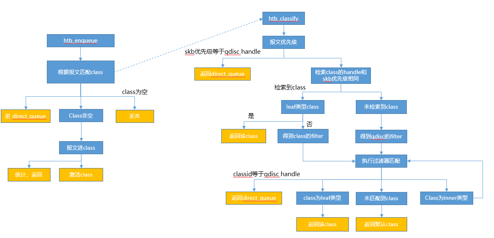
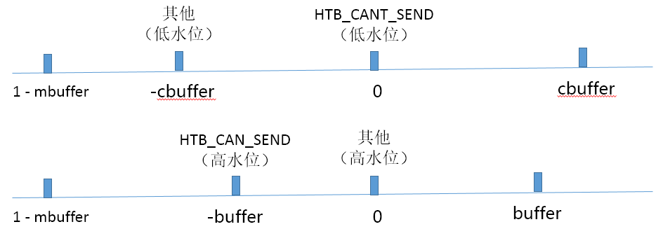

# HTB 

HTB(Hierarchical Token Bucket) 分层的令牌桶一个分类的令牌桶过滤器 , 工作原理和相关配置同于 TBF.. 拥有 TBF 的各项性能。

## 算法原理

### 类状态

某个时刻每个类可以处于三种状态中的一种：
CAN_SEND：令牌充足的,发送的网络包小于rate,例图中用绿色表示
MAY_BORROW：没有令牌,但可借用.发送的网络包大于rate小于ceil,例图中用黄色表示
CANT_SEND：没有令牌不可借用,发送的网络包大于ceil,例图中用红色表示

### 出包策略

HTB是如何决策哪个类出包的？
1、HTB算法从类树的底部开始往上找CAN_SEND状态的class。如果找到某一层有CAN_SEND状态的类则停止。
2、如果该层中有多个class处于CAN_SEND状态则选取优先级最高(priority最小)的class。如果最高优先级还是有多个class，那就在这些类中轮训处理。每个类每发送自己的quantum个字节后，轮到下一个类发送。
3、上面有讲到只有leafclass才可以缓存网络包,innerclass是没有网络包的。如果步骤1，2最终选到了innerclass怎么处理？既然是innerclass,肯定有自己的subclass.innerclass会顺着树往下找,找到一个子孙leafclass.并且该leafclass处于MAY_BORROW状态,将自己富余的令牌借给该leafclass让其出包。同样的道理,可能会有多个子孙leafclass处于MAY_BORROW状态，这里的处理跟步骤2是一样的。


## HTB Qdisc

```c
static struct Qdisc_ops htb_qdisc_ops __read_mostly = {
	.cl_ops		=	&htb_class_ops,
	.id		=	"htb",
	.priv_size	=	sizeof(struct htb_sched),
	.enqueue	=	htb_enqueue,
	.dequeue	=	htb_dequeue,
	.peek		=	qdisc_peek_dequeued,
	.drop		=	htb_drop,
	.init		=	htb_init,     //初始化
	.reset		=	htb_reset,
	.destroy	=	htb_destroy,
	.dump		=	htb_dump,
	.owner		=	THIS_MODULE,
};
```

### HTB Qdisc初始化

```c
static int htb_init(struct Qdisc *sch, struct nlattr *opt)
{
	struct htb_sched *q = qdisc_priv(sch);
	struct nlattr *tb[TCA_HTB_MAX + 1];
	struct tc_htb_glob *gopt;
	int err;
	int i;

	if (!opt)
		return -EINVAL;

	err = nla_parse_nested(tb, TCA_HTB_MAX, opt, htb_policy);
	if (err < 0)
		return err;

	if (!tb[TCA_HTB_INIT])
		return -EINVAL;

	gopt = nla_data(tb[TCA_HTB_INIT]);
	if (gopt->version != HTB_VER >> 16)
		return -EINVAL;

	err = qdisc_class_hash_init(&q->clhash);   //初始化class链表
	if (err < 0)
		return err;
	for (i = 0; i < TC_HTB_NUMPRIO; i++)
		INIT_LIST_HEAD(q->drops + i);			//drops链表初始化

	qdisc_watchdog_init(&q->watchdog, sch);		//watchdog初始化，会触发发包软中断
	INIT_WORK(&q->work, htb_work_func);			//初始化work，会触发发包软中断
	__skb_queue_head_init(&q->direct_queue);	//direct发送链表初始化

	if (tb[TCA_HTB_DIRECT_QLEN])
		q->direct_qlen = nla_get_u32(tb[TCA_HTB_DIRECT_QLEN]);		//设置直接发送链表长度
	else {
		q->direct_qlen = qdisc_dev(sch)->tx_queue_len;		//未设置时，和设备的发送队列长度一样
		if (q->direct_qlen < 2)	/* some devices have zero tx_queue_len */
			q->direct_qlen = 2;
	}
	if ((q->rate2quantum = gopt->rate2quantum) < 1)
		q->rate2quantum = 1;
	q->defcls = gopt->defcls;

	return 0;
}

void qdisc_watchdog_init(struct qdisc_watchdog *wd, struct Qdisc *qdisc)
{
	hrtimer_init(&wd->timer, CLOCK_MONOTONIC, HRTIMER_MODE_ABS_PINNED);
	wd->timer.function = qdisc_watchdog;    //触发发包软中断
	wd->qdisc = qdisc;
}

static enum hrtimer_restart qdisc_watchdog(struct hrtimer *timer)
{
	struct qdisc_watchdog *wd = container_of(timer, struct qdisc_watchdog,
						 timer);

	rcu_read_lock();
	qdisc_unthrottled(wd->qdisc);
	__netif_schedule(qdisc_root(wd->qdisc));   //触发发包软中断
	rcu_read_unlock();

	return HRTIMER_NORESTART;
}

static void htb_work_func(struct work_struct *work)
{
	struct htb_sched *q = container_of(work, struct htb_sched, work);
	struct Qdisc *sch = q->watchdog.qdisc;

	__netif_schedule(qdisc_root(sch));
}
```


### HTB Qdisc enqueue



```c
/*
根据报文class匹配结果进行处理：
1. HTB_DIRECT
  1.1 当前直接发送队列报文数未超过上限，报文进直接发送队列；
  1.2 当前直接发送队列报文数已超过上限，报文进直接发送队列；
2. 未匹配到class，丢弃报文
3. 匹配到class，入队列成功，激活该class；
4. 匹配到class，入队列失败，统计丢包；
*/
static int htb_enqueue(struct sk_buff *skb, struct Qdisc *sch)
{
	int uninitialized_var(ret);
	struct htb_sched *q = qdisc_priv(sch);
	struct htb_class *cl = htb_classify(skb, sch, &ret);	//报文匹配到class

	if (cl == HTB_DIRECT) {									//直接发送
		/* enqueue to helper queue */
		if (q->direct_queue.qlen < q->direct_qlen) {
			__skb_queue_tail(&q->direct_queue, skb);		//添加到直接发送队列
			q->direct_pkts++;
		} else {
			return qdisc_drop(skb, sch);		//超过直接发送报文限制，丢弃报文
		}
#ifdef CONFIG_NET_CLS_ACT
	} else if (!cl) {						//未找到能够发包的class，丢弃报文
		if (ret & __NET_XMIT_BYPASS)
			qdisc_qstats_drop(sch);
		kfree_skb(skb);
		return ret;
#endif
	} else if ((ret = qdisc_enqueue(skb, cl->un.leaf.q)) != NET_XMIT_SUCCESS) {   //class是叶class，交由其qdisc收包
		if (net_xmit_drop_count(ret)) {
			qdisc_qstats_drop(sch);
			cl->qstats.drops++;
		}
		return ret;
	} else {
		htb_activate(q, cl);	// class入报文成功，激活该class（dequeue时可被调度到）
	}

	sch->q.qlen++;
	return NET_XMIT_SUCCESS;
}

static inline int qdisc_enqueue(struct sk_buff *skb, struct Qdisc *sch)
{
	qdisc_calculate_pkt_len(skb, sch);
	return sch->enqueue(skb, sch);		//qdisc入包
}
```

#### 报文匹配class

```c
static struct htb_class *htb_classify(struct sk_buff *skb, struct Qdisc *sch,
				      int *qerr)
{
	struct htb_sched *q = qdisc_priv(sch);
	struct htb_class *cl;
	struct tcf_result res;
	struct tcf_proto *tcf;
	int result;

	/* allow to select class by setting skb->priority to valid classid;
	 * note that nfmark can be used too by attaching filter fw with no
	 * rules in it
	 */
	if (skb->priority == sch->handle)
		return HTB_DIRECT;	/* X:0 (direct flow) selected */
	cl = htb_find(skb->priority, sch);         //在qdisc的clhash中查找
	if (cl) {
		if (cl->level == 0)
			return cl;
		/* Start with inner filter chain if a non-leaf class is selected */
		tcf = rcu_dereference_bh(cl->filter_list);
	} else {
		tcf = rcu_dereference_bh(q->filter_list);
	}

	*qerr = NET_XMIT_SUCCESS | __NET_XMIT_BYPASS;
	while (tcf && (result = tc_classify(skb, tcf, &res)) >= 0) {
#ifdef CONFIG_NET_CLS_ACT
		switch (result) {
		case TC_ACT_QUEUED:
		case TC_ACT_STOLEN:
			*qerr = NET_XMIT_SUCCESS | __NET_XMIT_STOLEN;
		case TC_ACT_SHOT:
			return NULL;
		}
#endif
		cl = (void *)res.class;    //根据filter查找到class
		if (!cl) {
			if (res.classid == sch->handle)    //该classid和qdisc的handle相同，返回direct
				return HTB_DIRECT;	/* X:0 (direct flow) */   
			cl = htb_find(res.classid, sch);   //在qdisc的clhash中查找，根据classid找到class
			if (!cl)
				break;	/* filter selected invalid classid */
		}
		if (!cl->level)
			return cl;	/* we hit leaf; return it */

		/* we have got inner class; apply inner filter chain */
		tcf = rcu_dereference_bh(cl->filter_list);      //inner class，继续执行该class的filter
	}
	/* classification failed; try to use default class */
	cl = htb_find(TC_H_MAKE(TC_H_MAJ(sch->handle), q->defcls), sch);   //未找到class，匹配default class
	if (!cl || cl->level)
		return HTB_DIRECT;	/* bad default .. this is safe bet */    //class不存在，或者该class为inner class，返回direct
	return cl;
}
```


### HTB Qdisc dequeue

```c
/*
1、level0层为leaf class，只有当leaf class发包完成后，level1才可能发包；（同一level中高优先发完包，再发低优先级的）
     1.1 level0层class发包完成只有两种可能：1）报文发送完成，该class去激活；2）令牌消耗完成，变成borrow状态； 并添加到其parent的feed树中；
2、L1~L7属于inner class的调度，采用深度优先的调度方式，以L1为例：
      得到L1树中的一个节点，得到class对象，遍历该class的feed树，此时选择的class借用的是L1层的tokens，可以逐层往上借用，直到class变成不能发送状态；

3、每个class发送都有一个配额，超过配额后，将会让给下一个class；
4、压测场景下，L0~L7均为空，将开启发送软中断，通过软中断来触发或者在发包时尝试触发发包；
*/
static struct sk_buff *htb_dequeue(struct Qdisc *sch)
{
	struct sk_buff *skb;
	struct htb_sched *q = qdisc_priv(sch);
	int level;
	s64 next_event;
	unsigned long start_at;

	/* try to dequeue direct packets as high prio (!) to minimize cpu work */
	skb = __skb_dequeue(&q->direct_queue);   //优先处理direct_queue报文
	if (skb != NULL) {
ok:
		qdisc_bstats_update(sch, skb);		//更新统计
		qdisc_unthrottled(sch);       //清除__QDISC_STATE_THROTTLED标记
		sch->q.qlen--;         //报文数减一
		return skb;
	}

	if (!sch->q.qlen)     //没有报文，返回空
		goto fin;
	q->now = ktime_get_ns();   //设置qdisc的当前时间
	start_at = jiffies;

	next_event = q->now + 5LLU * NSEC_PER_SEC;    //下一次事件处理在5秒之后

	for (level = 0; level < TC_HTB_MAXDEPTH; level++) {     //从叶子节点开始遍历
		/* common case optimization - skip event handler quickly */
		int m;
		s64 event = q->near_ev_cache[level];   //得到当前level的event值

		if (q->now >= event) {    //如果当前时间大于event，说明需要触发事件
			event = htb_do_events(q, level, start_at);   //更新class状态
			if (!event)
				event = q->now + NSEC_PER_SEC;		//当前时间加一秒
			q->near_ev_cache[level] = event;        //下一次触发更新该层class的时间
		}

		if (next_event > event)
			next_event = event;

		m = ~q->row_mask[level];		//获得该level下的mask，即包含哪些优先级，共8个优先级
		while (m != (int)(-1)) {
			int prio = ffz(m);		    //从高优先级位开始

			m |= 1 << prio;
			skb = htb_dequeue_tree(q, prio, level);   //从最高优先级开始检索
			if (likely(skb != NULL))
				goto ok;
		}
	}
	qdisc_qstats_overlimit(sch);
	if (likely(next_event > q->now)) {
		if (!test_bit(__QDISC_STATE_DEACTIVATED,
			      &qdisc_root_sleeping(q->watchdog.qdisc)->state)) {
			ktime_t time = ns_to_ktime(next_event);
			qdisc_throttled(q->watchdog.qdisc);
			hrtimer_start(&q->watchdog.timer, time,
				      HRTIMER_MODE_ABS_PINNED);
		}
	} else {
		schedule_work(&q->work);
	}
fin:
	return skb;
}


/*
1. 遍历qdisc->hlevel[level]->hprio[prio]树，直到回到start node（每个node都对应一个class）：
   1.1. 当前class队列没有报文，去激活该class，跳到1；
   1.2. 当前class队列有报文，得到skb，跳出循环；
2. 当前class减去配额，如果剩余配额小于，者切换到到下一个class（主动让出）
3. 如果class的报文数为0，去激活该class
4. 刷新class令牌数，并刷新class状态（令牌消耗完，进入不允许发包模式）
*/
static struct sk_buff *htb_dequeue_tree(struct htb_sched *q, const int prio,
					const int level)
{
	struct sk_buff *skb = NULL;
	struct htb_class *cl, *start;
	struct htb_level *hlevel = &q->hlevel[level];
	struct htb_prio *hprio = &hlevel->hprio[prio];

	/* look initial class up in the row */
	start = cl = htb_lookup_leaf(hprio, prio);   //找到该level 该priority下的一个leafclass

	do {
next:
		if (unlikely(!cl))
			return NULL;

		/* class can be empty - it is unlikely but can be true if leaf
		 * qdisc drops packets in enqueue routine or if someone used
		 * graft operation on the leaf since last dequeue;
		 * simply deactivate and skip such class
		 */
		if (unlikely(cl->un.leaf.q->q.qlen == 0)) {   //如果队列没有报文
			struct htb_class *next;
			htb_deactivate(q, cl);    //去激活当前class，不会被遍历；

			/* row/level might become empty */
			if ((q->row_mask[level] & (1 << prio)) == 0)  //如果该level的rowmask没有此优先级，则返回NULL
				return NULL;

			next = htb_lookup_leaf(hprio, prio);    //查找下一个leaf

			if (cl == start)	/* fix start if we just deleted it */
				start = next;
			cl = next;
			goto next;
		}

		skb = cl->un.leaf.q->dequeue(cl->un.leaf.q);
		if (likely(skb != NULL)) 
			break;

		qdisc_warn_nonwc("htb", cl->un.leaf.q);
		htb_next_rb_node(level ? &cl->parent->un.inner.clprio[prio].ptr:   //内层报文，则跳转到parent
					 &q->hlevel[0].hprio[prio].ptr);   
		cl = htb_lookup_leaf(hprio, prio);      //查找下一个leaf

	} while (cl != start);

	if (likely(skb != NULL)) {
		bstats_update(&cl->bstats, skb);    //更新统计信息
		cl->un.leaf.deficit[level] -= qdisc_pkt_len(skb);    //扣除报文byte数
		if (cl->un.leaf.deficit[level] < 0) {   //小于零，配额用完，从下一个class开始遍历，让给下一个class发包
			cl->un.leaf.deficit[level] += cl->quantum;    //增加配额，
			htb_next_rb_node(level ? &cl->parent->un.inner.clprio[prio].ptr : 
						 &q->hlevel[0].hprio[prio].ptr);
		}
		/* this used to be after charge_class but this constelation
		 * gives us slightly better performance
		 */
		if (!cl->un.leaf.q->q.qlen)
			htb_deactivate(q, cl);     //如果cl队列为空，去激活该cl，当该cl入报文时会激活该cl，dequeue时不会被遍历到
		htb_charge_class(q, cl, level, skb);  //更新tokens值，刷新class状态
	}
	return skb;
}

/*
遍历qdisc->hlevel[level]->hprio[prio]，遍历该树
  1. 该树为叶子节点，返回；
  2. 该树为非叶子节点
     2.1 保存当前遍历信息；
	 2.2 遍历该树的子节点；（深度优先，level越小越优先发包）
*/
static struct htb_class *htb_lookup_leaf(struct htb_prio *hprio, const int prio)
{
	int i;
	struct {
		struct rb_node *root;
		struct rb_node **pptr;
		u32 *pid;
	} stk[TC_HTB_MAXDEPTH], *sp = stk;

	BUG_ON(!hprio->row.rb_node);
	sp->root = hprio->row.rb_node;
	sp->pptr = &hprio->ptr;
	sp->pid = &hprio->last_ptr_id;

	for (i = 0; i < 65535; i++) {
		if (!*sp->pptr && *sp->pid) {   //如果next为空，但是pid有值
			/* ptr was invalidated but id is valid - try to recover
			 * the original or next ptr
			 */
			*sp->pptr =
			    htb_id_find_next_upper(prio, sp->root, *sp->pid);   //找到下一个node节点
		}
		*sp->pid = 0;	/* ptr is valid now so that remove this hint as it
				 * can become out of date quickly
				 */
		if (!*sp->pptr) {	/* we are at right end; rewind & go up */
			*sp->pptr = sp->root;
			while ((*sp->pptr)->rb_left)
				*sp->pptr = (*sp->pptr)->rb_left;    
			if (sp > stk) {         //如果上一次还未遍历
				sp--;               //开始遍历上一次的rb树
				if (!*sp->pptr) {
					WARN_ON(1);
					return NULL;
				}
				htb_next_rb_node(sp->pptr);
			}
		} else {
			struct htb_class *cl;
			struct htb_prio *clp;

			cl = rb_entry(*sp->pptr, struct htb_class, node[prio]);	  //可发送的class
			if (!cl->level)   //如果为leaf class，则返回该class
				return cl;
			clp = &cl->un.inner.clprio[prio];
			(++sp)->root = clp->feed.rb_node;
			sp->pptr = &clp->ptr;
			sp->pid = &clp->last_ptr_id;
		}
	}
	WARN_ON(1);
	return NULL;
}
```


### 更新class状态


#### 激活class

class激活后，可以在dequeue时被调度

```c
static inline void htb_activate(struct htb_sched *q, struct htb_class *cl)   //cl为leaf class
{
	WARN_ON(cl->level || !cl->un.leaf.q || !cl->un.leaf.q->q.qlen);

	if (!cl->prio_activity) {    //该值不为空，则当前class已经在parent的feed树中
		cl->prio_activity = 1 << cl->prio;      //设置class活动的优先级
		htb_activate_prios(q, cl);              //class添加到parent的feed树中    
		list_add_tail(&cl->un.leaf.drop_list,	//丢包链表加到qdisc的丢包链表中，每个优先级均有一个链表
			      q->drops + cl->prio);
	}
}

/*
进入该函数时，cl的模式：
1. borrow模式：
   1.1 添加cl到其parent的inner feed树中；
   1.2 如果parent inner feed树之前为空
       1.2.1 为空，那么所有的parent inner feed树均未包含其孩子，直到根或者为SEND模式，如果迭代结束的cl为SEND模式，则添加到qdisc的row树中
	   1.2.2 不为空，如果其parent为SEND模式，则把parent添加到qdisc的row树中（dequeue最高优先级）；
2. send模式，把该cl添加到qdisc的row树中（dequeue最高优先级）；
3. 不可发送模式，则什么都不做；
*/
static void htb_activate_prios(struct htb_sched *q, struct htb_class *cl)
{
	struct htb_class *p = cl->parent;
	long m, mask = cl->prio_activity;   //htb_activate调用入口，只有1个优先级位

	while (cl->cmode == HTB_MAY_BORROW && p && mask) {
		m = mask;
		while (m) {      //遍历所有的优先级位
			int prio = ffz(~m);    // 找到高优先级位
			m &= ~(1 << prio);     // m按照优先级位，逐个去优先级位

			if (p->un.inner.clprio[prio].feed.rb_node)     // parent中该优先级的feed非空，则parent已在其parent的feed树中
				/* parent already has its feed in use so that
				 * reset bit in mask as parent is already ok
				 */
				mask &= ~(1 << prio);

			htb_add_to_id_tree(&p->un.inner.clprio[prio].feed, cl, prio);  //把class添加到parent的feed树中
		}
		p->prio_activity |= mask;   //剩余优先级，添加到parent上，parent的优先级会包含子class的优先级
		cl = p;            //从叶子节点往上遍历
		p = cl->parent;

	}
	if (cl->cmode == HTB_CAN_SEND && mask)    //最顶层的cl，添加到qdisc的row树中
		htb_add_class_to_row(q, cl, mask); 
}

static void htb_add_to_id_tree(struct rb_root *root,
			       struct htb_class *cl, int prio)
{
	struct rb_node **p = &root->rb_node, *parent = NULL;

	while (*p) {
		struct htb_class *c;
		parent = *p;
		c = rb_entry(parent, struct htb_class, node[prio]);  //根据rb_node找到class

		if (cl->common.classid > c->common.classid)   //当前class和rb树上的classid比较，由小到大排序
			p = &parent->rb_right;
		else
			p = &parent->rb_left;
	}
	rb_link_node(&cl->node[prio], parent, p);
	rb_insert_color(&cl->node[prio], root);
}
```

#### 去激活class

去激活class后，该class将不会在dequeue中被调度到

```c
static inline void htb_deactivate(struct htb_sched *q, struct htb_class *cl)
{
	WARN_ON(!cl->prio_activity);

	htb_deactivate_prios(q, cl);
	cl->prio_activity = 0;              //活动优先级置0，该字段表示class是否在调度树中
	list_del_init(&cl->un.leaf.drop_list);  //初始化drop list
}

/*
进入该函数时，cl的模式：
1. borrow模式，迭代遍历parent：
   1. 当前cl为borrow模式，从其到parent的feed树中删除当前cl，如果parent的feed树变空了，继续迭代；
   2. 当前cl为可发送模式，从qdisc的row树中删除该cl；
2. send模式，把该cl从qdisc的row树中删除；
3. 不可发送模式，则什么都不做；
*/
static void htb_deactivate_prios(struct htb_sched *q, struct htb_class *cl)
{
	struct htb_class *p = cl->parent;
	long m, mask = cl->prio_activity;

	while (cl->cmode == HTB_MAY_BORROW && p && mask) {
		m = mask;
		mask = 0;
		while (m) {                  //遍历所有的优先级位
			int prio = ffz(~m);
			m &= ~(1 << prio);

			if (p->un.inner.clprio[prio].ptr == cl->node + prio) {
				/* we are removing child which is pointed to from
				 * parent feed - forget the pointer but remember
				 * classid
				 */
				p->un.inner.clprio[prio].last_ptr_id = cl->common.classid;
				p->un.inner.clprio[prio].ptr = NULL;
			}

			htb_safe_rb_erase(cl->node + prio,         //从feed树中删除当前class
					  &p->un.inner.clprio[prio].feed);

			if (!p->un.inner.clprio[prio].feed.rb_node)  //如果该等级的feed树为空， parent的活动优先级要去掉该优先级位
				mask |= 1 << prio;
		}

		p->prio_activity &= ~mask;     //parent去掉该class的优先级位，该parent的clprio树为空
		cl = p;
		p = cl->parent;

	}
	
	if (cl->cmode == HTB_CAN_SEND && mask)
		htb_remove_class_from_row(q, cl, mask);
}

```


#### 更新class令牌值和状态

更新令牌时，如果该class deactive，那么他和他的child将没有机会借用令牌发包；
正常情况下，parent的令牌数应该多于child；



class的状态变化逻辑如下：

* 当class的c令牌数小于低水位时，模式变成CANT_SEND；
* 当class的令牌数大于高水位时，模式变成CAN_SEND，将添加到qdisc的row树中；
* 其他，模式变成CAN_BORROW，将添加到parent的feed树中；


从上图可以看出，在报文不均衡发送场景：

1. 整体负载不高情况下，HTB算法瞬时最多能够发送两倍的上限带宽；
2. 整体负载高，HTB算法瞬时最多能够发送两倍的带宽；

```c
static void htb_charge_class(struct htb_sched *q, struct htb_class *cl,
			     int level, struct sk_buff *skb)
{
	int bytes = qdisc_pkt_len(skb);
	enum htb_cmode old_mode;
	s64 diff;

	while (cl) {  //更新所有parent的令牌值和状态
		diff = min_t(s64, q->now - cl->t_c, cl->mbuffer);   //计算出时间差（ns）
		if (cl->level >= level) {
			if (cl->level == level)
				cl->xstats.lends++;   
			htb_accnt_tokens(cl, bytes, diff);    //更新令牌
		} else {
			cl->xstats.borrows++;   //借用值++
			cl->tokens += diff;	/* we moved t_c; update tokens */
		}
		htb_accnt_ctokens(cl, bytes, diff);   //更新令牌
		cl->t_c = q->now;      //设置tokens更新时间为当前

		old_mode = cl->cmode;
		diff = 0;
		htb_change_class_mode(q, cl, &diff);   //更新class状态
		if (old_mode != cl->cmode) {
			if (old_mode != HTB_CAN_SEND)
				htb_safe_rb_erase(&cl->pq_node, &q->hlevel[cl->level].wait_pq);
			if (cl->cmode != HTB_CAN_SEND)
				htb_add_to_wait_tree(q, cl, diff);
		}

		/* update basic stats except for leaves which are already updated */
		if (cl->level)
			bstats_update(&cl->bstats, skb);

		cl = cl->parent;
	}
}

static inline void htb_accnt_tokens(struct htb_class *cl, int bytes, s64 diff)
{
	s64 toks = diff + cl->tokens;

	if (toks > cl->buffer)   //新toks值不能超过buffer值
		toks = cl->buffer;
	toks -= (s64) psched_l2t_ns(&cl->rate, bytes);   //根据rate计算发送bytes报文消耗的toks
	if (toks <= -cl->mbuffer)
		toks = 1 - cl->mbuffer;   //最小的toks值

	cl->tokens = toks;   //更新tokens
}

static inline void htb_accnt_ctokens(struct htb_class *cl, int bytes, s64 diff)
{
	s64 toks = diff + cl->ctokens;

	if (toks > cl->cbuffer)
		toks = cl->cbuffer;
	toks -= (s64) psched_l2t_ns(&cl->ceil, bytes);
	if (toks <= -cl->mbuffer)
		toks = 1 - cl->mbuffer;

	cl->ctokens = toks;
}

static void
htb_change_class_mode(struct htb_sched *q, struct htb_class *cl, s64 *diff)
{
	enum htb_cmode new_mode = htb_class_mode(cl, diff);  //增加diff令牌后的状态

	if (new_mode == cl->cmode)   //如果状态未变化，直接返回
		return;

	if (cl->prio_activity) {	/* not necessary: speed optimization */
		if (cl->cmode != HTB_CANT_SEND)
			htb_deactivate_prios(q, cl);   //从hlevel[cl->level].hprio[prio].row中删除class
		cl->cmode = new_mode;
		if (new_mode != HTB_CANT_SEND)
			htb_activate_prios(q, cl);     //向hlevel[cl->level].hprio[prio].row中添加class
	} else
		cl->cmode = new_mode;  //未在调度树中，直接修改状态
}

static inline enum htb_cmode
htb_class_mode(struct htb_class *cl, s64 *diff)
{
	s64 toks;

	if ((toks = (cl->ctokens + *diff)) < htb_lowater(cl)) {
		*diff = -toks;
		return HTB_CANT_SEND;
	}

	if ((toks = (cl->tokens + *diff)) >= htb_hiwater(cl))
		return HTB_CAN_SEND;

	*diff = -toks;
	return HTB_MAY_BORROW;
}

static inline s64 htb_lowater(const struct htb_class *cl)
{
	if (htb_hysteresis)
		return cl->cmode != HTB_CANT_SEND ? -cl->cbuffer : 0;   //send或borrow状态，低水位不小于-cl->cbuffer；
	else
		return 0;
}
static inline s64 htb_hiwater(const struct htb_class *cl)
{
	if (htb_hysteresis)
		return cl->cmode == HTB_CAN_SEND ? -cl->buffer : 0;  //send状态，高水位为大于-cl->buffer；其他要大于0
	else
		return 0;
}

```


#### 处理class事件

更新class模式，添加到调度队列中

```c
static s64 htb_do_events(struct htb_sched *q, const int level,
			 unsigned long start)
{
	/* don't run for longer than 2 jiffies; 2 is used instead of
	 * 1 to simplify things when jiffy is going to be incremented
	 * too soon
	 */
	unsigned long stop_at = start + 2;   // 处理时间少于2jiffieds
	struct rb_root *wait_pq = &q->hlevel[level].wait_pq;   //等待队列

	while (time_before(jiffies, stop_at)) {
		struct htb_class *cl;
		s64 diff;
		struct rb_node *p = rb_first(wait_pq);   //得到第一个节点

		if (!p)
			return 0;

		cl = rb_entry(p, struct htb_class, pq_node);  //得到class对象
		if (cl->pq_key > q->now)   
			return cl->pq_key;  //返回class的pq_key

		htb_safe_rb_erase(p, wait_pq);      //从wait_pg中删除当前node（class）
		diff = min_t(s64, q->now - cl->t_c, cl->mbuffer);   //token增加数
		htb_change_class_mode(q, cl, &diff);   //更新class模式
		if (cl->cmode != HTB_CAN_SEND)
			htb_add_to_wait_tree(q, cl, diff);   //添加到wait队列
	}

	/* too much load - let's continue after a break for scheduling */
	if (!(q->warned & HTB_WARN_TOOMANYEVENTS)) {
		pr_warn("htb: too many events!\n");
		q->warned |= HTB_WARN_TOOMANYEVENTS;
	}

	return q->now;
}

static void htb_add_to_wait_tree(struct htb_sched *q,
				 struct htb_class *cl, s64 delay)
{
	struct rb_node **p = &q->hlevel[cl->level].wait_pq.rb_node, *parent = NULL;

	cl->pq_key = q->now + delay;    //下一次处理时间，到该时间，tokens值积累到0
	if (cl->pq_key == q->now)       //如果相等，则多等1ns
		cl->pq_key++;

	/* update the nearest event cache */
	if (q->near_ev_cache[cl->level] > cl->pq_key)
		q->near_ev_cache[cl->level] = cl->pq_key;    //设置为最新到达的时间点

	while (*p) {
		struct htb_class *c;
		parent = *p;
		c = rb_entry(parent, struct htb_class, pq_node);
		if (cl->pq_key >= c->pq_key)      //按照事件事件从近到远排序
			p = &parent->rb_right;
		else
			p = &parent->rb_left;
	}
	rb_link_node(&cl->pq_node, parent, p);   //当前cl插到等待队列中
	rb_insert_color(&cl->pq_node, &q->hlevel[cl->level].wait_pq);
}
```


## HTB Class

```c
static const struct Qdisc_class_ops htb_class_ops = {
	.graft		=	htb_graft,
	.leaf		=	htb_leaf,
	.qlen_notify	=	htb_qlen_notify,
	.get		=	htb_get,
	.put		=	htb_put,
	.change		=	htb_change_class,
	.delete		=	htb_delete,
	.walk		=	htb_walk,
	.tcf_chain	=	htb_find_tcf,
	.bind_tcf	=	htb_bind_filter,
	.unbind_tcf	=	htb_unbind_filter,
	.dump		=	htb_dump_class,
	.dump_stats	=	htb_dump_class_stats,
};
```

### HTB Class get

```c
static unsigned long htb_get(struct Qdisc *sch, u32 classid)
{
	struct htb_class *cl = htb_find(classid, sch);
	if (cl)
		cl->refcnt++;
	return (unsigned long)cl;
}

static inline struct htb_class *htb_find(u32 handle, struct Qdisc *sch)
{
	struct htb_sched *q = qdisc_priv(sch);
	struct Qdisc_class_common *clc;

	clc = qdisc_class_find(&q->clhash, handle);    //从qdisc的clhash中查找
	if (clc == NULL)
		return NULL;
	return container_of(clc, struct htb_class, common);
}
```


### HTB Class change

```c

static int htb_change_class(struct Qdisc *sch, u32 classid,
			    u32 parentid, struct nlattr **tca,
			    unsigned long *arg)
{
	int err = -EINVAL;
	struct htb_sched *q = qdisc_priv(sch);
	struct htb_class *cl = (struct htb_class *)*arg, *parent;
	struct nlattr *opt = tca[TCA_OPTIONS];
	struct nlattr *tb[TCA_HTB_MAX + 1];
	struct tc_htb_opt *hopt;
	u64 rate64, ceil64;

	/* extract all subattrs from opt attr */
	if (!opt)
		goto failure;

	err = nla_parse_nested(tb, TCA_HTB_MAX, opt, htb_policy);
	if (err < 0)
		goto failure;

	err = -EINVAL;
	if (tb[TCA_HTB_PARMS] == NULL)
		goto failure;

	parent = parentid == TC_H_ROOT ? NULL : htb_find(parentid, sch);

	hopt = nla_data(tb[TCA_HTB_PARMS]);
	if (!hopt->rate.rate || !hopt->ceil.rate)
		goto failure;

	/* Keeping backward compatible with rate_table based iproute2 tc */
	if (hopt->rate.linklayer == TC_LINKLAYER_UNAWARE)
		qdisc_put_rtab(qdisc_get_rtab(&hopt->rate, tb[TCA_HTB_RTAB]));

	if (hopt->ceil.linklayer == TC_LINKLAYER_UNAWARE)
		qdisc_put_rtab(qdisc_get_rtab(&hopt->ceil, tb[TCA_HTB_CTAB]));

	if (!cl) {		/* new class */
		struct Qdisc *new_q;
		int prio;
		struct {
			struct nlattr		nla;
			struct gnet_estimator	opt;
		} est = {
			.nla = {
				.nla_len	= nla_attr_size(sizeof(est.opt)),
				.nla_type	= TCA_RATE,
			},
			.opt = {
				/* 4s interval, 16s averaging constant */
				.interval	= 2,
				.ewma_log	= 2,
			},
		};

		/* check for valid classid */
		if (!classid || TC_H_MAJ(classid ^ sch->handle) ||  //检查classid
		    htb_find(classid, sch))
			goto failure;

		/* check maximal depth */
		if (parent && parent->parent && parent->parent->level < 2) {  //检查树的深度
			pr_err("htb: tree is too deep\n");
			goto failure;
		}
		err = -ENOBUFS;
		cl = kzalloc(sizeof(*cl), GFP_KERNEL);  //申请class空间
		if (!cl)
			goto failure;

		if (htb_rate_est || tca[TCA_RATE]) {
			err = gen_new_estimator(&cl->bstats, NULL,
						&cl->rate_est,
						qdisc_root_sleeping_lock(sch),
						tca[TCA_RATE] ? : &est.nla);
			if (err) {
				kfree(cl);
				goto failure;
			}
		}

		cl->refcnt = 1;
		cl->children = 0;
		INIT_LIST_HEAD(&cl->un.leaf.drop_list);   //初始化丢包链表
		RB_CLEAR_NODE(&cl->pq_node);

		for (prio = 0; prio < TC_HTB_NUMPRIO; prio++)
			RB_CLEAR_NODE(&cl->node[prio]);   //初始化链表

		/* create leaf qdisc early because it uses kmalloc(GFP_KERNEL)
		 * so that can't be used inside of sch_tree_lock
		 * -- thanks to Karlis Peisenieks
		 */
		new_q = qdisc_create_dflt(sch->dev_queue,    //为leaf class创建子qidisc，默认为优先级的先进先出qdisc
					  &pfifo_qdisc_ops, classid);
		sch_tree_lock(sch);
		if (parent && !parent->level) {           //parent class变成inner，第一次加leaf时
			unsigned int qlen = parent->un.leaf.q->q.qlen;  

			/* turn parent into inner node */
			qdisc_reset(parent->un.leaf.q);      //重置parent的子qdisc，调用qdisc ops的reset方法
			qdisc_tree_decrease_qlen(parent->un.leaf.q, qlen);  //整个qdisc树，drops增加qlen
			qdisc_destroy(parent->un.leaf.q);    //删除parent的子qdisc
			if (parent->prio_activity)
				htb_deactivate(q, parent);

			/* remove from evt list because of level change */
			if (parent->cmode != HTB_CAN_SEND) {
				htb_safe_rb_erase(&parent->pq_node, &q->hlevel[0].wait_pq);
				parent->cmode = HTB_CAN_SEND;
			}
			parent->level = (parent->parent ? parent->parent->level
					 : TC_HTB_MAXDEPTH) - 1;
			memset(&parent->un.inner, 0, sizeof(parent->un.inner));
		}
		/* leaf (we) needs elementary qdisc */
		cl->un.leaf.q = new_q ? new_q : &noop_qdisc;   //设置leaf class的子qdisc

		cl->common.classid = classid;
		cl->parent = parent;

		/* set class to be in HTB_CAN_SEND state */
		cl->tokens = PSCHED_TICKS2NS(hopt->buffer);
		cl->ctokens = PSCHED_TICKS2NS(hopt->cbuffer);
		cl->mbuffer = 60ULL * NSEC_PER_SEC;	/* 1min */
		cl->t_c = ktime_get_ns();
		cl->cmode = HTB_CAN_SEND;   //初始状态为CAN SEND

		/* attach to the hash list and parent's family */
		qdisc_class_hash_insert(&q->clhash, &cl->common);   //新建的class添加到qdisc的链表中
		if (parent)
			parent->children++;
	} else {
		if (tca[TCA_RATE]) {
			spinlock_t *lock = qdisc_root_sleeping_lock(sch);

			err = gen_replace_estimator(&cl->bstats, NULL,
						    &cl->rate_est,
						    lock,
						    tca[TCA_RATE]);
			if (err)
				return err;
		}
		sch_tree_lock(sch);
	}

	rate64 = tb[TCA_HTB_RATE64] ? nla_get_u64(tb[TCA_HTB_RATE64]) : 0;

	ceil64 = tb[TCA_HTB_CEIL64] ? nla_get_u64(tb[TCA_HTB_CEIL64]) : 0;

	psched_ratecfg_precompute(&cl->rate, &hopt->rate, rate64);
	psched_ratecfg_precompute(&cl->ceil, &hopt->ceil, ceil64);

	/* it used to be a nasty bug here, we have to check that node
	 * is really leaf before changing cl->un.leaf !
	 */
	if (!cl->level) {
		u64 quantum = cl->rate.rate_bytes_ps;

		do_div(quantum, q->rate2quantum);
		cl->quantum = min_t(u64, quantum, INT_MAX);

		if (!hopt->quantum && cl->quantum < 1000) {
			pr_warn("HTB: quantum of class %X is small. Consider r2q change.\n",
				cl->common.classid);
			cl->quantum = 1000;
		}
		if (!hopt->quantum && cl->quantum > 200000) {
			pr_warn("HTB: quantum of class %X is big. Consider r2q change.\n",
				cl->common.classid);
			cl->quantum = 200000;
		}
		if (hopt->quantum)
			cl->quantum = hopt->quantum;
		if ((cl->prio = hopt->prio) >= TC_HTB_NUMPRIO)
			cl->prio = TC_HTB_NUMPRIO - 1;
	}

	cl->buffer = PSCHED_TICKS2NS(hopt->buffer);
	cl->cbuffer = PSCHED_TICKS2NS(hopt->cbuffer);

	sch_tree_unlock(sch);

	qdisc_class_hash_grow(sch, &q->clhash);

	*arg = (unsigned long)cl;
	return 0;

failure:
	return err;
}
```


