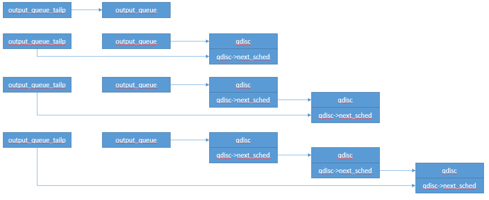

# NAPI

上一篇分析了收包NAPI实现，本篇分析发包NAPI实现。

分析发包NAPI前的猜想：

* 发包NAPI应该只发生在Qdisc的场景；
* 当Qdisc受流量控制时，之后某个时间点能够触发发包；
* 软中断处理时，和正常发包可能冲突，所以软中断处理也应该有锁机制；


## 触发发包软中断

```c
/*
之前未打上__QDISC_STATE_SCHED标记才会触发发包软中断，软中断处理函数中会清此标记
__QDISC_STATE_SCHED标记开着，意味着软中断标记已打开，说明当前qdisc已经在softnet_data的链表中，直接退出
*/
void __netif_schedule(struct Qdisc *q)
{
	if (!test_and_set_bit(__QDISC_STATE_SCHED, &q->state))  
		__netif_reschedule(q);   
}

/*
把当前qdisc挂到output_queue_tailp上，依靠qdisc的next_sched把qdisc串起来
*/
static inline void __netif_reschedule(struct Qdisc *q)
{
	struct softnet_data *sd;
	unsigned long flags;

	local_irq_save(flags);
	sd = this_cpu_ptr(&softnet_data);
	q->next_sched = NULL;             //当前qdisc的next_sched设置为空，只支持单个挂载
	*sd->output_queue_tailp = q;      //把q设置为上次qdisc的next_sched成员
	sd->output_queue_tailp = &q->next_sched;  //二维指针指向q的next_sched成员，下一个qdisc就挂在当前qdisc的next_sched
	raise_softirq_irqoff(NET_TX_SOFTIRQ);
	local_irq_restore(flags);
}
```

假设从第一次开始，连续调用__netif_reschedule三次，指针如下：




## 软中断处理函数

```c
static void net_tx_action(struct softirq_action *h)
{
	struct softnet_data *sd = this_cpu_ptr(&softnet_data);

	if (sd->completion_queue) {	  //发送完成队列不为空
		struct sk_buff *clist;

		local_irq_disable();
		clist = sd->completion_queue;
		sd->completion_queue = NULL;	//完成队列置空
		local_irq_enable();

		while (clist) {
			struct sk_buff *skb = clist;
			clist = clist->next;

			WARN_ON(atomic_read(&skb->users));
			if (likely(get_kfree_skb_cb(skb)->reason == SKB_REASON_CONSUMED))
				trace_consume_skb(skb);
			else
				trace_kfree_skb(skb, net_tx_action);
			__kfree_skb(skb);	//释放skb
		}
	}

	if (sd->output_queue) {		//发送队列不为空，指向一个qdisc
		struct Qdisc *head;

		local_irq_disable();
		head = sd->output_queue;
		sd->output_queue = NULL;	//发送队列置NULL，重新初始化链表
		sd->output_queue_tailp = &sd->output_queue; 
		local_irq_enable();

		while (head) {
			struct Qdisc *q = head;
			spinlock_t *root_lock;

			head = head->next_sched;	//每个队列都有执行机会

			root_lock = qdisc_lock(q);
			if (spin_trylock(root_lock)) {     //和二层发包抢锁
				smp_mb__before_atomic();
				clear_bit(__QDISC_STATE_SCHED,
					  &q->state);   //清除__QDISC_STATE_SCHED，可以再次被添加到softnet_data中
				qdisc_run(q);		//尝试启动qdisc发送报文
				spin_unlock(root_lock);
			} else {
				if (!test_bit(__QDISC_STATE_DEACTIVATED,
					      &q->state)) {
					__netif_reschedule(q);	//加锁失败且qdisc处于active状态，说明正在发包，重新放到发送队列，触发软中断，让给下一个
				} else {
					smp_mb__before_atomic();
					clear_bit(__QDISC_STATE_SCHED,
						  &q->state);
				}
			}
		}
	}
}

static inline void qdisc_run(struct Qdisc *q)
{
	if (qdisc_run_begin(q))  //已经处于running状态，则直接返回，让给对方处理
		__qdisc_run(q);
}

/*
执行qdisc发包，尝试发送一定配额的报文（如果有报文），直到：
1. qdisc报文发送完成（没有报文，或者流量限制）
2. 用完发送配额（避免长时间发包），如果配额用户场景，还会触发发包软中断
*/
void __qdisc_run(struct Qdisc *q)
{
	int quota = weight_p;
	int packets;

	while (qdisc_restart(q, &packets)) {      //尝试发送报文，直到报文被发送完成（或受流控限制导致取不出skb）
		/*
		 * Ordered by possible occurrence: Postpone processing if
		 * 1. we've exceeded packet quota
		 * 2. another process needs the CPU;
		 */
		quota -= packets;
		if (quota <= 0 || need_resched()) {
			__netif_schedule(q);				//还有报文可以发送，触发发包软中断
			break;
		}
	}

	qdisc_run_end(q);
}

/*
从qdisc中收包，并发送给网卡驱动
*/
static inline int qdisc_restart(struct Qdisc *q, int *packets)
{
	struct netdev_queue *txq;
	struct net_device *dev;
	spinlock_t *root_lock;
	struct sk_buff *skb;
	bool validate;

	/* Dequeue packet */
	skb = dequeue_skb(q, &validate, packets);   //从qdisc中收取报文，取不出报文，则会退出__qdisc_run
	if (unlikely(!skb))
		return 0;

	root_lock = qdisc_lock(q);
	dev = qdisc_dev(q);
	txq = skb_get_tx_queue(dev, skb);

	return sch_direct_xmit(skb, q, dev, txq, root_lock, validate);   //直接发送报文，发送给驱动
}

/*
从qdisc中收包，可以一次取多个报文
*/
static struct sk_buff *dequeue_skb(struct Qdisc *q, bool *validate,
				   int *packets)
{
	struct sk_buff *skb = q->gso_skb;				//队列被冻结时发的包
	const struct netdev_queue *txq = q->dev_queue;

	*packets = 1;
	*validate = true;
	if (unlikely(skb)) {   
		/* check the reason of requeuing without tx lock first */
		txq = skb_get_tx_queue(txq->dev, skb);
		if (!netif_xmit_frozen_or_stopped(txq)) {    //如果qdisc未冻结或停止，当前返回gso_skb报文
			q->gso_skb = NULL;
			q->q.qlen--;
		} else
			skb = NULL;
		/* skb in gso_skb were already validated */
		*validate = false;
	} else {
		if (!(q->flags & TCQ_F_ONETXQUEUE) ||
		    !netif_xmit_frozen_or_stopped(txq)) {
			skb = q->dequeue(q);						//从qdisc收包
			if (skb && qdisc_may_bulk(q))      
				try_bulk_dequeue_skb(q, skb, txq, packets);  //收取多个报文
		}
	}
	return skb; 
}
```


