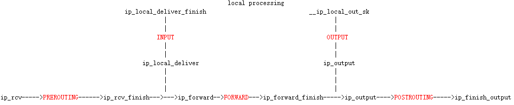

# Netfilter总体框架

Netfilter是Linux防火墙的内核实现

## Hook点定义

Netfilter 共定义了5个Hook点：

```c
enum nf_inet_hooks {
	NF_INET_PRE_ROUTING,
	NF_INET_LOCAL_IN,
	NF_INET_FORWARD,
	NF_INET_LOCAL_OUT,
	NF_INET_POST_ROUTING,
	NF_INET_NUMHOOKS
};

/* Bridge Hooks */
/* After promisc drops, checksum checks. */
#define NF_BR_PRE_ROUTING	0
/* If the packet is destined for this box. */
#define NF_BR_LOCAL_IN		1
/* If the packet is destined for another interface. */
#define NF_BR_FORWARD		2
/* Packets coming from a local process. */
#define NF_BR_LOCAL_OUT		3
/* Packets about to hit the wire. */
#define NF_BR_POST_ROUTING	4
/* Not really a hook, but used for the ebtables broute table */
#define NF_BR_BROUTING		5
#define NF_BR_NUMHOOKS		6
```

### Hook点内核入口




## Hook函数注册

### NAT hook函数定义

```c
static struct nf_hook_ops nf_nat_ipv4_ops[] __read_mostly = {
	/* Before packet filtering, change destination */
	{
		.hook		= iptable_nat_ipv4_in,
		.owner		= THIS_MODULE,
		.pf		= NFPROTO_IPV4,
		.hooknum	= NF_INET_PRE_ROUTING,
		.priority	= NF_IP_PRI_NAT_DST,
	},
	/* After packet filtering, change source */
	{
		.hook		= iptable_nat_ipv4_out,
		.owner		= THIS_MODULE,
		.pf		= NFPROTO_IPV4,
		.hooknum	= NF_INET_POST_ROUTING,
		.priority	= NF_IP_PRI_NAT_SRC,
	},
	/* Before packet filtering, change destination */
	{
		.hook		= iptable_nat_ipv4_local_fn,
		.owner		= THIS_MODULE,
		.pf		= NFPROTO_IPV4,
		.hooknum	= NF_INET_LOCAL_OUT,
		.priority	= NF_IP_PRI_NAT_DST,
	},
	/* After packet filtering, change source */
	{
		.hook		= iptable_nat_ipv4_fn,
		.owner		= THIS_MODULE,
		.pf		= NFPROTO_IPV4,
		.hooknum	= NF_INET_LOCAL_IN,
		.priority	= NF_IP_PRI_NAT_SRC,
	},
};
```

### CT hook函数定义

```c
static struct nf_hook_ops ipv4_conntrack_ops[] __read_mostly = {
	{
		.hook		= ipv4_conntrack_in,
		.owner		= THIS_MODULE,
		.pf		= NFPROTO_IPV4,
		.hooknum	= NF_INET_PRE_ROUTING,
		.priority	= NF_IP_PRI_CONNTRACK,
	},
	{
		.hook		= ipv4_conntrack_local,
		.owner		= THIS_MODULE,
		.pf		= NFPROTO_IPV4,
		.hooknum	= NF_INET_LOCAL_OUT,
		.priority	= NF_IP_PRI_CONNTRACK,
	},
	{
		.hook		= ipv4_helper,
		.owner		= THIS_MODULE,
		.pf		= NFPROTO_IPV4,
		.hooknum	= NF_INET_POST_ROUTING,
		.priority	= NF_IP_PRI_CONNTRACK_HELPER,
	},
	{
		.hook		= ipv4_confirm,
		.owner		= THIS_MODULE,
		.pf		= NFPROTO_IPV4,
		.hooknum	= NF_INET_POST_ROUTING,
		.priority	= NF_IP_PRI_CONNTRACK_CONFIRM,
	},
	{
		.hook		= ipv4_helper,
		.owner		= THIS_MODULE,
		.pf		= NFPROTO_IPV4,
		.hooknum	= NF_INET_LOCAL_IN,
		.priority	= NF_IP_PRI_CONNTRACK_HELPER,
	},
	{
		.hook		= ipv4_confirm,
		.owner		= THIS_MODULE,
		.pf		= NFPROTO_IPV4,
		.hooknum	= NF_INET_LOCAL_IN,
		.priority	= NF_IP_PRI_CONNTRACK_CONFIRM,
	},
};
```

### defrag hook函数定义

```c
static struct nf_hook_ops ipv4_defrag_ops[] = {
	{
		.hook		= ipv4_conntrack_defrag,
		.owner		= THIS_MODULE,
		.pf		= NFPROTO_IPV4,
		.hooknum	= NF_INET_PRE_ROUTING,
		.priority	= NF_IP_PRI_CONNTRACK_DEFRAG,
	},
	{
		.hook           = ipv4_conntrack_defrag,
		.owner          = THIS_MODULE,
		.pf             = NFPROTO_IPV4,
		.hooknum        = NF_INET_LOCAL_OUT,
		.priority       = NF_IP_PRI_CONNTRACK_DEFRAG,
	},
};
```

### bridge hook函数定义

```c
static struct nf_hook_ops br_nf_ops[] __read_mostly = {
	{
		.hook = br_nf_pre_routing,
		.owner = THIS_MODULE,
		.pf = NFPROTO_BRIDGE,
		.hooknum = NF_BR_PRE_ROUTING,
		.priority = NF_BR_PRI_BRNF,
	},
	{
		.hook = br_nf_local_in,
		.owner = THIS_MODULE,
		.pf = NFPROTO_BRIDGE,
		.hooknum = NF_BR_LOCAL_IN,
		.priority = NF_BR_PRI_BRNF,
	},
	{
		.hook = br_nf_forward_ip,
		.owner = THIS_MODULE,
		.pf = NFPROTO_BRIDGE,
		.hooknum = NF_BR_FORWARD,
		.priority = NF_BR_PRI_BRNF - 1,
	},
	{
		.hook = br_nf_forward_arp,
		.owner = THIS_MODULE,
		.pf = NFPROTO_BRIDGE,
		.hooknum = NF_BR_FORWARD,
		.priority = NF_BR_PRI_BRNF,
	},
	{
		.hook = br_nf_post_routing,
		.owner = THIS_MODULE,
		.pf = NFPROTO_BRIDGE,
		.hooknum = NF_BR_POST_ROUTING,
		.priority = NF_BR_PRI_LAST,
	},
	{
		.hook = ip_sabotage_in,
		.owner = THIS_MODULE,
		.pf = NFPROTO_IPV4,
		.hooknum = NF_INET_PRE_ROUTING,
		.priority = NF_IP_PRI_FIRST,
	},
	{
		.hook = ip_sabotage_in,
		.owner = THIS_MODULE,
		.pf = NFPROTO_IPV6,
		.hooknum = NF_INET_PRE_ROUTING,
		.priority = NF_IP6_PRI_FIRST,
	},
};
```

### ebtable hook函数定义

```c
static struct nf_hook_ops ebt_ops_filter[] __read_mostly = {
	{
		.hook		= ebt_in_hook,
		.owner		= THIS_MODULE,
		.pf		= NFPROTO_BRIDGE,
		.hooknum	= NF_BR_LOCAL_IN,
		.priority	= NF_BR_PRI_FILTER_BRIDGED,
	},
	{
		.hook		= ebt_in_hook,
		.owner		= THIS_MODULE,
		.pf		= NFPROTO_BRIDGE,
		.hooknum	= NF_BR_FORWARD,
		.priority	= NF_BR_PRI_FILTER_BRIDGED,
	},
	{
		.hook		= ebt_out_hook,
		.owner		= THIS_MODULE,
		.pf		= NFPROTO_BRIDGE,
		.hooknum	= NF_BR_LOCAL_OUT,
		.priority	= NF_BR_PRI_FILTER_OTHER,
	},
};
```

### ebtable nat hook函数定义

```c
static struct nf_hook_ops ebt_ops_nat[] __read_mostly = {
	{
		.hook		= ebt_nat_out,
		.owner		= THIS_MODULE,
		.pf		= NFPROTO_BRIDGE,
		.hooknum	= NF_BR_LOCAL_OUT,
		.priority	= NF_BR_PRI_NAT_DST_OTHER,
	},
	{
		.hook		= ebt_nat_out,
		.owner		= THIS_MODULE,
		.pf		= NFPROTO_BRIDGE,
		.hooknum	= NF_BR_POST_ROUTING,
		.priority	= NF_BR_PRI_NAT_SRC,
	},
	{
		.hook		= ebt_nat_in,
		.owner		= THIS_MODULE,
		.pf		= NFPROTO_BRIDGE,
		.hooknum	= NF_BR_PRE_ROUTING,
		.priority	= NF_BR_PRI_NAT_DST_BRIDGED,
	},
};
```

### 公共Hook函数定义

```c
#define FILTER_VALID_HOOKS ((1 << NF_INET_LOCAL_IN) | \
			    (1 << NF_INET_FORWARD) | \
			    (1 << NF_INET_LOCAL_OUT))
static const struct xt_table packet_filter = {
	.name		= "filter",
	.valid_hooks	= FILTER_VALID_HOOKS,
	.me		= THIS_MODULE,
	.af		= NFPROTO_IPV4,
	.priority	= NF_IP_PRI_FILTER,
};
xt_hook_link(&packet_filter, iptable_filter_hook);


#define MANGLE_VALID_HOOKS ((1 << NF_INET_PRE_ROUTING) | \
			    (1 << NF_INET_LOCAL_IN) | \
			    (1 << NF_INET_FORWARD) | \
			    (1 << NF_INET_LOCAL_OUT) | \
			    (1 << NF_INET_POST_ROUTING))
static const struct xt_table packet_mangler = {
	.name		= "mangle",
	.valid_hooks	= MANGLE_VALID_HOOKS,
	.me		= THIS_MODULE,
	.af		= NFPROTO_IPV4,
	.priority	= NF_IP_PRI_MANGLE,
};
xt_hook_link(&packet_mangler, iptable_mangle_hook);


#define RAW_VALID_HOOKS ((1 << NF_INET_PRE_ROUTING) | (1 << NF_INET_LOCAL_OUT))
static const struct xt_table packet_raw = {
	.name = "raw",
	.valid_hooks =  RAW_VALID_HOOKS,
	.me = THIS_MODULE,
	.af = NFPROTO_IPV4,
	.priority = NF_IP_PRI_RAW,
};
xt_hook_link(&packet_raw, iptable_raw_hook);


#define SECURITY_VALID_HOOKS	(1 << NF_INET_LOCAL_IN) | \
				(1 << NF_INET_FORWARD) | \
				(1 << NF_INET_LOCAL_OUT)
static const struct xt_table security_table = {
	.name		= "security",
	.valid_hooks	= SECURITY_VALID_HOOKS,
	.me		= THIS_MODULE,
	.af		= NFPROTO_IPV4,
	.priority	= NF_IP_PRI_SECURITY,
};
xt_hook_link(&security_table, iptable_security_hook);


#define FILTER_VALID_HOOKS ((1 << NF_ARP_IN) | (1 << NF_ARP_OUT) | \
			   (1 << NF_ARP_FORWARD))

static const struct xt_table packet_filter = {
	.name		= "filter",
	.valid_hooks	= FILTER_VALID_HOOKS,
	.me		= THIS_MODULE,
	.af		= NFPROTO_ARP,
	.priority	= NF_IP_PRI_FILTER,
};
xt_hook_link(&packet_filter, arptable_filter_hook);
```


### Hook函数注册

```c
int nf_register_hooks(struct nf_hook_ops *reg, unsigned int n)
{
	unsigned int i;
	int err = 0;

	for (i = 0; i < n; i++) {
		err = nf_register_hook(&reg[i]);
		if (err)
			goto err;
	}
	return err;

err:
	if (i > 0)
		nf_unregister_hooks(reg, i);
	return err;
}

int nf_register_hook(struct nf_hook_ops *reg)
{
	struct nf_hook_ops *elem;

	mutex_lock(&nf_hook_mutex);
	list_for_each_entry(elem, &nf_hooks[reg->pf][reg->hooknum], list) {  //nf_hooks为二维指针数据，每种协议8个hook点
		if (reg->priority < elem->priority)
			break;
	}
	list_add_rcu(&reg->list, elem->list.prev);		//链表按照优先级排序
	mutex_unlock(&nf_hook_mutex);
#ifdef HAVE_JUMP_LABEL
	static_key_slow_inc(&nf_hooks_needed[reg->pf][reg->hooknum]);
#endif
	return 0;
}
```


## Netfilter Hook点总结

CT相关的Hook点，在NF_INET_PRE_ROUTING、NF_INET_LOCAL_IN、NF_INET_LOCAL_OUT和NF_INET_POST_ROUTING这四个点。

以下列出的各个hook点，按照hook函数的优先级排序，数字越小代表优先级越高：

```c
NF_INET_PRE_ROUTING
ipv4_conntrack_defrag（NF_IP_PRI_CONNTRACK_DEFRAG：-400）
NF_IP_PRI_RAW：-300   //用户可添加规则
ipv4_conntrack_in（NF_IP_PRI_CONNTRACK：-200）
NF_IP_PRI_MANGLE：-150  //用户可添加规则
iptable_nat_ipv4_in（NF_IP_PRI_NAT_DST：-100）
NF_IP_PRI_NAT_DST：-100  //用户可添加规则
NF_IP_PRI_FILTER：0  //用户可添加规则

NF_INET_LOCAL_IN
NF_IP_PRI_RAW：-300  //用户可添加规则
NF_IP_PRI_MANGLE：-150  //用户可添加规则
NF_IP_PRI_FILTER：0  //用户可添加规则
NF_IP_PRI_NAT_SRC：100  //用户可添加规则
iptable_nat_ipv4_fn（NF_IP_PRI_NAT_SRC：100）
ipv4_helper（NF_IP_PRI_CONNTRACK_HELPER：300）
ipv4_confirm（NF_IP_PRI_CONNTRACK_CONFIRM：MAX）

NF_INET_LOCAL_OUT
ipv4_conntrack_defrag（NF_IP_PRI_CONNTRACK_DEFRAG：-400）
NF_IP_PRI_RAW：-300
ipv4_conntrack_local（NF_IP_PRI_CONNTRACK：-200）
NF_IP_PRI_MANGLE：-150
iptable_nat_ipv4_local_fn（NF_IP_PRI_NAT_DST：-100）
NF_IP_PRI_NAT_DST：-100
NF_IP_PRI_FILTER：0

NF_INET_POST_ROUTING
NF_IP_PRI_RAW：-300
NF_IP_PRI_MANGLE：-150
NF_IP_PRI_FILTER：0
NF_IP_PRI_NAT_SRC：100
iptable_nat_ipv4_out（NF_IP_PRI_NAT_SRC：100）
ipv4_helper（NF_IP_PRI_CONNTRACK_HELPER:300）
ipv4_confirm（NF_IP_PRI_CONNTRACK_CONFIRM：MAX）
```

## Netfilter Hook函数入口

```c
static inline int
NF_HOOK(uint8_t pf, unsigned int hook, struct sock *sk, struct sk_buff *skb,
	struct net_device *in, struct net_device *out,
	int (*okfn)(struct sock *, struct sk_buff *))
{
	return NF_HOOK_THRESH(pf, hook, sk, skb, in, out, okfn, INT_MIN);
}

static inline int
NF_HOOK_THRESH(uint8_t pf, unsigned int hook, struct sock *sk,
	       struct sk_buff *skb, struct net_device *in,
	       struct net_device *out,
	       int (*okfn)(struct sock *, struct sk_buff *), int thresh)
{
	int ret = nf_hook_thresh(pf, hook, sk, skb, in, out, okfn, thresh);
	if (ret == 1)
		ret = okfn(sk, skb);	//nf_hook_thresh返回1能够继续交由okfn函数处理
	return ret;
}

static inline int
NF_HOOK_COND(uint8_t pf, unsigned int hook, struct sock *sk,
	     struct sk_buff *skb, struct net_device *in, struct net_device *out,
	     int (*okfn)(struct sock *, struct sk_buff *), bool cond)
{
	int ret;

	if (!cond ||
	    ((ret = nf_hook_thresh(pf, hook, sk, skb, in, out, okfn, INT_MIN)) == 1))
		ret = okfn(sk, skb);
	return ret;
}
```


### nf_hook_thresh

```c
static inline int nf_hook_thresh(u_int8_t pf, unsigned int hook,
				 struct sock *sk,
				 struct sk_buff *skb,
				 struct net_device *indev,
				 struct net_device *outdev,
				 int (*okfn)(struct sock *, struct sk_buff *),
				 int thresh)
{
	if (nf_hooks_active(pf, hook)) {    //该协议的hook注册了方法
		struct nf_hook_state state;

		nf_hook_state_init(&state, hook, thresh, pf,   //初始化state
				   indev, outdev, sk, okfn);
		return nf_hook_slow(skb, &state);
	}
	return 1;
}
```

### nf_hook_slow

```c
int nf_hook_slow(struct sk_buff *skb, struct nf_hook_state *state)
{
	struct nf_hook_ops *elem;
	unsigned int verdict;
	int ret = 0;

	/* We may already have this, but read-locks nest anyway */
	rcu_read_lock();

	elem = list_entry_rcu(&nf_hooks[state->pf][state->hook],    //得到第一个hook函数
			      struct nf_hook_ops, list);
next_hook:
	verdict = nf_iterate(&nf_hooks[state->pf][state->hook], skb, state,  //遍历所有的hook函数，直到结束或非accept
			     &elem);
	if (verdict == NF_ACCEPT || verdict == NF_STOP) {
		ret = 1;
	} else if ((verdict & NF_VERDICT_MASK) == NF_DROP) {
		kfree_skb(skb);
		ret = NF_DROP_GETERR(verdict);
		if (ret == 0)
			ret = -EPERM;
	} else if ((verdict & NF_VERDICT_MASK) == NF_QUEUE) {
		int err = nf_queue(skb, elem, state,
				   verdict >> NF_VERDICT_QBITS);
		if (err < 0) {
			if (err == -ECANCELED)
				goto next_hook;
			if (err == -ESRCH &&
			   (verdict & NF_VERDICT_FLAG_QUEUE_BYPASS))
				goto next_hook;
			kfree_skb(skb);
		}
	}
	rcu_read_unlock();
	return ret;
}

unsigned int nf_iterate(struct list_head *head,
			struct sk_buff *skb,
			struct nf_hook_state *state,
			struct nf_hook_ops **elemp)
{
	unsigned int verdict;

	/*
	 * The caller must not block between calls to this
	 * function because of risk of continuing from deleted element.
	 */
	list_for_each_entry_continue_rcu((*elemp), head, list) {
		if (state->thresh > (*elemp)->priority)
			continue;

		/* Optimization: we don't need to hold module
		   reference here, since function can't sleep. --RR */
repeat:
		verdict = (*elemp)->hook(*elemp, skb, state);	//调用hook函数，直到非accept或结束
		if (verdict != NF_ACCEPT) {
#ifdef CONFIG_NETFILTER_DEBUG
			if (unlikely((verdict & NF_VERDICT_MASK)
							> NF_MAX_VERDICT)) {
				NFDEBUG("Evil return from %p(%u).\n",
					(*elemp)->hook, state->hook);
				continue;
			}
#endif
			if (verdict != NF_REPEAT)
				return verdict;
			goto repeat;
		}
	}
	return NF_ACCEPT;   //遍历结束
}
```


