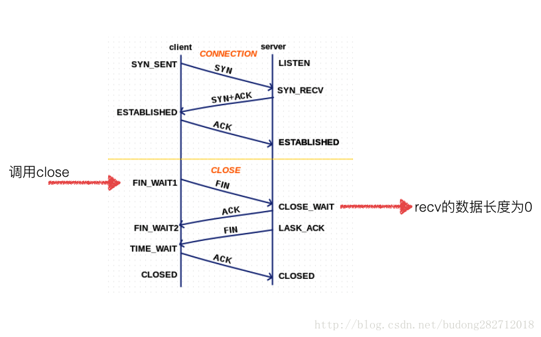
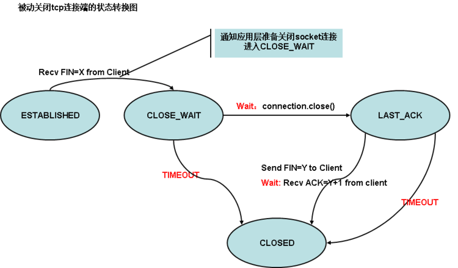

# TCP Socket

本文介绍TCP Socket相关接口的内核处理流程。 TCP三次握手建立连接，四次挥手释放连接，过程中提供的系统接口调用流程。


## TCP Server端代码

```c
#include <stdio.h>
#include <stdlib.h>
#include <string.h>
#include <sys/socket.h>
#include <poll.h>
#include <sys/epoll.h>
#include <sys/time.h>
#include <netinet/in.h>
 
#define MYPORT 12345
 
//最多处理的connect
#define MAX_EVENTS 500
 
//当前的连接数
int currentClient = 0; 
 
//数据接受 buf
#define REVLEN 10
char recvBuf[REVLEN];

//epoll描述符
int epollfd;
//事件数组
struct epoll_event eventList[MAX_EVENTS];
 
void AcceptConn(int srvfd);
void RecvData(int fd);
 
int main()
{
    int i, ret, sinSize;
    int recvLen = 0;
    fd_set readfds, writefds;
    int sockListen, sockSvr, sockMax;
    int timeout;
    struct sockaddr_in server_addr;
    struct sockaddr_in client_addr;
    
    //socket
    if((sockListen=socket(AF_INET, SOCK_STREAM, 0)) < 0) {
        printf("socket error\n");
        return -1;
    }
    
    bzero(&server_addr, sizeof(server_addr));
    server_addr.sin_family  =  AF_INET;
    server_addr.sin_port = htons(MYPORT);
    server_addr.sin_addr.s_addr  =  htonl(INADDR_ANY); 
    
    //bind
    if(bind(sockListen, (struct sockaddr*)&server_addr, sizeof(server_addr)) < 0) {
        printf("bind error\n");
        return -1;
    }
    
    //listen
    if(listen(sockListen, 5) < 0) {
        printf("listen error\n");
        return -1;
    }
    
    // epoll 初始化
    epollfd = epoll_create(MAX_EVENTS);
    struct epoll_event event;
    event.events = EPOLLIN|EPOLLET;
    event.data.fd = sockListen;
    
    //add Event
    if(epoll_ctl(epollfd, EPOLL_CTL_ADD, sockListen, &event) < 0) {
        printf("epoll add fail : fd = %d\n", sockListen);
        return -1;
    }
    
    //epoll
    while(1) {
        timeout=3000;                
        //epoll_wait
        int ret = epoll_wait(epollfd, eventList, MAX_EVENTS, timeout);
        
        if(ret < 0) {
            printf("epoll error\n");
            break;
        }
        else if(ret == 0) {
            printf("timeout ...\n");
            continue;
        }
        
        //直接获取了事件数量,给出了活动的流,这里是和poll区别的关键
        int i = 0;
        for(i=0; i<ret; i++) {
            //错误退出
            if ((eventList[i].events & EPOLLERR) ||
                (eventList[i].events & EPOLLHUP) ||
                !(eventList[i].events & EPOLLIN)) {
              printf ( "epoll error\n");
              close (eventList[i].data.fd);
              return -1;
            }
            
            if (eventList[i].data.fd == sockListen) {
                AcceptConn(sockListen);   //新建连接
            }else{
                RecvData(eventList[i].data.fd);  //接收数据
            }
        }
    }
    
    close(epollfd);
    close(sockListen);
    return 0;
}

void AcceptConn(int srvfd)
{
    struct sockaddr_in sin;
    socklen_t len = sizeof(struct sockaddr_in);
    bzero(&sin, len);
 
    int confd = accept(srvfd, (struct sockaddr*)&sin, &len);
 
    if (confd < 0) {
       printf("bad accept\n");
       return;
    } else {
        printf("Accept Connection: %d", confd);
    }
    //将新建立的连接添加到EPOLL的监听中
    struct epoll_event event;
    event.data.fd = confd;
    event.events =  EPOLLIN|EPOLLET;
    epoll_ctl(epollfd, EPOLL_CTL_ADD, confd, &event);
}

//读取数据
void RecvData(int fd)
{
    int ret;
    int recvLen = 0;
    
    memset(recvBuf, 0, REVLEN);
    printf("RecvData function\n");
    
    if(recvLen != REVLEN) {
        while(1) {
            //recv数据
            ret = recv(fd, (char *)recvBuf+recvLen, REVLEN-recvLen, 0);
            if(ret == 0) {
                recvLen = 0;
                break;
            }
            else if(ret < 0) {
                recvLen = 0;
                break;
            }
            //数据接受正常
            recvLen = recvLen+ret;
            if(recvLen<REVLEN) {
                continue;
            } else {
                //数据接受完毕
                printf("buf = %s\n",  recvBuf);
                recvLen = 0;
                break;
            }
        }
    }
    printf("data is %s", recvBuf);
}
```


## TCP Client端代码

```c
#include <stdio.h>
#include <string.h>
#include <sys/socket.h>
#include <netinet/in.h>

int main(int argc, char **argv)
{
    int sockfd;
    struct sockaddr_in servaddr;

    sockfd = socket(PF_INET, SOCK_STREAM, 0);

    bzero(&servaddr, sizeof(servaddr));
    servaddr.sin_family = AF_INET;
    servaddr.sin_port = htons(50001);
    servaddr.sin_addr.s_addr = inet_addr("127.0.0.1");

    connect(sockfd, (struct sockaddr *)&servaddr, sizeof(servaddr));

    char sendline[100];
    sprintf(sendline, "Hello, world!");

    write(sockfd, sendline, strlen(sendline));

    close(sockfd);

    return 1;
}
```


## TCP Socket状态

服务器端已创建socket，并且已经bind socket，监听该socket。
客户端创建socket，调用connect进行连接。

```c
enum {
	TCP_ESTABLISHED = 1, // client第三次握手后（向服务器发送SYN的ACK响应），进入ESTABLISHED状态；
	TCP_SYN_SENT,        // client端调用connect函数后，进入SYN_SENT状态
	TCP_SYN_RECV,        // client端进入SYN_SENT状态后，收到server端发送的syn+ack报文后，进入到SYN_RECV状态；
	TCP_FIN_WAIT1,
	TCP_FIN_WAIT2,
	TCP_TIME_WAIT,
	TCP_CLOSE,
	TCP_CLOSE_WAIT,
	TCP_LAST_ACK,
	TCP_LISTEN,			// server端调用listen函数后，进入LISTEN状态
	TCP_CLOSING,
	TCP_NEW_SYN_RECV,

	TCP_MAX_STATES	/* Leave at the end! */
};
```

### TCP Socket状态说明





* CLOSED：表示初始状态。对服务端和C客户端双方都一样。
* LISTEN：表示监听状态。服务端调用了listen函数，可以开始accept连接了。
* SYN_SENT：表示客户端已经发送了SYN报文。当客户端调用connect函数发起连接时，首先发SYN给服务端，然后自己进入SYN_SENT状态，并等待服务端发送ACK+SYN。
* SYN_RCVD：表示服务端收到客户端发送SYN报文。服务端收到这个报文后，进入SYN_RCVD状态，然后发送ACK+SYN给客户端。
* ESTABLISHED：表示连接已经建立成功了。服务端发送完ACK+SYN后进入该状态，客户端收到ACK后也进入该状态。
* FIN_WAIT_1：表示主动关闭连接。无论哪方调用close函数发送FIN报文都会进入这个这个状态。
* FIN_WAIT_2：表示被动关闭方同意关闭连接。主动关闭连接方收到被动关闭方返回的ACK后，会进入该状态。
* TIME_WAIT：表示收到对方的FIN报文并发送了ACK报文，就等2MSL后即可回到CLOSED状态了。如果FIN_WAIT_1状态下，收到对方同时带FIN标志和ACK标志的报文时，可以直接进入TIME_WAIT状态，而无须经过FIN_WAIT_2状态。
* CLOSING：表示双方同时关闭连接。如果双方几乎同时调用close函数，那么会出现双方同时发送FIN报文的情况，此时就会出现CLOSING状态，表示双方都在关闭连接。
* CLOSE_WAIT：表示被动关闭方等待关闭。当收到对方调用close函数发送的FIN报文时，回应对方ACK报文，此时进入CLOSE_WAIT状态。
* LAST_ACK：表示被动关闭方发送FIN报文后，等待对方的ACK报文状态，当收到ACK后进入CLOSED状态。


## TCP Listen(inet_listen)

```c
int inet_listen(struct socket *sock, int backlog)
{
	struct sock *sk = sock->sk;
	unsigned char old_state;
	int err;

	lock_sock(sk);

	err = -EINVAL;
	if (sock->state != SS_UNCONNECTED || sock->type != SOCK_STREAM)
		goto out;

	old_state = sk->sk_state;
	if (!((1 << old_state) & (TCPF_CLOSE | TCPF_LISTEN)))
		goto out;

	/* Really, if the socket is already in listen state
	 * we can only allow the backlog to be adjusted.
	 */
	if (old_state != TCP_LISTEN) {
		/* Check special setups for testing purpose to enable TFO w/o
		 * requiring TCP_FASTOPEN sockopt.
		 * Note that only TCP sockets (SOCK_STREAM) will reach here.
		 * Also fastopenq may already been allocated because this
		 * socket was in TCP_LISTEN state previously but was
		 * shutdown() (rather than close()).
		 */
		if ((sysctl_tcp_fastopen & TFO_SERVER_ENABLE) != 0 &&
		    !inet_csk(sk)->icsk_accept_queue.fastopenq) {
			if ((sysctl_tcp_fastopen & TFO_SERVER_WO_SOCKOPT1) != 0)
				err = fastopen_init_queue(sk, backlog);
			else if ((sysctl_tcp_fastopen &
				  TFO_SERVER_WO_SOCKOPT2) != 0)
				err = fastopen_init_queue(sk,
				    ((uint)sysctl_tcp_fastopen) >> 16);
			else
				err = 0;
			if (err)
				goto out;

			tcp_fastopen_init_key_once(true);
		}
		err = inet_csk_listen_start(sk, backlog);
		if (err)
			goto out;
	}
	sk->sk_max_ack_backlog = backlog;
	err = 0;

out:
	release_sock(sk);
	return err;
}

int inet_csk_listen_start(struct sock *sk, const int nr_table_entries)
{
	struct inet_sock *inet = inet_sk(sk);
	struct inet_connection_sock *icsk = inet_csk(sk);
	int rc = reqsk_queue_alloc(&icsk->icsk_accept_queue, nr_table_entries);

	if (rc != 0)
		return rc;

	sk->sk_max_ack_backlog = 0;
	sk->sk_ack_backlog = 0;
	inet_csk_delack_init(sk);

	/* There is race window here: we announce ourselves listening,
	 * but this transition is still not validated by get_port().
	 * It is OK, because this socket enters to hash table only
	 * after validation is complete.
	 */
	sk->sk_state = TCP_LISTEN;   //设置LISTEN状态
	if (!sk->sk_prot->get_port(sk, inet->inet_num)) {
		inet->inet_sport = htons(inet->inet_num);

		sk_dst_reset(sk);
		sk->sk_prot->hash(sk);   //sock添加到内核，tcp的hash函数为inet_hash

		return 0;
	}

	sk->sk_state = TCP_CLOSE;
	__reqsk_queue_destroy(&icsk->icsk_accept_queue);
	return -EADDRINUSE;
}

void inet_hash(struct sock *sk)
{
	if (sk->sk_state != TCP_CLOSE) {
		local_bh_disable();
		__inet_hash(sk, NULL);
		local_bh_enable();
	}
}

int __inet_hash(struct sock *sk, struct inet_timewait_sock *tw)
{
	struct inet_hashinfo *hashinfo = sk->sk_prot->h.hashinfo;
	struct inet_listen_hashbucket *ilb;

	if (sk->sk_state != TCP_LISTEN)
		return __inet_hash_nolisten(sk, tw);

	WARN_ON(!sk_unhashed(sk));
	ilb = &hashinfo->listening_hash[inet_sk_listen_hashfn(sk)];  //listen hash表

	spin_lock(&ilb->lock);
	__sk_nulls_add_node_rcu(sk, &ilb->head);
	sock_prot_inuse_add(sock_net(sk), sk->sk_prot, 1);
	spin_unlock(&ilb->lock);
	return 0;
}
```


## TCP Connect(inet_stream_connect)

```c
//用户态程序调用connect系统调用，最终会调用到inet_stream_ops的connect函数
int inet_stream_connect(struct socket *sock, struct sockaddr *uaddr,
			int addr_len, int flags)
{
	int err;

	lock_sock(sock->sk);   //锁定sock
	err = __inet_stream_connect(sock, uaddr, addr_len, flags);
	release_sock(sock->sk);
	return err;
}

int __inet_stream_connect(struct socket *sock, struct sockaddr *uaddr,
			  int addr_len, int flags)
{
	struct sock *sk = sock->sk;
	int err;
	long timeo;

	if (addr_len < sizeof(uaddr->sa_family))
		return -EINVAL;

	if (uaddr->sa_family == AF_UNSPEC) {
		err = sk->sk_prot->disconnect(sk, flags);
		sock->state = err ? SS_DISCONNECTING : SS_UNCONNECTED;
		goto out;
	}

	switch (sock->state) {
	default:
		err = -EINVAL;
		goto out;
	case SS_CONNECTED:
		err = -EISCONN;
		goto out;
	case SS_CONNECTING:
		err = -EALREADY;
		/* Fall out of switch with err, set for this state */
		break;
	case SS_UNCONNECTED:
		err = -EISCONN;
		if (sk->sk_state != TCP_CLOSE)   //状态不允许为close
			goto out;

		err = sk->sk_prot->connect(sk, uaddr, addr_len);   //IPV4，调用tcp_v4_connect函数
		if (err < 0)
			goto out;

		sock->state = SS_CONNECTING;

		/* Just entered SS_CONNECTING state; the only
		 * difference is that return value in non-blocking
		 * case is EINPROGRESS, rather than EALREADY.
		 */
		err = -EINPROGRESS;
		break;
	}

	timeo = sock_sndtimeo(sk, flags & O_NONBLOCK);

	if ((1 << sk->sk_state) & (TCPF_SYN_SENT | TCPF_SYN_RECV)) {
		int writebias = (sk->sk_protocol == IPPROTO_TCP) &&
				tcp_sk(sk)->fastopen_req &&
				tcp_sk(sk)->fastopen_req->data ? 1 : 0;

		/* Error code is set above */
		if (!timeo || !inet_wait_for_connect(sk, timeo, writebias))
			goto out;

		err = sock_intr_errno(timeo);
		if (signal_pending(current))
			goto out;
	}

	/* Connection was closed by RST, timeout, ICMP error
	 * or another process disconnected us.
	 */
	if (sk->sk_state == TCP_CLOSE)
		goto sock_error;

	/* sk->sk_err may be not zero now, if RECVERR was ordered by user
	 * and error was received after socket entered established state.
	 * Hence, it is handled normally after connect() return successfully.
	 */

	sock->state = SS_CONNECTED;
	err = 0;
out:
	return err;

sock_error:
	err = sock_error(sk) ? : -ECONNABORTED;
	sock->state = SS_UNCONNECTED;
	if (sk->sk_prot->disconnect(sk, flags))
		sock->state = SS_DISCONNECTING;
	goto out;
}
```

## TCP Connect(tcp_v4_connect)

```c
int tcp_v4_connect(struct sock *sk, struct sockaddr *uaddr, int addr_len)
{
	struct sockaddr_in *usin = (struct sockaddr_in *)uaddr;
	struct inet_sock *inet = inet_sk(sk);
	struct tcp_sock *tp = tcp_sk(sk);
	__be16 orig_sport, orig_dport;
	__be32 daddr, nexthop;
	struct flowi4 *fl4;
	struct rtable *rt;
	int err;
	struct ip_options_rcu *inet_opt;

	if (addr_len < sizeof(struct sockaddr_in))
		return -EINVAL;

	if (usin->sin_family != AF_INET)
		return -EAFNOSUPPORT;

	nexthop = daddr = usin->sin_addr.s_addr;
	inet_opt = rcu_dereference_protected(inet->inet_opt,
					     sock_owned_by_user(sk));
	if (inet_opt && inet_opt->opt.srr) {
		if (!daddr)
			return -EINVAL;
		nexthop = inet_opt->opt.faddr;
	}

	orig_sport = inet->inet_sport;
	orig_dport = usin->sin_port;
	fl4 = &inet->cork.fl.u.ip4;
	rt = ip_route_connect(fl4, nexthop, inet->inet_saddr,   //查询路由
			      RT_CONN_FLAGS(sk), sk->sk_bound_dev_if,
			      IPPROTO_TCP,
			      orig_sport, orig_dport, sk);
	if (IS_ERR(rt)) {
		err = PTR_ERR(rt);
		if (err == -ENETUNREACH)
			IP_INC_STATS(sock_net(sk), IPSTATS_MIB_OUTNOROUTES);
		return err;
	}

	if (rt->rt_flags & (RTCF_MULTICAST | RTCF_BROADCAST)) {
		ip_rt_put(rt);
		return -ENETUNREACH;
	}

	if (!inet_opt || !inet_opt->opt.srr)
		daddr = fl4->daddr;

	if (!inet->inet_saddr)
		inet->inet_saddr = fl4->saddr;      //设置socket的源IP
	sk_rcv_saddr_set(sk, inet->inet_saddr); //设置socket的接收IP地址

	if (tp->rx_opt.ts_recent_stamp && inet->inet_daddr != daddr) {
		/* Reset inherited state */
		tp->rx_opt.ts_recent	   = 0;
		tp->rx_opt.ts_recent_stamp = 0;
		if (likely(!tp->repair))
			tp->write_seq	   = 0;
	}

	if (tcp_death_row.sysctl_tw_recycle &&
	    !tp->rx_opt.ts_recent_stamp && fl4->daddr == daddr)
		tcp_fetch_timewait_stamp(sk, &rt->dst);

	inet->inet_dport = usin->sin_port;    //设置socket的目标IP地址
	sk_daddr_set(sk, daddr);

	inet_csk(sk)->icsk_ext_hdr_len = 0;
	if (inet_opt)
		inet_csk(sk)->icsk_ext_hdr_len = inet_opt->opt.optlen;

	tp->rx_opt.mss_clamp = TCP_MSS_DEFAULT;  //设置默认mss长度

	/* Socket identity is still unknown (sport may be zero).
	 * However we set state to SYN-SENT and not releasing socket
	 * lock select source port, enter ourselves into the hash tables and
	 * complete initialization after this.
	 */
	tcp_set_state(sk, TCP_SYN_SENT);    //设置状态为syn发送
	err = inet_hash_connect(&tcp_death_row, sk);  //设置socket源端口
	if (err)
		goto failure;

	inet_set_txhash(sk);

	rt = ip_route_newports(fl4, rt, orig_sport, orig_dport,
			       inet->inet_sport, inet->inet_dport, sk);
	if (IS_ERR(rt)) {
		err = PTR_ERR(rt);
		rt = NULL;
		goto failure;
	}
	/* OK, now commit destination to socket.  */
	sk->sk_gso_type = SKB_GSO_TCPV4;
	sk_setup_caps(sk, &rt->dst);

	if (!tp->write_seq && likely(!tp->repair))
		tp->write_seq = secure_tcp_sequence_number(inet->inet_saddr,
							   inet->inet_daddr,
							   inet->inet_sport,
							   usin->sin_port);

	inet->inet_id = tp->write_seq ^ jiffies;

	err = tcp_connect(sk);   //执行连接

	rt = NULL;
	if (err)
		goto failure;

	return 0;

failure:
	/*
	 * This unhashes the socket and releases the local port,
	 * if necessary.
	 */
	tcp_set_state(sk, TCP_CLOSE);
	ip_rt_put(rt);
	sk->sk_route_caps = 0;
	inet->inet_dport = 0;
	return err;
}


int __inet_hash_connect(struct inet_timewait_death_row *death_row,
		struct sock *sk, u32 port_offset,
		int (*check_established)(struct inet_timewait_death_row *,
			struct sock *, __u16, struct inet_timewait_sock **))
{
	struct inet_hashinfo *hinfo = death_row->hashinfo;
	const unsigned short snum = inet_sk(sk)->inet_num;
	struct inet_bind_hashbucket *head;
	struct inet_bind_bucket *tb;
	int ret;
	struct net *net = sock_net(sk);
	int twrefcnt = 1;

	if (!snum) {
		int i, remaining, low, high, port;
		static u32 hint;
		u32 offset = hint + port_offset;
		struct inet_timewait_sock *tw = NULL;

		inet_get_local_port_range(net, &low, &high);
		remaining = (high - low) + 1;

		local_bh_disable();
		for (i = 1; i <= remaining; i++) {
			port = low + (i + offset) % remaining;
			if (inet_is_local_reserved_port(net, port))
				continue;
			head = &hinfo->bhash[inet_bhashfn(net, port,
					hinfo->bhash_size)];
			spin_lock(&head->lock);

			/* Does not bother with rcv_saddr checks,
			 * because the established check is already
			 * unique enough.
			 */
			inet_bind_bucket_for_each(tb, &head->chain) {
				if (net_eq(ib_net(tb), net) &&
				    tb->port == port) {
					if (tb->fastreuse >= 0 ||
					    tb->fastreuseport >= 0)
						goto next_port;
					WARN_ON(hlist_empty(&tb->owners));
					if (!check_established(death_row, sk,
								port, &tw))
						goto ok;
					goto next_port;
				}
			}

			tb = inet_bind_bucket_create(hinfo->bind_bucket_cachep,
					net, head, port);
			if (!tb) {
				spin_unlock(&head->lock);
				break;
			}
			tb->fastreuse = -1;
			tb->fastreuseport = -1;
			goto ok;

		next_port:
			spin_unlock(&head->lock);
		}
		local_bh_enable();

		return -EADDRNOTAVAIL;

ok:
		hint += i;

		/* Head lock still held and bh's disabled */
		inet_bind_hash(sk, tb, port);
		if (sk_unhashed(sk)) {
			inet_sk(sk)->inet_sport = htons(port);
			twrefcnt += __inet_hash_nolisten(sk, tw);
		}
		if (tw)
			twrefcnt += inet_twsk_bind_unhash(tw, hinfo);
		spin_unlock(&head->lock);

		if (tw) {
			inet_twsk_deschedule(tw);
			while (twrefcnt) {
				twrefcnt--;
				inet_twsk_put(tw);
			}
		}

		ret = 0;
		goto out;
	}

	head = &hinfo->bhash[inet_bhashfn(net, snum, hinfo->bhash_size)];
	tb  = inet_csk(sk)->icsk_bind_hash;
	spin_lock_bh(&head->lock);
	if (sk_head(&tb->owners) == sk && !sk->sk_bind_node.next) {
		__inet_hash_nolisten(sk, NULL);
		spin_unlock_bh(&head->lock);
		return 0;
	} else {
		spin_unlock(&head->lock);
		/* No definite answer... Walk to established hash table */
		ret = check_established(death_row, sk, snum, NULL);
out:
		local_bh_enable();
		return ret;
	}
}

int tcp_connect(struct sock *sk)
{
	struct tcp_sock *tp = tcp_sk(sk);
	struct sk_buff *buff;
	int err;

	tcp_connect_init(sk);

	if (unlikely(tp->repair)) {
		tcp_finish_connect(sk, NULL);
		return 0;
	}

	buff = sk_stream_alloc_skb(sk, 0, sk->sk_allocation);   //申请skb
	if (unlikely(!buff))
		return -ENOBUFS;

	tcp_init_nondata_skb(buff, tp->write_seq++, TCPHDR_SYN);
	tp->retrans_stamp = tcp_time_stamp;
	tcp_connect_queue_skb(sk, buff);
	tcp_ecn_send_syn(sk, buff);

	/* Send off SYN; include data in Fast Open. */
	err = tp->fastopen_req ? tcp_send_syn_data(sk, buff) :
	      tcp_transmit_skb(sk, buff, 1, sk->sk_allocation);
	if (err == -ECONNREFUSED)
		return err;

	/* We change tp->snd_nxt after the tcp_transmit_skb() call
	 * in order to make this packet get counted in tcpOutSegs.
	 */
	tp->snd_nxt = tp->write_seq;
	tp->pushed_seq = tp->write_seq;
	TCP_INC_STATS(sock_net(sk), TCP_MIB_ACTIVEOPENS);

	/* Timer for repeating the SYN until an answer. */
	inet_csk_reset_xmit_timer(sk, ICSK_TIME_RETRANS,      //定时器，重复发送syn直到响应
				  inet_csk(sk)->icsk_rto, TCP_RTO_MAX);
	return 0;
}

static int tcp_send_syn_data(struct sock *sk, struct sk_buff *syn)
{
	struct tcp_sock *tp = tcp_sk(sk);
	struct tcp_fastopen_request *fo = tp->fastopen_req;
	int syn_loss = 0, space, err = 0, copied;
	unsigned long last_syn_loss = 0;
	struct sk_buff *syn_data;

	tp->rx_opt.mss_clamp = tp->advmss;  /* If MSS is not cached */
	tcp_fastopen_cache_get(sk, &tp->rx_opt.mss_clamp, &fo->cookie,
			       &syn_loss, &last_syn_loss);
	/* Recurring FO SYN losses: revert to regular handshake temporarily */
	if (syn_loss > 1 &&
	    time_before(jiffies, last_syn_loss + (60*HZ << syn_loss))) {
		fo->cookie.len = -1;
		goto fallback;
	}

	if (sysctl_tcp_fastopen & TFO_CLIENT_NO_COOKIE)
		fo->cookie.len = -1;
	else if (fo->cookie.len <= 0)
		goto fallback;

	/* MSS for SYN-data is based on cached MSS and bounded by PMTU and
	 * user-MSS. Reserve maximum option space for middleboxes that add
	 * private TCP options. The cost is reduced data space in SYN :(
	 */
	if (tp->rx_opt.user_mss && tp->rx_opt.user_mss < tp->rx_opt.mss_clamp)
		tp->rx_opt.mss_clamp = tp->rx_opt.user_mss;
	space = __tcp_mtu_to_mss(sk, inet_csk(sk)->icsk_pmtu_cookie) -
		MAX_TCP_OPTION_SPACE;

	space = min_t(size_t, space, fo->size);

	/* limit to order-0 allocations */
	space = min_t(size_t, space, SKB_MAX_HEAD(MAX_TCP_HEADER));

	syn_data = sk_stream_alloc_skb(sk, space, sk->sk_allocation);
	if (!syn_data)
		goto fallback;
	syn_data->ip_summed = CHECKSUM_PARTIAL;
	memcpy(syn_data->cb, syn->cb, sizeof(syn->cb));
	copied = copy_from_iter(skb_put(syn_data, space), space,
				&fo->data->msg_iter);
	if (unlikely(!copied)) {
		kfree_skb(syn_data);
		goto fallback;
	}
	if (copied != space) {
		skb_trim(syn_data, copied);
		space = copied;
	}

	/* No more data pending in inet_wait_for_connect() */
	if (space == fo->size)
		fo->data = NULL;
	fo->copied = space;

	tcp_connect_queue_skb(sk, syn_data);

	err = tcp_transmit_skb(sk, syn_data, 1, sk->sk_allocation);

	syn->skb_mstamp = syn_data->skb_mstamp;

	/* Now full SYN+DATA was cloned and sent (or not),
	 * remove the SYN from the original skb (syn_data)
	 * we keep in write queue in case of a retransmit, as we
	 * also have the SYN packet (with no data) in the same queue.
	 */
	TCP_SKB_CB(syn_data)->seq++;
	TCP_SKB_CB(syn_data)->tcp_flags = TCPHDR_ACK | TCPHDR_PSH;
	if (!err) {
		tp->syn_data = (fo->copied > 0);
		NET_INC_STATS(sock_net(sk), LINUX_MIB_TCPORIGDATASENT);
		goto done;
	}

fallback:
	/* Send a regular SYN with Fast Open cookie request option */
	if (fo->cookie.len > 0)
		fo->cookie.len = 0;
	err = tcp_transmit_skb(sk, syn, 1, sk->sk_allocation);
	if (err)
		tp->syn_fastopen = 0;
done:
	fo->cookie.len = -1;  /* Exclude Fast Open option for SYN retries */
	return err;
}

static int tcp_transmit_skb(struct sock *sk, struct sk_buff *skb, int clone_it,
			    gfp_t gfp_mask)
{
	const struct inet_connection_sock *icsk = inet_csk(sk);
	struct inet_sock *inet;
	struct tcp_sock *tp;
	struct tcp_skb_cb *tcb;
	struct tcp_out_options opts;
	unsigned int tcp_options_size, tcp_header_size;
	struct tcp_md5sig_key *md5;
	struct tcphdr *th;
	int err;

	BUG_ON(!skb || !tcp_skb_pcount(skb));

	if (clone_it) {
		skb_mstamp_get(&skb->skb_mstamp);

		if (unlikely(skb_cloned(skb)))
			skb = pskb_copy(skb, gfp_mask);
		else
			skb = skb_clone(skb, gfp_mask);
		if (unlikely(!skb))
			return -ENOBUFS;
	}

	inet = inet_sk(sk);
	tp = tcp_sk(sk);
	tcb = TCP_SKB_CB(skb);
	memset(&opts, 0, sizeof(opts));

	if (unlikely(tcb->tcp_flags & TCPHDR_SYN))
		tcp_options_size = tcp_syn_options(sk, skb, &opts, &md5);
	else
		tcp_options_size = tcp_established_options(sk, skb, &opts,
							   &md5);
	tcp_header_size = tcp_options_size + sizeof(struct tcphdr);

	if (tcp_packets_in_flight(tp) == 0)
		tcp_ca_event(sk, CA_EVENT_TX_START);

	/* if no packet is in qdisc/device queue, then allow XPS to select
	 * another queue. We can be called from tcp_tsq_handler()
	 * which holds one reference to sk_wmem_alloc.
	 *
	 * TODO: Ideally, in-flight pure ACK packets should not matter here.
	 * One way to get this would be to set skb->truesize = 2 on them.
	 */
	skb->ooo_okay = sk_wmem_alloc_get(sk) < SKB_TRUESIZE(1);

	skb_push(skb, tcp_header_size);   //构建TCP头
	skb_reset_transport_header(skb);

	skb_orphan(skb);
	skb->sk = sk;
	skb->destructor = skb_is_tcp_pure_ack(skb) ? sock_wfree : tcp_wfree;
	skb_set_hash_from_sk(skb, sk);
	atomic_add(skb->truesize, &sk->sk_wmem_alloc);

	/* Build TCP header and checksum it. */
	th = tcp_hdr(skb);
	th->source		= inet->inet_sport;
	th->dest		= inet->inet_dport;
	th->seq			= htonl(tcb->seq);
	th->ack_seq		= htonl(tp->rcv_nxt);
	*(((__be16 *)th) + 6)	= htons(((tcp_header_size >> 2) << 12) |
					tcb->tcp_flags);

	if (unlikely(tcb->tcp_flags & TCPHDR_SYN)) {
		/* RFC1323: The window in SYN & SYN/ACK segments
		 * is never scaled.
		 */
		th->window	= htons(min(tp->rcv_wnd, 65535U));
	} else {
		th->window	= htons(tcp_select_window(sk));
	}
	th->check		= 0;
	th->urg_ptr		= 0;

	/* The urg_mode check is necessary during a below snd_una win probe */
	if (unlikely(tcp_urg_mode(tp) && before(tcb->seq, tp->snd_up))) {
		if (before(tp->snd_up, tcb->seq + 0x10000)) {
			th->urg_ptr = htons(tp->snd_up - tcb->seq);
			th->urg = 1;
		} else if (after(tcb->seq + 0xFFFF, tp->snd_nxt)) {
			th->urg_ptr = htons(0xFFFF);
			th->urg = 1;
		}
	}

	tcp_options_write((__be32 *)(th + 1), tp, &opts);
	if (likely((tcb->tcp_flags & TCPHDR_SYN) == 0))
		tcp_ecn_send(sk, skb, tcp_header_size);

#ifdef CONFIG_TCP_MD5SIG
	/* Calculate the MD5 hash, as we have all we need now */
	if (md5) {
		sk_nocaps_add(sk, NETIF_F_GSO_MASK);
		tp->af_specific->calc_md5_hash(opts.hash_location,
					       md5, sk, skb);
	}
#endif

	icsk->icsk_af_ops->send_check(sk, skb);

	if (likely(tcb->tcp_flags & TCPHDR_ACK))
		tcp_event_ack_sent(sk, tcp_skb_pcount(skb));

	if (skb->len != tcp_header_size)
		tcp_event_data_sent(tp, sk);

	if (after(tcb->end_seq, tp->snd_nxt) || tcb->seq == tcb->end_seq)
		TCP_ADD_STATS(sock_net(sk), TCP_MIB_OUTSEGS,
			      tcp_skb_pcount(skb));

	/* OK, its time to fill skb_shinfo(skb)->gso_segs */
	skb_shinfo(skb)->gso_segs = tcp_skb_pcount(skb);

	/* Our usage of tstamp should remain private */
	skb->tstamp.tv64 = 0;

	/* Cleanup our debris for IP stacks */
	memset(skb->cb, 0, max(sizeof(struct inet_skb_parm),
			       sizeof(struct inet6_skb_parm)));

	err = icsk->icsk_af_ops->queue_xmit(sk, skb, &inet->cork.fl);

	if (likely(err <= 0))
		return err;

	tcp_enter_cwr(sk);

	return net_xmit_eval(err);
}
```

## TCP Accept(inet_accept)

```c
int inet_accept(struct socket *sock, struct socket *newsock, int flags)
{
	struct sock *sk1 = sock->sk;
	int err = -EINVAL;
	struct sock *sk2 = sk1->sk_prot->accept(sk1, flags, &err);

	if (!sk2)
		goto do_err;

	lock_sock(sk2);

	sock_rps_record_flow(sk2);
	WARN_ON(!((1 << sk2->sk_state) &
		  (TCPF_ESTABLISHED | TCPF_SYN_RECV |
		  TCPF_CLOSE_WAIT | TCPF_CLOSE)));

	sock_graft(sk2, newsock);

	newsock->state = SS_CONNECTED;
	err = 0;
	release_sock(sk2);
do_err:
	return err;
}
```


## TCP Accept(inet_accept)

```c
struct sock *inet_csk_accept(struct sock *sk, int flags, int *err)
{
	struct inet_connection_sock *icsk = inet_csk(sk);
	struct request_sock_queue *queue = &icsk->icsk_accept_queue;
	struct request_sock *req;
	struct sock *newsk;
	int error;

	lock_sock(sk);

	/* We need to make sure that this socket is listening,
	 * and that it has something pending.
	 */
	error = -EINVAL;
	if (sk->sk_state != TCP_LISTEN)   //Server一直处于listen状态
		goto out_err;

	/* Find already established connection */
	if (reqsk_queue_empty(queue)) {
		long timeo = sock_rcvtimeo(sk, flags & O_NONBLOCK);

		/* If this is a non blocking socket don't sleep */
		error = -EAGAIN;
		if (!timeo)
			goto out_err;

		error = inet_csk_wait_for_connect(sk, timeo);
		if (error)
			goto out_err;
	}
	req = reqsk_queue_remove(queue);
	newsk = req->sk;

	sk_acceptq_removed(sk);
	if (sk->sk_protocol == IPPROTO_TCP &&
	    tcp_rsk(req)->tfo_listener &&
	    queue->fastopenq) {
		spin_lock_bh(&queue->fastopenq->lock);
		if (tcp_rsk(req)->tfo_listener) {
			/* We are still waiting for the final ACK from 3WHS
			 * so can't free req now. Instead, we set req->sk to
			 * NULL to signify that the child socket is taken
			 * so reqsk_fastopen_remove() will free the req
			 * when 3WHS finishes (or is aborted).
			 */
			req->sk = NULL;
			req = NULL;
		}
		spin_unlock_bh(&queue->fastopenq->lock);
	}
out:
	release_sock(sk);
	if (req)
		reqsk_put(req);
	return newsk;
out_err:
	newsk = NULL;
	req = NULL;
	*err = error;
	goto out;
}
```


## TCP Close

```c
static const struct file_operations socket_file_ops = {
	.owner =	THIS_MODULE,
	.llseek =	no_llseek,
	.read_iter =	sock_read_iter,
	.write_iter =	sock_write_iter,
	.poll =		sock_poll,
	.unlocked_ioctl = sock_ioctl,
#ifdef CONFIG_COMPAT
	.compat_ioctl = compat_sock_ioctl,
#endif
	.mmap =		sock_mmap,
	.release =	sock_close,     //close sock file时调用此函数
	.fasync =	sock_fasync,
	.sendpage =	sock_sendpage,
	.splice_write = generic_splice_sendpage,
	.splice_read =	sock_splice_read,
};

static int sock_close(struct inode *inode, struct file *filp)
{
	sock_release(SOCKET_I(inode));
	return 0;
}

void sock_release(struct socket *sock)
{
	if (sock->ops) {
		struct module *owner = sock->ops->owner;

		sock->ops->release(sock);    //tcp的ops为inet_stream_ops，实际调用inet_release函数
		sock->ops = NULL;
		module_put(owner);
	}

	if (rcu_dereference_protected(sock->wq, 1)->fasync_list)
		pr_err("%s: fasync list not empty!\n", __func__);

	if (test_bit(SOCK_EXTERNALLY_ALLOCATED, &sock->flags))
		return;

	this_cpu_sub(sockets_in_use, 1);
	if (!sock->file) {
		iput(SOCK_INODE(sock));
		return;
	}
	sock->file = NULL;
}
```

### inet_release

```c
int inet_release(struct socket *sock)
{
	struct sock *sk = sock->sk;

	if (sk) {
		long timeout;

		/* Applications forget to leave groups before exiting */
		ip_mc_drop_socket(sk);

		/* If linger is set, we don't return until the close
		 * is complete.  Otherwise we return immediately. The
		 * actually closing is done the same either way.
		 *
		 * If the close is due to the process exiting, we never
		 * linger..
		 */
		timeout = 0;
		if (sock_flag(sk, SOCK_LINGER) &&
		    !(current->flags & PF_EXITING))
			timeout = sk->sk_lingertime;
		sock->sk = NULL;
		sk->sk_prot->close(sk, timeout);   //tcp的prot为tcp_prot，实际调用tcp_close函数
	}
	return 0;
}
```

### tcp_close

```c
void tcp_close(struct sock *sk, long timeout)
{
	struct sk_buff *skb;
	int data_was_unread = 0;
	int state;

	lock_sock(sk);
	sk->sk_shutdown = SHUTDOWN_MASK;

	if (sk->sk_state == TCP_LISTEN) {
		tcp_set_state(sk, TCP_CLOSE);

		/* Special case. */
		inet_csk_listen_stop(sk);

		goto adjudge_to_death;
	}

	/*  We need to flush the recv. buffs.  We do this only on the
	 *  descriptor close, not protocol-sourced closes, because the
	 *  reader process may not have drained the data yet!
	 */
	while ((skb = __skb_dequeue(&sk->sk_receive_queue)) != NULL) {
		u32 len = TCP_SKB_CB(skb)->end_seq - TCP_SKB_CB(skb)->seq;

		if (TCP_SKB_CB(skb)->tcp_flags & TCPHDR_FIN)
			len--;
		data_was_unread += len;
		__kfree_skb(skb);
	}

	sk_mem_reclaim(sk);

	/* If socket has been already reset (e.g. in tcp_reset()) - kill it. */
	if (sk->sk_state == TCP_CLOSE)
		goto adjudge_to_death;

	/* As outlined in RFC 2525, section 2.17, we send a RST here because
	 * data was lost. To witness the awful effects of the old behavior of
	 * always doing a FIN, run an older 2.1.x kernel or 2.0.x, start a bulk
	 * GET in an FTP client, suspend the process, wait for the client to
	 * advertise a zero window, then kill -9 the FTP client, wheee...
	 * Note: timeout is always zero in such a case.
	 */
	if (unlikely(tcp_sk(sk)->repair)) {
		sk->sk_prot->disconnect(sk, 0);
	} else if (data_was_unread) {
		/* Unread data was tossed, zap the connection. */
		NET_INC_STATS_USER(sock_net(sk), LINUX_MIB_TCPABORTONCLOSE);
		tcp_set_state(sk, TCP_CLOSE);
		tcp_send_active_reset(sk, sk->sk_allocation);
	} else if (sock_flag(sk, SOCK_LINGER) && !sk->sk_lingertime) {
		/* Check zero linger _after_ checking for unread data. */
		sk->sk_prot->disconnect(sk, 0);
		NET_INC_STATS_USER(sock_net(sk), LINUX_MIB_TCPABORTONDATA);
	} else if (tcp_close_state(sk)) {    //设置关闭状态，根据当前状态设置响应状态
		/* We FIN if the application ate all the data before
		 * zapping the connection.
		 */

		/* RED-PEN. Formally speaking, we have broken TCP state
		 * machine. State transitions:
		 *
		 * TCP_ESTABLISHED -> TCP_FIN_WAIT1
		 * TCP_SYN_RECV	-> TCP_FIN_WAIT1 (forget it, it's impossible)
		 * TCP_CLOSE_WAIT -> TCP_LAST_ACK
		 *
		 * are legal only when FIN has been sent (i.e. in window),
		 * rather than queued out of window. Purists blame.
		 *
		 * F.e. "RFC state" is ESTABLISHED,
		 * if Linux state is FIN-WAIT-1, but FIN is still not sent.
		 *
		 * The visible declinations are that sometimes
		 * we enter time-wait state, when it is not required really
		 * (harmless), do not send active resets, when they are
		 * required by specs (TCP_ESTABLISHED, TCP_CLOSE_WAIT, when
		 * they look as CLOSING or LAST_ACK for Linux)
		 * Probably, I missed some more holelets.
		 * 						--ANK
		 * XXX (TFO) - To start off we don't support SYN+ACK+FIN
		 * in a single packet! (May consider it later but will
		 * probably need API support or TCP_CORK SYN-ACK until
		 * data is written and socket is closed.)
		 */
		tcp_send_fin(sk);    //发送fin报文
	}

	sk_stream_wait_close(sk, timeout);   //等待关闭

adjudge_to_death:
	state = sk->sk_state;
	sock_hold(sk);
	sock_orphan(sk);

	/* It is the last release_sock in its life. It will remove backlog. */
	release_sock(sk);


	/* Now socket is owned by kernel and we acquire BH lock
	   to finish close. No need to check for user refs.
	 */
	local_bh_disable();
	bh_lock_sock(sk);
	WARN_ON(sock_owned_by_user(sk));

	percpu_counter_inc(sk->sk_prot->orphan_count);

	/* Have we already been destroyed by a softirq or backlog? */
	if (state != TCP_CLOSE && sk->sk_state == TCP_CLOSE)
		goto out;

	/*	This is a (useful) BSD violating of the RFC. There is a
	 *	problem with TCP as specified in that the other end could
	 *	keep a socket open forever with no application left this end.
	 *	We use a 1 minute timeout (about the same as BSD) then kill
	 *	our end. If they send after that then tough - BUT: long enough
	 *	that we won't make the old 4*rto = almost no time - whoops
	 *	reset mistake.
	 *
	 *	Nope, it was not mistake. It is really desired behaviour
	 *	f.e. on http servers, when such sockets are useless, but
	 *	consume significant resources. Let's do it with special
	 *	linger2	option.					--ANK
	 */

	if (sk->sk_state == TCP_FIN_WAIT2) {
		struct tcp_sock *tp = tcp_sk(sk);
		if (tp->linger2 < 0) {
			tcp_set_state(sk, TCP_CLOSE);
			tcp_send_active_reset(sk, GFP_ATOMIC);
			NET_INC_STATS_BH(sock_net(sk),
					LINUX_MIB_TCPABORTONLINGER);
		} else {
			const int tmo = tcp_fin_time(sk);

			if (tmo > TCP_TIMEWAIT_LEN) {
				inet_csk_reset_keepalive_timer(sk,
						tmo - TCP_TIMEWAIT_LEN);
			} else {
				tcp_time_wait(sk, TCP_FIN_WAIT2, tmo);
				goto out;
			}
		}
	}
	if (sk->sk_state != TCP_CLOSE) {
		sk_mem_reclaim(sk);
		if (tcp_check_oom(sk, 0)) {
			tcp_set_state(sk, TCP_CLOSE);
			tcp_send_active_reset(sk, GFP_ATOMIC);
			NET_INC_STATS_BH(sock_net(sk),
					LINUX_MIB_TCPABORTONMEMORY);
		}
	}

	if (sk->sk_state == TCP_CLOSE) {
		struct request_sock *req = tcp_sk(sk)->fastopen_rsk;
		/* We could get here with a non-NULL req if the socket is
		 * aborted (e.g., closed with unread data) before 3WHS
		 * finishes.
		 */
		if (req)
			reqsk_fastopen_remove(sk, req, false);
		inet_csk_destroy_sock(sk);
	}
	/* Otherwise, socket is reprieved until protocol close. */

out:
	bh_unlock_sock(sk);
	local_bh_enable();
	sock_put(sk);
}
```
