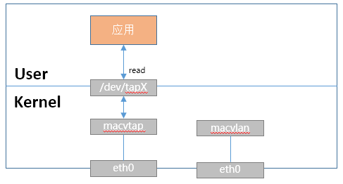
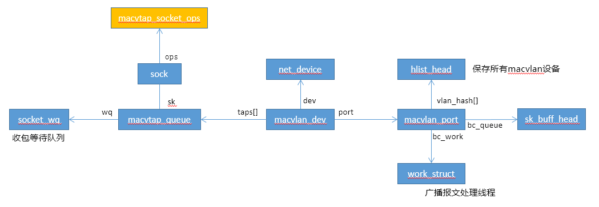

# MACVTAP

macvtap设备和macvlan设备非常类似， 但是macvtap设备会创建tap设备，可以通过该tap设备和macvtap进行收发包处理。



## 数据结构



```C
static struct rtnl_link_ops macvtap_link_ops __read_mostly = {
	.kind		= "macvtap",
	.setup		= macvtap_setup,
	.newlink	= macvtap_newlink,
	.dellink	= macvtap_dellink,
};

//使用了macvlan设备相同的驱动
static const struct net_device_ops macvlan_netdev_ops = {
	.ndo_init		= macvlan_init,
	.ndo_uninit		= macvlan_uninit,
	.ndo_open		= macvlan_open,
	.ndo_stop		= macvlan_stop,
	.ndo_start_xmit		= macvlan_start_xmit,
	.ndo_change_mtu		= macvlan_change_mtu,
	.ndo_fix_features	= macvlan_fix_features,
	.ndo_change_rx_flags	= macvlan_change_rx_flags,
	.ndo_set_mac_address	= macvlan_set_mac_address,
	.ndo_set_rx_mode	= macvlan_set_mac_lists,
	.ndo_get_stats64	= macvlan_dev_get_stats64,
	.ndo_validate_addr	= eth_validate_addr,
	.ndo_vlan_rx_add_vid	= macvlan_vlan_rx_add_vid,
	.ndo_vlan_rx_kill_vid	= macvlan_vlan_rx_kill_vid,
	.ndo_fdb_add		= macvlan_fdb_add,
	.ndo_fdb_del		= macvlan_fdb_del,
	.ndo_fdb_dump		= ndo_dflt_fdb_dump,
	.ndo_get_lock_subclass  = macvlan_get_nest_level,
#ifdef CONFIG_NET_POLL_CONTROLLER
	.ndo_poll_controller	= macvlan_dev_poll_controller,
	.ndo_netpoll_setup	= macvlan_dev_netpoll_setup,
	.ndo_netpoll_cleanup	= macvlan_dev_netpoll_cleanup,
#endif
	.ndo_get_iflink		= macvlan_dev_get_iflink,
};

//设备文件操作
static const struct file_operations macvtap_fops = {
	.owner		= THIS_MODULE,
	.open		= macvtap_open,
	.release	= macvtap_release,
	.read_iter	= macvtap_read_iter,
	.write_iter	= macvtap_write_iter,
	.poll		= macvtap_poll,
	.llseek		= no_llseek,
	.unlocked_ioctl	= macvtap_ioctl,
#ifdef CONFIG_COMPAT
	.compat_ioctl	= macvtap_compat_ioctl,
#endif
};

//socket ops
static const struct proto_ops macvtap_socket_ops = {
	.sendmsg = macvtap_sendmsg,
	.recvmsg = macvtap_recvmsg,
};
```


## 模块初始化

```c
static int macvtap_init(void)
{
	int err;

	err = alloc_chrdev_region(&macvtap_major, 0,
				MACVTAP_NUM_DEVS, "macvtap");
	if (err)
		goto out1;

	cdev_init(&macvtap_cdev, &macvtap_fops);
	err = cdev_add(&macvtap_cdev, macvtap_major, MACVTAP_NUM_DEVS);
	if (err)
		goto out2;

	macvtap_class = class_create(THIS_MODULE, "macvtap");
	if (IS_ERR(macvtap_class)) {
		err = PTR_ERR(macvtap_class);
		goto out3;
	}

	err = register_netdevice_notifier(&macvtap_notifier_block);  //注册设备notifier
	if (err)
		goto out4;

	err = macvlan_link_register(&macvtap_link_ops);
	if (err)
		goto out5;

	return 0;

out5:
	unregister_netdevice_notifier(&macvtap_notifier_block);
out4:
	class_unregister(macvtap_class);
out3:
	cdev_del(&macvtap_cdev);
out2:
	unregister_chrdev_region(macvtap_major, MACVTAP_NUM_DEVS);
out1:
	return err;
}
```

## macvtap设备创建

macvlan设备的创建入口为rtnl_newlink函数（虚拟网卡创建入口），根据调用顺序来分析各个函数：

1. rtnl_link_ops->validate（根据type找到rtnl_link_ops，校验输入参数）  //未定义
2. rtnl_link_ops->setup（设备初始化，默认初始化）
3. rtnl_link_ops->newlink（创建设备，一般会有如下两个操作）
4. dev->netdev_ops->ndo_init（设备初始化）
5. dev->netdev_ops->ndo_validate_addr（设备地址校验）
6. dev->netdev_ops->ndo_open（打开设备）

### setup(macvtap_setup)

```c
static void macvtap_setup(struct net_device *dev)
{
	macvlan_common_setup(dev);          //使用macvlan设备的setup
	dev->tx_queue_len = TUN_READQ_SIZE;
}

void macvlan_common_setup(struct net_device *dev)
{
	ether_setup(dev);  //通用以太网网络设备初始化

	dev->priv_flags	       &= ~IFF_TX_SKB_SHARING;
	netif_keep_dst(dev);
	dev->priv_flags	       |= IFF_UNICAST_FLT;
	dev->netdev_ops		= &macvlan_netdev_ops;   //设置驱动，使用macvlan的驱动
	dev->destructor		= free_netdev;
	dev->header_ops		= &macvlan_hard_header_ops;	 //刷新mac头构造函数
	dev->ethtool_ops	= &macvlan_ethtool_ops;
}
```

### newlink(macvtap_newlink)

```c
static int macvtap_newlink(struct net *src_net,
			   struct net_device *dev,
			   struct nlattr *tb[],
			   struct nlattr *data[])
{
	struct macvlan_dev *vlan = netdev_priv(dev);
	int err;

	INIT_LIST_HEAD(&vlan->queue_list);

	/* Since macvlan supports all offloads by default, make
	 * tap support all offloads also.
	 */
	vlan->tap_features = TUN_OFFLOADS;

	//注册macvtap设备的收包处理函数
	err = netdev_rx_handler_register(dev, macvtap_handle_frame, vlan);  
	if (err)
		return err;

	/* Don't put anything that may fail after macvlan_common_newlink
	 * because we can't undo what it does.
	 */
	return macvlan_common_newlink(src_net, dev, tb, data);   //调用macvlan的newlink函数
}
```

### 设备创建后回调

回调函数中，会创建tap设备

```c
static int macvtap_device_event(struct notifier_block *unused,
				unsigned long event, void *ptr)
{
	struct net_device *dev = netdev_notifier_info_to_dev(ptr);
	struct macvlan_dev *vlan;
	struct device *classdev;
	dev_t devt;
	int err;

	if (dev->rtnl_link_ops != &macvtap_link_ops)   
		return NOTIFY_DONE;

	vlan = netdev_priv(dev);   //当前为macvtap设备

	switch (event) {
	case NETDEV_REGISTER:
		/* Create the device node here after the network device has
		 * been registered but before register_netdevice has
		 * finished running.
		 */
		err = macvtap_get_minor(vlan);   //得到minor号
		if (err)
			return notifier_from_errno(err);

		devt = MKDEV(MAJOR(macvtap_major), vlan->minor);
		//创建tap设备，可以通过该设备和macvtap设备进行收发包处理
		classdev = device_create(macvtap_class, &dev->dev, devt,   
					 dev, "tap%d", dev->ifindex);
		if (IS_ERR(classdev)) {
			macvtap_free_minor(vlan);
			return notifier_from_errno(PTR_ERR(classdev));
		}
		break;
	case NETDEV_UNREGISTER:
		devt = MKDEV(MAJOR(macvtap_major), vlan->minor);
		device_destroy(macvtap_class, devt);
		macvtap_free_minor(vlan);
		break;
	}

	return NOTIFY_DONE;
}
```


## macvtap收包处理

macvtap设备底层收包处理函数，也是调用macvlan_handle_frame进行收包，而macvlan设备设备收包后直接进入协议栈，而macvtap设备注册了rx_handler函数。

```c
static rx_handler_result_t macvtap_handle_frame(struct sk_buff **pskb)
{
	struct sk_buff *skb = *pskb;
	struct net_device *dev = skb->dev;
	struct macvlan_dev *vlan;
	struct macvtap_queue *q;
	netdev_features_t features = TAP_FEATURES;

	vlan = macvtap_get_vlan_rcu(dev);
	if (!vlan)
		return RX_HANDLER_PASS;

	q = macvtap_get_queue(dev, skb);   //得到macvtap_queue，如果为空，说明对应的tap设备未打开
	if (!q)
		return RX_HANDLER_PASS;

	if (skb_queue_len(&q->sk.sk_receive_queue) >= dev->tx_queue_len)
		goto drop;

	skb_push(skb, ETH_HLEN);	//skb指向mac头，说明tap是二层设备

	/* Apply the forward feature mask so that we perform segmentation
	 * according to users wishes.  This only works if VNET_HDR is
	 * enabled.
	 */
	if (q->flags & IFF_VNET_HDR)
		features |= vlan->tap_features;
	if (netif_needs_gso(skb, features)) {
		struct sk_buff *segs = __skb_gso_segment(skb, features, false);

		if (IS_ERR(segs))
			goto drop;

		if (!segs) {
			skb_queue_tail(&q->sk.sk_receive_queue, skb);
			goto wake_up;
		}

		kfree_skb(skb);
		while (segs) {
			struct sk_buff *nskb = segs->next;

			segs->next = NULL;
			skb_queue_tail(&q->sk.sk_receive_queue, segs);
			segs = nskb;
		}
	} else {
		/* If we receive a partial checksum and the tap side
		 * doesn't support checksum offload, compute the checksum.
		 * Note: it doesn't matter which checksum feature to
		 *        check, we either support them all or none.
		 */
		if (skb->ip_summed == CHECKSUM_PARTIAL &&
		    !(features & NETIF_F_ALL_CSUM) &&
		    skb_checksum_help(skb))
			goto drop;
		skb_queue_tail(&q->sk.sk_receive_queue, skb);    //报文添加到sk的接收队列中
	}

wake_up:
	wake_up_interruptible_poll(sk_sleep(&q->sk), POLLIN | POLLRDNORM | POLLRDBAND);
	return RX_HANDLER_CONSUMED;

drop:
	/* Count errors/drops only here, thus don't care about args. */
	macvlan_count_rx(vlan, 0, 0, 0);
	kfree_skb(skb);
	return RX_HANDLER_CONSUMED;
}
```

## macvtap发包

调用macvlan设备的发包函数：

* 从底层设备发包
* macvtap设备收包 


## tap设备 open

```c
static int macvtap_open(struct inode *inode, struct file *file)
{
	struct net *net = current->nsproxy->net_ns;
	struct net_device *dev;
	struct macvtap_queue *q;
	int err = -ENODEV;

	rtnl_lock();
	dev = dev_get_by_macvtap_minor(iminor(inode));   //该dev为macvtap设备
	if (!dev)
		goto out;

	err = -ENOMEM;
	q = (struct macvtap_queue *)sk_alloc(net, AF_UNSPEC, GFP_KERNEL,
					     &macvtap_proto);
	if (!q)
		goto out;

	RCU_INIT_POINTER(q->sock.wq, &q->wq);
	init_waitqueue_head(&q->wq.wait);
	q->sock.type = SOCK_RAW;
	q->sock.state = SS_CONNECTED;
	q->sock.file = file;
	q->sock.ops = &macvtap_socket_ops;
	sock_init_data(&q->sock, &q->sk);
	q->sk.sk_write_space = macvtap_sock_write_space;
	q->sk.sk_destruct = macvtap_sock_destruct;
	q->flags = IFF_VNET_HDR | IFF_NO_PI | IFF_TAP;	//设置了IFF_VNET_HDR，意味着发送数据时需要设置mac头
	q->vnet_hdr_sz = sizeof(struct virtio_net_hdr);

	/*
	 * so far only KVM virtio_net uses macvtap, enable zero copy between
	 * guest kernel and host kernel when lower device supports zerocopy
	 *
	 * The macvlan supports zerocopy iff the lower device supports zero
	 * copy so we don't have to look at the lower device directly.
	 */
	if ((dev->features & NETIF_F_HIGHDMA) && (dev->features & NETIF_F_SG))
		sock_set_flag(&q->sk, SOCK_ZEROCOPY);

	err = macvtap_set_queue(dev, file, q);   //设置队列后，macvtap收包时会保存到sk的收包队列中
	if (err)
		sock_put(&q->sk);

out:
	if (dev)
		dev_put(dev);

	rtnl_unlock();
	return err;
}
```


## tap设备 收包

```c
static ssize_t macvtap_read_iter(struct kiocb *iocb, struct iov_iter *to)
{
	struct file *file = iocb->ki_filp;
	struct macvtap_queue *q = file->private_data;
	ssize_t len = iov_iter_count(to), ret;

	ret = macvtap_do_read(q, to, file->f_flags & O_NONBLOCK);  //收包
	ret = min_t(ssize_t, ret, len);
	if (ret > 0)
		iocb->ki_pos = ret;
	return ret;
}

static ssize_t macvtap_do_read(struct macvtap_queue *q,
			       struct iov_iter *to,
			       int noblock)
{
	DEFINE_WAIT(wait);
	struct sk_buff *skb;
	ssize_t ret = 0;

	if (!iov_iter_count(to))
		return 0;

	while (1) {
		if (!noblock)
			prepare_to_wait(sk_sleep(&q->sk), &wait,   //添加到等待队列中
					TASK_INTERRUPTIBLE);

		/* Read frames from the queue */
		skb = skb_dequeue(&q->sk.sk_receive_queue);   //从sk的收包队列中收包
		if (skb)
			break;
		if (noblock) {
			ret = -EAGAIN;
			break;
		}
		if (signal_pending(current)) {
			ret = -ERESTARTSYS;
			break;
		}
		/* Nothing to read, let's sleep */
		schedule();
	}
	if (skb) {
		ret = macvtap_put_user(q, skb, to);   //拷贝到用户态
		if (unlikely(ret < 0))
			kfree_skb(skb);
		else
			consume_skb(skb);
	}
	if (!noblock)
		finish_wait(sk_sleep(&q->sk), &wait);
	return ret;
}

static ssize_t macvtap_put_user(struct macvtap_queue *q,
				const struct sk_buff *skb,
				struct iov_iter *iter)
{
	int ret;
	int vnet_hdr_len = 0;
	int vlan_offset = 0;
	int total;

	if (q->flags & IFF_VNET_HDR) {
		struct virtio_net_hdr vnet_hdr;
		vnet_hdr_len = q->vnet_hdr_sz;
		if (iov_iter_count(iter) < vnet_hdr_len)
			return -EINVAL;

		macvtap_skb_to_vnet_hdr(q, skb, &vnet_hdr);

		if (copy_to_iter(&vnet_hdr, sizeof(vnet_hdr), iter) !=
		    sizeof(vnet_hdr))
			return -EFAULT;

		iov_iter_advance(iter, vnet_hdr_len - sizeof(vnet_hdr));
	}
	total = vnet_hdr_len;
	total += skb->len;

	if (skb_vlan_tag_present(skb)) {
		struct {
			__be16 h_vlan_proto;
			__be16 h_vlan_TCI;
		} veth;
		veth.h_vlan_proto = skb->vlan_proto;
		veth.h_vlan_TCI = htons(skb_vlan_tag_get(skb));

		vlan_offset = offsetof(struct vlan_ethhdr, h_vlan_proto);
		total += VLAN_HLEN;

		ret = skb_copy_datagram_iter(skb, 0, iter, vlan_offset);
		if (ret || !iov_iter_count(iter))
			goto done;

		ret = copy_to_iter(&veth, sizeof(veth), iter);
		if (ret != sizeof(veth) || !iov_iter_count(iter))
			goto done;
	}

	ret = skb_copy_datagram_iter(skb, vlan_offset, iter,
				     skb->len - vlan_offset);

done:
	return ret ? ret : total;
}
```

## tap设备 发包


```c
static ssize_t macvtap_write_iter(struct kiocb *iocb, struct iov_iter *from)
{
	struct file *file = iocb->ki_filp;
	struct macvtap_queue *q = file->private_data;

	return macvtap_get_user(q, NULL, from, file->f_flags & O_NONBLOCK);
}

static ssize_t macvtap_get_user(struct macvtap_queue *q, struct msghdr *m,
				struct iov_iter *from, int noblock)
{
	int good_linear = SKB_MAX_HEAD(MACVTAP_RESERVE);
	struct sk_buff *skb;
	struct macvlan_dev *vlan;
	unsigned long total_len = iov_iter_count(from);
	unsigned long len = total_len;
	int err;
	struct virtio_net_hdr vnet_hdr = { 0 };
	int vnet_hdr_len = 0;
	int copylen = 0;
	bool zerocopy = false;
	size_t linear;
	ssize_t n;

	if (q->flags & IFF_VNET_HDR) {
		vnet_hdr_len = q->vnet_hdr_sz;

		err = -EINVAL;
		if (len < vnet_hdr_len)
			goto err;
		len -= vnet_hdr_len;

		err = -EFAULT;
		n = copy_from_iter(&vnet_hdr, sizeof(vnet_hdr), from);
		if (n != sizeof(vnet_hdr))
			goto err;
		iov_iter_advance(from, vnet_hdr_len - sizeof(vnet_hdr));
		if ((vnet_hdr.flags & VIRTIO_NET_HDR_F_NEEDS_CSUM) &&
		     macvtap16_to_cpu(q, vnet_hdr.csum_start) +
		     macvtap16_to_cpu(q, vnet_hdr.csum_offset) + 2 >
			     macvtap16_to_cpu(q, vnet_hdr.hdr_len))
			vnet_hdr.hdr_len = cpu_to_macvtap16(q,
				 macvtap16_to_cpu(q, vnet_hdr.csum_start) +
				 macvtap16_to_cpu(q, vnet_hdr.csum_offset) + 2);
		err = -EINVAL;
		if (macvtap16_to_cpu(q, vnet_hdr.hdr_len) > len)
			goto err;
	}

	err = -EINVAL;
	if (unlikely(len < ETH_HLEN))
		goto err;

	if (m && m->msg_control && sock_flag(&q->sk, SOCK_ZEROCOPY)) {
		struct iov_iter i;

		copylen = vnet_hdr.hdr_len ?
			macvtap16_to_cpu(q, vnet_hdr.hdr_len) : GOODCOPY_LEN;
		if (copylen > good_linear)
			copylen = good_linear;
		linear = copylen;
		i = *from;
		iov_iter_advance(&i, copylen);
		if (iov_iter_npages(&i, INT_MAX) <= MAX_SKB_FRAGS)
			zerocopy = true;
	}

	if (!zerocopy) {
		copylen = len;
		if (macvtap16_to_cpu(q, vnet_hdr.hdr_len) > good_linear)
			linear = good_linear;
		else
			linear = macvtap16_to_cpu(q, vnet_hdr.hdr_len);
	}

	skb = macvtap_alloc_skb(&q->sk, MACVTAP_RESERVE, copylen,	//分配skb对象
				linear, noblock, &err);
	if (!skb)
		goto err;

	if (zerocopy)
		err = zerocopy_sg_from_iter(skb, from);		//零拷贝数据
	else {
		err = skb_copy_datagram_from_iter(skb, 0, from, len);	//拷贝数据
		if (!err && m && m->msg_control) {
			struct ubuf_info *uarg = m->msg_control;
			uarg->callback(uarg, false);
		}
	}

	if (err)
		goto err_kfree;

	skb_set_network_header(skb, ETH_HLEN);		//设置IP头 header
	skb_reset_mac_header(skb);			//设置mac头 header，当前skb指向mac头
	skb->protocol = eth_hdr(skb)->h_proto;

	if (vnet_hdr_len) {
		err = macvtap_skb_from_vnet_hdr(q, skb, &vnet_hdr);	//设置skb的gso等属性
		if (err)
			goto err_kfree;
	}

	skb_probe_transport_header(skb, ETH_HLEN);

	rcu_read_lock();
	vlan = rcu_dereference(q->vlan);
	/* copy skb_ubuf_info for callback when skb has no error */
	if (zerocopy) {
		skb_shinfo(skb)->destructor_arg = m->msg_control;
		skb_shinfo(skb)->tx_flags |= SKBTX_DEV_ZEROCOPY;
		skb_shinfo(skb)->tx_flags |= SKBTX_SHARED_FRAG;
	}
	if (vlan) {
		skb->dev = vlan->dev;		//macvlan设备
		dev_queue_xmit(skb);		//发送报文
	} else {
		kfree_skb(skb);
	}
	rcu_read_unlock();

	return total_len;

err_kfree:
	kfree_skb(skb);

err:
	rcu_read_lock();
	vlan = rcu_dereference(q->vlan);
	if (vlan)
		this_cpu_inc(vlan->pcpu_stats->tx_dropped);
	rcu_read_unlock();

	return err;
}
```


