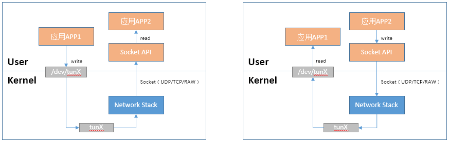
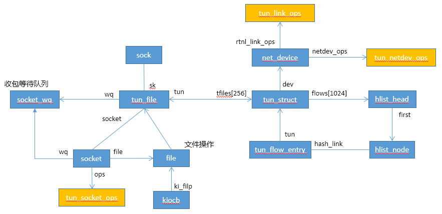

# TUN/TAP

TUN设备和TAP设备类似，只是前者是以太网三层设备，后者是以太网二层设备。 通过该设备用户态程序可以和内核协议栈之间进行二层/三层报文通信。



## 数据结构



```C
static struct rtnl_link_ops tun_link_ops __read_mostly = {
	.kind		= DRV_NAME,
	.priv_size	= sizeof(struct tun_struct),
	.setup		= tun_setup,
	.validate	= tun_validate,
};

static const struct net_device_ops tun_netdev_ops = {
	.ndo_uninit		= tun_net_uninit,
	.ndo_open		= tun_net_open,
	.ndo_stop		= tun_net_close,
	.ndo_start_xmit		= tun_net_xmit,
	.ndo_change_mtu		= tun_net_change_mtu,
	.ndo_fix_features	= tun_net_fix_features,
	.ndo_select_queue	= tun_select_queue,
#ifdef CONFIG_NET_POLL_CONTROLLER
	.ndo_poll_controller	= tun_poll_controller,
#endif
};

static const struct net_device_ops tap_netdev_ops = {
	.ndo_uninit		= tun_net_uninit,
	.ndo_open		= tun_net_open,
	.ndo_stop		= tun_net_close,
	.ndo_start_xmit		= tun_net_xmit,
	.ndo_change_mtu		= tun_net_change_mtu,
	.ndo_fix_features	= tun_net_fix_features,
	.ndo_set_rx_mode	= tun_net_mclist,
	.ndo_set_mac_address	= eth_mac_addr,
	.ndo_validate_addr	= eth_validate_addr,
	.ndo_select_queue	= tun_select_queue,
#ifdef CONFIG_NET_POLL_CONTROLLER
	.ndo_poll_controller	= tun_poll_controller,
#endif
};

//设备文件操作
static const struct file_operations tun_fops = {
	.owner	= THIS_MODULE,
	.llseek = no_llseek,
	.read_iter  = tun_chr_read_iter,
	.write_iter = tun_chr_write_iter,
	.poll	= tun_chr_poll,
	.unlocked_ioctl	= tun_chr_ioctl,
#ifdef CONFIG_COMPAT
	.compat_ioctl = tun_chr_compat_ioctl,
#endif
	.open	= tun_chr_open,
	.release = tun_chr_close,
	.fasync = tun_chr_fasync,
#ifdef CONFIG_PROC_FS
	.show_fdinfo = tun_chr_show_fdinfo,
#endif
};

static const struct ethtool_ops tun_ethtool_ops = {
	.get_settings	= tun_get_settings,
	.get_drvinfo	= tun_get_drvinfo,
	.get_msglevel	= tun_get_msglevel,
	.set_msglevel	= tun_set_msglevel,
	.get_link	= ethtool_op_get_link,
	.get_ts_info	= ethtool_op_get_ts_info,
};

static struct miscdevice tun_miscdev = {
	.minor = TUN_MINOR,
	.name = "tun",
	.nodename = "net/tun",
	.fops = &tun_fops,
};
```


## 模块初始化

```c
static int __init tun_init(void)
{
	int ret = 0;

	pr_info("%s, %s\n", DRV_DESCRIPTION, DRV_VERSION);
	pr_info("%s\n", DRV_COPYRIGHT);

	ret = rtnl_link_register(&tun_link_ops);  //注册link ops
	if (ret) {
		pr_err("Can't register link_ops\n");
		goto err_linkops;
	}

	ret = misc_register(&tun_miscdev);   //混杂设备注册
	if (ret) {
		pr_err("Can't register misc device %d\n", TUN_MINOR);
		goto err_misc;
	}
	return  0;
err_misc:
	rtnl_link_unregister(&tun_link_ops);
err_linkops:
	return ret;
}
```

## 用户态创建tun/tap设备

```c
#include <linux /if.h>
#include <linux /if_tun.h>

int tun_alloc(char *dev, int flags) {

	struct ifreq ifr;
	int fd, err;
	char *clonedev = "/dev/net/tun";

	/* Arguments taken by the function:
	*
	* char *dev: the name of an interface (or '\0'). MUST have enough
	*   space to hold the interface name if '\0' is passed
	* int flags: interface flags (eg, IFF_TUN etc.)
	*/

	/* open the clone device */
	if ((fd = open(clonedev, O_RDWR)) < 0) {   //打开设备
		return fd;
	}

	/* preparation of the struct ifr, of type "struct ifreq" */
	memset(&ifr, 0, sizeof(ifr));

	ifr.ifr_flags = flags;   /* IFF_TUN or IFF_TAP, plus maybe IFF_NO_PI */

	if (*dev) {
		/* if a device name was specified, put it in the structure; otherwise,
		* the kernel will try to allocate the "next" device of the
		* specified type */
		strncpy(ifr.ifr_name, dev, IFNAMSIZ);
	}

	/* try to create the device */
	if ((err = ioctl(fd, TUNSETIFF, (void *)&ifr)) < 0) {   //ioctl操作，创建设备
		close(fd);
		return err;
	}

	/* if the operation was successful, write back the name of the
	* interface to the variable "dev", so the caller can know
	* it. Note that the caller MUST reserve space in *dev (see calling
	* code below) */
	strcpy(dev, ifr.ifr_name);

	/* this is the special file descriptor that the caller will use to talk
	* with the virtual interface */
	return fd;
}
```


## tun/tap设备打开

```c
static int tun_chr_open(struct inode *inode, struct file * file)
{
	struct tun_file *tfile;

	DBG1(KERN_INFO, "tunX: tun_chr_open\n");

	tfile = (struct tun_file *)sk_alloc(&init_net, AF_UNSPEC, GFP_KERNEL,  //创建sock
					    &tun_proto);
	if (!tfile)
		return -ENOMEM;
	RCU_INIT_POINTER(tfile->tun, NULL);
	tfile->net = get_net(current->nsproxy->net_ns);
	tfile->flags = 0;
	tfile->ifindex = 0;

	init_waitqueue_head(&tfile->wq.wait);   //初始化等待队列
	RCU_INIT_POINTER(tfile->socket.wq, &tfile->wq);

	tfile->socket.file = file;
	tfile->socket.ops = &tun_socket_ops;   //设置socket ops

	sock_init_data(&tfile->socket, &tfile->sk);
	sk_change_net(&tfile->sk, tfile->net);

	tfile->sk.sk_write_space = tun_sock_write_space;
	tfile->sk.sk_sndbuf = INT_MAX;

	file->private_data = tfile;   //文件句柄私有数据保存tun_file对象指针
	set_bit(SOCK_EXTERNALLY_ALLOCATED, &tfile->socket.flags);
	INIT_LIST_HEAD(&tfile->next);

	sock_set_flag(&tfile->sk, SOCK_ZEROCOPY);

	return 0;
}
```

### ioctl创建tun/tap设备

```c
static long tun_chr_ioctl(struct file *file,
			  unsigned int cmd, unsigned long arg)
{
	return __tun_chr_ioctl(file, cmd, arg, sizeof (struct ifreq));
}

static long __tun_chr_ioctl(struct file *file, unsigned int cmd,
			    unsigned long arg, int ifreq_len)
{
	struct tun_file *tfile = file->private_data;   //得到私有数据
	struct tun_struct *tun;
	void __user* argp = (void __user*)arg;
	struct ifreq ifr;
	kuid_t owner;
	kgid_t group;
	int sndbuf;
	int vnet_hdr_sz;
	unsigned int ifindex;
	int le;
	int ret;

	if (cmd == TUNSETIFF || cmd == TUNSETQUEUE || _IOC_TYPE(cmd) == 0x89) {
		if (copy_from_user(&ifr, argp, ifreq_len))   //拷贝参数
			return -EFAULT;
	} else {
		memset(&ifr, 0, sizeof(ifr));
	}
	if (cmd == TUNGETFEATURES) {
		/* Currently this just means: "what IFF flags are valid?".
		 * This is needed because we never checked for invalid flags on
		 * TUNSETIFF.
		 */
		return put_user(IFF_TUN | IFF_TAP | TUN_FEATURES,
				(unsigned int __user*)argp);
	} else if (cmd == TUNSETQUEUE)
		return tun_set_queue(file, &ifr);

	ret = 0;
	rtnl_lock();

	tun = __tun_get(tfile);   //得到tun设备
	if (cmd == TUNSETIFF && !tun) {     //tun设备未创建
		ifr.ifr_name[IFNAMSIZ-1] = '\0';

		ret = tun_set_iff(tfile->net, file, &ifr);    //创建tun设备

		if (ret)
			goto unlock;

		if (copy_to_user(argp, &ifr, ifreq_len))
			ret = -EFAULT;
		goto unlock;
	}
	if (cmd == TUNSETIFINDEX) {
		ret = -EPERM;
		if (tun)
			goto unlock;

		ret = -EFAULT;
		if (copy_from_user(&ifindex, argp, sizeof(ifindex)))
			goto unlock;

		ret = 0;
		tfile->ifindex = ifindex;
		goto unlock;
	}

	ret = -EBADFD;
	if (!tun)
		goto unlock;

	tun_debug(KERN_INFO, tun, "tun_chr_ioctl cmd %u\n", cmd);

	ret = 0;
	switch (cmd) {   //根据命令进行处理
	case TUNGETIFF:
		tun_get_iff(current->nsproxy->net_ns, tun, &ifr);

		if (tfile->detached)
			ifr.ifr_flags |= IFF_DETACH_QUEUE;
		if (!tfile->socket.sk->sk_filter)
			ifr.ifr_flags |= IFF_NOFILTER;

		if (copy_to_user(argp, &ifr, ifreq_len))
			ret = -EFAULT;
		break;

	case TUNSETNOCSUM:
		/* Disable/Enable checksum */

		/* [unimplemented] */
		tun_debug(KERN_INFO, tun, "ignored: set checksum %s\n",
			  arg ? "disabled" : "enabled");
		break;

	case TUNSETPERSIST:
		/* Disable/Enable persist mode. Keep an extra reference to the
		 * module to prevent the module being unprobed.
		 */
		if (arg && !(tun->flags & IFF_PERSIST)) {
			tun->flags |= IFF_PERSIST;
			__module_get(THIS_MODULE);
		}
		if (!arg && (tun->flags & IFF_PERSIST)) {
			tun->flags &= ~IFF_PERSIST;
			module_put(THIS_MODULE);
		}

		tun_debug(KERN_INFO, tun, "persist %s\n",
			  arg ? "enabled" : "disabled");
		break;

	case TUNSETOWNER:
		/* Set owner of the device */
		owner = make_kuid(current_user_ns(), arg);
		if (!uid_valid(owner)) {
			ret = -EINVAL;
			break;
		}
		tun->owner = owner;
		tun_debug(KERN_INFO, tun, "owner set to %u\n",
			  from_kuid(&init_user_ns, tun->owner));
		break;

	case TUNSETGROUP:
		/* Set group of the device */
		group = make_kgid(current_user_ns(), arg);
		if (!gid_valid(group)) {
			ret = -EINVAL;
			break;
		}
		tun->group = group;
		tun_debug(KERN_INFO, tun, "group set to %u\n",
			  from_kgid(&init_user_ns, tun->group));
		break;

	case TUNSETLINK:
		/* Only allow setting the type when the interface is down */
		if (tun->dev->flags & IFF_UP) {
			tun_debug(KERN_INFO, tun,
				  "Linktype set failed because interface is up\n");
			ret = -EBUSY;
		} else {
			tun->dev->type = (int) arg;
			tun_debug(KERN_INFO, tun, "linktype set to %d\n",
				  tun->dev->type);
			ret = 0;
		}
		break;

#ifdef TUN_DEBUG
	case TUNSETDEBUG:
		tun->debug = arg;
		break;
#endif
	case TUNSETOFFLOAD:
		ret = set_offload(tun, arg);
		break;

	case TUNSETTXFILTER:
		/* Can be set only for TAPs */
		ret = -EINVAL;
		if ((tun->flags & TUN_TYPE_MASK) != IFF_TAP)
			break;
		ret = update_filter(&tun->txflt, (void __user *)arg);
		break;

	case SIOCGIFHWADDR:
		/* Get hw address */
		memcpy(ifr.ifr_hwaddr.sa_data, tun->dev->dev_addr, ETH_ALEN);
		ifr.ifr_hwaddr.sa_family = tun->dev->type;
		if (copy_to_user(argp, &ifr, ifreq_len))
			ret = -EFAULT;
		break;

	case SIOCSIFHWADDR:
		/* Set hw address */
		tun_debug(KERN_DEBUG, tun, "set hw address: %pM\n",
			  ifr.ifr_hwaddr.sa_data);

		ret = dev_set_mac_address(tun->dev, &ifr.ifr_hwaddr);
		break;

	case TUNGETSNDBUF:
		sndbuf = tfile->socket.sk->sk_sndbuf;
		if (copy_to_user(argp, &sndbuf, sizeof(sndbuf)))
			ret = -EFAULT;
		break;

	case TUNSETSNDBUF:
		if (copy_from_user(&sndbuf, argp, sizeof(sndbuf))) {
			ret = -EFAULT;
			break;
		}

		tun->sndbuf = sndbuf;
		tun_set_sndbuf(tun);
		break;

	case TUNGETVNETHDRSZ:
		vnet_hdr_sz = tun->vnet_hdr_sz;
		if (copy_to_user(argp, &vnet_hdr_sz, sizeof(vnet_hdr_sz)))
			ret = -EFAULT;
		break;

	case TUNSETVNETHDRSZ:
		if (copy_from_user(&vnet_hdr_sz, argp, sizeof(vnet_hdr_sz))) {
			ret = -EFAULT;
			break;
		}
		if (vnet_hdr_sz < (int)sizeof(struct virtio_net_hdr)) {
			ret = -EINVAL;
			break;
		}

		tun->vnet_hdr_sz = vnet_hdr_sz;
		break;

	case TUNGETVNETLE:
		le = !!(tun->flags & TUN_VNET_LE);
		if (put_user(le, (int __user *)argp))
			ret = -EFAULT;
		break;

	case TUNSETVNETLE:
		if (get_user(le, (int __user *)argp)) {
			ret = -EFAULT;
			break;
		}
		if (le)
			tun->flags |= TUN_VNET_LE;
		else
			tun->flags &= ~TUN_VNET_LE;
		break;

	case TUNATTACHFILTER:
		/* Can be set only for TAPs */
		ret = -EINVAL;
		if ((tun->flags & TUN_TYPE_MASK) != IFF_TAP)
			break;
		ret = -EFAULT;
		if (copy_from_user(&tun->fprog, argp, sizeof(tun->fprog)))
			break;

		ret = tun_attach_filter(tun);
		break;

	case TUNDETACHFILTER:
		/* Can be set only for TAPs */
		ret = -EINVAL;
		if ((tun->flags & TUN_TYPE_MASK) != IFF_TAP)
			break;
		ret = 0;
		tun_detach_filter(tun, tun->numqueues);
		break;

	case TUNGETFILTER:
		ret = -EINVAL;
		if ((tun->flags & TUN_TYPE_MASK) != IFF_TAP)
			break;
		ret = -EFAULT;
		if (copy_to_user(argp, &tun->fprog, sizeof(tun->fprog)))
			break;
		ret = 0;
		break;

	default:
		ret = -EINVAL;
		break;
	}

unlock:
	rtnl_unlock();
	if (tun)
		tun_put(tun);
	return ret;
}


static int tun_set_iff(struct net *net, struct file *file, struct ifreq *ifr)
{
	struct tun_struct *tun;
	struct tun_file *tfile = file->private_data;
	struct net_device *dev;
	int err;

	if (tfile->detached)
		return -EINVAL;

	dev = __dev_get_by_name(net, ifr->ifr_name);   //根据设备名查找设备
	if (dev) {
		if (ifr->ifr_flags & IFF_TUN_EXCL)
			return -EBUSY;
		if ((ifr->ifr_flags & IFF_TUN) && dev->netdev_ops == &tun_netdev_ops)
			tun = netdev_priv(dev);
		else if ((ifr->ifr_flags & IFF_TAP) && dev->netdev_ops == &tap_netdev_ops)
			tun = netdev_priv(dev);
		else
			return -EINVAL;

		if (!!(ifr->ifr_flags & IFF_MULTI_QUEUE) !=
		    !!(tun->flags & IFF_MULTI_QUEUE))
			return -EINVAL;

		if (tun_not_capable(tun))
			return -EPERM;
		err = security_tun_dev_open(tun->security);
		if (err < 0)
			return err;

		err = tun_attach(tun, file, ifr->ifr_flags & IFF_NOFILTER);
		if (err < 0)
			return err;

		if (tun->flags & IFF_MULTI_QUEUE &&
		    (tun->numqueues + tun->numdisabled > 1)) {
			/* One or more queue has already been attached, no need
			 * to initialize the device again.
			 */
			return 0;
		}
	}
	else {     //设备不存在
		char *name;
		unsigned long flags = 0;
		int queues = ifr->ifr_flags & IFF_MULTI_QUEUE ?    //设置队列数
			     MAX_TAP_QUEUES : 1;

		if (!ns_capable(net->user_ns, CAP_NET_ADMIN))
			return -EPERM;
		err = security_tun_dev_create();
		if (err < 0)
			return err;

		/* Set dev type */
		if (ifr->ifr_flags & IFF_TUN) {
			/* TUN device */
			flags |= IFF_TUN;
			name = "tun%d";
		} else if (ifr->ifr_flags & IFF_TAP) {
			/* TAP device */
			flags |= IFF_TAP;
			name = "tap%d";
		} else
			return -EINVAL;

		if (*ifr->ifr_name)
			name = ifr->ifr_name;

		dev = alloc_netdev_mqs(sizeof(struct tun_struct), name,   //创建设备
				       NET_NAME_UNKNOWN, tun_setup, queues,
				       queues);

		if (!dev)
			return -ENOMEM;

		dev_net_set(dev, net);
		dev->rtnl_link_ops = &tun_link_ops;
		dev->ifindex = tfile->ifindex;
		dev->sysfs_groups[0] = &tun_attr_group;

		tun = netdev_priv(dev);
		tun->dev = dev;
		tun->flags = flags;
		tun->txflt.count = 0;
		tun->vnet_hdr_sz = sizeof(struct virtio_net_hdr);   //报文发送时协议头长度（该头之后为真实报文数据）

		tun->filter_attached = false;
		tun->sndbuf = tfile->socket.sk->sk_sndbuf;

		spin_lock_init(&tun->lock);

		err = security_tun_dev_alloc_security(&tun->security);
		if (err < 0)
			goto err_free_dev;

		tun_net_init(dev);   //设置驱动
		tun_flow_init(tun);  //初始化流
		
		//设置offload属性
		dev->hw_features = NETIF_F_SG | NETIF_F_FRAGLIST |
				   TUN_USER_FEATURES | NETIF_F_HW_VLAN_CTAG_TX |
				   NETIF_F_HW_VLAN_STAG_TX;
		dev->features = dev->hw_features;
		dev->vlan_features = dev->features &
				     ~(NETIF_F_HW_VLAN_CTAG_TX |
				       NETIF_F_HW_VLAN_STAG_TX);

		INIT_LIST_HEAD(&tun->disabled);
		err = tun_attach(tun, file, false);    //tun设备挂载tfile，建立连接
		if (err < 0)
			goto err_free_flow;

		err = register_netdevice(tun->dev);    //注册tun设备
		if (err < 0)
			goto err_detach;
	}

	netif_carrier_on(tun->dev);   //设备up

	tun_debug(KERN_INFO, tun, "tun_set_iff\n");

	tun->flags = (tun->flags & ~TUN_FEATURES) |
		(ifr->ifr_flags & TUN_FEATURES);

	/* Make sure persistent devices do not get stuck in
	 * xoff state.
	 */
	if (netif_running(tun->dev))
		netif_tx_wake_all_queues(tun->dev);

	strcpy(ifr->ifr_name, tun->dev->name);
	return 0;

err_detach:
	tun_detach_all(dev);
err_free_flow:
	tun_flow_uninit(tun);
	security_tun_dev_free_security(tun->security);
err_free_dev:
	free_netdev(dev);
	return err;
}


static int tun_attach(struct tun_struct *tun, struct file *file, bool skip_filter)
{
	struct tun_file *tfile = file->private_data;
	int err;

	err = security_tun_dev_attach(tfile->socket.sk, tun->security);
	if (err < 0)
		goto out;

	err = -EINVAL;
	if (rtnl_dereference(tfile->tun) && !tfile->detached)
		goto out;

	err = -EBUSY;
	//如果非多队列，且已经有队列不允许再绑队列
	if (!(tun->flags & IFF_MULTI_QUEUE) && tun->numqueues == 1)  
		goto out;

	err = -E2BIG;
	if (!tfile->detached &&
	    tun->numqueues + tun->numdisabled == MAX_TAP_QUEUES)
		goto out;

	err = 0;

	/* Re-attach the filter to persist device */
	if (!skip_filter && (tun->filter_attached == true)) {
		err = sk_attach_filter(&tun->fprog, tfile->socket.sk);
		if (!err)
			goto out;
	}
	tfile->queue_index = tun->numqueues;     
	rcu_assign_pointer(tfile->tun, tun);     //设置tun设备
	rcu_assign_pointer(tun->tfiles[tun->numqueues], tfile);
	tun->numqueues++;

	if (tfile->detached)
		tun_enable_queue(tfile);
	else
		sock_hold(&tfile->sk);

	tun_set_real_num_queues(tun);

	/* device is allowed to go away first, so no need to hold extra
	 * refcnt.
	 */

out:
	return err;
}

static void tun_setup(struct net_device *dev)
{
	struct tun_struct *tun = netdev_priv(dev);

	tun->owner = INVALID_UID;
	tun->group = INVALID_GID;

	dev->ethtool_ops = &tun_ethtool_ops;
	dev->destructor = tun_free_netdev;
}

static void tun_net_init(struct net_device *dev)
{
	struct tun_struct *tun = netdev_priv(dev);

	switch (tun->flags & TUN_TYPE_MASK) {
	case IFF_TUN:
		dev->netdev_ops = &tun_netdev_ops;     //tun设备设置驱动

		/* Point-to-Point TUN Device */
		dev->hard_header_len = 0;
		dev->addr_len = 0;
		dev->mtu = 1500;

		/* Zero header length */
		dev->type = ARPHRD_NONE;
		dev->flags = IFF_POINTOPOINT | IFF_NOARP | IFF_MULTICAST;
		dev->tx_queue_len = TUN_READQ_SIZE;  /* We prefer our own queue length */
		break;

	case IFF_TAP:
		dev->netdev_ops = &tap_netdev_ops;
		/* Ethernet TAP Device */
		ether_setup(dev);            //以太网网卡设置
		dev->priv_flags &= ~IFF_TX_SKB_SHARING;
		dev->priv_flags |= IFF_LIVE_ADDR_CHANGE;

		eth_hw_addr_random(dev);

		dev->tx_queue_len = TUN_READQ_SIZE;  /* We prefer our own queue length */
		break;
	}
}

static void tun_flow_init(struct tun_struct *tun)
{
	int i;

	for (i = 0; i < TUN_NUM_FLOW_ENTRIES; i++)
		INIT_HLIST_HEAD(&tun->flows[i]);    //初始化flow链表

	tun->ageing_time = TUN_FLOW_EXPIRE;
	setup_timer(&tun->flow_gc_timer, tun_flow_cleanup, (unsigned long)tun);   //flow清理定时器
	mod_timer(&tun->flow_gc_timer,
		  round_jiffies_up(jiffies + tun->ageing_time));   //触发定时器
}
```


## tun/tap设备句柄 write

```c
static ssize_t tun_chr_write_iter(struct kiocb *iocb, struct iov_iter *from)
{
	struct file *file = iocb->ki_filp;
	struct tun_struct *tun = tun_get(file);
	struct tun_file *tfile = file->private_data;
	ssize_t result;

	if (!tun)
		return -EBADFD;

	result = tun_get_user(tun, tfile, NULL, from, file->f_flags & O_NONBLOCK);

	tun_put(tun);
	return result;
}

static ssize_t tun_get_user(struct tun_struct *tun, struct tun_file *tfile,
			    void *msg_control, struct iov_iter *from,
			    int noblock)
{
	struct tun_pi pi = { 0, cpu_to_be16(ETH_P_IP) };
	struct sk_buff *skb;
	size_t total_len = iov_iter_count(from);
	size_t len = total_len, align = NET_SKB_PAD, linear;
	struct virtio_net_hdr gso = { 0 };
	int good_linear;
	int copylen;
	bool zerocopy = false;
	int err;
	u32 rxhash;
	ssize_t n;

	if (!(tun->flags & IFF_NO_PI)) {
		if (len < sizeof(pi))
			return -EINVAL;
		len -= sizeof(pi);

		n = copy_from_iter(&pi, sizeof(pi), from);
		if (n != sizeof(pi))
			return -EFAULT;
	}

	if (tun->flags & IFF_VNET_HDR) {
		if (len < tun->vnet_hdr_sz)
			return -EINVAL;
		len -= tun->vnet_hdr_sz;

		n = copy_from_iter(&gso, sizeof(gso), from);
		if (n != sizeof(gso))
			return -EFAULT;

		if ((gso.flags & VIRTIO_NET_HDR_F_NEEDS_CSUM) &&
		    tun16_to_cpu(tun, gso.csum_start) + tun16_to_cpu(tun, gso.csum_offset) + 2 > tun16_to_cpu(tun, gso.hdr_len))
			gso.hdr_len = cpu_to_tun16(tun, tun16_to_cpu(tun, gso.csum_start) + tun16_to_cpu(tun, gso.csum_offset) + 2);

		if (tun16_to_cpu(tun, gso.hdr_len) > len)
			return -EINVAL;
		iov_iter_advance(from, tun->vnet_hdr_sz - sizeof(gso));
	}

	if ((tun->flags & TUN_TYPE_MASK) == IFF_TAP) {
		align += NET_IP_ALIGN;
		if (unlikely(len < ETH_HLEN ||
			     (gso.hdr_len && tun16_to_cpu(tun, gso.hdr_len) < ETH_HLEN)))
			return -EINVAL;
	}

	good_linear = SKB_MAX_HEAD(align);

	if (msg_control) {
		struct iov_iter i = *from;

		/* There are 256 bytes to be copied in skb, so there is
		 * enough room for skb expand head in case it is used.
		 * The rest of the buffer is mapped from userspace.
		 */
		copylen = gso.hdr_len ? tun16_to_cpu(tun, gso.hdr_len) : GOODCOPY_LEN;
		if (copylen > good_linear)
			copylen = good_linear;
		linear = copylen;
		iov_iter_advance(&i, copylen);
		if (iov_iter_npages(&i, INT_MAX) <= MAX_SKB_FRAGS)
			zerocopy = true;
	}

	if (!zerocopy) {
		copylen = len;
		if (tun16_to_cpu(tun, gso.hdr_len) > good_linear)
			linear = good_linear;
		else
			linear = tun16_to_cpu(tun, gso.hdr_len);
	}

	skb = tun_alloc_skb(tfile, align, copylen, linear, noblock); //创建skb对象
	if (IS_ERR(skb)) {
		if (PTR_ERR(skb) != -EAGAIN)
			tun->dev->stats.rx_dropped++;
		return PTR_ERR(skb);
	}

	if (zerocopy)
		err = zerocopy_sg_from_iter(skb, from);
	else {
		err = skb_copy_datagram_from_iter(skb, 0, from, len);
		if (!err && msg_control) {
			struct ubuf_info *uarg = msg_control;
			uarg->callback(uarg, false);
		}
	}

	if (err) {
		tun->dev->stats.rx_dropped++;
		kfree_skb(skb);
		return -EFAULT;
	}

	if (gso.flags & VIRTIO_NET_HDR_F_NEEDS_CSUM) {
		if (!skb_partial_csum_set(skb, tun16_to_cpu(tun, gso.csum_start),
					  tun16_to_cpu(tun, gso.csum_offset))) {
			tun->dev->stats.rx_frame_errors++;
			kfree_skb(skb);
			return -EINVAL;
		}
	}

	switch (tun->flags & TUN_TYPE_MASK) {
	case IFF_TUN:
		if (tun->flags & IFF_NO_PI) {
			switch (skb->data[0] & 0xf0) {
			case 0x40:
				pi.proto = htons(ETH_P_IP);
				break;
			case 0x60:
				pi.proto = htons(ETH_P_IPV6);
				break;
			default:
				tun->dev->stats.rx_dropped++;
				kfree_skb(skb);
				return -EINVAL;
			}
		}

		skb_reset_mac_header(skb);
		skb->protocol = pi.proto;
		skb->dev = tun->dev;         //tun设备收包
		break;
	case IFF_TAP:
		skb->protocol = eth_type_trans(skb, tun->dev);	//TAP设备有MAC头，需要剥除MAC头再上送协议栈，会检查mac头
		break;
	}

	if (gso.gso_type != VIRTIO_NET_HDR_GSO_NONE) {
		pr_debug("GSO!\n");
		switch (gso.gso_type & ~VIRTIO_NET_HDR_GSO_ECN) {
		case VIRTIO_NET_HDR_GSO_TCPV4:
			skb_shinfo(skb)->gso_type = SKB_GSO_TCPV4;
			break;
		case VIRTIO_NET_HDR_GSO_TCPV6:
			skb_shinfo(skb)->gso_type = SKB_GSO_TCPV6;
			break;
		case VIRTIO_NET_HDR_GSO_UDP:
			skb_shinfo(skb)->gso_type = SKB_GSO_UDP;
			break;
		default:
			tun->dev->stats.rx_frame_errors++;
			kfree_skb(skb);
			return -EINVAL;
		}

		if (gso.gso_type & VIRTIO_NET_HDR_GSO_ECN)
			skb_shinfo(skb)->gso_type |= SKB_GSO_TCP_ECN;

		skb_shinfo(skb)->gso_size = tun16_to_cpu(tun, gso.gso_size);
		if (skb_shinfo(skb)->gso_size == 0) {
			tun->dev->stats.rx_frame_errors++;
			kfree_skb(skb);
			return -EINVAL;
		}

		/* Header must be checked, and gso_segs computed. */
		skb_shinfo(skb)->gso_type |= SKB_GSO_DODGY;
		skb_shinfo(skb)->gso_segs = 0;
	}

	/* copy skb_ubuf_info for callback when skb has no error */
	if (zerocopy) {
		skb_shinfo(skb)->destructor_arg = msg_control;
		skb_shinfo(skb)->tx_flags |= SKBTX_DEV_ZEROCOPY;
		skb_shinfo(skb)->tx_flags |= SKBTX_SHARED_FRAG;
	}

	skb_reset_network_header(skb);
	skb_probe_transport_header(skb, 0);

	rxhash = skb_get_hash(skb);
	netif_rx_ni(skb);		//协议栈收包，tun设备没有mac头

	tun->dev->stats.rx_packets++;
	tun->dev->stats.rx_bytes += len;

	tun_flow_update(tun, rxhash, tfile);   //更新流
	return total_len;
}
```


## tun/tap设备句柄 read

```c
static ssize_t tun_chr_read_iter(struct kiocb *iocb, struct iov_iter *to)
{
	struct file *file = iocb->ki_filp;
	struct tun_file *tfile = file->private_data;
	struct tun_struct *tun = __tun_get(tfile);
	ssize_t len = iov_iter_count(to), ret;

	if (!tun)
		return -EBADFD;
	ret = tun_do_read(tun, tfile, to, file->f_flags & O_NONBLOCK);
	ret = min_t(ssize_t, ret, len);
	if (ret > 0)
		iocb->ki_pos = ret;
	tun_put(tun);
	return ret;
}

static ssize_t tun_do_read(struct tun_struct *tun, struct tun_file *tfile,
			   struct iov_iter *to,
			   int noblock)
{
	struct sk_buff *skb;
	ssize_t ret;
	int peeked, err, off = 0;

	tun_debug(KERN_INFO, tun, "tun_do_read\n");

	if (!iov_iter_count(to))
		return 0;

	if (tun->dev->reg_state != NETREG_REGISTERED)
		return -EIO;

	/* Read frames from queue */
	//从socket收包队列中收包
	skb = __skb_recv_datagram(tfile->socket.sk, noblock ? MSG_DONTWAIT : 0,	
				  &peeked, &off, &err);
	if (!skb)
		return err;

	ret = tun_put_user(tun, tfile, skb, to);	//拷贝skb到用户态
	if (unlikely(ret < 0))
		kfree_skb(skb);
	else
		consume_skb(skb);

	return ret;
}

static ssize_t tun_put_user(struct tun_struct *tun,
			    struct tun_file *tfile,
			    struct sk_buff *skb,
			    struct iov_iter *iter)
{
	struct tun_pi pi = { 0, skb->protocol };
	ssize_t total;
	int vlan_offset = 0;
	int vlan_hlen = 0;
	int vnet_hdr_sz = 0;

	if (skb_vlan_tag_present(skb))
		vlan_hlen = VLAN_HLEN;

	if (tun->flags & IFF_VNET_HDR)
		vnet_hdr_sz = tun->vnet_hdr_sz;

	total = skb->len + vlan_hlen + vnet_hdr_sz;

	if (!(tun->flags & IFF_NO_PI)) {
		if (iov_iter_count(iter) < sizeof(pi))
			return -EINVAL;

		total += sizeof(pi);
		if (iov_iter_count(iter) < total) {
			/* Packet will be striped */
			pi.flags |= TUN_PKT_STRIP;
		}

		if (copy_to_iter(&pi, sizeof(pi), iter) != sizeof(pi))
			return -EFAULT;
	}

	if (vnet_hdr_sz) {
		struct virtio_net_hdr gso = { 0 }; /* no info leak */
		if (iov_iter_count(iter) < vnet_hdr_sz)
			return -EINVAL;

		if (skb_is_gso(skb)) {
			struct skb_shared_info *sinfo = skb_shinfo(skb);

			/* This is a hint as to how much should be linear. */
			gso.hdr_len = cpu_to_tun16(tun, skb_headlen(skb));
			gso.gso_size = cpu_to_tun16(tun, sinfo->gso_size);
			if (sinfo->gso_type & SKB_GSO_TCPV4)
				gso.gso_type = VIRTIO_NET_HDR_GSO_TCPV4;
			else if (sinfo->gso_type & SKB_GSO_TCPV6)
				gso.gso_type = VIRTIO_NET_HDR_GSO_TCPV6;
			else if (sinfo->gso_type & SKB_GSO_UDP)
				gso.gso_type = VIRTIO_NET_HDR_GSO_UDP;
			else {
				pr_err("unexpected GSO type: "
				       "0x%x, gso_size %d, hdr_len %d\n",
				       sinfo->gso_type, tun16_to_cpu(tun, gso.gso_size),
				       tun16_to_cpu(tun, gso.hdr_len));
				print_hex_dump(KERN_ERR, "tun: ",
					       DUMP_PREFIX_NONE,
					       16, 1, skb->head,
					       min((int)tun16_to_cpu(tun, gso.hdr_len), 64), true);
				WARN_ON_ONCE(1);
				return -EINVAL;
			}
			if (sinfo->gso_type & SKB_GSO_TCP_ECN)
				gso.gso_type |= VIRTIO_NET_HDR_GSO_ECN;
		} else
			gso.gso_type = VIRTIO_NET_HDR_GSO_NONE;

		if (skb->ip_summed == CHECKSUM_PARTIAL) {
			gso.flags = VIRTIO_NET_HDR_F_NEEDS_CSUM;
			gso.csum_start = cpu_to_tun16(tun, skb_checksum_start_offset(skb) +
						      vlan_hlen);
			gso.csum_offset = cpu_to_tun16(tun, skb->csum_offset);
		} else if (skb->ip_summed == CHECKSUM_UNNECESSARY) {
			gso.flags = VIRTIO_NET_HDR_F_DATA_VALID;
		} /* else everything is zero */

		if (copy_to_iter(&gso, sizeof(gso), iter) != sizeof(gso))
			return -EFAULT;

		iov_iter_advance(iter, vnet_hdr_sz - sizeof(gso));
	}

	if (vlan_hlen) {
		int ret;
		struct {
			__be16 h_vlan_proto;
			__be16 h_vlan_TCI;
		} veth;

		veth.h_vlan_proto = skb->vlan_proto;
		veth.h_vlan_TCI = htons(skb_vlan_tag_get(skb));

		vlan_offset = offsetof(struct vlan_ethhdr, h_vlan_proto);

		ret = skb_copy_datagram_iter(skb, 0, iter, vlan_offset);
		if (ret || !iov_iter_count(iter))
			goto done;

		ret = copy_to_iter(&veth, sizeof(veth), iter);
		if (ret != sizeof(veth) || !iov_iter_count(iter))
			goto done;
	}

	skb_copy_datagram_iter(skb, vlan_offset, iter, skb->len - vlan_offset);

done:
	tun->dev->stats.tx_packets++;
	tun->dev->stats.tx_bytes += skb->len + vlan_hlen;

	return total;
}
```


## tun/tap设备驱动发包

```c
static netdev_tx_t tun_net_xmit(struct sk_buff *skb, struct net_device *dev)
{
	struct tun_struct *tun = netdev_priv(dev);
	int txq = skb->queue_mapping;
	struct tun_file *tfile;
	u32 numqueues = 0;

	rcu_read_lock();
	tfile = rcu_dereference(tun->tfiles[txq]);   //得到tfile
	numqueues = ACCESS_ONCE(tun->numqueues);

	/* Drop packet if interface is not attached */
	if (txq >= numqueues)
		goto drop;

	if (numqueues == 1) {
		/* Select queue was not called for the skbuff, so we extract the
		 * RPS hash and save it into the flow_table here.
		 */
		__u32 rxhash;

		rxhash = skb_get_hash(skb);
		if (rxhash) {
			struct tun_flow_entry *e;
			e = tun_flow_find(&tun->flows[tun_hashfn(rxhash)],
					rxhash);
			if (e)
				tun_flow_save_rps_rxhash(e, rxhash);
		}
	}

	tun_debug(KERN_INFO, tun, "tun_net_xmit %d\n", skb->len);

	BUG_ON(!tfile);

	/* Drop if the filter does not like it.
	 * This is a noop if the filter is disabled.
	 * Filter can be enabled only for the TAP devices. */
	if (!check_filter(&tun->txflt, skb))
		goto drop;

	if (tfile->socket.sk->sk_filter &&
	    sk_filter(tfile->socket.sk, skb))    //执行过滤操作
		goto drop;

	/* Limit the number of packets queued by dividing txq length with the
	 * number of queues.
	 */
	//如果socket收包队列满了，则丢弃报文
	if (skb_queue_len(&tfile->socket.sk->sk_receive_queue) * numqueues	
			  >= dev->tx_queue_len)
		goto drop;

	if (unlikely(skb_orphan_frags(skb, GFP_ATOMIC)))
		goto drop;

	if (skb->sk) {
		sock_tx_timestamp(skb->sk, &skb_shinfo(skb)->tx_flags);
		sw_tx_timestamp(skb);
	}

	/* Orphan the skb - required as we might hang on to it
	 * for indefinite time.
	 */
	skb_orphan(skb);

	nf_reset(skb);

	/* Enqueue packet */
	//报文插入到设备socket的收包队列中
	skb_queue_tail(&tfile->socket.sk->sk_receive_queue, skb);		

	/* Notify and wake up reader process */
	if (tfile->flags & TUN_FASYNC)
		kill_fasync(&tfile->fasync, SIGIO, POLL_IN);
	tfile->socket.sk->sk_data_ready(tfile->socket.sk);	//触发socket收包

	rcu_read_unlock();
	return NETDEV_TX_OK;

drop:
	dev->stats.tx_dropped++;
	skb_tx_error(skb);
	kfree_skb(skb);
	rcu_read_unlock();
	return NET_XMIT_DROP;
}
```

### tun/tap设备队列选择

```c
static u16 tun_select_queue(struct net_device *dev, struct sk_buff *skb,
			    void *accel_priv, select_queue_fallback_t fallback)
{
	struct tun_struct *tun = netdev_priv(dev);
	struct tun_flow_entry *e;
	u32 txq = 0;
	u32 numqueues = 0;

	rcu_read_lock();
	numqueues = ACCESS_ONCE(tun->numqueues);

	txq = skb_get_hash(skb);   //得到hash值
	if (txq) {
		e = tun_flow_find(&tun->flows[tun_hashfn(txq)], txq);   //匹配rxhash的tun_flow_entry
		if (e) {
			tun_flow_save_rps_rxhash(e, txq);  //修改tun_flow_entry的rps_rxhash值更新为txq
			txq = e->queue_index;              //返回tun_flow_entry中的queue_index
		} else
			/* use multiply and shift instead of expensive divide */
			txq = ((u64)txq * numqueues) >> 32;
	} else if (likely(skb_rx_queue_recorded(skb))) {   //skb->queue_mapping不为0
		txq = skb_get_rx_queue(skb);    //skb->queue_mapping - 1
		while (unlikely(txq >= numqueues))
			txq -= numqueues;
	}

	rcu_read_unlock();
	return txq;
}
```


## tun/tap flow机制

加速机制，能够根据skb的rxhash值，快速找到tfile（队列）。

### tun 更新flow

```c
static void tun_flow_update(struct tun_struct *tun, u32 rxhash,
			    struct tun_file *tfile)
{
	struct hlist_head *head;
	struct tun_flow_entry *e;
	unsigned long delay = tun->ageing_time;
	u16 queue_index = tfile->queue_index;

	if (!rxhash)
		return;
	else
		head = &tun->flows[tun_hashfn(rxhash)];   //根据rxhash得到flow链表

	rcu_read_lock();

	/* We may get a very small possibility of OOO during switching, not
	 * worth to optimize.*/
	if (tun->numqueues == 1 || tfile->detached)
		goto unlock;

	e = tun_flow_find(head, rxhash);    //更具rxhash值，找到tun_flow_entry
	if (likely(e)) {
		/* TODO: keep queueing to old queue until it's empty? */
		e->queue_index = queue_index;
		e->updated = jiffies;
		sock_rps_record_flow_hash(e->rps_rxhash);
	} else {
		spin_lock_bh(&tun->lock);
		if (!tun_flow_find(head, rxhash) &&
		    tun->flow_count < MAX_TAP_FLOWS)
			tun_flow_create(tun, head, rxhash, queue_index);   //创建entry，加入队列

		if (!timer_pending(&tun->flow_gc_timer))
			mod_timer(&tun->flow_gc_timer,
				  round_jiffies_up(jiffies + delay));
		spin_unlock_bh(&tun->lock);
	}

unlock:
	rcu_read_unlock();
}
```

### tun/tap 回收flow

```c
static void tun_flow_cleanup(unsigned long data)
{
	struct tun_struct *tun = (struct tun_struct *)data;
	unsigned long delay = tun->ageing_time;
	unsigned long next_timer = jiffies + delay;
	unsigned long count = 0;
	int i;

	tun_debug(KERN_INFO, tun, "tun_flow_cleanup\n");

	spin_lock_bh(&tun->lock);
	for (i = 0; i < TUN_NUM_FLOW_ENTRIES; i++) {
		struct tun_flow_entry *e;
		struct hlist_node *n;

		hlist_for_each_entry_safe(e, n, &tun->flows[i], hash_link) {
			unsigned long this_timer;
			count++;
			this_timer = e->updated + delay;
			if (time_before_eq(this_timer, jiffies))
				tun_flow_delete(tun, e);             //老化数据
			else if (time_before(this_timer, next_timer))
				next_timer = this_timer;
		}
	}

	if (count)
		mod_timer(&tun->flow_gc_timer, round_jiffies_up(next_timer));
	spin_unlock_bh(&tun->lock);
}
```
