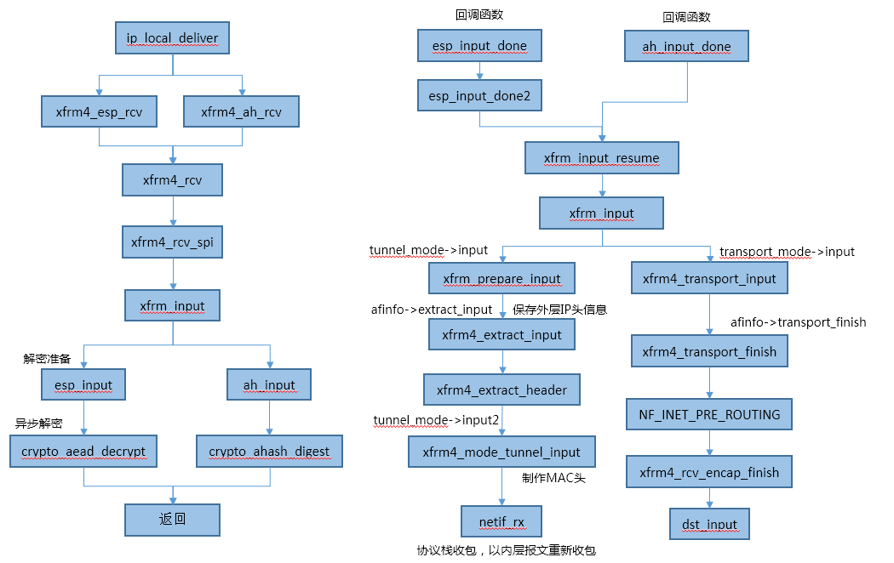

# XFRM Input

本文介绍内核收到ipip/AH/ESP报文后，如果交给xfrm处理。


## 调用流程图




## ipip报文处理函数注册

当接收到ipip报文时，会调用tunnel4_protocol的handler函数，该函数会遍历执行xfrm4_tunnel_register注册的handler，直到某一个handler返回0

整个linux内核用xfrm4_tunnel_register仅注册了两个handler。

按照优先级，会优先调用ipip的handler函数，如果未创建对应的ipip设备，则handler返回非0，则会交给xfrm处理。

```c
static int __init ipip_init(void)
{
	if (xfrm_register_type(&ipip_type, AF_INET) < 0) {
		pr_info("%s: can't add xfrm type\n", __func__);
		return -EAGAIN;
	}

	if (xfrm4_tunnel_register(&xfrm_tunnel_handler, AF_INET)) {
		pr_info("%s: can't add xfrm handler for AF_INET\n", __func__);
		xfrm_unregister_type(&ipip_type, AF_INET);
		return -EAGAIN;
	}
#if IS_ENABLED(CONFIG_IPV6)
	if (xfrm4_tunnel_register(&xfrm64_tunnel_handler, AF_INET6)) {
		pr_info("%s: can't add xfrm handler for AF_INET6\n", __func__);
		xfrm4_tunnel_deregister(&xfrm_tunnel_handler, AF_INET);
		xfrm_unregister_type(&ipip_type, AF_INET);
		return -EAGAIN;
	}
#endif
	return 0;
}

static struct xfrm_tunnel xfrm_tunnel_handler __read_mostly = {
	.handler	= xfrm_tunnel_rcv,
	.err_handler	=	xfrm_tunnel_err,
	.priority	=	3,
};
```


### ipip报文收报处理

```c
static int xfrm_tunnel_rcv(struct sk_buff *skb)
{
	return xfrm4_rcv_spi(skb, IPPROTO_IPIP, ip_hdr(skb)->saddr);
}

static inline int xfrm4_rcv_spi(struct sk_buff *skb, int nexthdr, __be32 spi)
{
	XFRM_TUNNEL_SKB_CB(skb)->tunnel.ip4 = NULL;
	XFRM_SPI_SKB_CB(skb)->family = AF_INET;
	XFRM_SPI_SKB_CB(skb)->daddroff = offsetof(struct iphdr, daddr);
	return xfrm_input(skb, nexthdr, spi, 0);
}
```

## AH报文处理函数注册

```c
static int __init ah4_init(void)
{
	if (xfrm_register_type(&ah_type, AF_INET) < 0) {
		pr_info("%s: can't add xfrm type\n", __func__);
		return -EAGAIN;
	}
	if (xfrm4_protocol_register(&ah4_protocol, IPPROTO_AH) < 0) {
		pr_info("%s: can't add protocol\n", __func__);
		xfrm_unregister_type(&ah_type, AF_INET);
		return -EAGAIN;
	}
	return 0;
}


int xfrm4_protocol_register(struct xfrm4_protocol *handler,
			    unsigned char protocol)
{
	struct xfrm4_protocol __rcu **pprev;
	struct xfrm4_protocol *t;
	bool add_netproto = false;
	int ret = -EEXIST;
	int priority = handler->priority;

	if (!proto_handlers(protocol) || !netproto(protocol))
		return -EINVAL;

	mutex_lock(&xfrm4_protocol_mutex);

	// 每个协议第一次注册时，此条件均满足，会同时添加到inet协议中，即ip收包时会进入此协议收包函数
	if (!rcu_dereference_protected(*proto_handlers(protocol),
				       lockdep_is_held(&xfrm4_protocol_mutex)))  
		add_netproto = true;

	for (pprev = proto_handlers(protocol);
	     (t = rcu_dereference_protected(*pprev,
			lockdep_is_held(&xfrm4_protocol_mutex))) != NULL;
	     pprev = &t->next) {
		if (t->priority < priority)
			break;
		if (t->priority == priority)
			goto err;
	}

	handler->next = *pprev;
	rcu_assign_pointer(*pprev, handler);   //插入handler

	ret = 0;

err:
	mutex_unlock(&xfrm4_protocol_mutex);

	if (add_netproto) {
	    //添加到inet协议中
		if (inet_add_protocol(netproto(protocol), protocol)) {
			pr_err("%s: can't add protocol\n", __func__);
			ret = -EAGAIN;
		}
	}

	return ret;
}

static const struct net_protocol ah4_protocol = {
	.handler	=	xfrm4_ah_rcv,
	.err_handler	=	xfrm4_ah_err,
	.no_policy	=	1,
	.netns_ok	=	1,
};

static struct xfrm4_protocol ah4_protocol = {
	.handler	=	xfrm4_rcv,
	.input_handler	=	xfrm_input,
	.cb_handler	=	ah4_rcv_cb,
	.err_handler	=	ah4_err,
	.priority	=	0,
};
```

### AH报文处理函数

```c
static int xfrm4_ah_rcv(struct sk_buff *skb)
{
	int ret;
	struct xfrm4_protocol *handler;

	XFRM_TUNNEL_SKB_CB(skb)->tunnel.ip4 = NULL;

	for_each_protocol_rcu(ah4_handlers, handler)   //实际调用xfrm4_rcv
		if ((ret = handler->handler(skb)) != -EINVAL)
			return ret;

	icmp_send(skb, ICMP_DEST_UNREACH, ICMP_PORT_UNREACH, 0);

	kfree_skb(skb);
	return 0;
}

int xfrm4_rcv(struct sk_buff *skb)
{
	return xfrm4_rcv_spi(skb, ip_hdr(skb)->protocol, 0);
}
```

## ESP报文处理函数注册

```c
static int __init esp4_init(void)
{
	if (xfrm_register_type(&esp_type, AF_INET) < 0) {
		pr_info("%s: can't add xfrm type\n", __func__);
		return -EAGAIN;
	}
	if (xfrm4_protocol_register(&esp4_protocol, IPPROTO_ESP) < 0) {
		pr_info("%s: can't add protocol\n", __func__);
		xfrm_unregister_type(&esp_type, AF_INET);
		return -EAGAIN;
	}
	return 0;
}

//ip收包时进入esp协议处理
static const struct net_protocol esp4_protocol = {
	.handler	=	xfrm4_esp_rcv,
	.err_handler	=	xfrm4_esp_err,
	.no_policy	=	1,
	.netns_ok	=	1,
};

static struct xfrm4_protocol esp4_protocol = {
	.handler	=	xfrm4_rcv,
	.input_handler	=	xfrm_input,
	.cb_handler	=	esp4_rcv_cb,
	.err_handler	=	esp4_err,
	.priority	=	0,
};
```

### ESP报文处理函数

```c
static int xfrm4_esp_rcv(struct sk_buff *skb)
{
	int ret;
	struct xfrm4_protocol *handler;

	XFRM_TUNNEL_SKB_CB(skb)->tunnel.ip4 = NULL;

	for_each_protocol_rcu(esp4_handlers, handler)  //实际调用xfrm4_rcv，同AH协议
		if ((ret = handler->handler(skb)) != -EINVAL)
			return ret;

	icmp_send(skb, ICMP_DEST_UNREACH, ICMP_PORT_UNREACH, 0);

	kfree_skb(skb);
	return 0;
}
```


## xfrm_input

所有协议的处理函数，最后都会调用xfrm_input函数。

```c
/*
  ipip报文， nexthdr = ipip协议号， spi=源IP，encap_type=0
  AH报文，   nexthdr = AH协议号，   spi=0，   encap_type=0
  ESP报文，  nexthdr = ESP协议号，  spi=0，   encap_type=0
*/
int xfrm_input(struct sk_buff *skb, int nexthdr, __be32 spi, int encap_type) 
{
	struct net *net = dev_net(skb->dev);
	int err;
	__be32 seq;
	__be32 seq_hi;
	struct xfrm_state *x = NULL;
	xfrm_address_t *daddr;
	struct xfrm_mode *inner_mode;
	u32 mark = skb->mark;
	unsigned int family;
	int decaps = 0;
	int async = 0;

	/* A negative encap_type indicates async resumption. */
	// 从xfrm4_rcv_spi入口调用时，encap_type=0，不会进此分支； 回调入口进此分支
	// ESP/AH报文异步解密，共有两次进入此函数，第二次回调会进入此分支
	if (encap_type < 0) {	
		async = 1;
		x = xfrm_input_state(skb);				//回调函数走此入口
		seq = XFRM_SKB_CB(skb)->seq.input.low;
		family = x->outer_mode->afinfo->family;
		goto resume;
	}

	daddr = (xfrm_address_t *)(skb_network_header(skb) +
				   XFRM_SPI_SKB_CB(skb)->daddroff);     // 得到目标IP地址
	family = XFRM_SPI_SKB_CB(skb)->family;				// ipv4

	/* if tunnel is present override skb->mark value with tunnel i_key */
	//从xfrm4_rcv_spi入口调用时，该值为null
	if (XFRM_TUNNEL_SKB_CB(skb)->tunnel.ip4) {  
		switch (family) {
		case AF_INET:
			mark = be32_to_cpu(XFRM_TUNNEL_SKB_CB(skb)->tunnel.ip4->parms.i_key);
			break;
		case AF_INET6:
			mark = be32_to_cpu(XFRM_TUNNEL_SKB_CB(skb)->tunnel.ip6->parms.i_key);
			break;
		}
	}

	/* Allocate new secpath or COW existing one. */
	if (!skb->sp || atomic_read(&skb->sp->refcnt) != 1) {
		struct sec_path *sp;

		sp = secpath_dup(skb->sp);		//复制secpath
		if (!sp) {
			XFRM_INC_STATS(net, LINUX_MIB_XFRMINERROR);
			goto drop;
		}
		if (skb->sp)
			secpath_put(skb->sp);
		skb->sp = sp;				//设置新的sp
	}

	seq = 0;
	//如果spi为零，则解析spi值，从xfrm4_rcv_spi入口调用时skb指向传输层头
	//ipip报文，spi值为源IP地址，不会为空
	if (!spi && (err = xfrm_parse_spi(skb, nexthdr, &spi, &seq)) != 0) {		
		XFRM_INC_STATS(net, LINUX_MIB_XFRMINHDRERROR);
		goto drop;
	}

	do {
		if (skb->sp->len == XFRM_MAX_DEPTH) {
			XFRM_INC_STATS(net, LINUX_MIB_XFRMINBUFFERERROR);
			goto drop;
		}
		//根据协议族、协议类型、目的IP、SPI获取xfrm_state对象
		x = xfrm_state_lookup(net, mark, daddr, spi, nexthdr, family);		
		if (x == NULL) {
			XFRM_INC_STATS(net, LINUX_MIB_XFRMINNOSTATES);
			xfrm_audit_state_notfound(skb, family, spi, seq);
			goto drop;
		}

		skb->sp->xvec[skb->sp->len++] = x;	//保存xfrm_state对象

		spin_lock(&x->lock);
		if (unlikely(x->km.state == XFRM_STATE_ACQ)) {
			XFRM_INC_STATS(net, LINUX_MIB_XFRMACQUIREERROR);
			goto drop_unlock;
		}

		if (unlikely(x->km.state != XFRM_STATE_VALID)) {
			XFRM_INC_STATS(net, LINUX_MIB_XFRMINSTATEINVALID);
			goto drop_unlock;
		}

		if ((x->encap ? x->encap->encap_type : 0) != encap_type) {	//检查encap_type
			XFRM_INC_STATS(net, LINUX_MIB_XFRMINSTATEMISMATCH);
			goto drop_unlock;
		}

		if (x->repl->check(x, skb, seq)) {
			XFRM_INC_STATS(net, LINUX_MIB_XFRMINSTATESEQERROR);
			goto drop_unlock;
		}

		if (xfrm_state_check_expire(x)) {
			XFRM_INC_STATS(net, LINUX_MIB_XFRMINSTATEEXPIRED);
			goto drop_unlock;
		}

		spin_unlock(&x->lock);

		if (xfrm_tunnel_check(skb, x, family)) {
			XFRM_INC_STATS(net, LINUX_MIB_XFRMINSTATEMODEERROR);
			goto drop;
		}

		seq_hi = htonl(xfrm_replay_seqhi(x, seq));

		XFRM_SKB_CB(skb)->seq.input.low = seq;
		XFRM_SKB_CB(skb)->seq.input.hi = seq_hi;

		skb_dst_force(skb);

		// 根据协议类型（AH、ESP）进行收包处理
		// 对于ESP报文，完成解密操作
		nexthdr = x->type->input(x, skb);	
		
		// ESP解密时，nexthdr为-EINPROGRESS，直接返回
		// 待解密完成后，回调
		if (nexthdr == -EINPROGRESS)
			return 0;
resume:
		spin_lock(&x->lock);
		if (nexthdr <= 0) {
			if (nexthdr == -EBADMSG) {
				xfrm_audit_state_icvfail(x, skb,
							 x->type->proto);
				x->stats.integrity_failed++;
			}
			XFRM_INC_STATS(net, LINUX_MIB_XFRMINSTATEPROTOERROR);
			goto drop_unlock;
		}

		/* only the first xfrm gets the encap type */
		// 支持AH + ESP模式
		encap_type = 0;

		if (async && x->repl->recheck(x, skb, seq)) {
			XFRM_INC_STATS(net, LINUX_MIB_XFRMINSTATESEQERROR);
			goto drop_unlock;
		}

		x->repl->advance(x, seq);

		x->curlft.bytes += skb->len;
		x->curlft.packets++;

		spin_unlock(&x->lock);

		XFRM_MODE_SKB_CB(skb)->protocol = nexthdr;  //内部报文的协议类型

		inner_mode = x->inner_mode;

		if (x->sel.family == AF_UNSPEC) {
			inner_mode = xfrm_ip2inner_mode(x, XFRM_MODE_SKB_CB(skb)->protocol);
			if (inner_mode == NULL)
				goto drop;
		}
		
		// 调用模式（transport、tunnel）的收包函数
		if (inner_mode->input(x, skb)) {	
			XFRM_INC_STATS(net, LINUX_MIB_XFRMINSTATEMODEERROR);
			goto drop;
		}
		
		// 一般情况inner_mode和outer_mode相同
		if (x->outer_mode->flags & XFRM_MODE_FLAG_TUNNEL) {
			decaps = 1;
			break;
		}

		/*
		 * We need the inner address.  However, we only get here for
		 * transport mode so the outer address is identical.
		 */
		daddr = &x->id.daddr;
		family = x->outer_mode->afinfo->family;
		
		//此时内部报文是普通报文，返回值err为1，跳出循环
		err = xfrm_parse_spi(skb, nexthdr, &spi, &seq);	
		if (err < 0) {
			XFRM_INC_STATS(net, LINUX_MIB_XFRMINHDRERROR);
			goto drop;
		}
	} while (!err);   // 支持 AH + ESP 模式，一次完成解析
	
	// 执行收包回调函数
	// 对于ESP和AH，没有实际操作
	err = xfrm_rcv_cb(skb, family, x->type->proto, 0);	
	if (err)
		goto drop;

	nf_reset(skb);

	if (decaps) {   //tunnel模式走此分支
		skb_dst_drop(skb);
		netif_rx(skb);  //协议栈收包，此时内层是完整的IP报文
		return 0;
	} else {
	    // transport模式走此分支，实际调用xfrm4_transport_finish函数
		// 会恢复IP头，并重走NF_INET_PRE_ROUTING
		return x->inner_mode->afinfo->transport_finish(skb, async);	
	}

drop_unlock:
	spin_unlock(&x->lock);
drop:
	xfrm_rcv_cb(skb, family, x && x->type ? x->type->proto : nexthdr, -1);
	kfree_skb(skb);
	return 0;
}

static int xfrm_rcv_cb(struct sk_buff *skb, unsigned int family, u8 protocol,
		       int err)
{
	int ret;
	struct xfrm_input_afinfo *afinfo = xfrm_input_get_afinfo(family);

	if (!afinfo)
		return -EAFNOSUPPORT;

	ret = afinfo->callback(skb, protocol, err);
	xfrm_input_put_afinfo(afinfo);

	return ret;
}

int xfrm4_transport_finish(struct sk_buff *skb, int async)
{
	struct iphdr *iph = ip_hdr(skb);

	iph->protocol = XFRM_MODE_SKB_CB(skb)->protocol;	//恢复IP头的协议

#ifndef CONFIG_NETFILTER
	if (!async)
		return -iph->protocol;
#endif

	__skb_push(skb, skb->data - skb_network_header(skb));	//报文指向IP头
	iph->tot_len = htons(skb->len);
	ip_send_check(iph);

	NF_HOOK(NFPROTO_IPV4, NF_INET_PRE_ROUTING, NULL, skb,  //iptables的preroute链再次check
		skb->dev, NULL,
		xfrm4_rcv_encap_finish);
	return 0;
}

static inline int xfrm4_rcv_encap_finish(struct sock *sk, struct sk_buff *skb)
{
	if (!skb_dst(skb)) {
		const struct iphdr *iph = ip_hdr(skb);

		if (ip_route_input_noref(skb, iph->daddr, iph->saddr,
					 iph->tos, skb->dev))
			goto drop;
	}
	return dst_input(skb);		//重新处理上送本地协议栈或转发
drop:
	kfree_skb(skb);
	return NET_RX_DROP;
}
```


## ESP Type

```c
static int esp_input(struct xfrm_state *x, struct sk_buff *skb)
{
	struct ip_esp_hdr *esph;
	struct crypto_aead *aead = x->data;
	struct aead_request *req;
	struct sk_buff *trailer;
	int elen = skb->len - sizeof(*esph) - crypto_aead_ivsize(aead);
	int nfrags;
	int assoclen;
	int sglists;
	int seqhilen;
	__be32 *seqhi;
	void *tmp;
	u8 *iv;
	struct scatterlist *sg;
	struct scatterlist *asg;
	int err = -EINVAL;

	if (!pskb_may_pull(skb, sizeof(*esph) + crypto_aead_ivsize(aead)))
		goto out;

	if (elen <= 0)
		goto out;

	err = skb_cow_data(skb, 0, &trailer);
	if (err < 0)
		goto out;

	nfrags = err;

	assoclen = sizeof(*esph);
	sglists = 1;
	seqhilen = 0;

	if (x->props.flags & XFRM_STATE_ESN) {
		sglists += 2;
		seqhilen += sizeof(__be32);
		assoclen += seqhilen;
	}

	err = -ENOMEM;
	tmp = esp_alloc_tmp(aead, nfrags + sglists, seqhilen);
	if (!tmp)
		goto out;

	ESP_SKB_CB(skb)->tmp = tmp;
	seqhi = esp_tmp_seqhi(tmp);
	iv = esp_tmp_iv(aead, tmp, seqhilen);
	req = esp_tmp_req(aead, iv);
	asg = esp_req_sg(aead, req);
	sg = asg + sglists;

	skb->ip_summed = CHECKSUM_NONE;

	esph = (struct ip_esp_hdr *)skb->data;	//当前指向esp头

	/* Get ivec. This can be wrong, check against another impls. */
	iv = esph->enc_data;

	sg_init_table(sg, nfrags);
	//解密数据不包含esp头
	skb_to_sgvec(skb, sg, sizeof(*esph) + crypto_aead_ivsize(aead), elen);		

	if ((x->props.flags & XFRM_STATE_ESN)) {
		sg_init_table(asg, 3);
		sg_set_buf(asg, &esph->spi, sizeof(__be32));
		*seqhi = XFRM_SKB_CB(skb)->seq.input.hi;
		sg_set_buf(asg + 1, seqhi, seqhilen);
		sg_set_buf(asg + 2, &esph->seq_no, sizeof(__be32));
	} else
		sg_init_one(asg, esph, sizeof(*esph));

	aead_request_set_callback(req, 0, esp_input_done, skb);  //设置回调
	aead_request_set_crypt(req, sg, sg, elen, iv);
	aead_request_set_assoc(req, asg, assoclen);

	err = crypto_aead_decrypt(req);
	if (err == -EINPROGRESS)
		goto out;	//异步解密场景，会在此，待解密完成后进行回调

	err = esp_input_done2(skb, err);

out:
	return err;
}
```

### ESP解密回调

```c
static void esp_input_done(struct crypto_async_request *base, int err)
{
	struct sk_buff *skb = base->data;

	xfrm_input_resume(skb, esp_input_done2(skb, err));
}

static int esp_input_done2(struct sk_buff *skb, int err)
{
	const struct iphdr *iph;
	struct xfrm_state *x = xfrm_input_state(skb);
	struct crypto_aead *aead = x->data;
	int alen = crypto_aead_authsize(aead);
	int hlen = sizeof(struct ip_esp_hdr) + crypto_aead_ivsize(aead);
	int elen = skb->len - hlen;
	int ihl;
	u8 nexthdr[2];
	int padlen;

	kfree(ESP_SKB_CB(skb)->tmp);

	if (unlikely(err))
		goto out;

	//拷贝内部报文的协议
	if (skb_copy_bits(skb, skb->len-alen-2, nexthdr, 2))			
		BUG();

	err = -EINVAL;
	padlen = nexthdr[0];
	if (padlen + 2 + alen >= elen)
		goto out;

	/* ... check padding bits here. Silly. :-) */

	iph = ip_hdr(skb);
	ihl = iph->ihl * 4;		//ip头长度

	if (x->encap) {
		struct xfrm_encap_tmpl *encap = x->encap;
		struct udphdr *uh = (void *)(skb_network_header(skb) + ihl); //计算出udp头指针

		/*
		 * 1) if the NAT-T peer's IP or port changed then
		 *    advertize the change to the keying daemon.
		 *    This is an inbound SA, so just compare
		 *    SRC ports.
		 */
		if (iph->saddr != x->props.saddr.a4 ||
		    uh->source != encap->encap_sport) {
			xfrm_address_t ipaddr;

			ipaddr.a4 = iph->saddr;
			km_new_mapping(x, &ipaddr, uh->source);

			/* XXX: perhaps add an extra
			 * policy check here, to see
			 * if we should allow or
			 * reject a packet from a
			 * different source
			 * address/port.
			 */
		}

		/*
		 * 2) ignore UDP/TCP checksums in case
		 *    of NAT-T in Transport Mode, or
		 *    perform other post-processing fixes
		 *    as per draft-ietf-ipsec-udp-encaps-06,
		 *    section 3.1.2
		 */
		if (x->props.mode == XFRM_MODE_TRANSPORT)
			skb->ip_summed = CHECKSUM_UNNECESSARY;
	}

	pskb_trim(skb, skb->len - alen - padlen - 2);
	__skb_pull(skb, hlen);	//skb->data指向数据
	if (x->props.mode == XFRM_MODE_TUNNEL)
		skb_reset_transport_header(skb);
	else
	    //传输头当前指向ESP头， 更新后指向数据的一个IP头+ESP头 |IP|UDP|ESP|数据
		skb_set_transport_header(skb, -ihl);			

	err = nexthdr[1];	//内部报文协议

	/* RFC4303: Drop dummy packets without any error */
	if (err == IPPROTO_NONE)
		err = -EINVAL;

out:
	return err;
}

int xfrm_input_resume(struct sk_buff *skb, int nexthdr)
{
	return xfrm_input(skb, nexthdr, 0, -1);
}
```

## AH Type

```c
static int ah_input(struct xfrm_state *x, struct sk_buff *skb)
{
	int ah_hlen;
	int ihl;
	int nexthdr;
	int nfrags;
	u8 *auth_data;
	u8 *icv;
	struct sk_buff *trailer;
	struct crypto_ahash *ahash;
	struct ahash_request *req;
	struct scatterlist *sg;
	struct iphdr *iph, *work_iph;
	struct ip_auth_hdr *ah;
	struct ah_data *ahp;
	int err = -ENOMEM;
	int seqhi_len = 0;
	__be32 *seqhi;
	int sglists = 0;
	struct scatterlist *seqhisg;

	if (!pskb_may_pull(skb, sizeof(*ah)))
		goto out;

	ah = (struct ip_auth_hdr *)skb->data;
	ahp = x->data;
	ahash = ahp->ahash;

	nexthdr = ah->nexthdr;
	ah_hlen = (ah->hdrlen + 2) << 2;

	if (x->props.flags & XFRM_STATE_ALIGN4) {
		if (ah_hlen != XFRM_ALIGN4(sizeof(*ah) + ahp->icv_full_len) &&
		    ah_hlen != XFRM_ALIGN4(sizeof(*ah) + ahp->icv_trunc_len))
			goto out;
	} else {
		if (ah_hlen != XFRM_ALIGN8(sizeof(*ah) + ahp->icv_full_len) &&
		    ah_hlen != XFRM_ALIGN8(sizeof(*ah) + ahp->icv_trunc_len))
			goto out;
	}

	if (!pskb_may_pull(skb, ah_hlen))
		goto out;

	/* We are going to _remove_ AH header to keep sockets happy,
	 * so... Later this can change. */
	if (skb_unclone(skb, GFP_ATOMIC))
		goto out;

	skb->ip_summed = CHECKSUM_NONE;


	if ((err = skb_cow_data(skb, 0, &trailer)) < 0)
		goto out;
	nfrags = err;

	ah = (struct ip_auth_hdr *)skb->data;
	iph = ip_hdr(skb);
	ihl = ip_hdrlen(skb);

	if (x->props.flags & XFRM_STATE_ESN) {
		sglists = 1;
		seqhi_len = sizeof(*seqhi);
	}

	work_iph = ah_alloc_tmp(ahash, nfrags + sglists, ihl +
				ahp->icv_trunc_len + seqhi_len);
	if (!work_iph)
		goto out;

	seqhi = (__be32 *)((char *)work_iph + ihl);
	auth_data = ah_tmp_auth(seqhi, seqhi_len);
	icv = ah_tmp_icv(ahash, auth_data, ahp->icv_trunc_len);
	req = ah_tmp_req(ahash, icv);
	sg = ah_req_sg(ahash, req);
	seqhisg = sg + nfrags;

	memcpy(work_iph, iph, ihl);
	memcpy(auth_data, ah->auth_data, ahp->icv_trunc_len);
	memset(ah->auth_data, 0, ahp->icv_trunc_len);

	iph->ttl = 0;
	iph->tos = 0;
	iph->frag_off = 0;
	iph->check = 0;
	if (ihl > sizeof(*iph)) {
		__be32 dummy;
		err = ip_clear_mutable_options(iph, &dummy);
		if (err)
			goto out_free;
	}

	skb_push(skb, ihl);

	sg_init_table(sg, nfrags + sglists);
	skb_to_sgvec_nomark(skb, sg, 0, skb->len);

	if (x->props.flags & XFRM_STATE_ESN) {
		/* Attach seqhi sg right after packet payload */
		*seqhi = XFRM_SKB_CB(skb)->seq.input.hi;
		sg_set_buf(seqhisg, seqhi, seqhi_len);
	}
	ahash_request_set_crypt(req, sg, icv, skb->len + seqhi_len);
	ahash_request_set_callback(req, 0, ah_input_done, skb);  //回调函数

	AH_SKB_CB(skb)->tmp = work_iph;

	err = crypto_ahash_digest(req);
	if (err) {
		if (err == -EINPROGRESS)
			goto out;

		goto out_free;
	}

	err = memcmp(icv, auth_data, ahp->icv_trunc_len) ? -EBADMSG: 0;
	if (err)
		goto out_free;

	skb->network_header += ah_hlen;
	memcpy(skb_network_header(skb), work_iph, ihl);
	__skb_pull(skb, ah_hlen + ihl);
	if (x->props.mode == XFRM_MODE_TUNNEL)
		skb_reset_transport_header(skb);
	else
		skb_set_transport_header(skb, -ihl);

	err = nexthdr;

out_free:
	kfree (work_iph);
out:
	return err;
}
```

### AH Type回调函数

```c
static void ah_input_done(struct crypto_async_request *base, int err)
{
	u8 *auth_data;
	u8 *icv;
	struct iphdr *work_iph;
	struct sk_buff *skb = base->data;
	struct xfrm_state *x = xfrm_input_state(skb);
	struct ah_data *ahp = x->data;
	struct ip_auth_hdr *ah = ip_auth_hdr(skb);
	int ihl = ip_hdrlen(skb);
	int ah_hlen = (ah->hdrlen + 2) << 2;

	work_iph = AH_SKB_CB(skb)->tmp;
	auth_data = ah_tmp_auth(work_iph, ihl);
	icv = ah_tmp_icv(ahp->ahash, auth_data, ahp->icv_trunc_len);

	err = memcmp(icv, auth_data, ahp->icv_trunc_len) ? -EBADMSG: 0;
	if (err)
		goto out;

	err = ah->nexthdr;

	skb->network_header += ah_hlen;
	memcpy(skb_network_header(skb), work_iph, ihl);
	__skb_pull(skb, ah_hlen + ihl);

	if (x->props.mode == XFRM_MODE_TUNNEL)
		skb_reset_transport_header(skb);
	else
		skb_set_transport_header(skb, -ihl);
out:
	kfree(AH_SKB_CB(skb)->tmp);
	xfrm_input_resume(skb, err);
}
```


## Tunnel Mode

```c
static struct xfrm_mode xfrm4_tunnel_mode = {
	.input2 = xfrm4_mode_tunnel_input,
	.input = xfrm_prepare_input,
	.output2 = xfrm4_mode_tunnel_output,
	.output = xfrm4_prepare_output,
	.owner = THIS_MODULE,
	.encap = XFRM_MODE_TUNNEL,
	.flags = XFRM_MODE_FLAG_TUNNEL,
};
```

### xfrm_prepare_input

```c
int xfrm_prepare_input(struct xfrm_state *x, struct sk_buff *skb)
{
	struct xfrm_mode *inner_mode = x->inner_mode;
	int err;

	err = x->outer_mode->afinfo->extract_input(x, skb);	//保存IP头信息
	if (err)
		return err;

	if (x->sel.family == AF_UNSPEC) {
		inner_mode = xfrm_ip2inner_mode(x, XFRM_MODE_SKB_CB(skb)->protocol);
		if (inner_mode == NULL)
			return -EAFNOSUPPORT;
	}

	skb->protocol = inner_mode->afinfo->eth_proto;
	return inner_mode->input2(x, skb);
}
```

### xfrm4_mode_tunnel_input

```c
static int xfrm4_mode_tunnel_input(struct xfrm_state *x, struct sk_buff *skb)
{
	int err = -EINVAL;

	if (XFRM_MODE_SKB_CB(skb)->protocol != IPPROTO_IPIP)
		goto out;

	if (!pskb_may_pull(skb, sizeof(struct iphdr)))
		goto out;

	err = skb_unclone(skb, GFP_ATOMIC);
	if (err)
		goto out;

	if (x->props.flags & XFRM_STATE_DECAP_DSCP)
		ipv4_copy_dscp(XFRM_MODE_SKB_CB(skb)->tos, ipip_hdr(skb));
	if (!(x->props.flags & XFRM_STATE_NOECN))
		ipip_ecn_decapsulate(skb);

	skb_reset_network_header(skb);
	skb_mac_header_rebuild(skb);	//重置mac头，用外层的mac头

	err = 0;

out:
	return err;
}
```


## Transport Mode

```c
static struct xfrm_mode xfrm4_transport_mode = {
	.input = xfrm4_transport_input,
	.output = xfrm4_transport_output,
	.owner = THIS_MODULE,
	.encap = XFRM_MODE_TRANSPORT,
};
```


### xfrm4_transport_input

```c
static int xfrm4_transport_input(struct xfrm_state *x, struct sk_buff *skb)
{
    //IP头长度， skb->data指向的是负载数据，而传输头在xfrm4_transport_input中设置了位置
	int ihl = skb->data - skb_transport_header(skb);		

	if (skb->transport_header != skb->network_header) {
		memmove(skb_transport_header(skb),
			skb_network_header(skb), ihl);			//拷贝IP头（IP头的协议）
		skb->network_header = skb->transport_header;	//IP头指向正确的位置
	}
	ip_hdr(skb)->tot_len = htons(skb->len + ihl);
	skb_reset_transport_header(skb);	//传输头也指向了正确的位置
	return 0;
}
```


