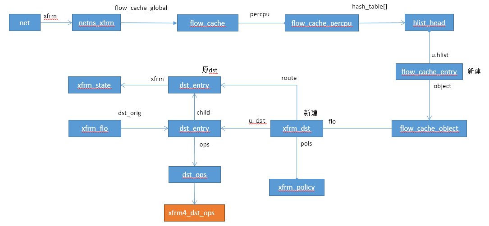

# XFRM Route

本文介绍XFRM系统与内核协议栈之间的接口，内核协议栈通过查找路由，实现插入xfrm处理，xfrm处理完成后交给原发包流程。


## 数据结构




## 系统入口

```c
static inline struct rtable *ip_route_output_key(struct net *net, struct flowi4 *flp)
{
	return ip_route_output_flow(net, flp, NULL);
}

struct rtable *ip_route_output_flow(struct net *net, struct flowi4 *flp4,
				    struct sock *sk)
{
	struct rtable *rt = __ip_route_output_key(net, flp4);    //先查找系统路由

	if (IS_ERR(rt))
		return rt;

	if (flp4->flowi4_proto)    //通过设置该标记，来指定xfrm处理
		rt = (struct rtable *)xfrm_lookup_route(net, &rt->dst,   //xfrm路由查找
							flowi4_to_flowi(flp4),
							sk, 0);

	return rt;
}
```


## xfrm_lookup_route

```c
struct dst_entry *xfrm_lookup_route(struct net *net, struct dst_entry *dst_orig,
				    const struct flowi *fl,
				    struct sock *sk, int flags)		//sk为NULL，flag为0
{
	struct dst_entry *dst = xfrm_lookup(net, dst_orig, fl, sk,    //查找了路由
					    flags | XFRM_LOOKUP_QUEUE |
					    XFRM_LOOKUP_KEEP_DST_REF);

	if (IS_ERR(dst) && PTR_ERR(dst) == -EREMOTE)    //如果路由不存在，则创建黑洞路由项（直接丢弃报文）
		return make_blackhole(net, dst_orig->ops->family, dst_orig);

	return dst;
}

static struct dst_entry *make_blackhole(struct net *net, u16 family,
					struct dst_entry *dst_orig)
{
	struct xfrm_policy_afinfo *afinfo = xfrm_policy_get_afinfo(family);
	struct dst_entry *ret;

	if (!afinfo) {
		dst_release(dst_orig);
		return ERR_PTR(-EINVAL);
	} else {
	    //实际调用ipv4_blackhole_route函数，创建一个黑洞dst_entry
		ret = afinfo->blackhole_route(net, dst_orig);   
	}
	xfrm_policy_put_afinfo(afinfo);

	return ret;
}

struct dst_entry *ipv4_blackhole_route(struct net *net, struct dst_entry *dst_orig)
{
	struct rtable *ort = (struct rtable *) dst_orig;
	struct rtable *rt;

	rt = dst_alloc(&ipv4_dst_blackhole_ops, NULL, 1, DST_OBSOLETE_NONE, 0);
	if (rt) {
		struct dst_entry *new = &rt->dst;

		new->__use = 1;
		new->input = dst_discard;
		new->output = dst_discard_sk;   //丢弃skb

		new->dev = ort->dst.dev;
		if (new->dev)
			dev_hold(new->dev);

		rt->rt_is_input = ort->rt_is_input;
		rt->rt_iif = ort->rt_iif;
		rt->rt_pmtu = ort->rt_pmtu;

		rt->rt_genid = rt_genid_ipv4(net);
		rt->rt_flags = ort->rt_flags;
		rt->rt_type = ort->rt_type;
		rt->rt_gateway = ort->rt_gateway;
		rt->rt_uses_gateway = ort->rt_uses_gateway;

		INIT_LIST_HEAD(&rt->rt_uncached);

		dst_free(new);
	}

	dst_release(dst_orig);   //释放原dst_entry

	return rt ? &rt->dst : ERR_PTR(-ENOMEM);
}
```
  
## xfrm_lookup

```c
struct dst_entry *xfrm_lookup(struct net *net, struct dst_entry *dst_orig,
			      const struct flowi *fl,
			      struct sock *sk, int flags)
{
	struct xfrm_policy *pols[XFRM_POLICY_TYPE_MAX];
	struct flow_cache_object *flo;
	struct xfrm_dst *xdst;
	struct dst_entry *dst, *route;
	u16 family = dst_orig->ops->family;
	u8 dir = policy_to_flow_dir(XFRM_POLICY_OUT);	// dir仍然为XFRM_POLICY_OUT
	int i, err, num_pols, num_xfrms = 0, drop_pols = 0;

	dst = NULL;
	xdst = NULL;
	route = NULL;

	if (sk && sk->sk_policy[XFRM_POLICY_OUT]) {	// xfrm_lookup_route调用链下sk为空不满足
		num_pols = 1;
		pols[0] = xfrm_sk_policy_lookup(sk, XFRM_POLICY_OUT, fl);
		err = xfrm_expand_policies(fl, family, pols,
					   &num_pols, &num_xfrms);
		if (err < 0)
			goto dropdst;

		if (num_pols) {
			if (num_xfrms <= 0) {
				drop_pols = num_pols;
				goto no_transform;
			}

			xdst = xfrm_resolve_and_create_bundle(
					pols, num_pols, fl,
					family, dst_orig);
			if (IS_ERR(xdst)) {
				xfrm_pols_put(pols, num_pols);
				err = PTR_ERR(xdst);
				goto dropdst;
			} else if (xdst == NULL) {
				num_xfrms = 0;
				drop_pols = num_pols;
				goto no_transform;
			}

			dst_hold(&xdst->u.dst);
			xdst->u.dst.flags |= DST_NOCACHE;
			route = xdst->route;
		}
	}

	if (xdst == NULL) {
		struct xfrm_flo xflo;

		xflo.dst_orig = dst_orig;   //保存原dst_entry
		xflo.flags = flags;

		/* To accelerate a bit...  */
		if ((dst_orig->flags & DST_NOXFRM) ||   
		    !net->xfrm.policy_count[XFRM_POLICY_OUT])   //如果dst_entry不支持xfrm，则直接返回原dst_entry
			goto nopol;

		flo = flow_cache_lookup(net, fl, family, dir,    //缓存中查找路由项
					xfrm_bundle_lookup, &xflo);
		if (flo == NULL)   //未找到，返回原dst_entry
			goto nopol;
		if (IS_ERR(flo)) {
			err = PTR_ERR(flo);
			goto dropdst;
		}
		xdst = container_of(flo, struct xfrm_dst, flo);

		num_pols = xdst->num_pols;
		num_xfrms = xdst->num_xfrms;
		memcpy(pols, xdst->pols, sizeof(struct xfrm_policy *) * num_pols);
		route = xdst->route;
	}

	dst = &xdst->u.dst;
	if (route == NULL && num_xfrms > 0) {
		/* The only case when xfrm_bundle_lookup() returns a
		 * bundle with null route, is when the template could
		 * not be resolved. It means policies are there, but
		 * bundle could not be created, since we don't yet
		 * have the xfrm_state's. We need to wait for KM to
		 * negotiate new SA's or bail out with error.*/
		if (net->xfrm.sysctl_larval_drop) {
			XFRM_INC_STATS(net, LINUX_MIB_XFRMOUTNOSTATES);
			err = -EREMOTE;
			goto error;
		}

		err = -EAGAIN;

		XFRM_INC_STATS(net, LINUX_MIB_XFRMOUTNOSTATES);
		goto error;
	}

no_transform:
	if (num_pols == 0)
		goto nopol;

	if ((flags & XFRM_LOOKUP_ICMP) &&
	    !(pols[0]->flags & XFRM_POLICY_ICMP)) {
		err = -ENOENT;
		goto error;
	}

	for (i = 0; i < num_pols; i++)
		pols[i]->curlft.use_time = get_seconds();

	if (num_xfrms < 0) {
		/* Prohibit the flow */
		XFRM_INC_STATS(net, LINUX_MIB_XFRMOUTPOLBLOCK);
		err = -EPERM;
		goto error;
	} else if (num_xfrms > 0) {
		/* Flow transformed */
		dst_release(dst_orig);
	} else {
		/* Flow passes untransformed */
		dst_release(dst);
		dst = dst_orig;
	}
ok:
	xfrm_pols_put(pols, drop_pols);
	if (dst && dst->xfrm &&
	    dst->xfrm->props.mode == XFRM_MODE_TUNNEL)
		dst->flags |= DST_XFRM_TUNNEL;
	return dst;

nopol:
	if (!(flags & XFRM_LOOKUP_ICMP)) {
		dst = dst_orig;
		goto ok;
	}
	err = -ENOENT;
error:
	dst_release(dst);
dropdst:
	if (!(flags & XFRM_LOOKUP_KEEP_DST_REF))
		dst_release(dst_orig);
	xfrm_pols_put(pols, drop_pols);
	return ERR_PTR(err);
}
```


## flow_cache_lookup

```c
struct flow_cache_object *
flow_cache_lookup(struct net *net, const struct flowi *key, u16 family, u8 dir,
		  flow_resolve_t resolver, void *ctx)
{
	struct flow_cache *fc = &net->xfrm.flow_cache_global;
	struct flow_cache_percpu *fcp;
	struct flow_cache_entry *fle, *tfle;
	struct flow_cache_object *flo;
	size_t keysize;
	unsigned int hash;

	local_bh_disable();
	fcp = this_cpu_ptr(fc->percpu);	 //获取当前CPU的cache

	fle = NULL;
	flo = NULL;

	keysize = flow_key_size(family); //得到key的长度，flowi长度/long长度，即比较整个flowi
	if (!keysize)
		goto nocache;

	/* Packet really early in init?  Making flow_cache_init a
	 * pre-smp initcall would solve this.  --RR */
	if (!fcp->hash_table)		// cache未初始化，直接查找
		goto nocache;

	if (fcp->hash_rnd_recalc)
		flow_new_hash_rnd(fc, fcp);	// 清空cache

	hash = flow_hash_code(fc, fcp, key, keysize);	//计算hash值，得到桶id
	hlist_for_each_entry(tfle, &fcp->hash_table[hash], u.hlist) {  //遍历桶链表
		if (tfle->net == net &&
		    tfle->family == family &&
		    tfle->dir == dir &&
		    flow_key_compare(key, &tfle->key, keysize) == 0) {
			fle = tfle;
			break;
		}
	}

	if (unlikely(!fle)) {
		if (fcp->hash_count > fc->high_watermark)  //高水位，需要再添加项之前先清理
			flow_cache_shrink(fc, fcp);

		fle = kmem_cache_alloc(flow_cachep, GFP_ATOMIC);	//构造flow_cache_entry对象
		if (fle) {
			fle->net = net;
			fle->family = family;
			fle->dir = dir;
			memcpy(&fle->key, key, keysize * sizeof(flow_compare_t));  //拷贝key值
			fle->object = NULL;
			hlist_add_head(&fle->u.hlist, &fcp->hash_table[hash]);	//添加到hash桶中
			fcp->hash_count++;
		}
	} else if (likely(fle->genid == atomic_read(&net->xfrm.flow_cache_genid))) {
		flo = fle->object;
		if (!flo)			//如果flo对象为空，则返回
			goto ret_object;
		flo = flo->ops->get(flo);	//xfrm_bundle_flo_get
		if (flo)
			goto ret_object;
	} else if (fle->object) {		//需要释放flo对象
	        flo = fle->object;
	        flo->ops->delete(flo);
	        fle->object = NULL;
	}

nocache:
	flo = NULL;
	if (fle) {
		flo = fle->object;
		fle->object = NULL;
	}
	flo = resolver(net, key, family, dir, flo, ctx); //调用xfrm_bundle_lookup
	if (fle) {
		fle->genid = atomic_read(&net->xfrm.flow_cache_genid);		//genid保持相同
		if (!IS_ERR(flo))
			fle->object = flo;		//设置flo对象
		else
			fle->genid--;
	} else {
		if (!IS_ERR_OR_NULL(flo))
			flo->ops->delete(flo);
	}
ret_object:
	local_bh_enable();
	return flo;
}
EXPORT_SYMBOL(flow_cache_lookup);
```


## xfrm_bundle_lookup

```c
static struct flow_cache_object *
xfrm_bundle_lookup(struct net *net, const struct flowi *fl, u16 family, u8 dir,
		   struct flow_cache_object *oldflo, void *ctx)
{
	struct xfrm_flo *xflo = (struct xfrm_flo *)ctx;
	struct xfrm_policy *pols[XFRM_POLICY_TYPE_MAX];
	struct xfrm_dst *xdst, *new_xdst;
	int num_pols = 0, num_xfrms = 0, i, err, pol_dead;

	/* Check if the policies from old bundle are usable */
	xdst = NULL;
	if (oldflo) {
		xdst = container_of(oldflo, struct xfrm_dst, flo);
		num_pols = xdst->num_pols;
		num_xfrms = xdst->num_xfrms;
		pol_dead = 0;
		for (i = 0; i < num_pols; i++) {
			pols[i] = xdst->pols[i];
			pol_dead |= pols[i]->walk.dead;
		}
		if (pol_dead) {
			dst_free(&xdst->u.dst);
			xdst = NULL;
			num_pols = 0;
			num_xfrms = 0;
			oldflo = NULL;
		}
	}

	/* Resolve policies to use if we couldn't get them from
	 * previous cache entry */
	if (xdst == NULL) {
		num_pols = 1;
		pols[0] = __xfrm_policy_lookup(net, fl, family,
					       flow_to_policy_dir(dir));		//查找policy
		err = xfrm_expand_policies(fl, family, pols,
					   &num_pols, &num_xfrms);
		if (err < 0)
			goto inc_error;
		if (num_pols == 0)
			return NULL;
		if (num_xfrms <= 0)
			goto make_dummy_bundle;
	}
	
	//创建xdst对象
	new_xdst = xfrm_resolve_and_create_bundle(pols, num_pols, fl, family,   
						  xflo->dst_orig);
	if (IS_ERR(new_xdst)) {
		err = PTR_ERR(new_xdst);
		if (err != -EAGAIN)
			goto error;
		if (oldflo == NULL)
			goto make_dummy_bundle;
		dst_hold(&xdst->u.dst);
		return oldflo;
	} else if (new_xdst == NULL) {
		num_xfrms = 0;
		if (oldflo == NULL)
			goto make_dummy_bundle;
		xdst->num_xfrms = 0;
		dst_hold(&xdst->u.dst);
		return oldflo;
	}

	/* Kill the previous bundle */
	if (xdst) {
		/* The policies were stolen for newly generated bundle */
		xdst->num_pols = 0;
		dst_free(&xdst->u.dst);
	}

	/* Flow cache does not have reference, it dst_free()'s,
	 * but we do need to return one reference for original caller */
	dst_hold(&new_xdst->u.dst);
	return &new_xdst->flo;			//返回flo对象

make_dummy_bundle:
	/* We found policies, but there's no bundles to instantiate:
	 * either because the policy blocks, has no transformations or
	 * we could not build template (no xfrm_states).*/
	xdst = xfrm_create_dummy_bundle(net, xflo, fl, num_xfrms, family);
	if (IS_ERR(xdst)) {
		xfrm_pols_put(pols, num_pols);
		return ERR_CAST(xdst);
	}
	xdst->num_pols = num_pols;
	xdst->num_xfrms = num_xfrms;
	memcpy(xdst->pols, pols, sizeof(struct xfrm_policy *) * num_pols);

	dst_hold(&xdst->u.dst);
	return &xdst->flo;

inc_error:
	XFRM_INC_STATS(net, LINUX_MIB_XFRMOUTPOLERROR);
error:
	if (xdst != NULL)
		dst_free(&xdst->u.dst);
	else
		xfrm_pols_put(pols, num_pols);
	return ERR_PTR(err);
}
```


## xfrm_resolve_and_create_bundle

```c
static struct xfrm_dst *
xfrm_resolve_and_create_bundle(struct xfrm_policy **pols, int num_pols,
			       const struct flowi *fl, u16 family,
			       struct dst_entry *dst_orig)
{
	struct net *net = xp_net(pols[0]);
	struct xfrm_state *xfrm[XFRM_MAX_DEPTH];
	struct dst_entry *dst;
	struct xfrm_dst *xdst;
	int err;

	/* Try to instantiate a bundle */
	err = xfrm_tmpl_resolve(pols, num_pols, fl, xfrm, family);   
	if (err <= 0) {
		if (err != 0 && err != -EAGAIN)
			XFRM_INC_STATS(net, LINUX_MIB_XFRMOUTPOLERROR);
		return ERR_PTR(err);
	}

	dst = xfrm_bundle_create(pols[0], xfrm, err, fl, dst_orig);  //创建dst_entry，实际为xfrm_dst
	if (IS_ERR(dst)) {
		XFRM_INC_STATS(net, LINUX_MIB_XFRMOUTBUNDLEGENERROR);
		return ERR_CAST(dst);
	}

	xdst = (struct xfrm_dst *)dst;
	xdst->num_xfrms = err;
	if (num_pols > 1)
		err = xfrm_dst_update_parent(dst, &pols[1]->selector);
	else
		err = xfrm_dst_update_origin(dst, fl);
	if (unlikely(err)) {
		dst_free(dst);
		XFRM_INC_STATS(net, LINUX_MIB_XFRMOUTBUNDLECHECKERROR);
		return ERR_PTR(err);
	}

	xdst->num_pols = num_pols;
	memcpy(xdst->pols, pols, sizeof(struct xfrm_policy *) * num_pols);
	xdst->policy_genid = atomic_read(&pols[0]->genid);

	return xdst;
}
```


## xfrm_bundle_create

```c
static struct dst_entry *xfrm_bundle_create(struct xfrm_policy *policy,
					    struct xfrm_state **xfrm, int nx,
					    const struct flowi *fl,
					    struct dst_entry *dst)
{
	struct net *net = xp_net(policy);
	unsigned long now = jiffies;
	struct net_device *dev;
	struct xfrm_mode *inner_mode;
	struct dst_entry *dst_prev = NULL;
	struct dst_entry *dst0 = NULL;
	int i = 0;
	int err;
	int header_len = 0;
	int nfheader_len = 0;
	int trailer_len = 0;
	int tos;
	int family = policy->selector.family;
	xfrm_address_t saddr, daddr;

	xfrm_flowi_addr_get(fl, &saddr, &daddr, family);

	tos = xfrm_get_tos(fl, family);    //获取服务类型
	err = tos;
	if (tos < 0)
		goto put_states;

	dst_hold(dst);

	for (; i < nx; i++) {
		struct xfrm_dst *xdst = xfrm_alloc_dst(net, family);   //为每个SA都分配安全路由
		struct dst_entry *dst1 = &xdst->u.dst;

		err = PTR_ERR(xdst);
		if (IS_ERR(xdst)) {
			dst_release(dst);
			goto put_states;
		}

		if (xfrm[i]->sel.family == AF_UNSPEC) {
			inner_mode = xfrm_ip2inner_mode(xfrm[i],
							xfrm_af2proto(family));  //获取SA中的工作模式
			if (!inner_mode) {
				err = -EAFNOSUPPORT;
				dst_release(dst);
				goto put_states;
			}
		} else
			inner_mode = xfrm[i]->inner_mode;

		if (!dst_prev)
			dst0 = dst1;
		else {
			dst_prev->child = dst_clone(dst1);
			dst1->flags |= DST_NOHASH;
		}

		xdst->route = dst;			//route为原dst_entry值
		dst_copy_metrics(dst1, dst);

		if (xfrm[i]->props.mode != XFRM_MODE_TRANSPORT) {	//如果当前SA的模式不是传输，就进行安全路由的查找
			family = xfrm[i]->props.family;
			dst = xfrm_dst_lookup(xfrm[i], tos, &saddr, &daddr,
					      family);
			err = PTR_ERR(dst);
			if (IS_ERR(dst))
				goto put_states;
		} else
			dst_hold(dst);

		dst1->xfrm = xfrm[i];	//设置xfrm_state对象
		xdst->xfrm_genid = xfrm[i]->genid;	//设置genid

		dst1->obsolete = DST_OBSOLETE_FORCE_CHK;
		dst1->flags |= DST_HOST;
		dst1->lastuse = now;

		dst1->input = dst_discard;
		dst1->output = inner_mode->afinfo->output;	// 设置为xfrm4_state_afinfo的output函数

		dst1->next = dst_prev;	//最新创建的在最前面，用next构成链表
		dst_prev = dst1;

		header_len += xfrm[i]->props.header_len;
		if (xfrm[i]->type->flags & XFRM_TYPE_NON_FRAGMENT)
			nfheader_len += xfrm[i]->props.header_len;
		trailer_len += xfrm[i]->props.trailer_len;			//多层的SA
	}

	dst_prev->child = dst;	//如果只有一个SA，那么dst_entry的child为原dst_entry
	dst0->path = dst;					

	err = -ENODEV;
	dev = dst->dev;
	if (!dev)
		goto free_dst;

	xfrm_init_path((struct xfrm_dst *)dst0, dst, nfheader_len);
	xfrm_init_pmtu(dst_prev);

	for (dst_prev = dst0; dst_prev != dst; dst_prev = dst_prev->child) {
		struct xfrm_dst *xdst = (struct xfrm_dst *)dst_prev;

		err = xfrm_fill_dst(xdst, dev, fl);		//初始化xfrm_dst对象
		if (err)
			goto free_dst;

		dst_prev->header_len = header_len;
		dst_prev->trailer_len = trailer_len;
		header_len -= xdst->u.dst.xfrm->props.header_len;
		trailer_len -= xdst->u.dst.xfrm->props.trailer_len;
	}

out:
	return dst0;

put_states:
	for (; i < nx; i++)
		xfrm_state_put(xfrm[i]);
free_dst:
	if (dst0)
		dst_free(dst0);
	dst0 = ERR_PTR(err);
	goto out;
}
```

### xfrm_alloc_dst

```c
static inline struct xfrm_dst *xfrm_alloc_dst(struct net *net, int family)
{
	struct xfrm_policy_afinfo *afinfo = xfrm_policy_get_afinfo(family);
	struct dst_ops *dst_ops;
	struct xfrm_dst *xdst;

	if (!afinfo)
		return ERR_PTR(-EINVAL);

	switch (family) {
	case AF_INET:
		dst_ops = &net->xfrm.xfrm4_dst_ops;	
		break;
#if IS_ENABLED(CONFIG_IPV6)
	case AF_INET6:
		dst_ops = &net->xfrm.xfrm6_dst_ops;
		break;
#endif
	default:
		BUG();
	}
	//创建xfrm_dst对象，通过dst_ops->kmem_cachep的值来做到这一点
	xdst = dst_alloc(dst_ops, NULL, 0, DST_OBSOLETE_NONE, 0);	

	if (likely(xdst)) {
		struct dst_entry *dst = &xdst->u.dst;
		
		//清空xfrm_dst在dst_entry之后的内容
		memset(dst + 1, 0, sizeof(*xdst) - sizeof(*dst));	
		xdst->flo.ops = &xfrm_bundle_fc_ops;                //设置flo对象
		if (afinfo->init_dst)
			afinfo->init_dst(net, xdst); //ipv4 policy未定义此函数
	} else
		xdst = ERR_PTR(-ENOBUFS);

	xfrm_policy_put_afinfo(afinfo);

	return xdst;
}
```

