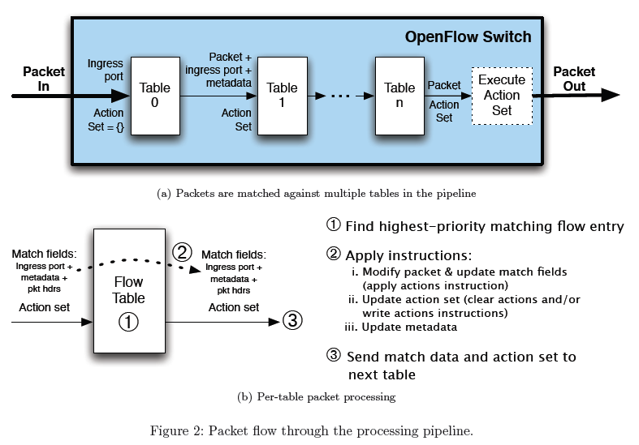
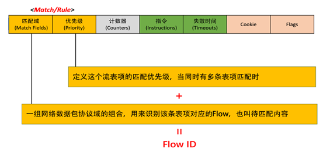
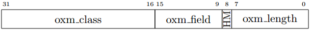
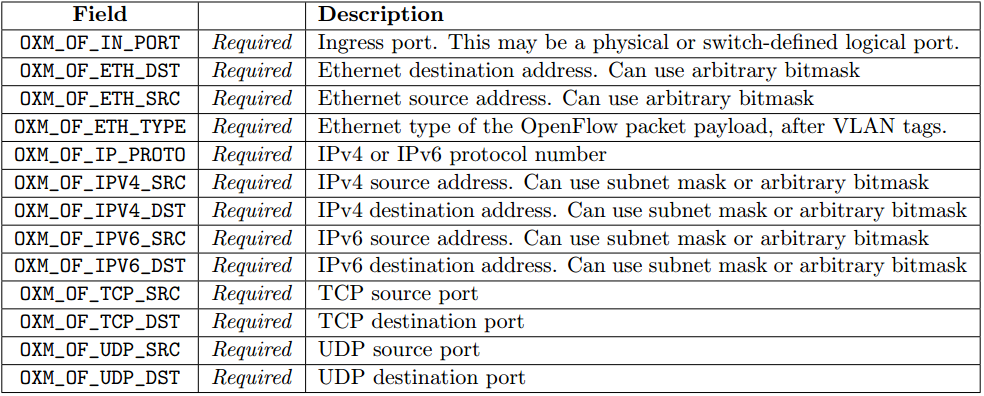

# OpenFlow flow

本文分析OpenFlow的流表。


## OpenFlow流水线处理流程



OpenFlow处理流程说明:

* 从table 0开始匹配，当匹配到的action是跳转到表时，只能跳转到更大的表， 即不允许循环；
* 当table N未匹配时，直接匹配table N+1（如果存在的话）；
* 按照优先级进行匹配，优先级priority字段值越大表示优先级越高（最小为0）；
* 当没有table匹配时，则上报table-miss错误；


## OpenFlow 流表



流表项说明：

* match fields：匹配项
* priority：优先级，数字越大优先级越高，最低优先级为0；
* counters：流表项被命中的次数，每次报文匹配到该流表项时，counters值会加一；
* instructions：流表项的操作，例如修改报文，从某个端口发出等等；
* timeouts：流表项在被switch删除的最大idle时长；
  * idle_timeout：非零值表示XX秒未匹配到此流表项，删除此流表项；
  * hard_timeout：非零值表示XX秒后删除此流表项；
* cookie：标识流表项的时，可以用于更新流表等， 数据面转发时不使用该值；


### OpenFlow match

```c
struct ofp_match {
  uint16_t type;         /* One of OFPMT_* */
  uint16_t length;       /* Length of ofp_match (excluding padding) */
  uint8_t oxm_fields[4]; /* OXMs start here - Make compiler happy */
};
OFP_ASSERT(sizeof(struct ofp_match) == 8);

enum ofp_match_type {
  OFPMT_STANDARD = 0, /* Deprecated. OpenFlow 1.1 */
  OFPMT_OXM = 1,      /* OpenFlow Extensible Match */
};
```



match tlv说明：

* 每个tlv的长度是固定的，即4+数据长度，数据长度由match field确定；
* 是否有由mask由match field决定；
* 对于有mask的field，如果mask标记置1，那么数据长度为2*单个数据长度，其中一个为实际数据，一个为mask；


```c
enum ofp_oxm_class {
  OFPXMC_NXM_0 = 0x0000, /* Backward compatibility with NXM */
  OFPXMC_NXM_1 = 0x0001, /* Backward compatibility with NXM */
  OFPXMC_OPENFLOW_BASIC = 0x8000, /* Basic class for OpenFlow */
  OFPXMC_EXPERIMENTER = 0xFFFF, /* Experimenter class */
};

enum oxm_ofb_match_fields {
  OFPXMT_OFB_IN_PORT = 0,         /* Switch input port. */
  OFPXMT_OFB_IN_PHY_PORT = 1,     /* Switch physical input port. */
  OFPXMT_OFB_METADATA = 2,        /* Metadata passed between tables. */
  OFPXMT_OFB_ETH_DST = 3,         /* Ethernet destination address. */
  OFPXMT_OFB_ETH_SRC = 4,         /* Ethernet source address. */
  OFPXMT_OFB_ETH_TYPE = 5,        /* Ethernet frame type. */
  OFPXMT_OFB_VLAN_VID = 6,        /* VLAN id. */
  OFPXMT_OFB_VLAN_PCP = 7,        /* VLAN priority. */
  OFPXMT_OFB_IP_DSCP = 8,         /* IP DSCP (6 bits in ToS field). */
  OFPXMT_OFB_IP_ECN = 9,          /* IP ECN (2 bits in ToS field). */
  OFPXMT_OFB_IP_PROTO = 10,       /* IP protocol. */
  OFPXMT_OFB_IPV4_SRC = 11,       /* IPv4 source address. */
  OFPXMT_OFB_IPV4_DST = 12,       /* IPv4 destination address. */
  OFPXMT_OFB_TCP_SRC = 13,        /* TCP source port. */
  OFPXMT_OFB_TCP_DST = 14,        /* TCP destination port. */
  OFPXMT_OFB_UDP_SRC = 15,        /* UDP source port. */
  OFPXMT_OFB_UDP_DST = 16,        /* UDP destination port. */
  OFPXMT_OFB_SCTP_SRC = 17,       /* SCTP source port. */
  OFPXMT_OFB_SCTP_DST = 18,       /* SCTP destination port. */
  OFPXMT_OFB_ICMPV4_TYPE = 19,    /* ICMP type. */
  OFPXMT_OFB_ICMPV4_CODE = 20,    /* ICMP code. */
  OFPXMT_OFB_ARP_OP = 21,         /* ARP opcode. */
  OFPXMT_OFB_ARP_SPA = 22,        /* ARP source IPv4 address. */
  OFPXMT_OFB_ARP_TPA = 23,        /* ARP target IPv4 address. */
  OFPXMT_OFB_ARP_SHA = 24,        /* ARP source hardware address. */
  OFPXMT_OFB_ARP_THA = 25,        /* ARP target hardware address. */
  OFPXMT_OFB_IPV6_SRC = 26,       /* IPv6 source address. */
  OFPXMT_OFB_IPV6_DST = 27,       /* IPv6 destination address. */
  OFPXMT_OFB_IPV6_FLABEL = 28,    /* IPv6 Flow Label */
  OFPXMT_OFB_ICMPV6_TYPE = 29,    /* ICMPv6 type. */
  OFPXMT_OFB_ICMPV6_CODE = 30,    /* ICMPv6 code. */
  OFPXMT_OFB_IPV6_ND_TARGET = 31, /* Target address for ND. */
  OFPXMT_OFB_IPV6_ND_SLL = 32,    /* Source link-layer for ND. */
  OFPXMT_OFB_IPV6_ND_TLL = 33,    /* Target link-layer for ND. */
  OFPXMT_OFB_MPLS_LABEL = 34,     /* MPLS label. */
  OFPXMT_OFB_MPLS_TC = 35,        /* MPLS TC. */
  OFPXMT_OFP_MPLS_BOS = 36,       /* MPLS BoS bit. */
  OFPXMT_OFB_PBB_ISID = 37,       /* PBB I-SID. */
  OFPXMT_OFB_TUNNEL_ID = 38,      /* Logical Port Metadata. */
  OFPXMT_OFB_IPV6_EXTHDR = 39,    /* IPv6 Extension Header pseudo-field */
};
```

OpenFlow必须要支持的match项：




### OpenFlow instruction

```c
enum ofp_instruction_type {
  OFPIT_GOTO_TABLE = 1,        /* Setup the next table in the lookup pipeline */
  OFPIT_WRITE_METADATA = 2,    /* Setup the metadata field for use later in pipeline */
  OFPIT_WRITE_ACTIONS = 3,     /* Write the action(s) onto the datapath action set */
  OFPIT_APPLY_ACTIONS = 4,     /* Applies the action(s) immediately */
  OFPIT_CLEAR_ACTIONS = 5,     /* Clears all actions from the datapath action set */
  OFPIT_METER = 6,             /* Apply meter (rate limiter) */
  OFPIT_EXPERIMENTER = 0xFFFF  /* Experimenter instruction */
};

struct ofp_instruction {
  uint16_t type; /* Instruction type */
  uint16_t len;  /* Length of this struct in bytes. */
};
OFP_ASSERT(sizeof(struct ofp_instruction) == 4);

/* Instruction structure for OFPIT_GOTO_TABLE */
struct ofp_instruction_goto_table {
  uint16_t type;    /* OFPIT_GOTO_TABLE */
  uint16_t len;     /* Length of this struct in bytes. */
  uint8_t table_id; /* Set next table in the lookup pipeline */
  uint8_t pad[3];   /* Pad to 64 bits. */
};
OFP_ASSERT(sizeof(struct ofp_instruction_goto_table) == 8);

/* Instruction structure for OFPIT_WRITE_METADATA */
struct ofp_instruction_write_metadata {
  uint16_t type;          /* OFPIT_WRITE_METADATA */
  uint16_t len;           /* Length of this struct in bytes. */
  uint8_t pad[4];         /* Align to 64-bits */
  uint64_t metadata;      /* Metadata value to write */
  uint64_t metadata_mask; /* Metadata write bitmask */
};
OFP_ASSERT(sizeof(struct ofp_instruction_write_metadata) == 24);

/* Instruction structure for OFPIT_WRITE/APPLY/CLEAR_ACTIONS */
struct ofp_instruction_actions {
  uint16_t type;                       /* One of OFPIT_*_ACTIONS */
  uint16_t len;                        /* Length of this struct in bytes. */
  uint8_t pad[4];                      /* Align to 64-bits */
  struct ofp_action_header actions[0]; /* Actions associated with OFPIT_WRITE_ACTIONS and OFPIT_APPLY_ACTIONS */
};
OFP_ASSERT(sizeof(struct ofp_instruction_actions) == 8);

/* Instruction structure for OFPIT_METER */
struct ofp_instruction_meter {
  uint16_t type;     /* OFPIT_METER */
  uint16_t len;      /* Length is 8. */
  uint32_t meter_id; /* Meter instance. */
};
OFP_ASSERT(sizeof(struct ofp_instruction_meter) == 8);

/* Instruction structure for experimental instructions */
struct ofp_instruction_experimenter {
  uint16_t type;         /* OFPIT_EXPERIMENTER */
  uint16_t len;          /* Length of this struct in bytes */
  uint32_t experimenter; /* Experimenter ID which takes the same form as in struct ofp_experimenter_header. */
/* Experimenter-defined arbitrary additional data. */
};
OFP_ASSERT(sizeof(struct ofp_instruction_experimenter) == 8);
```


### OpenFlow action

```c
enum ofp_action_type {
  OFPAT_OUTPUT = 0,        /* Output to switch port. */
  OFPAT_COPY_TTL_OUT = 11, /* Copy TTL "outwards" -- from next-to-outermost to outermost */
  OFPAT_COPY_TTL_IN = 12,  /* Copy TTL "inwards" -- from outermost to next-to-outermost */
  OFPAT_SET_MPLS_TTL = 15, /* MPLS TTL */
  OFPAT_DEC_MPLS_TTL = 16, /* Decrement MPLS TTL */
  OFPAT_PUSH_VLAN = 17,    /* Push a new VLAN tag */
  OFPAT_POP_VLAN = 18,     /* Pop the outer VLAN tag */
  OFPAT_PUSH_MPLS = 19,    /* Push a new MPLS tag */
  OFPAT_POP_MPLS = 20,     /* Pop the outer MPLS tag */
  OFPAT_SET_QUEUE = 21,    /* Set queue id when outputting to a port */
  OFPAT_GROUP = 22,        /* Apply group. */
  OFPAT_SET_NW_TTL = 23,   /* IP TTL. */
  OFPAT_DEC_NW_TTL = 24,   /* Decrement IP TTL. */
  OFPAT_SET_FIELD = 25,    /* Set a header field using OXM TLV format. */
  OFPAT_PUSH_PBB = 26,     /* Push a new PBB service tag (I-TAG) */
  OFPAT_POP_PBB = 27,      /* Pop the outer PBB service tag (I-TAG) */
  OFPAT_EXPERIMENTER = 0xffff
};

struct ofp_action_header {
  uint16_t type; /* One of OFPAT_*. */
  uint16_t len;  /* Length of action, including this header. This is the length of action, including any padding to make it 64-bit aligned. */
  uint8_t pad[4];
};
OFP_ASSERT(sizeof(struct ofp_action_header) == 8);

/* Action structure for OFPAT_OUTPUT, which sends packets out 'port'. */
struct ofp_action_output {
  uint16_t type;     /* OFPAT_OUTPUT. */
  uint16_t len;      /* Length is 16. */
  uint32_t port;     /* Output port. */
  uint16_t max_len;  /* Max length to send to controller. */
  uint8_t pad[6];    /* Pad to 64 bits. */
};
OFP_ASSERT(sizeof(struct ofp_action_output) == 16);

/* Action structure for OFPAT_GROUP. */
struct ofp_action_group {
  uint16_t type;     /* OFPAT_GROUP. */
  uint16_t len;      /* Length is 8. */
  uint32_t group_id; /* Group identifier. */
};
OFP_ASSERT(sizeof(struct ofp_action_group) == 8);

/* OFPAT_SET_QUEUE action struct: send packets to given queue on port. */
struct ofp_action_set_queue {
  uint16_t type;     /* OFPAT_SET_QUEUE. */
  uint16_t len;      /* Len is 8. */
  uint32_t queue_id; /* Queue id for the packets. */
};
OFP_ASSERT(sizeof(struct ofp_action_set_queue) == 8);

/* Action structure for OFPAT_SET_MPLS_TTL. */
struct ofp_action_mpls_ttl {
  uint16_t type;    /* OFPAT_SET_MPLS_TTL. */
  uint16_t len;     /* Length is 8. */
  uint8_t mpls_ttl; /* MPLS TTL */
  uint8_t pad[3];
};
OFP_ASSERT(sizeof(struct ofp_action_mpls_ttl) == 8);

/* Action structure for OFPAT_SET_NW_TTL. */
struct ofp_action_nw_ttl {
  uint16_t type;   /* OFPAT_SET_NW_TTL. */
  uint16_t len;   /* Length is 8. */
  uint8_t nw_ttl; /* IP TTL */
  uint8_t pad[3];
};
OFP_ASSERT(sizeof(struct ofp_action_nw_ttl) == 8);

/* Action structure for OFPAT_PUSH_VLAN/MPLS/PBB. */
struct ofp_action_push {
  uint16_t type;      /* OFPAT_PUSH_VLAN/MPLS/PBB. */
  uint16_t len;       /* Length is 8. */
  uint16_t ethertype; /* Ethertype */
  uint8_t pad[2];
};
OFP_ASSERT(sizeof(struct ofp_action_push) == 8);

/* Action structure for OFPAT_POP_MPLS. */
struct ofp_action_pop_mpls {
  uint16_t type;      /* OFPAT_POP_MPLS. */
  uint16_t len;       /* Length is 8. */
  uint16_t ethertype; /* Ethertype */
  uint8_t pad[2];
};
OFP_ASSERT(sizeof(struct ofp_action_pop_mpls) == 8);

/* Action structure for OFPAT_SET_FIELD. */
/* Set field 支持的字段包括oxm_ofb_match_fields定义的字段，以及OXM_OF_XXX定义的字段 */
struct ofp_action_set_field {
uint16_t type;    /* OFPAT_SET_FIELD. */
uint16_t len;     /* Length is padded to 64 bits. */
uint8_t field[4]; /* OXM TLV - Make compiler happy */
};
OFP_ASSERT(sizeof(struct ofp_action_set_field) == 8);

/* Action header for OFPAT_EXPERIMENTER. The rest of the body is experimenter-defined. */
struct ofp_action_experimenter_header {
  uint16_t type;         /* OFPAT_EXPERIMENTER. */
  uint16_t len;          /* Length is a multiple of 8. */
  uint32_t experimenter; /* Experimenter ID which takes the same form as in struct ofp_experimenter_header. */
};
OFP_ASSERT(sizeof(struct ofp_action_experimenter_header) == 8);
```


