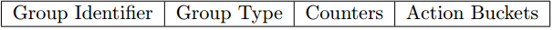

# OpenFlow Group

OpenFlow Group提供了类似LB的功能。

## Group 定义

Group字段说明：

* group identifier: group id值，唯一标识一个group项；
* group type: 组类型，决定了group的处理方式；
* counters: 统计值，表示该group项被匹配到的次数；
* action buckets: group的action集合；

### Group Type

规范不要求switch支持所有的类型，仅需要满足required的类型，Group的类型包括：

* all（Required）
  * 执行group的所有action buckets，用于组播或广播场景，
* select（Optional）
  * 执行group的某一个action bucket，选择算法由swtich实现，可以是hash、round robin、基于负载等等。 当某个bucket失效时，可以切换到其他的bucket。
* indirect（Required）
  * 支持group中的action bucket。 该group仅支持一个bucket。 供其他flow entries或group共用此bucket。
* fast failover（Optional）
  * 执行第一个活着的action bucket。 每个bucket关联一个端口或group。
