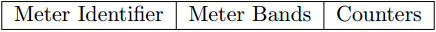
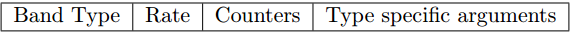

# OpenFlow Meter

OpenFlow Meter提供了流控功能，通过和queue结合，可以提供DiffServ能力。

## Meter 定义

Meter字段说明：

* meter identifier: meter id值，唯一标识一个meter；
* meter bands: 一个无序的Meter Band集合，每个Meter Band指明了带宽速率以及处理数据包的行为。
* counters: 统计值，表示该meter被执行的次数；

### Meter Bands

每一个Meter都可以包含多个Meter Band。每个Meter Band定义了速率，以及报文处理方法。

Meter Bands字段说明：

* band type: 定义了数据包的处理方式；
* rate: 定义了Band可以应用的最低速率；
* counters: 被该Meter Band处理过的数据包的统计量
* type specific arguments: 某些Meter Band有一些额外的参数；

Band type支持两种：

* drop: 丢弃报文，可以被用来实现带宽限速；
* dscp remark: 增加数据包IP头DSCP域的丢弃优先级，可以被用来实现一个DiffServ策略器。
