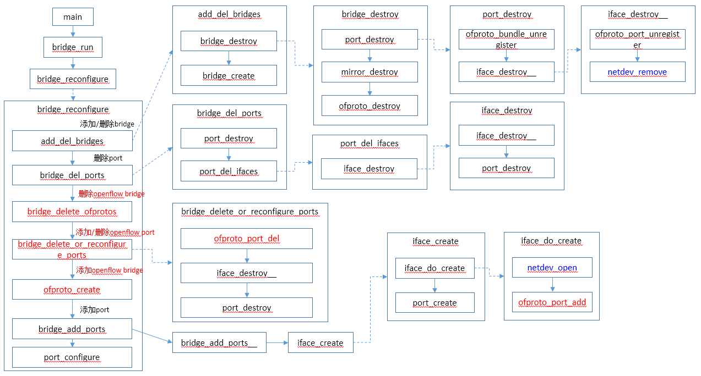
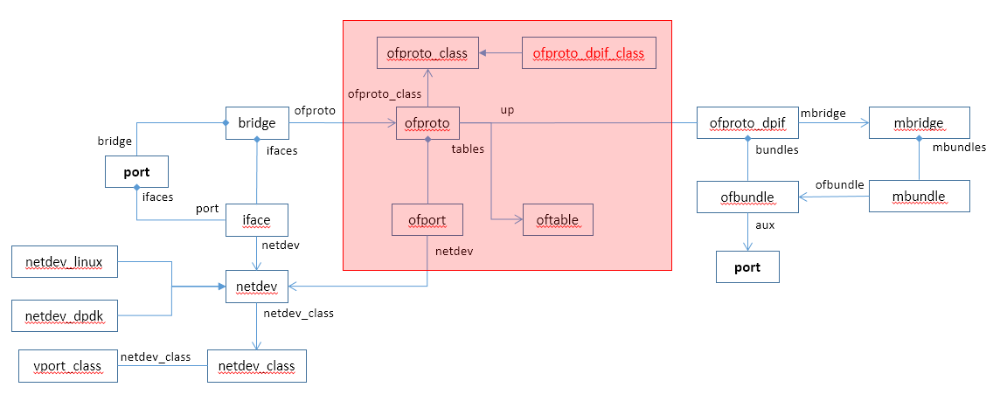

# Bridge和Port操作

本文介绍OVS添加/删除/配置bridge，添加/删除/配置端口的调用流程化，操作的总入口是bridge_reconfigure函数。

总体调用流程如下：



总体数据结构如下：




# bridge_reconfigure

```c
static void bridge_reconfigure(const struct ovsrec_open_vswitch *ovs_cfg)
{
    unsigned long int *splinter_vlans;
    struct sockaddr_in *managers;
    struct bridge *br, *next;
    int sflow_bridge_number;
    size_t n_managers;

    COVERAGE_INC(bridge_reconfigure);

    ofproto_set_flow_limit(smap_get_int(&ovs_cfg->other_config, "flow-limit",
                                        OFPROTO_FLOW_LIMIT_DEFAULT));
    ofproto_set_max_idle(smap_get_int(&ovs_cfg->other_config, "max-idle",
                                      OFPROTO_MAX_IDLE_DEFAULT));
    ofproto_set_n_dpdk_rxqs(smap_get_int(&ovs_cfg->other_config,
                                         "n-dpdk-rxqs", 0));
    ofproto_set_cpu_mask(smap_get(&ovs_cfg->other_config, "pmd-cpu-mask"));

    ofproto_set_threads(
        smap_get_int(&ovs_cfg->other_config, "n-handler-threads", 0),
        smap_get_int(&ovs_cfg->other_config, "n-revalidator-threads", 0));

    /* Destroy "struct bridge"s, "struct port"s, and "struct iface"s according
     * to 'ovs_cfg', with only very minimal configuration otherwise.
     *
     * This is mostly an update to bridge data structures. Nothing is pushed
     * down to ofproto or lower layers. */
    add_del_bridges(ovs_cfg);                           // 添加删除bridges
    splinter_vlans = collect_splinter_vlans(ovs_cfg);
    HMAP_FOR_EACH (br, node, &all_bridges) {
        bridge_collect_wanted_ports(br, splinter_vlans, &br->wanted_ports);
        bridge_del_ports(br, &br->wanted_ports);      //删除端口
    }
    free(splinter_vlans);

    /* Start pushing configuration changes down to the ofproto layer:
     *
     *   - Delete ofprotos that are no longer configured.
     *
     *   - Delete ports that are no longer configured.
     *
     *   - Reconfigure existing ports to their desired configurations, or
     *     delete them if not possible.
     *
     * We have to do all the deletions before we can do any additions, because
     * the ports to be added might require resources that will be freed up by
     * deletions (they might especially overlap in name). */
    bridge_delete_ofprotos();                //删除未配置或配置错误的openflow bridge
    HMAP_FOR_EACH (br, node, &all_bridges) {
        if (br->ofproto) {
            bridge_delete_or_reconfigure_ports(br);     // 添加/删除openflow端口
        }
    }

    /* Finish pushing configuration changes to the ofproto layer:
     *
     *     - Create ofprotos that are missing.
     *
     *     - Add ports that are missing. */
    HMAP_FOR_EACH_SAFE (br, next, node, &all_bridges) {
        if (!br->ofproto) {
            int error;

            error = ofproto_create(br->name, br->type, &br->ofproto);   //添加openflow bridge
            if (error) {
                VLOG_ERR("failed to create bridge %s: %s", br->name,
                         ovs_strerror(error));
                shash_destroy(&br->wanted_ports);
                bridge_destroy(br, true);
            } else {
                /* Trigger storing datapath version. */
                seq_change(connectivity_seq_get());
            }
        }
    }
    HMAP_FOR_EACH (br, node, &all_bridges) {
        bridge_add_ports(br, &br->wanted_ports);     //添加端口
        shash_destroy(&br->wanted_ports);
    }

    reconfigure_system_stats(ovs_cfg);

    /* Complete the configuration. */
    sflow_bridge_number = 0;
    collect_in_band_managers(ovs_cfg, &managers, &n_managers);
    HMAP_FOR_EACH (br, node, &all_bridges) {
        struct port *port;

        /* We need the datapath ID early to allow LACP ports to use it as the
         * default system ID. */
        bridge_configure_datapath_id(br);

        HMAP_FOR_EACH (port, hmap_node, &br->ports) {
            struct iface *iface;

            port_configure(port);

            LIST_FOR_EACH (iface, port_elem, &port->ifaces) {
                iface_set_ofport(iface->cfg, iface->ofp_port);
                /* Clear eventual previous errors */
                ovsrec_interface_set_error(iface->cfg, NULL);
                iface_configure_cfm(iface);
                iface_configure_qos(iface, port->cfg->qos);
                iface_set_mac(br, port, iface);
                ofproto_port_set_bfd(br->ofproto, iface->ofp_port,
                                     &iface->cfg->bfd);
                ofproto_port_set_lldp(br->ofproto, iface->ofp_port,
                                      &iface->cfg->lldp);
            }
        }
        bridge_configure_mirrors(br);
        bridge_configure_forward_bpdu(br);
        bridge_configure_mac_table(br);
        bridge_configure_mcast_snooping(br);
        bridge_configure_remotes(br, managers, n_managers);
        bridge_configure_netflow(br);
        bridge_configure_sflow(br, &sflow_bridge_number);
        bridge_configure_ipfix(br);
        bridge_configure_spanning_tree(br);
        bridge_configure_tables(br);
        bridge_configure_dp_desc(br);
        bridge_configure_aa(br);
    }
    free(managers);

    /* The ofproto-dpif provider does some final reconfiguration in its
     * ->type_run() function.  We have to call it before notifying the database
     * client that reconfiguration is complete, otherwise there is a very
     * narrow race window in which e.g. ofproto/trace will not recognize the
     * new configuration (sometimes this causes unit test failures). */
    bridge_run__();
}
```


## add_del_bridges

```
static void add_del_bridges(const struct ovsrec_open_vswitch *cfg)
{
    struct bridge *br, *next;
    struct shash_node *node;
    struct shash new_br;
    size_t i;

    /* Collect new bridges' names and types. */
    shash_init(&new_br);
    for (i = 0; i < cfg->n_bridges; i++) {    //遍历所有bridge配置
        static struct vlog_rate_limit rl = VLOG_RATE_LIMIT_INIT(1, 5);
        const struct ovsrec_bridge *br_cfg = cfg->bridges[i];

        if (strchr(br_cfg->name, '/')) {
            /* Prevent remote ovsdb-server users from accessing arbitrary
             * directories, e.g. consider a bridge named "../../../etc/". */
            VLOG_WARN_RL(&rl, "ignoring bridge with invalid name \"%s\"",
                         br_cfg->name);
        } else if (!shash_add_once(&new_br, br_cfg->name, br_cfg)) {    //添加到shash中
            VLOG_WARN_RL(&rl, "bridge %s specified twice", br_cfg->name);
        }
    }

    /* Get rid of deleted bridges or those whose types have changed.
     * Update 'cfg' of bridges that still exist. */
    HMAP_FOR_EACH_SAFE (br, next, node, &all_bridges) {    //遍历所有bridge，全局变量
        br->cfg = shash_find_data(&new_br, br->name);      //通过名字在shash中查找配置
        if (!br->cfg || strcmp(br->type, ofproto_normalize_type(   //如果
                                   br->cfg->datapath_type))) {
            bridge_destroy(br, true);    //删除bridge
        }
    }

    /* Add new bridges. */
    SHASH_FOR_EACH(node, &new_br) {    //遍历所有的bridge配置
        const struct ovsrec_bridge *br_cfg = node->data; 
        struct bridge *br = bridge_lookup(br_cfg->name);    //未在全局bridge map对象中找到该bridge
        if (!br) {
            bridge_create(br_cfg);    //添加bridge
        }
    }

    shash_destroy(&new_br);
}
```


### bridge_destroy

```
static void bridge_destroy(struct bridge *br, bool del)
{
    if (br) {
        struct mirror *mirror, *next_mirror;
        struct port *port, *next_port;

        HMAP_FOR_EACH_SAFE (port, next_port, hmap_node, &br->ports) {   //销毁port
            port_destroy(port);
        }
        HMAP_FOR_EACH_SAFE (mirror, next_mirror, hmap_node, &br->mirrors) {   //删除mirror
            mirror_destroy(mirror);
        }

        hmap_remove(&all_bridges, &br->node);        //从全局bridge hmap中删除 bridge
        ofproto_destroy(br->ofproto, del);           //删除ofproto bridge
        hmap_destroy(&br->ifaces);
        hmap_destroy(&br->ports);
        hmap_destroy(&br->iface_by_name);
        hmap_destroy(&br->mirrors);
        hmap_destroy(&br->mappings);
        free(br->name);
        free(br->type);
        free(br);
    }
}
```


### bridge_create

```
static void
bridge_create(const struct ovsrec_bridge *br_cfg)
{
    struct bridge *br;

    ovs_assert(!bridge_lookup(br_cfg->name));
    br = xzalloc(sizeof *br);    //创建bridge对象

    br->name = xstrdup(br_cfg->name);
    br->type = xstrdup(ofproto_normalize_type(br_cfg->datapath_type));
    br->cfg = br_cfg;

    /* Derive the default Ethernet address from the bridge's UUID.  This should
     * be unique and it will be stable between ovs-vswitchd runs.  */
    memcpy(&br->default_ea, &br_cfg->header_.uuid, ETH_ADDR_LEN);   //以UUID设置为mac地址
    eth_addr_mark_random(&br->default_ea);   //设置为非组播mac地址

    hmap_init(&br->ports);
    hmap_init(&br->ifaces);
    hmap_init(&br->iface_by_name);
    hmap_init(&br->mirrors);

    hmap_init(&br->mappings);
    hmap_insert(&all_bridges, &br->node, hash_string(br->name, 0));  //添加到全局变量中
}
```


## bridge_collect_wanted_ports

```C
static void bridge_collect_wanted_ports(struct bridge *br,
                            const unsigned long int *splinter_vlans,
                            struct shash *wanted_ports)
{
    size_t i;

    shash_init(wanted_ports);

    for (i = 0; i < br->cfg->n_ports; i++) {    //遍历bridge的端口配置信息
        const char *name = br->cfg->ports[i]->name;
        if (!shash_add_once(wanted_ports, name, br->cfg->ports[i])) {   //添加到需要端口中
            VLOG_WARN("bridge %s: %s specified twice as bridge port",
                      br->name, name);
        }
    }
    if (bridge_get_controllers(br, NULL)
        && !shash_find(wanted_ports, br->name)) {    //如果internal port不存在，则添加internal port
        VLOG_WARN("bridge %s: no port named %s, synthesizing one",
                  br->name, br->name);

        ovsrec_interface_init(&br->synth_local_iface);
        ovsrec_port_init(&br->synth_local_port);

        br->synth_local_port.interfaces = &br->synth_local_ifacep;
        br->synth_local_port.n_interfaces = 1;
        br->synth_local_port.name = br->name;

        br->synth_local_iface.name = br->name;
        br->synth_local_iface.type = "internal";

        br->synth_local_ifacep = &br->synth_local_iface;

        shash_add(wanted_ports, br->name, &br->synth_local_port);
    }

    if (splinter_vlans) {
        add_vlan_splinter_ports(br, splinter_vlans, wanted_ports);
    }
}
```


## bridge_del_ports

```C
static void bridge_del_ports(struct bridge *br, const struct shash *wanted_ports)
{
    struct shash_node *port_node;
    struct port *port, *next;

    /* Get rid of deleted ports.
     * Get rid of deleted interfaces on ports that still exist. */
    HMAP_FOR_EACH_SAFE (port, next, hmap_node, &br->ports) {
        port->cfg = shash_find_data(wanted_ports, port->name);
        if (!port->cfg) {
            port_destroy(port);       //删除port
        } else {
            port_del_ifaces(port);    //清除删除的ifaces
        }
    }

    /* Update iface->cfg and iface->type in interfaces that still exist. */
    SHASH_FOR_EACH (port_node, wanted_ports) {
        const struct ovsrec_port *port = port_node->data;
        size_t i;

        for (i = 0; i < port->n_interfaces; i++) {
            const struct ovsrec_interface *cfg = port->interfaces[i];
            struct iface *iface = iface_lookup(br, cfg->name);
            const char *type = iface_get_type(cfg, br->cfg);

            if (iface) {
                iface->cfg = cfg;
                iface->type = type;
            } else if (!strcmp(type, "null")) {
                VLOG_WARN_ONCE("%s: The null interface type is deprecated and"
                               " may be removed in February 2013. Please email"
                               " dev@openvswitch.org with concerns.",
                               cfg->name);
            } else {
                /* We will add new interfaces later. */
            }
        }
    }
}
```


### port_destroy

```c
static void port_destroy(struct port *port)
{
    if (port) {
        struct bridge *br = port->bridge;
        struct iface *iface, *next;

        if (br->ofproto) {
            ofproto_bundle_unregister(br->ofproto, port);  //清除ofport bundle
        }

        LIST_FOR_EACH_SAFE (iface, next, port_elem, &port->ifaces) {
            iface_destroy__(iface);   //销毁port的所有iface
        }

        hmap_remove(&br->ports, &port->hmap_node);
        free(port->name);
        free(port);
    }
}

static void iface_destroy__(struct iface *iface)
{
    if (iface) {
        struct port *port = iface->port;
        struct bridge *br = port->bridge;

        if (br->ofproto && iface->ofp_port != OFPP_NONE) {
            ofproto_port_unregister(br->ofproto, iface->ofp_port);
        }

        if (iface->ofp_port != OFPP_NONE) {
            hmap_remove(&br->ifaces, &iface->ofp_port_node);
        }

        list_remove(&iface->port_elem);
        hmap_remove(&br->iface_by_name, &iface->name_node);

        /* The user is changing configuration here, so netdev_remove needs to be
         * used as opposed to netdev_close */
        netdev_remove(iface->netdev);   //从全局netdev设备中，删除netdev

        free(iface->name);
        free(iface);
    }
}
```


### port_del_ifaces

```c
static void port_del_ifaces(struct port *port)
{
    struct iface *iface, *next;
    struct sset new_ifaces;
    size_t i;

    /* Collect list of new interfaces. */
    sset_init(&new_ifaces);
    for (i = 0; i < port->cfg->n_interfaces; i++) {
        const char *name = port->cfg->interfaces[i]->name;
        const char *type = port->cfg->interfaces[i]->type;
        if (strcmp(type, "null")) {
            sset_add(&new_ifaces, name);   //新的ifaces
        }
    }

    /* Get rid of deleted interfaces. */
    LIST_FOR_EACH_SAFE (iface, next, port_elem, &port->ifaces) {  //遍历所有的ifaces
        if (!sset_contains(&new_ifaces, iface->name)) {  //ifaces不在新的ifaces中则删除iface
            iface_destroy(iface);
        }
    }

    sset_destroy(&new_ifaces);
}

static void iface_destroy(struct iface *iface)
{
    if (iface) {
        struct port *port = iface->port;

        iface_destroy__(iface);
        if (list_is_empty(&port->ifaces)) {
            port_destroy(port);
        }
    }
}
```


## bridge_delete_ofprotos

```c
static void bridge_delete_ofprotos(void)
{
    struct bridge *br;
    struct sset names;
    struct sset types;
    const char *type;

    /* Delete ofprotos with no bridge or with the wrong type. */
    sset_init(&names);
    sset_init(&types);
    ofproto_enumerate_types(&types);
    SSET_FOR_EACH (type, &types) {
        const char *name;

        ofproto_enumerate_names(type, &names);
        SSET_FOR_EACH (name, &names) {
            br = bridge_lookup(name);
            if (!br || strcmp(type, br->type)) {
                ofproto_delete(name, type);
            }
        }
    }
    sset_destroy(&names);
    sset_destroy(&types);
}
```


## bridge_delete_or_reconfigure_ports

```c
static void bridge_delete_or_reconfigure_ports(struct bridge *br)
{
    struct ofproto_port ofproto_port;
    struct ofproto_port_dump dump;

    struct sset ofproto_ports;
    struct port *port, *port_next;

    /* List of "ofp_port"s to delete.  We make a list instead of deleting them
     * right away because ofproto implementations aren't necessarily able to
     * iterate through a changing list of ports in an entirely robust way. */
    ofp_port_t *del;
    size_t n, allocated;
    size_t i;

    del = NULL;
    n = allocated = 0;
    sset_init(&ofproto_ports);

    /* Main task: Iterate over the ports in 'br->ofproto' and remove the ports
     * that are not configured in the database.  (This commonly happens when
     * ports have been deleted, e.g. with "ovs-vsctl del-port".)
     *
     * Side tasks: Reconfigure the ports that are still in 'br'.  Delete ports
     * that have the wrong OpenFlow port number (and arrange to add them back
     * with the correct OpenFlow port number). */
    OFPROTO_PORT_FOR_EACH (&ofproto_port, &dump, br->ofproto) {    //遍历openflow端口
        ofp_port_t requested_ofp_port;
        struct iface *iface;

        sset_add(&ofproto_ports, ofproto_port.name);

        iface = iface_lookup(br, ofproto_port.name);   //根据端口名查找iface
        if (!iface) {     //如果iface不存在，则删除该openflow端口
            /* No such iface is configured, so we should delete this
             * ofproto_port.
             *
             * As a corner case exception, keep the port if it's a bond fake
             * interface. */
            if (bridge_has_bond_fake_iface(br, ofproto_port.name)
                && !strcmp(ofproto_port.type, "internal")) {
                continue;
            }
            goto delete;
        }

		//端口类型不匹配或者更新netdev属性失败，删除该端口和iface
        if (strcmp(ofproto_port.type, iface->type)    
            || netdev_set_config(iface->netdev, &iface->cfg->options, NULL)) {
            /* The interface is the wrong type or can't be configured.
             * Delete it. */
            goto delete;
        }

        /* If the requested OpenFlow port for 'iface' changed, and it's not
         * already the correct port, then we might want to temporarily delete
         * this interface, so we can add it back again with the new OpenFlow
         * port number. */
        requested_ofp_port = iface_get_requested_ofp_port(iface->cfg);  //得到配置的openflow端口号
        if (iface->ofp_port != OFPP_LOCAL &&
            requested_ofp_port != OFPP_NONE &&
            requested_ofp_port != iface->ofp_port) {  //端口和当前iface的端口不一致
            ofp_port_t victim_request;
            struct iface *victim;

            /* Check for an existing OpenFlow port currently occupying
             * 'iface''s requested port number.  If there isn't one, then
             * delete this port.  Otherwise we need to consider further. */
            victim = iface_from_ofp_port(br, requested_ofp_port);  //根据请求的openflow端口号查询iface
            if (!victim) {
                goto delete;   //根据请求的openflow端口号未查询到iface，则删除当前iface
            }

            /* 'victim' is a port currently using 'iface''s requested port
             * number.  Unless 'victim' specifically requested that port
             * number, too, then we can delete both 'iface' and 'victim'
             * temporarily.  (We'll add both of them back again later with new
             * OpenFlow port numbers.)
             *
             * If 'victim' did request port number 'requested_ofp_port', just
             * like 'iface', then that's a configuration inconsistency that we
             * can't resolve.  We might as well let it keep its current port
             * number. */
            victim_request = iface_get_requested_ofp_port(victim->cfg);  
            if (victim_request != requested_ofp_port) {  //如果victim的配置不一致，则删除victim
                del = add_ofp_port(victim->ofp_port, del, &n, &allocated);
                iface_destroy(victim);
                goto delete;      //同时也需要删除iface
            }
        }

        /* Keep it. */
        continue;

    delete:
        iface_destroy(iface);   
        del = add_ofp_port(ofproto_port.ofp_port, del, &n, &allocated);   //openflow端口添加到删除列表中
    }
    for (i = 0; i < n; i++) {
        ofproto_port_del(br->ofproto, del[i]);    //删除openflow端口
    }
    free(del);

    /* Iterate over this module's idea of interfaces in 'br'.  Remove any ports
     * that we didn't see when we iterated through the datapath, i.e. ports
     * that disappeared underneath use.  This is an unusual situation, but it
     * can happen in some cases:
     *
     *     - An admin runs a command like "ovs-dpctl del-port" (which is a bad
     *       idea but could happen).
     *
     *     - The port represented a device that disappeared, e.g. a tuntap
     *       device destroyed via "tunctl -d", a physical Ethernet device
     *       whose module was just unloaded via "rmmod", or a virtual NIC for a
     *       VM whose VM was just terminated. */
    HMAP_FOR_EACH_SAFE (port, port_next, hmap_node, &br->ports) {
        struct iface *iface, *iface_next;

        LIST_FOR_EACH_SAFE (iface, iface_next, port_elem, &port->ifaces) {
            if (!sset_contains(&ofproto_ports, iface->name)) {
                iface_destroy__(iface);
            }
        }

        if (list_is_empty(&port->ifaces)) {
            port_destroy(port);
        }
    }
    sset_destroy(&ofproto_ports);
}
```


## ofproto_create

```c
int
ofproto_create(const char *datapath_name, const char *datapath_type,
               struct ofproto **ofprotop)
{
    const struct ofproto_class *class;
    struct ofproto *ofproto;
    int error;
    int i;

    *ofprotop = NULL;

    datapath_type = ofproto_normalize_type(datapath_type);
    class = ofproto_class_find__(datapath_type);
    if (!class) {
        VLOG_WARN("could not create datapath %s of unknown type %s",
                  datapath_name, datapath_type);
        return EAFNOSUPPORT;
    }

    ofproto = class->alloc();
    if (!ofproto) {
        VLOG_ERR("failed to allocate datapath %s of type %s",
                 datapath_name, datapath_type);
        return ENOMEM;
    }

    /* Initialize. */
    ovs_mutex_lock(&ofproto_mutex);
    memset(ofproto, 0, sizeof *ofproto);
    ofproto->ofproto_class = class;
    ofproto->name = xstrdup(datapath_name);
    ofproto->type = xstrdup(datapath_type);
    hmap_insert(&all_ofprotos, &ofproto->hmap_node,
                hash_string(ofproto->name, 0));
    ofproto->datapath_id = 0;
    ofproto->forward_bpdu = false;
    ofproto->fallback_dpid = pick_fallback_dpid();
    ofproto->mfr_desc = NULL;
    ofproto->hw_desc = NULL;
    ofproto->sw_desc = NULL;
    ofproto->serial_desc = NULL;
    ofproto->dp_desc = NULL;
    ofproto->frag_handling = OFPC_FRAG_NORMAL;
    hmap_init(&ofproto->ports);
    hmap_init(&ofproto->ofport_usage);
    shash_init(&ofproto->port_by_name);
    simap_init(&ofproto->ofp_requests);
    ofproto->max_ports = ofp_to_u16(OFPP_MAX);
    ofproto->eviction_group_timer = LLONG_MIN;
    ofproto->tables = NULL;
    ofproto->n_tables = 0;
    ofproto->tables_version = CLS_MIN_VERSION;
    hindex_init(&ofproto->cookies);
    hmap_init(&ofproto->learned_cookies);
    list_init(&ofproto->expirable);
    ofproto->connmgr = connmgr_create(ofproto, datapath_name, datapath_name);
    guarded_list_init(&ofproto->rule_executes);
    ofproto->vlan_bitmap = NULL;
    ofproto->vlans_changed = false;
    ofproto->min_mtu = INT_MAX;
    ovs_rwlock_init(&ofproto->groups_rwlock);
    hmap_init(&ofproto->groups);
    ovs_mutex_unlock(&ofproto_mutex);
    ofproto->ogf.types = 0xf;
    ofproto->ogf.capabilities = OFPGFC_CHAINING | OFPGFC_SELECT_LIVENESS |
                                OFPGFC_SELECT_WEIGHT;
    for (i = 0; i < 4; i++) {
        ofproto->ogf.max_groups[i] = OFPG_MAX;
        ofproto->ogf.ofpacts[i] = (UINT64_C(1) << N_OFPACTS) - 1;
    }
    tun_metadata_init();

    error = ofproto->ofproto_class->construct(ofproto);
    if (error) {
        VLOG_ERR("failed to open datapath %s: %s",
                 datapath_name, ovs_strerror(error));
        connmgr_destroy(ofproto->connmgr);
        ofproto_destroy__(ofproto);
        return error;
    }

    /* Check that hidden tables, if any, are at the end. */
    ovs_assert(ofproto->n_tables);
    for (i = 0; i + 1 < ofproto->n_tables; i++) {
        enum oftable_flags flags = ofproto->tables[i].flags;
        enum oftable_flags next_flags = ofproto->tables[i + 1].flags;

        ovs_assert(!(flags & OFTABLE_HIDDEN) || next_flags & OFTABLE_HIDDEN);
    }

    ofproto->datapath_id = pick_datapath_id(ofproto);
    init_ports(ofproto);

    /* Initialize meters table. */
    if (ofproto->ofproto_class->meter_get_features) {
        ofproto->ofproto_class->meter_get_features(ofproto,
                                                   &ofproto->meter_features);
    } else {
        memset(&ofproto->meter_features, 0, sizeof ofproto->meter_features);
    }
    ofproto->meters = xzalloc((ofproto->meter_features.max_meters + 1)
                              * sizeof(struct meter *));

    /* Set the initial tables version. */
    ofproto_bump_tables_version(ofproto);

    *ofprotop = ofproto;
    return 0;
}
```


## bridge_add_ports

```c
static void bridge_add_ports(struct bridge *br, const struct shash *wanted_ports)
{
    /* First add interfaces that request a particular port number. */
    bridge_add_ports__(br, wanted_ports, true);

    /* Then add interfaces that want automatic port number assignment.
     * We add these afterward to avoid accidentally taking a specifically
     * requested port number. */
    bridge_add_ports__(br, wanted_ports, false);
}

static void bridge_add_ports__(struct bridge *br, const struct shash *wanted_ports,
                   bool with_requested_port)
{
    struct shash_node *port_node;

    SHASH_FOR_EACH (port_node, wanted_ports) {
        const struct ovsrec_port *port_cfg = port_node->data;
        size_t i;

        for (i = 0; i < port_cfg->n_interfaces; i++) {
            const struct ovsrec_interface *iface_cfg = port_cfg->interfaces[i];
            ofp_port_t requested_ofp_port;

            requested_ofp_port = iface_get_requested_ofp_port(iface_cfg);
            if ((requested_ofp_port != OFPP_NONE) == with_requested_port) {
                struct iface *iface = iface_lookup(br, iface_cfg->name);

                if (!iface) {    
                    iface_create(br, iface_cfg, port_cfg);  //iface未创建，则创建iface
                }
            }
        }
    }
}
```


### iface_create

```c
static bool iface_create(struct bridge *br, const struct ovsrec_interface *iface_cfg,
             const struct ovsrec_port *port_cfg)
{
    struct netdev *netdev;
    struct iface *iface;
    ofp_port_t ofp_port;
    struct port *port;
    char *errp = NULL;
    int error;

    /* Do the bits that can fail up front. */
    ovs_assert(!iface_lookup(br, iface_cfg->name));
	//创建netdev和openflow port
    error = iface_do_create(br, iface_cfg, port_cfg, &ofp_port, &netdev, &errp);  
    if (error) {
        iface_clear_db_record(iface_cfg, errp);
        free(errp);
        return false;
    }

    /* Get or create the port structure. */
    port = port_lookup(br, port_cfg->name);
    if (!port) {
        port = port_create(br, port_cfg);      //创建port
    }

    /* Create the iface structure. */
    iface = xzalloc(sizeof *iface);           //创建iface
    list_push_back(&port->ifaces, &iface->port_elem);    //iface添加到port的ifaces链表中
    hmap_insert(&br->iface_by_name, &iface->name_node,   //iface添加到br的ifaces map中
                hash_string(iface_cfg->name, 0));
    iface->port = port;
    iface->name = xstrdup(iface_cfg->name);
    iface->ofp_port = ofp_port;
    iface->netdev = netdev;
    iface->type = iface_get_type(iface_cfg, br->cfg);
    iface->cfg = iface_cfg;
    hmap_insert(&br->ifaces, &iface->ofp_port_node,  //iface添加到br的ifaces map中
                hash_ofp_port(ofp_port));

    /* Populate initial status in database. */
    iface_refresh_stats(iface);
    iface_refresh_netdev_status(iface);

    /* Add bond fake iface if necessary. */
    if (port_is_bond_fake_iface(port)) {
        struct ofproto_port ofproto_port;

        if (ofproto_port_query_by_name(br->ofproto, port->name,
                                       &ofproto_port)) {
            struct netdev *netdev;
            int error;

            error = netdev_open(port->name, "internal", &netdev);
            if (!error) {
                ofp_port_t fake_ofp_port = OFPP_NONE;
                ofproto_port_add(br->ofproto, netdev, &fake_ofp_port);
                netdev_close(netdev);
            } else {
                VLOG_WARN("could not open network device %s (%s)",
                          port->name, ovs_strerror(error));
            }
        } else {
            /* Already exists, nothing to do. */
            ofproto_port_destroy(&ofproto_port);
        }
    }

    return true;
}

static int iface_do_create(const struct bridge *br,
                const struct ovsrec_interface *iface_cfg,
                const struct ovsrec_port *port_cfg,
                ofp_port_t *ofp_portp, struct netdev **netdevp,
                char **errp)
{
    struct netdev *netdev = NULL;
    int error;

    if (netdev_is_reserved_name(iface_cfg->name)) {
        VLOG_WARN("could not create interface %s, name is reserved",
                  iface_cfg->name);
        error = EINVAL;
        goto error;
    }

    error = netdev_open(iface_cfg->name,    //打开netdev设备
                        iface_get_type(iface_cfg, br->cfg), &netdev);
    if (error) {
        VLOG_WARN_BUF(errp, "could not open network device %s (%s)",
                      iface_cfg->name, ovs_strerror(error));
        goto error;
    }

    error = iface_set_netdev_config(iface_cfg, netdev, errp);
    if (error) {
        goto error;
    }

    *ofp_portp = iface_pick_ofport(iface_cfg);
    error = ofproto_port_add(br->ofproto, netdev, ofp_portp);   //添加openflow port
    if (error) {
        goto error;
    }

    VLOG_INFO("bridge %s: added interface %s on port %d",
              br->name, iface_cfg->name, *ofp_portp);

    if (port_cfg->vlan_mode && !strcmp(port_cfg->vlan_mode, "splinter")) {
        netdev_turn_flags_on(netdev, NETDEV_UP, NULL);
    }

    *netdevp = netdev;
    return 0;

error:
    *netdevp = NULL;
    netdev_close(netdev);
    return error;
}

int netdev_open(const char *name, const char *type, struct netdev **netdevp)
    OVS_EXCLUDED(netdev_mutex)
{
    struct netdev *netdev;
    int error;

    netdev_initialize();

    ovs_mutex_lock(&netdev_class_mutex);
    ovs_mutex_lock(&netdev_mutex);
    netdev = shash_find_data(&netdev_shash, name);
    if (!netdev) {
        struct netdev_registered_class *rc;

        rc = netdev_lookup_class(type && type[0] ? type : "system");
        if (rc) {
            netdev = rc->class->alloc();
            if (netdev) {
                memset(netdev, 0, sizeof *netdev);
                netdev->netdev_class = rc->class;
                netdev->name = xstrdup(name);
                netdev->change_seq = 1;
                netdev->node = shash_add(&netdev_shash, name, netdev);

                /* By default enable one tx and rx queue per netdev. */
                netdev->n_txq = netdev->netdev_class->send ? 1 : 0;
                netdev->n_rxq = netdev->netdev_class->rxq_alloc ? 1 : 0;

                list_init(&netdev->saved_flags_list);

                error = rc->class->construct(netdev);
                if (!error) {
                    rc->ref_cnt++;
                    netdev_change_seq_changed(netdev);
                } else {
                    free(netdev->name);
                    ovs_assert(list_is_empty(&netdev->saved_flags_list));
                    shash_delete(&netdev_shash, netdev->node);
                    rc->class->dealloc(netdev);
                }
            } else {
                error = ENOMEM;
            }
        } else {
            VLOG_WARN("could not create netdev %s of unknown type %s",
                      name, type);
            error = EAFNOSUPPORT;
        }
    } else {
        error = 0;
    }

    if (!error) {
        netdev->ref_cnt++;
        *netdevp = netdev;
    } else {
        *netdevp = NULL;
    }
    ovs_mutex_unlock(&netdev_mutex);
    ovs_mutex_unlock(&netdev_class_mutex);

    return error;
}

static struct port * port_create(struct bridge *br, const struct ovsrec_port *cfg)
{
    struct port *port;

    port = xzalloc(sizeof *port);
    port->bridge = br;
    port->name = xstrdup(cfg->name);
    port->cfg = cfg;
    list_init(&port->ifaces);

    hmap_insert(&br->ports, &port->hmap_node, hash_string(port->name, 0));
    return port;
}
```