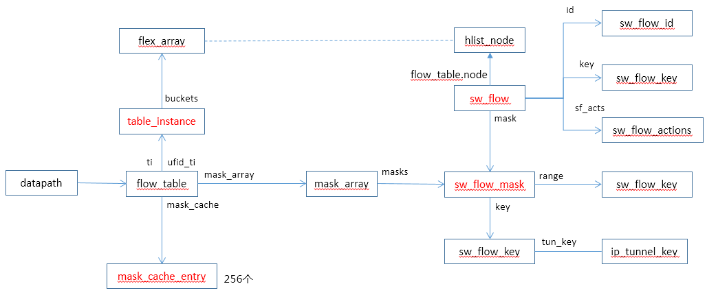
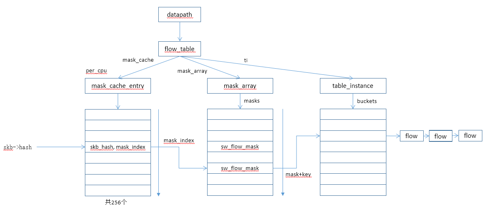
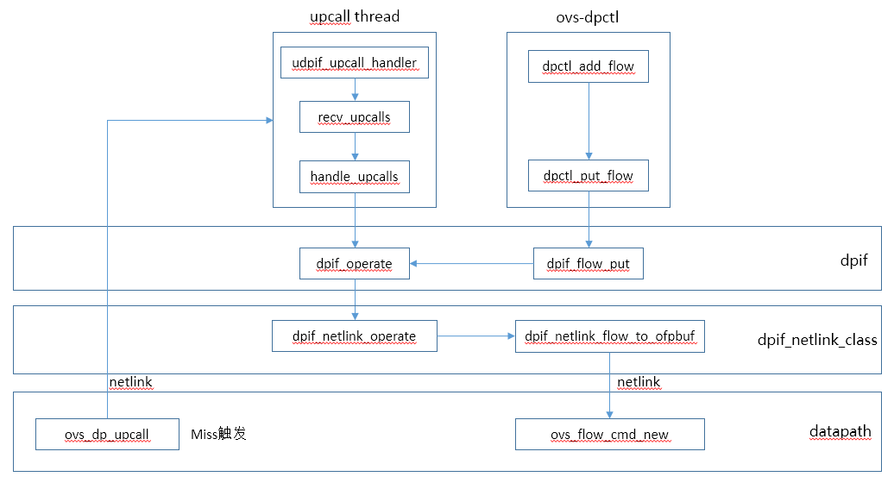

# OVS数据面流表查找

OVS数据面流表查找是网络性能的关键，核心目标是根据SKB报文快速匹配到流表，OVS流表的设计点包括：

* 流表数量不能太多
  * 需要提供流表老化的机制
  * 流表老化后，未匹配到流表采用upcall到用户态来下发流表
* 充分利用硬件能力
  * 使用skb->hash值来进行快速流表匹配
* 报文时间上的连续性
  * 第一次慢匹配，后续快速匹配
* 流表匹配优化
  * 通过连续的内存匹配代替逐个字段的匹配

# 主要数据结构



主要数据类型说明：

* mask_cache_entry
  * per_cpu属性，支持通过skb->hash快速查找mask
* table_instance
  * 存放流表数据
* mask_array
  * 存放mask对象，通过mask和key查找flow

  
# 流表查找代码流程

```
int ovs_vport_receive(struct vport *vport, struct sk_buff *skb,
		      const struct ip_tunnel_info *tun_info)
{
	struct sw_flow_key key;
	int error;

	OVS_CB(skb)->input_vport = vport;
	OVS_CB(skb)->mru = 0;
	if (unlikely(dev_net(skb->dev) != ovs_dp_get_net(vport->dp))) {
		u32 mark;

		mark = skb->mark;
		skb_scrub_packet(skb, true);
		skb->mark = mark;
		tun_info = NULL;
	}

	ovs_skb_init_inner_protocol(skb);
	skb_clear_ovs_gso_cb(skb);
	/* Extract flow from 'skb' into 'key'. */
	error = ovs_flow_key_extract(tun_info, skb, &key);	 //根据报文生成key
	if (unlikely(error)) {
		kfree_skb(skb);
		return error;
	}
	ovs_dp_process_packet(skb, &key);	//报文处理
	return 0;
}

void ovs_dp_process_packet(struct sk_buff *skb, struct sw_flow_key *key)
{
	const struct vport *p = OVS_CB(skb)->input_vport;
	struct datapath *dp = p->dp;
	struct sw_flow *flow;
	struct sw_flow_actions *sf_acts;
	struct dp_stats_percpu *stats;
	u64 *stats_counter;
	u32 n_mask_hit;

	stats = this_cpu_ptr(dp->stats_percpu);

	/* Look up flow. */
	flow = ovs_flow_tbl_lookup_stats(&dp->table, key, skb_get_hash(skb),	//查询转发表
					 &n_mask_hit);
	if (unlikely(!flow)) {		//如果没有查到流表，则上送的upcall线程处理
		struct dp_upcall_info upcall;
		int error;

		memset(&upcall, 0, sizeof(upcall));
		upcall.cmd = OVS_PACKET_CMD_MISS;
		upcall.portid = ovs_vport_find_upcall_portid(p, skb);
		upcall.mru = OVS_CB(skb)->mru;
		error = ovs_dp_upcall(dp, skb, key, &upcall);
		if (unlikely(error))
			kfree_skb(skb);
		else
			consume_skb(skb);
		stats_counter = &stats->n_missed;	//丢包统计加一
		goto out;
	}

	ovs_flow_stats_update(flow, key->tp.flags, skb);
	sf_acts = rcu_dereference(flow->sf_acts);		//获取action
	ovs_execute_actions(dp, skb, sf_acts, key);		//对报文执行action

	stats_counter = &stats->n_hit;

out:
	/* Update datapath statistics. */
	u64_stats_update_begin(&stats->syncp);
	(*stats_counter)++;
	stats->n_mask_hit += n_mask_hit;
	u64_stats_update_end(&stats->syncp);
}

struct sw_flow *ovs_flow_tbl_lookup_stats(struct flow_table *tbl,
					  const struct sw_flow_key *key,
					  u32 skb_hash,
					  u32 *n_mask_hit)
{
	struct mask_array *ma = rcu_dereference(tbl->mask_array);
	struct table_instance *ti = rcu_dereference(tbl->ti);     //得到table实例
	struct mask_cache_entry *entries, *ce;
	struct sw_flow *flow;
	u32 hash;
	int seg;

	*n_mask_hit = 0;
	if (unlikely(!skb_hash)) {	//如果报文没有hash值，则mask_index为0，查表
		u32 mask_index = 0;

		return flow_lookup(tbl, ti, ma, key, n_mask_hit, &mask_index);
	}

	/* Pre and post recirulation flows usually have the same skb_hash
	 * value. To avoid hash collisions, rehash the 'skb_hash' with
	 * 'recirc_id'.  */
	if (key->recirc_id)
		skb_hash = jhash_1word(skb_hash, key->recirc_id);

	ce = NULL;
	hash = skb_hash;
	entries = this_cpu_ptr(tbl->mask_cache);

	/* Find the cache entry 'ce' to operate on. */
	for (seg = 0; seg < MC_HASH_SEGS; seg++) {		//为什么采用这种策略？
		int index = hash & (MC_HASH_ENTRIES - 1);
		struct mask_cache_entry *e;

		e = &entries[index];			//entry最大为256项
		if (e->skb_hash == skb_hash) {        //如果在cache entry找到报文hash相同项，则根据该entry的mask查表
			flow = flow_lookup(tbl, ti, ma, key, n_mask_hit,
					   &e->mask_index);
			if (!flow)
				e->skb_hash = 0;
			return flow;
		}

		if (!ce || e->skb_hash < ce->skb_hash)
			ce = e;  /* A better replacement cache candidate. */

		hash >>= MC_HASH_SHIFT;
	}

	/* Cache miss, do full lookup. */
	flow = flow_lookup(tbl, ti, ma, key, n_mask_hit, &ce->mask_index);
	if (flow)
		ce->skb_hash = skb_hash;

	return flow;
}

static struct sw_flow *flow_lookup(struct flow_table *tbl,
				   struct table_instance *ti,
				   const struct mask_array *ma,
				   const struct sw_flow_key *key,
				   u32 *n_mask_hit,
				   u32 *index)
{
	struct sw_flow_mask *mask;
	struct sw_flow *flow;
	int i;

	if (*index < ma->max) {    //如果index的值小于mask的entry数量，说明index是有效值，基于该值获取sw_flow_mask值
		mask = rcu_dereference_ovsl(ma->masks[*index]);
		if (mask) {
			flow = masked_flow_lookup(ti, key, mask, n_mask_hit);
			if (flow)
				return flow;
		}
	}

	for (i = 0; i < ma->max; i++)  {

		if (i == *index)	//前面已查询过，所以跳过该值
			continue;

		mask = rcu_dereference_ovsl(ma->masks[i]);
		if (!mask)
			continue;

		flow = masked_flow_lookup(ti, key, mask, n_mask_hit);
		if (flow) { /* Found */
			*index = i;		//更新index指向的值，下次可以直接命中
			return flow;
		}
	}

	return NULL;
}

static struct sw_flow *masked_flow_lookup(struct table_instance *ti,
					  const struct sw_flow_key *unmasked,
					  const struct sw_flow_mask *mask,
					  u32 *n_mask_hit)
{
	struct sw_flow *flow;
	struct hlist_head *head;
	u32 hash;
	struct sw_flow_key masked_key;

	ovs_flow_mask_key(&masked_key, unmasked, false, mask);    //根据mask计算出masked_key
	hash = flow_hash(&masked_key, &mask->range);              //使用masked_key和range算出hash key，即flow->key的值
	head = find_bucket(ti, hash);
	(*n_mask_hit)++;
	hlist_for_each_entry_rcu(flow, head, flow_table.node[ti->node_ver]) {
		if (flow->mask == mask && flow->flow_table.hash == hash &&    //flow使用mask与当前的mask相同
		    flow_cmp_masked_key(flow, &masked_key, &mask->range))     //比较masked_key是否匹配flow
			return flow;
	}
	return NULL;
}

static bool flow_cmp_masked_key(const struct sw_flow *flow,
				const struct sw_flow_key *key,
				const struct sw_flow_key_range *range)
{
	return cmp_key(&flow->key, key, range->start, range->end);    //根据指定的范围对比key值
}
```


# 流表查找流程



流表查找流程如下：

1. 找到mask_index
  1. 如果skb->hash有值，直接根据该值找到相应的entry，如果通过该entry未查到流表，则从0号开始遍历mask_cache_entry数组（慢查询）
  2. 如果skb->hash未设置，从0号开始遍历mask_cache_entry数组（慢查询）
2. 根据前一步的entry的mask_index成员找到mask，如果通过该mask未找到flow，则会遍历整个mask数组（慢查询）
3. 根据mask->key和key得到masked_key；
4. 根据masked_key和mask->range计算出hash；
5. 根据hash值找到bucket，根据bucket找到flow链表；
6. 遍历flow链表，找到匹配的flow（flow->mask等于mask，flow->hash等于hask，flow->key和masked_key相同）
7. 刷新mask_cache_entry数组的mask_index值（下次同类报文可以快速匹配）

## OVS流表查找总结

* mask数量要少
  * mask的数量对流表查找的性能影响非常大，要尽量减少mask的数量
  * mask的数量和流表中使用的字段种类相关，要减少不同报文字段匹配的数量
* 报文进入OVS时全量的key解析有点浪费


# 内核流表更新

