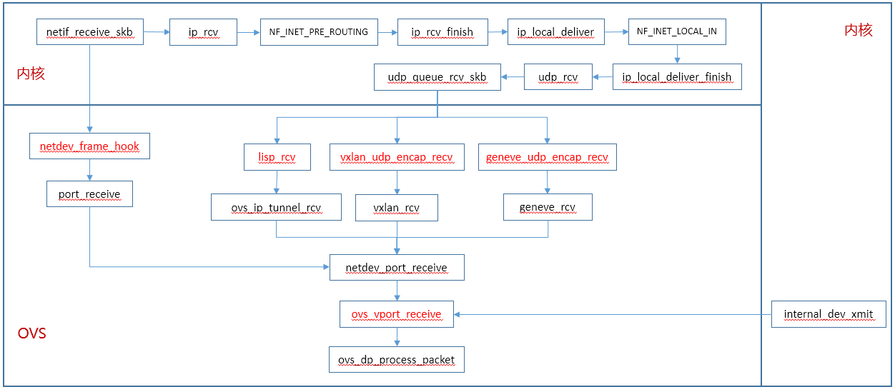

# OVS数据面

OVS数据面入口：

OVS数据面主要有如下入口：

* VLXAN接口
  * 通过UDP Socket注册的vxlan_udp_encap_recv函数进入OVS
* 物理网卡
  * 通过物理网卡挂载到OVS网桥时，注册的rx_handler函数netdev_frame_hook
* internal端口
  * 通过internal端口的驱动发包函数，即internal_dev_xmit函数
