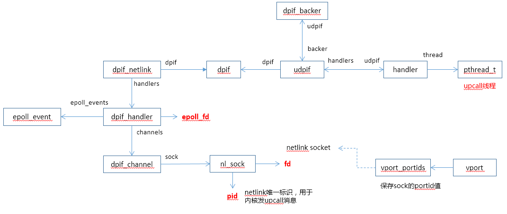
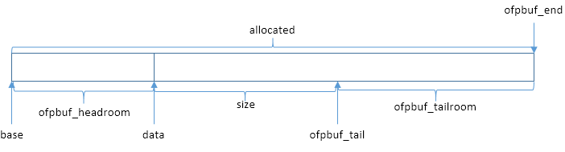
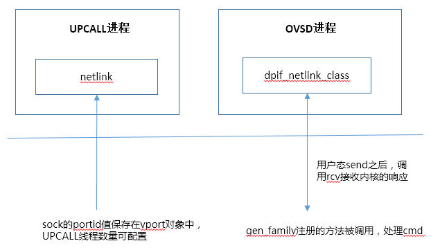
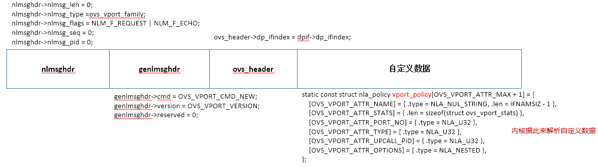

# Netlink

OVS使用Netlink用于内核态和用户态通信。

## 主要数据结构




## Ofpbuf数据结构

OVS使用ofpbuf用于netlink通信。

ofpbuf数据结构定义：
```
struct ofpbuf {
    void *base; /* First byte of allocated space. */
    void *data; /* First byte actually in use. */
    uint32_t size; /* Number of bytes in use. */
    uint32_t allocated; /* Number of bytes allocated. */

    void *header; /* OpenFlow header. */
    void *msg;  /* message's body */
    /* Private list element for use by owner. */
    struct ovs_list list_node; 
    /* Source of memory allocated as 'base'. */
    enum ofpbuf_source source;
};
```



清除数据：
```
static inline void ofpbuf_clear(struct ofpbuf *b)
{
    b->data = b->base;
    b->size = 0;
}
```

头部预留空间:
```
Void ofpbuf_reserve(struct ofpbuf *b, size_t size)
{
    ovs_assert(!b->size);
    ofpbuf_prealloc_tailroom(b, size);
    b->data = (char*)b->data + size;
}
```

新分配空间，返回值为新空间的首地址，长度为size
```
void * ofpbuf_put_uninit(struct ofpbuf *b, size_t size)
{
    void *p;
    ofpbuf_prealloc_tailroom(b, size);
    p = ofpbuf_tail(b);
    b->size += size;
    return p;
}
```

nlattr数据结构定义：
```
struct nlattr {
    uint16_t nla_len;
    uint16_t nla_type;
};
```

负载数据长度:
```
static inline int nla_len(const struct nlattr *nla)
{
      return nla->nla_len - NLA_HDRLEN;
}
```

获取指针数据，例如字符串:
```
static inline void *nla_data(const struct nlattr *nla)
{
       return (char *) nla + NLA_HDRLEN;
}
```

获取无符号32位int值:
```
static inline u32 nla_get_u32(const struct nlattr *nla)
{
    return *(u32 *) nla_data(nla);
}
```

获取无符号16位值:
```
static inline u16 nla_get_u16(const struct nlattr *nla)
{
     return *(u16 *) nla_data(nla);
}
```


## 主要流程




## 用户态创建Netlink Socket
```
int nl_sock_create(int protocol, struct nl_sock **sockp)
{

    *sockp = NULL;
	//申请nl_sock对象空间
    sock = xmalloc(sizeof *sock);      
	
	//创建socket，这里protocol为NETLINK_GENERIC
    sock->fd = socket(AF_NETLINK, SOCK_RAW, protocol);	    
    if (sock->fd < 0) {
        VLOG_ERR("fcntl: %s", ovs_strerror(errno));
        goto error;
    }

    if (setsockopt(sock->fd, SOL_SOCKET, SO_RCVBUFFORCE,
                   &rcvbuf, sizeof rcvbuf)) {
    }
    ……
    /* Connect to kernel (pid 0) as remote address. */
    memset(&remote, 0, sizeof remote);
    remote.nl_family = AF_NETLINK;
    remote.nl_pid = 0;
	//与kernel genlink绑定，内核中注册了gen_family的方法可以被调用
    if (connect(sock->fd, (struct sockaddr *) &remote, sizeof remote) < 0) {	
        goto error;
    }

    /* Obtain pid assigned by kernel. */
    local_size = sizeof local;
    if (getsockname(sock->fd, (struct sockaddr *) &local, &local_size) < 0) {
        goto error;
    }
	//得到portid，这个需要发送内内核，内核依赖这个信息来响应
    sock->pid = local.nl_pid;		
    ……
    free(sock);
    return retval;
}

```


## 用户态使用Netlink Socket
```
static int nl_sock_transact_multiple__(struct nl_sock *sock,
                            struct nl_transaction **transactions, size_t n,
                            size_t *done)
{
    ……
    for (i = 0; i < n; i++) {
        struct nl_transaction *txn = transactions[i];
        struct nlmsghdr *nlmsg = nl_msg_nlmsghdr(txn->request);

        nlmsg->nlmsg_len = txn->request->size;
        nlmsg->nlmsg_seq = base_seq + i;
		//创建socket时得到的pid
        nlmsg->nlmsg_pid = sock->pid;              

        iovs[i].iov_base = txn->request->data;
        iovs[i].iov_len = txn->request->size;
    }

    memset(&msg, 0, sizeof msg);
    msg.msg_iov = iovs;
    msg.msg_iovlen = n;
    do {
	    //调用linux的sendmsg函数，发送genlink消息
        error = sendmsg(sock->fd, &msg, 0) < 0 ? errno : 0;   
    } while (error == EINTR);

     ……
    /* Receive a reply. */
	//接收genlink 消息，即请求的reply，通过调用recvmsg实现
    error = nl_sock_recv__(sock, buf_txn->reply, false);	
    ……
}

```

## 内核态注册处理函数

genl_family定义：
```
static struct genl_family dp_flow_genl_family = {
	.id = GENL_ID_GENERATE,
	.hdrsize = sizeof(struct ovs_header),
	.name = OVS_FLOW_FAMILY,
	.version = OVS_FLOW_VERSION,
	.maxattr = OVS_FLOW_ATTR_MAX,
	.netnsok = true,
	.parallel_ops = true,
	.ops = dp_flow_genl_ops,
	.n_ops = ARRAY_SIZE(dp_flow_genl_ops),
	.mcgrps = &ovs_dp_flow_multicast_group,
	.n_mcgrps = 1,
};
```

netlink消息处理函数：
```
static struct genl_ops dp_flow_genl_ops[] = {
	{ .cmd = OVS_FLOW_CMD_NEW,
	  .flags = GENL_ADMIN_PERM, /* Requires CAP_NET_ADMIN privilege. */
	  .policy = flow_policy,
	  .doit = ovs_flow_cmd_new
	},
	{ .cmd = OVS_FLOW_CMD_DEL,
	  .flags = GENL_ADMIN_PERM, /* Requires CAP_NET_ADMIN privilege. */
	  .policy = flow_policy,
	  .doit = ovs_flow_cmd_del
	},
	{ .cmd = OVS_FLOW_CMD_GET,
	  .flags = 0,		    /* OK for unprivileged users. */
	  .policy = flow_policy,
	  .doit = ovs_flow_cmd_get,
	  .dumpit = ovs_flow_cmd_dump
	},
	{ .cmd = OVS_FLOW_CMD_SET,
	  .flags = GENL_ADMIN_PERM, /* Requires CAP_NET_ADMIN privilege. */
	  .policy = flow_policy,
	  .doit = ovs_flow_cmd_set,
	},
};
```

注册genl_family：
```
static int dp_register_genl(void)
{
	int err;
	int i;

	for (i = 0; i < ARRAY_SIZE(dp_genl_families); i++) {

		err = genl_register_family(dp_genl_families[i]);
		if (err)
			goto error;
	}

	return 0;

error:
	dp_unregister_genl(i);
	return err;
}
```


## Netlink消息头定义




genl_ops函数可以得到nlattr属性值
```
static int ovs_vport_cmd_new(struct sk_buff *skb, struct genl_info *info)
{
     struct nlattr **a = info->attrs;
     ……
     if (!a[OVS_VPORT_ATTR_NAME] || !a[OVS_VPORT_ATTR_TYPE] ||
           !a[OVS_VPORT_ATTR_UPCALL_PID])
     ……
           parms.name = nla_data(a[OVS_VPORT_ATTR_NAME]);
           parms.type = nla_get_u32(a[OVS_VPORT_ATTR_TYPE]);
           parms.options = a[OVS_VPORT_ATTR_OPTIONS];
           ……
}
```


