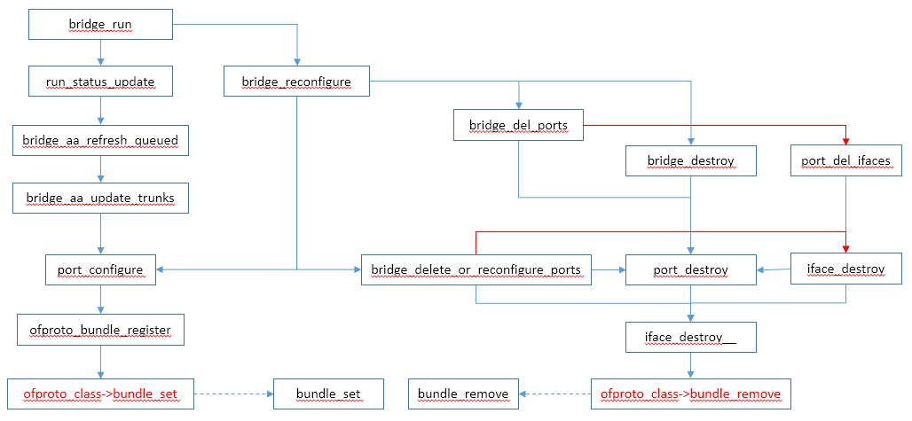
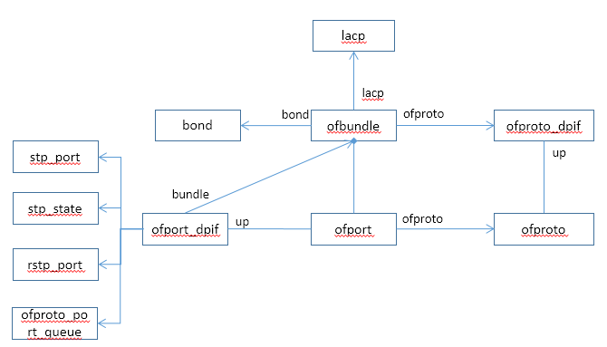

# ofproto bundle

ofproto bundle的调用流程如下：



数据结构如下：




# ofproto_bundle_register

```c
int
ofproto_bundle_register(struct ofproto *ofproto, void *aux,
                        const struct ofproto_bundle_settings *s)
{
    return (ofproto->ofproto_class->bundle_set
            ? ofproto->ofproto_class->bundle_set(ofproto, aux, s)
            : EOPNOTSUPP);
}
```


# ofproto_bundle_unregister

```c
int
ofproto_bundle_unregister(struct ofproto *ofproto, void *aux)
{
    return ofproto_bundle_register(ofproto, aux, NULL);
}
```


# ofproto_port_unregister

```c
void
ofproto_port_unregister(struct ofproto *ofproto, ofp_port_t ofp_port)
{
    struct ofport *port = ofproto_get_port(ofproto, ofp_port);
    if (port) {
        if (port->ofproto->ofproto_class->set_realdev) {
            port->ofproto->ofproto_class->set_realdev(port, 0, 0);
        }
        if (port->ofproto->ofproto_class->set_stp_port) {
            port->ofproto->ofproto_class->set_stp_port(port, NULL);
        }
        if (port->ofproto->ofproto_class->set_rstp_port) {
            port->ofproto->ofproto_class->set_rstp_port(port, NULL);
        }
        if (port->ofproto->ofproto_class->set_cfm) {
            port->ofproto->ofproto_class->set_cfm(port, NULL);
        }
        if (port->ofproto->ofproto_class->bundle_remove) {
            port->ofproto->ofproto_class->bundle_remove(port);
        }
    }
}
```


# bundle_set(ofproto_dpif_class)

```c

static int
bundle_set(struct ofproto *ofproto_, void *aux,
           const struct ofproto_bundle_settings *s)
{
    struct ofproto_dpif *ofproto = ofproto_dpif_cast(ofproto_);
    bool need_flush = false;
    struct ofport_dpif *port;
    struct ofbundle *bundle;
    unsigned long *trunks;
    int vlan;
    size_t i;
    bool ok;

    if (!s) {
        bundle_destroy(bundle_lookup(ofproto, aux));      //删除bundle
        return 0;
    }

    ovs_assert(s->n_slaves == 1 || s->bond != NULL);
    ovs_assert((s->lacp != NULL) == (s->lacp_slaves != NULL));

    bundle = bundle_lookup(ofproto, aux);     //查找bundle
    if (!bundle) {
        bundle = xmalloc(sizeof *bundle);     //如果bundle不存在，则创建bundle对象

        bundle->ofproto = ofproto;
        hmap_insert(&ofproto->bundles, &bundle->hmap_node,
                    hash_pointer(aux, 0));
        bundle->aux = aux;
        bundle->name = NULL;

        list_init(&bundle->ports);
        bundle->vlan_mode = PORT_VLAN_TRUNK;     //设置vlan模式
        bundle->vlan = -1;
        bundle->trunks = NULL;
        bundle->use_priority_tags = s->use_priority_tags;
        bundle->lacp = NULL;
        bundle->bond = NULL;

        bundle->floodable = true;
        mbridge_register_bundle(ofproto->mbridge, bundle);    //mbrige注册bundle
    }

    if (!bundle->name || strcmp(s->name, bundle->name)) {
        free(bundle->name);
        bundle->name = xstrdup(s->name);
    }

    /* LACP. */
    if (s->lacp) {
        ofproto->lacp_enabled = true;
        if (!bundle->lacp) {
            ofproto->backer->need_revalidate = REV_RECONFIGURE;
            bundle->lacp = lacp_create(); 
        }
        lacp_configure(bundle->lacp, s->lacp);
    } else {
        lacp_unref(bundle->lacp);
        bundle->lacp = NULL;
    }

    /* Update set of ports. */
    ok = true;
    for (i = 0; i < s->n_slaves; i++) {
        if (!bundle_add_port(bundle, s->slaves[i],       //bundle添加port
                             s->lacp ? &s->lacp_slaves[i] : NULL)) {
            ok = false;
        }
    }
    if (!ok || list_size(&bundle->ports) != s->n_slaves) {
        struct ofport_dpif *next_port;

        LIST_FOR_EACH_SAFE (port, next_port, bundle_node, &bundle->ports) {
            for (i = 0; i < s->n_slaves; i++) {
                if (s->slaves[i] == port->up.ofp_port) {
                    goto found;
                }
            }

            bundle_del_port(port);
        found: ;
        }
    }
    ovs_assert(list_size(&bundle->ports) <= s->n_slaves);

    if (list_is_empty(&bundle->ports)) {
        bundle_destroy(bundle);
        return EINVAL;
    }

    /* Set VLAN tagging mode */
    if (s->vlan_mode != bundle->vlan_mode
        || s->use_priority_tags != bundle->use_priority_tags) {
        bundle->vlan_mode = s->vlan_mode;
        bundle->use_priority_tags = s->use_priority_tags;
        need_flush = true;
    }

    /* Set VLAN tag. */
    vlan = (s->vlan_mode == PORT_VLAN_TRUNK ? -1
            : s->vlan >= 0 && s->vlan <= 4095 ? s->vlan
            : 0);
    if (vlan != bundle->vlan) {
        bundle->vlan = vlan;             //设置vlan值
        need_flush = true;
    }

    /* Get trunked VLANs. */
    switch (s->vlan_mode) {
    case PORT_VLAN_ACCESS:
        trunks = NULL;
        break;

    case PORT_VLAN_TRUNK:
        trunks = CONST_CAST(unsigned long *, s->trunks);
        break;

    case PORT_VLAN_NATIVE_UNTAGGED:
    case PORT_VLAN_NATIVE_TAGGED:
        if (vlan != 0 && (!s->trunks
                          || !bitmap_is_set(s->trunks, vlan)
                          || bitmap_is_set(s->trunks, 0))) {
            /* Force trunking the native VLAN and prohibit trunking VLAN 0. */
            if (s->trunks) {
                trunks = bitmap_clone(s->trunks, 4096);
            } else {
                trunks = bitmap_allocate1(4096);
            }
            bitmap_set1(trunks, vlan);
            bitmap_set0(trunks, 0);
        } else {
            trunks = CONST_CAST(unsigned long *, s->trunks);
        }
        break;

    default:
        OVS_NOT_REACHED();
    }
    if (!vlan_bitmap_equal(trunks, bundle->trunks)) {
        free(bundle->trunks);
        if (trunks == s->trunks) {
            bundle->trunks = vlan_bitmap_clone(trunks);
        } else {
            bundle->trunks = trunks;
            trunks = NULL;
        }
        need_flush = true;
    }
    if (trunks != s->trunks) {
        free(trunks);
    }

    /* Bonding. */
    if (!list_is_short(&bundle->ports)) {
        bundle->ofproto->has_bonded_bundles = true;
        if (bundle->bond) {
            if (bond_reconfigure(bundle->bond, s->bond)) {
                ofproto->backer->need_revalidate = REV_RECONFIGURE;
            }
        } else {
            bundle->bond = bond_create(s->bond, ofproto);
            ofproto->backer->need_revalidate = REV_RECONFIGURE;
        }

        LIST_FOR_EACH (port, bundle_node, &bundle->ports) {
            bond_slave_register(bundle->bond, port,
                                port->up.ofp_port, port->up.netdev);
        }
    } else {
        bond_unref(bundle->bond);
        bundle->bond = NULL;
    }

    /* If we changed something that would affect MAC learning, un-learn
     * everything on this port and force flow revalidation. */
    if (need_flush) {
        bundle_flush_macs(bundle, false);
    }

    return 0;
}
```


## bundle_add_port

```c
static bool
bundle_add_port(struct ofbundle *bundle, ofp_port_t ofp_port,
                struct lacp_slave_settings *lacp)
{
    struct ofport_dpif *port;

    port = ofp_port_to_ofport(bundle->ofproto, ofp_port);   //得到ofport
    if (!port) {
        return false;
    }

    if (port->bundle != bundle) {
        bundle->ofproto->backer->need_revalidate = REV_RECONFIGURE;
        if (port->bundle) {
            bundle_remove(&port->up);
        }

        port->bundle = bundle;    //设置port的bundle值
        list_push_back(&bundle->ports, &port->bundle_node);
        if (port->up.pp.config & OFPUTIL_PC_NO_FLOOD
            || port->is_layer3
            || (bundle->ofproto->stp && !stp_forward_in_state(port->stp_state))
            || (bundle->ofproto->rstp && !rstp_forward_in_state(port->rstp_state))) {
            bundle->floodable = false;
        }
    }
    if (lacp) {
        bundle->ofproto->backer->need_revalidate = REV_RECONFIGURE;
        lacp_slave_register(bundle->lacp, port, lacp);
    }

    return true;
}
```


## bundle_destroy

```c
static void
bundle_destroy(struct ofbundle *bundle)
{
    struct ofproto_dpif *ofproto;
    struct ofport_dpif *port, *next_port;

    if (!bundle) {
        return;
    }

    ofproto = bundle->ofproto;
    mbridge_unregister_bundle(ofproto->mbridge, bundle);

    xlate_txn_start();
    xlate_bundle_remove(bundle);
    xlate_txn_commit();

    LIST_FOR_EACH_SAFE (port, next_port, bundle_node, &bundle->ports) {
        bundle_del_port(port);
    }

    bundle_flush_macs(bundle, true);
    hmap_remove(&ofproto->bundles, &bundle->hmap_node);
    free(bundle->name);
    free(bundle->trunks);
    lacp_unref(bundle->lacp);
    bond_unref(bundle->bond);
    free(bundle);
}
```


#  bundle_remove(ofproto_dpif_class)

```c
static void
bundle_remove(struct ofport *port_)
{
    struct ofport_dpif *port = ofport_dpif_cast(port_);
    struct ofbundle *bundle = port->bundle;

    if (bundle) {
        bundle_del_port(port);
        if (list_is_empty(&bundle->ports)) {
            bundle_destroy(bundle);
        } else if (list_is_short(&bundle->ports)) {
            bond_unref(bundle->bond);
            bundle->bond = NULL;
        }
    }
}

static void
bundle_del_port(struct ofport_dpif *port)
{
    struct ofbundle *bundle = port->bundle;

    bundle->ofproto->backer->need_revalidate = REV_RECONFIGURE;

    list_remove(&port->bundle_node);
    port->bundle = NULL;

    if (bundle->lacp) {
        lacp_slave_unregister(bundle->lacp, port);
    }
    if (bundle->bond) {
        bond_slave_unregister(bundle->bond, port);
    }

    bundle_update(bundle);
}
```
