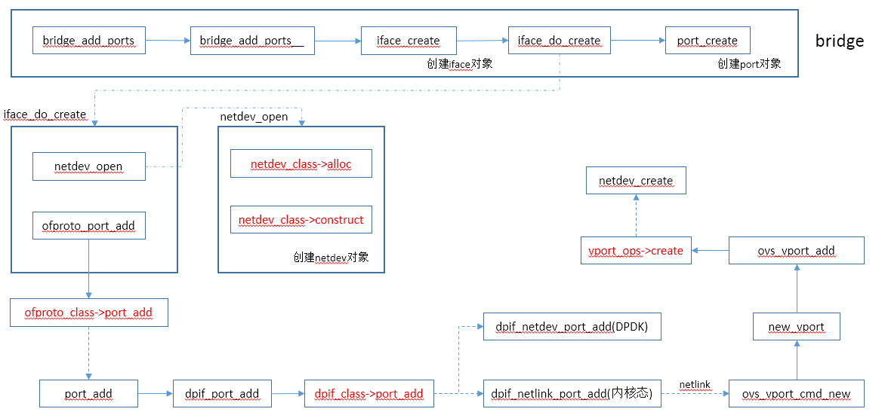
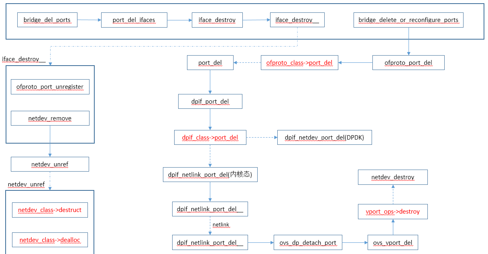

# 端口操作入口

```
static void
bridge_reconfigure(const struct ovsrec_open_vswitch *ovs_cfg)
{
    unsigned long int *splinter_vlans;
    struct sockaddr_in *managers;
    struct bridge *br, *next;
    int sflow_bridge_number;
    size_t n_managers;

    COVERAGE_INC(bridge_reconfigure);

    ofproto_set_flow_limit(smap_get_int(&ovs_cfg->other_config, "flow-limit",
                                        OFPROTO_FLOW_LIMIT_DEFAULT));
    ofproto_set_max_idle(smap_get_int(&ovs_cfg->other_config, "max-idle",
                                      OFPROTO_MAX_IDLE_DEFAULT));
    ofproto_set_n_dpdk_rxqs(smap_get_int(&ovs_cfg->other_config,
                                         "n-dpdk-rxqs", 0));
    ofproto_set_cpu_mask(smap_get(&ovs_cfg->other_config, "pmd-cpu-mask"));

    ofproto_set_threads(
        smap_get_int(&ovs_cfg->other_config, "n-handler-threads", 0),
        smap_get_int(&ovs_cfg->other_config, "n-revalidator-threads", 0));

    /* Destroy "struct bridge"s, "struct port"s, and "struct iface"s according
     * to 'ovs_cfg', with only very minimal configuration otherwise.
     *
     * This is mostly an update to bridge data structures. Nothing is pushed
     * down to ofproto or lower layers. */
    add_del_bridges(ovs_cfg);
    splinter_vlans = collect_splinter_vlans(ovs_cfg);
    HMAP_FOR_EACH (br, node, &all_bridges) {
        bridge_collect_wanted_ports(br, splinter_vlans, &br->wanted_ports);
        bridge_del_ports(br, &br->wanted_ports);      //删除端口
    }
    free(splinter_vlans);

    /* Start pushing configuration changes down to the ofproto layer:
     *
     *   - Delete ofprotos that are no longer configured.
     *
     *   - Delete ports that are no longer configured.
     *
     *   - Reconfigure existing ports to their desired configurations, or
     *     delete them if not possible.
     *
     * We have to do all the deletions before we can do any additions, because
     * the ports to be added might require resources that will be freed up by
     * deletions (they might especially overlap in name). */
    bridge_delete_ofprotos();
    HMAP_FOR_EACH (br, node, &all_bridges) {
        if (br->ofproto) {
            bridge_delete_or_reconfigure_ports(br);     //of层删除或重置端口
        }
    }

    /* Finish pushing configuration changes to the ofproto layer:
     *
     *     - Create ofprotos that are missing.
     *
     *     - Add ports that are missing. */
    HMAP_FOR_EACH_SAFE (br, next, node, &all_bridges) {
        if (!br->ofproto) {
            int error;

            error = ofproto_create(br->name, br->type, &br->ofproto);
            if (error) {
                VLOG_ERR("failed to create bridge %s: %s", br->name,
                         ovs_strerror(error));
                shash_destroy(&br->wanted_ports);
                bridge_destroy(br, true);
            } else {
                /* Trigger storing datapath version. */
                seq_change(connectivity_seq_get());
            }
        }
    }
    HMAP_FOR_EACH (br, node, &all_bridges) {
        bridge_add_ports(br, &br->wanted_ports);     //添加端口
        shash_destroy(&br->wanted_ports);
    }

    reconfigure_system_stats(ovs_cfg);

    /* Complete the configuration. */
    sflow_bridge_number = 0;
    collect_in_band_managers(ovs_cfg, &managers, &n_managers);
    HMAP_FOR_EACH (br, node, &all_bridges) {
        struct port *port;

        /* We need the datapath ID early to allow LACP ports to use it as the
         * default system ID. */
        bridge_configure_datapath_id(br);

        HMAP_FOR_EACH (port, hmap_node, &br->ports) {
            struct iface *iface;

            port_configure(port);

            LIST_FOR_EACH (iface, port_elem, &port->ifaces) {
                iface_set_ofport(iface->cfg, iface->ofp_port);
                /* Clear eventual previous errors */
                ovsrec_interface_set_error(iface->cfg, NULL);
                iface_configure_cfm(iface);
                iface_configure_qos(iface, port->cfg->qos);
                iface_set_mac(br, port, iface);
                ofproto_port_set_bfd(br->ofproto, iface->ofp_port,
                                     &iface->cfg->bfd);
                ofproto_port_set_lldp(br->ofproto, iface->ofp_port,
                                      &iface->cfg->lldp);
            }
        }
        bridge_configure_mirrors(br);
        bridge_configure_forward_bpdu(br);
        bridge_configure_mac_table(br);
        bridge_configure_mcast_snooping(br);
        bridge_configure_remotes(br, managers, n_managers);
        bridge_configure_netflow(br);
        bridge_configure_sflow(br, &sflow_bridge_number);
        bridge_configure_ipfix(br);
        bridge_configure_spanning_tree(br);
        bridge_configure_tables(br);
        bridge_configure_dp_desc(br);
        bridge_configure_aa(br);
    }
    free(managers);

    /* The ofproto-dpif provider does some final reconfiguration in its
     * ->type_run() function.  We have to call it before notifying the database
     * client that reconfiguration is complete, otherwise there is a very
     * narrow race window in which e.g. ofproto/trace will not recognize the
     * new configuration (sometimes this causes unit test failures). */
    bridge_run__();
}
```


# bridge_add_ports(增加端口)

```
static void
bridge_add_ports(struct bridge *br, const struct shash *wanted_ports)
{
    /* First add interfaces that request a particular port number. */
    bridge_add_ports__(br, wanted_ports, true);

    /* Then add interfaces that want automatic port number assignment.
     * We add these afterward to avoid accidentally taking a specifically
     * requested port number. */
    bridge_add_ports__(br, wanted_ports, false);
}

static void
bridge_add_ports__(struct bridge *br, const struct shash *wanted_ports,
                   bool with_requested_port)
{
    struct shash_node *port_node;

    SHASH_FOR_EACH (port_node, wanted_ports) {
        const struct ovsrec_port *port_cfg = port_node->data;
        size_t i;

        for (i = 0; i < port_cfg->n_interfaces; i++) {
            const struct ovsrec_interface *iface_cfg = port_cfg->interfaces[i];
            ofp_port_t requested_ofp_port;

            requested_ofp_port = iface_get_requested_ofp_port(iface_cfg);
            if ((requested_ofp_port != OFPP_NONE) == with_requested_port) {
                struct iface *iface = iface_lookup(br, iface_cfg->name);

                if (!iface) {
                    iface_create(br, iface_cfg, port_cfg);    //创建iface
                }
            }
        }
    }
}

static bool
iface_create(struct bridge *br, const struct ovsrec_interface *iface_cfg,
             const struct ovsrec_port *port_cfg)
{
    struct netdev *netdev;
    struct iface *iface;
    ofp_port_t ofp_port;
    struct port *port;
    char *errp = NULL;
    int error;

    /* Do the bits that can fail up front. */
    ovs_assert(!iface_lookup(br, iface_cfg->name));
    error = iface_do_create(br, iface_cfg, port_cfg, &ofp_port, &netdev, &errp);
    if (error) {
        iface_clear_db_record(iface_cfg, errp);
        free(errp);
        return false;
    }

    /* Get or create the port structure. */
    port = port_lookup(br, port_cfg->name);
    if (!port) {
        port = port_create(br, port_cfg);
    }

    /* Create the iface structure. */
    iface = xzalloc(sizeof *iface);
    list_push_back(&port->ifaces, &iface->port_elem);
    hmap_insert(&br->iface_by_name, &iface->name_node,
                hash_string(iface_cfg->name, 0));
    iface->port = port;
    iface->name = xstrdup(iface_cfg->name);
    iface->ofp_port = ofp_port;
    iface->netdev = netdev;
    iface->type = iface_get_type(iface_cfg, br->cfg);
    iface->cfg = iface_cfg;
    hmap_insert(&br->ifaces, &iface->ofp_port_node,
                hash_ofp_port(ofp_port));

    /* Populate initial status in database. */
    iface_refresh_stats(iface);
    iface_refresh_netdev_status(iface);

    /* Add bond fake iface if necessary. */
    if (port_is_bond_fake_iface(port)) {
        struct ofproto_port ofproto_port;

        if (ofproto_port_query_by_name(br->ofproto, port->name,
                                       &ofproto_port)) {
            struct netdev *netdev;
            int error;

            error = netdev_open(port->name, "internal", &netdev);
            if (!error) {
                ofp_port_t fake_ofp_port = OFPP_NONE;
                ofproto_port_add(br->ofproto, netdev, &fake_ofp_port);
                netdev_close(netdev);
            } else {
                VLOG_WARN("could not open network device %s (%s)",
                          port->name, ovs_strerror(error));
            }
        } else {
            /* Already exists, nothing to do. */
            ofproto_port_destroy(&ofproto_port);
        }
    }

    return true;
}

static int
iface_do_create(const struct bridge *br,
                const struct ovsrec_interface *iface_cfg,
                const struct ovsrec_port *port_cfg,
                ofp_port_t *ofp_portp, struct netdev **netdevp,
                char **errp)
{
    struct netdev *netdev = NULL;
    int error;

    if (netdev_is_reserved_name(iface_cfg->name)) {   //检查端口名是否为保留名字
        VLOG_WARN("could not create interface %s, name is reserved",
                  iface_cfg->name);
        error = EINVAL;
        goto error;
    }

    error = netdev_open(iface_cfg->name,      //打开netdev设备
                        iface_get_type(iface_cfg, br->cfg), &netdev);
    if (error) {
        VLOG_WARN_BUF(errp, "could not open network device %s (%s)",
                      iface_cfg->name, ovs_strerror(error));
        goto error;
    }

    error = iface_set_netdev_config(iface_cfg, netdev, errp);
    if (error) {
        goto error;
    }

    *ofp_portp = iface_pick_ofport(iface_cfg);  //得到ofport端口号
    error = ofproto_port_add(br->ofproto, netdev, ofp_portp);   //of协议添加端口
    if (error) {
        goto error;
    }

    VLOG_INFO("bridge %s: added interface %s on port %d",
              br->name, iface_cfg->name, *ofp_portp);

    if (port_cfg->vlan_mode && !strcmp(port_cfg->vlan_mode, "splinter")) {
        netdev_turn_flags_on(netdev, NETDEV_UP, NULL);
    }

    *netdevp = netdev;
    return 0;

error:
    *netdevp = NULL;
    netdev_close(netdev);
    return error;
}

static struct port *
port_create(struct bridge *br, const struct ovsrec_port *cfg)
{
    struct port *port;

    port = xzalloc(sizeof *port);
    port->bridge = br;
    port->name = xstrdup(cfg->name);
    port->cfg = cfg;
    list_init(&port->ifaces);

    hmap_insert(&br->ports, &port->hmap_node, hash_string(port->name, 0));
    return port;
}
```

## netdev_open

```
int
netdev_open(const char *name, const char *type, struct netdev **netdevp)
    OVS_EXCLUDED(netdev_mutex)
{
    struct netdev *netdev;
    int error;

    netdev_initialize();

    ovs_mutex_lock(&netdev_class_mutex);
    ovs_mutex_lock(&netdev_mutex);
    netdev = shash_find_data(&netdev_shash, name);   //从全局数组中查找netdev设备
    if (!netdev) {
        struct netdev_registered_class *rc;

        rc = netdev_lookup_class(type && type[0] ? type : "system");
        if (rc) {
            netdev = rc->class->alloc();    //调用netdev_class的alloc方法，根据端口类型实际分配netdev_linux或netdev_dpdk对象
            if (netdev) {
                memset(netdev, 0, sizeof *netdev);
                netdev->netdev_class = rc->class;
                netdev->name = xstrdup(name);
                netdev->change_seq = 1;
                netdev->node = shash_add(&netdev_shash, name, netdev);    //添加到全局数组中

                /* By default enable one tx and rx queue per netdev. */
                netdev->n_txq = netdev->netdev_class->send ? 1 : 0;
                netdev->n_rxq = netdev->netdev_class->rxq_alloc ? 1 : 0;

                list_init(&netdev->saved_flags_list);

                error = rc->class->construct(netdev);    //构建netdev设备
                if (!error) {
                    rc->ref_cnt++;
                    netdev_change_seq_changed(netdev);
                } else {
                    free(netdev->name);
                    ovs_assert(list_is_empty(&netdev->saved_flags_list));
                    shash_delete(&netdev_shash, netdev->node);
                    rc->class->dealloc(netdev);
                }
            } else {
                error = ENOMEM;
            }
        } else {
            VLOG_WARN("could not create netdev %s of unknown type %s",
                      name, type);
            error = EAFNOSUPPORT;
        }
    } else {
        error = 0;
    }

    if (!error) {
        netdev->ref_cnt++;
        *netdevp = netdev;
    } else {
        *netdevp = NULL;
    }
    ovs_mutex_unlock(&netdev_mutex);
    ovs_mutex_unlock(&netdev_class_mutex);

    return error;
}
```


## netdev_class列表

```
const struct netdev_class netdev_linux_class =
    NETDEV_LINUX_CLASS(
        "system",
        netdev_linux_construct,
        netdev_linux_get_stats,
        netdev_linux_get_features,
        netdev_linux_get_status);

const struct netdev_class netdev_tap_class =
    NETDEV_LINUX_CLASS(
        "tap",
        netdev_linux_construct_tap,
        netdev_tap_get_stats,
        netdev_linux_get_features,
        netdev_linux_get_status);

const struct netdev_class netdev_internal_class =
    NETDEV_LINUX_CLASS(
        "internal",
        netdev_linux_construct,
        netdev_internal_get_stats,
        NULL,                  /* get_features */
        netdev_internal_get_status);

//DPDK
static const struct netdev_class dpdk_class =
    NETDEV_DPDK_CLASS(
        "dpdk",
        NULL,
        netdev_dpdk_construct,
        netdev_dpdk_destruct,
        netdev_dpdk_set_multiq,
        netdev_dpdk_eth_send,
        netdev_dpdk_get_carrier,
        netdev_dpdk_get_stats,
        netdev_dpdk_get_features,
        netdev_dpdk_get_status,
        netdev_dpdk_rxq_recv);

static const struct netdev_class dpdk_ring_class =
    NETDEV_DPDK_CLASS(
        "dpdkr",
        NULL,
        netdev_dpdk_ring_construct,
        netdev_dpdk_destruct,
        netdev_dpdk_set_multiq,
        netdev_dpdk_ring_send,
        netdev_dpdk_get_carrier,
        netdev_dpdk_get_stats,
        netdev_dpdk_get_features,
        netdev_dpdk_get_status,
        netdev_dpdk_rxq_recv);

static const struct netdev_class OVS_UNUSED dpdk_vhost_cuse_class =
    NETDEV_DPDK_CLASS(
        "dpdkvhostcuse",
        dpdk_vhost_cuse_class_init,
        netdev_dpdk_vhost_cuse_construct,
        netdev_dpdk_vhost_destruct,
        netdev_dpdk_vhost_cuse_set_multiq,
        netdev_dpdk_vhost_send,
        netdev_dpdk_vhost_get_carrier,
        netdev_dpdk_vhost_get_stats,
        NULL,
        NULL,
        netdev_dpdk_vhost_rxq_recv);

static const struct netdev_class OVS_UNUSED dpdk_vhost_user_class =
    NETDEV_DPDK_CLASS(
        "dpdkvhostuser",
        dpdk_vhost_user_class_init,
        netdev_dpdk_vhost_user_construct,
        netdev_dpdk_vhost_destruct,
        netdev_dpdk_vhost_set_multiq,
        netdev_dpdk_vhost_send,
        netdev_dpdk_vhost_get_carrier,
        netdev_dpdk_vhost_get_stats,
        NULL,
        NULL,
        netdev_dpdk_vhost_rxq_recv);

//虚拟端口
    static const struct vport_class vport_classes[] = {
        TUNNEL_CLASS("geneve", "genev_sys", netdev_geneve_build_header,
                                            push_udp_header,
                                            netdev_geneve_pop_header),
        TUNNEL_CLASS("gre", "gre_sys", netdev_gre_build_header,
                                       netdev_gre_push_header,
                                       netdev_gre_pop_header),
        TUNNEL_CLASS("ipsec_gre", "gre_sys", NULL, NULL, NULL),
        TUNNEL_CLASS("vxlan", "vxlan_sys", netdev_vxlan_build_header,
                                           push_udp_header,
                                           netdev_vxlan_pop_header),
        TUNNEL_CLASS("lisp", "lisp_sys", NULL, NULL, NULL),
        TUNNEL_CLASS("stt", "stt_sys", NULL, NULL, NULL),
    };

    static const struct vport_class patch_class =
        { NULL,
            { "patch", VPORT_FUNCTIONS(get_patch_config,
                                       set_patch_config,
                                       NULL,
                                       NULL, NULL, NULL, NULL) }};	
```


## ofproto_port_add

```
int
ofproto_port_add(struct ofproto *ofproto, struct netdev *netdev,
                 ofp_port_t *ofp_portp)
{
    ofp_port_t ofp_port = ofp_portp ? *ofp_portp : OFPP_NONE;
    int error;

    error = ofproto->ofproto_class->port_add(ofproto, netdev);  //只有ofproto_dpif_class类型
    if (!error) {
        const char *netdev_name = netdev_get_name(netdev);

        simap_put(&ofproto->ofp_requests, netdev_name,
                  ofp_to_u16(ofp_port));
        error = update_port(ofproto, netdev_name);   //更新ofport，如果已存在则会删除，如果不存在则创建ofport
    }
    if (ofp_portp) {
        *ofp_portp = OFPP_NONE;
        if (!error) {
            struct ofproto_port ofproto_port;

            error = ofproto_port_query_by_name(ofproto,
                                               netdev_get_name(netdev),
                                               &ofproto_port);
            if (!error) {
                *ofp_portp = ofproto_port.ofp_port;
                ofproto_port_destroy(&ofproto_port);
            }
        }
    }
    return error;
}

// ofproto_dpif_class的port_add函数
static int
port_add(struct ofproto *ofproto_, struct netdev *netdev)
{
    struct ofproto_dpif *ofproto = ofproto_dpif_cast(ofproto_);
    const char *devname = netdev_get_name(netdev);
    char namebuf[NETDEV_VPORT_NAME_BUFSIZE];
    const char *dp_port_name;

    if (netdev_vport_is_patch(netdev)) {
        sset_add(&ofproto->ghost_ports, netdev_get_name(netdev));
        return 0;
    }

    dp_port_name = netdev_vport_get_dpif_port(netdev, namebuf, sizeof namebuf);
    if (!dpif_port_exists(ofproto->backer->dpif, dp_port_name)) {
        odp_port_t port_no = ODPP_NONE;
        int error;

        error = dpif_port_add(ofproto->backer->dpif, netdev, &port_no);
        if (error) {
            return error;
        }
        if (netdev_get_tunnel_config(netdev)) {
            simap_put(&ofproto->backer->tnl_backers,
                      dp_port_name, odp_to_u32(port_no));
        }
    }

    if (netdev_get_tunnel_config(netdev)) {
        sset_add(&ofproto->ghost_ports, devname);
    } else {
        sset_add(&ofproto->ports, devname);
    }
    return 0;
}

int
dpif_port_add(struct dpif *dpif, struct netdev *netdev, odp_port_t *port_nop)
{
    const char *netdev_name = netdev_get_name(netdev);
    odp_port_t port_no = ODPP_NONE;
    int error;

    COVERAGE_INC(dpif_port_add);

    if (port_nop) {
        port_no = *port_nop;
    }

    error = dpif->dpif_class->port_add(dpif, netdev, &port_no);   //添加端口，dpdk的dpif_class为dpif_netdev_class，内核态的为dpif_netlink_class
    if (!error) {
        VLOG_DBG_RL(&dpmsg_rl, "%s: added %s as port %"PRIu32,
                    dpif_name(dpif), netdev_name, port_no);
    } else {
        VLOG_WARN_RL(&error_rl, "%s: failed to add %s as port: %s",
                     dpif_name(dpif), netdev_name, ovs_strerror(error));
        port_no = ODPP_NONE;
    }
    if (port_nop) {
        *port_nop = port_no;
    }
    return error;
}

static int
dpif_netlink_port_add(struct dpif *dpif_, struct netdev *netdev,
                      odp_port_t *port_nop)
{
    struct dpif_netlink *dpif = dpif_netlink_cast(dpif_);
    int error;

    fat_rwlock_wrlock(&dpif->upcall_lock);
    error = dpif_netlink_port_add__(dpif, netdev, port_nop);
    fat_rwlock_unlock(&dpif->upcall_lock);

    return error;
}

static int
dpif_netlink_port_add__(struct dpif_netlink *dpif, struct netdev *netdev,
                        odp_port_t *port_nop)
    OVS_REQ_WRLOCK(dpif->upcall_lock)
{
    const struct netdev_tunnel_config *tnl_cfg;
    char namebuf[NETDEV_VPORT_NAME_BUFSIZE];
    const char *name = netdev_vport_get_dpif_port(netdev,
                                                  namebuf, sizeof namebuf);
    const char *type = netdev_get_type(netdev);
    struct dpif_netlink_vport request, reply;
    struct ofpbuf *buf;
    uint64_t options_stub[64 / 8];
    struct ofpbuf options;
    struct nl_sock **socksp = NULL;
    uint32_t *upcall_pids;
    int error = 0;

    if (dpif->handlers) {
        socksp = vport_create_socksp(dpif, &error);
        if (!socksp) {
            return error;
        }
    }

    dpif_netlink_vport_init(&request);
    request.cmd = OVS_VPORT_CMD_NEW;
    request.dp_ifindex = dpif->dp_ifindex;
    request.type = netdev_to_ovs_vport_type(netdev);  //得到vport类型
    if (request.type == OVS_VPORT_TYPE_UNSPEC) {
        VLOG_WARN_RL(&error_rl, "%s: cannot create port `%s' because it has "
                     "unsupported type `%s'",
                     dpif_name(&dpif->dpif), name, type);
        vport_del_socksp(dpif, socksp);
        return EINVAL;
    }
    request.name = name;

    if (request.type == OVS_VPORT_TYPE_NETDEV) {
#ifdef _WIN32
        /* XXX : Map appropiate Windows handle */
#else
        netdev_linux_ethtool_set_flag(netdev, ETH_FLAG_LRO, "LRO", false);
#endif
    }

    tnl_cfg = netdev_get_tunnel_config(netdev);
    if (tnl_cfg && (tnl_cfg->dst_port != 0 || tnl_cfg->exts)) {
        ofpbuf_use_stack(&options, options_stub, sizeof options_stub);
        if (tnl_cfg->dst_port) {
            nl_msg_put_u16(&options, OVS_TUNNEL_ATTR_DST_PORT,
                           ntohs(tnl_cfg->dst_port));
        }
        if (tnl_cfg->exts) {
            size_t ext_ofs;
            int i;

            ext_ofs = nl_msg_start_nested(&options, OVS_TUNNEL_ATTR_EXTENSION);
            for (i = 0; i < 32; i++) {
                if (tnl_cfg->exts & (1 << i)) {
                    nl_msg_put_flag(&options, i);
                }
            }
            nl_msg_end_nested(&options, ext_ofs);
        }
        request.options = options.data;
        request.options_len = options.size;
    }

    request.port_no = *port_nop;
    upcall_pids = vport_socksp_to_pids(socksp, dpif->n_handlers);
    request.n_upcall_pids = socksp ? dpif->n_handlers : 1;
    request.upcall_pids = upcall_pids;

    error = dpif_netlink_vport_transact(&request, &reply, &buf);    //通知内核添加端口
    if (!error) {
        *port_nop = reply.port_no;
    } else {
        if (error == EBUSY && *port_nop != ODPP_NONE) {
            VLOG_INFO("%s: requested port %"PRIu32" is in use",
                      dpif_name(&dpif->dpif), *port_nop);
        }

        vport_del_socksp(dpif, socksp);
        goto exit;
    }

    if (socksp) {
        error = vport_add_channels(dpif, *port_nop, socksp);
        if (error) {
            VLOG_INFO("%s: could not add channel for port %s",
                      dpif_name(&dpif->dpif), name);

            /* Delete the port. */
            dpif_netlink_vport_init(&request);
            request.cmd = OVS_VPORT_CMD_DEL;
            request.dp_ifindex = dpif->dp_ifindex;
            request.port_no = *port_nop;
            dpif_netlink_vport_transact(&request, NULL, NULL);
            vport_del_socksp(dpif, socksp);
            goto exit;
        }
    }
    free(socksp);

exit:
    ofpbuf_delete(buf);
    free(upcall_pids);

    return error;
}

static enum ovs_vport_type
netdev_to_ovs_vport_type(const struct netdev *netdev)
{
    const char *type = netdev_get_type(netdev);

    if (!strcmp(type, "tap") || !strcmp(type, "system")) {
        return OVS_VPORT_TYPE_NETDEV;
    } else if (!strcmp(type, "internal")) {
        return OVS_VPORT_TYPE_INTERNAL;
    } else if (strstr(type, "stt")) {
        return OVS_VPORT_TYPE_STT;
    } else if (!strcmp(type, "geneve")) {
        return OVS_VPORT_TYPE_GENEVE;
    } else if (strstr(type, "gre")) {
        return OVS_VPORT_TYPE_GRE;
    } else if (!strcmp(type, "vxlan")) {
        return OVS_VPORT_TYPE_VXLAN;
    } else if (!strcmp(type, "lisp")) {
        return OVS_VPORT_TYPE_LISP;
    } else {
        return OVS_VPORT_TYPE_UNSPEC;
    }
}
```


## dp_vport_genl_ops(内核)

```
static struct genl_ops dp_vport_genl_ops[] = {
	{ .cmd = OVS_VPORT_CMD_NEW,
	  .flags = GENL_ADMIN_PERM, /* Requires CAP_NET_ADMIN privilege. */
	  .policy = vport_policy,
	  .doit = ovs_vport_cmd_new
	},
	{ .cmd = OVS_VPORT_CMD_DEL,
	  .flags = GENL_ADMIN_PERM, /* Requires CAP_NET_ADMIN privilege. */
	  .policy = vport_policy,
	  .doit = ovs_vport_cmd_del
	},
	{ .cmd = OVS_VPORT_CMD_GET,
	  .flags = 0,		    /* OK for unprivileged users. */
	  .policy = vport_policy,
	  .doit = ovs_vport_cmd_get,
	  .dumpit = ovs_vport_cmd_dump
	},
	{ .cmd = OVS_VPORT_CMD_SET,
	  .flags = GENL_ADMIN_PERM, /* Requires CAP_NET_ADMIN privilege. */
	  .policy = vport_policy,
	  .doit = ovs_vport_cmd_set,
	},
};


static int ovs_vport_cmd_new(struct sk_buff *skb, struct genl_info *info)
{
	struct nlattr **a = info->attrs;
	struct ovs_header *ovs_header = info->userhdr;
	struct vport_parms parms;
	struct sk_buff *reply;
	struct vport *vport;
	struct datapath *dp;
	u32 port_no;
	int err;

	if (!a[OVS_VPORT_ATTR_NAME] || !a[OVS_VPORT_ATTR_TYPE] ||
	    !a[OVS_VPORT_ATTR_UPCALL_PID])
		return -EINVAL;

	port_no = a[OVS_VPORT_ATTR_PORT_NO]
		? nla_get_u32(a[OVS_VPORT_ATTR_PORT_NO]) : 0;
	if (port_no >= DP_MAX_PORTS)
		return -EFBIG;

	reply = ovs_vport_cmd_alloc_info();
	if (!reply)
		return -ENOMEM;

	ovs_lock();
restart:
	dp = get_dp(sock_net(skb->sk), ovs_header->dp_ifindex);
	err = -ENODEV;
	if (!dp)
		goto exit_unlock_free;

	if (port_no) {
		vport = ovs_vport_ovsl(dp, port_no);
		err = -EBUSY;
		if (vport)
			goto exit_unlock_free;
	} else {
		for (port_no = 1; ; port_no++) {
			if (port_no >= DP_MAX_PORTS) {
				err = -EFBIG;
				goto exit_unlock_free;
			}
			vport = ovs_vport_ovsl(dp, port_no);
			if (!vport)
				break;
		}
	}

	parms.name = nla_data(a[OVS_VPORT_ATTR_NAME]);
	parms.type = nla_get_u32(a[OVS_VPORT_ATTR_TYPE]);
	parms.options = a[OVS_VPORT_ATTR_OPTIONS];
	parms.dp = dp;
	parms.port_no = port_no;
	parms.upcall_portids = a[OVS_VPORT_ATTR_UPCALL_PID];

	vport = new_vport(&parms);
	err = PTR_ERR(vport);
	if (IS_ERR(vport)) {
		if (err == -EAGAIN)
			goto restart;
		goto exit_unlock_free;
	}

	err = ovs_vport_cmd_fill_info(vport, reply, info->snd_portid,
				      info->snd_seq, 0, OVS_VPORT_CMD_NEW);
	BUG_ON(err < 0);
	ovs_unlock();

	ovs_notify(&dp_vport_genl_family, &ovs_dp_vport_multicast_group, reply, info);
	return 0;

exit_unlock_free:
	ovs_unlock();
	kfree_skb(reply);
	return err;
}

static struct vport *new_vport(const struct vport_parms *parms)
{
	struct vport *vport;

	vport = ovs_vport_add(parms);
	if (!IS_ERR(vport)) {
		struct datapath *dp = parms->dp;
		struct hlist_head *head = vport_hash_bucket(dp, vport->port_no);

		hlist_add_head_rcu(&vport->dp_hash_node, head);
	}
	return vport;
}

struct vport *ovs_vport_add(const struct vport_parms *parms)
{
	struct vport_ops *ops;
	struct vport *vport;

	ops = ovs_vport_lookup(parms);   //获取vport_ops
	if (ops) {
		struct hlist_head *bucket;

		if (!try_module_get(ops->owner))
			return ERR_PTR(-EAFNOSUPPORT);

		vport = ops->create(parms);   //调用vport_ops创建vport
		if (IS_ERR(vport)) {
			module_put(ops->owner);
			return vport;
		}

		bucket = hash_bucket(ovs_dp_get_net(vport->dp),
				     ovs_vport_name(vport));
		hlist_add_head_rcu(&vport->hash_node, bucket);
		return vport;
	}

	/* Unlock to attempt module load and return -EAGAIN if load
	 * was successful as we need to restart the port addition
	 * workflow.
	 */
	ovs_unlock();
	request_module("vport-type-%d", parms->type);
	ovs_lock();

	if (!ovs_vport_lookup(parms))
		return ERR_PTR(-EAFNOSUPPORT);
	else
		return ERR_PTR(-EAGAIN);
}
```

## vport_ops列表

```
static struct vport_ops ovs_netdev_vport_ops = {
	.type		= OVS_VPORT_TYPE_NETDEV,
	.create		= netdev_create,
	.destroy	= netdev_destroy,
	.send		= dev_queue_xmit,
};

static struct vport_ops ovs_internal_vport_ops = {
	.type		= OVS_VPORT_TYPE_INTERNAL,
	.create		= internal_dev_create,
	.destroy	= internal_dev_destroy,
	.send		= internal_dev_recv,
};

static struct vport_ops ovs_lisp_vport_ops = {
	.type		= OVS_VPORT_TYPE_LISP,
	.create		= lisp_create,
	.destroy	= ovs_netdev_tunnel_destroy,
	.get_options	= lisp_get_options,
	.send		= lisp_xmit,
	.get_egress_tun_info	= lisp_get_egress_tun_info,
};

static struct vport_ops ovs_vxlan_netdev_vport_ops = {
	.type			= OVS_VPORT_TYPE_VXLAN,
	.create			= vxlan_create,
	.destroy		= ovs_netdev_tunnel_destroy,
	.get_options		= vxlan_get_options,
	.send			= vxlan_xmit,
	.get_egress_tun_info	= vxlan_get_egress_tun_info,
};

static struct vport_ops ovs_geneve_vport_ops = {
	.type		= OVS_VPORT_TYPE_GENEVE,
	.create		= geneve_create,
	.destroy	= ovs_netdev_tunnel_destroy,
	.get_options	= geneve_get_options,
	.send		= geneve_xmit,
	.get_egress_tun_info	= geneve_get_egress_tun_info,
};
```


## add port总结

port操作相关类对象：


add port调用流程：




# bridge_del_ports(删除端口)

```
static void
bridge_del_ports(struct bridge *br, const struct shash *wanted_ports)
{
    struct shash_node *port_node;
    struct port *port, *next;

    /* Get rid of deleted ports.
     * Get rid of deleted interfaces on ports that still exist. */
    HMAP_FOR_EACH_SAFE (port, next, hmap_node, &br->ports) {
        port->cfg = shash_find_data(wanted_ports, port->name);
        if (!port->cfg) {
            port_destroy(port);
        } else {
            port_del_ifaces(port);     //删除所有ifaces
        }
    }

    /* Update iface->cfg and iface->type in interfaces that still exist. */
    SHASH_FOR_EACH (port_node, wanted_ports) {
        const struct ovsrec_port *port = port_node->data;
        size_t i;

        for (i = 0; i < port->n_interfaces; i++) {
            const struct ovsrec_interface *cfg = port->interfaces[i];
            struct iface *iface = iface_lookup(br, cfg->name);
            const char *type = iface_get_type(cfg, br->cfg);

            if (iface) {
                iface->cfg = cfg;
                iface->type = type;
            } else if (!strcmp(type, "null")) {
                VLOG_WARN_ONCE("%s: The null interface type is deprecated and"
                               " may be removed in February 2013. Please email"
                               " dev@openvswitch.org with concerns.",
                               cfg->name);
            } else {
                /* We will add new interfaces later. */
            }
        }
    }
}

static void
port_del_ifaces(struct port *port)
{
    struct iface *iface, *next;
    struct sset new_ifaces;
    size_t i;

    /* Collect list of new interfaces. */
    sset_init(&new_ifaces);
    for (i = 0; i < port->cfg->n_interfaces; i++) {
        const char *name = port->cfg->interfaces[i]->name;
        const char *type = port->cfg->interfaces[i]->type;
        if (strcmp(type, "null")) {
            sset_add(&new_ifaces, name);
        }
    }

    /* Get rid of deleted interfaces. */
    LIST_FOR_EACH_SAFE (iface, next, port_elem, &port->ifaces) {
        if (!sset_contains(&new_ifaces, iface->name)) {
            iface_destroy(iface);   //销毁iface对象
        }
    }

    sset_destroy(&new_ifaces);
}

static void
iface_destroy(struct iface *iface)
{
    if (iface) {
        struct port *port = iface->port;

        iface_destroy__(iface);
        if (list_is_empty(&port->ifaces)) {
            port_destroy(port);
        }
    }
}

static void
iface_destroy__(struct iface *iface)
{
    if (iface) {
        struct port *port = iface->port;
        struct bridge *br = port->bridge;

        if (br->ofproto && iface->ofp_port != OFPP_NONE) {
            ofproto_port_unregister(br->ofproto, iface->ofp_port);  //删除of端口
        }

        if (iface->ofp_port != OFPP_NONE) {
            hmap_remove(&br->ifaces, &iface->ofp_port_node);
        }

        list_remove(&iface->port_elem);
        hmap_remove(&br->iface_by_name, &iface->name_node);

        /* The user is changing configuration here, so netdev_remove needs to be
         * used as opposed to netdev_close */
        netdev_remove(iface->netdev);   //删除netdev设备

        free(iface->name);
        free(iface);
    }
}

static void
port_destroy(struct port *port)
{
    if (port) {
        struct bridge *br = port->bridge;
        struct iface *iface, *next;

        if (br->ofproto) {
            ofproto_bundle_unregister(br->ofproto, port);   //bundle删除
        }

        LIST_FOR_EACH_SAFE (iface, next, port_elem, &port->ifaces) {
            iface_destroy__(iface);
        }

        hmap_remove(&br->ports, &port->hmap_node);
        free(port->name);
        free(port);
    }
}

void
ofproto_port_unregister(struct ofproto *ofproto, ofp_port_t ofp_port)
{
    struct ofport *port = ofproto_get_port(ofproto, ofp_port);
    if (port) {
        if (port->ofproto->ofproto_class->set_realdev) {
            port->ofproto->ofproto_class->set_realdev(port, 0, 0);
        }
        if (port->ofproto->ofproto_class->set_stp_port) {
            port->ofproto->ofproto_class->set_stp_port(port, NULL);
        }
        if (port->ofproto->ofproto_class->set_rstp_port) {
            port->ofproto->ofproto_class->set_rstp_port(port, NULL);
        }
        if (port->ofproto->ofproto_class->set_cfm) {
            port->ofproto->ofproto_class->set_cfm(port, NULL);
        }
        if (port->ofproto->ofproto_class->bundle_remove) {
            port->ofproto->ofproto_class->bundle_remove(port);
        }
    }
}

int
ofproto_bundle_unregister(struct ofproto *ofproto, void *aux)
{
    return ofproto_bundle_register(ofproto, aux, NULL);
}

int
ofproto_bundle_register(struct ofproto *ofproto, void *aux,
                        const struct ofproto_bundle_settings *s)
{
    return (ofproto->ofproto_class->bundle_set
            ? ofproto->ofproto_class->bundle_set(ofproto, aux, s)
            : EOPNOTSUPP);
}
```


## netdev_remove

```
void
netdev_remove(struct netdev *netdev)
{
    if (netdev) {
        ovs_mutex_lock(&netdev_mutex);
        if (netdev->node) {
            shash_delete(&netdev_shash, netdev->node);
            netdev->node = NULL;
            netdev_change_seq_changed(netdev);
        }
        netdev_unref(netdev);
    }
}

static void
netdev_unref(struct netdev *dev)
    OVS_RELEASES(netdev_mutex)
{
    ovs_assert(dev->ref_cnt);
    if (!--dev->ref_cnt) {
        const struct netdev_class *class = dev->netdev_class;
        struct netdev_registered_class *rc;

        dev->netdev_class->destruct(dev);

        if (dev->node) {
            shash_delete(&netdev_shash, dev->node);
        }
        free(dev->name);
        dev->netdev_class->dealloc(dev);
        ovs_mutex_unlock(&netdev_mutex);

        ovs_mutex_lock(&netdev_class_mutex);
        rc = netdev_lookup_class(class->type);
        ovs_assert(rc->ref_cnt > 0);
        rc->ref_cnt--;
        ovs_mutex_unlock(&netdev_class_mutex);
    } else {
        ovs_mutex_unlock(&netdev_mutex);
    }
}
```


# bridge_delete_or_reconfigure_ports(删除of端口)

```
static void
bridge_delete_or_reconfigure_ports(struct bridge *br)
{
    struct ofproto_port ofproto_port;
    struct ofproto_port_dump dump;

    struct sset ofproto_ports;
    struct port *port, *port_next;

    /* List of "ofp_port"s to delete.  We make a list instead of deleting them
     * right away because ofproto implementations aren't necessarily able to
     * iterate through a changing list of ports in an entirely robust way. */
    ofp_port_t *del;
    size_t n, allocated;
    size_t i;

    del = NULL;
    n = allocated = 0;
    sset_init(&ofproto_ports);

    /* Main task: Iterate over the ports in 'br->ofproto' and remove the ports
     * that are not configured in the database.  (This commonly happens when
     * ports have been deleted, e.g. with "ovs-vsctl del-port".)
     *
     * Side tasks: Reconfigure the ports that are still in 'br'.  Delete ports
     * that have the wrong OpenFlow port number (and arrange to add them back
     * with the correct OpenFlow port number). */
    OFPROTO_PORT_FOR_EACH (&ofproto_port, &dump, br->ofproto) {
        ofp_port_t requested_ofp_port;
        struct iface *iface;

        sset_add(&ofproto_ports, ofproto_port.name);

        iface = iface_lookup(br, ofproto_port.name);
        if (!iface) {
            /* No such iface is configured, so we should delete this
             * ofproto_port.
             *
             * As a corner case exception, keep the port if it's a bond fake
             * interface. */
            if (bridge_has_bond_fake_iface(br, ofproto_port.name)
                && !strcmp(ofproto_port.type, "internal")) {
                continue;
            }
            goto delete;
        }

        if (strcmp(ofproto_port.type, iface->type)
            || netdev_set_config(iface->netdev, &iface->cfg->options, NULL)) {
            /* The interface is the wrong type or can't be configured.
             * Delete it. */
            goto delete;
        }

        /* If the requested OpenFlow port for 'iface' changed, and it's not
         * already the correct port, then we might want to temporarily delete
         * this interface, so we can add it back again with the new OpenFlow
         * port number. */
        requested_ofp_port = iface_get_requested_ofp_port(iface->cfg);
        if (iface->ofp_port != OFPP_LOCAL &&
            requested_ofp_port != OFPP_NONE &&
            requested_ofp_port != iface->ofp_port) {
            ofp_port_t victim_request;
            struct iface *victim;

            /* Check for an existing OpenFlow port currently occupying
             * 'iface''s requested port number.  If there isn't one, then
             * delete this port.  Otherwise we need to consider further. */
            victim = iface_from_ofp_port(br, requested_ofp_port);
            if (!victim) {
                goto delete;
            }

            /* 'victim' is a port currently using 'iface''s requested port
             * number.  Unless 'victim' specifically requested that port
             * number, too, then we can delete both 'iface' and 'victim'
             * temporarily.  (We'll add both of them back again later with new
             * OpenFlow port numbers.)
             *
             * If 'victim' did request port number 'requested_ofp_port', just
             * like 'iface', then that's a configuration inconsistency that we
             * can't resolve.  We might as well let it keep its current port
             * number. */
            victim_request = iface_get_requested_ofp_port(victim->cfg);
            if (victim_request != requested_ofp_port) {
                del = add_ofp_port(victim->ofp_port, del, &n, &allocated);
                iface_destroy(victim);
                goto delete;
            }
        }

        /* Keep it. */
        continue;

    delete:
        iface_destroy(iface);
        del = add_ofp_port(ofproto_port.ofp_port, del, &n, &allocated);
    }
    for (i = 0; i < n; i++) {
        ofproto_port_del(br->ofproto, del[i]);    //of删除端口
    }
    free(del);

    /* Iterate over this module's idea of interfaces in 'br'.  Remove any ports
     * that we didn't see when we iterated through the datapath, i.e. ports
     * that disappeared underneath use.  This is an unusual situation, but it
     * can happen in some cases:
     *
     *     - An admin runs a command like "ovs-dpctl del-port" (which is a bad
     *       idea but could happen).
     *
     *     - The port represented a device that disappeared, e.g. a tuntap
     *       device destroyed via "tunctl -d", a physical Ethernet device
     *       whose module was just unloaded via "rmmod", or a virtual NIC for a
     *       VM whose VM was just terminated. */
    HMAP_FOR_EACH_SAFE (port, port_next, hmap_node, &br->ports) {
        struct iface *iface, *iface_next;

        LIST_FOR_EACH_SAFE (iface, iface_next, port_elem, &port->ifaces) {
            if (!sset_contains(&ofproto_ports, iface->name)) {
                iface_destroy__(iface);
            }
        }

        if (list_is_empty(&port->ifaces)) {
            port_destroy(port);
        }
    }
    sset_destroy(&ofproto_ports);
}
```


## ofproto_port_del

```
int
ofproto_port_del(struct ofproto *ofproto, ofp_port_t ofp_port)
{
    struct ofport *ofport = ofproto_get_port(ofproto, ofp_port);
    const char *name = ofport ? netdev_get_name(ofport->netdev) : "<unknown>";
    struct simap_node *ofp_request_node;
    int error;

    ofp_request_node = simap_find(&ofproto->ofp_requests, name);
    if (ofp_request_node) {
        simap_delete(&ofproto->ofp_requests, ofp_request_node);
    }

    error = ofproto->ofproto_class->port_del(ofproto, ofp_port);   //只有ofproto_dpif_class类型
    if (!error && ofport) {
        /* 'name' is the netdev's name and update_port() is going to close the
         * netdev.  Just in case update_port() refers to 'name' after it
         * destroys 'ofport', make a copy of it around the update_port()
         * call. */
        char *devname = xstrdup(name);
        update_port(ofproto, devname);
        free(devname);
    }
    return error;
}

//ofproto_dpif_class类型的port_del函数实现
static int
port_del(struct ofproto *ofproto_, ofp_port_t ofp_port)
{
    struct ofproto_dpif *ofproto = ofproto_dpif_cast(ofproto_);
    struct ofport_dpif *ofport = ofp_port_to_ofport(ofproto, ofp_port);
    int error = 0;

    if (!ofport) {
        return 0;
    }

    sset_find_and_delete(&ofproto->ghost_ports,
                         netdev_get_name(ofport->up.netdev));
    ofproto->backer->need_revalidate = REV_RECONFIGURE;
    if (!ofport->is_tunnel && !netdev_vport_is_patch(ofport->up.netdev)) {
        error = dpif_port_del(ofproto->backer->dpif, ofport->odp_port);
        if (!error) {
            /* The caller is going to close ofport->up.netdev.  If this is a
             * bonded port, then the bond is using that netdev, so remove it
             * from the bond.  The client will need to reconfigure everything
             * after deleting ports, so then the slave will get re-added. */
            bundle_remove(&ofport->up);
        }
    }
    return error;
}

int
dpif_port_del(struct dpif *dpif, odp_port_t port_no)
{
    int error;

    COVERAGE_INC(dpif_port_del);

    error = dpif->dpif_class->port_del(dpif, port_no);    //分dpdk和内核态两种模式
    if (!error) {
        VLOG_DBG_RL(&dpmsg_rl, "%s: port_del(%"PRIu32")",
                    dpif_name(dpif), port_no);
    } else {
        log_operation(dpif, "port_del", error);
    }
    return error;
}

static int
dpif_netlink_port_del(struct dpif *dpif_, odp_port_t port_no)
{
    struct dpif_netlink *dpif = dpif_netlink_cast(dpif_);
    int error;

    fat_rwlock_wrlock(&dpif->upcall_lock);
    error = dpif_netlink_port_del__(dpif, port_no);
    fat_rwlock_unlock(&dpif->upcall_lock);

    return error;
}

static int
dpif_netlink_port_del__(struct dpif_netlink *dpif, odp_port_t port_no)
    OVS_REQ_WRLOCK(dpif->upcall_lock)
{
    struct dpif_netlink_vport vport;
    int error;

    dpif_netlink_vport_init(&vport);
    vport.cmd = OVS_VPORT_CMD_DEL;
    vport.dp_ifindex = dpif->dp_ifindex;
    vport.port_no = port_no;
    error = dpif_netlink_vport_transact(&vport, NULL, NULL);

    vport_del_channels(dpif, port_no);

    return error;
}
```


## dp_vport_genl_ops(内核)

```
static struct genl_ops dp_vport_genl_ops[] = {
	{ .cmd = OVS_VPORT_CMD_NEW,
	  .flags = GENL_ADMIN_PERM, /* Requires CAP_NET_ADMIN privilege. */
	  .policy = vport_policy,
	  .doit = ovs_vport_cmd_new
	},
	{ .cmd = OVS_VPORT_CMD_DEL,
	  .flags = GENL_ADMIN_PERM, /* Requires CAP_NET_ADMIN privilege. */
	  .policy = vport_policy,
	  .doit = ovs_vport_cmd_del
	},
	{ .cmd = OVS_VPORT_CMD_GET,
	  .flags = 0,		    /* OK for unprivileged users. */
	  .policy = vport_policy,
	  .doit = ovs_vport_cmd_get,
	  .dumpit = ovs_vport_cmd_dump
	},
	{ .cmd = OVS_VPORT_CMD_SET,
	  .flags = GENL_ADMIN_PERM, /* Requires CAP_NET_ADMIN privilege. */
	  .policy = vport_policy,
	  .doit = ovs_vport_cmd_set,
	},
};

static int ovs_vport_cmd_del(struct sk_buff *skb, struct genl_info *info)
{
	struct nlattr **a = info->attrs;
	struct sk_buff *reply;
	struct vport *vport;
	int err;

	reply = ovs_vport_cmd_alloc_info();
	if (!reply)
		return -ENOMEM;

	ovs_lock();
	vport = lookup_vport(sock_net(skb->sk), info->userhdr, a);
	err = PTR_ERR(vport);
	if (IS_ERR(vport))
		goto exit_unlock_free;

	if (vport->port_no == OVSP_LOCAL) {
		err = -EINVAL;
		goto exit_unlock_free;
	}

	err = ovs_vport_cmd_fill_info(vport, reply, info->snd_portid,
				      info->snd_seq, 0, OVS_VPORT_CMD_DEL);
	BUG_ON(err < 0);
	ovs_dp_detach_port(vport);
	ovs_unlock();

	ovs_notify(&dp_vport_genl_family, &ovs_dp_vport_multicast_group, reply, info);
	return 0;

exit_unlock_free:
	ovs_unlock();
	kfree_skb(reply);
	return err;
}

void ovs_dp_detach_port(struct vport *p)
{
	ASSERT_OVSL();

	/* First drop references to device. */
	hlist_del_rcu(&p->dp_hash_node);

	/* Then destroy it. */
	ovs_vport_del(p);
}

void ovs_vport_del(struct vport *vport)
{
	ASSERT_OVSL();

	hlist_del_rcu(&vport->hash_node);
	module_put(vport->ops->owner);
	vport->ops->destroy(vport);
}
```


## del port总结

del port调用流程：



