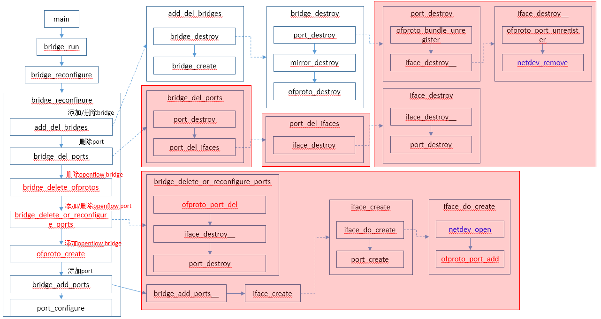

# Port操作

Port操作的总入口是bridge_reconfigure函数， 整体调用流程如下：



Port操作的调用流程如下：


Port数据结构：


# bridge_del_ports

```C
static void bridge_del_ports(struct bridge *br, const struct shash *wanted_ports)
{
    struct shash_node *port_node;
    struct port *port, *next;

    /* Get rid of deleted ports.
     * Get rid of deleted interfaces on ports that still exist. */
    HMAP_FOR_EACH_SAFE (port, next, hmap_node, &br->ports) {
        port->cfg = shash_find_data(wanted_ports, port->name);
        if (!port->cfg) {
            port_destroy(port);       //port已经被删除，则删除该port
        } else {
            port_del_ifaces(port);    //清除不需要的ifaces
        }
    }

    /* Update iface->cfg and iface->type in interfaces that still exist. */
    SHASH_FOR_EACH (port_node, wanted_ports) {
        const struct ovsrec_port *port = port_node->data;
        size_t i;

        for (i = 0; i < port->n_interfaces; i++) {
            const struct ovsrec_interface *cfg = port->interfaces[i];
            struct iface *iface = iface_lookup(br, cfg->name);
            const char *type = iface_get_type(cfg, br->cfg);

            if (iface) {
                iface->cfg = cfg;
                iface->type = type;
            } else if (!strcmp(type, "null")) {
                VLOG_WARN_ONCE("%s: The null interface type is deprecated and"
                               " may be removed in February 2013. Please email"
                               " dev@openvswitch.org with concerns.",
                               cfg->name);
            } else {
                /* We will add new interfaces later. */
            }
        }
    }
}
```


## port_destroy

```c
static void port_destroy(struct port *port)
{
    if (port) {
        struct bridge *br = port->bridge;
        struct iface *iface, *next;

        if (br->ofproto) {
            ofproto_bundle_unregister(br->ofproto, port);  //清除ofport bundle
        }

        LIST_FOR_EACH_SAFE (iface, next, port_elem, &port->ifaces) {
            iface_destroy__(iface);   //销毁port的所有iface
        }

        hmap_remove(&br->ports, &port->hmap_node);
        free(port->name);
        free(port);
    }
}
```

### iface_destroy__

```c
static void iface_destroy__(struct iface *iface)
{
    if (iface) {
        struct port *port = iface->port;
        struct bridge *br = port->bridge;

        if (br->ofproto && iface->ofp_port != OFPP_NONE) {
            ofproto_port_unregister(br->ofproto, iface->ofp_port);
        }

        if (iface->ofp_port != OFPP_NONE) {
            hmap_remove(&br->ifaces, &iface->ofp_port_node);
        }

        list_remove(&iface->port_elem);
        hmap_remove(&br->iface_by_name, &iface->name_node);

        /* The user is changing configuration here, so netdev_remove needs to be
         * used as opposed to netdev_close */
        netdev_remove(iface->netdev);   //从全局netdev设备中，删除netdev

        free(iface->name);
        free(iface);
    }
}

void ofproto_port_unregister(struct ofproto *ofproto, ofp_port_t ofp_port)
{
    struct ofport *port = ofproto_get_port(ofproto, ofp_port);
    if (port) {
        if (port->ofproto->ofproto_class->set_realdev) {
            port->ofproto->ofproto_class->set_realdev(port, 0, 0);
        }
        if (port->ofproto->ofproto_class->set_stp_port) {
            port->ofproto->ofproto_class->set_stp_port(port, NULL);
        }
        if (port->ofproto->ofproto_class->set_rstp_port) {
            port->ofproto->ofproto_class->set_rstp_port(port, NULL);
        }
        if (port->ofproto->ofproto_class->set_cfm) {
            port->ofproto->ofproto_class->set_cfm(port, NULL);
        }
        if (port->ofproto->ofproto_class->bundle_remove) {
            port->ofproto->ofproto_class->bundle_remove(port);
        }
    }
}

void netdev_remove(struct netdev *netdev)
{
    if (netdev) {
        ovs_mutex_lock(&netdev_mutex);
        if (netdev->node) {
            shash_delete(&netdev_shash, netdev->node);
            netdev->node = NULL;
            netdev_change_seq_changed(netdev);
        }
        netdev_unref(netdev);
    }
}

static void netdev_unref(struct netdev *dev)
    OVS_RELEASES(netdev_mutex)
{
    ovs_assert(dev->ref_cnt);
    if (!--dev->ref_cnt) {
        const struct netdev_class *class = dev->netdev_class;
        struct netdev_registered_class *rc;

        dev->netdev_class->destruct(dev);    //取消配置

        if (dev->node) {
            shash_delete(&netdev_shash, dev->node);
        }
        free(dev->name);
        dev->netdev_class->dealloc(dev);    //释放
        ovs_mutex_unlock(&netdev_mutex);

        ovs_mutex_lock(&netdev_class_mutex);
        rc = netdev_lookup_class(class->type);
        ovs_assert(rc->ref_cnt > 0);
        rc->ref_cnt--;
        ovs_mutex_unlock(&netdev_class_mutex);
    } else {
        ovs_mutex_unlock(&netdev_mutex);
    }
}
```


## port_del_ifaces

```c
static void port_del_ifaces(struct port *port)
{
    struct iface *iface, *next;
    struct sset new_ifaces;
    size_t i;

    /* Collect list of new interfaces. */
    sset_init(&new_ifaces);
    for (i = 0; i < port->cfg->n_interfaces; i++) {
        const char *name = port->cfg->interfaces[i]->name;
        const char *type = port->cfg->interfaces[i]->type;
        if (strcmp(type, "null")) {
            sset_add(&new_ifaces, name);   //新的ifaces
        }
    }

    /* Get rid of deleted interfaces. */
    LIST_FOR_EACH_SAFE (iface, next, port_elem, &port->ifaces) {  //遍历所有的ifaces
        if (!sset_contains(&new_ifaces, iface->name)) {  //ifaces不在新的ifaces中则删除iface
            iface_destroy(iface);
        }
    }

    sset_destroy(&new_ifaces);
}
```

### iface_destroy

```c
static void iface_destroy(struct iface *iface)
{
    if (iface) {
        struct port *port = iface->port;

        iface_destroy__(iface);
        if (list_is_empty(&port->ifaces)) {
            port_destroy(port);
        }
    }
}
```


# bridge_delete_or_reconfigure_ports

```c
static void bridge_delete_or_reconfigure_ports(struct bridge *br)
{
    struct ofproto_port ofproto_port;
    struct ofproto_port_dump dump;

    struct sset ofproto_ports;
    struct port *port, *port_next;

    /* List of "ofp_port"s to delete.  We make a list instead of deleting them
     * right away because ofproto implementations aren't necessarily able to
     * iterate through a changing list of ports in an entirely robust way. */
    ofp_port_t *del;
    size_t n, allocated;
    size_t i;

    del = NULL;
    n = allocated = 0;
    sset_init(&ofproto_ports);

    /* Main task: Iterate over the ports in 'br->ofproto' and remove the ports
     * that are not configured in the database.  (This commonly happens when
     * ports have been deleted, e.g. with "ovs-vsctl del-port".)
     *
     * Side tasks: Reconfigure the ports that are still in 'br'.  Delete ports
     * that have the wrong OpenFlow port number (and arrange to add them back
     * with the correct OpenFlow port number). */
    OFPROTO_PORT_FOR_EACH (&ofproto_port, &dump, br->ofproto) {    //遍历openflow端口
        ofp_port_t requested_ofp_port;
        struct iface *iface;

        sset_add(&ofproto_ports, ofproto_port.name);

        iface = iface_lookup(br, ofproto_port.name);   //根据端口名查找iface
        if (!iface) {     //如果iface不存在，则删除该openflow端口
            /* No such iface is configured, so we should delete this
             * ofproto_port.
             *
             * As a corner case exception, keep the port if it's a bond fake
             * interface. */
            if (bridge_has_bond_fake_iface(br, ofproto_port.name)
                && !strcmp(ofproto_port.type, "internal")) {
                continue;
            }
            goto delete;
        }

		//端口类型不匹配或者更新netdev属性失败，删除该端口和iface
        if (strcmp(ofproto_port.type, iface->type)    
            || netdev_set_config(iface->netdev, &iface->cfg->options, NULL)) {
            /* The interface is the wrong type or can't be configured.
             * Delete it. */
            goto delete;
        }

        /* If the requested OpenFlow port for 'iface' changed, and it's not
         * already the correct port, then we might want to temporarily delete
         * this interface, so we can add it back again with the new OpenFlow
         * port number. */
        requested_ofp_port = iface_get_requested_ofp_port(iface->cfg);  //得到配置的openflow端口号
        if (iface->ofp_port != OFPP_LOCAL &&
            requested_ofp_port != OFPP_NONE &&
            requested_ofp_port != iface->ofp_port) {  //端口和当前iface的端口不一致
            ofp_port_t victim_request;
            struct iface *victim;

            /* Check for an existing OpenFlow port currently occupying
             * 'iface''s requested port number.  If there isn't one, then
             * delete this port.  Otherwise we need to consider further. */
            victim = iface_from_ofp_port(br, requested_ofp_port);  //根据请求的openflow端口号查询iface
            if (!victim) {
                goto delete;   //根据请求的openflow端口号未查询到iface，则删除当前iface
            }

            /* 'victim' is a port currently using 'iface''s requested port
             * number.  Unless 'victim' specifically requested that port
             * number, too, then we can delete both 'iface' and 'victim'
             * temporarily.  (We'll add both of them back again later with new
             * OpenFlow port numbers.)
             *
             * If 'victim' did request port number 'requested_ofp_port', just
             * like 'iface', then that's a configuration inconsistency that we
             * can't resolve.  We might as well let it keep its current port
             * number. */
            victim_request = iface_get_requested_ofp_port(victim->cfg);  
            if (victim_request != requested_ofp_port) {  //如果victim的配置不一致，则删除victim
                del = add_ofp_port(victim->ofp_port, del, &n, &allocated);
                iface_destroy(victim);
                goto delete;      //同时也需要删除iface
            }
        }

        /* Keep it. */
        continue;

    delete:
        iface_destroy(iface);   
        del = add_ofp_port(ofproto_port.ofp_port, del, &n, &allocated);   //openflow端口添加到删除列表中
    }
    for (i = 0; i < n; i++) {
        ofproto_port_del(br->ofproto, del[i]);    //删除openflow端口
    }
    free(del);

    /* Iterate over this module's idea of interfaces in 'br'.  Remove any ports
     * that we didn't see when we iterated through the datapath, i.e. ports
     * that disappeared underneath use.  This is an unusual situation, but it
     * can happen in some cases:
     *
     *     - An admin runs a command like "ovs-dpctl del-port" (which is a bad
     *       idea but could happen).
     *
     *     - The port represented a device that disappeared, e.g. a tuntap
     *       device destroyed via "tunctl -d", a physical Ethernet device
     *       whose module was just unloaded via "rmmod", or a virtual NIC for a
     *       VM whose VM was just terminated. */
    HMAP_FOR_EACH_SAFE (port, port_next, hmap_node, &br->ports) {
        struct iface *iface, *iface_next;

        LIST_FOR_EACH_SAFE (iface, iface_next, port_elem, &port->ifaces) {  //遍历iface
            if (!sset_contains(&ofproto_ports, iface->name)) {   //如果openflow端口中没有该iface，则删除该iface
                iface_destroy__(iface);
            }
        }

        if (list_is_empty(&port->ifaces)) {  //如果端口没有iface，则删除该端口
            port_destroy(port);
        }
    }
    sset_destroy(&ofproto_ports);
}
```


## ofproto_port_del

```c
int ofproto_port_del(struct ofproto *ofproto, ofp_port_t ofp_port)
{
    struct ofport *ofport = ofproto_get_port(ofproto, ofp_port);
    const char *name = ofport ? netdev_get_name(ofport->netdev) : "<unknown>";
    struct simap_node *ofp_request_node;
    int error;

    ofp_request_node = simap_find(&ofproto->ofp_requests, name);
    if (ofp_request_node) {
        simap_delete(&ofproto->ofp_requests, ofp_request_node);
    }

    error = ofproto->ofproto_class->port_del(ofproto, ofp_port);   //调用openflow 删除端口接口
    if (!error && ofport) {
        /* 'name' is the netdev's name and update_port() is going to close the
         * netdev.  Just in case update_port() refers to 'name' after it
         * destroys 'ofport', make a copy of it around the update_port()
         * call. */
        char *devname = xstrdup(name);
        update_port(ofproto, devname);       //更新openflow交换机的端口
        free(devname);
    }
    return error;
}
```


# bridge_add_ports

```c
static void bridge_add_ports(struct bridge *br, const struct shash *wanted_ports)
{
    /* First add interfaces that request a particular port number. */
    bridge_add_ports__(br, wanted_ports, true);

    /* Then add interfaces that want automatic port number assignment.
     * We add these afterward to avoid accidentally taking a specifically
     * requested port number. */
    bridge_add_ports__(br, wanted_ports, false);
}

static void
bridge_add_ports__(struct bridge *br, const struct shash *wanted_ports,
                   bool with_requested_port)
{
    struct shash_node *port_node;

    SHASH_FOR_EACH (port_node, wanted_ports) {
        const struct ovsrec_port *port_cfg = port_node->data;
        size_t i;

        for (i = 0; i < port_cfg->n_interfaces; i++) {
            const struct ovsrec_interface *iface_cfg = port_cfg->interfaces[i];
            ofp_port_t requested_ofp_port;

            requested_ofp_port = iface_get_requested_ofp_port(iface_cfg);
            if ((requested_ofp_port != OFPP_NONE) == with_requested_port) {
                struct iface *iface = iface_lookup(br, iface_cfg->name);

                if (!iface) {
                    iface_create(br, iface_cfg, port_cfg);    //iface未创建，则创建iface
                }
            }
        }
    }
}
```


## iface_create

```c
static bool iface_create(struct bridge *br, const struct ovsrec_interface *iface_cfg,
             const struct ovsrec_port *port_cfg)
{
    struct netdev *netdev;
    struct iface *iface;
    ofp_port_t ofp_port;
    struct port *port;
    char *errp = NULL;
    int error;

    /* Do the bits that can fail up front. */
    ovs_assert(!iface_lookup(br, iface_cfg->name));
	//创建netdev和openflow port
    error = iface_do_create(br, iface_cfg, port_cfg, &ofp_port, &netdev, &errp);  
    if (error) {
        iface_clear_db_record(iface_cfg, errp);
        free(errp);
        return false;
    }

    /* Get or create the port structure. */
    port = port_lookup(br, port_cfg->name);
    if (!port) {
        port = port_create(br, port_cfg);      //创建port
    }

    /* Create the iface structure. */
    iface = xzalloc(sizeof *iface);           //创建iface
    list_push_back(&port->ifaces, &iface->port_elem);    //iface添加到port的ifaces链表中
    hmap_insert(&br->iface_by_name, &iface->name_node,   //iface添加到br的ifaces map中
                hash_string(iface_cfg->name, 0));
    iface->port = port;
    iface->name = xstrdup(iface_cfg->name);
    iface->ofp_port = ofp_port;
    iface->netdev = netdev;
    iface->type = iface_get_type(iface_cfg, br->cfg);
    iface->cfg = iface_cfg;
    hmap_insert(&br->ifaces, &iface->ofp_port_node,  //iface添加到br的ifaces map中
                hash_ofp_port(ofp_port));

    /* Populate initial status in database. */
    iface_refresh_stats(iface);
    iface_refresh_netdev_status(iface);

    /* Add bond fake iface if necessary. */
    if (port_is_bond_fake_iface(port)) {
        struct ofproto_port ofproto_port;

        if (ofproto_port_query_by_name(br->ofproto, port->name,
                                       &ofproto_port)) {
            struct netdev *netdev;
            int error;

            error = netdev_open(port->name, "internal", &netdev);
            if (!error) {
                ofp_port_t fake_ofp_port = OFPP_NONE;
                ofproto_port_add(br->ofproto, netdev, &fake_ofp_port);
                netdev_close(netdev);
            } else {
                VLOG_WARN("could not open network device %s (%s)",
                          port->name, ovs_strerror(error));
            }
        } else {
            /* Already exists, nothing to do. */
            ofproto_port_destroy(&ofproto_port);
        }
    }

    return true;
}
```


### port_create

```c
static struct port * port_create(struct bridge *br, const struct ovsrec_port *cfg)
{
    struct port *port;

    port = xzalloc(sizeof *port);
    port->bridge = br;
    port->name = xstrdup(cfg->name);
    port->cfg = cfg;
    list_init(&port->ifaces);

    hmap_insert(&br->ports, &port->hmap_node, hash_string(port->name, 0));
    return port;
}
```


### iface_do_create

```c
static int iface_do_create(const struct bridge *br,
                const struct ovsrec_interface *iface_cfg,
                const struct ovsrec_port *port_cfg,
                ofp_port_t *ofp_portp, struct netdev **netdevp,
                char **errp)
{
    struct netdev *netdev = NULL;
    int error;

    if (netdev_is_reserved_name(iface_cfg->name)) {   //检查端口名是否为保留名字
        VLOG_WARN("could not create interface %s, name is reserved",
                  iface_cfg->name);
        error = EINVAL;
        goto error;
    }

    error = netdev_open(iface_cfg->name,      //打开netdev设备
                        iface_get_type(iface_cfg, br->cfg), &netdev);
    if (error) {
        VLOG_WARN_BUF(errp, "could not open network device %s (%s)",
                      iface_cfg->name, ovs_strerror(error));
        goto error;
    }

    error = iface_set_netdev_config(iface_cfg, netdev, errp);
    if (error) {
        goto error;
    }

    *ofp_portp = iface_pick_ofport(iface_cfg);  //得到ofport端口号
    error = ofproto_port_add(br->ofproto, netdev, ofp_portp);   //of协议添加端口
    if (error) {
        goto error;
    }

    VLOG_INFO("bridge %s: added interface %s on port %d",
              br->name, iface_cfg->name, *ofp_portp);

    if (port_cfg->vlan_mode && !strcmp(port_cfg->vlan_mode, "splinter")) {
        netdev_turn_flags_on(netdev, NETDEV_UP, NULL);
    }

    *netdevp = netdev;
    return 0;

error:
    *netdevp = NULL;
    netdev_close(netdev);
    return error;
}
```

### netdev_open

```
int
netdev_open(const char *name, const char *type, struct netdev **netdevp)
    OVS_EXCLUDED(netdev_mutex)
{
    struct netdev *netdev;
    int error;

    netdev_initialize();

    ovs_mutex_lock(&netdev_class_mutex);
    ovs_mutex_lock(&netdev_mutex);
    netdev = shash_find_data(&netdev_shash, name);   //从全局数组中查找netdev设备
    if (!netdev) {
        struct netdev_registered_class *rc;

        rc = netdev_lookup_class(type && type[0] ? type : "system");
        if (rc) {
		    //调用netdev_class的alloc方法，根据端口类型实际分配netdev_linux或netdev_dpdk对象
            netdev = rc->class->alloc();    
            if (netdev) {
                memset(netdev, 0, sizeof *netdev);
                netdev->netdev_class = rc->class;
                netdev->name = xstrdup(name);
                netdev->change_seq = 1;
                netdev->node = shash_add(&netdev_shash, name, netdev);    //添加到全局数组中

                /* By default enable one tx and rx queue per netdev. */
                netdev->n_txq = netdev->netdev_class->send ? 1 : 0;
                netdev->n_rxq = netdev->netdev_class->rxq_alloc ? 1 : 0;

                list_init(&netdev->saved_flags_list);

                error = rc->class->construct(netdev);    //调用netdev_class的construct方法，构建netdev设备
                if (!error) {
                    rc->ref_cnt++;
                    netdev_change_seq_changed(netdev);
                } else {
                    free(netdev->name);
                    ovs_assert(list_is_empty(&netdev->saved_flags_list));
                    shash_delete(&netdev_shash, netdev->node);
                    rc->class->dealloc(netdev);
                }
            } else {
                error = ENOMEM;
            }
        } else {
            VLOG_WARN("could not create netdev %s of unknown type %s",
                      name, type);
            error = EAFNOSUPPORT;
        }
    } else {
        error = 0;
    }

    if (!error) {
        netdev->ref_cnt++;
        *netdevp = netdev;
    } else {
        *netdevp = NULL;
    }
    ovs_mutex_unlock(&netdev_mutex);
    ovs_mutex_unlock(&netdev_class_mutex);

    return error;
}
```


# port_configure

处理vlan（access/trunk等等）、bond（lacp）等端口配置。

```c

static void
port_configure(struct port *port)
{
    const struct ovsrec_port *cfg = port->cfg;
    struct bond_settings bond_settings;
    struct lacp_settings lacp_settings;
    struct ofproto_bundle_settings s;
    struct iface *iface;

    if (cfg->vlan_mode && !strcmp(cfg->vlan_mode, "splinter")) {
        configure_splinter_port(port);
        return;
    }

    /* Get name. */
    s.name = port->name;

    /* Get slaves. */
    s.n_slaves = 0;
    s.slaves = xmalloc(list_size(&port->ifaces) * sizeof *s.slaves);
    LIST_FOR_EACH (iface, port_elem, &port->ifaces) {
        s.slaves[s.n_slaves++] = iface->ofp_port;
    }

    /* Get VLAN tag. */
    s.vlan = -1;
    if (cfg->tag && *cfg->tag >= 0 && *cfg->tag <= 4095) {
        s.vlan = *cfg->tag;
    }

    /* Get VLAN trunks. */
    s.trunks = NULL;
    if (cfg->n_trunks) {
        s.trunks = vlan_bitmap_from_array(cfg->trunks, cfg->n_trunks);
    }

    /* Get VLAN mode. */
    if (cfg->vlan_mode) {
        if (!strcmp(cfg->vlan_mode, "access")) {
            s.vlan_mode = PORT_VLAN_ACCESS;
        } else if (!strcmp(cfg->vlan_mode, "trunk")) {
            s.vlan_mode = PORT_VLAN_TRUNK;
        } else if (!strcmp(cfg->vlan_mode, "native-tagged")) {
            s.vlan_mode = PORT_VLAN_NATIVE_TAGGED;
        } else if (!strcmp(cfg->vlan_mode, "native-untagged")) {
            s.vlan_mode = PORT_VLAN_NATIVE_UNTAGGED;
        } else {
            /* This "can't happen" because ovsdb-server should prevent it. */
            VLOG_WARN("port %s: unknown VLAN mode %s, falling "
                      "back to trunk mode", port->name, cfg->vlan_mode);
            s.vlan_mode = PORT_VLAN_TRUNK;
        }
    } else {
        if (s.vlan >= 0) {
            s.vlan_mode = PORT_VLAN_ACCESS;
            if (cfg->n_trunks) {
                VLOG_WARN("port %s: ignoring trunks in favor of implicit vlan",
                          port->name);
            }
        } else {
            s.vlan_mode = PORT_VLAN_TRUNK;
        }
    }
    s.use_priority_tags = smap_get_bool(&cfg->other_config, "priority-tags",
                                        false);

    /* Get LACP settings. */
    s.lacp = port_configure_lacp(port, &lacp_settings);     //配置lacp
    if (s.lacp) {
        size_t i = 0;

        s.lacp_slaves = xmalloc(s.n_slaves * sizeof *s.lacp_slaves);
        LIST_FOR_EACH (iface, port_elem, &port->ifaces) {
            iface_configure_lacp(iface, &s.lacp_slaves[i++]);
        }
    } else {
        s.lacp_slaves = NULL;
    }

    /* Get bond settings. */
    if (s.n_slaves > 1) {
        s.bond = &bond_settings;
        port_configure_bond(port, &bond_settings);    //配置bond
    } else {
        s.bond = NULL;
        LIST_FOR_EACH (iface, port_elem, &port->ifaces) {
            netdev_set_miimon_interval(iface->netdev, 0);
        }
    }

    /* Register. */
    ofproto_bundle_register(port->bridge->ofproto, port, &s);    //注册of bundle

    /* Clean up. */
    free(s.slaves);
    free(s.trunks);
    free(s.lacp_slaves);
}
```

