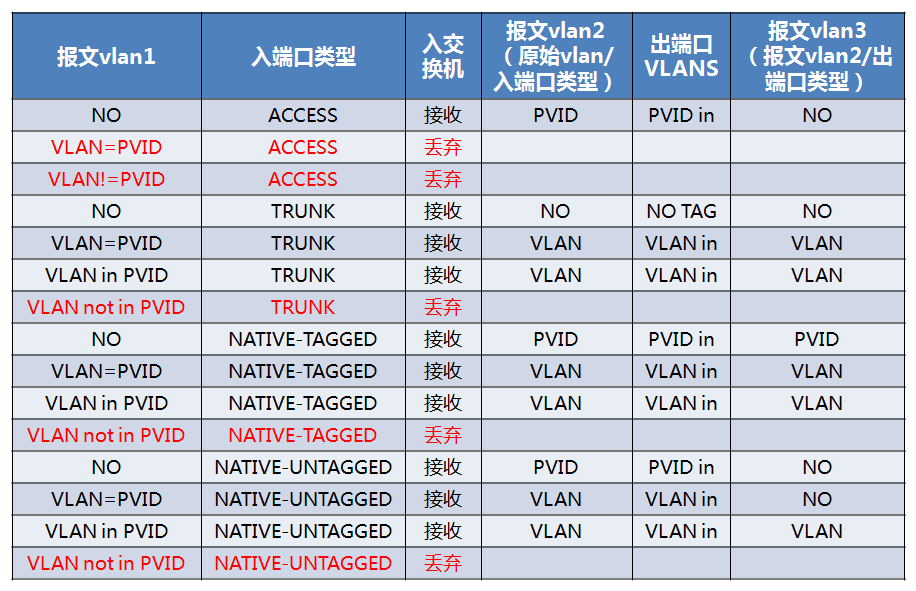
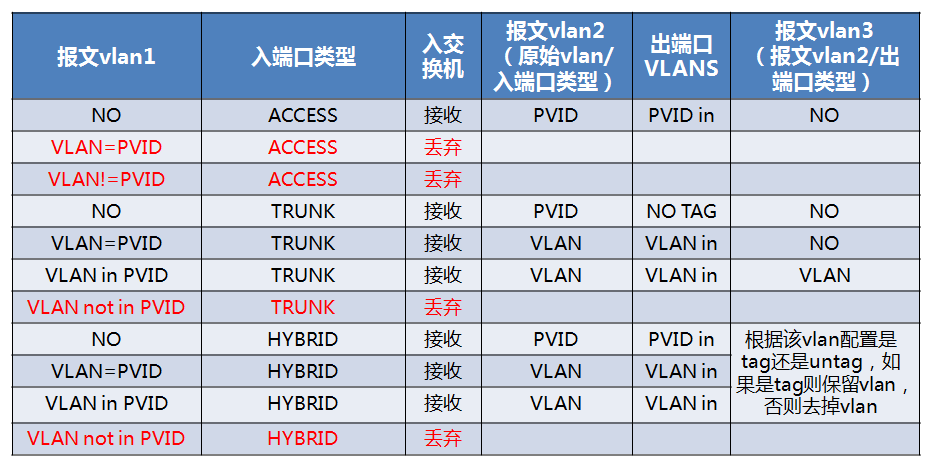

# Vlan端口

本文介绍配置vlan端口添加、删除和转发流程。


# vlan端口类型

```c
enum port_vlan_mode {
    /* This port is an access port.  'vlan' is the VLAN ID.  'trunks' is
     * ignored. */
    PORT_VLAN_ACCESS,

    /* This port is a trunk.  'trunks' is the set of trunks. 'vlan' is
     * ignored. */
    PORT_VLAN_TRUNK,

    /* Untagged incoming packets are part of 'vlan', as are incoming packets
     * tagged with 'vlan'.  Outgoing packets tagged with 'vlan' stay tagged.
     * Other VLANs in 'trunks' are trunked. */
    PORT_VLAN_NATIVE_TAGGED,

    /* Untagged incoming packets are part of 'vlan', as are incoming packets
     * tagged with 'vlan'.  Outgoing packets tagged with 'vlan' are untagged.
     * Other VLANs in 'trunks' are trunked. */
    PORT_VLAN_NATIVE_UNTAGGED
};
```

ovs vlan端口行为：



物理交换机vlan端口行为：




# vlan端口数据面处理

vlan端口仅在normal流程中会进行check，匹配vlan值等。

