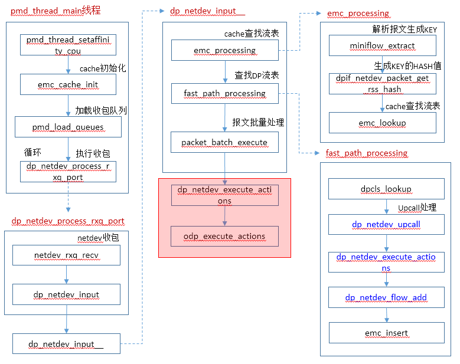

# Datapath Actions

本文介绍DPDK OVS完成流表匹配后，执行actions的流程。

调用流程：




# dp_netdev_execute_actions

```c
static void dp_netdev_execute_actions(struct dp_netdev_pmd_thread *pmd,
                          struct dp_packet **packets, int cnt,
                          bool may_steal,
                          const struct nlattr *actions, size_t actions_len)
{
    struct dp_netdev_execute_aux aux = { pmd };

    odp_execute_actions(&aux, packets, cnt, may_steal, actions,  //执行actions
                        actions_len, dp_execute_cb);
}
```


# odp_execute_actions

```c
void odp_execute_actions(void *dp, struct dp_packet **packets, int cnt, bool steal,
                    const struct nlattr *actions, size_t actions_len,
                    odp_execute_cb dp_execute_action)
{
    const struct nlattr *a;
    unsigned int left;
    int i;

    NL_ATTR_FOR_EACH_UNSAFE (a, left, actions, actions_len) {
        int type = nl_attr_type(a);
        bool last_action = (left <= NLA_ALIGN(a->nla_len));   //判断是否为最后一个action

		//如下操作需要assistance：OUTPUT，TUNNEL_PUSH，TUNNEL_POP，USERSPACE，RECIRC，CT
        if (requires_datapath_assistance(a)) {   
            if (dp_execute_action) {
                /* Allow 'dp_execute_action' to steal the packet data if we do
                 * not need it any more. */
                bool may_steal = steal && last_action;   //只有最后一个action，该值才有可能为真

                dp_execute_action(dp, packets, cnt, a, may_steal);   //实际调用dp_execute_cb函数

                if (last_action) {
                    /* We do not need to free the packets. dp_execute_actions()
                     * has stolen them */
                    return;
                }
            }
            continue;
        }

		//其他action处理
        switch ((enum ovs_action_attr) type) {
        case OVS_ACTION_ATTR_HASH: {
            const struct ovs_action_hash *hash_act = nl_attr_get(a);

            /* Calculate a hash value directly.  This might not match the
             * value computed by the datapath, but it is much less expensive,
             * and the current use case (bonding) does not require a strict
             * match to work properly. */
            if (hash_act->hash_alg == OVS_HASH_ALG_L4) {
                struct flow flow;
                uint32_t hash;

                for (i = 0; i < cnt; i++) {
                    flow_extract(packets[i], &flow);  //解析报文，生成miniflow再扩展成flow
                    hash = flow_hash_5tuple(&flow, hash_act->hash_basis);   //计算hash值

                    packets[i]->md.dp_hash = hash;    //hash值保存到metadata中
                }
            } else {
                /* Assert on unknown hash algorithm.  */
                OVS_NOT_REACHED();
            }
            break;
        }

        case OVS_ACTION_ATTR_PUSH_VLAN: {
            const struct ovs_action_push_vlan *vlan = nl_attr_get(a);

            for (i = 0; i < cnt; i++) {
                eth_push_vlan(packets[i], vlan->vlan_tpid, vlan->vlan_tci);
            }
            break;
        }

        case OVS_ACTION_ATTR_POP_VLAN:
            for (i = 0; i < cnt; i++) {
                eth_pop_vlan(packets[i]);
            }
            break;

        case OVS_ACTION_ATTR_PUSH_MPLS: {
            const struct ovs_action_push_mpls *mpls = nl_attr_get(a);

            for (i = 0; i < cnt; i++) {
                push_mpls(packets[i], mpls->mpls_ethertype, mpls->mpls_lse);
            }
            break;
         }

        case OVS_ACTION_ATTR_POP_MPLS:
            for (i = 0; i < cnt; i++) {
                pop_mpls(packets[i], nl_attr_get_be16(a));
            }
            break;

        case OVS_ACTION_ATTR_SET:
            for (i = 0; i < cnt; i++) {
                odp_execute_set_action(packets[i], nl_attr_get(a));
            }
            break;

        case OVS_ACTION_ATTR_SET_MASKED:
            for (i = 0; i < cnt; i++) {
                odp_execute_masked_set_action(packets[i], nl_attr_get(a));
            }
            break;

        case OVS_ACTION_ATTR_SAMPLE:
            for (i = 0; i < cnt; i++) {
                odp_execute_sample(dp, packets[i], steal && last_action, a,
                                   dp_execute_action);
            }

            if (last_action) {
                /* We do not need to free the packets. odp_execute_sample() has
                 * stolen them*/
                return;
            }
            break;

        case OVS_ACTION_ATTR_OUTPUT:
        case OVS_ACTION_ATTR_TUNNEL_PUSH:
        case OVS_ACTION_ATTR_TUNNEL_POP:
        case OVS_ACTION_ATTR_USERSPACE:
        case OVS_ACTION_ATTR_RECIRC:
        case OVS_ACTION_ATTR_CT:
        case OVS_ACTION_ATTR_UNSPEC:
        case __OVS_ACTION_ATTR_MAX:
            OVS_NOT_REACHED();
        }
    }

    if (steal) {
        for (i = 0; i < cnt; i++) {
            dp_packet_delete(packets[i]);     //删除报文
        }
    }
}
```


## eth_push_vlan

```c
void eth_push_vlan(struct dp_packet *packet, ovs_be16 tpid, ovs_be16 tci)
{
    struct vlan_eth_header *veh;

    /* Insert new 802.1Q header. */
    veh = dp_packet_resize_l2(packet, VLAN_HEADER_LEN);
    memmove(veh, (char *)veh + VLAN_HEADER_LEN, 2 * ETH_ADDR_LEN);  //移动内存
    veh->veth_type = tpid;
    veh->veth_tci = tci & htons(~VLAN_CFI);
}
```


## eth_push_vlan

```c
void eth_pop_vlan(struct dp_packet *packet)
{
    struct vlan_eth_header *veh = dp_packet_l2(packet);

    if (veh && dp_packet_size(packet) >= sizeof *veh
        && eth_type_vlan(veh->veth_type)) {

        memmove((char *)veh + VLAN_HEADER_LEN, veh, 2 * ETH_ADDR_LEN);  //移动内存
        dp_packet_resize_l2(packet, -VLAN_HEADER_LEN);
    }
}
```


# dp_execute_cb


```c
static void dp_execute_cb(void *aux_, struct dp_packet **packets, int cnt,
              const struct nlattr *a, bool may_steal)
    OVS_NO_THREAD_SAFETY_ANALYSIS
{
    struct dp_netdev_execute_aux *aux = aux_;
    uint32_t *depth = recirc_depth_get();
    struct dp_netdev_pmd_thread *pmd = aux->pmd;
    struct dp_netdev *dp = pmd->dp;
    int type = nl_attr_type(a);
    struct dp_netdev_port *p;
    int i;

    switch ((enum ovs_action_attr)type) {
    case OVS_ACTION_ATTR_OUTPUT:
        p = dp_netdev_lookup_port(dp, u32_to_odp(nl_attr_get_u32(a)));
        if (OVS_LIKELY(p)) {
            int tx_qid;

            atomic_read_relaxed(&pmd->tx_qid, &tx_qid);

            netdev_send(p->netdev, tx_qid, packets, cnt, may_steal);
            return;
        }
        break;

    case OVS_ACTION_ATTR_TUNNEL_PUSH:
        if (*depth < MAX_RECIRC_DEPTH) {
            struct dp_packet *tnl_pkt[NETDEV_MAX_BURST];
            int err;

            if (!may_steal) {
                dp_netdev_clone_pkt_batch(tnl_pkt, packets, cnt);
                packets = tnl_pkt;
            }

            err = push_tnl_action(dp, a, packets, cnt);
            if (!err) {
                (*depth)++;
                dp_netdev_recirculate(pmd, packets, cnt);
                (*depth)--;
            } else {
                dp_netdev_drop_packets(tnl_pkt, cnt, !may_steal);
            }
            return;
        }
        break;

    case OVS_ACTION_ATTR_TUNNEL_POP:
        if (*depth < MAX_RECIRC_DEPTH) {
            odp_port_t portno = u32_to_odp(nl_attr_get_u32(a));

            p = dp_netdev_lookup_port(dp, portno);
            if (p) {
                struct dp_packet *tnl_pkt[NETDEV_MAX_BURST];
                int err;

                if (!may_steal) {
                   dp_netdev_clone_pkt_batch(tnl_pkt, packets, cnt);
                   packets = tnl_pkt;
                }

                err = netdev_pop_header(p->netdev, packets, cnt);
                if (!err) {

                    for (i = 0; i < cnt; i++) {
                        packets[i]->md.in_port.odp_port = portno;
                    }

                    (*depth)++;
                    dp_netdev_recirculate(pmd, packets, cnt);
                    (*depth)--;
                } else {
                    dp_netdev_drop_packets(tnl_pkt, cnt, !may_steal);
                }
                return;
            }
        }
        break;

    case OVS_ACTION_ATTR_USERSPACE:
        if (!fat_rwlock_tryrdlock(&dp->upcall_rwlock)) {
            const struct nlattr *userdata;
            struct ofpbuf actions;
            struct flow flow;
            ovs_u128 ufid;

            userdata = nl_attr_find_nested(a, OVS_USERSPACE_ATTR_USERDATA);
            ofpbuf_init(&actions, 0);

            for (i = 0; i < cnt; i++) {
                int error;

                ofpbuf_clear(&actions);

                flow_extract(packets[i], &flow);    //解析报文
                dpif_flow_hash(dp->dpif, &flow, sizeof flow, &ufid);
                error = dp_netdev_upcall(pmd, packets[i], &flow, NULL, &ufid,   //执行upcall
                                         DPIF_UC_ACTION, userdata,&actions,
                                         NULL);
                if (!error || error == ENOSPC) {
                    dp_netdev_execute_actions(pmd, &packets[i], 1, may_steal,   //执行actions
                                              actions.data, actions.size);
                } else if (may_steal) {
                    dp_packet_delete(packets[i]);
                }
            }
            ofpbuf_uninit(&actions);
            fat_rwlock_unlock(&dp->upcall_rwlock);

            return;
        }
        break;

    case OVS_ACTION_ATTR_RECIRC:
        if (*depth < MAX_RECIRC_DEPTH) {
            struct dp_packet *recirc_pkts[NETDEV_MAX_BURST];

            if (!may_steal) {   //不能steal，则需要拷贝
               dp_netdev_clone_pkt_batch(recirc_pkts, packets, cnt);
               packets = recirc_pkts;
            }

            for (i = 0; i < cnt; i++) {
                packets[i]->md.recirc_id = nl_attr_get_u32(a);   //recirc id在命令中设置，以区分不同的session
            }

            (*depth)++;
            dp_netdev_recirculate(pmd, packets, cnt);
            (*depth)--;

            return;
        }

        VLOG_WARN("Packet dropped. Max recirculation depth exceeded.");
        break;

    case OVS_ACTION_ATTR_CT:
        /* If a flow with this action is slow-pathed, datapath assistance is
         * required to implement it. However, we don't support this action
         * in the userspace datapath. */
        VLOG_WARN("Cannot execute conntrack action in userspace.");
        break;

    case OVS_ACTION_ATTR_PUSH_VLAN:
    case OVS_ACTION_ATTR_POP_VLAN:
    case OVS_ACTION_ATTR_PUSH_MPLS:
    case OVS_ACTION_ATTR_POP_MPLS:
    case OVS_ACTION_ATTR_SET:
    case OVS_ACTION_ATTR_SET_MASKED:
    case OVS_ACTION_ATTR_SAMPLE:
    case OVS_ACTION_ATTR_HASH:
    case OVS_ACTION_ATTR_UNSPEC:
    case __OVS_ACTION_ATTR_MAX:
        OVS_NOT_REACHED();
    }

    dp_netdev_drop_packets(packets, cnt, may_steal);
}
```


## netdev_send

```c
int netdev_send(struct netdev *netdev, int qid, struct dp_packet **buffers,
            int cnt, bool may_steal)
{
    int error;

    error = (netdev->netdev_class->send
             ? netdev->netdev_class->send(netdev, qid, buffers, cnt, may_steal)
             : EOPNOTSUPP);
    if (!error) {
        COVERAGE_INC(netdev_sent);
    }
    return error;
}
```


## dp_netdev_recirculate

```c
static void
dp_netdev_recirculate(struct dp_netdev_pmd_thread *pmd,
                      struct dp_packet **packets, int cnt)
{
     dp_netdev_input__(pmd, packets, cnt, true, 0);   //重新执行收包处理
}
```

