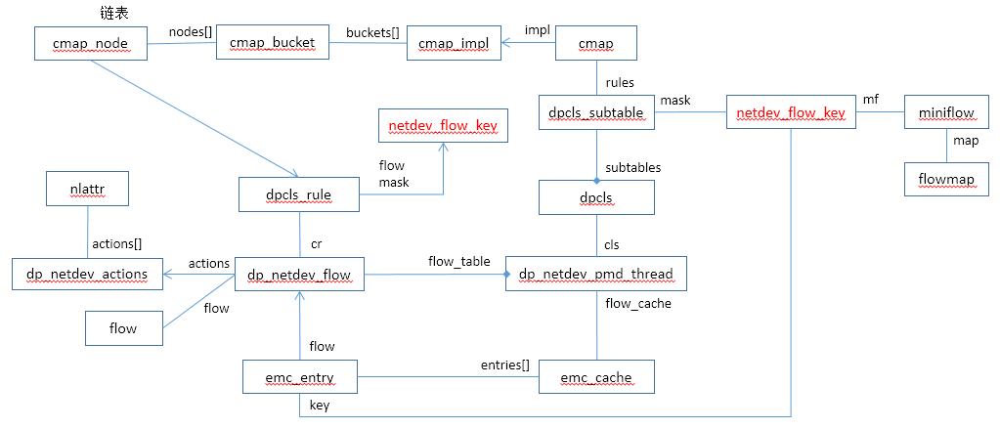
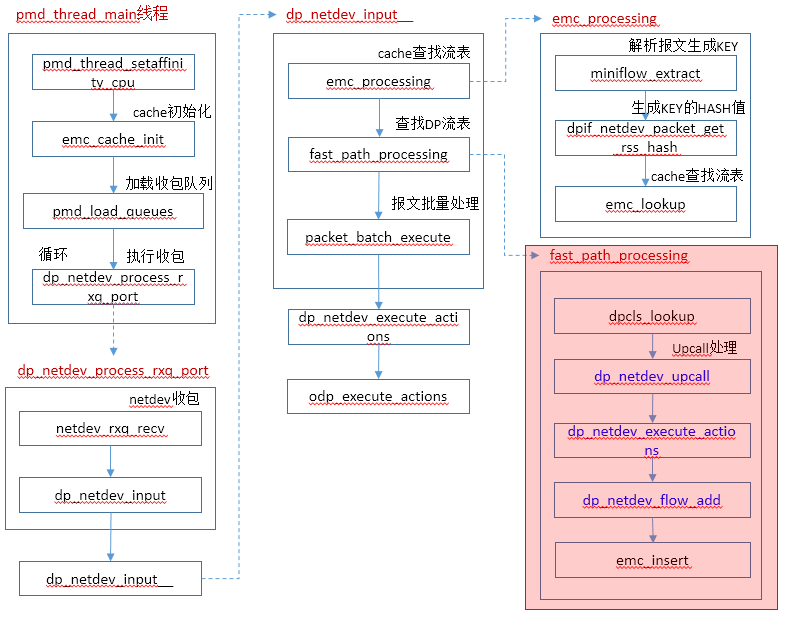

# Datapath Fast Path

DPDK OVS数据面在处理过程中，首先匹配cache表，如果cache表不匹配则走Fast Path路径进行流表匹配。

数据结构：



调用流程：




# fast_path_processing

```c
static inline void
fast_path_processing(struct dp_netdev_pmd_thread *pmd,
                     struct dp_packet **packets, size_t cnt,
                     struct netdev_flow_key *keys,
                     struct packet_batch batches[], size_t *n_batches)
{
#if !defined(__CHECKER__) && !defined(_WIN32)
    const size_t PKT_ARRAY_SIZE = cnt;
#else
    /* Sparse or MSVC doesn't like variable length array. */
    enum { PKT_ARRAY_SIZE = NETDEV_MAX_BURST };
#endif
    struct dpcls_rule *rules[PKT_ARRAY_SIZE];
    struct dp_netdev *dp = pmd->dp;
    struct emc_cache *flow_cache = &pmd->flow_cache;
    int miss_cnt = 0, lost_cnt = 0;
    bool any_miss;
    size_t i;

	//计算key.len值，即key.mf的长度
    for (i = 0; i < cnt; i++) {
        /* Key length is needed in all the cases, hash computed on demand. */
        keys[i].len = netdev_flow_key_size(miniflow_n_values(&keys[i].mf)); 
    }
    any_miss = !dpcls_lookup(&pmd->cls, keys, rules, cnt);
    if (OVS_UNLIKELY(any_miss) && !fat_rwlock_tryrdlock(&dp->upcall_rwlock)) {
        uint64_t actions_stub[512 / 8], slow_stub[512 / 8];
        struct ofpbuf actions, put_actions;
        ovs_u128 ufid;

		//初始化actions和put_actions对象
        ofpbuf_use_stub(&actions, actions_stub, sizeof actions_stub);  
        ofpbuf_use_stub(&put_actions, slow_stub, sizeof slow_stub);

        for (i = 0; i < cnt; i++) {
            struct dp_netdev_flow *netdev_flow;
            struct ofpbuf *add_actions;
            struct match match;
            int error;

            if (OVS_LIKELY(rules[i])) {     //rules有值，说明该报文已经匹配到流表
                continue;
            }

            /* It's possible that an earlier slow path execution installed
             * a rule covering this flow.  In this case, it's a lot cheaper
             * to catch it here than execute a miss. */
            netdev_flow = dp_netdev_pmd_lookup_flow(pmd, &keys[i]);   //根据key检索flow
            if (netdev_flow) {
                rules[i] = &netdev_flow->cr;
                continue;
            }

            miss_cnt++;

            match.tun_md.valid = false;
            miniflow_expand(&keys[i].mf, &match.flow);   //把minflow转化为flow

            ofpbuf_clear(&actions);
            ofpbuf_clear(&put_actions);

            dpif_flow_hash(dp->dpif, &match.flow, sizeof match.flow, &ufid);
            error = dp_netdev_upcall(pmd, packets[i], &match.flow, &match.wc,    //upcall处理
                                     &ufid, DPIF_UC_MISS, NULL, &actions,
                                     &put_actions);
            if (OVS_UNLIKELY(error && error != ENOSPC)) {
                dp_packet_delete(packets[i]);
                lost_cnt++;
                continue;
            }

            /* The Netlink encoding of datapath flow keys cannot express
             * wildcarding the presence of a VLAN tag. Instead, a missing VLAN
             * tag is interpreted as exact match on the fact that there is no
             * VLAN.  Unless we refactor a lot of code that translates between
             * Netlink and struct flow representations, we have to do the same
             * here. */
            if (!match.wc.masks.vlan_tci) {
                match.wc.masks.vlan_tci = htons(0xffff);
            }

            /* We can't allow the packet batching in the next loop to execute
             * the actions.  Otherwise, if there are any slow path actions,
             * we'll send the packet up twice. */
            dp_netdev_execute_actions(pmd, &packets[i], 1, true,
                                      actions.data, actions.size);   //执行actions

            add_actions = put_actions.size ? &put_actions : &actions;   //需要插入的流表
            if (OVS_LIKELY(error != ENOSPC)) {
                /* XXX: There's a race window where a flow covering this packet
                 * could have already been installed since we last did the flow
                 * lookup before upcall.  This could be solved by moving the
                 * mutex lock outside the loop, but that's an awful long time
                 * to be locking everyone out of making flow installs.  If we
                 * move to a per-core classifier, it would be reasonable. */
                ovs_mutex_lock(&pmd->flow_mutex);
                netdev_flow = dp_netdev_pmd_lookup_flow(pmd, &keys[i]);   //查询流表，应该不存在
                if (OVS_LIKELY(!netdev_flow)) {
                    netdev_flow = dp_netdev_flow_add(pmd, &match, &ufid,   //添加流表
                                                     add_actions->data,
                                                     add_actions->size);
                }
                ovs_mutex_unlock(&pmd->flow_mutex);

                emc_insert(flow_cache, &keys[i], netdev_flow);    //upcall处理新增的流表，添加到缓存中
            }
        }

        ofpbuf_uninit(&actions);
        ofpbuf_uninit(&put_actions);
        fat_rwlock_unlock(&dp->upcall_rwlock);
        dp_netdev_count_packet(pmd, DP_STAT_LOST, lost_cnt);
    } else if (OVS_UNLIKELY(any_miss)) {
        for (i = 0; i < cnt; i++) {
            if (OVS_UNLIKELY(!rules[i])) {
                dp_packet_delete(packets[i]);
                lost_cnt++;
                miss_cnt++;
            }
        }
    }

    for (i = 0; i < cnt; i++) {                   //遍历所有报文
        struct dp_packet *packet = packets[i];
        struct dp_netdev_flow *flow;

        if (OVS_UNLIKELY(!rules[i])) {    //upcall处理的报文对应rules为空
            continue;
        }

        flow = dp_netdev_flow_cast(rules[i]);     

        emc_insert(flow_cache, &keys[i], flow);    //直接查找流表匹配到流表，添加到缓存中
        dp_netdev_queue_batches(packet, flow, &keys[i].mf, batches, n_batches);   //报文添加到batches中
    }

    dp_netdev_count_packet(pmd, DP_STAT_MASKED_HIT, cnt - miss_cnt);
    dp_netdev_count_packet(pmd, DP_STAT_MISS, miss_cnt);
    dp_netdev_count_packet(pmd, DP_STAT_LOST, lost_cnt);
}
```


## dp_netdev_pmd_lookup_flow

```c
static struct dp_netdev_flow *
dp_netdev_pmd_lookup_flow(const struct dp_netdev_pmd_thread *pmd,
                          const struct netdev_flow_key *key)
{
    struct dp_netdev_flow *netdev_flow;
    struct dpcls_rule *rule;

    dpcls_lookup(&pmd->cls, key, &rule, 1);
    netdev_flow = dp_netdev_flow_cast(rule);

    return netdev_flow;
}
```


## miniflow_expand

```c
void miniflow_expand(const struct miniflow *src, struct flow *dst)
{
    memset(dst, 0, sizeof *dst);
    flow_union_with_miniflow(dst, src);
}

static inline void flow_union_with_miniflow(struct flow *dst, const struct miniflow *src)
{
    flow_union_with_miniflow_subset(dst, src, src->map);
}

static inline void flow_union_with_miniflow_subset(struct flow *dst, const struct miniflow *src,
                                struct flowmap subset)
{
    uint64_t *dst_u64 = (uint64_t *) dst;
    const uint64_t *p = miniflow_get_values(src);
    map_t map;

    FLOWMAP_FOR_EACH_MAP (map, subset) {
        size_t idx;

        MAP_FOR_EACH_INDEX(idx, map) {
            dst_u64[idx] |= *p++;
        }
        dst_u64 += MAP_T_BITS;
    }
}
```


# dpcls_lookup

```c
static bool
dpcls_lookup(const struct dpcls *cls, const struct netdev_flow_key keys[],
             struct dpcls_rule **rules, const size_t cnt)
{
    /* The batch size 16 was experimentally found faster than 8 or 32. */
    typedef uint16_t map_type;
#define MAP_BITS (sizeof(map_type) * CHAR_BIT)

#if !defined(__CHECKER__) && !defined(_WIN32)
    const int N_MAPS = DIV_ROUND_UP(cnt, MAP_BITS);   //根据报文数设置map数组大小，压缩成map数组的好处包括cache miss等
#else
    enum { N_MAPS = DIV_ROUND_UP(NETDEV_MAX_BURST, MAP_BITS) };
#endif
    map_type maps[N_MAPS];
    struct dpcls_subtable *subtable;

    memset(maps, 0xff, sizeof maps);
    if (cnt % MAP_BITS) {
        maps[N_MAPS - 1] >>= MAP_BITS - cnt % MAP_BITS; /* Clear extra bits. */
    }
    memset(rules, 0, cnt * sizeof *rules);   //初始化rule指针，都设置为null

    PVECTOR_FOR_EACH (subtable, &cls->subtables) {    //遍历所有的dpcls_subtable
        const struct netdev_flow_key *mkeys = keys;
        struct dpcls_rule **mrules = rules;
        map_type remains = 0;
        int m;

        BUILD_ASSERT_DECL(sizeof remains == sizeof *maps);

        for (m = 0; m < N_MAPS; m++, mkeys += MAP_BITS, mrules += MAP_BITS) {
            uint32_t hashes[MAP_BITS];
            const struct cmap_node *nodes[MAP_BITS];
            unsigned long map = maps[m];    //一个map代表一组报文
            int i;

            if (!map) {
                continue; /* Skip empty maps. */
            }

            /* Compute hashes for the remaining keys. */
            ULLONG_FOR_EACH_1(i, map) {    //处理一批报文，16个
                hashes[i] = netdev_flow_key_hash_in_mask(&mkeys[i],   //根据mask计算hash值
                                                         &subtable->mask);   //mask指定需要哪些值，以及掩码
            }
            /* Lookup. */
            map = cmap_find_batch(&subtable->rules, map, hashes, nodes);  //遍历cmap对象，找到与该hash值相同的node，node为一个链表
            /* Check results. */
            ULLONG_FOR_EACH_1(i, map) {    //map值中为1的表示查找hash的过程中，找到了相同hash值的流表
                struct dpcls_rule *rule;

                CMAP_NODE_FOR_EACH (rule, cmap_node, nodes[i]) {    //遍历链表
                    if (OVS_LIKELY(dpcls_rule_matches_key(rule, &mkeys[i]))) {
                        mrules[i] = rule;
                        goto next;
                    }
                }
                ULLONG_SET0(map, i);  /* Did not match. */
            next:
                ;                     /* Keep Sparse happy. */
            }
            maps[m] &= ~map;          /* Clear the found rules. */
            remains |= maps[m];       //值为1说明未匹配到
        }
        if (!remains) {
            return true;              /* All found. */
        }
    }
    return false;                     /* Some misses. */
}
```


## netdev_flow_key_hash_in_mask

```c
static inline uint32_t netdev_flow_key_hash_in_mask(const struct netdev_flow_key *key,
                             const struct netdev_flow_key *mask)
{
    const uint64_t *p = miniflow_get_values(&mask->mf);
    uint32_t hash = 0;
    uint64_t value;

    NETDEV_FLOW_KEY_FOR_EACH_IN_FLOWMAP(value, key, mask->mf.map) {   //按照mask来计算hash
        hash = hash_add64(hash, value & *p++);  //key与掩码计算
    }

    return hash_finish(hash, (p - miniflow_get_values(&mask->mf)) * 8);
}
```


## cmap_find_batch

```c
unsigned long cmap_find_batch(const struct cmap *cmap, unsigned long map,
                uint32_t hashes[], const struct cmap_node *nodes[])
{
    const struct cmap_impl *impl = cmap_get_impl(cmap);
    unsigned long result = map;
    int i;
    uint32_t h1s[sizeof map * CHAR_BIT];
    const struct cmap_bucket *b1s[sizeof map * CHAR_BIT];
    const struct cmap_bucket *b2s[sizeof map * CHAR_BIT];
    uint32_t c1s[sizeof map * CHAR_BIT];

    /* Compute hashes and prefetch 1st buckets. */
    ULLONG_FOR_EACH_1(i, map) {    //遍历所有的map，即报文
        h1s[i] = rehash(impl, hashes[i]);   //重新计算hash值
        b1s[i] = &impl->buckets[h1s[i] & impl->mask];  //根据hash值得到cmap_bucket
        OVS_PREFETCH(b1s[i]);
    }
    /* Lookups, Round 1. Only look up at the first bucket. */
    ULLONG_FOR_EACH_1(i, map) {
        uint32_t c1;
        const struct cmap_bucket *b1 = b1s[i];
        const struct cmap_node *node;

        do {
            c1 = read_even_counter(b1);
            node = cmap_find_in_bucket(b1, hashes[i]);     //得到与该hash相同的node
        } while (OVS_UNLIKELY(counter_changed(b1, c1)));

        if (!node) {
            /* Not found (yet); Prefetch the 2nd bucket. */
            b2s[i] = &impl->buckets[other_hash(h1s[i]) & impl->mask];  //另外一种hash计算方法
            OVS_PREFETCH(b2s[i]);
            c1s[i] = c1; /* We may need to check this after Round 2. */
            continue;
        }
        /* Found. */
        ULLONG_SET0(map, i); /* Ignore this on round 2. */
        OVS_PREFETCH(node);
        nodes[i] = node;     //保存node指针到数组
    }
    /* Round 2. Look into the 2nd bucket, if needed. */
    ULLONG_FOR_EACH_1(i, map) {
        uint32_t c2;
        const struct cmap_bucket *b2 = b2s[i];
        const struct cmap_node *node;

        do {
            c2 = read_even_counter(b2);
            node = cmap_find_in_bucket(b2, hashes[i]);    //得到与该hash相同的node
        } while (OVS_UNLIKELY(counter_changed(b2, c2)));

        if (!node) {
            /* Not found, but the node may have been moved from b2 to b1 right
             * after we finished with b1 earlier.  We just got a clean reading
             * of the 2nd bucket, so we check the counter of the 1st bucket
             * only.  However, we need to check both buckets again, as the
             * entry may be moved again to the 2nd bucket.  Basically, we
             * need to loop as long as it takes to get stable readings of
             * both buckets.  cmap_find__() does that, and now that we have
             * fetched both buckets we can just use it. */
            if (OVS_UNLIKELY(counter_changed(b1s[i], c1s[i]))) { //如果有更新
                node = cmap_find__(b1s[i], b2s[i], hashes[i]);   //再查找一遍
                if (node) {
                    goto found;
                }
            }
            /* Not found. */
            ULLONG_SET0(result, i); /* Fix the result. */
            continue;
        }
found:
        OVS_PREFETCH(node);
        nodes[i] = node;       //第二轮找到，保存node指针到数组
    }
    return result;
}

static inline const struct cmap_node *
cmap_find_in_bucket(const struct cmap_bucket *bucket, uint32_t hash)
{
    for (int i = 0; i < CMAP_K; i++) {
        if (bucket->hashes[i] == hash) {
            return cmap_node_next(&bucket->nodes[i]);
        }
    }
    return NULL;
}

static inline const struct cmap_node *
cmap_find__(const struct cmap_bucket *b1, const struct cmap_bucket *b2,
            uint32_t hash)
{
    uint32_t c1, c2;
    const struct cmap_node *node;

    do {
        do {
            c1 = read_even_counter(b1);
            node = cmap_find_in_bucket(b1, hash);
        } while (OVS_UNLIKELY(counter_changed(b1, c1)));
        if (node) {
            break;
        }
        do {
            c2 = read_even_counter(b2);
            node = cmap_find_in_bucket(b2, hash);
        } while (OVS_UNLIKELY(counter_changed(b2, c2)));
        if (node) {
            break;
        }
    } while (OVS_UNLIKELY(counter_changed(b1, c1)));

    return node;
}
```


## dpcls_rule_matches_key

```c
static inline bool
dpcls_rule_matches_key(const struct dpcls_rule *rule,
                       const struct netdev_flow_key *target)
{
    const uint64_t *keyp = miniflow_get_values(&rule->flow.mf);
    const uint64_t *maskp = miniflow_get_values(&rule->mask->mf);
    uint64_t value;

    NETDEV_FLOW_KEY_FOR_EACH_IN_FLOWMAP(value, target, rule->flow.mf.map) {
        if (OVS_UNLIKELY((value & *maskp++) != *keyp++)) {   //target与mask等于flow
            return false;
        }
    }
    return true;
}
```


## 流表查询总结

dpcls检索步骤如下：

1. 遍历所有的dpcls_subtable（ dp_netdev_pmd_thread ->cls. subtables ）；
2. 使用packet生成的netdev_flow_key对象与dpcls_subtable的mask计算出hash值；
3. 根据上一步骤的hash值得到一个链表，遍历该链表上的dpcls_rule对象，返回dpcls_rule匹配packet生成的netdev_flow_key对象；


# dp_netdev_upcall

```c
static int dp_netdev_upcall(struct dp_netdev_pmd_thread *pmd, struct dp_packet *packet_,
                 struct flow *flow, struct flow_wildcards *wc, ovs_u128 *ufid,
                 enum dpif_upcall_type type, const struct nlattr *userdata,
                 struct ofpbuf *actions, struct ofpbuf *put_actions)
{
    struct dp_netdev *dp = pmd->dp;   //得到datapath
    struct flow_tnl orig_tunnel;
    int err;

    if (OVS_UNLIKELY(!dp->upcall_cb)) {
        return ENODEV;
    }

    /* Upcall processing expects the Geneve options to be in the translated
     * format but we need to retain the raw format for datapath use. */
    orig_tunnel.flags = flow->tunnel.flags;     //保存tunnel信息
    if (flow->tunnel.flags & FLOW_TNL_F_UDPIF) {
        orig_tunnel.metadata.present.len = flow->tunnel.metadata.present.len;
        memcpy(orig_tunnel.metadata.opts.gnv, flow->tunnel.metadata.opts.gnv,
               flow->tunnel.metadata.present.len);
        err = tun_metadata_from_geneve_udpif(&orig_tunnel, &orig_tunnel,
                                             &flow->tunnel);
        if (err) {
            return err;
        }
    }

    if (OVS_UNLIKELY(!VLOG_DROP_DBG(&upcall_rl))) {
        struct ds ds = DS_EMPTY_INITIALIZER;
        char *packet_str;
        struct ofpbuf key;
        struct odp_flow_key_parms odp_parms = {
            .flow = flow,
            .mask = &wc->masks,
            .odp_in_port = flow->in_port.odp_port,
            .support = dp_netdev_support,
        };

        ofpbuf_init(&key, 0);
        odp_flow_key_from_flow(&odp_parms, &key);
        packet_str = ofp_packet_to_string(dp_packet_data(packet_),
                                          dp_packet_size(packet_));

        odp_flow_key_format(key.data, key.size, &ds);

        VLOG_DBG("%s: %s upcall:\n%s\n%s", dp->name,
                 dpif_upcall_type_to_string(type), ds_cstr(&ds), packet_str);

        ofpbuf_uninit(&key);
        free(packet_str);

        ds_destroy(&ds);
    }

	//实际调用upcall_cb函数，在udpif_create函数创建udpif时注册
    err = dp->upcall_cb(packet_, flow, ufid, pmd->core_id, type, userdata,
                        actions, wc, put_actions, dp->upcall_aux);   
    if (err && err != ENOSPC) {
        return err;
    }

    /* Translate tunnel metadata masks to datapath format. */
    if (wc) {
        if (wc->masks.tunnel.metadata.present.map) {
            struct geneve_opt opts[TLV_TOT_OPT_SIZE /
                                   sizeof(struct geneve_opt)];

            if (orig_tunnel.flags & FLOW_TNL_F_UDPIF) {
                tun_metadata_to_geneve_udpif_mask(&flow->tunnel,
                                                  &wc->masks.tunnel,
                                                  orig_tunnel.metadata.opts.gnv,
                                                  orig_tunnel.metadata.present.len,
                                                  opts);
            } else {
                orig_tunnel.metadata.present.len = 0;
            }

            memset(&wc->masks.tunnel.metadata, 0,
                   sizeof wc->masks.tunnel.metadata);
            memcpy(&wc->masks.tunnel.metadata.opts.gnv, opts,
                   orig_tunnel.metadata.present.len);
        }
        wc->masks.tunnel.metadata.present.len = 0xff;
    }

    /* Restore tunnel metadata. We need to use the saved options to ensure
     * that any unknown options are not lost. The generated mask will have
     * the same structure, matching on types and lengths but wildcarding
     * option data we don't care about. */
    if (orig_tunnel.flags & FLOW_TNL_F_UDPIF) {
        memcpy(&flow->tunnel.metadata.opts.gnv, orig_tunnel.metadata.opts.gnv,
               orig_tunnel.metadata.present.len);
        flow->tunnel.metadata.present.len = orig_tunnel.metadata.present.len;
        flow->tunnel.flags |= FLOW_TNL_F_UDPIF;
    }

    return err;
}
```


## upcall_cb

```c
static int
upcall_cb(const struct dp_packet *packet, const struct flow *flow, ovs_u128 *ufid,
          unsigned pmd_id, enum dpif_upcall_type type,
          const struct nlattr *userdata, struct ofpbuf *actions,
          struct flow_wildcards *wc, struct ofpbuf *put_actions, void *aux)
{
    static struct vlog_rate_limit rl = VLOG_RATE_LIMIT_INIT(1, 1);
    struct udpif *udpif = aux;
    unsigned int flow_limit;
    struct upcall upcall;
    bool megaflow;
    int error;

    atomic_read_relaxed(&enable_megaflows, &megaflow);
    atomic_read_relaxed(&udpif->flow_limit, &flow_limit);

    error = upcall_receive(&upcall, udpif->backer, packet, type, userdata,   
                           flow, 0, ufid, pmd_id);  //初始化upcall对象
    if (error) {
        return error;
    }

    error = process_upcall(udpif, &upcall, actions, wc);   // upcall处理
    if (error) {
        goto out;
    }

    if (upcall.xout.slow && put_actions) {     //添加special flow actions
        ofpbuf_put(put_actions, upcall.put_actions.data,
                   upcall.put_actions.size);
    }

    if (OVS_UNLIKELY(!megaflow)) {
        flow_wildcards_init_for_packet(wc, flow);    //初始化flow_wildcards
    }

    if (udpif_get_n_flows(udpif) >= flow_limit) {
        VLOG_WARN_RL(&rl, "upcall_cb failure: datapath flow limit reached");
        error = ENOSPC;
        goto out;
    }

    /* Prevent miss flow installation if the key has recirculation ID but we
     * were not able to get a reference on it. */
    if (type == DPIF_UC_MISS && upcall.recirc && !upcall.have_recirc_ref) {
        VLOG_WARN_RL(&rl, "upcall_cb failure: no reference for recirc flow");
        error = ENOSPC;
        goto out;
    }

    if (upcall.ukey && !ukey_install(udpif, upcall.ukey)) {    //安装ukey
        VLOG_WARN_RL(&rl, "upcall_cb failure: ukey installation fails");
        error = ENOSPC;
    }
out:
    if (!error) {
        upcall.ukey_persists = true;
    }
    upcall_uninit(&upcall);
    return error;
}
```


# dp_netdev_flow_add

Upcall调用完成后，添加流表到datapath

```c
static struct dp_netdev_flow *
dp_netdev_flow_add(struct dp_netdev_pmd_thread *pmd,
                   struct match *match, const ovs_u128 *ufid,
                   const struct nlattr *actions, size_t actions_len)
    OVS_REQUIRES(pmd->flow_mutex)
{
    struct dp_netdev_flow *flow;
    struct netdev_flow_key mask;

	//该mask值对应openflow流表中设置的参数值
	//如果该参数未定义，说明该不匹配该字段，那么mask该值为0
	//如果该参数定义了，说明需要匹配该字段，那么mask等于match的mask值
    netdev_flow_mask_init(&mask, match);    //初始化mask key
    /* Make sure wc does not have metadata. */
    ovs_assert(!FLOWMAP_HAS_FIELD(&mask.mf.map, metadata)
               && !FLOWMAP_HAS_FIELD(&mask.mf.map, regs));

    /* Do not allocate extra space. */
    flow = xmalloc(sizeof *flow - sizeof flow->cr.flow.mf + mask.len);
    memset(&flow->stats, 0, sizeof flow->stats);
    flow->dead = false;
    flow->batch = NULL;
    *CONST_CAST(unsigned *, &flow->pmd_id) = pmd->core_id;
    *CONST_CAST(struct flow *, &flow->flow) = match->flow;   //复制match的flow值
    *CONST_CAST(ovs_u128 *, &flow->ufid) = *ufid;     //复制ufid值
    ovs_refcount_init(&flow->ref_cnt);
    ovsrcu_set(&flow->actions, dp_netdev_actions_create(actions, actions_len));

    netdev_flow_key_init_masked(&flow->cr.flow, &match->flow, &mask);  //初始化flow->cr.flow的值和hash成员
    dpcls_insert(&pmd->cls, &flow->cr, &mask);    //添加流表，用于流表检索

    cmap_insert(&pmd->flow_table, CONST_CAST(struct cmap_node *, &flow->node),    //添加流表，用于管理
                dp_netdev_flow_hash(&flow->ufid));

    if (OVS_UNLIKELY(VLOG_IS_DBG_ENABLED())) {
        struct match match;
        struct ds ds = DS_EMPTY_INITIALIZER;

        match.tun_md.valid = false;
        match.flow = flow->flow;
        miniflow_expand(&flow->cr.mask->mf, &match.wc.masks);

        ds_put_cstr(&ds, "flow_add: ");
        odp_format_ufid(ufid, &ds);
        ds_put_cstr(&ds, " ");
        match_format(&match, &ds, OFP_DEFAULT_PRIORITY);
        ds_put_cstr(&ds, ", actions:");
        format_odp_actions(&ds, actions, actions_len);

        VLOG_DBG_RL(&upcall_rl, "%s", ds_cstr(&ds));

        ds_destroy(&ds);
    }

    return flow;
}
```


## netdev_flow_mask_init

```c
static inline void netdev_flow_mask_init(struct netdev_flow_key *mask,
                      const struct match *match)
{
    uint64_t *dst = miniflow_values(&mask->mf);
    struct flowmap fmap;
    uint32_t hash = 0;
    size_t idx;

    /* Only check masks that make sense for the flow. */
    flow_wc_map(&match->flow, &fmap);
    flowmap_init(&mask->mf.map);

    FLOWMAP_FOR_EACH_INDEX(idx, fmap) {
        uint64_t mask_u64 = flow_u64_value(&match->wc.masks, idx);

        if (mask_u64) {
            flowmap_set(&mask->mf.map, idx, 1);
            *dst++ = mask_u64;
            hash = hash_add64(hash, mask_u64);
        }
    }

    map_t map;

    FLOWMAP_FOR_EACH_MAP (map, mask->mf.map) {
        hash = hash_add64(hash, map);
    }

    size_t n = dst - miniflow_get_values(&mask->mf);

    mask->hash = hash_finish(hash, n * 8);
    mask->len = netdev_flow_key_size(n);
}
```


## dp_netdev_actions_create

```c
struct dp_netdev_actions *
dp_netdev_actions_create(const struct nlattr *actions, size_t size)
{
    struct dp_netdev_actions *netdev_actions;

    netdev_actions = xmalloc(sizeof *netdev_actions + size);
    memcpy(netdev_actions->actions, actions, size);
    netdev_actions->size = size;

    return netdev_actions;
}
```


## netdev_flow_key_init_masked

```c
static inline void
netdev_flow_key_init_masked(struct netdev_flow_key *dst,
                            const struct flow *flow,
                            const struct netdev_flow_key *mask)
{
    uint64_t *dst_u64 = miniflow_values(&dst->mf);
    const uint64_t *mask_u64 = miniflow_get_values(&mask->mf);
    uint32_t hash = 0;
    uint64_t value;

    dst->len = mask->len;
    dst->mf = mask->mf;   /* Copy maps. */

    FLOW_FOR_EACH_IN_MAPS(value, flow, mask->mf.map) {
        *dst_u64 = value & *mask_u64++;
        hash = hash_add64(hash, *dst_u64++);
    }
    dst->hash = hash_finish(hash,
                            (dst_u64 - miniflow_get_values(&dst->mf)) * 8);
}
```


## dpcls_insert

```c
static void dpcls_insert(struct dpcls *cls, struct dpcls_rule *rule,
             const struct netdev_flow_key *mask)
{
    struct dpcls_subtable *subtable = dpcls_find_subtable(cls, mask);  //根据mask找到subtable

    rule->mask = &subtable->mask;   //每个subtable都对应一个mask
    cmap_insert(&subtable->rules, &rule->cmap_node, rule->flow.hash);
}
```


## 添加流表总结

当执行upcall时需要向数据面添加流表（非cache），相关数据结构的构造方法如下：

1. dpcls_subtable对应一个netdev_flow_key对象，该对象作为mask，即相同的mask在同一个dpcls_subtable中，思路和内核OVS类似；
2. dpcls_rule的mask指向dpcls_subtable的mask；
3. dpcls_rule的flow的值根据match（upcall返回）的flow值与match的wc计算；
4. dp_netdev_flow的flow从match的flow复制得到；
5. dpcls_rule插入到dpcls_subtable中， 以dpcls_rule->flow.hash值作为index；
6. dp_netdev_flow插入到pmd->flow_table中，以dp_netdev_flow->ufid的值计算出hash作为index；


# emc_insert

```c
static inline void emc_insert(struct emc_cache *cache, const struct netdev_flow_key *key,
           struct dp_netdev_flow *flow)
{
    struct emc_entry *to_be_replaced = NULL;
    struct emc_entry *current_entry;

    EMC_FOR_EACH_POS_WITH_HASH(cache, current_entry, key->hash) {   //使用报文的hash值查找entry
        if (netdev_flow_key_equal(&current_entry->key, key)) {      //报文的key相同
            /* We found the entry with the 'mf' miniflow */
            emc_change_entry(current_entry, flow, NULL);    //使用新的flow
            return;
        }

        /* Replacement policy: put the flow in an empty (not alive) entry, or
         * in the first entry where it can be */
        if (!to_be_replaced
            || (emc_entry_alive(to_be_replaced)
                && !emc_entry_alive(current_entry))   //选择第一个未被使用的entry
            || current_entry->key.hash < to_be_replaced->key.hash) {  //如果没有空闲的entry，则选择hash值小的
            to_be_replaced = current_entry;
        }
    }
    /* We didn't find the miniflow in the cache.
     * The 'to_be_replaced' entry is where the new flow will be stored */

    emc_change_entry(to_be_replaced, flow, key);   //替换entry中的dp_netdev_flow
}

//对于每一个hash值，都会有两个entry（低13位、次低13位的hash值决定），只要hash均匀，冲突比较少
#define EMC_FOR_EACH_POS_WITH_HASH(EMC, CURRENT_ENTRY, HASH)                 \
    for (uint32_t i__ = 0, srch_hash__ = (HASH);                             \
         (CURRENT_ENTRY) = &(EMC)->entries[srch_hash__ & EM_FLOW_HASH_MASK], \
         i__ < EM_FLOW_HASH_SEGS;                                            \
         i__++, srch_hash__ >>= EM_FLOW_HASH_SHIFT)


static inline void emc_change_entry(struct emc_entry *ce, struct dp_netdev_flow *flow,
                 const struct netdev_flow_key *key)
{
    if (ce->flow != flow) {
        if (ce->flow) {
            dp_netdev_flow_unref(ce->flow);
        }

        if (dp_netdev_flow_ref(flow)) {
            ce->flow = flow;
        } else {
            ce->flow = NULL;
        }
    }
    if (key) {
        netdev_flow_key_clone(&ce->key, key);    //克隆key值
    }
}
```
