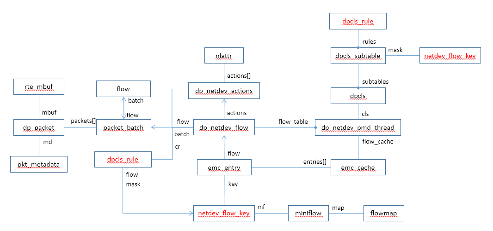
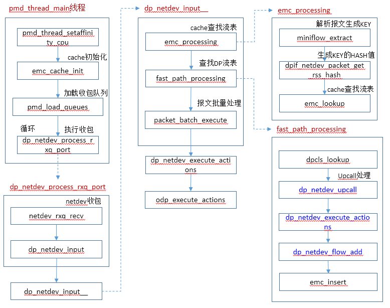

# DPDK Datapath

本文介绍DPDK OVS的数据面处理流程， 当向DPDK DP添加端口时，会创建转发线程，线程的主函数为pmd_thread_main。

数据结构：



调用流程：




# 转发线程

```
static void * pmd_thread_main(void *f_)
{
    struct dp_netdev_pmd_thread *pmd = f_;     //线程参数
    unsigned int lc = 0;
    struct rxq_poll *poll_list;
    unsigned int port_seq = PMD_INITIAL_SEQ;
    int poll_cnt;
    int i;

    poll_cnt = 0;
    poll_list = NULL;

    /* Stores the pmd thread's 'pmd' to 'per_pmd_key'. */
    ovsthread_setspecific(pmd->dp->per_pmd_key, pmd);
    pmd_thread_setaffinity_cpu(pmd->core_id);       //当前线程绑定到指定core
reload:
    emc_cache_init(&pmd->flow_cache);     //初始化flow cache

    ovs_mutex_lock(&pmd->poll_mutex);
    poll_cnt = pmd_load_queues(pmd, &poll_list, poll_cnt);   //加载收包队列， 拷贝pmd的收包队列
    ovs_mutex_unlock(&pmd->poll_mutex);

    /* List port/core affinity */
    for (i = 0; i < poll_cnt; i++) {
       VLOG_INFO("Core %d processing port \'%s\'\n", pmd->core_id,
                 netdev_get_name(poll_list[i].port->netdev));
    }

    /* Signal here to make sure the pmd finishes
     * reloading the updated configuration. */
    dp_netdev_pmd_reload_done(pmd);

    for (;;) {
        for (i = 0; i < poll_cnt; i++) {
            dp_netdev_process_rxq_port(pmd, poll_list[i].port, poll_list[i].rx);   //端口的收包队列收包
        }

        if (lc++ > 1024) {         //lc表示所有端口完成一次收包处理次数
            unsigned int seq;

            lc = 0;

            emc_cache_slow_sweep(&pmd->flow_cache);        
            coverage_try_clear();
            ovsrcu_quiesce();

            atomic_read_relaxed(&pmd->change_seq, &seq);
            if (seq != port_seq) {
                port_seq = seq;
                break;
            }
        }
    }

    emc_cache_uninit(&pmd->flow_cache);

    if (!latch_is_set(&pmd->exit_latch)){    //只有当执行udpif_stop_threads时，exit_latch会被set
        goto reload;
    }

    for (i = 0; i < poll_cnt; i++) {
        port_unref(poll_list[i].port);
    }

    dp_netdev_pmd_reload_done(pmd);

    free(poll_list);
    return NULL;
}
```


## pmd_thread_setaffinity_cpu

```c
int pmd_thread_setaffinity_cpu(unsigned cpu)
{
    cpu_set_t cpuset;
    int err;

    CPU_ZERO(&cpuset);
    CPU_SET(cpu, &cpuset);
    err = pthread_setaffinity_np(pthread_self(), sizeof(cpu_set_t), &cpuset);
    if (err) {
        VLOG_ERR("Thread affinity error %d",err);
        return err;
    }
    /* NON_PMD_CORE_ID is reserved for use by non pmd threads. */
    ovs_assert(cpu != NON_PMD_CORE_ID);
    RTE_PER_LCORE(_lcore_id) = cpu;

    return 0;
}
```


## pmd_load_queues

```c
static int pmd_load_queues(struct dp_netdev_pmd_thread *pmd,
                struct rxq_poll **ppoll_list, int poll_cnt)
    OVS_REQUIRES(pmd->poll_mutex)
{
    struct rxq_poll *poll_list = *ppoll_list;
    struct rxq_poll *poll;
    int i;

    for (i = 0; i < poll_cnt; i++) {           //poll_cnt为0，不进循环
        port_unref(poll_list[i].port);
    }

    poll_list = xrealloc(poll_list, pmd->poll_cnt * sizeof *poll_list);

    i = 0;
    LIST_FOR_EACH (poll, node, &pmd->poll_list) {    //拷贝接收队列
        port_ref(poll->port);
        poll_list[i++] = *poll;
    }

    *ppoll_list = poll_list;
    return pmd->poll_cnt;
}
```


## dp_netdev_process_rxq_port

```c
static void dp_netdev_process_rxq_port(struct dp_netdev_pmd_thread *pmd,
                           struct dp_netdev_port *port,
                           struct netdev_rxq *rxq)
{
    struct dp_packet *packets[NETDEV_MAX_BURST];
    int error, cnt;

    cycles_count_start(pmd);
    error = netdev_rxq_recv(rxq, packets, &cnt);   //从收包队列接收报文
    cycles_count_end(pmd, PMD_CYCLES_POLLING);
    if (!error) {
        *recirc_depth_get() = 0;

        cycles_count_start(pmd);
        dp_netdev_input(pmd, packets, cnt, port->port_no);   //处理接收到的报文
        cycles_count_end(pmd, PMD_CYCLES_PROCESSING);
    } else if (error != EAGAIN && error != EOPNOTSUPP) {
        static struct vlog_rate_limit rl = VLOG_RATE_LIMIT_INIT(1, 5);

        VLOG_ERR_RL(&rl, "error receiving data from %s: %s",
                    netdev_get_name(port->netdev), ovs_strerror(error));
    }
}

int netdev_rxq_recv(struct netdev_rxq *rx, struct dp_packet **buffers, int *cnt)
{
    int retval;

    retval = rx->netdev->netdev_class->rxq_recv(rx, buffers, cnt);
    if (!retval) {
        COVERAGE_INC(netdev_received);
    }
    return retval;
}
```


## emc_cache_slow_sweep

```c
static void emc_cache_slow_sweep(struct emc_cache *flow_cache)
{
	//从0开始往后组个清理，当前线程完成1024次收包（所有端口），做一次entry清理
    struct emc_entry *entry = &flow_cache->entries[flow_cache->sweep_idx];   

    if (!emc_entry_alive(entry)) {   //如果该entry不再被使用，则清空该entry
        emc_clear_entry(entry);
    }
    flow_cache->sweep_idx = (flow_cache->sweep_idx + 1) & EM_FLOW_HASH_MASK;
}

static inline bool emc_entry_alive(struct emc_entry *ce)
{
    return ce->flow && !ce->flow->dead;
}

static void emc_clear_entry(struct emc_entry *ce)
{
    if (ce->flow) {
        dp_netdev_flow_unref(ce->flow);
        ce->flow = NULL;
    }
}
```


# dp_netdev_input

DPDK OVS从接收队列收到批量报文后，做批量报文处理

```c
static void dp_netdev_input(struct dp_netdev_pmd_thread *pmd,
                struct dp_packet **packets, int cnt,
                odp_port_t port_no)
{
     dp_netdev_input__(pmd, packets, cnt, false, port_no);
}

static void dp_netdev_input__(struct dp_netdev_pmd_thread *pmd,
                  struct dp_packet **packets, int cnt,
                  bool md_is_valid, odp_port_t port_no)
{
#if !defined(__CHECKER__) && !defined(_WIN32)
    const size_t PKT_ARRAY_SIZE = cnt;
#else
    /* Sparse or MSVC doesn't like variable length array. */
    enum { PKT_ARRAY_SIZE = NETDEV_MAX_BURST };
#endif
    struct netdev_flow_key keys[PKT_ARRAY_SIZE];
    struct packet_batch batches[PKT_ARRAY_SIZE];
    long long now = time_msec();
    size_t newcnt, n_batches, i;

    n_batches = 0;
    newcnt = emc_processing(pmd, packets, cnt, keys, batches, &n_batches,
                            md_is_valid, port_no);
    if (OVS_UNLIKELY(newcnt)) {
	    //cache中未命中，走fast path路径匹配流表处理
        fast_path_processing(pmd, packets, newcnt, keys, batches, &n_batches);  
    }

    for (i = 0; i < n_batches; i++) {
        batches[i].flow->batch = NULL;     //设置所有的flow->batch为null
    }

    for (i = 0; i < n_batches; i++) {
        packet_batch_execute(&batches[i], pmd, now);
    }
}
```


## emc_processing

```c
static inline size_t emc_processing(struct dp_netdev_pmd_thread *pmd, struct dp_packet **packets,
               size_t cnt, struct netdev_flow_key *keys,
               struct packet_batch batches[], size_t *n_batches,
               bool md_is_valid, odp_port_t port_no)
{
    struct emc_cache *flow_cache = &pmd->flow_cache;
    struct netdev_flow_key key;
    size_t i, notfound_cnt = 0;

    for (i = 0; i < cnt; i++) {         //遍历packet
        struct dp_netdev_flow *flow;

        if (OVS_UNLIKELY(dp_packet_size(packets[i]) < ETH_HEADER_LEN)) {    //报文大小检测
            dp_packet_delete(packets[i]);
            continue;
        }

        if (i != cnt - 1) {
            /* Prefetch next packet data and metadata. */
            OVS_PREFETCH(dp_packet_data(packets[i+1]));       //预取下一个报文，提升性能
            pkt_metadata_prefetch_init(&packets[i+1]->md);    //预取下一个报文的metadata，提升性能
        }

        if (!md_is_valid) {
            pkt_metadata_init(&packets[i]->md, port_no);      //该条件成立，初始化每个报文的metadata
        }
        miniflow_extract(packets[i], &key.mf);                //解析报文，生成miniflow对象
        key.len = 0; /* Not computed yet. */
        key.hash = dpif_netdev_packet_get_rss_hash(packets[i], &key.mf);   //计算hash值，根据该值查询流表

        flow = emc_lookup(flow_cache, &key);
        if (OVS_LIKELY(flow)) {
            dp_netdev_queue_batches(packets[i], flow, &key.mf, batches,
                                    n_batches);
        } else {
            if (i != notfound_cnt) {
			    //交换packet在数组中位置，其结果就是最前端的都是没有匹配到流表的
                dp_packet_swap(&packets[i], &packets[notfound_cnt]);   
            }

            keys[notfound_cnt++] = key;           //设置未匹配到流表的报文的key值
        }
    }

    dp_netdev_count_packet(pmd, DP_STAT_EXACT_HIT, cnt - notfound_cnt);   //刷新统计信息，增加命中数量

    return notfound_cnt;      //返回未匹配到流表的报文数量
}

static inline void pkt_metadata_init(struct pkt_metadata *md, odp_port_t port)
{
    /* It can be expensive to zero out all of the tunnel metadata. However,
     * we can just zero out ip_dst and the rest of the data will never be
     * looked at. */
    memset(md, 0, offsetof(struct pkt_metadata, in_port));
    md->tunnel.ip_dst = 0;
    md->tunnel.ipv6_dst = in6addr_any;

    md->in_port.odp_port = port;
}
```


### miniflow_extract

```c
void miniflow_extract(struct dp_packet *packet, struct miniflow *dst)
{
    const struct pkt_metadata *md = &packet->md;
    const void *data = dp_packet_data(packet);
    size_t size = dp_packet_size(packet);
    uint64_t *values = miniflow_values(dst);
    struct mf_ctx mf = { FLOWMAP_EMPTY_INITIALIZER, values,
                         values + FLOW_U64S };
    const char *l2;
    ovs_be16 dl_type;
    uint8_t nw_frag, nw_tos, nw_ttl, nw_proto;

    /* Metadata. */
    if (flow_tnl_dst_is_set(&md->tunnel)) {
        miniflow_push_words(mf, tunnel, &md->tunnel,
                            offsetof(struct flow_tnl, metadata) /
                            sizeof(uint64_t));

        if (!(md->tunnel.flags & FLOW_TNL_F_UDPIF)) {
            if (md->tunnel.metadata.present.map) {
                miniflow_push_words(mf, tunnel.metadata, &md->tunnel.metadata,
                                    sizeof md->tunnel.metadata /
                                    sizeof(uint64_t));
            }
        } else {
            if (md->tunnel.metadata.present.len) {
                miniflow_push_words(mf, tunnel.metadata.present,
                                    &md->tunnel.metadata.present, 1);
                miniflow_push_words(mf, tunnel.metadata.opts.gnv,
                                    md->tunnel.metadata.opts.gnv,
                                    DIV_ROUND_UP(md->tunnel.metadata.present.len,
                                                 sizeof(uint64_t)));
            }
        }
    }
    if (md->skb_priority || md->pkt_mark) {
        miniflow_push_uint32(mf, skb_priority, md->skb_priority);
        miniflow_push_uint32(mf, pkt_mark, md->pkt_mark);
    }
    miniflow_push_uint32(mf, dp_hash, md->dp_hash);
    miniflow_push_uint32(mf, in_port, odp_to_u32(md->in_port.odp_port));
    if (md->recirc_id || md->ct_state) {
        miniflow_push_uint32(mf, recirc_id, md->recirc_id);
        miniflow_push_uint16(mf, ct_state, md->ct_state);
        miniflow_push_uint16(mf, ct_zone, md->ct_zone);
    }

    if (md->ct_state) {
        miniflow_push_uint32(mf, ct_mark, md->ct_mark);
        miniflow_pad_to_64(mf, pad1);

        if (!ovs_u128_is_zero(&md->ct_label)) {
            miniflow_push_words(mf, ct_label, &md->ct_label,
                                sizeof md->ct_label / sizeof(uint64_t));
        }
    }

    /* Initialize packet's layer pointer and offsets. */
    l2 = data;
    dp_packet_reset_offsets(packet);

    /* Must have full Ethernet header to proceed. */
    if (OVS_UNLIKELY(size < sizeof(struct eth_header))) {
        goto out;
    } else {
        ovs_be16 vlan_tci;

        /* Link layer. */
        ASSERT_SEQUENTIAL(dl_dst, dl_src);
        miniflow_push_macs(mf, dl_dst, data);       //解析mac头，data当前指向mac头
        /* dl_type, vlan_tci. */
        vlan_tci = parse_vlan(&data, &size);        //解析vlan头
        dl_type = parse_ethertype(&data, &size);    //解析dl_type头
        miniflow_push_be16(mf, dl_type, dl_type);
        miniflow_push_be16(mf, vlan_tci, vlan_tci);
    }

    /* Parse mpls. */
    if (OVS_UNLIKELY(eth_type_mpls(dl_type))) {
        int count;
        const void *mpls = data;

        packet->l2_5_ofs = (char *)data - l2;
        count = parse_mpls(&data, &size);
        miniflow_push_words_32(mf, mpls_lse, mpls, count);
    }

    /* Network layer. */
    packet->l3_ofs = (char *)data - l2;

    nw_frag = 0;
    if (OVS_LIKELY(dl_type == htons(ETH_TYPE_IP))) {
        const struct ip_header *nh = data;
        int ip_len;
        uint16_t tot_len;

        if (OVS_UNLIKELY(size < IP_HEADER_LEN)) {
            goto out;
        }
        ip_len = IP_IHL(nh->ip_ihl_ver) * 4;

        if (OVS_UNLIKELY(ip_len < IP_HEADER_LEN)) {
            goto out;
        }
        if (OVS_UNLIKELY(size < ip_len)) {
            goto out;
        }
        tot_len = ntohs(nh->ip_tot_len);
        if (OVS_UNLIKELY(tot_len > size)) {
            goto out;
        }
        if (OVS_UNLIKELY(size - tot_len > UINT8_MAX)) {
            goto out;
        }
        dp_packet_set_l2_pad_size(packet, size - tot_len);
        size = tot_len;   /* Never pull padding. */

        /* Push both source and destination address at once. */
        miniflow_push_words(mf, nw_src, &nh->ip_src, 1);

        miniflow_push_be32(mf, ipv6_label, 0); /* Padding for IPv4. */

        nw_tos = nh->ip_tos;
        nw_ttl = nh->ip_ttl;
        nw_proto = nh->ip_proto;
        if (OVS_UNLIKELY(IP_IS_FRAGMENT(nh->ip_frag_off))) {
            nw_frag = FLOW_NW_FRAG_ANY;
            if (nh->ip_frag_off & htons(IP_FRAG_OFF_MASK)) {
                nw_frag |= FLOW_NW_FRAG_LATER;
            }
        }
        data_pull(&data, &size, ip_len);
    } else if (dl_type == htons(ETH_TYPE_IPV6)) {
        const struct ovs_16aligned_ip6_hdr *nh;
        ovs_be32 tc_flow;
        uint16_t plen;

        if (OVS_UNLIKELY(size < sizeof *nh)) {
            goto out;
        }
        nh = data_pull(&data, &size, sizeof *nh);

        plen = ntohs(nh->ip6_plen);
        if (OVS_UNLIKELY(plen > size)) {
            goto out;
        }
        /* Jumbo Payload option not supported yet. */
        if (OVS_UNLIKELY(size - plen > UINT8_MAX)) {
            goto out;
        }
        dp_packet_set_l2_pad_size(packet, size - plen);
        size = plen;   /* Never pull padding. */

        miniflow_push_words(mf, ipv6_src, &nh->ip6_src,
                            sizeof nh->ip6_src / 8);
        miniflow_push_words(mf, ipv6_dst, &nh->ip6_dst,
                            sizeof nh->ip6_dst / 8);

        tc_flow = get_16aligned_be32(&nh->ip6_flow);
        {
            ovs_be32 label = tc_flow & htonl(IPV6_LABEL_MASK);
            miniflow_push_be32(mf, ipv6_label, label);
        }

        nw_tos = ntohl(tc_flow) >> 20;
        nw_ttl = nh->ip6_hlim;
        nw_proto = nh->ip6_nxt;

        while (1) {
            if (OVS_LIKELY((nw_proto != IPPROTO_HOPOPTS)
                           && (nw_proto != IPPROTO_ROUTING)
                           && (nw_proto != IPPROTO_DSTOPTS)
                           && (nw_proto != IPPROTO_AH)
                           && (nw_proto != IPPROTO_FRAGMENT))) {
                /* It's either a terminal header (e.g., TCP, UDP) or one we
                 * don't understand.  In either case, we're done with the
                 * packet, so use it to fill in 'nw_proto'. */
                break;
            }

            /* We only verify that at least 8 bytes of the next header are
             * available, but many of these headers are longer.  Ensure that
             * accesses within the extension header are within those first 8
             * bytes. All extension headers are required to be at least 8
             * bytes. */
            if (OVS_UNLIKELY(size < 8)) {
                goto out;
            }

            if ((nw_proto == IPPROTO_HOPOPTS)
                || (nw_proto == IPPROTO_ROUTING)
                || (nw_proto == IPPROTO_DSTOPTS)) {
                /* These headers, while different, have the fields we care
                 * about in the same location and with the same
                 * interpretation. */
                const struct ip6_ext *ext_hdr = data;
                nw_proto = ext_hdr->ip6e_nxt;
                if (OVS_UNLIKELY(!data_try_pull(&data, &size,
                                                (ext_hdr->ip6e_len + 1) * 8))) {
                    goto out;
                }
            } else if (nw_proto == IPPROTO_AH) {
                /* A standard AH definition isn't available, but the fields
                 * we care about are in the same location as the generic
                 * option header--only the header length is calculated
                 * differently. */
                const struct ip6_ext *ext_hdr = data;
                nw_proto = ext_hdr->ip6e_nxt;
                if (OVS_UNLIKELY(!data_try_pull(&data, &size,
                                                (ext_hdr->ip6e_len + 2) * 4))) {
                    goto out;
                }
            } else if (nw_proto == IPPROTO_FRAGMENT) {
                const struct ovs_16aligned_ip6_frag *frag_hdr = data;

                nw_proto = frag_hdr->ip6f_nxt;
                if (!data_try_pull(&data, &size, sizeof *frag_hdr)) {
                    goto out;
                }

                /* We only process the first fragment. */
                if (frag_hdr->ip6f_offlg != htons(0)) {
                    nw_frag = FLOW_NW_FRAG_ANY;
                    if ((frag_hdr->ip6f_offlg & IP6F_OFF_MASK) != htons(0)) {
                        nw_frag |= FLOW_NW_FRAG_LATER;
                        nw_proto = IPPROTO_FRAGMENT;
                        break;
                    }
                }
            }
        }
    } else {
        if (dl_type == htons(ETH_TYPE_ARP) ||
            dl_type == htons(ETH_TYPE_RARP)) {
            struct eth_addr arp_buf[2];
            const struct arp_eth_header *arp = (const struct arp_eth_header *)
                data_try_pull(&data, &size, ARP_ETH_HEADER_LEN);

            if (OVS_LIKELY(arp) && OVS_LIKELY(arp->ar_hrd == htons(1))
                && OVS_LIKELY(arp->ar_pro == htons(ETH_TYPE_IP))
                && OVS_LIKELY(arp->ar_hln == ETH_ADDR_LEN)
                && OVS_LIKELY(arp->ar_pln == 4)) {
                miniflow_push_be32(mf, nw_src,
                                   get_16aligned_be32(&arp->ar_spa));
                miniflow_push_be32(mf, nw_dst,
                                   get_16aligned_be32(&arp->ar_tpa));

                /* We only match on the lower 8 bits of the opcode. */
                if (OVS_LIKELY(ntohs(arp->ar_op) <= 0xff)) {
                    miniflow_push_be32(mf, ipv6_label, 0); /* Pad with ARP. */
                    miniflow_push_be32(mf, nw_frag, htonl(ntohs(arp->ar_op)));
                }

                /* Must be adjacent. */
                ASSERT_SEQUENTIAL(arp_sha, arp_tha);

                arp_buf[0] = arp->ar_sha;
                arp_buf[1] = arp->ar_tha;
                miniflow_push_macs(mf, arp_sha, arp_buf);
                miniflow_pad_to_64(mf, tcp_flags);
            }
        }
        goto out;
    }

    packet->l4_ofs = (char *)data - l2;
    miniflow_push_be32(mf, nw_frag,
                       BYTES_TO_BE32(nw_frag, nw_tos, nw_ttl, nw_proto));

    if (OVS_LIKELY(!(nw_frag & FLOW_NW_FRAG_LATER))) {
        if (OVS_LIKELY(nw_proto == IPPROTO_TCP)) {
            if (OVS_LIKELY(size >= TCP_HEADER_LEN)) {
                const struct tcp_header *tcp = data;

                miniflow_push_be32(mf, arp_tha.ea[2], 0);
                miniflow_push_be32(mf, tcp_flags,
                                   TCP_FLAGS_BE32(tcp->tcp_ctl));
                miniflow_push_be16(mf, tp_src, tcp->tcp_src);
                miniflow_push_be16(mf, tp_dst, tcp->tcp_dst);
                miniflow_pad_to_64(mf, igmp_group_ip4);
            }
        } else if (OVS_LIKELY(nw_proto == IPPROTO_UDP)) {
            if (OVS_LIKELY(size >= UDP_HEADER_LEN)) {
                const struct udp_header *udp = data;

                miniflow_push_be16(mf, tp_src, udp->udp_src);
                miniflow_push_be16(mf, tp_dst, udp->udp_dst);
                miniflow_pad_to_64(mf, igmp_group_ip4);
            }
        } else if (OVS_LIKELY(nw_proto == IPPROTO_SCTP)) {
            if (OVS_LIKELY(size >= SCTP_HEADER_LEN)) {
                const struct sctp_header *sctp = data;

                miniflow_push_be16(mf, tp_src, sctp->sctp_src);
                miniflow_push_be16(mf, tp_dst, sctp->sctp_dst);
                miniflow_pad_to_64(mf, igmp_group_ip4);
            }
        } else if (OVS_LIKELY(nw_proto == IPPROTO_ICMP)) {
            if (OVS_LIKELY(size >= ICMP_HEADER_LEN)) {
                const struct icmp_header *icmp = data;

                miniflow_push_be16(mf, tp_src, htons(icmp->icmp_type));
                miniflow_push_be16(mf, tp_dst, htons(icmp->icmp_code));
                miniflow_pad_to_64(mf, igmp_group_ip4);
            }
        } else if (OVS_LIKELY(nw_proto == IPPROTO_IGMP)) {
            if (OVS_LIKELY(size >= IGMP_HEADER_LEN)) {
                const struct igmp_header *igmp = data;

                miniflow_push_be16(mf, tp_src, htons(igmp->igmp_type));
                miniflow_push_be16(mf, tp_dst, htons(igmp->igmp_code));
                miniflow_push_be32(mf, igmp_group_ip4,
                                   get_16aligned_be32(&igmp->group));
            }
        } else if (OVS_LIKELY(nw_proto == IPPROTO_ICMPV6)) {
            if (OVS_LIKELY(size >= sizeof(struct icmp6_hdr))) {
                const struct in6_addr *nd_target = NULL;
                struct eth_addr arp_buf[2] = { { { { 0 } } } };
                const struct icmp6_hdr *icmp = data_pull(&data, &size,
                                                         sizeof *icmp);
                parse_icmpv6(&data, &size, icmp, &nd_target, arp_buf);
                if (nd_target) {
                    miniflow_push_words(mf, nd_target, nd_target,
                                        sizeof *nd_target / sizeof(uint64_t));
                }
                miniflow_push_macs(mf, arp_sha, arp_buf);
                miniflow_pad_to_64(mf, tcp_flags);
                miniflow_push_be16(mf, tp_src, htons(icmp->icmp6_type));
                miniflow_push_be16(mf, tp_dst, htons(icmp->icmp6_code));
                miniflow_pad_to_64(mf, igmp_group_ip4);
            }
        }
    }
 out:
    dst->map = mf.map;
}

static inline uint64_t *miniflow_values(struct miniflow *mf)
{
    return (uint64_t *)(mf + 1);
}

#define miniflow_push_macs(MF, FIELD, VALUEP)                       \
    miniflow_push_macs_(MF, offsetof(struct flow, FIELD), VALUEP)
	
#define miniflow_push_macs_(MF, OFS, VALUEP)                    \
{                                                               \
    miniflow_set_maps(MF, (OFS) / 8, 2);                        \
    memcpy(MF.data, (VALUEP), 2 * ETH_ADDR_LEN);                \
    MF.data += 1;                   /* First word only. */      \
}

#define miniflow_set_maps(MF, OFS, N_WORDS)                     \
{                                                               \
    size_t ofs = (OFS);                                         \
    size_t n_words = (N_WORDS);                                 \
                                                                \
    MINIFLOW_ASSERT(n_words && MF.data + n_words <= MF.end);    \
    ASSERT_FLOWMAP_NOT_SET(&MF.map, ofs);                       \
    flowmap_set(&MF.map, ofs, n_words);                         \
}

static inline void
flowmap_set(struct flowmap *fm, size_t idx, unsigned int n_bits)
{
    map_t n_bits_mask = (MAP_1 << n_bits) - 1;    //
    size_t unit = idx / MAP_T_BITS;       //需要多少个map_t，对于flow对象，一个map_t足够，所以该值为0

    idx %= MAP_T_BITS;

    fm->bits[unit] |= n_bits_mask << idx;    //
    /* The seemingly unnecessary bounds check on 'unit' is a workaround for a
     * false-positive array out of bounds error by GCC 4.9. */
    if (unit + 1 < FLOWMAP_UNITS && idx + n_bits > MAP_T_BITS) {
        /* 'MAP_T_BITS - idx' bits were set on 'unit', set the remaining
         * bits from the next unit. */
        fm->bits[unit + 1] |= n_bits_mask >> (MAP_T_BITS - idx);
    }
}
```


### dpif_netdev_packet_get_rss_hash

```c
static inline uint32_t dpif_netdev_packet_get_rss_hash(struct dp_packet *packet,
                                const struct miniflow *mf)
{
    uint32_t hash, recirc_depth;

    if (OVS_LIKELY(dp_packet_rss_valid(packet))) {
        hash = dp_packet_get_rss_hash(packet);       //根据报文的rss值计算hash值，优化
    } else {
        hash = miniflow_hash_5tuple(mf, 0);          //根据报文的五元组计算hash值
        dp_packet_set_rss_hash(packet, hash);
    }

    /* The RSS hash must account for the recirculation depth to avoid
     * collisions in the exact match cache */
    recirc_depth = *recirc_depth_get_unsafe();
    if (OVS_UNLIKELY(recirc_depth)) {
        hash = hash_finish(hash, recirc_depth);
        dp_packet_set_rss_hash(packet, hash);
    }
    return hash;
}

//五元组为源IP+目的IP+网络层协议+源端口+目的端口
uint32_t miniflow_hash_5tuple(const struct miniflow *flow, uint32_t basis)
{
    uint32_t hash = basis;

    if (flow) {
        ovs_be16 dl_type = MINIFLOW_GET_BE16(flow, dl_type);    //获取协议类型

        hash = hash_add(hash, MINIFLOW_GET_U8(flow, nw_proto));  //网络层协议，例如UDP、TCP等

        /* Separate loops for better optimization. */
        if (dl_type == htons(ETH_TYPE_IPV6)) {
            struct flowmap map = FLOWMAP_EMPTY_INITIALIZER;
            uint64_t value;

            FLOWMAP_SET(&map, ipv6_src);
            FLOWMAP_SET(&map, ipv6_dst);

            MINIFLOW_FOR_EACH_IN_FLOWMAP(value, flow, map) {
                hash = hash_add64(hash, value);
            }
        } else {
            hash = hash_add(hash, MINIFLOW_GET_U32(flow, nw_src));   //IPV4场景， 源IP+目的IP
            hash = hash_add(hash, MINIFLOW_GET_U32(flow, nw_dst));
        }
        /* Add both ports at once. */
        hash = hash_add(hash, MINIFLOW_GET_U32(flow, tp_src));       //源端口+目的端口
        hash = hash_finish(hash, 42); /* Arbitrary number. */
    }
    return hash;
}
```


### emc_lookup

cache检索步骤如下：

1. 根据packet生成netdev_flow_key对象；
2. 使用netdev_flow_key对象的hash值检索emc_cache；
3. 每个netdev_flow_key对象的hash对应两个位置；
   3.1 比较emc_entry的key和packet生成的netdev_flow_key是否一致；
4. cache流表总大小为8K；

```c
static inline struct dp_netdev_flow *
emc_lookup(struct emc_cache *cache, const struct netdev_flow_key *key)
{
    struct emc_entry *current_entry;

    EMC_FOR_EACH_POS_WITH_HASH(cache, current_entry, key->hash) {    //遍历所有的emc_entry
        if (current_entry->key.hash == key->hash         //hash值匹配
            && emc_entry_alive(current_entry)            //entry当前处于活动状态
            && netdev_flow_key_equal_mf(&current_entry->key, &key->mf)) {    //使用报文的key来匹配

            /* We found the entry with the 'key->mf' miniflow */
            return current_entry->flow;
        }
    }

    return NULL;
}

static inline bool
netdev_flow_key_equal_mf(const struct netdev_flow_key *key,
                         const struct miniflow *mf)
{
    return !memcmp(&key->mf, mf, key->len);
}
```


### dp_netdev_queue_batches

```c
static inline void dp_netdev_queue_batches(struct dp_packet *pkt,
                        struct dp_netdev_flow *flow, const struct miniflow *mf,
                        struct packet_batch *batches, size_t *n_batches)
{
    struct packet_batch *batch = flow->batch;   

    if (OVS_LIKELY(batch)) {
        packet_batch_update(batch, pkt, mf);
        return;
    }

    batch = &batches[(*n_batches)++];
    packet_batch_init(batch, flow);
    packet_batch_update(batch, pkt, mf);
}

static inline void packet_batch_init(struct packet_batch *batch, struct dp_netdev_flow *flow)
{
    flow->batch = batch;

    batch->flow = flow;
    batch->packet_count = 0;
    batch->byte_count = 0;
    batch->tcp_flags = 0;
}

static inline void packet_batch_update(struct packet_batch *batch, struct dp_packet *packet,
                    const struct miniflow *mf)
{
    batch->tcp_flags |= miniflow_get_tcp_flags(mf);
    batch->packets[batch->packet_count++] = packet;   //报文添加到flow的batch中
    batch->byte_count += dp_packet_size(packet);
}
```


## packet_batch_execute

```c
static inline void packet_batch_execute(struct packet_batch *batch,
                     struct dp_netdev_pmd_thread *pmd,
                     long long now)
{
    struct dp_netdev_actions *actions;
    struct dp_netdev_flow *flow = batch->flow;

    dp_netdev_flow_used(flow, batch->packet_count, batch->byte_count,   //更新流表统计信息
                        batch->tcp_flags, now);

    actions = dp_netdev_flow_get_actions(flow);   //得到流表的actions

    dp_netdev_execute_actions(pmd, batch->packets, batch->packet_count, true,
                              actions->actions, actions->size);    //执行actions
}

static void dp_netdev_execute_actions(struct dp_netdev_pmd_thread *pmd,
                          struct dp_packet **packets, int cnt,
                          bool may_steal,
                          const struct nlattr *actions, size_t actions_len)
{
    struct dp_netdev_execute_aux aux = { pmd };

    odp_execute_actions(&aux, packets, cnt, may_steal, actions,  //执行actions
                        actions_len, dp_execute_cb);
}
```
