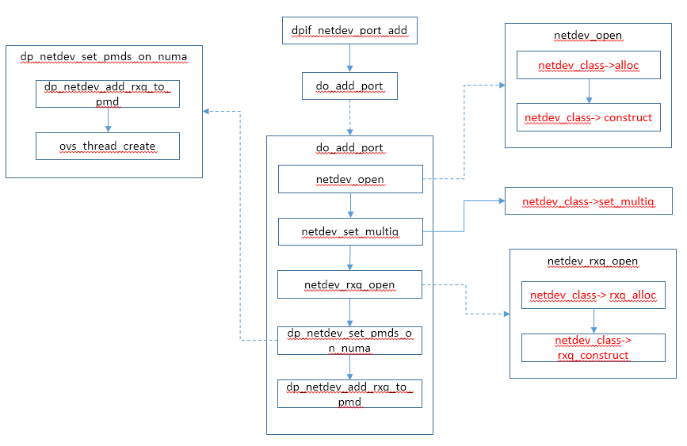

# Vhost User 端口

本文介绍DPDK OVS添加Vhost User端口的流程，以及Vhost User端口的收发包流程。

Port操作流程：




# 添加Vhost User端口

在DPDK OVS添加Vhost User端口时，最终会调用dpdk_vhost_user_class定义的方法。

```c
static const struct netdev_class OVS_UNUSED dpdk_vhost_user_class =
    NETDEV_DPDK_CLASS(
        "dpdkvhostuser",
        dpdk_vhost_user_class_init,
        netdev_dpdk_vhost_user_construct,
        netdev_dpdk_vhost_destruct,
        netdev_dpdk_vhost_set_multiq,
        netdev_dpdk_vhost_send,
        netdev_dpdk_vhost_get_carrier,
        netdev_dpdk_vhost_get_stats,
        NULL,
        NULL,
        netdev_dpdk_vhost_rxq_recv);
```


## netdev_dpdk_alloc

```c
static struct netdev * netdev_dpdk_alloc(void)
{
    struct netdev_dpdk *netdev = dpdk_rte_mzalloc(sizeof *netdev);
    return &netdev->up;
}
```


## netdev_dpdk_vhost_user_construct

```c
static int
netdev_dpdk_vhost_user_construct(struct netdev *netdev_)
{
    struct netdev_dpdk *netdev = netdev_dpdk_cast(netdev_);
    const char *name = netdev_->name;
    int err;

    /* 'name' is appended to 'vhost_sock_dir' and used to create a socket in
     * the file system. '/' or '\' would traverse directories, so they're not
     * acceptable in 'name'. */
    if (strchr(name, '/') || strchr(name, '\\')) {
        VLOG_ERR("\"%s\" is not a valid name for a vhost-user port. "
                 "A valid name must not include '/' or '\\'",
                 name);
        return EINVAL;
    }

    ovs_mutex_lock(&dpdk_mutex);
    /* Take the name of the vhost-user port and append it to the location where
     * the socket is to be created, then register the socket.
     */
    snprintf(netdev->vhost_id, sizeof(netdev->vhost_id), "%s/%s",
             vhost_sock_dir, name);

    err = rte_vhost_driver_register(netdev->vhost_id);
    if (err) {
        VLOG_ERR("vhost-user socket device setup failure for socket %s\n",
                 netdev->vhost_id);
    } else {
        fatal_signal_add_file_to_unlink(netdev->vhost_id);
        VLOG_INFO("Socket %s created for vhost-user port %s\n",
                  netdev->vhost_id, name);
        err = vhost_construct_helper(netdev_);
    }

    ovs_mutex_unlock(&dpdk_mutex);
    return err;
}
```


## netdev_dpdk_get_numa_id

```c
static int
netdev_dpdk_get_numa_id(const struct netdev *netdev_)
{
    struct netdev_dpdk *netdev = netdev_dpdk_cast(netdev_);

    return netdev->socket_id;
}
```


## netdev_dpdk_vhost_set_multiq

```c
static int
netdev_dpdk_vhost_set_multiq(struct netdev *netdev_, unsigned int n_txq,
                             unsigned int n_rxq)
{
    struct netdev_dpdk *netdev = netdev_dpdk_cast(netdev_);
    int err = 0;

    if (netdev->up.n_txq == n_txq && netdev->up.n_rxq == n_rxq) {
        return err;
    }

    ovs_mutex_lock(&dpdk_mutex);
    ovs_mutex_lock(&netdev->mutex);

    netdev->up.n_txq = n_txq;
    netdev->up.n_rxq = n_rxq;

    ovs_mutex_unlock(&netdev->mutex);
    ovs_mutex_unlock(&dpdk_mutex);

    return err;
}
```


## netdev_dpdk_rxq_alloc

```c
static struct netdev_rxq *
netdev_dpdk_rxq_alloc(void)
{
    struct netdev_rxq_dpdk *rx = dpdk_rte_mzalloc(sizeof *rx);

    return &rx->up;
}
```


## netdev_dpdk_rxq_construct

```c
static int
netdev_dpdk_rxq_construct(struct netdev_rxq *rxq_)
{
    struct netdev_rxq_dpdk *rx = netdev_rxq_dpdk_cast(rxq_);
    struct netdev_dpdk *netdev = netdev_dpdk_cast(rx->up.netdev);

    ovs_mutex_lock(&netdev->mutex);
    rx->port_id = netdev->port_id;
    ovs_mutex_unlock(&netdev->mutex);

    return 0;
}
```


# Vhost User端口发包

调用vhost user驱动，向虚拟机发包

```c
static int netdev_dpdk_vhost_send(struct netdev *netdev, int qid, struct dp_packet **pkts,
                 int cnt, bool may_steal)
{
    if (OVS_UNLIKELY(pkts[0]->source != DPBUF_DPDK)) {
        int i;

        dpdk_do_tx_copy(netdev, qid, pkts, cnt);
        if (may_steal) {
            for (i = 0; i < cnt; i++) {
                dp_packet_delete(pkts[i]);
            }
        }
    } else {
        __netdev_dpdk_vhost_send(netdev, qid, pkts, cnt, may_steal);
    }
    return 0;
}

static void __netdev_dpdk_vhost_send(struct netdev *netdev, int qid,
                         struct dp_packet **pkts, int cnt,
                         bool may_steal)
{
    struct netdev_dpdk *vhost_dev = netdev_dpdk_cast(netdev);
    struct virtio_net *virtio_dev = netdev_dpdk_get_virtio(vhost_dev);
    struct rte_mbuf **cur_pkts = (struct rte_mbuf **) pkts;
    unsigned int total_pkts = cnt;
    uint64_t start = 0;

    qid = vhost_dev->tx_q[qid % vhost_dev->real_n_txq].map;

    if (OVS_UNLIKELY(!is_vhost_running(virtio_dev) || qid == -1)) {
        rte_spinlock_lock(&vhost_dev->stats_lock);
        vhost_dev->stats.tx_dropped+= cnt;
        rte_spinlock_unlock(&vhost_dev->stats_lock);
        goto out;
    }

    rte_spinlock_lock(&vhost_dev->tx_q[qid].tx_lock);

    do {
        int vhost_qid = qid * VIRTIO_QNUM + VIRTIO_RXQ;
        unsigned int tx_pkts;

		//调用DPDK方法库向vhost user端口发包
        tx_pkts = rte_vhost_enqueue_burst(virtio_dev, vhost_qid,    
                                          cur_pkts, cnt);
        if (OVS_LIKELY(tx_pkts)) {
            /* Packets have been sent.*/
            cnt -= tx_pkts;
            /* Prepare for possible next iteration.*/
            cur_pkts = &cur_pkts[tx_pkts];
        } else {
            uint64_t timeout = VHOST_ENQ_RETRY_USECS * rte_get_timer_hz() / 1E6;
            unsigned int expired = 0;

            if (!start) {
                start = rte_get_timer_cycles();
            }

            /*
             * Unable to enqueue packets to vhost interface.
             * Check available entries before retrying.
             */
            while (!rte_vring_available_entries(virtio_dev, vhost_qid)) {
                if (OVS_UNLIKELY((rte_get_timer_cycles() - start) > timeout)) {
                    expired = 1;
                    break;
                }
            }
            if (expired) {
                /* break out of main loop. */
                break;
            }
        }
    } while (cnt);

    rte_spinlock_unlock(&vhost_dev->tx_q[qid].tx_lock);

    rte_spinlock_lock(&vhost_dev->stats_lock);
    netdev_dpdk_vhost_update_tx_counters(&vhost_dev->stats, pkts, total_pkts,
                                         cnt);
    rte_spinlock_unlock(&vhost_dev->stats_lock);

out:
    if (may_steal) {
        int i;

        for (i = 0; i < total_pkts; i++) {
            dp_packet_delete(pkts[i]);
        }
    }
}
```


# Vhost User端口收包

```c
static int netdev_dpdk_vhost_rxq_recv(struct netdev_rxq *rxq_,
                           struct dp_packet **packets, int *c)
{
    struct netdev_rxq_dpdk *rx = netdev_rxq_dpdk_cast(rxq_);
    struct netdev *netdev = rx->up.netdev;
    struct netdev_dpdk *vhost_dev = netdev_dpdk_cast(netdev);
    struct virtio_net *virtio_dev = netdev_dpdk_get_virtio(vhost_dev);
    int qid = rxq_->queue_id;
    uint16_t nb_rx = 0;

    if (OVS_UNLIKELY(!is_vhost_running(virtio_dev))) {
        return EAGAIN;
    }

    if (rxq_->queue_id >= vhost_dev->real_n_rxq) {
        return EOPNOTSUPP;
    }

	//调用DPDK方法库从vhost user端口收包
    nb_rx = rte_vhost_dequeue_burst(virtio_dev, qid * VIRTIO_QNUM + VIRTIO_TXQ,  
                                    vhost_dev->dpdk_mp->mp,
                                    (struct rte_mbuf **)packets,
                                    NETDEV_MAX_BURST);
    if (!nb_rx) {
        return EAGAIN;
    }

    rte_spinlock_lock(&vhost_dev->stats_lock);
    netdev_dpdk_vhost_update_rx_counters(&vhost_dev->stats, packets, nb_rx);
    rte_spinlock_unlock(&vhost_dev->stats_lock);

    *c = (int) nb_rx;
    return 0;
}
```

