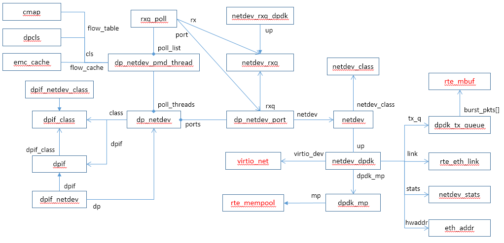
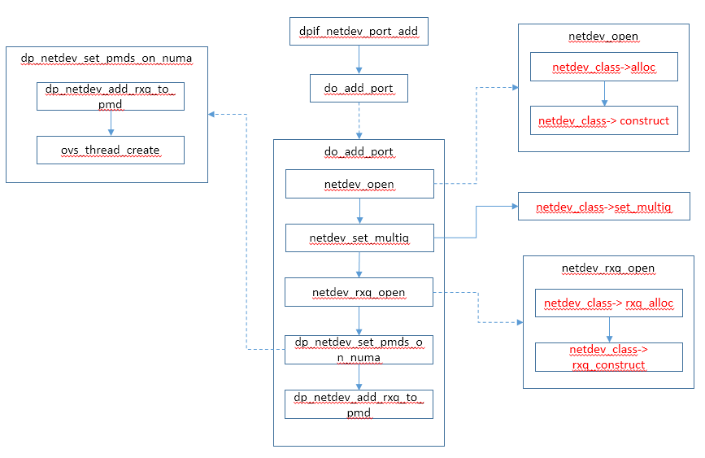

# DPDK 端口操作

内核态OVS中已经介绍了控制面的端口操作流程，本文介绍DPDK数据面的端口操作流程，操作流程的入口为dpif_netdev_class中定义的函数。

主要数据结构：



Port操作流程：




# 端口类型


## netdev类型

```c
static const struct netdev_class dpdk_class =
    NETDEV_DPDK_CLASS(
        "dpdk",
        NULL,
        netdev_dpdk_construct,
        netdev_dpdk_destruct,
        netdev_dpdk_set_multiq,
        netdev_dpdk_eth_send,
        netdev_dpdk_get_carrier,
        netdev_dpdk_get_stats,
        netdev_dpdk_get_features,
        netdev_dpdk_get_status,
        netdev_dpdk_rxq_recv);

static const struct netdev_class dpdk_ring_class =
    NETDEV_DPDK_CLASS(
        "dpdkr",
        NULL,
        netdev_dpdk_ring_construct,
        netdev_dpdk_destruct,
        netdev_dpdk_set_multiq,
        netdev_dpdk_ring_send,
        netdev_dpdk_get_carrier,
        netdev_dpdk_get_stats,
        netdev_dpdk_get_features,
        netdev_dpdk_get_status,
        netdev_dpdk_rxq_recv);

static const struct netdev_class OVS_UNUSED dpdk_vhost_cuse_class =
    NETDEV_DPDK_CLASS(
        "dpdkvhostcuse",
        dpdk_vhost_cuse_class_init,
        netdev_dpdk_vhost_cuse_construct,
        netdev_dpdk_vhost_destruct,
        netdev_dpdk_vhost_cuse_set_multiq,
        netdev_dpdk_vhost_send,
        netdev_dpdk_vhost_get_carrier,
        netdev_dpdk_vhost_get_stats,
        NULL,
        NULL,
        netdev_dpdk_vhost_rxq_recv);

static const struct netdev_class OVS_UNUSED dpdk_vhost_user_class =
    NETDEV_DPDK_CLASS(
        "dpdkvhostuser",
        dpdk_vhost_user_class_init,
        netdev_dpdk_vhost_user_construct,
        netdev_dpdk_vhost_destruct,
        netdev_dpdk_vhost_set_multiq,
        netdev_dpdk_vhost_send,
        netdev_dpdk_vhost_get_carrier,
        netdev_dpdk_vhost_get_stats,
        NULL,
        NULL,
        netdev_dpdk_vhost_rxq_recv);
```


## vport类型

包括tunnel和patch两类端口，vport是一种特殊的netdev类型，这类vport的netdev_class类中构造函数都是netdev_vport_construct

```c
void
netdev_vport_tunnel_register(void)
{
    /* The name of the dpif_port should be short enough to accomodate adding
     * a port number to the end if one is necessary. */
    static const struct vport_class vport_classes[] = {
        TUNNEL_CLASS("geneve", "genev_sys", netdev_geneve_build_header,
                                            push_udp_header,
                                            netdev_geneve_pop_header),
        TUNNEL_CLASS("gre", "gre_sys", netdev_gre_build_header,
                                       netdev_gre_push_header,
                                       netdev_gre_pop_header),
        TUNNEL_CLASS("ipsec_gre", "gre_sys", NULL, NULL, NULL),
        TUNNEL_CLASS("vxlan", "vxlan_sys", netdev_vxlan_build_header,
                                           push_udp_header,
                                           netdev_vxlan_pop_header),
        TUNNEL_CLASS("lisp", "lisp_sys", NULL, NULL, NULL),
        TUNNEL_CLASS("stt", "stt_sys", NULL, NULL, NULL),
    };
    static struct ovsthread_once once = OVSTHREAD_ONCE_INITIALIZER;

    if (ovsthread_once_start(&once)) {
        int i;

        for (i = 0; i < ARRAY_SIZE(vport_classes); i++) {
            netdev_register_provider(&vport_classes[i].netdev_class);
        }

        unixctl_command_register("tnl/egress_port_range", "min max", 0, 2,
                                 netdev_vport_range, NULL);

        ovsthread_once_done(&once);
    }
}

void
netdev_vport_patch_register(void)
{
    static const struct vport_class patch_class =
        { NULL,
            { "patch", VPORT_FUNCTIONS(get_patch_config,
                                       set_patch_config,
                                       NULL,
                                       NULL, NULL, NULL, NULL) }};
    netdev_register_provider(&patch_class.netdev_class);
}

```


# dpif_netdev_class


## dpif_netdev_port_add

```
static int dpif_netdev_port_add(struct dpif *dpif, struct netdev *netdev,
                     odp_port_t *port_nop)
{
    struct dp_netdev *dp = get_dp_netdev(dpif);   //得到datapath
    char namebuf[NETDEV_VPORT_NAME_BUFSIZE];
    const char *dpif_port;
    odp_port_t port_no;
    int error;

    ovs_mutex_lock(&dp->port_mutex);
	//vport返回vport class的dpif_port，否则返回netdev->type
    dpif_port = netdev_vport_get_dpif_port(netdev, namebuf, sizeof namebuf); 
    if (*port_nop != ODPP_NONE) {
        port_no = *port_nop;
        error = dp_netdev_lookup_port(dp, *port_nop) ? EBUSY : 0;   //检索是否有port_no编号的端口
    } else {
        port_no = choose_port(dp, dpif_port);       //选择合适的端口号
        error = port_no == ODPP_NONE ? EFBIG : 0;
    }
    if (!error) {
        *port_nop = port_no;
        error = do_add_port(dp, dpif_port, netdev_get_type(netdev), port_no);    //添加端口
    }
    ovs_mutex_unlock(&dp->port_mutex);

    return error;
}

const char * netdev_vport_get_dpif_port(const struct netdev *netdev,
                           char namebuf[], size_t bufsize)
{
    const struct netdev_class *class = netdev_get_class(netdev);
    const char *dpif_port = netdev_vport_class_get_dpif_port(class);

    if (!dpif_port) {
        return netdev_get_name(netdev);   //非vport类型，则返回netdev的名字
    }

    if (netdev_vport_needs_dst_port(netdev)) {
        const struct netdev_vport *vport = netdev_vport_cast(netdev);

        /*
         * Note: IFNAMSIZ is 16 bytes long. Implementations should choose
         * a dpif port name that is short enough to fit including any
         * port numbers but assert just in case.
         */
        BUILD_ASSERT(NETDEV_VPORT_NAME_BUFSIZE >= IFNAMSIZ);
        ovs_assert(strlen(dpif_port) + 6 < IFNAMSIZ);
        snprintf(namebuf, bufsize, "%s_%d", dpif_port,
                 ntohs(vport->tnl_cfg.dst_port));
        return namebuf;
    } else {
        return dpif_port;
    }
}

const char *
netdev_vport_class_get_dpif_port(const struct netdev_class *class)
{
    return is_vport_class(class) ? vport_class_cast(class)->dpif_port : NULL;
}

static struct dp_netdev_port *
dp_netdev_lookup_port(const struct dp_netdev *dp, odp_port_t port_no)
{
    struct dp_netdev_port *port;

    CMAP_FOR_EACH_WITH_HASH (port, node, hash_port_no(port_no), &dp->ports) {
        if (port->port_no == port_no) {
            return port;
        }
    }
    return NULL;
}

static odp_port_t choose_port(struct dp_netdev *dp, const char *name)
    OVS_REQUIRES(dp->port_mutex)
{
    uint32_t port_no;

    if (dp->class != &dpif_netdev_class) {
        const char *p;
        int start_no = 0;

        /* If the port name begins with "br", start the number search at
         * 100 to make writing tests easier. */
        if (!strncmp(name, "br", 2)) {
            start_no = 100;
        }

        /* If the port name contains a number, try to assign that port number.
         * This can make writing unit tests easier because port numbers are
         * predictable. */
        for (p = name; *p != '\0'; p++) {
            if (isdigit((unsigned char) *p)) {
                port_no = start_no + strtol(p, NULL, 10);      //使用端口名中的编号+start_no
                if (port_no > 0 && port_no != odp_to_u32(ODPP_NONE)
                    && !dp_netdev_lookup_port(dp, u32_to_odp(port_no))) {
                    return u32_to_odp(port_no);
                }
                break;
            }
        }
    }

    for (port_no = 1; port_no <= UINT16_MAX; port_no++) {
        if (!dp_netdev_lookup_port(dp, u32_to_odp(port_no))) {     //遍历未使用的端口号
            return u32_to_odp(port_no);
        }
    }

    return ODPP_NONE;
}
```


## dpif_netdev_port_del

```
static int dpif_netdev_port_del(struct dpif *dpif, odp_port_t port_no)
{
    struct dp_netdev *dp = get_dp_netdev(dpif);   //得到数据面
    int error;

    ovs_mutex_lock(&dp->port_mutex);
    if (port_no == ODPP_LOCAL) {         //不允许删除本地port
        error = EINVAL;
    } else {
        struct dp_netdev_port *port;

        error = get_port_by_number(dp, port_no, &port);   //根据名字查询port
        if (!error) {
            do_del_port(dp, port);     //删除port
        }
    }
    ovs_mutex_unlock(&dp->port_mutex);

    return error;
}
```


## dpif_netdev_port_query_by_number

```
static int dpif_netdev_port_query_by_number(const struct dpif *dpif, odp_port_t port_no,
                                 struct dpif_port *dpif_port)
{
    struct dp_netdev *dp = get_dp_netdev(dpif);  //得到数据面
    struct dp_netdev_port *port;
    int error;

    error = get_port_by_number(dp, port_no, &port);
    if (!error && dpif_port) {
        answer_port_query(port, dpif_port);
    }

    return error;
}

static int get_port_by_number(struct dp_netdev *dp,
                   odp_port_t port_no, struct dp_netdev_port **portp)
{
    if (!is_valid_port_number(port_no)) {
        *portp = NULL;
        return EINVAL;
    } else {
        *portp = dp_netdev_lookup_port(dp, port_no);   //根据port no查询端口
        return *portp ? 0 : ENOENT;
    }
}

static void answer_port_query(const struct dp_netdev_port *port,
                  struct dpif_port *dpif_port)
{
    dpif_port->name = xstrdup(netdev_get_name(port->netdev));
    dpif_port->type = xstrdup(port->type);
    dpif_port->port_no = port->port_no;
}
```


## dpif_netdev_port_query_by_name

```
static int dpif_netdev_port_query_by_name(const struct dpif *dpif, const char *devname,
                               struct dpif_port *dpif_port)
{
    struct dp_netdev *dp = get_dp_netdev(dpif);   //得到数据面
    struct dp_netdev_port *port;
    int error;

    ovs_mutex_lock(&dp->port_mutex);
    error = get_port_by_name(dp, devname, &port);   //根据端口名查询端口
    if (!error && dpif_port) {
        answer_port_query(port, dpif_port);
    }
    ovs_mutex_unlock(&dp->port_mutex);

    return error;
}

static int get_port_by_name(struct dp_netdev *dp,
                 const char *devname, struct dp_netdev_port **portp)
    OVS_REQUIRES(dp->port_mutex)
{
    struct dp_netdev_port *port;

    CMAP_FOR_EACH (port, node, &dp->ports) {    //遍历所有端口
        if (!strcmp(netdev_get_name(port->netdev), devname)) {
            *portp = port;
            return 0;
        }
    }
    return ENOENT;
}
```


# do_add_port

```c
static int do_add_port(struct dp_netdev *dp, const char *devname, const char *type,
            odp_port_t port_no)
    OVS_REQUIRES(dp->port_mutex)
{
    struct netdev_saved_flags *sf;
    struct dp_netdev_port *port;
    struct netdev *netdev;
    enum netdev_flags flags;
    const char *open_type;
    int error;
    int i;

    /* Reject devices already in 'dp'. */
    if (!get_port_by_name(dp, devname, &port)) {    //根据端口名查找是否已存在
        return EEXIST;
    }

    /* Open and validate network device. */
	//internal为tap，否则为type
    open_type = dpif_netdev_port_open_type(dp->class, type);
    error = netdev_open(devname, open_type, &netdev);           //申请netdev设备
    if (error) {
        return error;
    }
    /* XXX reject non-Ethernet devices */

    netdev_get_flags(netdev, &flags);
    if (flags & NETDEV_LOOPBACK) {
        VLOG_ERR("%s: cannot add a loopback device", devname);
        netdev_close(netdev);
        return EINVAL;
    }

    if (netdev_is_pmd(netdev)) {     //判断是否为dpdk类型netdev
        int n_cores = ovs_numa_get_n_cores();

        if (n_cores == OVS_CORE_UNSPEC) {
            VLOG_ERR("%s, cannot get cpu core info", devname);
            return ENOENT;
        }
        /* There can only be ovs_numa_get_n_cores() pmd threads,
         * so creates a txq for each, and one extra for the non
         * pmd threads. */
        error = netdev_set_multiq(netdev, n_cores + 1, dp->n_dpdk_rxqs);
        if (error && (error != EOPNOTSUPP)) {
            VLOG_ERR("%s, cannot set multiq", devname);
            return errno;
        }
    }
    port = xzalloc(sizeof *port);     //申请dp_netdev_port设备
    port->port_no = port_no;
    port->netdev = netdev;
    port->rxq = xmalloc(sizeof *port->rxq * netdev_n_rxq(netdev));   //申请接收队列
    port->type = xstrdup(type);
    for (i = 0; i < netdev_n_rxq(netdev); i++) {
        error = netdev_rxq_open(netdev, &port->rxq[i], i);       //打开收包队列
        if (error
            && !(error == EOPNOTSUPP && dpif_netdev_class_is_dummy(dp->class))) {
            VLOG_ERR("%s: cannot receive packets on this network device (%s)",
                     devname, ovs_strerror(errno));
            netdev_close(netdev);
            free(port->type);
            free(port->rxq);
            free(port);
            return error;
        }
    }

    error = netdev_turn_flags_on(netdev, NETDEV_PROMISC, &sf);   //设置混杂模式
    if (error) {
        for (i = 0; i < netdev_n_rxq(netdev); i++) {
            netdev_rxq_close(port->rxq[i]);
        }
        netdev_close(netdev);
        free(port->type);
        free(port->rxq);
        free(port);
        return error;
    }
    port->sf = sf;

    ovs_refcount_init(&port->ref_cnt);
    cmap_insert(&dp->ports, &port->node, hash_port_no(port_no));    //端口添加到ports中

    if (netdev_is_pmd(netdev)) {        //判断是dpdk
        int numa_id = netdev_get_numa_id(netdev);       //netdev所在的numa
        struct dp_netdev_pmd_thread *pmd;

        /* Cannot create pmd threads for invalid numa node. */
        ovs_assert(ovs_numa_numa_id_is_valid(numa_id));

        for (i = 0; i < netdev_n_rxq(netdev); i++) {
            pmd = dp_netdev_less_loaded_pmd_on_numa(dp, numa_id);   //找到负载（收包队列）最小的转发线程
            if (!pmd) {
                /* There is no pmd threads on this numa node. */
                dp_netdev_set_pmds_on_numa(dp, numa_id);            //启动转发线程
                /* Assigning of rx queues done. */
                break;
            }

            ovs_mutex_lock(&pmd->poll_mutex);
            dp_netdev_add_rxq_to_pmd(pmd, port, port->rxq[i]);      //接收队列添加到转发线程
            ovs_mutex_unlock(&pmd->poll_mutex);
            dp_netdev_reload_pmd__(pmd);
        }
    }
    seq_change(dp->port_seq);

    return 0;
}

static const char *
dpif_netdev_port_open_type(const struct dpif_class *class, const char *type)
{
    return strcmp(type, "internal") ? type
                  : dpif_netdev_class_is_dummy(class) ? "dummy"
                  : "tap";
}
```


## netdev_open

```c
int netdev_open(const char *name, const char *type, struct netdev **netdevp)
    OVS_EXCLUDED(netdev_mutex)
{
    struct netdev *netdev;
    int error;

    netdev_initialize();

    ovs_mutex_lock(&netdev_class_mutex);
    ovs_mutex_lock(&netdev_mutex);
    netdev = shash_find_data(&netdev_shash, name);
    if (!netdev) {
        struct netdev_registered_class *rc;

        rc = netdev_lookup_class(type && type[0] ? type : "system");  //得到netdev_clas对象
        if (rc) {
            netdev = rc->class->alloc();    //申请netdev设备
            if (netdev) {
                memset(netdev, 0, sizeof *netdev);
                netdev->netdev_class = rc->class;
                netdev->name = xstrdup(name);
                netdev->change_seq = 1;
                netdev->node = shash_add(&netdev_shash, name, netdev);

                /* By default enable one tx and rx queue per netdev. */
                netdev->n_txq = netdev->netdev_class->send ? 1 : 0;
                netdev->n_rxq = netdev->netdev_class->rxq_alloc ? 1 : 0;

                list_init(&netdev->saved_flags_list);

                error = rc->class->construct(netdev);    //netdev设备初始化
                if (!error) {
                    rc->ref_cnt++;
                    netdev_change_seq_changed(netdev);
                } else {
                    free(netdev->name);
                    ovs_assert(list_is_empty(&netdev->saved_flags_list));
                    shash_delete(&netdev_shash, netdev->node);
                    rc->class->dealloc(netdev);
                }
            } else {
                error = ENOMEM;
            }
        } else {
            VLOG_WARN("could not create netdev %s of unknown type %s",
                      name, type);
            error = EAFNOSUPPORT;
        }
    } else {
        error = 0;
    }

    if (!error) {
        netdev->ref_cnt++;
        *netdevp = netdev;
    } else {
        *netdevp = NULL;
    }
    ovs_mutex_unlock(&netdev_mutex);
    ovs_mutex_unlock(&netdev_class_mutex);

    return error;
}
```


## netdev_set_multiq

```c
int netdev_set_multiq(struct netdev *netdev, unsigned int n_txq,
                  unsigned int n_rxq)
{
    int error;

    error = (netdev->netdev_class->set_multiq
             ? netdev->netdev_class->set_multiq(netdev,
                                                MAX(n_txq, 1),
                                                MAX(n_rxq, 1))    //设置接收和发送队列数
             : EOPNOTSUPP);

    if (error && error != EOPNOTSUPP) {
        VLOG_DBG_RL(&rl, "failed to set tx/rx queue for network device %s:"
                    "%s", netdev_get_name(netdev), ovs_strerror(error));
    }

    return error;
}
```


## netdev_rxq_open

```c
int netdev_rxq_open(struct netdev *netdev, struct netdev_rxq **rxp, int id)
    OVS_EXCLUDED(netdev_mutex)
{
    int error;

    if (netdev->netdev_class->rxq_alloc && id < netdev->n_rxq) {
        struct netdev_rxq *rx = netdev->netdev_class->rxq_alloc();
        if (rx) {
            rx->netdev = netdev;
            rx->queue_id = id;
            error = netdev->netdev_class->rxq_construct(rx);
            if (!error) {
                netdev_ref(netdev);
                *rxp = rx;
                return 0;
            }
            netdev->netdev_class->rxq_dealloc(rx);
        } else {
            error = ENOMEM;
        }
    } else {
        error = EOPNOTSUPP;
    }

    *rxp = NULL;
    return error;
}
```


## dp_netdev_less_loaded_pmd_on_numa

```c
static struct dp_netdev_pmd_thread *
dp_netdev_less_loaded_pmd_on_numa(struct dp_netdev *dp, int numa_id)
{
    int min_cnt = -1;
    struct dp_netdev_pmd_thread *pmd, *res = NULL;

    CMAP_FOR_EACH (pmd, node, &dp->poll_threads) {
        if (pmd->numa_id == numa_id
            && (min_cnt > pmd->poll_cnt || res == NULL)) {
            min_cnt = pmd->poll_cnt;
            res = pmd;
        }
    }

    return res;
}
```


## dp_netdev_set_pmds_on_numa

```c
static void
dp_netdev_set_pmds_on_numa(struct dp_netdev *dp, int numa_id)
{
    int n_pmds;

    if (!ovs_numa_numa_id_is_valid(numa_id)) {
        VLOG_ERR("Cannot create pmd threads due to numa id (%d)"
                 "invalid", numa_id);
        return ;
    }

    n_pmds = get_n_pmd_threads_on_numa(dp, numa_id);

    /* If there are already pmd threads created for the numa node
     * in which 'netdev' is on, do nothing.  Else, creates the
     * pmd threads for the numa node. */
    if (!n_pmds) {
        int can_have, n_unpinned, i, index = 0;
        struct dp_netdev_pmd_thread **pmds;
        struct dp_netdev_port *port;

        n_unpinned = ovs_numa_get_n_unpinned_cores_on_numa(numa_id);
        if (!n_unpinned) {
            VLOG_ERR("Cannot create pmd threads due to out of unpinned "
                     "cores on numa node");
            return;
        }

        /* If cpu mask is specified, uses all unpinned cores, otherwise
         * tries creating NR_PMD_THREADS pmd threads. */
        can_have = dp->pmd_cmask ? n_unpinned : MIN(n_unpinned, NR_PMD_THREADS);
        pmds = xzalloc(can_have * sizeof *pmds);
        for (i = 0; i < can_have; i++) {
            unsigned core_id = ovs_numa_get_unpinned_core_on_numa(numa_id);
            pmds[i] = xzalloc(sizeof **pmds);
            dp_netdev_configure_pmd(pmds[i], dp, i, core_id, numa_id);
        }

        /* Distributes rx queues of this numa node between new pmd threads. */
        CMAP_FOR_EACH (port, node, &dp->ports) {
            if (netdev_is_pmd(port->netdev)
                && netdev_get_numa_id(port->netdev) == numa_id) {
                for (i = 0; i < netdev_n_rxq(port->netdev); i++) {
                    /* Make thread-safety analyser happy. */
                    ovs_mutex_lock(&pmds[index]->poll_mutex);
                    dp_netdev_add_rxq_to_pmd(pmds[index], port, port->rxq[i]);  //收包队列添加到新创建的转发线程中
                    ovs_mutex_unlock(&pmds[index]->poll_mutex);
                    index = (index + 1) % can_have;
                }
            }
        }

        /* Actual start of pmd threads. */
        for (i = 0; i < can_have; i++) {
            pmds[i]->thread = ovs_thread_create("pmd", pmd_thread_main, pmds[i]);    //创建线程
        }
        free(pmds);
        VLOG_INFO("Created %d pmd threads on numa node %d", can_have, numa_id);
    }
}
```


## dp_netdev_add_rxq_to_pmd

```c
static void dp_netdev_add_rxq_to_pmd(struct dp_netdev_pmd_thread *pmd,
                         struct dp_netdev_port *port, struct netdev_rxq *rx)
    OVS_REQUIRES(pmd->poll_mutex)
{
    struct rxq_poll *poll = xmalloc(sizeof *poll);

    port_ref(port);
    poll->port = port;
    poll->rx = rx;

    list_push_back(&pmd->poll_list, &poll->node);
    pmd->poll_cnt++;
}
```


# do_del_port

```c
static void do_del_port(struct dp_netdev *dp, struct dp_netdev_port *port)
    OVS_REQUIRES(dp->port_mutex)
{
    cmap_remove(&dp->ports, &port->node, hash_odp_port(port->port_no));   //端口从dp中删除
    seq_change(dp->port_seq);
    if (netdev_is_pmd(port->netdev)) {
        int numa_id = netdev_get_numa_id(port->netdev);     //得到netdev的numa id

        /* PMD threads can not be on invalid numa node. */
        ovs_assert(ovs_numa_numa_id_is_valid(numa_id));
        /* If there is no netdev on the numa node, deletes the pmd threads
         * for that numa.  Else, deletes the queues from polling lists. */
        if (!has_pmd_port_for_numa(dp, numa_id)) {
            dp_netdev_del_pmds_on_numa(dp, numa_id);
        } else {
            struct dp_netdev_pmd_thread *pmd;
            struct rxq_poll *poll, *next;

            CMAP_FOR_EACH (pmd, node, &dp->poll_threads) {
                if (pmd->numa_id == numa_id) {
                    bool found = false;

                    ovs_mutex_lock(&pmd->poll_mutex);
                    LIST_FOR_EACH_SAFE (poll, next, node, &pmd->poll_list) {
                        if (poll->port == port) {
                            found = true;
                            port_unref(poll->port);
                            list_remove(&poll->node);      //从pmd的poll list中删除
                            pmd->poll_cnt--;
                            free(poll);
                        }
                    }
                    ovs_mutex_unlock(&pmd->poll_mutex);
                    if (found) {
                        dp_netdev_reload_pmd__(pmd);
                    }
                }
            }
        }
    }

    port_unref(port);
}
```


## has_pmd_port_for_numa

```c
static bool has_pmd_port_for_numa(struct dp_netdev *dp, int numa_id)
{
    struct dp_netdev_port *port;

    CMAP_FOR_EACH (port, node, &dp->ports) {
        if (netdev_is_pmd(port->netdev)
            && netdev_get_numa_id(port->netdev) == numa_id) {
            return true;
        }
    }

    return false;
}

```


## dp_netdev_del_pmds_on_numa

```c
static void dp_netdev_del_pmds_on_numa(struct dp_netdev *dp, int numa_id)
{
    struct dp_netdev_pmd_thread *pmd;
    int n_pmds_on_numa, n_pmds;
    int *free_idx, k = 0;
    struct dp_netdev_pmd_thread **pmd_list;

    n_pmds_on_numa = get_n_pmd_threads_on_numa(dp, numa_id);
    free_idx = xcalloc(n_pmds_on_numa, sizeof *free_idx);
    pmd_list = xcalloc(n_pmds_on_numa, sizeof *pmd_list);

    CMAP_FOR_EACH (pmd, node, &dp->poll_threads) {
        /* We cannot call dp_netdev_del_pmd(), since it alters
         * 'dp->poll_threads' (while we're iterating it) and it
         * might quiesce. */
        if (pmd->numa_id == numa_id) {
            atomic_read_relaxed(&pmd->tx_qid, &free_idx[k]);
            pmd_list[k] = pmd;
            ovs_assert(k < n_pmds_on_numa);
            k++;
        }
    }

    for (int i = 0; i < k; i++) {
        dp_netdev_del_pmd(dp, pmd_list[i]);
    }

    n_pmds = get_n_pmd_threads(dp);
    CMAP_FOR_EACH (pmd, node, &dp->poll_threads) {
        int old_tx_qid;

        atomic_read_relaxed(&pmd->tx_qid, &old_tx_qid);

        if (old_tx_qid >= n_pmds) {
            int new_tx_qid = free_idx[--k];

            atomic_store_relaxed(&pmd->tx_qid, new_tx_qid);
        }
    }

    free(pmd_list);
    free(free_idx);
}

static void
dp_netdev_del_pmd(struct dp_netdev *dp, struct dp_netdev_pmd_thread *pmd)
{
    struct rxq_poll *poll;

    /* Uninit the 'flow_cache' since there is
     * no actual thread uninit it for NON_PMD_CORE_ID. */
    if (pmd->core_id == NON_PMD_CORE_ID) {
        emc_cache_uninit(&pmd->flow_cache);
    } else {
        latch_set(&pmd->exit_latch);
        dp_netdev_reload_pmd__(pmd);
        ovs_numa_unpin_core(pmd->core_id);
        xpthread_join(pmd->thread, NULL);    //停止转发线程？
    }

    /* Unref all ports and free poll_list. */
    LIST_FOR_EACH_POP (poll, node, &pmd->poll_list) {
        port_unref(poll->port);
        free(poll);
    }

    /* Purges the 'pmd''s flows after stopping the thread, but before
     * destroying the flows, so that the flow stats can be collected. */
    if (dp->dp_purge_cb) {
        dp->dp_purge_cb(dp->dp_purge_aux, pmd->core_id);
    }
    cmap_remove(&pmd->dp->poll_threads, &pmd->node, hash_int(pmd->core_id, 0));
    dp_netdev_pmd_unref(pmd);
}

static void
port_unref(struct dp_netdev_port *port)
{
    if (port && ovs_refcount_unref_relaxed(&port->ref_cnt) == 1) {
        int n_rxq = netdev_n_rxq(port->netdev);
        int i;

        netdev_close(port->netdev);             //关闭netdev设备
        netdev_restore_flags(port->sf);

        for (i = 0; i < n_rxq; i++) {
            netdev_rxq_close(port->rxq[i]);    //关闭收包队列
        }
        free(port->rxq);
        free(port->type);
        free(port);
    }
}
```

