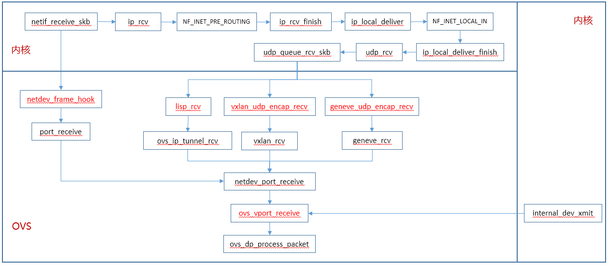

# OVS数据面

内核态OVS，报文进入OVS主要通过如下设备：

* VXLAN设备
  * 通过UDP Socket注册的vxlan_udp_encap_recv函数进入内核，最终通过rx_handler函数进入OVS
* eth设备
  * 协议栈收包后，通过rx_handler函数进入OVS
* internal设备
  * 通过internal端口的驱动发包函数，即internal_dev_xmit函数
* tap设备
  * 协议栈收包后，通过rx_handler函数进入OVS

OVS数据面入口：




# netdev_frame_hook

eth设备、tap设备和vxlan设备即通过rx_handler函数进入OVS

```
static rx_handler_result_t netdev_frame_hook(struct sk_buff **pskb)
{
	struct sk_buff *skb = *pskb;

	if (unlikely(skb->pkt_type == PACKET_LOOPBACK))
		return RX_HANDLER_PASS;

	port_receive(skb);
	return RX_HANDLER_CONSUMED;
}
#elif LINUX_VERSION_CODE >= KERNEL_VERSION(2,6,36) || \
      defined HAVE_RHEL_OVS_HOOK
/* Called with rcu_read_lock and bottom-halves disabled. */
static struct sk_buff *netdev_frame_hook(struct sk_buff *skb)
{
	if (unlikely(skb->pkt_type == PACKET_LOOPBACK))
		return skb;

	port_receive(skb);
	return NULL;
}
#elif LINUX_VERSION_CODE >= KERNEL_VERSION(2,6,32)
/*
 * Used as br_handle_frame_hook.  (Cannot run bridge at the same time, even on
 * different set of devices!)
 */
/* Called with rcu_read_lock and bottom-halves disabled. */
static struct sk_buff *netdev_frame_hook(struct net_bridge_port *p,
					 struct sk_buff *skb)
{
	port_receive(skb);
	return NULL;
}
#else
#error
#endif

#ifndef HAVE_METADATA_DST
#define port_receive(skb)  netdev_port_receive(skb, NULL)
#else
#define port_receive(skb)  netdev_port_receive(skb, skb_tunnel_info(skb))
#endif

void netdev_port_receive(struct sk_buff *skb, struct ip_tunnel_info *tun_info)
{
	struct vport *vport;

	vport = ovs_netdev_get_vport(skb->dev);
	if (unlikely(!vport))
		goto error;

	if (unlikely(skb_warn_if_lro(skb)))
		goto error;

	/* Make our own copy of the packet.  Otherwise we will mangle the
	 * packet for anyone who came before us (e.g. tcpdump via AF_PACKET).
	 */
	skb = skb_share_check(skb, GFP_ATOMIC);
	if (unlikely(!skb))
		return;

	skb_push(skb, ETH_HLEN);
	ovs_skb_postpush_rcsum(skb, skb->data, ETH_HLEN);
	ovs_vport_receive(vport, skb, tun_info);
	return;
error:
	kfree_skb(skb);
}
```


# internal_dev_xmit

internal设备发送报文进入OVS：

```
static int internal_dev_xmit(struct sk_buff *skb, struct net_device *netdev)
{
	int len, err;

	len = skb->len;
	rcu_read_lock();
	err = ovs_vport_receive(internal_dev_priv(netdev)->vport, skb, NULL);
	rcu_read_unlock();

	if (likely(!err)) {
#ifdef HAVE_DEV_TSTATS
		struct pcpu_sw_netstats *tstats;

		tstats = this_cpu_ptr((struct pcpu_sw_netstats __percpu *)netdev->tstats);

		u64_stats_update_begin(&tstats->syncp);
		tstats->tx_bytes += len;
		tstats->tx_packets++;
		u64_stats_update_end(&tstats->syncp);
#endif
	} else {
		netdev->stats.tx_errors++;
	}
	return 0;
}
```
