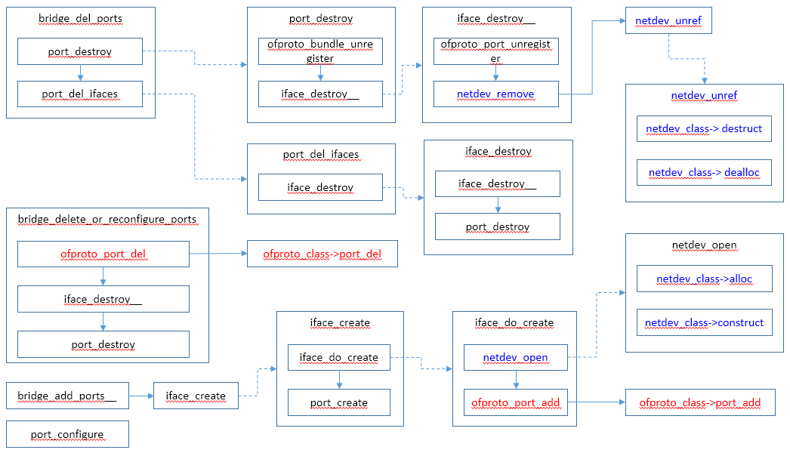

# 内核数据面port操作

本文介绍内核态OVS数据面的port添加和删除操作流程。

Port操作的调用流程如下：




# 端口类型


## netdev类型

```c
const struct netdev_class netdev_linux_class =
    NETDEV_LINUX_CLASS(
        "system",
        netdev_linux_construct,
        netdev_linux_get_stats,
        netdev_linux_get_features,
        netdev_linux_get_status);

const struct netdev_class netdev_tap_class =
    NETDEV_LINUX_CLASS(
        "tap",
        netdev_linux_construct_tap,
        netdev_tap_get_stats,
        netdev_linux_get_features,
        netdev_linux_get_status);

const struct netdev_class netdev_internal_class =
    NETDEV_LINUX_CLASS(
        "internal",
        netdev_linux_construct,
        netdev_internal_get_stats,
        NULL,                  /* get_features */
        netdev_internal_get_status);
```


## vport类型

```c
static struct vport_ops ovs_netdev_vport_ops = {
	.type		= OVS_VPORT_TYPE_NETDEV,
	.create		= netdev_create,
	.destroy	= netdev_destroy,
	.send		= dev_queue_xmit,
};

static struct vport_ops ovs_internal_vport_ops = {
	.type		= OVS_VPORT_TYPE_INTERNAL,
	.create		= internal_dev_create,
	.destroy	= internal_dev_destroy,
	.send		= internal_dev_recv,
};

static struct vport_ops ovs_lisp_vport_ops = {
	.type		= OVS_VPORT_TYPE_LISP,
	.create		= lisp_create,
	.destroy	= ovs_netdev_tunnel_destroy,
	.get_options	= lisp_get_options,
	.send		= lisp_xmit,
	.get_egress_tun_info	= lisp_get_egress_tun_info,
};

static struct vport_ops ovs_vxlan_netdev_vport_ops = {
	.type			= OVS_VPORT_TYPE_VXLAN,
	.create			= vxlan_create,
	.destroy		= ovs_netdev_tunnel_destroy,
	.get_options		= vxlan_get_options,
	.send			= vxlan_xmit,
	.get_egress_tun_info	= vxlan_get_egress_tun_info,
};

static struct vport_ops ovs_geneve_vport_ops = {
	.type		= OVS_VPORT_TYPE_GENEVE,
	.create		= geneve_create,
	.destroy	= ovs_netdev_tunnel_destroy,
	.get_options	= geneve_get_options,
	.send		= geneve_xmit,
	.get_egress_tun_info	= geneve_get_egress_tun_info,
};
```


# dpif_netlink_class


## dpif_netlink_port_add

```c
static int
dpif_netlink_port_add(struct dpif *dpif_, struct netdev *netdev,
                      odp_port_t *port_nop)
{
    struct dpif_netlink *dpif = dpif_netlink_cast(dpif_);
    int error;

    fat_rwlock_wrlock(&dpif->upcall_lock);
    error = dpif_netlink_port_add__(dpif, netdev, port_nop);
    fat_rwlock_unlock(&dpif->upcall_lock);

    return error;
}

static int
dpif_netlink_port_add__(struct dpif_netlink *dpif, struct netdev *netdev,
                        odp_port_t *port_nop)
    OVS_REQ_WRLOCK(dpif->upcall_lock)
{
    const struct netdev_tunnel_config *tnl_cfg;
    char namebuf[NETDEV_VPORT_NAME_BUFSIZE];
    const char *name = netdev_vport_get_dpif_port(netdev,
                                                  namebuf, sizeof namebuf);
    const char *type = netdev_get_type(netdev);
    struct dpif_netlink_vport request, reply;
    struct ofpbuf *buf;
    uint64_t options_stub[64 / 8];
    struct ofpbuf options;
    struct nl_sock **socksp = NULL;
    uint32_t *upcall_pids;
    int error = 0;

    if (dpif->handlers) {
        socksp = vport_create_socksp(dpif, &error);    //创建nl_sock
        if (!socksp) {
            return error;
        }
    }

    dpif_netlink_vport_init(&request);
    request.cmd = OVS_VPORT_CMD_NEW;
    request.dp_ifindex = dpif->dp_ifindex;
    request.type = netdev_to_ovs_vport_type(netdev);  //得到vport类型
    if (request.type == OVS_VPORT_TYPE_UNSPEC) {
        VLOG_WARN_RL(&error_rl, "%s: cannot create port `%s' because it has "
                     "unsupported type `%s'",
                     dpif_name(&dpif->dpif), name, type);
        vport_del_socksp(dpif, socksp);
        return EINVAL;
    }
    request.name = name;

    if (request.type == OVS_VPORT_TYPE_NETDEV) {
#ifdef _WIN32
        /* XXX : Map appropiate Windows handle */
#else
        netdev_linux_ethtool_set_flag(netdev, ETH_FLAG_LRO, "LRO", false);
#endif
    }

    tnl_cfg = netdev_get_tunnel_config(netdev);
    if (tnl_cfg && (tnl_cfg->dst_port != 0 || tnl_cfg->exts)) {
        ofpbuf_use_stack(&options, options_stub, sizeof options_stub);
        if (tnl_cfg->dst_port) {
            nl_msg_put_u16(&options, OVS_TUNNEL_ATTR_DST_PORT,
                           ntohs(tnl_cfg->dst_port));
        }
        if (tnl_cfg->exts) {
            size_t ext_ofs;
            int i;

            ext_ofs = nl_msg_start_nested(&options, OVS_TUNNEL_ATTR_EXTENSION);
            for (i = 0; i < 32; i++) {
                if (tnl_cfg->exts & (1 << i)) {
                    nl_msg_put_flag(&options, i);
                }
            }
            nl_msg_end_nested(&options, ext_ofs);
        }
        request.options = options.data;
        request.options_len = options.size;
    }

    request.port_no = *port_nop;
    upcall_pids = vport_socksp_to_pids(socksp, dpif->n_handlers);   //upcallpids就是nl_sock的pid对象，该值根据创建sock的线程计算得到
    request.n_upcall_pids = socksp ? dpif->n_handlers : 1;
    request.upcall_pids = upcall_pids;

    error = dpif_netlink_vport_transact(&request, &reply, &buf);    //通知内核添加端口
    if (!error) {
        *port_nop = reply.port_no;
    } else {
        if (error == EBUSY && *port_nop != ODPP_NONE) {
            VLOG_INFO("%s: requested port %"PRIu32" is in use",
                      dpif_name(&dpif->dpif), *port_nop);
        }

        vport_del_socksp(dpif, socksp);
        goto exit;
    }

    if (socksp) {
        error = vport_add_channels(dpif, *port_nop, socksp);       //upcall线程监听这些socksp
        if (error) {
            VLOG_INFO("%s: could not add channel for port %s",
                      dpif_name(&dpif->dpif), name);

            /* Delete the port. */
            dpif_netlink_vport_init(&request);
            request.cmd = OVS_VPORT_CMD_DEL;
            request.dp_ifindex = dpif->dp_ifindex;
            request.port_no = *port_nop;
            dpif_netlink_vport_transact(&request, NULL, NULL);     //发送netlink 报文
            vport_del_socksp(dpif, socksp);
            goto exit;
        }
    }
    free(socksp);

exit:
    ofpbuf_delete(buf);
    free(upcall_pids);

    return error;
}

static enum ovs_vport_type
netdev_to_ovs_vport_type(const struct netdev *netdev)
{
    const char *type = netdev_get_type(netdev);

    if (!strcmp(type, "tap") || !strcmp(type, "system")) {
        return OVS_VPORT_TYPE_NETDEV;
    } else if (!strcmp(type, "internal")) {
        return OVS_VPORT_TYPE_INTERNAL;
    } else if (strstr(type, "stt")) {
        return OVS_VPORT_TYPE_STT;
    } else if (!strcmp(type, "geneve")) {
        return OVS_VPORT_TYPE_GENEVE;
    } else if (strstr(type, "gre")) {
        return OVS_VPORT_TYPE_GRE;
    } else if (!strcmp(type, "vxlan")) {
        return OVS_VPORT_TYPE_VXLAN;
    } else if (!strcmp(type, "lisp")) {
        return OVS_VPORT_TYPE_LISP;
    } else {
        return OVS_VPORT_TYPE_UNSPEC;
    }
}
```


## dpif_netlink_port_del

```c
static int
dpif_netlink_port_del(struct dpif *dpif_, odp_port_t port_no)
{
    struct dpif_netlink *dpif = dpif_netlink_cast(dpif_);
    int error;

    fat_rwlock_wrlock(&dpif->upcall_lock);
    error = dpif_netlink_port_del__(dpif, port_no);
    fat_rwlock_unlock(&dpif->upcall_lock);

    return error;
}

static int
dpif_netlink_port_del__(struct dpif_netlink *dpif, odp_port_t port_no)
    OVS_REQ_WRLOCK(dpif->upcall_lock)
{
    struct dpif_netlink_vport vport;
    int error;

    dpif_netlink_vport_init(&vport);
    vport.cmd = OVS_VPORT_CMD_DEL;
    vport.dp_ifindex = dpif->dp_ifindex;
    vport.port_no = port_no;
    error = dpif_netlink_vport_transact(&vport, NULL, NULL);

    vport_del_channels(dpif, port_no);

    return error;
}
```


# 内核数据面

```c
static struct genl_ops dp_vport_genl_ops[] = {
	{ .cmd = OVS_VPORT_CMD_NEW,
	  .flags = GENL_ADMIN_PERM, /* Requires CAP_NET_ADMIN privilege. */
	  .policy = vport_policy,
	  .doit = ovs_vport_cmd_new
	},
	{ .cmd = OVS_VPORT_CMD_DEL,
	  .flags = GENL_ADMIN_PERM, /* Requires CAP_NET_ADMIN privilege. */
	  .policy = vport_policy,
	  .doit = ovs_vport_cmd_del
	},
	{ .cmd = OVS_VPORT_CMD_GET,
	  .flags = 0,		    /* OK for unprivileged users. */
	  .policy = vport_policy,
	  .doit = ovs_vport_cmd_get,
	  .dumpit = ovs_vport_cmd_dump
	},
	{ .cmd = OVS_VPORT_CMD_SET,
	  .flags = GENL_ADMIN_PERM, /* Requires CAP_NET_ADMIN privilege. */
	  .policy = vport_policy,
	  .doit = ovs_vport_cmd_set,
	},
};
```


## ovs_vport_cmd_new

```
static int ovs_vport_cmd_new(struct sk_buff *skb, struct genl_info *info)
{
	struct nlattr **a = info->attrs;
	struct ovs_header *ovs_header = info->userhdr;
	struct vport_parms parms;
	struct sk_buff *reply;
	struct vport *vport;
	struct datapath *dp;
	u32 port_no;
	int err;

	if (!a[OVS_VPORT_ATTR_NAME] || !a[OVS_VPORT_ATTR_TYPE] ||
	    !a[OVS_VPORT_ATTR_UPCALL_PID])
		return -EINVAL;

	port_no = a[OVS_VPORT_ATTR_PORT_NO]
		? nla_get_u32(a[OVS_VPORT_ATTR_PORT_NO]) : 0;
	if (port_no >= DP_MAX_PORTS)
		return -EFBIG;

	reply = ovs_vport_cmd_alloc_info();
	if (!reply)
		return -ENOMEM;

	ovs_lock();
restart:
	dp = get_dp(sock_net(skb->sk), ovs_header->dp_ifindex);
	err = -ENODEV;
	if (!dp)
		goto exit_unlock_free;

	if (port_no) {
		vport = ovs_vport_ovsl(dp, port_no);
		err = -EBUSY;
		if (vport)
			goto exit_unlock_free;
	} else {
		for (port_no = 1; ; port_no++) {
			if (port_no >= DP_MAX_PORTS) {
				err = -EFBIG;
				goto exit_unlock_free;
			}
			vport = ovs_vport_ovsl(dp, port_no);
			if (!vport)
				break;
		}
	}

	parms.name = nla_data(a[OVS_VPORT_ATTR_NAME]);
	parms.type = nla_get_u32(a[OVS_VPORT_ATTR_TYPE]);
	parms.options = a[OVS_VPORT_ATTR_OPTIONS];
	parms.dp = dp;
	parms.port_no = port_no;
	parms.upcall_portids = a[OVS_VPORT_ATTR_UPCALL_PID];

	vport = new_vport(&parms);
	err = PTR_ERR(vport);
	if (IS_ERR(vport)) {
		if (err == -EAGAIN)
			goto restart;
		goto exit_unlock_free;
	}

	err = ovs_vport_cmd_fill_info(vport, reply, info->snd_portid,
				      info->snd_seq, 0, OVS_VPORT_CMD_NEW);
	BUG_ON(err < 0);
	ovs_unlock();

	ovs_notify(&dp_vport_genl_family, &ovs_dp_vport_multicast_group, reply, info);
	return 0;

exit_unlock_free:
	ovs_unlock();
	kfree_skb(reply);
	return err;
}

static struct vport *new_vport(const struct vport_parms *parms)
{
	struct vport *vport;

	vport = ovs_vport_add(parms);
	if (!IS_ERR(vport)) {
		struct datapath *dp = parms->dp;
		struct hlist_head *head = vport_hash_bucket(dp, vport->port_no);

		hlist_add_head_rcu(&vport->dp_hash_node, head);
	}
	return vport;
}

struct vport *ovs_vport_add(const struct vport_parms *parms)
{
	struct vport_ops *ops;
	struct vport *vport;

	ops = ovs_vport_lookup(parms);   //获取vport_ops
	if (ops) {
		struct hlist_head *bucket;

		if (!try_module_get(ops->owner))
			return ERR_PTR(-EAFNOSUPPORT);

		vport = ops->create(parms);   //调用vport_ops创建vport
		if (IS_ERR(vport)) {
			module_put(ops->owner);
			return vport;
		}

		bucket = hash_bucket(ovs_dp_get_net(vport->dp),
				     ovs_vport_name(vport));
		hlist_add_head_rcu(&vport->hash_node, bucket);
		return vport;
	}

	/* Unlock to attempt module load and return -EAGAIN if load
	 * was successful as we need to restart the port addition
	 * workflow.
	 */
	ovs_unlock();
	request_module("vport-type-%d", parms->type);
	ovs_lock();

	if (!ovs_vport_lookup(parms))
		return ERR_PTR(-EAFNOSUPPORT);
	else
		return ERR_PTR(-EAGAIN);
}
```


## ovs_vport_cmd_del

```c
static int ovs_vport_cmd_del(struct sk_buff *skb, struct genl_info *info)
{
	struct nlattr **a = info->attrs;
	struct sk_buff *reply;
	struct vport *vport;
	int err;

	reply = ovs_vport_cmd_alloc_info();
	if (!reply)
		return -ENOMEM;

	ovs_lock();
	vport = lookup_vport(sock_net(skb->sk), info->userhdr, a);
	err = PTR_ERR(vport);
	if (IS_ERR(vport))
		goto exit_unlock_free;

	if (vport->port_no == OVSP_LOCAL) {
		err = -EINVAL;
		goto exit_unlock_free;
	}

	err = ovs_vport_cmd_fill_info(vport, reply, info->snd_portid,
				      info->snd_seq, 0, OVS_VPORT_CMD_DEL);
	BUG_ON(err < 0);
	ovs_dp_detach_port(vport);
	ovs_unlock();

	ovs_notify(&dp_vport_genl_family, &ovs_dp_vport_multicast_group, reply, info);
	return 0;

exit_unlock_free:
	ovs_unlock();
	kfree_skb(reply);
	return err;
}

void ovs_dp_detach_port(struct vport *p)
{
	ASSERT_OVSL();

	/* First drop references to device. */
	hlist_del_rcu(&p->dp_hash_node);

	/* Then destroy it. */
	ovs_vport_del(p);
}

void ovs_vport_del(struct vport *vport)
{
	ASSERT_OVSL();

	hlist_del_rcu(&vport->hash_node);
	module_put(vport->ops->owner);
	vport->ops->destroy(vport);        //调用vport_ops的destroy方法
}
```

