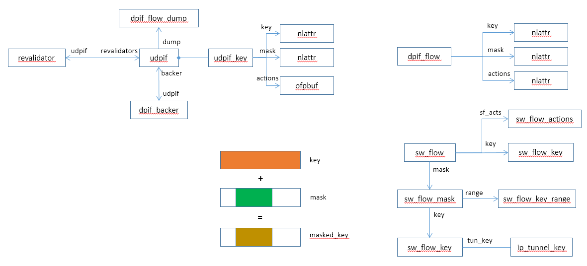
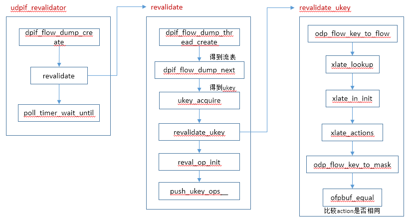

# revalidator

OVS revalidator机制校验数据面的流表是否需要修正，因为openflow的流表变化可能导致数据面的流表发生变化。

主要数据结构：




调用流程：




# revalidator线程

```c
static void *
udpif_revalidator(void *arg)
{
    /* Used by all revalidators. */
    struct revalidator *revalidator = arg;
    struct udpif *udpif = revalidator->udpif;
    bool leader = revalidator == &udpif->revalidators[0];    //第一个为leader revalidator

    /* Used only by the leader. */
    long long int start_time = 0;
    uint64_t last_reval_seq = 0;
    size_t n_flows = 0;

    revalidator->id = ovsthread_id_self();
    for (;;) {
        if (leader) {
            uint64_t reval_seq;

            recirc_run(); /* Recirculation cleanup. */

            reval_seq = seq_read(udpif->reval_seq);
            last_reval_seq = reval_seq;

            n_flows = udpif_get_n_flows(udpif);    //获得流表数，由leader来查询总流表数
            udpif->max_n_flows = MAX(n_flows, udpif->max_n_flows);
            udpif->avg_n_flows = (udpif->avg_n_flows + n_flows) / 2;

            /* Only the leader checks the pause latch to prevent a race where
             * some threads think it's false and proceed to block on
             * reval_barrier and others think it's true and block indefinitely
             * on the pause_barrier */
            udpif->pause = latch_is_set(&udpif->pause_latch);

            /* Only the leader checks the exit latch to prevent a race where
             * some threads think it's true and exit and others think it's
             * false and block indefinitely on the reval_barrier */
            udpif->reval_exit = latch_is_set(&udpif->exit_latch);

            start_time = time_msec();
            if (!udpif->reval_exit) {
                bool terse_dump;

                terse_dump = udpif_use_ufid(udpif);
                udpif->dump = dpif_flow_dump_create(udpif->dpif, terse_dump);    //初始化dump操作
            }
        }

        /* Wait for the leader to start the flow dump. */
        ovs_barrier_block(&udpif->reval_barrier);
        if (udpif->pause) {
            revalidator_pause(revalidator);
        }

        if (udpif->reval_exit) {
            break;
        }
        revalidate(revalidator);    //执行revalidate操作

        /* Wait for all flows to have been dumped before we garbage collect. */
        ovs_barrier_block(&udpif->reval_barrier);
        revalidator_sweep(revalidator);

        /* Wait for all revalidators to finish garbage collection. */
        ovs_barrier_block(&udpif->reval_barrier);

        if (leader) {
            unsigned int flow_limit;
            long long int duration;

            atomic_read_relaxed(&udpif->flow_limit, &flow_limit);

            dpif_flow_dump_destroy(udpif->dump);
            seq_change(udpif->dump_seq);

            duration = MAX(time_msec() - start_time, 1);
            udpif->dump_duration = duration;
            if (duration > 2000) {
                flow_limit /= duration / 1000;
            } else if (duration > 1300) {
                flow_limit = flow_limit * 3 / 4;
            } else if (duration < 1000 && n_flows > 2000
                       && flow_limit < n_flows * 1000 / duration) {
                flow_limit += 1000;
            }
            flow_limit = MIN(ofproto_flow_limit, MAX(flow_limit, 1000));
            atomic_store_relaxed(&udpif->flow_limit, flow_limit);

            if (duration > 2000) {
                VLOG_INFO("Spent an unreasonably long %lldms dumping flows",
                          duration);
            }

            poll_timer_wait_until(start_time + MIN(ofproto_max_idle, 500));
            seq_wait(udpif->reval_seq, last_reval_seq);
            latch_wait(&udpif->exit_latch);
            latch_wait(&udpif->pause_latch);
            poll_block();
        }
    }

    return NULL;
}
```


# revalidate

```c
static void
revalidate(struct revalidator *revalidator)
{
    uint64_t odp_actions_stub[1024 / 8];
    struct ofpbuf odp_actions = OFPBUF_STUB_INITIALIZER(odp_actions_stub);

    struct udpif *udpif = revalidator->udpif;
    struct dpif_flow_dump_thread *dump_thread;
    uint64_t dump_seq, reval_seq;
    unsigned int flow_limit;

    dump_seq = seq_read(udpif->dump_seq);
    reval_seq = seq_read(udpif->reval_seq);
    atomic_read_relaxed(&udpif->flow_limit, &flow_limit);
    dump_thread = dpif_flow_dump_thread_create(udpif->dump);   //创建dump线程
    for (;;) {
        struct ukey_op ops[REVALIDATE_MAX_BATCH];
        int n_ops = 0;

        struct dpif_flow flows[REVALIDATE_MAX_BATCH];
        const struct dpif_flow *f;
        int n_dumped;

        long long int max_idle;
        long long int now;
        size_t n_dp_flows;
        bool kill_them_all;

        n_dumped = dpif_flow_dump_next(dump_thread, flows, ARRAY_SIZE(flows));    //dump流表
        if (!n_dumped) {
            break;
        }

        now = time_msec();

        /* In normal operation we want to keep flows around until they have
         * been idle for 'ofproto_max_idle' milliseconds.  However:
         *
         *     - If the number of datapath flows climbs above 'flow_limit',
         *       drop that down to 100 ms to try to bring the flows down to
         *       the limit.
         *
         *     - If the number of datapath flows climbs above twice
         *       'flow_limit', delete all the datapath flows as an emergency
         *       measure.  (We reassess this condition for the next batch of
         *       datapath flows, so we will recover before all the flows are
         *       gone.) */
        n_dp_flows = udpif_get_n_flows(udpif);
        kill_them_all = n_dp_flows > flow_limit * 2;
        max_idle = n_dp_flows > flow_limit ? 100 : ofproto_max_idle;

        for (f = flows; f < &flows[n_dumped]; f++) {    //遍历dump得到的流表
            long long int used = f->stats.used;
            struct recirc_refs recircs = RECIRC_REFS_EMPTY_INITIALIZER;
            enum reval_result result;
            struct udpif_key *ukey;
            bool already_dumped;
            int error;

            if (ukey_acquire(udpif, f, &ukey, &error)) {    //得到ukey
                if (error == EBUSY) {
                    /* Another thread is processing this flow, so don't bother
                     * processing it.*/
                    COVERAGE_INC(upcall_ukey_contention);
                } else {
                    log_unexpected_flow(f, error);
                    if (error != ENOENT) {
                        delete_op_init__(udpif, &ops[n_ops++], f);
                    }
                }
                continue;
            }

            already_dumped = ukey->dump_seq == dump_seq;
            if (already_dumped) {
                /* The flow has already been handled during this flow dump
                 * operation. Skip it. */
                if (ukey->xcache) {
                    COVERAGE_INC(dumped_duplicate_flow);
                } else {
                    COVERAGE_INC(dumped_new_flow);
                }
                ovs_mutex_unlock(&ukey->mutex);
                continue;
            }

            if (!used) {
                used = ukey->created;
            }
            if (kill_them_all || (used && used < now - max_idle)) {
                result = UKEY_DELETE;
            } else {
                result = revalidate_ukey(udpif, ukey, &f->stats, &odp_actions,
                                         reval_seq, &recircs);
            }
            ukey->dump_seq = dump_seq;
            ukey->flow_exists = result != UKEY_DELETE;

            if (result != UKEY_KEEP) {    //如果需要修改
                /* Takes ownership of 'recircs'. */
                reval_op_init(&ops[n_ops++], result, udpif, ukey, &recircs,   //初始化ops
                              &odp_actions);
            }
            ovs_mutex_unlock(&ukey->mutex);
        }

        if (n_ops) {
            push_ukey_ops__(udpif, ops, n_ops);     //执行ukey变化操作
        }
        ovsrcu_quiesce();
    }
    dpif_flow_dump_thread_destroy(dump_thread);
    ofpbuf_uninit(&odp_actions);
}
```


## dpif_flow_dump_next

```c
static int ovs_flow_cmd_dump(struct sk_buff *skb, struct netlink_callback *cb)
{
	struct nlattr *a[__OVS_FLOW_ATTR_MAX];
	struct ovs_header *ovs_header = genlmsg_data(nlmsg_data(cb->nlh));
	struct table_instance *ti;
	struct datapath *dp;
	u32 ufid_flags;
	int err;

	err = genlmsg_parse(cb->nlh, &dp_flow_genl_family, a,
			    OVS_FLOW_ATTR_MAX, flow_policy);
	if (err)
		return err;
	ufid_flags = ovs_nla_get_ufid_flags(a[OVS_FLOW_ATTR_UFID_FLAGS]);

	rcu_read_lock();
	dp = get_dp_rcu(sock_net(skb->sk), ovs_header->dp_ifindex);
	if (!dp) {
		rcu_read_unlock();
		return -ENODEV;
	}

	ti = rcu_dereference(dp->table.ti);
	for (;;) {
		struct sw_flow *flow;
		u32 bucket, obj;

		bucket = cb->args[0];
		obj = cb->args[1];
		flow = ovs_flow_tbl_dump_next(ti, &bucket, &obj);   //dump flow
		if (!flow)
			break;

		if (ovs_flow_cmd_fill_info(flow, ovs_header->dp_ifindex, skb,  
					   NETLINK_CB(cb->skb).portid,
					   cb->nlh->nlmsg_seq, NLM_F_MULTI,
					   OVS_FLOW_CMD_NEW, ufid_flags) < 0)
			break;

		cb->args[0] = bucket;
		cb->args[1] = obj;
	}
	rcu_read_unlock();
	return skb->len;
}

struct sw_flow *ovs_flow_tbl_dump_next(struct table_instance *ti,
				       u32 *bucket, u32 *last)
{
	struct sw_flow *flow;
	struct hlist_head *head;
	int ver;
	int i;

	ver = ti->node_ver;
	while (*bucket < ti->n_buckets) {
		i = 0;
		head = flex_array_get(ti->buckets, *bucket);
		hlist_for_each_entry_rcu(flow, head, flow_table.node[ver]) {
			if (i < *last) {
				i++;
				continue;
			}
			*last = i + 1;
			return flow;
		}
		(*bucket)++;
		*last = 0;
	}

	return NULL;
}

static int ovs_flow_cmd_fill_info(const struct sw_flow *flow, int dp_ifindex,
				  struct sk_buff *skb, u32 portid,
				  u32 seq, u32 flags, u8 cmd, u32 ufid_flags)
{
	const int skb_orig_len = skb->len;
	struct ovs_header *ovs_header;
	int err;

	ovs_header = genlmsg_put(skb, portid, seq, &dp_flow_genl_family,
				 flags, cmd);
	if (!ovs_header)
		return -EMSGSIZE;

	ovs_header->dp_ifindex = dp_ifindex;

	err = ovs_nla_put_identifier(flow, skb);
	if (err)
		goto error;

	if (should_fill_key(&flow->id, ufid_flags)) {
		err = ovs_nla_put_masked_key(flow, skb);
		if (err)
			goto error;
	}

	if (should_fill_mask(ufid_flags)) {
		err = ovs_nla_put_mask(flow, skb);
		if (err)
			goto error;
	}

	err = ovs_flow_cmd_fill_stats(flow, skb);
	if (err)
		goto error;

	if (should_fill_actions(ufid_flags)) {
		err = ovs_flow_cmd_fill_actions(flow, skb, skb_orig_len);
		if (err)
			goto error;
	}

	genlmsg_end(skb, ovs_header);
	return 0;

error:
	genlmsg_cancel(skb, ovs_header);
	return err;
}
```


## ukey_acquire

```c
static int
ukey_acquire(struct udpif *udpif, const struct dpif_flow *flow,
             struct udpif_key **result, int *error)
    OVS_TRY_LOCK(0, (*result)->mutex)
{
    struct udpif_key *ukey;
    int retval;

    ukey = ukey_lookup(udpif, &flow->ufid);    //查询ukey，ukey是在ukey_install_start函数插入到map中
    if (ukey) {
        retval = ovs_mutex_trylock(&ukey->mutex);
    } else {
        /* Usually we try to avoid installing flows from revalidator threads,
         * because locking on a umap may cause handler threads to block.
         * However there are certain cases, like when ovs-vswitchd is
         * restarted, where it is desirable to handle flows that exist in the
         * datapath gracefully (ie, don't just clear the datapath). */
        bool install;

        retval = ukey_create_from_dpif_flow(udpif, flow, &ukey);    //根据flow创建ukey
        if (retval) {
            goto done;
        }
        install = ukey_install_start(udpif, ukey);
        if (install) {
            ukey_install_finish__(ukey);
            retval = 0;
        } else {
            ukey_delete__(ukey);
            retval = EBUSY;
        }
    }

done:
    *error = retval;
    if (retval) {
        *result = NULL;
    } else {
        *result = ukey;
    }
    return retval;
}
```


## ukey_create_from_dpif_flow

```c
static int
ukey_create_from_dpif_flow(const struct udpif *udpif,
                           const struct dpif_flow *flow,
                           struct udpif_key **ukey)
{
    struct dpif_flow full_flow;
    struct ofpbuf actions;
    uint64_t dump_seq, reval_seq;
    uint64_t stub[DPIF_FLOW_BUFSIZE / 8];
    const struct nlattr *a;
    unsigned int left;

    if (!flow->key_len || !flow->actions_len) {
        struct ofpbuf buf;
        int err;

        /* If the key or actions were not provided by the datapath, fetch the
         * full flow. */
        ofpbuf_use_stack(&buf, &stub, sizeof stub);
        err = dpif_flow_get(udpif->dpif, NULL, 0, &flow->ufid,
                            flow->pmd_id, &buf, &full_flow);
        if (err) {
            return err;
        }
        flow = &full_flow;
    }

    /* Check the flow actions for recirculation action.  As recirculation
     * relies on OVS userspace internal state, we need to delete all old
     * datapath flows with either a non-zero recirc_id in the key, or any
     * recirculation actions upon OVS restart. */
    NL_ATTR_FOR_EACH_UNSAFE (a, left, flow->key, flow->key_len) {
        if (nl_attr_type(a) == OVS_KEY_ATTR_RECIRC_ID
            && nl_attr_get_u32(a) != 0) {
            return EINVAL;
        }
    }
    NL_ATTR_FOR_EACH_UNSAFE (a, left, flow->actions, flow->actions_len) {
        if (nl_attr_type(a) == OVS_ACTION_ATTR_RECIRC) {
            return EINVAL;
        }
    }

    dump_seq = seq_read(udpif->dump_seq);
    reval_seq = seq_read(udpif->reval_seq);
    ofpbuf_use_const(&actions, &flow->actions, flow->actions_len);
    *ukey = ukey_create__(flow->key, flow->key_len,
                          flow->mask, flow->mask_len, flow->ufid_present,
                          &flow->ufid, flow->pmd_id, &actions, dump_seq,
                          reval_seq, flow->stats.used, 0, NULL);

    return 0;
}

static struct udpif_key *
ukey_create__(const struct nlattr *key, size_t key_len,
              const struct nlattr *mask, size_t mask_len,
              bool ufid_present, const ovs_u128 *ufid,
              const unsigned pmd_id, const struct ofpbuf *actions,
              uint64_t dump_seq, uint64_t reval_seq, long long int used,
              uint32_t key_recirc_id, struct xlate_out *xout)
    OVS_NO_THREAD_SAFETY_ANALYSIS
{
    struct udpif_key *ukey = xmalloc(sizeof *ukey);

    memcpy(&ukey->keybuf, key, key_len);
    ukey->key = &ukey->keybuf.nla;
    ukey->key_len = key_len;
    memcpy(&ukey->maskbuf, mask, mask_len);
    ukey->mask = &ukey->maskbuf.nla;
    ukey->mask_len = mask_len;
    ukey->ufid_present = ufid_present;
    ukey->ufid = *ufid;
    ukey->pmd_id = pmd_id;
    ukey->hash = get_ufid_hash(&ukey->ufid);

    ovsrcu_init(&ukey->actions, NULL);
    ukey_set_actions(ukey, actions);

    ovs_mutex_init(&ukey->mutex);
    ukey->dump_seq = dump_seq;
    ukey->reval_seq = reval_seq;
    ukey->flow_exists = false;
    ukey->created = time_msec();
    memset(&ukey->stats, 0, sizeof ukey->stats);
    ukey->stats.used = used;
    ukey->xcache = NULL;

    ukey->key_recirc_id = key_recirc_id;
    recirc_refs_init(&ukey->recircs);
    if (xout) {
        /* Take ownership of the action recirc id references. */
        recirc_refs_swap(&ukey->recircs, &xout->recircs);
    }

    return ukey;
}
```


## reval_op_init

```c
static void
reval_op_init(struct ukey_op *op, enum reval_result result,
              struct udpif *udpif, struct udpif_key *ukey,
              struct recirc_refs *recircs, struct ofpbuf *odp_actions)
{
    if (result == UKEY_DELETE) {
        delete_op_init(udpif, op, ukey);
    } else if (result == UKEY_MODIFY) {
        /* Store the new recircs. */
        recirc_refs_swap(&ukey->recircs, recircs);
        /* Release old recircs. */
        recirc_refs_unref(recircs);
        /* ukey->key_recirc_id remains, as the key is the same as before. */

        ukey_set_actions(ukey, odp_actions);
        modify_op_init(op, ukey);
    }
}
```


# revalidate_ukey

```c
static enum reval_result
revalidate_ukey(struct udpif *udpif, struct udpif_key *ukey,
                const struct dpif_flow_stats *stats,
                struct ofpbuf *odp_actions, uint64_t reval_seq,
                struct recirc_refs *recircs)
    OVS_REQUIRES(ukey->mutex)
{
    struct xlate_out xout, *xoutp;
    struct netflow *netflow;
    struct ofproto_dpif *ofproto;
    struct dpif_flow_stats push;
    struct flow flow;
    struct flow_wildcards dp_mask, wc;
    enum reval_result result;
    ofp_port_t ofp_in_port;
    struct xlate_in xin;
    long long int last_used;
    int error;
    bool need_revalidate;

    result = UKEY_DELETE;
    xoutp = NULL;
    netflow = NULL;

    ofpbuf_clear(odp_actions);
    need_revalidate = (ukey->reval_seq != reval_seq);
    last_used = ukey->stats.used;
    push.used = stats->used;
    push.tcp_flags = stats->tcp_flags;
    push.n_packets = (stats->n_packets > ukey->stats.n_packets
                      ? stats->n_packets - ukey->stats.n_packets
                      : 0);
    push.n_bytes = (stats->n_bytes > ukey->stats.n_bytes
                    ? stats->n_bytes - ukey->stats.n_bytes
                    : 0);

    if (need_revalidate && last_used
        && !should_revalidate(udpif, push.n_packets, last_used)) {
        goto exit;
    }

    /* We will push the stats, so update the ukey stats cache. */
    ukey->stats = *stats;
    if (!push.n_packets && !need_revalidate) {
        result = UKEY_KEEP;
        goto exit;
    }

    if (ukey->xcache && !need_revalidate) {
        xlate_push_stats(ukey->xcache, &push);
        result = UKEY_KEEP;
        goto exit;
    }

    if (odp_flow_key_to_flow(ukey->key, ukey->key_len, &flow)   //根据ukey生成flow
        == ODP_FIT_ERROR) {
        goto exit;
    }

    error = xlate_lookup(udpif->backer, &flow, &ofproto, NULL, NULL, &netflow,    //返回交换机，xport等关键信息
                         &ofp_in_port);
    if (error) {
        goto exit;
    }

    if (need_revalidate) {
        xlate_cache_clear(ukey->xcache);
    }
    if (!ukey->xcache) {
        ukey->xcache = xlate_cache_new();
    }

    xlate_in_init(&xin, ofproto, &flow, ofp_in_port, NULL, push.tcp_flags,
                  NULL, need_revalidate ? &wc : NULL, odp_actions);          //初始化xin对象
    if (push.n_packets) {
        xin.resubmit_stats = &push;
        xin.may_learn = true;
    }
    xin.xcache = ukey->xcache;
    xlate_actions(&xin, &xout);     //执行类似miss upcall的操作
    xoutp = &xout;

    if (!need_revalidate) {
        result = UKEY_KEEP;
        goto exit;
    }

    if (xout.slow) {                  //special flow操作
        ofpbuf_clear(odp_actions);
        compose_slow_path(udpif, &xout, &flow, flow.in_port.odp_port,
                          odp_actions);
    }

    if (odp_flow_key_to_mask(ukey->mask, ukey->mask_len, ukey->key,       //更新dp_mask的mask对象
                             ukey->key_len, &dp_mask, &flow)
        == ODP_FIT_ERROR) {
        goto exit;
    }

    /* Do not modify if any bit is wildcarded by the installed datapath flow,
     * but not the newly revalidated wildcard mask (wc), i.e., if revalidation
     * tells that the datapath flow is now too generic and must be narrowed
     * down.  Note that we do not know if the datapath has ignored any of the
     * wildcarded bits, so we may be overtly conservative here. */
    if (flow_wildcards_has_extra(&dp_mask, &wc)) {
        goto exit;
    }

    if (!ofpbuf_equal(odp_actions,
                      ovsrcu_get(struct ofpbuf *, &ukey->actions))) {     //比较actions，如果不相等说明需要修改
        /* The datapath mask was OK, but the actions seem to have changed.
         * Let's modify it in place. */
        result = UKEY_MODIFY;
        /* Transfer recirc action ID references to the caller. */
        recirc_refs_swap(recircs, &xoutp->recircs);
        goto exit;
    }

    result = UKEY_KEEP;

exit:
    if (result != UKEY_DELETE) {
        ukey->reval_seq = reval_seq;
    }
    if (netflow && result == UKEY_DELETE) {
        netflow_flow_clear(netflow, &flow);
    }
    xlate_out_uninit(xoutp);
    return result;
}
```


# push_ukey_ops__

```c
static void
push_ukey_ops__(struct udpif *udpif, struct ukey_op *ops, size_t n_ops)
{
    struct dpif_op *opsp[REVALIDATE_MAX_BATCH];
    size_t i;

    ovs_assert(n_ops <= REVALIDATE_MAX_BATCH);
    for (i = 0; i < n_ops; i++) {
        opsp[i] = &ops[i].dop;
    }
    dpif_operate(udpif->dpif, opsp, n_ops);

    for (i = 0; i < n_ops; i++) {
        struct ukey_op *op = &ops[i];
        struct dpif_flow_stats *push, *stats, push_buf;

        stats = op->dop.u.flow_del.stats;
        push = &push_buf;

        if (op->dop.type != DPIF_OP_FLOW_DEL) {
            /* Only deleted flows need their stats pushed. */
            continue;
        }

        if (op->dop.error) {
            /* flow_del error, 'stats' is unusable. */
            continue;
        }

        if (op->ukey) {
            ovs_mutex_lock(&op->ukey->mutex);
            push->used = MAX(stats->used, op->ukey->stats.used);
            push->tcp_flags = stats->tcp_flags | op->ukey->stats.tcp_flags;
            push->n_packets = stats->n_packets - op->ukey->stats.n_packets;
            push->n_bytes = stats->n_bytes - op->ukey->stats.n_bytes;
            ovs_mutex_unlock(&op->ukey->mutex);
        } else {
            push = stats;
        }

        if (push->n_packets || netflow_exists()) {
            const struct nlattr *key = op->dop.u.flow_del.key;
            size_t key_len = op->dop.u.flow_del.key_len;
            struct ofproto_dpif *ofproto;
            struct netflow *netflow;
            ofp_port_t ofp_in_port;
            struct flow flow;
            int error;

            if (op->ukey) {
                ovs_mutex_lock(&op->ukey->mutex);
                if (op->ukey->xcache) {
                    xlate_push_stats(op->ukey->xcache, push);
                    ovs_mutex_unlock(&op->ukey->mutex);
                    continue;
                }
                ovs_mutex_unlock(&op->ukey->mutex);
                key = op->ukey->key;
                key_len = op->ukey->key_len;
            }

            if (odp_flow_key_to_flow(key, key_len, &flow)
                == ODP_FIT_ERROR) {
                continue;
            }

            error = xlate_lookup(udpif->backer, &flow, &ofproto, NULL, NULL,
                                 &netflow, &ofp_in_port);
            if (!error) {
                struct xlate_in xin;

                xlate_in_init(&xin, ofproto, &flow, ofp_in_port, NULL,
                              push->tcp_flags, NULL, NULL, NULL);
                xin.resubmit_stats = push->n_packets ? push : NULL;
                xin.may_learn = push->n_packets > 0;
                xlate_actions_for_side_effects(&xin);

                if (netflow) {
                    netflow_flow_clear(netflow, &flow);
                }
            }
        }
    }
}
```


