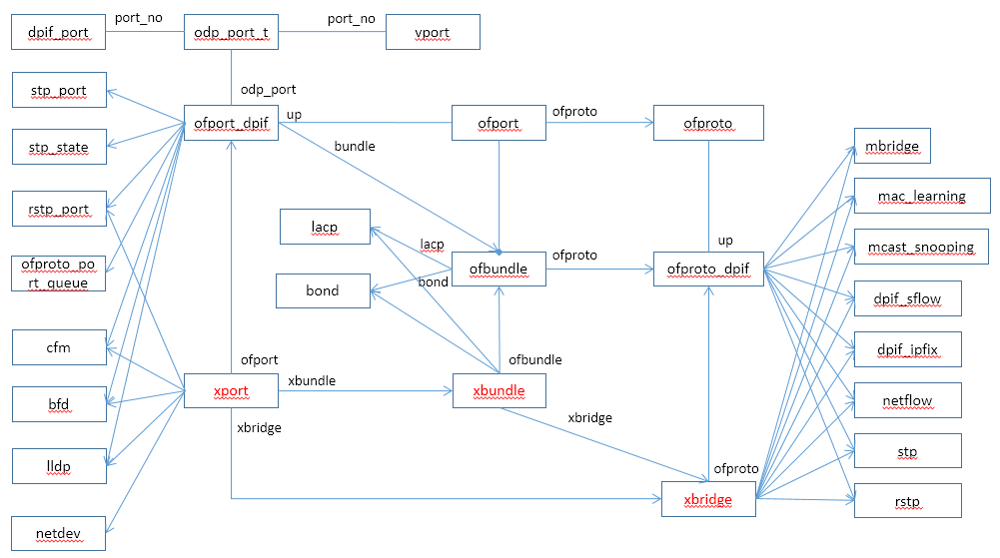
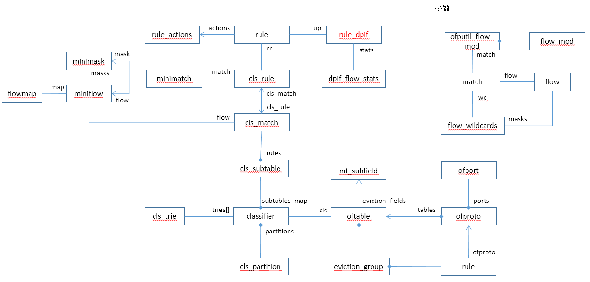
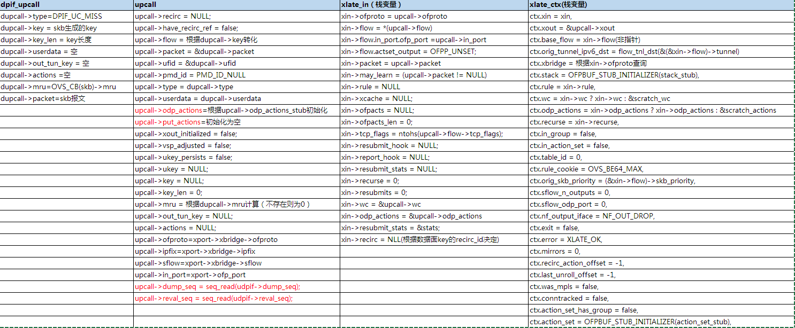
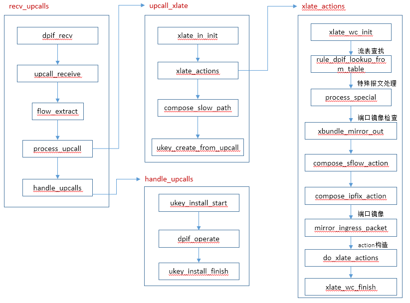

# upcall处理

本文介绍用户态接收到upcall报文后，生成action的过程，action可能来源于：

1. Openflow定义的操作；
2. 端口镜像的操作；
3. 特殊报文处理；

数据结构：




ofproto flow数据结构：




关键参数值：




调用流程：




遗留问题：

1. subtable的indices作用是什么，为什么不直接使用rules来检索cls_match；


# process_upcall(入口)

```c
static int
process_upcall(struct udpif *udpif, struct upcall *upcall,
               struct ofpbuf *odp_actions, struct flow_wildcards *wc)
{
    const struct nlattr *userdata = upcall->userdata;
    const struct dp_packet *packet = upcall->packet;
    const struct flow *flow = upcall->flow;

    switch (classify_upcall(upcall->type, userdata)) {
    case MISS_UPCALL:
        upcall_xlate(udpif, upcall, odp_actions, wc);          //流表miss，流表查询
        return 0;

    case SFLOW_UPCALL:
        if (upcall->sflow) {
            union user_action_cookie cookie;
            const struct nlattr *actions;
            size_t actions_len = 0;
            struct dpif_sflow_actions sflow_actions;
            memset(&sflow_actions, 0, sizeof sflow_actions);
            memset(&cookie, 0, sizeof cookie);
            memcpy(&cookie, nl_attr_get(userdata), sizeof cookie.sflow);	//读取user data信息
            if (upcall->actions) {
                /* Actions were passed up from datapath. */
                actions = nl_attr_get(upcall->actions);
                actions_len = nl_attr_get_size(upcall->actions);
                if (actions && actions_len) {
                    dpif_sflow_read_actions(flow, actions, actions_len,		//获取sflow action
                                            &sflow_actions);
                }
            }
            if (actions_len == 0) {
                /* Lookup actions in userspace cache. */
                struct udpif_key *ukey = ukey_lookup(udpif, upcall->ufid);	//用户态cache，加速
                if (ukey) {
                    ukey_get_actions(ukey, &actions, &actions_len);
                    dpif_sflow_read_actions(flow, actions, actions_len,
                                            &sflow_actions);
                }
            }
            dpif_sflow_received(upcall->sflow, packet, flow,			//sflow消息处理
                                flow->in_port.odp_port, &cookie,
                                actions_len > 0 ? &sflow_actions : NULL);
        }
        break;

    case IPFIX_UPCALL:
        if (upcall->ipfix) {
            union user_action_cookie cookie;
            struct flow_tnl output_tunnel_key;

            memset(&cookie, 0, sizeof cookie);
            memcpy(&cookie, nl_attr_get(userdata), sizeof cookie.ipfix);

            if (upcall->out_tun_key) {
                odp_tun_key_from_attr(upcall->out_tun_key, false,
                                      &output_tunnel_key);
            }
            dpif_ipfix_bridge_sample(upcall->ipfix, packet, flow,
                                     flow->in_port.odp_port,
                                     cookie.ipfix.output_odp_port,
                                     upcall->out_tun_key ?
                                         &output_tunnel_key : NULL);
        }
        break;

    case FLOW_SAMPLE_UPCALL:
        if (upcall->ipfix) {
            union user_action_cookie cookie;

            memset(&cookie, 0, sizeof cookie);
            memcpy(&cookie, nl_attr_get(userdata), sizeof cookie.flow_sample);

            /* The flow reflects exactly the contents of the packet.
             * Sample the packet using it. */
            dpif_ipfix_flow_sample(upcall->ipfix, packet, flow,
                                   cookie.flow_sample.collector_set_id,
                                   cookie.flow_sample.probability,
                                   cookie.flow_sample.obs_domain_id,
                                   cookie.flow_sample.obs_point_id);
        }
        break;

    case BAD_UPCALL:
        break;
    }

    return EAGAIN;
}
```


# upcall_xlate(MISS)

```c
static void
upcall_xlate(struct udpif *udpif, struct upcall *upcall,
             struct ofpbuf *odp_actions, struct flow_wildcards *wc)
{
    struct dpif_flow_stats stats;
    struct xlate_in xin;

    stats.n_packets = 1;
    stats.n_bytes = dp_packet_size(upcall->packet);
    stats.used = time_msec();
    stats.tcp_flags = ntohs(upcall->flow->tcp_flags);

    xlate_in_init(&xin, upcall->ofproto, upcall->flow, upcall->in_port, NULL,    //初始化xlate_in
                  stats.tcp_flags, upcall->packet, wc, odp_actions);

    if (upcall->type == DPIF_UC_MISS) {        //upcall miss，进此分支
        xin.resubmit_stats = &stats;

        if (xin.recirc) {     //不进此分支
            /* We may install a datapath flow only if we get a reference to the
             * recirculation context (otherwise we could have recirculation
             * upcalls using recirculation ID for which no context can be
             * found).  We may still execute the flow's actions even if we
             * don't install the flow. */
            upcall->recirc = xin.recirc;
            upcall->have_recirc_ref = recirc_id_node_try_ref_rcu(xin.recirc);
        }
    } else {
        /* For non-miss upcalls, we are either executing actions (one of which
         * is an userspace action) for an upcall, in which case the stats have
         * already been taken care of, or there's a flow in the datapath which
         * this packet was accounted to.  Presumably the revalidators will deal
         * with pushing its stats eventually. */
    }

    upcall->dump_seq = seq_read(udpif->dump_seq);
    upcall->reval_seq = seq_read(udpif->reval_seq);
    xlate_actions(&xin, &upcall->xout);    //执行xlate
    upcall->xout_initialized = true;

    /* Special case for fail-open mode.
     *
     * If we are in fail-open mode, but we are connected to a controller too,
     * then we should send the packet up to the controller in the hope that it
     * will try to set up a flow and thereby allow us to exit fail-open.
     *
     * See the top-level comment in fail-open.c for more information.
     *
     * Copy packets before they are modified by execution. */
    if (upcall->xout.fail_open) {
        const struct dp_packet *packet = upcall->packet;
        struct ofproto_packet_in *pin;

        pin = xmalloc(sizeof *pin);
        pin->up.packet = xmemdup(dp_packet_data(packet), dp_packet_size(packet));
        pin->up.packet_len = dp_packet_size(packet);
        pin->up.reason = OFPR_NO_MATCH;
        pin->up.table_id = 0;
        pin->up.cookie = OVS_BE64_MAX;
        flow_get_metadata(upcall->flow, &pin->up.flow_metadata);
        pin->send_len = 0; /* Not used for flow table misses. */
        pin->miss_type = OFPROTO_PACKET_IN_NO_MISS;
        ofproto_dpif_send_packet_in(upcall->ofproto, pin);
    }

    if (!upcall->xout.slow) {      //special端口处理
        ofpbuf_use_const(&upcall->put_actions,
                         odp_actions->data, odp_actions->size);
    } else {     //常规路径
        /* upcall->put_actions already initialized by upcall_receive(). */
        compose_slow_path(udpif, &upcall->xout, upcall->flow,
                          upcall->flow->in_port.odp_port,
                          &upcall->put_actions);       //添加OVS_ACTION_ATTR_USERSPACE actions
    }

    /* This function is also called for slow-pathed flows.  As we are only
     * going to create new datapath flows for actual datapath misses, there is
     * no point in creating a ukey otherwise. */
    if (upcall->type == DPIF_UC_MISS) {
        upcall->ukey = ukey_create_from_upcall(upcall, wc);    //创建ukey， ukey的key值为skb的key值
    }
}
```


## xlate_in_init

```c
void
xlate_in_init(struct xlate_in *xin, struct ofproto_dpif *ofproto,
              const struct flow *flow, ofp_port_t in_port,
              struct rule_dpif *rule, uint16_t tcp_flags,
              const struct dp_packet *packet, struct flow_wildcards *wc,
              struct ofpbuf *odp_actions)
{
    xin->ofproto = ofproto;
    xin->flow = *flow;
    xin->flow.in_port.ofp_port = in_port;
    xin->flow.actset_output = OFPP_UNSET;
    xin->packet = packet;
    xin->may_learn = packet != NULL;
    xin->rule = rule;      //此时为控制
    xin->xcache = NULL;
    xin->ofpacts = NULL;
    xin->ofpacts_len = 0;
    xin->tcp_flags = tcp_flags;
    xin->resubmit_hook = NULL;
    xin->report_hook = NULL;
    xin->resubmit_stats = NULL;
    xin->recurse = 0;
    xin->resubmits = 0;
    xin->wc = wc;
    xin->odp_actions = odp_actions;

    /* Do recirc lookup. */
    xin->recirc = flow->recirc_id
        ? recirc_id_node_find(flow->recirc_id)
        : NULL;
}
```


## xlate_actions

```c
enum xlate_error
xlate_actions(struct xlate_in *xin, struct xlate_out *xout)
{
    *xout = (struct xlate_out) {
        .slow = 0,
        .fail_open = false,
        .recircs = RECIRC_REFS_EMPTY_INITIALIZER,
    };

    struct xlate_cfg *xcfg = ovsrcu_get(struct xlate_cfg *, &xcfgp);
    struct xbridge *xbridge = xbridge_lookup(xcfg, xin->ofproto);      //找到xbridge
    if (!xbridge) {
        return XLATE_BRIDGE_NOT_FOUND;
    }

    struct flow *flow = &xin->flow;

    union mf_subvalue stack_stub[1024 / sizeof(union mf_subvalue)];
    uint64_t action_set_stub[1024 / 8];
    struct flow_wildcards scratch_wc;
    uint64_t actions_stub[256 / 8];
    struct ofpbuf scratch_actions = OFPBUF_STUB_INITIALIZER(actions_stub);
    struct xlate_ctx ctx = {
        .xin = xin,
        .xout = xout,
        .base_flow = *flow,
        .orig_tunnel_ipv6_dst = flow_tnl_dst(&flow->tunnel),
        .xbridge = xbridge,
        .stack = OFPBUF_STUB_INITIALIZER(stack_stub),
        .rule = xin->rule,
        .wc = xin->wc ? xin->wc : &scratch_wc,
        .odp_actions = xin->odp_actions ? xin->odp_actions : &scratch_actions,

        .recurse = xin->recurse,
        .resubmits = xin->resubmits,
        .in_group = false,
        .in_action_set = false,

        .table_id = 0,
        .rule_cookie = OVS_BE64_MAX,
        .orig_skb_priority = flow->skb_priority,
        .sflow_n_outputs = 0,
        .sflow_odp_port = 0,
        .nf_output_iface = NF_OUT_DROP,
        .exit = false,
        .error = XLATE_OK,
        .mirrors = 0,

        .recirc_action_offset = -1,
        .last_unroll_offset = -1,

        .was_mpls = false,
        .conntracked = false,

        .action_set_has_group = false,
        .action_set = OFPBUF_STUB_INITIALIZER(action_set_stub),
    };

    /* 'base_flow' reflects the packet as it came in, but we need it to reflect
     * the packet as the datapath will treat it for output actions:
     *
     *     - Our datapath doesn't retain tunneling information without us
     *       re-setting it, so clear the tunnel data.
     *
     *     - For VLAN splinters, a higher layer may pretend that the packet
     *       came in on 'flow->in_port.ofp_port' with 'flow->vlan_tci'
     *       attached, because that's how we want to treat it from an OpenFlow
     *       perspective.  But from the datapath's perspective it actually came
     *       in on a VLAN device without any VLAN attached.  So here we put the
     *       datapath's view of the VLAN information in 'base_flow' to ensure
     *       correct treatment.
     */
    memset(&ctx.base_flow.tunnel, 0, sizeof ctx.base_flow.tunnel);
    if (flow->in_port.ofp_port
        != vsp_realdev_to_vlandev(xbridge->ofproto,
                                  flow->in_port.ofp_port,
                                  flow->vlan_tci)) {
        ctx.base_flow.vlan_tci = 0;
    }

    ofpbuf_reserve(ctx.odp_actions, NL_A_U32_SIZE);
    if (xin->wc) {
        xlate_wc_init(&ctx);      //upcall进此分支
    }

    COVERAGE_INC(xlate_actions);

    if (xin->recirc) {    //从upcall_xlate进入，该条件不成立
        const struct recirc_state *state = &xin->recirc->state;

        xlate_report(&ctx, "Restoring state post-recirculation:");

        if (xin->ofpacts_len > 0 || ctx.rule) {
            static struct vlog_rate_limit rl = VLOG_RATE_LIMIT_INIT(1, 1);
            const char *conflict = xin->ofpacts_len ? "actions" : "rule";

            VLOG_WARN_RL(&rl, "Recirculation conflict (%s)!", conflict);
            xlate_report(&ctx, "- Recirculation conflict (%s)!", conflict);
            ctx.error = XLATE_RECIRCULATION_CONFLICT;
            goto exit;
        }

        /* Set the bridge for post-recirculation processing if needed. */
        if (ctx.xbridge->ofproto != state->ofproto) {
            struct xlate_cfg *xcfg = ovsrcu_get(struct xlate_cfg *, &xcfgp);
            const struct xbridge *new_bridge
                = xbridge_lookup(xcfg, state->ofproto);

            if (OVS_UNLIKELY(!new_bridge)) {
                /* Drop the packet if the bridge cannot be found. */
                static struct vlog_rate_limit rl = VLOG_RATE_LIMIT_INIT(1, 1);
                VLOG_WARN_RL(&rl, "Recirculation bridge no longer exists.");
                xlate_report(&ctx, "- Recirculation bridge no longer exists.");
                ctx.error = XLATE_BRIDGE_NOT_FOUND;
                goto exit;
            }
            ctx.xbridge = new_bridge;
        }

        /* Set the post-recirculation table id.  Note: A table lookup is done
         * only if there are no post-recirculation actions. */
        ctx.table_id = state->table_id;
        xlate_report(&ctx, "- Resuming from table %"PRIu8, ctx.table_id);

        if (!state->conntracked) {
            clear_conntrack(flow);
        }

        /* Restore pipeline metadata. May change flow's in_port and other
         * metadata to the values that existed when recirculation was
         * triggered. */
        recirc_metadata_to_flow(&state->metadata, flow);

        /* Restore stack, if any. */
        if (state->stack) {
            ofpbuf_put(&ctx.stack, state->stack->data, state->stack->size);
        }

        /* Restore mirror state. */
        ctx.mirrors = state->mirrors;

        /* Restore action set, if any. */
        if (state->action_set_len) {
            const struct ofpact *a;

            xlate_report_actions(&ctx, "- Restoring action set",
                                 state->ofpacts, state->action_set_len);

            ofpbuf_put(&ctx.action_set, state->ofpacts, state->action_set_len);

            OFPACT_FOR_EACH(a, state->ofpacts, state->action_set_len) {
                if (a->type == OFPACT_GROUP) {
                    ctx.action_set_has_group = true;
                    break;
                }
            }
        }

        /* Restore recirculation actions.  If there are no actions, processing
         * will start with a lookup in the table set above. */
        if (state->ofpacts_len > state->action_set_len) {
            xin->ofpacts_len = state->ofpacts_len - state->action_set_len;
            xin->ofpacts = state->ofpacts +
                state->action_set_len / sizeof *state->ofpacts;

            xlate_report_actions(&ctx, "- Restoring actions",
                                 xin->ofpacts, xin->ofpacts_len);
        }
    } else if (OVS_UNLIKELY(flow->recirc_id)) {     //此条件也不满足
        static struct vlog_rate_limit rl = VLOG_RATE_LIMIT_INIT(1, 1);

        VLOG_WARN_RL(&rl, "Recirculation context not found for ID %"PRIx32,
                     flow->recirc_id);
        ctx.error = XLATE_NO_RECIRCULATION_CONTEXT;
        goto exit;
    }
    /* The bridge is now known so obtain its table version. */
    ctx.tables_version = ofproto_dpif_get_tables_version(ctx.xbridge->ofproto);    //获得版本号

    if (!xin->ofpacts && !ctx.rule) {
        ctx.rule = rule_dpif_lookup_from_table(             // 进此分支，执行openflow查表
            ctx.xbridge->ofproto, ctx.tables_version, flow, xin->wc,
            ctx.xin->resubmit_stats, &ctx.table_id,
            flow->in_port.ofp_port, true, true);
        if (ctx.xin->resubmit_stats) {
            rule_dpif_credit_stats(ctx.rule, ctx.xin->resubmit_stats);    //进此分支，更新rule统计信息
        }
        if (ctx.xin->xcache) {       //不进此分支
            struct xc_entry *entry;

            entry = xlate_cache_add_entry(ctx.xin->xcache, XC_RULE);
            entry->u.rule = ctx.rule;
            rule_dpif_ref(ctx.rule);
        }

        if (OVS_UNLIKELY(ctx.xin->resubmit_hook)) {       //不进此分支
            ctx.xin->resubmit_hook(ctx.xin, ctx.rule, 0);
        }
    }
    xout->fail_open = ctx.rule && rule_dpif_is_fail_open(ctx.rule);    //不成立

    /* Get the proximate input port of the packet.  (If xin->recirc,
     * flow->in_port is the ultimate input port of the packet.) */
    struct xport *in_port = get_ofp_port(xbridge,
                                         ctx.base_flow.in_port.ofp_port);   //得到报文进入的端口

    /* Tunnel stats only for non-recirculated packets. */
    if (!xin->recirc && in_port && in_port->is_tunnel) {    //如果入端口是tunnel端口，进入此分支
        if (ctx.xin->resubmit_stats) {
            netdev_vport_inc_rx(in_port->netdev, ctx.xin->resubmit_stats);    //增加端口的报文统计
            if (in_port->bfd) {
                bfd_account_rx(in_port->bfd, ctx.xin->resubmit_stats);        //bfd统计
            }
        }
        if (ctx.xin->xcache) {        //不进此分支
            struct xc_entry *entry;

            entry = xlate_cache_add_entry(ctx.xin->xcache, XC_NETDEV);
            entry->u.dev.rx = netdev_ref(in_port->netdev);
            entry->u.dev.bfd = bfd_ref(in_port->bfd);
        }
    }

    if (!xin->recirc && process_special(&ctx, in_port)) {              //特殊端口处理，例如lacp、stp、bfd、cfm等
        /* process_special() did all the processing for this packet.
         *
         * We do not perform special processing on recirculated packets, as
         * recirculated packets are not really received by the bridge.*/
    } else if (in_port && in_port->xbundle
               && xbundle_mirror_out(xbridge, in_port->xbundle)) {     //端口镜像出端口不允许收包
        if (ctx.xin->packet != NULL) {
            static struct vlog_rate_limit rl = VLOG_RATE_LIMIT_INIT(1, 5);
            VLOG_WARN_RL(&rl, "bridge %s: dropping packet received on port "
                         "%s, which is reserved exclusively for mirroring",
                         ctx.xbridge->name, in_port->xbundle->name);
        }
    } else {
        /* Sampling is done only for packets really received by the bridge. */
        unsigned int user_cookie_offset = 0;
        if (!xin->recirc) {
            user_cookie_offset = compose_sflow_action(&ctx);     //构建specail fow actions
            compose_ipfix_action(&ctx, ODPP_NONE);               //构建ipfix actions
        }
        size_t sample_actions_len = ctx.odp_actions->size;

        if (tnl_process_ecn(flow)
            && (!in_port || may_receive(in_port, &ctx))) {     //支持接收该报文
            const struct ofpact *ofpacts;
            size_t ofpacts_len;

            if (xin->ofpacts) {                          //不进此分支
                ofpacts = xin->ofpacts;
                ofpacts_len = xin->ofpacts_len;
            } else if (ctx.rule) {                       //匹配到流表中，存在rule？
                const struct rule_actions *actions
                    = rule_dpif_get_actions(ctx.rule);
                ofpacts = actions->ofpacts;
                ofpacts_len = actions->ofpacts_len;
                ctx.rule_cookie = rule_dpif_get_flow_cookie(ctx.rule);
            } else {
                OVS_NOT_REACHED();
            }

            mirror_ingress_packet(&ctx);                        //执行源端口mirror操作
            do_xlate_actions(ofpacts, ofpacts_len, &ctx);       //openflow的action翻译成数据面的action
            if (ctx.error) {
                goto exit;
            }

            /* We've let OFPP_NORMAL and the learning action look at the
             * packet, so drop it now if forwarding is disabled. */
            if (in_port && (!xport_stp_forward_state(in_port) ||      //stp、rstp处理
                            !xport_rstp_forward_state(in_port))) {
                /* Drop all actions added by do_xlate_actions() above. */
                ctx.odp_actions->size = sample_actions_len;

                /* Undo changes that may have been done for recirculation. */
                if (exit_recirculates(&ctx)) {
                    ctx.action_set.size = ctx.recirc_action_offset;
                    ctx.recirc_action_offset = -1;
                    ctx.last_unroll_offset = -1;
                }
            } else if (ctx.action_set.size) {
                /* Translate action set only if not dropping the packet and
                 * not recirculating. */
                if (!exit_recirculates(&ctx)) {
                    xlate_action_set(&ctx);
                }
            }
            /* Check if need to recirculate. */
            if (exit_recirculates(&ctx)) {
                compose_recirculate_action(&ctx);
            }
        }

        /* Output only fully processed packets. */
        if (!exit_recirculates(&ctx)
            && xbridge->has_in_band
            && in_band_must_output_to_local_port(flow)
            && !actions_output_to_local_port(&ctx)) {
            compose_output_action(&ctx, OFPP_LOCAL, NULL);
        }

        if (user_cookie_offset) {
            fix_sflow_action(&ctx, user_cookie_offset);
        }
    }

    if (nl_attr_oversized(ctx.odp_actions->size)) {    //检查odp_action的值
        /* These datapath actions are too big for a Netlink attribute, so we
         * can't hand them to the kernel directly.  dpif_execute() can execute
         * them one by one with help, so just mark the result as SLOW_ACTION to
         * prevent the flow from being installed. */
        COVERAGE_INC(xlate_actions_oversize);
        ctx.xout->slow |= SLOW_ACTION;
    } else if (too_many_output_actions(ctx.odp_actions)) {
        COVERAGE_INC(xlate_actions_too_many_output);
        ctx.xout->slow |= SLOW_ACTION;
    }

    /* Do netflow only for packets really received by the bridge and not sent
     * to the controller.  We consider packets sent to the controller to be
     * part of the control plane rather than the data plane. */
    if (!xin->recirc && xbridge->netflow && !(xout->slow & SLOW_CONTROLLER)) {
        if (ctx.xin->resubmit_stats) {
            netflow_flow_update(xbridge->netflow, flow,
                                ctx.nf_output_iface,
                                ctx.xin->resubmit_stats);
        }
        if (ctx.xin->xcache) {        //不进此分支
            struct xc_entry *entry;

            entry = xlate_cache_add_entry(ctx.xin->xcache, XC_NETFLOW);
            entry->u.nf.netflow = netflow_ref(xbridge->netflow);
            entry->u.nf.flow = xmemdup(flow, sizeof *flow);
            entry->u.nf.iface = ctx.nf_output_iface;
        }
    }

    if (xin->wc) {
        xlate_wc_finish(&ctx);      //进此分支
    }

exit:
    ofpbuf_uninit(&ctx.stack);
    ofpbuf_uninit(&ctx.action_set);
    ofpbuf_uninit(&scratch_actions);

    /* Make sure we return a "drop flow" in case of an error. */
    if (ctx.error) {
        xout->slow = 0;
        if (xin->odp_actions) {
            ofpbuf_clear(xin->odp_actions);
        }
    }
    return ctx.error;
}
```

### xlate_wc_init

```c
static void
xlate_wc_init(struct xlate_ctx *ctx)
{
    flow_wildcards_init_catchall(ctx->wc);

    /* Some fields we consider to always be examined. */
    WC_MASK_FIELD(ctx->wc, in_port);
    WC_MASK_FIELD(ctx->wc, dl_type);
    if (is_ip_any(&ctx->xin->flow)) {
        WC_MASK_FIELD_MASK(ctx->wc, nw_frag, FLOW_NW_FRAG_MASK);
    }

    if (ctx->xbridge->support.odp.recirc) {
        /* Always exactly match recirc_id when datapath supports
         * recirculation.  */
        WC_MASK_FIELD(ctx->wc, recirc_id);
    }

    if (ctx->xbridge->netflow) {
        netflow_mask_wc(&ctx->xin->flow, ctx->wc);
    }

    tnl_wc_init(&ctx->xin->flow, ctx->wc);
}
```


### rule_dpif_lookup_from_table

```c
struct rule_dpif *
rule_dpif_lookup_from_table(struct ofproto_dpif *ofproto,
                            cls_version_t version, struct flow *flow,
                            struct flow_wildcards *wc,
                            const struct dpif_flow_stats *stats,
                            uint8_t *table_id, ofp_port_t in_port,
                            bool may_packet_in, bool honor_table_miss)
{
    ovs_be16 old_tp_src = flow->tp_src, old_tp_dst = flow->tp_dst;
    ofp_port_t old_in_port = flow->in_port.ofp_port;
    enum ofputil_table_miss miss_config;
    struct rule_dpif *rule;
    uint8_t next_id;

    /* We always unwildcard nw_frag (for IP), so they
     * need not be unwildcarded here. */
    if (flow->nw_frag & FLOW_NW_FRAG_ANY
        && ofproto->up.frag_handling != OFPC_FRAG_NX_MATCH) {
        if (ofproto->up.frag_handling == OFPC_FRAG_NORMAL) {
            /* We must pretend that transport ports are unavailable. */
            flow->tp_src = htons(0);
            flow->tp_dst = htons(0);
        } else {
            /* Must be OFPC_FRAG_DROP (we don't have OFPC_FRAG_REASM).
             * Use the drop_frags_rule (which cannot disappear). */
            rule = ofproto->drop_frags_rule;
            if (stats) {
                struct oftable *tbl = &ofproto->up.tables[*table_id];
                unsigned long orig;

                atomic_add_relaxed(&tbl->n_matched, stats->n_packets, &orig);
            }
            return rule;
        }
    }

    /* Look up a flow with 'in_port' as the input port.  Then restore the
     * original input port (otherwise OFPP_NORMAL and OFPP_IN_PORT will
     * have surprising behavior). */
    flow->in_port.ofp_port = in_port;     //设置flow的入端口

    /* Our current implementation depends on n_tables == N_TABLES, and
     * TBL_INTERNAL being the last table. */
    BUILD_ASSERT_DECL(N_TABLES == TBL_INTERNAL + 1);

    miss_config = OFPUTIL_TABLE_MISS_CONTINUE;

    for (next_id = *table_id;
         next_id < ofproto->up.n_tables;
         next_id++, next_id += (next_id == TBL_INTERNAL))
    {
        *table_id = next_id;
        rule = rule_dpif_lookup_in_table(ofproto, version, next_id, flow, wc);     //在当前表中检索rule
        if (stats) {
            struct oftable *tbl = &ofproto->up.tables[next_id];
            unsigned long orig;

            atomic_add_relaxed(rule ? &tbl->n_matched : &tbl->n_missed,
                               stats->n_packets, &orig);
        }
        if (rule) {
            goto out;   /* Match. */
        }
        if (honor_table_miss) {
            miss_config = ofproto_table_get_miss_config(&ofproto->up,
                                                        *table_id);
            if (miss_config == OFPUTIL_TABLE_MISS_CONTINUE) {
                continue;
            }
        }
        break;
    }
    /* Miss. */
    rule = ofproto->no_packet_in_rule;
    if (may_packet_in) {
        if (miss_config == OFPUTIL_TABLE_MISS_CONTINUE
            || miss_config == OFPUTIL_TABLE_MISS_CONTROLLER) {
            struct ofport_dpif *port;

            port = ofp_port_to_ofport(ofproto, old_in_port);
            if (!port) {
                VLOG_WARN_RL(&rl, "packet-in on unknown OpenFlow port %"PRIu16,
                             old_in_port);
            } else if (!(port->up.pp.config & OFPUTIL_PC_NO_PACKET_IN)) {
                rule = ofproto->miss_rule;
            }
        } else if (miss_config == OFPUTIL_TABLE_MISS_DEFAULT &&
                   connmgr_wants_packet_in_on_miss(ofproto->up.connmgr)) {
            rule = ofproto->miss_rule;
        }
    }
out:
    /* Restore port numbers, as they may have been modified above. */
    flow->tp_src = old_tp_src;
    flow->tp_dst = old_tp_dst;
    /* Restore the old in port. */
    flow->in_port.ofp_port = old_in_port;

    return rule;
}
```


### process_special

```c
static bool
process_special(struct xlate_ctx *ctx, const struct xport *xport)
{
    const struct flow *flow = &ctx->xin->flow;
    struct flow_wildcards *wc = ctx->wc;
    const struct xbridge *xbridge = ctx->xbridge;
    const struct dp_packet *packet = ctx->xin->packet;
    enum slow_path_reason slow;

    if (!xport) {
        slow = 0;
    } else if (xport->cfm && cfm_should_process_flow(xport->cfm, flow, wc)) {
        if (packet) {
            cfm_process_heartbeat(xport->cfm, packet);
        }
        slow = SLOW_CFM;
    } else if (xport->bfd && bfd_should_process_flow(xport->bfd, flow, wc)) {
        if (packet) {
            bfd_process_packet(xport->bfd, flow, packet);
            /* If POLL received, immediately sends FINAL back. */
            if (bfd_should_send_packet(xport->bfd)) {
                ofproto_dpif_monitor_port_send_soon(xport->ofport);
            }
        }
        slow = SLOW_BFD;
    } else if (xport->xbundle && xport->xbundle->lacp
               && flow->dl_type == htons(ETH_TYPE_LACP)) {
        if (packet) {
            lacp_process_packet(xport->xbundle->lacp, xport->ofport, packet);
        }
        slow = SLOW_LACP;
    } else if ((xbridge->stp || xbridge->rstp) &&
               stp_should_process_flow(flow, wc)) {
        if (packet) {
            xbridge->stp
                ? stp_process_packet(xport, packet)
                : rstp_process_packet(xport, packet);
        }
        slow = SLOW_STP;
    } else if (xport->lldp && lldp_should_process_flow(xport->lldp, flow)) {
        if (packet) {
            lldp_process_packet(xport->lldp, packet);
        }
        slow = SLOW_LLDP;
    } else {
        slow = 0;
    }

    if (slow) {
        ctx->xout->slow |= slow;     //添加slow标记
        return true;
    } else {
        return false;
    }
}
```


### xbundle_mirror_out

```c
static mirror_mask_t
xbundle_mirror_out(const struct xbridge *xbridge, struct xbundle *xbundle)
{
    return xbundle != &ofpp_none_bundle
        ? mirror_bundle_out(xbridge->mbridge, xbundle->ofbundle)
        : 0;
}

mirror_mask_t
mirror_bundle_out(struct mbridge *mbridge, struct ofbundle *ofbundle)
{
    struct mbundle *mbundle = mbundle_lookup(mbridge, ofbundle);
    return mbundle ? mbundle->mirror_out : 0;
}
```


### compose_sflow_action

```c
static size_t
compose_sflow_action(struct xlate_ctx *ctx)
{
    struct dpif_sflow *sflow = ctx->xbridge->sflow;
    if (!sflow || ctx->xin->flow.in_port.ofp_port == OFPP_NONE) {
        return 0;
    }

    union user_action_cookie cookie = { .type = USER_ACTION_COOKIE_SFLOW };
    return compose_sample_action(ctx, dpif_sflow_get_probability(sflow),
                                 &cookie, sizeof cookie.sflow, ODPP_NONE,
                                 true);
}
```


### compose_ipfix_action

```c
static void
compose_ipfix_action(struct xlate_ctx *ctx, odp_port_t output_odp_port)
{
    struct dpif_ipfix *ipfix = ctx->xbridge->ipfix;
    odp_port_t tunnel_out_port = ODPP_NONE;

    if (!ipfix || ctx->xin->flow.in_port.ofp_port == OFPP_NONE) {
        return;
    }

    /* For input case, output_odp_port is ODPP_NONE, which is an invalid port
     * number. */
    if (output_odp_port == ODPP_NONE &&
        !dpif_ipfix_get_bridge_exporter_input_sampling(ipfix)) {
        return;
    }

    /* For output case, output_odp_port is valid*/
    if (output_odp_port != ODPP_NONE) {
        if (!dpif_ipfix_get_bridge_exporter_output_sampling(ipfix)) {
            return;
        }
        /* If tunnel sampling is enabled, put an additional option attribute:
         * OVS_USERSPACE_ATTR_TUNNEL_OUT_PORT
         */
        if (dpif_ipfix_get_bridge_exporter_tunnel_sampling(ipfix) &&
            dpif_ipfix_get_tunnel_port(ipfix, output_odp_port) ) {
           tunnel_out_port = output_odp_port;
        }
    }

    union user_action_cookie cookie = {
        .ipfix = {
            .type = USER_ACTION_COOKIE_IPFIX,
            .output_odp_port = output_odp_port,
        }
    };
    compose_sample_action(ctx,
                          dpif_ipfix_get_bridge_exporter_probability(ipfix),
                          &cookie, sizeof cookie.ipfix, tunnel_out_port,
                          false);
}
```


### tnl_process_ecn

```c
bool
tnl_process_ecn(struct flow *flow)
{
    if (!tnl_port_should_receive(flow)) {
        return true;
    }

    if (is_ip_any(flow) && (flow->tunnel.ip_tos & IP_ECN_MASK) == IP_ECN_CE) {
        if ((flow->nw_tos & IP_ECN_MASK) == IP_ECN_NOT_ECT) {
            VLOG_WARN_RL(&rl, "dropping tunnel packet marked ECN CE"
                         " but is not ECN capable");
            return false;
        }

        /* Set the ECN CE value in the tunneled packet. */
        flow->nw_tos |= IP_ECN_CE;
    }

    flow->pkt_mark &= ~IPSEC_MARK;
    return true;
}
```


### may_receive

```c
static bool
may_receive(const struct xport *xport, struct xlate_ctx *ctx)
{
    if (xport->config & (is_stp(&ctx->xin->flow)
                         ? OFPUTIL_PC_NO_RECV_STP
                         : OFPUTIL_PC_NO_RECV)) {
        return false;
    }

    /* Only drop packets here if both forwarding and learning are
     * disabled.  If just learning is enabled, we need to have
     * OFPP_NORMAL and the learning action have a look at the packet
     * before we can drop it. */
    if ((!xport_stp_forward_state(xport) && !xport_stp_learn_state(xport)) ||
        (!xport_rstp_forward_state(xport) && !xport_rstp_learn_state(xport))) {
        return false;
    }

    return true;
}
```


### mirror_ingress_packet

```c
static void
mirror_ingress_packet(struct xlate_ctx *ctx)
{
    if (mbridge_has_mirrors(ctx->xbridge->mbridge)) {
        bool warn = ctx->xin->packet != NULL;
        struct xbundle *xbundle = lookup_input_bundle(
            ctx->xbridge, ctx->xin->flow.in_port.ofp_port, warn, NULL);
        if (xbundle) {
            mirror_packet(ctx, xbundle,
                          xbundle_mirror_src(ctx->xbridge, xbundle));
        }
    }
}
```


### do_xlate_actions

```c
static void
do_xlate_actions(const struct ofpact *ofpacts, size_t ofpacts_len,
                 struct xlate_ctx *ctx)
{
    struct flow_wildcards *wc = ctx->wc;
    struct flow *flow = &ctx->xin->flow;
    const struct ofpact *a;

    if (ovs_native_tunneling_is_on(ctx->xbridge->ofproto)) {
        tnl_neigh_snoop(flow, wc, ctx->xbridge->name);
    }
    /* dl_type already in the mask, not set below. */

    OFPACT_FOR_EACH (a, ofpacts, ofpacts_len) {
        struct ofpact_controller *controller;
        const struct ofpact_metadata *metadata;
        const struct ofpact_set_field *set_field;
        const struct mf_field *mf;

        if (ctx->error) {
            break;
        }

        if (ctx->exit) {
            /* Check if need to store the remaining actions for later
             * execution. */
            if (exit_recirculates(ctx)) {
                recirc_unroll_actions(a, OFPACT_ALIGN(ofpacts_len -
                                                      ((uint8_t *)a -
                                                       (uint8_t *)ofpacts)),
                                      ctx);
            }
            break;
        }

        switch (a->type) {
        case OFPACT_OUTPUT:
            xlate_output_action(ctx, ofpact_get_OUTPUT(a)->port,
                                ofpact_get_OUTPUT(a)->max_len, true);
            break;

        case OFPACT_GROUP:
            if (xlate_group_action(ctx, ofpact_get_GROUP(a)->group_id)) {
                /* Group could not be found. */
                return;
            }
            break;

        case OFPACT_CONTROLLER:
            controller = ofpact_get_CONTROLLER(a);
            execute_controller_action(ctx, controller->max_len,
                                      controller->reason,
                                      controller->controller_id);
            break;

        case OFPACT_ENQUEUE:
            memset(&wc->masks.skb_priority, 0xff,
                   sizeof wc->masks.skb_priority);
            xlate_enqueue_action(ctx, ofpact_get_ENQUEUE(a));
            break;

        case OFPACT_SET_VLAN_VID:
            wc->masks.vlan_tci |= htons(VLAN_VID_MASK | VLAN_CFI);
            if (flow->vlan_tci & htons(VLAN_CFI) ||
                ofpact_get_SET_VLAN_VID(a)->push_vlan_if_needed) {
                flow->vlan_tci &= ~htons(VLAN_VID_MASK);
                flow->vlan_tci |= (htons(ofpact_get_SET_VLAN_VID(a)->vlan_vid)
                                   | htons(VLAN_CFI));
            }
            break;

        case OFPACT_SET_VLAN_PCP:
            wc->masks.vlan_tci |= htons(VLAN_PCP_MASK | VLAN_CFI);
            if (flow->vlan_tci & htons(VLAN_CFI) ||
                ofpact_get_SET_VLAN_PCP(a)->push_vlan_if_needed) {
                flow->vlan_tci &= ~htons(VLAN_PCP_MASK);
                flow->vlan_tci |= htons((ofpact_get_SET_VLAN_PCP(a)->vlan_pcp
                                         << VLAN_PCP_SHIFT) | VLAN_CFI);
            }
            break;

        case OFPACT_STRIP_VLAN:
            memset(&wc->masks.vlan_tci, 0xff, sizeof wc->masks.vlan_tci);
            flow->vlan_tci = htons(0);
            break;

        case OFPACT_PUSH_VLAN:
            /* XXX 802.1AD(QinQ) */
            memset(&wc->masks.vlan_tci, 0xff, sizeof wc->masks.vlan_tci);
            flow->vlan_tci = htons(VLAN_CFI);
            break;

        case OFPACT_SET_ETH_SRC:
            WC_MASK_FIELD(wc, dl_src);
            flow->dl_src = ofpact_get_SET_ETH_SRC(a)->mac;
            break;

        case OFPACT_SET_ETH_DST:
            WC_MASK_FIELD(wc, dl_dst);
            flow->dl_dst = ofpact_get_SET_ETH_DST(a)->mac;
            break;

        case OFPACT_SET_IPV4_SRC:
            CHECK_MPLS_RECIRCULATION();
            if (flow->dl_type == htons(ETH_TYPE_IP)) {
                memset(&wc->masks.nw_src, 0xff, sizeof wc->masks.nw_src);
                flow->nw_src = ofpact_get_SET_IPV4_SRC(a)->ipv4;
            }
            break;

        case OFPACT_SET_IPV4_DST:
            CHECK_MPLS_RECIRCULATION();
            if (flow->dl_type == htons(ETH_TYPE_IP)) {
                memset(&wc->masks.nw_dst, 0xff, sizeof wc->masks.nw_dst);
                flow->nw_dst = ofpact_get_SET_IPV4_DST(a)->ipv4;
            }
            break;

        case OFPACT_SET_IP_DSCP:
            CHECK_MPLS_RECIRCULATION();
            if (is_ip_any(flow)) {
                wc->masks.nw_tos |= IP_DSCP_MASK;
                flow->nw_tos &= ~IP_DSCP_MASK;
                flow->nw_tos |= ofpact_get_SET_IP_DSCP(a)->dscp;
            }
            break;

        case OFPACT_SET_IP_ECN:
            CHECK_MPLS_RECIRCULATION();
            if (is_ip_any(flow)) {
                wc->masks.nw_tos |= IP_ECN_MASK;
                flow->nw_tos &= ~IP_ECN_MASK;
                flow->nw_tos |= ofpact_get_SET_IP_ECN(a)->ecn;
            }
            break;

        case OFPACT_SET_IP_TTL:
            CHECK_MPLS_RECIRCULATION();
            if (is_ip_any(flow)) {
                wc->masks.nw_ttl = 0xff;
                flow->nw_ttl = ofpact_get_SET_IP_TTL(a)->ttl;
            }
            break;

        case OFPACT_SET_L4_SRC_PORT:
            CHECK_MPLS_RECIRCULATION();
            if (is_ip_any(flow) && !(flow->nw_frag & FLOW_NW_FRAG_LATER)) {
                memset(&wc->masks.nw_proto, 0xff, sizeof wc->masks.nw_proto);
                memset(&wc->masks.tp_src, 0xff, sizeof wc->masks.tp_src);
                flow->tp_src = htons(ofpact_get_SET_L4_SRC_PORT(a)->port);
            }
            break;

        case OFPACT_SET_L4_DST_PORT:
            CHECK_MPLS_RECIRCULATION();
            if (is_ip_any(flow) && !(flow->nw_frag & FLOW_NW_FRAG_LATER)) {
                memset(&wc->masks.nw_proto, 0xff, sizeof wc->masks.nw_proto);
                memset(&wc->masks.tp_dst, 0xff, sizeof wc->masks.tp_dst);
                flow->tp_dst = htons(ofpact_get_SET_L4_DST_PORT(a)->port);
            }
            break;

        case OFPACT_RESUBMIT:
            /* Recirculation complicates resubmit.  There are two cases:
             *
             *     - If mpls_pop has been executed, then the flow table lookup
             *       as part of resubmit might depend on fields that can only
             *       be obtained via recirculation, so the resubmit itself
             *       triggers recirculation and we need to make sure that the
             *       resubmit is executed again after recirculation.
             *       Therefore, in this case we trigger recirculation and let
             *       the code following this "switch" append the resubmit to
             *       the post-recirculation actions.
             *
             *     - Otherwise, some action in the flow entry found by resubmit
             *       might trigger recirculation.  If that happens, then we do
             *       not want to execute the resubmit again after
             *       recirculation, so we want to skip back to the head of the
             *       loop to avoid that, only adding any actions that follow
             *       the resubmit to the post-recirculation actions.
             */
            if (ctx->was_mpls) {
                ctx_trigger_recirculation(ctx);
                break;
            }
            xlate_ofpact_resubmit(ctx, ofpact_get_RESUBMIT(a));
            continue;

        case OFPACT_SET_TUNNEL:
            flow->tunnel.tun_id = htonll(ofpact_get_SET_TUNNEL(a)->tun_id);
            break;

        case OFPACT_SET_QUEUE:
            memset(&wc->masks.skb_priority, 0xff,
                   sizeof wc->masks.skb_priority);
            xlate_set_queue_action(ctx, ofpact_get_SET_QUEUE(a)->queue_id);
            break;

        case OFPACT_POP_QUEUE:
            memset(&wc->masks.skb_priority, 0xff,
                   sizeof wc->masks.skb_priority);
            flow->skb_priority = ctx->orig_skb_priority;
            break;

        case OFPACT_REG_MOVE:
            CHECK_MPLS_RECIRCULATION_IF(
                mf_is_l3_or_higher(ofpact_get_REG_MOVE(a)->dst.field) ||
                mf_is_l3_or_higher(ofpact_get_REG_MOVE(a)->src.field));
            nxm_execute_reg_move(ofpact_get_REG_MOVE(a), flow, wc);
            break;

        case OFPACT_SET_FIELD:
            CHECK_MPLS_RECIRCULATION_IF(
                mf_is_l3_or_higher(ofpact_get_SET_FIELD(a)->field));
            set_field = ofpact_get_SET_FIELD(a);
            mf = set_field->field;

            /* Set field action only ever overwrites packet's outermost
             * applicable header fields.  Do nothing if no header exists. */
            if (mf->id == MFF_VLAN_VID) {
                wc->masks.vlan_tci |= htons(VLAN_CFI);
                if (!(flow->vlan_tci & htons(VLAN_CFI))) {
                    break;
                }
            } else if ((mf->id == MFF_MPLS_LABEL || mf->id == MFF_MPLS_TC)
                       /* 'dl_type' is already unwildcarded. */
                       && !eth_type_mpls(flow->dl_type)) {
                break;
            }
            /* A flow may wildcard nw_frag.  Do nothing if setting a transport
             * header field on a packet that does not have them. */
            mf_mask_field_and_prereqs(mf, wc);
            if (mf_are_prereqs_ok(mf, flow)) {
                mf_set_flow_value_masked(mf, &set_field->value,
                                         &set_field->mask, flow);
            }
            break;

        case OFPACT_STACK_PUSH:
            CHECK_MPLS_RECIRCULATION_IF(
                mf_is_l3_or_higher(ofpact_get_STACK_PUSH(a)->subfield.field));
            nxm_execute_stack_push(ofpact_get_STACK_PUSH(a), flow, wc,
                                   &ctx->stack);
            break;

        case OFPACT_STACK_POP:
            CHECK_MPLS_RECIRCULATION_IF(
                mf_is_l3_or_higher(ofpact_get_STACK_POP(a)->subfield.field));
            nxm_execute_stack_pop(ofpact_get_STACK_POP(a), flow, wc,
                                  &ctx->stack);
            break;

        case OFPACT_PUSH_MPLS:
            /* Recirculate if it is an IP packet with a zero ttl.  This may
             * indicate that the packet was previously MPLS and an MPLS pop
             * action converted it to IP. In this case recirculating should
             * reveal the IP TTL which is used as the basis for a new MPLS
             * LSE. */
            CHECK_MPLS_RECIRCULATION_IF(
                !flow_count_mpls_labels(flow, wc)
                && flow->nw_ttl == 0
                && is_ip_any(flow));
            compose_mpls_push_action(ctx, ofpact_get_PUSH_MPLS(a));
            break;

        case OFPACT_POP_MPLS:
            CHECK_MPLS_RECIRCULATION();
            compose_mpls_pop_action(ctx, ofpact_get_POP_MPLS(a)->ethertype);
            break;

        case OFPACT_SET_MPLS_LABEL:
            CHECK_MPLS_RECIRCULATION();
            compose_set_mpls_label_action(
                ctx, ofpact_get_SET_MPLS_LABEL(a)->label);
            break;

        case OFPACT_SET_MPLS_TC:
            CHECK_MPLS_RECIRCULATION();
            compose_set_mpls_tc_action(ctx, ofpact_get_SET_MPLS_TC(a)->tc);
            break;

        case OFPACT_SET_MPLS_TTL:
            CHECK_MPLS_RECIRCULATION();
            compose_set_mpls_ttl_action(ctx, ofpact_get_SET_MPLS_TTL(a)->ttl);
            break;

        case OFPACT_DEC_MPLS_TTL:
            CHECK_MPLS_RECIRCULATION();
            if (compose_dec_mpls_ttl_action(ctx)) {
                return;
            }
            break;

        case OFPACT_DEC_TTL:
            CHECK_MPLS_RECIRCULATION();
            wc->masks.nw_ttl = 0xff;
            if (compose_dec_ttl(ctx, ofpact_get_DEC_TTL(a))) {
                return;
            }
            break;

        case OFPACT_NOTE:
            /* Nothing to do. */
            break;

        case OFPACT_MULTIPATH:
            CHECK_MPLS_RECIRCULATION();
            multipath_execute(ofpact_get_MULTIPATH(a), flow, wc);
            break;

        case OFPACT_BUNDLE:
            CHECK_MPLS_RECIRCULATION();
            xlate_bundle_action(ctx, ofpact_get_BUNDLE(a));
            break;

        case OFPACT_OUTPUT_REG:
            xlate_output_reg_action(ctx, ofpact_get_OUTPUT_REG(a));
            break;

        case OFPACT_LEARN:
            CHECK_MPLS_RECIRCULATION();
            xlate_learn_action(ctx, ofpact_get_LEARN(a));
            break;

        case OFPACT_CONJUNCTION: {
            /* A flow with a "conjunction" action represents part of a special
             * kind of "set membership match".  Such a flow should not actually
             * get executed, but it could via, say, a "packet-out", even though
             * that wouldn't be useful.  Log it to help debugging. */
            static struct vlog_rate_limit rl = VLOG_RATE_LIMIT_INIT(1, 1);
            VLOG_INFO_RL(&rl, "executing no-op conjunction action");
            break;
        }

        case OFPACT_EXIT:
            ctx->exit = true;
            break;

        case OFPACT_UNROLL_XLATE: {
            struct ofpact_unroll_xlate *unroll = ofpact_get_UNROLL_XLATE(a);

            /* Restore translation context data that was stored earlier. */
            ctx->table_id = unroll->rule_table_id;
            ctx->rule_cookie = unroll->rule_cookie;
            break;
        }
        case OFPACT_FIN_TIMEOUT:
            CHECK_MPLS_RECIRCULATION();
            memset(&wc->masks.nw_proto, 0xff, sizeof wc->masks.nw_proto);
            xlate_fin_timeout(ctx, ofpact_get_FIN_TIMEOUT(a));
            break;

        case OFPACT_CLEAR_ACTIONS:
            ofpbuf_clear(&ctx->action_set);
            ctx->xin->flow.actset_output = OFPP_UNSET;
            ctx->action_set_has_group = false;
            break;

        case OFPACT_WRITE_ACTIONS:
            xlate_write_actions(ctx, a);
            break;

        case OFPACT_WRITE_METADATA:
            metadata = ofpact_get_WRITE_METADATA(a);
            flow->metadata &= ~metadata->mask;
            flow->metadata |= metadata->metadata & metadata->mask;
            break;

        case OFPACT_METER:
            /* Not implemented yet. */
            break;

        case OFPACT_GOTO_TABLE: {
            struct ofpact_goto_table *ogt = ofpact_get_GOTO_TABLE(a);

            /* Allow ctx->table_id == TBL_INTERNAL, which will be greater
             * than ogt->table_id. This is to allow goto_table actions that
             * triggered recirculation: ctx->table_id will be TBL_INTERNAL
             * after recirculation. */
            ovs_assert(ctx->table_id == TBL_INTERNAL
                       || ctx->table_id < ogt->table_id);
            xlate_table_action(ctx, ctx->xin->flow.in_port.ofp_port,
                               ogt->table_id, true, true);
            break;
        }

        case OFPACT_SAMPLE:
            xlate_sample_action(ctx, ofpact_get_SAMPLE(a));
            break;

        case OFPACT_CT:
            CHECK_MPLS_RECIRCULATION();
            compose_conntrack_action(ctx, ofpact_get_CT(a));
            break;

        case OFPACT_DEBUG_RECIRC:
            ctx_trigger_recirculation(ctx);
            a = ofpact_next(a);
            break;
        }

        /* Check if need to store this and the remaining actions for later
         * execution. */
        if (!ctx->error && ctx->exit && ctx_first_recirculation_action(ctx)) {
            recirc_unroll_actions(a, OFPACT_ALIGN(ofpacts_len -
                                                  ((uint8_t *)a -
                                                   (uint8_t *)ofpacts)),
                                  ctx);
            break;
        }
    }
}
```


## compose_slow_path

```c
static void
compose_slow_path(struct udpif *udpif, struct xlate_out *xout,
                  const struct flow *flow, odp_port_t odp_in_port,
                  struct ofpbuf *buf)
{
    union user_action_cookie cookie;
    odp_port_t port;
    uint32_t pid;

    cookie.type = USER_ACTION_COOKIE_SLOW_PATH;
    cookie.slow_path.unused = 0;
    cookie.slow_path.reason = xout->slow;

    port = xout->slow & (SLOW_CFM | SLOW_BFD | SLOW_LACP | SLOW_STP)
        ? ODPP_NONE
        : odp_in_port;
    pid = dpif_port_get_pid(udpif->dpif, port, flow_hash_5tuple(flow, 0));
    odp_put_userspace_action(pid, &cookie, sizeof cookie.slow_path,
                             ODPP_NONE, false, buf);
}
```


## ukey_create_from_upcall

```c
static struct udpif_key *
ukey_create_from_upcall(struct upcall *upcall, struct flow_wildcards *wc)
{
    struct odputil_keybuf keystub, maskstub;
    struct ofpbuf keybuf, maskbuf;
    bool megaflow;
    struct odp_flow_key_parms odp_parms = {
        .flow = upcall->flow,
        .mask = &wc->masks,
    };

    odp_parms.support = ofproto_dpif_get_support(upcall->ofproto)->odp;
    if (upcall->key_len) {
        ofpbuf_use_const(&keybuf, upcall->key, upcall->key_len);
    } else {
        /* dpif-netdev doesn't provide a netlink-formatted flow key in the
         * upcall, so convert the upcall's flow here. */
        ofpbuf_use_stack(&keybuf, &keystub, sizeof keystub);
        odp_parms.odp_in_port = upcall->flow->in_port.odp_port;
        odp_flow_key_from_flow(&odp_parms, &keybuf);
    }

    atomic_read_relaxed(&enable_megaflows, &megaflow);
    ofpbuf_use_stack(&maskbuf, &maskstub, sizeof maskstub);
    if (megaflow) {
        odp_parms.odp_in_port = ODPP_NONE;
        odp_parms.key_buf = &keybuf;

        odp_flow_key_from_mask(&odp_parms, &maskbuf);
    }

    return ukey_create__(keybuf.data, keybuf.size, maskbuf.data, maskbuf.size,
                         true, upcall->ufid, upcall->pmd_id,
                         &upcall->put_actions, upcall->dump_seq,
                         upcall->reval_seq, 0,
                         upcall->have_recirc_ref ? upcall->recirc->id : 0,
                         &upcall->xout);
}
```