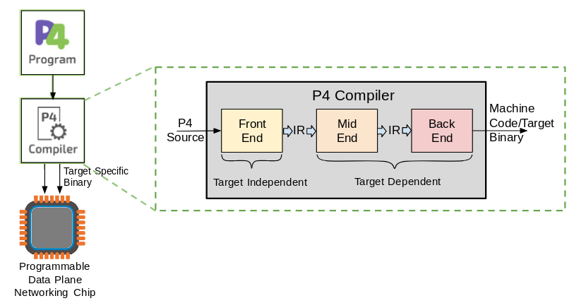

# 背景

软件定义网络(Software Defined Network, SDN)核心在于网络转发设备的数据转发平面(Data Plane)和控制平面(Control Plane)的分离和解耦，以实现可编程、按需定制、集中式统一管理、动态流量监控、自动化部署。2014年P4语言横空出世，进一步提高了面向交换机编程的可行性和效率，成为SDN领域的又一里程碑式的成果。

P4是由P.Bosshart等人提出的一种用于处理数据包转发的高层抽象语言，协议独立(Protocol-Independent)是其核心特点，如OpenFlow一样是一种南向协议，但是其应用范围要比OpenFlow还要大：不仅可以指导数据流转发，更提供了对交换机等网络转发设备的SDN数据平面的编程接口，实现了在设备层对数据处理流程进行软件定义，是真正意义上的软件定义网络。

与华为POF(Protocol Oblivious Forwarding)提出目的类似，P4的提出的目的也是为了解决OpenFlow可编程能力不足及其协议设计本身所带来的高复杂度(Complexity)和较差可扩展性(Scalability)的难题。


# 特性

* 可重配置性(Reconfigurability)
  * 可灵活定义转发设备数据处理流程，且能够做到转发无中断的重配置。OpenFlow能够在已经固化在交换机上的数据处理逻辑之上，通过流表项指导数据流转发处理，而无法重新定义交换机处理数据的逻辑，每次增加新的网络协议支持，都必须将相关设备宕机下线并重新配置后再重新部署上线，即无法在不中断其它数据包转发的情况下弹性支持新协议。而P4语言的卖点恰恰在于其拥有对交换机的数据平面，即数据包处理逻辑即时编程的能力。
* 协议无关性(Protocol-Independence)
  * 交换机等转发设备无需关心协议语法和语义等内容，依然能够完成数据转发任务。这是使用P4可以自定义数据处理逻辑，并通过控制器对交换机等转发设备编程配置实现对应的协议处理逻辑，而这个行为(Behavior)将被翻译成对应的匹配(Match)和动作(Action)，从而被转发设备理解和执行。
* 目标设备无关性(Target-Independence)
  * 正如写C和Java(CPU-oriented Languauge，面向CPU编程语言)代码时并不需要了解CPU的相关信息(型号、参数等等硬件细节)，使用P4语言进行网络编程同样无需关心底层转发设备的具体信息。P4的编译器(Compiler)会将通用的P4语言处理逻辑翻译成设备所能理解的机器指令，并将其写入转发设备，完成配置和编程。


# 基本原理

## 转发模型(Forwarding Model)

论文中提出的数据包转发抽象模型如下图所示，交换机通过一个可编程的解析器(Parser)以及其后紧跟的多个”匹配-动作”操作阶段，或顺序，或并行，或组合两种模式，完成数据包的转发任务。


模型概括了数据包是如何在不同转发设备(包括：以太网交换机、负载均衡器、路由器)中，通过不同技术(包括：固定功能交换机ASIC芯片、网络处理器(Network Processor Unit，NPU)、现场可编程门阵列(Field Programmable Gate Array，FPGA)、可重配置交换机、软件交换机)处理的。

基于此转发模型，设计出P4这样一种数据平面编程语言，用于描述数据包处理逻辑。从此，开发人员只需编写高层抽象的目标无关(Target-Inpendent)的P4程序，而无需关心底层设备细节，编译器会负责将程序映射到不同的底层转发设备，支持设备的种类范围从转发相对较慢的软件交换机到最快的基于ASIC的交换机，编译器都能将P4程序最终翻译成设备能理解并执行的机器指令。

转发模型由两种类型的操作所控制：

* 配置(Configure)：对解析器编程，设置各个匹配-动作阶段的执行顺序，并且指定每个阶段应处理的头部字段；
* 部署(Populate)：动态增加、删除在配置阶段创建的匹配-动作表中的条目(Entry)。

配置操作(Configuration)决定了网络转发设备所支持的协议和数据包处理的逻辑，而部署操作(Population)决定了在给定时间内对数据包应用的处理策略(Policy)。配置与部署实际被设计成两个不同的阶段(Phase)，在配置阶段交换机不需要能够处理数据包，但是需要在部分或者全部重新配置(Reconfigure)阶段依然能够做到无宕机，即无中断的数据包处理。

根据转发模型，数据包到达交换机后，先由解析器处理，由于匹配阶段只需要头部信息(Packet Header)，故将数据体(Packet Body)先分别缓存。解析器识别并提取出特定头部字段，这实际定义了交换机支持的协议类型，在这些字段上面，会执行匹配操作，并根据匹配结果执行相关动作。

被提取的字段随后被传送给匹配-动作表，表被分成两个部分：入口表(Ingress Table)和出口表(Egress Table)。两者都可能会修改数据包头部，入口表决定了数据包的输出端口及其应该被放置的队列。被入口表处理时，数据包可能会被转发、复制(多播、发送至控制平面)、丢弃或触发流量控制。出口表执行对数据包头部的修改，如针对多播数据包的修改。

在不同处理阶段之间，数据包还可以携带额外信息，称作”元数据“，常见的元数据例如：输入端口、目的地址、队列、时间戳和虚拟网络标识符等等。

排队机制(Queuing Discipline)则是借鉴了OpenFlow中的做法：一个动作将一个数据包映射到一个队列，每个队列都会接受某种在交换机配置阶段就选定的服务类型(Service Discipline)的数据包。

与OpenFlow相比，P4的设计有三个优点：

* P4可编程定制数据解析流程，即Programmable Parser，而OpenFlow交换机只支持固定的包处理解析逻辑，即Fixed Parser；
* P4可执行串行(Serial)和并行(Parallel)的Match-Action操作，而OpenFlow仅支持串行操作；
* 由于P4模型包含程序编译器，负责完成将P4程序到具体交换设备配置的映射，从而支持协议无关的转发，而OpenFlow支持的协议需要在初始时配置，此后每次修改都需要宕机，编写新的协议数据包处理逻辑再配置到交换机，不能做到无转发中断的弹性增加所支持的协议。


## 核心部件(Key Component)

### 头部(Header)

对数据包的处理都需要根据包头的字段内容来决定对其采取什么操作，所以在P4程序中需要定义对应的包头。

包头本质上就是有序排列的字段序列，包头由有序的字段名称即对应的字段长度组成，其中以太网和VLAN的包头格式如下：

```c
header ethernet {
    fields {
        dst_addr : 48; // width in bits
        src_addr : 48;
        ethertype : 16;
    }
}

header vlan {
    fields {
        pcp : 3;
        cfi : 1;
        vid : 12;
        ethertype : 16;
    }
}
```


### 解析器(Parser)

在定义了包头之后，还需要定义头部字段之间的关系，及数据包解析的对应关系。

比如以太网头部的ethertype字段在等于0x0800时应该继续跳转至IPv4的头部进行后续解析。下面仍以以太网头部解析(parser ethernet表示本解析器专门用来解析以太网头部)为例：

```c
parser ethernet {
    switch(ethertype)
    {
        case 0x8100: vlan;
        case 0x9100: vlan;
        case 0x0800: ipv4;
        // Other cases
    }
}
```

P4假设底层交换机能实现一个从头到尾遍历数据包头部的状态机(State Machine)，并在该遍历过程中依次提取(Extract)出头部各字段内容，这些字段内容最终会被送到下面介绍的Match-Action表中统一处理。

P4将此状态机描述为一个从一个头部字段到下一个头部字段的转换(Transition)的集合，每次转换由当前头部字段的具体取值所触发。下面我们会描述一个mTag状态机：

```c
parser start {
    ethernet;
}

parser ethernet {
    switch(ethertype)
    {
        case 0x8100: vlan;
        case 0x9100: vlan;
        case 0x0800: ipv4;
        // Other cases
    }
}

parser vlan {
    switch(ethertype)
    {
        case 0xaaaa: mTag;
        case 0x0800: ipv4;
        // Other cases
    }
}

parser mTag {
    switch(ethertype) {
        case 0x0800: ipv4;
        // Other cases
    }
}
```

注意，所有的解析均从start状态开始，并在到达stop状态或出错之后结束。解析器用于将字节流数据解析为对应的协议报文，用于后续的流表项匹配和动作执行。

一旦解析来到一个新的头部，即到达一个新状态，状态机利用其配置信息(Specification)将头部提取出来，并确定其下一次转换。被提取出的头部被转发至交换机流水线后半段执行的Match-Action操作处理。


### 匹配-动作表(Match-Action Table)

P4中需要定义多种类型用途的表用于存储匹配表项，格式为Match+Action，即匹配域(头部部分字段的组合)和对应的执行动作。P4语言定义某个表具体的匹配域及需要执行的动作。而具体的流表项会在网络运行过程中通过控制器来编程下发，从而完成对应数据流的处理。因此，匹配-动作表，实际定义或决定了相关数据包的处理逻辑。

接着上文中mTag的例子，边缘交换机(Edge Switch)会匹配二层目的地址(数据链路层目的地址，即目的MAC地址)和VLAN ID，并且将mTag添加到数据包头部, 从而数据包在交换网络中就可以通过匹配mtag来完成转发。下面P4程序定义了一个表来匹配上述字段，并且对数据包应用一个添加mTag头部的动作。

```c
table mTag_table {
    reads {
        ethernet.dst_addr: exact;
        vlan.vid: exact;
    }
    actions {
        // At runtime, entries are programmed with params
        // for the mTag action, see below.
        add_mTag;
    }
    max_size: 20000
}
```

表中各属性意义如下：

* reads：声明匹配域，即需要匹配的字段，由匹配类型量化，包括：exact(精确匹配，完全匹配)、ternary、ranges(一定范围内)、wildcard(通配符)；
* actions: 列举本表可能对被匹配的数据包采取的动作，动作会在下一小节重点阐述；
* maxsize: 规定本表所能支持的最大条目容量。

为了在后文继续讨论mTag的后续处理流程，还定义了如下三个表：

```c
table source_check {
    // Verify mtag only on ports to the core
    reads {
        mtag: valid; // Was mtag parsed?
        metadata.ingress_port: exact;
    }
    actions {
        // Each table entry specifies one action

        // If inappropriate mTag, send to CPU
        fault_to_cpu;

        // If mtag found, strip and record in metadata
        strip_mtag;

        // Otherwise, allow the packet to continue
        pass;
    }
    max_size: 64; // One rule per port
}

table local_switching {
    // Reads destination and checks if local
    // If miss occurs, goto mtag table
}

table egress_check {
    // Verify egress is resolved
    // Do not retag packets received with tag
    // Reads egress and whether packet was mTagged
}
```


### 动作(Action)

与OpenFlow的动作类似，不过P4程序中的动作是抽象程度更高的协议无关的操作。P4定义了一套协议无关的原始指令集(Primitive，原语)，基于该指令集可以实现复杂的协议操作，这可以通过赋予不同的参数来调用这些原始指令集组合来实现，而这些参数还可以是数据包匹配过程中产生的元数据。

P4假定一个动作函数(Action Function)里的原语都是可并行执行的，而原本不支持并行的交换机则可以通过仿真来实现类似效果。

上文提到的add_mTag动作用P4表述如下：

```c
action add_mTag(up1, up2, down1, down2, egr_spec) {
    add_header(mTag);
    // Copy VLAN ethertype to mTag
    copy_field(mTag.ethertype, vlan.ethertype);
    // Set VLAN's ethertype to signal mTag
    set_field(vlan.ethertype, 0xaaaa);
    set_field(mTag.up1, up1);
    set_field(mTag.up2, up2);
    set_field(mTag.down1, down1);
    set_field(mTag.down2, down2);

    // Set the destination egress port as well
    set_field(metadata.egress_spec, egr_spec);
}
```

从以上程序可以看出mTag动作的执行流程：交换机将mTag插入到VLAN tag之后，将VLAN tag的ethertype赋值给mTag的对应字段从而暗示(Indicate)后面接的字段是VLAN头部，然后将VLAN tag的ethertype赋值为0xaaaa来唤醒parser mTag处理mTag这个新增头部。

P4支持的原语动作集包括：

* set_field：为头部中某个特定字段赋值；
* copy_field：将参数二的字段值赋给参数一代表的字段；
* add_header：将一个特定的头部实例(或其包含的全部字段)设为有效(valid)的；
* remove_header：从一个数据包删除其头部(或其头部包含的全部字段)；
* increment：增加或减小一个字段的值；
* checksum：为一个字段集合计算校验和(如IPv4头部，根据其全部字段计算校验和)。


### 控制程序(Control Program)

一旦表和动作都已完成定义，剩下的任务就是指定从一个表到下一个表的控制流。在P4程序中，控制流通过一系列函数(Functions)、条件(Conditionals)和表引用(Table References)来指定。

控制程序决定了数据包处理阶段的具体顺序，即数据包在不同匹配表中间的跳转关系。当表和动作被定义和实现之后，还需要控制程序来确定不同表之间的控制流。P4的控制流包括用于数据处理的表、判决条件以及条件成立时所需采取的操作等组件。

在边缘交换机上mTag包处理逻辑示例的控制流：

被解析(parser mTag)之后的数据包，先进入source_check表，验证接收到的包和进入端口(Ingress Port)是否和表中的匹配要求一致，即数据包是否包含mTag头部，进入端口是否与核心交换机相连。根据该表中的reads属性匹配到对应数据包后，由action属性指定要采取的动作是：strip_tag，即将mTag头部从数据包中剥落，并将该数据包是否包含mTag头部记录在元数据中，流水线后部分的表可能还会匹配到该元数据，从而避免再次给该数据包打上mTag。

之后local_switching表被执行，如果该表未能成功匹配，发生了misses，则表示该数据包的目的地不是一个与本交换机相连的主机，这时候就需要执行mTag_table。而无论本地局部转发(边缘交换机)还是核心转发(核心交换机)，控制流都会进入egress_check表，用于处理发往未知目的地的数据包，它会向SDN控制栈发送一个通知。

综上，可以将数据包处理流水线表示成如下P4程序：

```c
control main() {
    // Verify mTag state and port are consistent
    table(source_check);

    // If no error from source_check, continue
    if(!defined(metadata.ingress_error)) {
        // Attempt to switch to end hosts
        table(local_switching);

        if(!defined(metadata.egress_spec)) {
            // Not a known local host; try mtagging
            table(mTag_table);
        }

        // Check for unknown egress state pr
        // bad retagging with mTag
        table(egress_check);
    }
}
```


## 编译器(Compiler)

编写P4程序的五个基本组件后，接下来就需要使用编译器将程序编译并写入到交换机中，其主要分为数据解析逻辑的编译写入和控制流程编译写入。



数据解析部分用于将网络字节流解析为对应的协议报文，并将报文送到接下来的控制流程中进行匹配和处理。

控制流程的编译和写入则分为以下两步：

* 将P4程序编译，生成设备无关的表依赖图(Table Dependency Graph, TDG)；
* 根据特定的底层转发设备的资源和能力，将表依赖图映射到转发设备的资源上。

目前P4程序可在软件交换机、拥有RAM和TCAM存储设备的硬件交换机、支持并行表处理的交换机、支持在流水线最后阶段才执行动作的交换机以及拥有少量表资源的交换机等多种交换设备上实现。


## 工作流(Work Flow)

1. 数据包到来后，首先进入可编程定制(Programmable)的解析器，用于实现自定义的数据解析流程(针对头部字段，可将网络字节流解析成对应的协议数据包；
2. 数据包解析完毕后是与OpenFlow类似的匹配-动作操作，其流水线(Pipeline)支持串行和并行两种模式。受OpenFlow 1.4启发，P4设计的匹配过程也分为入口流水线(Ingress Pipeline)和出口流水线(Egress Pipeline)两个分离的数据处理流水线；
3. 在定义交换机的处理逻辑时，需要定义数据包处理的依赖关系(Dependency)，即数据包头部字段之间的依赖关系，比如要处理IPv4头部字段，可能需要依赖于以太网头部字段的处理。这些依赖关系可以通过P4描述出来，并编译生成表依赖图TDG，其中每个表都是对应的一种协议或者一个类别的数据包的处理。TDG描述了匹配表之间的逻辑关系，输入和对应操作等行为，用于指导交换机进行数据处理。TDG被定义出来之后，将被编译器翻译成交换机所能理解的逻辑(机器指令)，并写入到交换机等交换实体中去，从而完成自定义的数据包处理流程。


