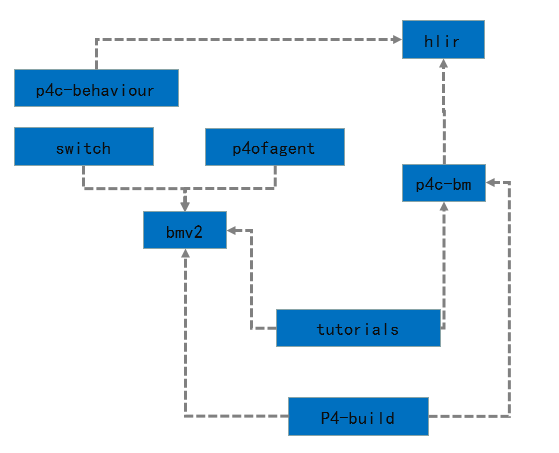
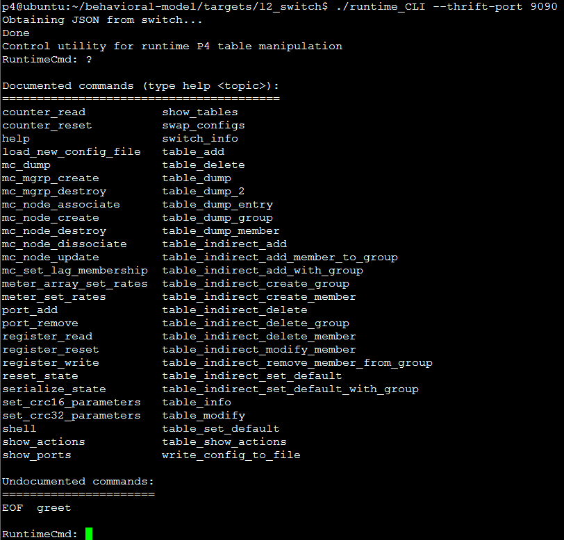
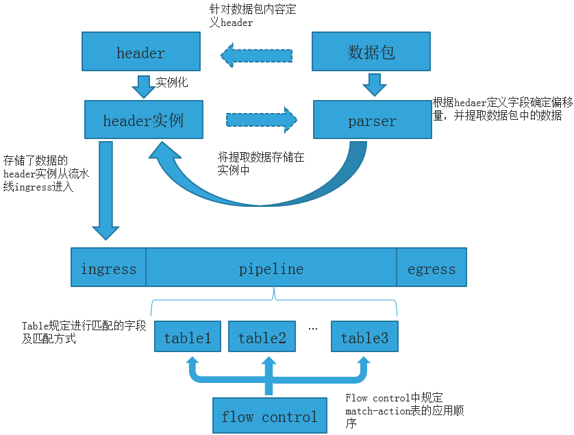
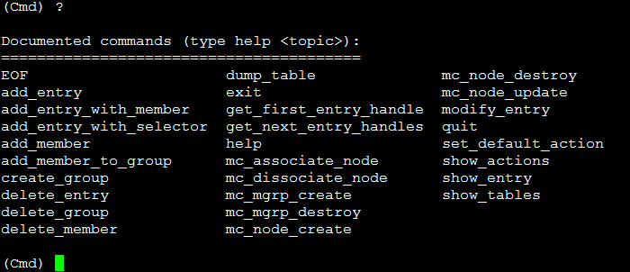

# 系统环境安装

P4项目的官方文档上都是以Ubuntu为例，开始安装环境之前，记得先下载P4项目源码（https://github.com/p4lang）。


# 环境依赖包

P4项目主要由C++和Python语言开发，同时需要对源码进行编译安装，所以需要安装许多环境依赖包。当然，这里并不需要手动将安装每个依赖包，运行p4factory目录下的install_deps.sh脚本，可以一键安装所有的依赖包，包括运行bmv2所必须的thrift、nanomsg和nnpy等组件。


# 模块依赖

P4项目由很多模块组成，部分模块与模块之间存在依赖关系，安装也就必须按照依赖关系先后安装。下图中展示了P4项目主要模块的依赖关系，在进行编译安装时可以参考该依赖关系选择安装顺序。这里需要注意模块依赖图与P4架构图的区别。



To make your life easier,P4项目中对各个子模块的安装提供了完备的脚本，安装了各个子模块后就能直接使用对应模块的CLI脚本，CLI的详细使用方法可以使用-h参数查看命令帮助。


## 安装hlir

```bash
cd p4-hlir
sudo python ./setup install
```
安装后提供的CLI: p4-validate,p4-shell, p4-graphs。


## 安装p4c-bm

```bash
cd p4c-bm
sudo pip install –r requirements.txt
sudo python setup.py install
```
安装后提供的CLI:p4c-bmv2。


## 安装behavioral-model(bmv2)

```bash
cd  behavioral-model
./autogen.sh
./configure
make
```
Bmv2作为交换机提供了一系列的运行时CLI：




## 安装p4factory

P4项目中同时也提供了p4factory模块，该模块可以单独编译运行，目的就是方便用户/开发者快速开始。

```bash
cd p4factory
./autogen.sh
./configure
//创建虚拟以太网口
./sudo p4factory/tools/veth_setup.sh
```


# simple router 实验

P4程序定义数据平面的流程：




## 源代码

simple_router是一个最简三层路由，P4程序源码在p4factory/targets/simple_router/目录下:

```c
#include "includes/headers.p4"
#include "includes/parser.p4"

action _drop() {
    drop();
}

header_type routing_metadata_t {
    fields {
        nhop_ipv4 : 32;
    }
}

metadata routing_metadata_t routing_metadata;

action set_nhop(nhop_ipv4, port) {
    modify_field(routing_metadata.nhop_ipv4, nhop_ipv4);
    modify_field(standard_metadata.egress_spec, port);
    add_to_field(ipv4.ttl, -1);
}

table ipv4_lpm {
    reads {
        ipv4.dstAddr : lpm;
    }
    actions {
        set_nhop;
        _drop;
    }
    size: 1024;
}

action set_dmac(dmac) {
    modify_field(ethernet.dstAddr, dmac);
}

table forward {
    reads {
        routing_metadata.nhop_ipv4 : exact;
    }
    actions {
        set_dmac;
        _drop;
    }
    size: 512;
}

action rewrite_mac(smac) {
    modify_field(ethernet.srcAddr, smac);
}

table send_frame {
    reads {
        standard_metadata.egress_port: exact;
    }
    actions {
        rewrite_mac;
        _drop;
    }
    size: 256;
}

control ingress {
    apply(ipv4_lpm);
    apply(forward);
}

control egress {
    apply(send_frame);
}
```

按照上述的P4程序，可以获取以下信息：

1. simple_router.p4定义的数据面中包换两条pipeline：ingress和egress。
2. ingress中有两级match-action，分别为ipv4_lpm和forward表。
3. egress中有一级match-action，send_frame表。
4. ipv4_lpm table中通过对下一跳IPv4地址(nhop_ipv4)进行最长前缀匹配(lpm)后修改下一跳地址(nhop_ipv4)或修改出端口(egress_port)。
5. forward table中通过对下一跳IPv4地址(nhop_ipv4)进行精确匹配(exact)后可以修改以太网帧的目的mac(dstAddr)或者将包丢弃(drop)。
6. send_frame table中通过对egress_port进行精确匹配后修改源mac地址(srcAddr)或将包丢弃。

parser.p4代码如下:

```c
parser start {
    return parse_ethernet;
}

#define ETHERTYPE_IPV4 0x0800

header ethernet_t ethernet;

parser parse_ethernet {
    extract(ethernet);
    return select(latest.etherType) {
        ETHERTYPE_IPV4 : parse_ipv4;
        default: ingress;
    }
}

header ipv4_t ipv4;

field_list ipv4_checksum_list {
        ipv4.version;
        ipv4.ihl;
        ipv4.diffserv;
        ipv4.totalLen;
        ipv4.identification;
        ipv4.flags;
        ipv4.fragOffset;
        ipv4.ttl;
        ipv4.protocol;
        ipv4.srcAddr;
        ipv4.dstAddr;
}

field_list_calculation ipv4_checksum {
    input {
        ipv4_checksum_list;
    }
    algorithm : csum16;
    output_width : 16;
}

calculated_field ipv4.hdrChecksum  {
    verify ipv4_checksum;
    update ipv4_checksum;
}

parser parse_ipv4 {
    extract(ipv4);
    return ingress;
}
```

按照上述的P4程序，可以获取以下信息：

1. parser都是以start方法开始，以ingress结束。
2. return parse_ethernet表示进入parse_ethernet解析器。
3. parse_ethernet解析器提取(extract)以太网帧包头(header ethernet)数据，根据以太网类型(etherType)进行判断，如果etherType为0x0800（IPv4），则进入pasrse_ipv4解析器。
4. parse_ipv4解析器提取ipv4包头(header ipv4)数据，并通过ingress塞入pipeline。
5. field_list_calculation 是输入一个字段有序字段列表（field-list不含字段长度，区别于header），指定算法(algorithm)和输出长度,然后获取计算结果。parser.p4程序片段中展示的是ipv4校验和(ipv4_checksum)，其中的算法是P4语言内置支持(当然也需要硬件支持)的。

headers.p4代码如下：

```c
header_type ethernet_t {
    fields {
        dstAddr : 48;
        srcAddr : 48;
        etherType : 16;
    }
}

header_type ipv4_t {
    fields {
        version : 4;
        ihl : 4;
        diffserv : 8;
        totalLen : 16;
        identification : 16;
        flags : 3;
        fragOffset : 13;
        ttl : 8;
        protocol : 8;
        hdrChecksum : 16;
        srcAddr : 32;
        dstAddr: 32;
    }
}
```


## 运行

启动simple_router:

```bash
cd p4factory/targets/simple_router
make bm
sudo ./ behavioral-model
```

运行behavioural-model程序会在本地启动一个bmv2，默认PD RPC server地址为127.0.0.1：9090。当在同一台宿主机上启动多个bmv2时，可以使用--pd-server=IP：PORT指定不同的端口，以防止端口占用冲突。更多参数可以使用-h参数查看CLI帮助。启动simple_router之后可以通过运行run_cli.bash脚本，访问simple_router的运行时CLI。

```bash
python ../../cli/pd_cli.py -p simple_router -i p4_pd_rpc.simple_router -s $PWD/tests/pd_thrift:$PWD/../../testutils $@"
```

run_cli.bash脚本中通过pd_cli.py连接到simple_router的运行时CLI，如下图所示:



pd_cli.py可以通过不同的参数指定p4名称，Thrift服务器地址等。

也可以通过P4项目中提供的run_demo.bash脚本一键启动simple_router示例。

run_demo.bash：

```bash
sudo python ../../mininet/1sw_demo.py --behavioral-exe $PWD/behavioral-model
```

run_demo.bash中运行了1sw_demo.py脚本，如果运行脚本时没有添加参数，则默认创建了一个1switch-2host的mininet仿真网络拓扑，其中的switch用bmv2替代，PD RPC server地址，也可以通过参数控制，默认为127.0.0.1:22222。

此时server端口不再是9090，直接运行run_cli.bash脚本就无法连接到运行时CLI(run_cli.bash脚本中没有指定server地址，默认为127.0.0.1:9090)。需要修改run_cli.bash内容，添加脚本运行时参数，修改后的脚本如下所示：

```bash
python ../../cli/pd_cli.py -p simple_router -i p4_pd_rpc.simple_router -s $PWD/tests/pd_thrift:$PWD/../../testutils –c 127.0.0.1:22222 $@"
```

或者直接运行pd_cli.py脚本并添加运行时参数，如下所示：

```bash
./run_cli.bash –c 127.0.0.1:22222
```


## 验证

至此，我们的创建好一个通过P4语言定义的虚拟数据平面。

当然仅有数据平面是无法正确工作的，此时使用mininet中的h1 ping h2是无法ping通的，还需要控制平面的配合，也就是run_add_demo_entries.bash脚本，这个脚本扮演了控制平面这一角色，向simple_router下发流表。
run_add_demo_entries.bash：

```bash
python ../../cli/pd_cli.py -p simple_router -i p4_pd_rpc.simple_router -s $PWD/tests/pd_thrift:$PWD/../../testutils -m "add_entry send_frame 1 rewrite_mac 00:aa:bb:00:00:00" -c localhost:22222
python ../../cli/pd_cli.py -p simple_router -i p4_pd_rpc.simple_router -s $PWD/tests/pd_thrift:$PWD/../../testutils -m "add_entry send_frame 2 rewrite_mac 00:aa:bb:00:00:01" -c localhost:22222
python ../../cli/pd_cli.py -p simple_router -i p4_pd_rpc.simple_router -s $PWD/tests/pd_thrift:$PWD/../../testutils -m "add_entry forward 10.0.0.10 set_dmac 00:04:00:00:00:00" -c localhost:22222
python ../../cli/pd_cli.py -p simple_router -i p4_pd_rpc.simple_router -s $PWD/tests/pd_thrift:$PWD/../../testutils -m "add_entry forward 10.0.1.10 set_dmac 00:04:00:00:00:01" -c localhost:22222
python ../../cli/pd_cli.py -p simple_router -i p4_pd_rpc.simple_router -s $PWD/tests/pd_thrift:$PWD/../../testutils -m "add_entry ipv4_lpm 10.0.0.10 32 set_nhop 10.0.0.10 1" -c localhost:22222
python ../../cli/pd_cli.py -p simple_router -i p4_pd_rpc.simple_router -s $PWD/tests/pd_thrift:$PWD/../../testutils -m "add_entry ipv4_lpm 10.0.1.10 32 set_nhop 10.0.1.10 2" -c localhost:22222
```

run_add_demo_entries.bash脚本中向simple_router中添加了6条流表，这6条流表针对P4程序中定义的forward、ipv4_lpm和send_frame表(table)提供了具体的转发控制。

除了使用pd_cli.py脚本下发流表，也可以通过运行时CLI下发：

```bash
/behavioral-model/tools/runtimeCLI –c 127.0.0.1:22222 < command.txt

command.txt:
table_set_default send_frame _drop
table_set_default forward _drop
table_set_default ipv4_lpm _drop
table_add send_frame rewrite_mac 1 => 00:aa:bb:00:00:00
table_add send_frame rewrite_mac 2 => 00:aa:bb:00:00:01
table_add forward set_dmac 10.0.0.10 => 00:04:00:00:00:00
table_add forward set_dmac 10.0.1.10 => 00:04:00:00:00:01
table_add ipv4_lpm set_nhop 10.0.0.10/32 => 10.0.0.10 1
table_add ipv4_lpm set_nhop 10.0.1.10/32 => 10.0.1.10 2
```

从这些流表下发方法中也可以认识到以下几点：

* 没有控制面下发的流表，仅数据面无法工作。
* 控制面下发的流表必须与P4程序中定义的table相吻合，从匹配字段(match-field)到动作(action).
* P4定义的数据面所对应的控制面，可以是控制器、运行时CLI，也可以是SAI等。

