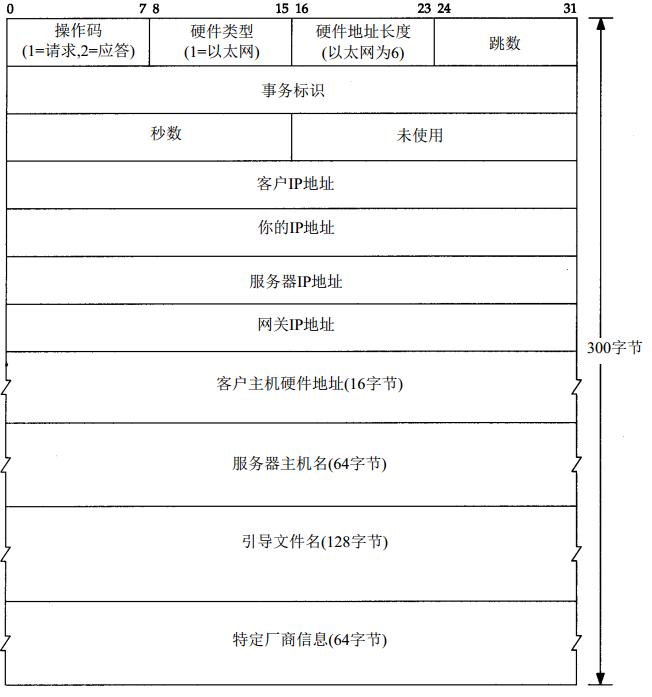
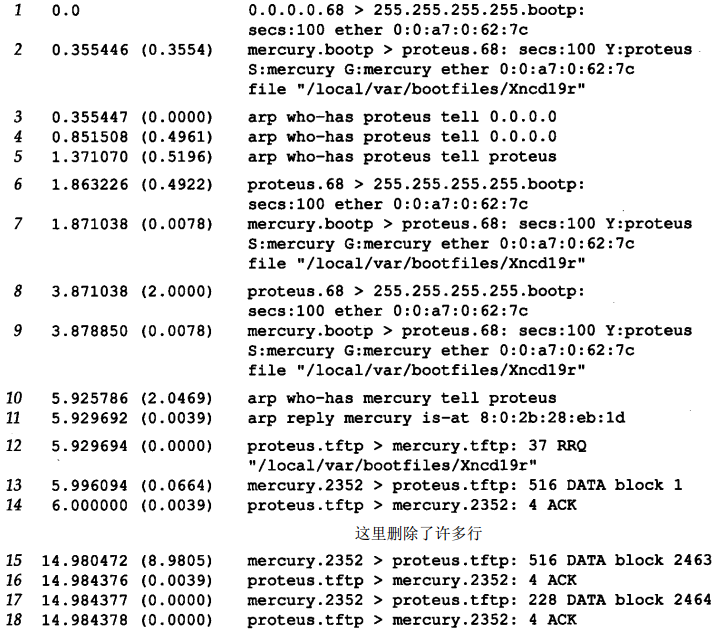

# BOOTP

无盘系统，它在不知道自身IP地址的情况下，在进行系统引导时能够通过RARP来获取它的IP地址。然而使用RARP有两个问题：

* IP地址是返回的唯一结果。
* 既然RARP使用链路层广播，RARP请求就不会被路由器转发（迫使每个实际网络设置一个RARP服务器）。

BOOTP（引导程序协议）是一种用于无盘系统进行系统引导的替代方法。 BOOTP使用UDP，且通常需与TFTP协同工作。

# BOOTP报文格式

BOOTP请求和应答均被封装在UDP数据报中，长度为300字节的BOOTP请求和应答的格式：

* 操作码
   * 1表示请求；
   * 2表示应答；
* 硬件类型
   * 1表示10Mb/s的以太网，这和ARP请求或应答中同名字段表示的含义相同。
* 硬件地址长度
   * 对于以太网，硬件地址长度字段为6字节。
* 跳数
   * 由客户设置为 0，但也能被一个代理服务器设置。
* 事务标识
   * 是一个由客户设置并由服务器返回的32bit整数。客户用它对请求和应答进行匹配。对每个请求，客户应该将该字段设置为一个随机数。
* 秒数
   * 客户开始进行引导时，将“秒数”字段设置为一个时间值。服务器能够看到这个时间值，备用服务器在等待时间超过这个时间值后才会响应客户的请求，这意味着主服务器没有启动。   
* 客户IP地址
   * 如果该客户已经知道自身的IP地址，它将写入“客户IP 地址”字段。否则，它将该字段设置为0。
* 你的IP地址
   * 当客户不知道自身IP地址（客户IP地址置0），服务器用该客户的IP地址写入“你的IP地址”字段。
* 网关IP地址
   * 当客户不知道自身IP地址（客户IP地址置0），且使用了某个代理服务器，则该代理服务器就填写“网关IP地址”字段。  
* 客户硬件地址
   * 客户必须设置它的“客户硬件地址”字段。尽管这个值与以太网数据帧头中的值相同，UDP数据报中也设置这个字段，但任何接收这个数据报的用户进程能很容易地获得它。一个进程通过查看 U D P数据报来确定以太网帧首部中的该字段通常是很困难的（或者说是不可能的） 
* 服务器主机名
   * 是一个空值终止串，由服务器填写。
* 引导文件名字段
   * 服务器填入包括用于系统引导的文件名及其所在位置的路径全名。
* 特定厂商区域
   * 用于对BOOTP进行不同的扩展。 

   
## UDP头

BOOTP使用两个熟知端口：

* BOOTP服务器为67；
* BOOTP客户为68；

BOOTP客户不会选择未用的临时端口，而只用端口68。选择两个端口而不是仅选择一个端口为BOOTP服务器用的原因是：服务器的应答可以进行广播（但通常是不用广播的）：

* 如果服务器的应答是通过广播传送的，同时客户又选择未用的临时端口，那么这些广播也能被其他的主机中碰巧使用相同临时端口的应用进程接收到。因此，采用随机端口（即临时端口）对广播来说是一个不好的选择。
* 如果客户也使用服务器的知名端口（ 6 7）作为它的端口，那么网络内的所有服务器会被唤醒来查看每个广播应答（如果所有的服务器都被唤醒，它们将检查操作码，如果是一个应答而不是请求，就不作处理） 。因此可以让所有的客户使用与服务器知名端口不同的同一知名端口。
* 如果多个客户同时进行系统引导，并且服务器广播所有应答，这样每个客户都会收到其他客户的应答。客户可以通过 B O O T P首部中的事务标识字段来确认应答是否与请求匹配，或者可以通过检查返回的客户硬件地址加以区分。

   
# BOOTP处理流程

1. 来自客户的请求0.0.0.0.68，发送目的站是255.255.255.255.67；
2. 服务器响应，由服务器填写的字段是该客户的IP地址（tcpdump显示为名字proteus）、服务器的IP地址（显示为名字mercury）、网关的IP地址（显示为名字mercury）和引导文件名。
3. 在收到BOOTP应答后，该客户立即发送一个ARP请求来了解网络中其他主机是否有IP地址。跟在who-has后的名字proteus对应目的IP地址 ，发送者的IP地址被设置为0.0.0.0。
4. 它在0.5秒后再发一个相同的ARP请求;
5. 后再过0.5秒又发一个ARP请求。此时它将发送者的IP地址改变为它自己的IP地址。这是一个没有意义的ARP请求；
6. 客户广播另一个BOOTP请求。这个请求与第1行的唯一不同是此时客户将它的IP地址写入IP首部中。
7. 服务器响应 。
8. 该客户在等待2秒后，又广播一个BOOTP请求 。
9. 服务器响应相同的应答。
10. 客户向服务器mercury发送一个ARP请求。
11. 服务器mercury响应ARP请求。
12. 客户发送一个TFTP读请求（TFTP服务监听端口号为69（传输报文的端口动态分配），客户端也使用了69），请求读取它的引导文件。
13. 服务器mercury响应TFTP请求，返回0号数据块。 
14. 客户端发送ACK确认数据块已接收。
15. 重复13-14直到引导文件传输完成。

# BOOTP服务器的设计

BOOTP 服务器将从它的熟知端口（67）读取UDP数据报。BOOTP协议通过将客户的硬件地址放入BOOTP分组中，使得服务器很容易获取客户的硬件地址。

这里出现了一个有趣的问题：TFTP服务器如何能将一个响应直接送回BOOTP客户？这个响应是一个UDP数据报，而服务器知道该客户的IP地址（可能通过读取服务器上的配置文件） 。但如果这个客户向那个IP 地址发送一个UDP数据报（正常情况下会处理UDP的输出），BOOTP服务器的主机就可能向那个IP地址发送一个ARP请求。但这个客户不能响应这个ARP请求，因为它还不知道它自己的IP地址！（这就是在RFC951中被称作“鸡和蛋”的问题。）

有两种解决办法：

* 第一种，通常被Unix服务器采用，是服务器发一个ioctl(2)请求给内核，为该客户在ARP高速缓存中设置一个条目。服务器能一直这么做直到它知道客户的硬件地址和IP地址。这意味着当服务器发送UDP数据报（即BOOTP应答）时，服务器的ARP将在ARP高速缓存中找到该客户的IP地址。
* 另一种可选的解决办法是服务器广播这个BOOTP应答而不直接将应答发回该客户。既然通常期望网络广播越少越好，因此这种解决方案应该只在服务器无法在它的ARP高速缓存设置一个条目的情况下使用。通常只有拥有超级用户权限才能在ARP高速缓存设置一个条目，如果没有这种权限就只能广播BOOTP应答。

